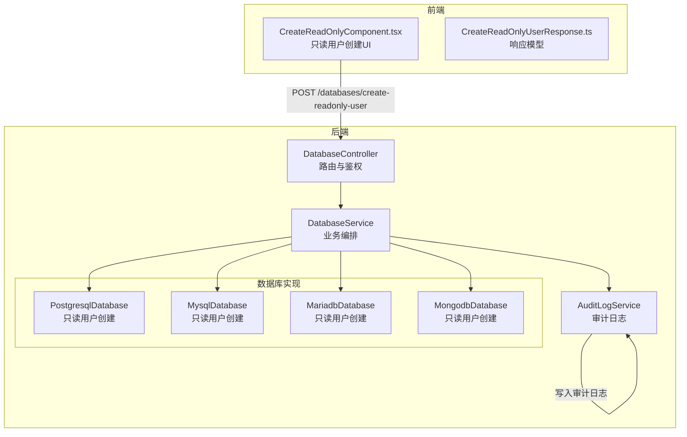
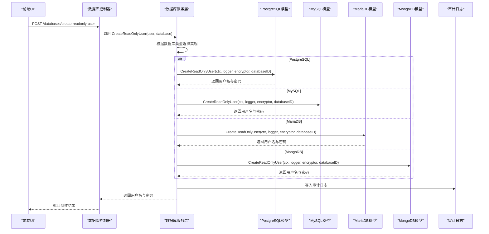
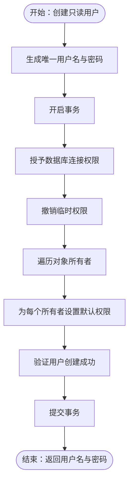
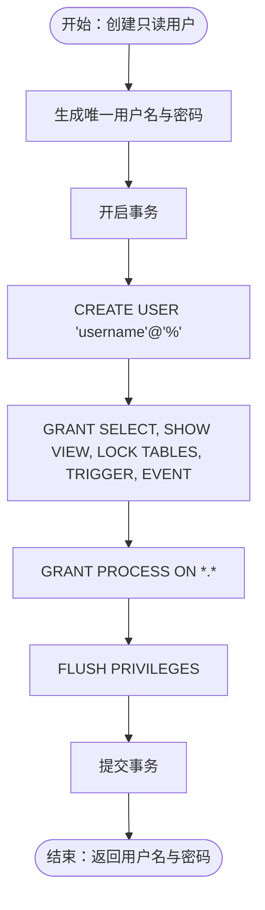
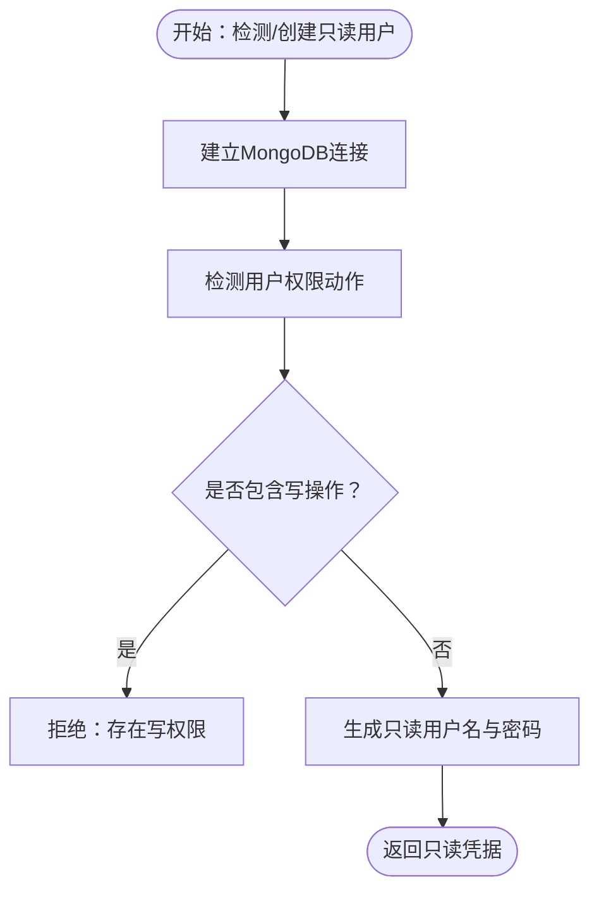
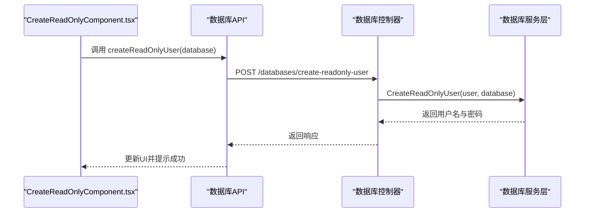
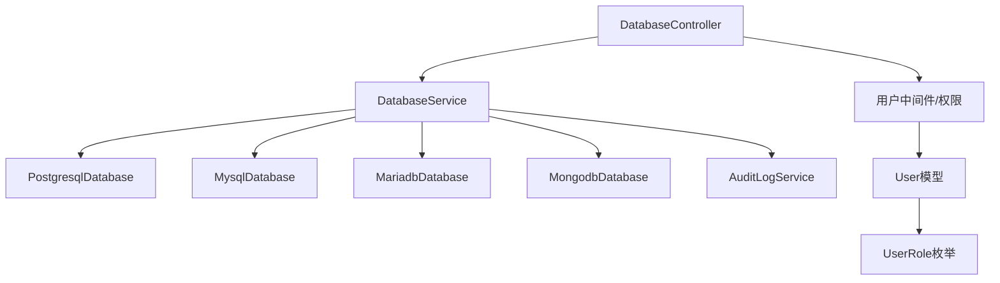

# 只读用户管理

<cite>
**本文档引用的文件**
- [controller.go](file://backend/internal/features/databases/controller.go)
- [service.go](file://backend/internal/features/databases/service.go)
- [postgresql/model.go](file://backend/internal/features/databases/databases/postgresql/model.go)
- [mysql/model.go](file://backend/internal/features/databases/databases/mysql/model.go)
- [mariadb/model.go](file://backend/internal/features/databases/databases/mariadb/model.go)
- [mongodb/model.go](file://backend/internal/features/databases/databases/mongodb/model.go)
- [user.go](file://backend/internal/features/users/models/user.go)
- [user_role.go](file://backend/internal/features/users/enums/user_role.go)
- [interfaces.go](file://backend/internal/features/databases/interfaces.go)
- [models.go](file://backend/internal/features/audit_logs/models.go)
- [errors.go](file://backend/internal/features/audit_logs/errors.go)
- [CreateReadOnlyComponent.tsx](file://frontend/src/features/databases/ui/edit/CreateReadOnlyComponent.tsx)
- [CreateReadOnlyUserResponse.ts](file://frontend/src/entity/databases/model/CreateReadOnlyUserResponse.ts)
- [audit-logs/index.ts](file://frontend/src/entity/audit-logs/index.ts)
- [audit-logs/model/GetAuditLogsResponse.ts](file://frontend/src/entity/audit-logs/model/GetAuditLogsResponse.ts)
</cite>

## 目录
1. [简介](#简介)
2. [项目结构](#项目结构)
3. [核心组件](#核心组件)
4. [架构概览](#架构概览)
5. [详细组件分析](#详细组件分析)
6. [依赖关系分析](#依赖关系分析)
7. [性能考虑](#性能考虑)
8. [故障排除指南](#故障排除指南)
9. [结论](#结论)
10. [附录](#附录)

## 简介
本文件为 Databasus 只读用户管理功能的安全文档，围绕最小权限原则、数据保护策略与合规性要求，系统阐述只读用户的概念、创建流程、跨数据库类型实现差异、安全配置、权限矩阵、监控审计与异常检测，以及在备份、监控、开发测试等场景的最佳实践。

## 项目结构
Databasus 的只读用户管理由后端服务层与前端 UI 层协同完成：
- 后端通过统一的数据库控制器暴露只读用户检查与创建接口，并委派给数据库服务层进行具体实现。
- 数据库服务层根据数据库类型（PostgreSQL、MySQL/MariaDB、MongoDB）调用对应模型的只读用户创建逻辑。
- 前端提供只读用户创建的交互界面，支持 PostgreSQL、MySQL、MariaDB、MongoDB 的只读用户创建与权限展示。

**图表来源**
- [controller.go:31-32](file://backend/internal/features/databases/controller.go#L31-L32)
- [service.go:756-849](file://backend/internal/features/databases/service.go#L756-L849)
- [postgresql/model.go:811-830](file://backend/internal/features/databases/databases/postgresql/model.go#L811-L830)
- [mysql/model.go:301-391](file://backend/internal/features/databases/databases/mysql/model.go#L301-L391)
- [mariadb/model.go:300-387](file://backend/internal/features/databases/databases/mariadb/model.go#L300-L387)
- [mongodb/model.go:388-419](file://backend/internal/features/databases/databases/mongodb/model.go#L388-L419)

**章节来源**
- [controller.go:31-32](file://backend/internal/features/databases/controller.go#L31-L32)
- [service.go:756-849](file://backend/internal/features/databases/service.go#L756-L849)

## 核心组件
- 数据库控制器：提供 `/databases/is-readonly` 和 `/databases/create-readonly-user` 接口，负责请求解析、鉴权与调用服务层。
- 数据库服务层：根据数据库类型分发到具体模型，执行只读用户创建与权限校验，并记录审计日志。
- 数据库模型层：
  - PostgreSQL：创建只读用户并设置默认权限，确保新对象自动继承 SELECT 权限。
  - MySQL/MariaDB：授予 SELECT、SHOW VIEW、LOCK TABLES、TRIGGER、EVENT 与 PROCESS 权限。
  - MongoDB：检测并验证用户权限，确保不包含写操作。
- 用户与权限模型：定义用户角色（ADMIN/MEMBER），用于访问控制与权限判断。
- 审计日志：记录只读用户创建事件，支持全局与工作区范围的日志查看与权限控制。

**章节来源**
- [controller.go:375-446](file://backend/internal/features/databases/controller.go#L375-L446)
- [service.go:756-849](file://backend/internal/features/databases/service.go#L756-L849)
- [postgresql/model.go:811-899](file://backend/internal/features/databases/databases/postgresql/model.go#L811-L899)
- [mysql/model.go:301-391](file://backend/internal/features/databases/databases/mysql/model.go#L301-L391)
- [mariadb/model.go:300-387](file://backend/internal/features/databases/databases/mariadb/model.go#L300-L387)
- [mongodb/model.go:388-419](file://backend/internal/features/databases/databases/mongodb/model.go#L388-L419)
- [user.go:11-59](file://backend/internal/features/users/models/user.go#L11-L59)
- [user_role.go:5-8](file://backend/internal/features/users/enums/user_role.go#L5-L8)
- [models.go:9-19](file://backend/internal/features/audit_logs/models.go#L9-L19)

## 架构概览
下图展示了只读用户创建的端到端流程，从前端发起请求到后端服务层编排，再到各数据库模型执行具体权限设置。

**图表来源**
- [controller.go:410-446](file://backend/internal/features/databases/controller.go#L410-L446)
- [service.go:756-849](file://backend/internal/features/databases/service.go#L756-L849)
- [postgresql/model.go:811-899](file://backend/internal/features/databases/databases/postgresql/model.go#L811-L899)
- [mysql/model.go:301-391](file://backend/internal/features/databases/databases/mysql/model.go#L301-L391)
- [mariadb/model.go:300-387](file://backend/internal/features/databases/databases/mariadb/model.go#L300-L387)
- [mongodb/model.go:388-419](file://backend/internal/features/databases/databases/mongodb/model.go#L388-L419)

## 详细组件分析

### PostgreSQL 只读用户实现
- 创建流程：
  - 生成唯一用户名与复杂密码，使用事务原子化执行用户创建与权限授予。
  - 授予数据库连接权限并撤销临时权限，确保最小权限原则。
  - 遍历现有对象所有者，对每个模式设置默认权限，使未来新表、序列自动继承 SELECT 权限。
- 安全特性：
  - 默认权限设置确保“未来对象”也具备只读访问能力。
  - 连接与临时权限的撤销减少潜在攻击面。
- 失败处理：
  - 重试机制与回滚保证幂等性与一致性。
  - 详细的日志记录便于问题定位。

**图表来源**
- [postgresql/model.go:811-899](file://backend/internal/features/databases/databases/postgresql/model.go#L811-L899)

**章节来源**
- [postgresql/model.go:811-899](file://backend/internal/features/databases/databases/postgresql/model.go#L811-L899)

### MySQL/MariaDB 只读用户实现
- 创建流程：
  - 在事务中创建用户并授予 SELECT、SHOW VIEW、LOCK TABLES、TRIGGER、EVENT 权限。
  - 授予 PROCESS 权限以支持备份工具的元信息查询。
  - 刷新权限缓存，确保权限立即生效。
- 安全特性：
  - 明确的最小权限集合，避免写操作与高危权限。
  - 使用占位符 `'%'` 允许从任意主机连接，便于备份任务执行。
- 失败处理：
  - 重试与回滚保障幂等性；失败时清理未提交状态。

**图表来源**
- [mysql/model.go:301-391](file://backend/internal/features/databases/databases/mysql/model.go#L301-L391)
- [mariadb/model.go:300-387](file://backend/internal/features/databases/databases/mariadb/model.go#L300-L387)

**章节来源**
- [mysql/model.go:301-391](file://backend/internal/features/databases/databases/mysql/model.go#L301-L391)
- [mariadb/model.go:300-387](file://backend/internal/features/databases/databases/mariadb/model.go#L300-L387)

### MongoDB 只读用户实现
- 创建流程：
  - 连接到认证数据库，构建连接 URI 并建立客户端连接。
  - 检测并验证当前用户权限，确保不包含写操作动作。
  - 生成只读用户名与密码，返回给调用方。
- 安全特性：
  - 基于权限动作集合的严格校验，拒绝任何写操作。
  - 支持 SRV 与直连模式，满足不同部署形态需求。
- 失败处理：
  - 连接超时与断开清理，错误信息明确。

**图表来源**
- [mongodb/model.go:388-419](file://backend/internal/features/databases/databases/mongodb/model.go#L388-L419)

**章节来源**
- [mongodb/model.go:388-419](file://backend/internal/features/databases/databases/mongodb/model.go#L388-L419)

### 前端交互与权限展示
- 前端提供只读用户创建组件，支持多种数据库类型。
- 展示当前用户权限列表，支持展开/折叠显示，便于管理员核验。
- 创建成功后，自动填充 PostgreSQL/MySQL/MariaDB 的凭据字段。

**图表来源**
- [CreateReadOnlyComponent.tsx:72-81](file://frontend/src/features/databases/ui/edit/CreateReadOnlyComponent.tsx#L72-L81)
- [controller.go:410-446](file://backend/internal/features/databases/controller.go#L410-L446)
- [service.go:756-849](file://backend/internal/features/databases/service.go#L756-L849)

**章节来源**
- [CreateReadOnlyComponent.tsx:47-81](file://frontend/src/features/databases/ui/edit/CreateReadOnlyComponent.tsx#L47-L81)
- [CreateReadOnlyUserResponse.ts:1-4](file://frontend/src/entity/databases/model/CreateReadOnlyUserResponse.ts#L1-L4)

## 依赖关系分析
- 控制器依赖服务层进行业务编排，服务层再按数据库类型依赖具体模型。
- 审计日志服务被服务层调用以记录关键操作。
- 用户模型与枚举用于权限判断与访问控制。

**图表来源**
- [controller.go:14-18](file://backend/internal/features/databases/controller.go#L14-L18)
- [service.go:26-38](file://backend/internal/features/databases/service.go#L26-L38)
- [user.go:11-59](file://backend/internal/features/users/models/user.go#L11-L59)
- [user_role.go:5-8](file://backend/internal/features/users/enums/user_role.go#L5-L8)

**章节来源**
- [controller.go:14-18](file://backend/internal/features/databases/controller.go#L14-L18)
- [service.go:26-38](file://backend/internal/features/databases/service.go#L26-L38)
- [user.go:11-59](file://backend/internal/features/users/models/user.go#L11-L59)
- [user_role.go:5-8](file://backend/internal/features/users/enums/user_role.go#L5-L8)

## 性能考虑
- 事务原子性：PostgreSQL/MySQL/MariaDB 的只读用户创建均在事务内完成，减少锁竞争与部分成功状态。
- 连接复用与超时：MongoDB 连接设置超时，避免长时间占用资源。
- 权限批量授予：MySQL/MariaDB 一次性授予所需权限并刷新缓存，降低后续查询成本。
- 审计日志异步化：建议将审计写入异步化，避免阻塞主流程。

## 故障排除指南
- 常见错误与处理：
  - 权限不足：检查管理员账户是否具备创建用户与授权的权限。
  - 密码解密失败：确认加密字段与数据库 ID 匹配，重新保存数据库配置。
  - 连接超时：检查网络连通性、防火墙与 TLS 配置。
  - 事务冲突：重试机制已内置，若仍失败，检查并发创建场景。
- 审计日志：
  - 查看只读用户创建事件，定位失败原因与责任人。
  - 全局日志仅管理员可查看，工作区日志按工作区范围隔离。

**章节来源**
- [errors.go:6-12](file://backend/internal/features/audit_logs/errors.go#L6-L12)
- [models.go:9-19](file://backend/internal/features/audit_logs/models.go#L9-L19)

## 结论
Databasus 的只读用户管理遵循最小权限原则，针对不同数据库类型提供精确的权限授予与默认权限配置，结合审计日志与前端交互，形成完整的安全闭环。通过严格的权限校验与可观测性，有效降低数据泄露风险，满足备份、监控与开发测试等场景的安全要求。

## 附录

### 只读用户权限矩阵
- PostgreSQL
  - 连接：允许连接数据库
  - 默认权限：新对象自动继承 SELECT
  - 临时权限：撤销临时权限
- MySQL/MariaDB
  - SELECT：读取数据
  - SHOW VIEW：查看视图定义
  - LOCK TABLES：备份时锁定表
  - TRIGGER/EVENT：支持触发器与事件
  - PROCESS：查看进程与元信息
- MongoDB
  - 角色：read 或等价权限集合
  - 动作：禁止写操作（如 insert、update、delete 等）

**章节来源**
- [postgresql/model.go:811-899](file://backend/internal/features/databases/databases/postgresql/model.go#L811-L899)
- [mysql/model.go:355-370](file://backend/internal/features/databases/databases/mysql/model.go#L355-L370)
- [mariadb/model.go:352-367](file://backend/internal/features/databases/databases/mariadb/model.go#L352-L367)
- [mongodb/model.go:366-383](file://backend/internal/features/databases/databases/mongodb/model.go#L366-L383)

### 安全配置建议
- IP 白名单：限制只读用户连接来源，结合网络 ACL 与防火墙策略。
- 连接限制：设置最大连接数与超时时间，防止资源耗尽。
- 会话管理：启用会话超时与空闲断开，定期轮换密码。
- 最小权限：仅授予必要的只读权限，定期审查与清理。

### 监控、审计与异常检测
- 审计日志：记录只读用户创建、权限变更与访问事件。
- 异常检测：监控连接失败率、权限拒绝与异常登录行为。
- 报告与告警：基于审计日志生成合规报告，配置阈值告警。

**章节来源**
- [models.go:9-19](file://backend/internal/features/audit_logs/models.go#L9-L19)
- [audit-logs/index.ts:1-7](file://frontend/src/entity/audit-logs/index.ts#L1-L7)
- [audit-logs/model/GetAuditLogsResponse.ts:1-8](file://frontend/src/entity/audit-logs/model/GetAuditLogsResponse.ts#L1-L8)

### 应用场景与最佳实践
- 备份：使用只读用户执行备份任务，避免写操作影响生产数据。
- 监控：通过只读用户连接数据库进行指标采集与健康检查。
- 开发测试：为测试环境提供只读凭据，隔离生产数据访问。
- 合规性：最小权限与审计日志满足数据保护与合规要求。