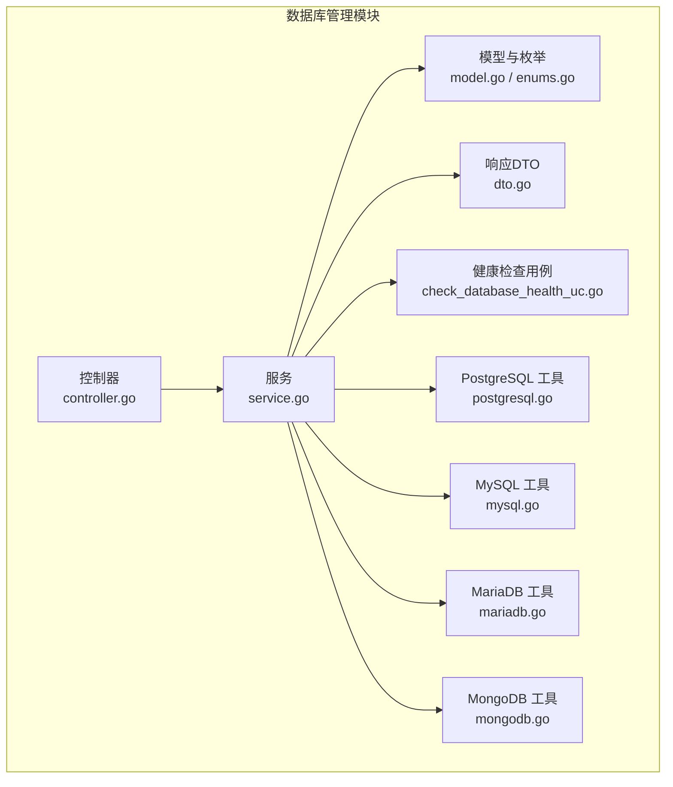
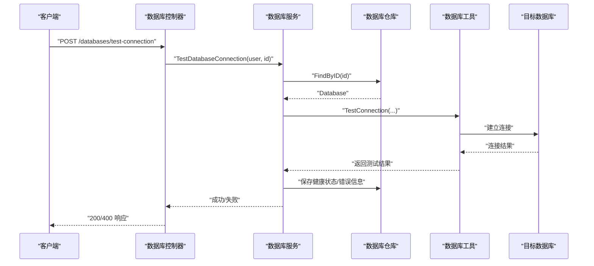
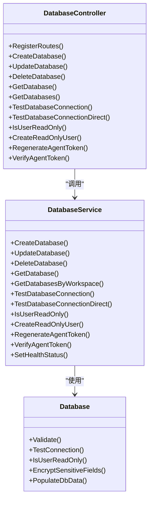

# 数据库管理模块

<cite>
**本文引用的文件**
- [controller.go](file://backend/internal/features/databases/controller.go)
- [service.go](file://backend/internal/features/databases/service.go)
- [model.go](file://backend/internal/features/databases/model.go)
- [dto.go](file://backend/internal/features/databases/dto.go)
- [enums.go](file://backend/internal/features/databases/enums.go)
- [check_database_health_uc.go](file://backend/internal/features/healthcheck/attempt/check_database_health_uc.go)
- [postgresql.go](file://backend/internal/util/tools/postgresql.go)
- [mysql.go](file://backend/internal/util/tools/mysql.go)
- [mariadb.go](file://backend/internal/util/tools/mariadb.go)
- [mongodb.go](file://backend/internal/util/tools/mongodb.go)
- [20251220104453_add_mysql_databases_table.sql](file://backend/migrations/20251220104453_add_mysql_databases_table.sql)
- [20251221100000_add_mariadb_databases_table.sql](file://backend/migrations/20251221100000_add_mariadb_databases_table.sql)
- [20251221195603_add_mongodb_databases_table.sql](file://backend/migrations/20251221195603_add_mongodb_databases_table.sql)
- [20260105165527_add_privileges_to_mysql_mariadb.sql](file://backend/migrations/20260105165527_add_privileges_to_mysql_mariadb.sql)
- [20260209125258_add_mongodb_srv_support.sql](file://backend/migrations/20260209125258_add_mongodb_srv_support.sql)
- [20260221111333_add_mongodb_direct_connection.sql](file://backend/migrations/20260221111333_add_mongodb_direct_connection.sql)
- [20260311094356_add_is_zstd_supported_to_mysql.sql](file://backend/migrations/20260311094356_add_is_zstd_supported_to_mysql.sql)
- [20260327090334_add_is_skipped_to_webhook_records.sql](file://backend/migrations/20260327090334_add_is_skipped_to_webhook_records.sql)
</cite>

## 目录
1. [简介](#简介)
2. [项目结构](#项目结构)
3. [核心组件](#核心组件)
4. [架构总览](#架构总览)
5. [详细组件分析](#详细组件分析)
6. [依赖关系分析](#依赖关系分析)
7. [性能考量](#性能考量)
8. [故障排除指南](#故障排除指南)
9. [结论](#结论)
10. [附录](#附录)

## 简介
本文件为 Databasus 数据库管理模块的功能文档，聚焦于对 PostgreSQL（12-18）、MySQL（5.7-9）、MariaDB（10-12）、MongoDB（4-8）四类数据库的连接配置与管理能力。内容涵盖：
- 连接配置管理：连接字符串格式、连接参数、SSL/TLS 配置、只读用户创建
- 健康检查机制：连接测试、可用性检测、错误记录
- 只读用户管理：权限设置、最小权限原则、安全最佳实践
- 数据库类型特定配置与优化建议
- 实际配置示例与故障排除
- 数据库迁移、升级支持与兼容性考虑

## 项目结构
数据库管理模块位于后端子系统中，采用“控制器-服务-模型-工具”的分层设计，并通过工作区权限控制访问与操作范围。

图表来源
- [controller.go:20-38](file://backend/internal/features/databases/controller.go#L20-L38)
- [service.go:26-38](file://backend/internal/features/databases/service.go#L26-L38)
- [model.go:19-44](file://backend/internal/features/databases/model.go#L19-L44)
- [enums.go:3-17](file://backend/internal/features/databases/enums.go#L3-L17)
- [dto.go:3-15](file://backend/internal/features/databases/dto.go#L3-L15)
- [check_database_health_uc.go](file://backend/internal/features/healthcheck/attempt/check_database_health_uc.go)
- [postgresql.go](file://backend/internal/util/tools/postgresql.go)
- [mysql.go](file://backend/internal/util/tools/mysql.go)
- [mariadb.go](file://backend/internal/util-tools/mariadb.go)
- [mongodb.go](file://backend/internal/util/tools/mongodb.go)

章节来源
- [controller.go:20-38](file://backend/internal/features/databases/controller.go#L20-L38)
- [service.go:26-38](file://backend/internal/features/databases/service.go#L26-L38)
- [model.go:19-44](file://backend/internal/features/databases/model.go#L19-L44)
- [enums.go:3-17](file://backend/internal/features/databases/enums.go#L3-L17)
- [dto.go:3-15](file://backend/internal/features/databases/dto.go#L3-L15)

## 核心组件
- 控制器层：提供 REST 接口，负责鉴权、请求绑定与响应返回；覆盖创建、更新、删除、查询、连接测试、复制、只读用户检查与创建、代理令牌校验等。
- 服务层：实现业务逻辑，包括工作区权限校验、敏感字段加密、连接测试、只读用户检查与创建、代理令牌生成与校验、健康状态维护等。
- 模型层：统一的 Database 结构体聚合各数据库类型的具体配置，提供验证、连接测试、只读检查、敏感数据隐藏、自动填充等方法。
- 工具层：封装各数据库类型的连接参数解析、连接测试、只读权限检测、加密存储等通用能力。
- 健康检查用例：独立的健康检查流程，用于后台任务或定时任务触发的数据库可用性检测。

章节来源
- [controller.go:40-505](file://backend/internal/features/databases/controller.go#L40-L505)
- [service.go:69-800](file://backend/internal/features/databases/service.go#L69-L800)
- [model.go:46-206](file://backend/internal/features/databases/model.go#L46-L206)
- [enums.go:3-17](file://backend/internal/features/databases/enums.go#L3-L17)
- [dto.go:3-15](file://backend/internal/features/databases/dto.go#L3-L15)

## 架构总览
数据库管理模块围绕“统一入口 + 类型分发 + 工具复用”的架构组织，控制器接收请求后委派给服务层，服务层根据数据库类型调用对应工具完成连接测试、只读检查、加密存储等操作。

图表来源
- [controller.go:214-274](file://backend/internal/features/databases/controller.go#L214-L274)
- [service.go:313-379](file://backend/internal/features/databases/service.go#L313-L379)
- [model.go:96-101](file://backend/internal/features/databases/model.go#L96-L101)

## 详细组件分析

### 控制器层（REST API）
- 路由注册：提供创建、更新、删除、查询、连接测试、复制、只读检查与创建、代理令牌校验等接口。
- 权限控制：所有受保护路由均从上下文提取用户并进行鉴权。
- 请求绑定与响应：使用 Gin 的 ShouldBindJSON 绑定请求体，返回标准 JSON 响应或状态码。

章节来源
- [controller.go:20-38](file://backend/internal/features/databases/controller.go#L20-L38)
- [controller.go:52-77](file://backend/internal/features/databases/controller.go#L52-L77)
- [controller.go:91-110](file://backend/internal/features/databases/controller.go#L91-L110)
- [controller.go:122-141](file://backend/internal/features/databases/controller.go#L122-L141)
- [controller.go:153-173](file://backend/internal/features/databases/controller.go#L153-L173)
- [controller.go:186-212](file://backend/internal/features/databases/controller.go#L186-L212)
- [controller.go:224-243](file://backend/internal/features/databases/controller.go#L224-L243)
- [controller.go:255-274](file://backend/internal/features/databases/controller.go#L255-L274)
- [controller.go:388-408](file://backend/internal/features/databases/controller.go#L388-L408)
- [controller.go:423-446](file://backend/internal/features/databases/controller.go#L423-L446)
- [controller.go:491-504](file://backend/internal/features/databases/controller.go#L491-L504)

### 服务层（业务逻辑）
- 权限校验：基于工作区服务判断用户是否具备管理/访问权限。
- 敏感字段处理：在保存前对密码等敏感字段进行加密。
- 连接测试：支持对已保存配置与直接传入配置进行连接测试，并持久化错误信息。
- 健康状态：维护数据库健康状态与最近一次备份时间/错误信息。
- 代理令牌：生成一次性明文令牌并以哈希形式存储，支持校验与重生成。
- 只读用户：根据数据库类型创建具备最小权限的只读用户。

章节来源
- [service.go:69-116](file://backend/internal/features/databases/service.go#L69-L116)
- [service.go:118-197](file://backend/internal/features/databases/service.go#L118-L197)
- [service.go:199-233](file://backend/internal/features/databases/service.go#L199-L233)
- [service.go:235-282](file://backend/internal/features/databases/service.go#L235-L282)
- [service.go:313-379](file://backend/internal/features/databases/service.go#L313-L379)
- [service.go:596-612](file://backend/internal/features/databases/service.go#L596-L612)
- [service.go:614-677](file://backend/internal/features/databases/service.go#L614-L677)
- [service.go:695-754](file://backend/internal/features/databases/service.go#L695-L754)
- [service.go:756-800](file://backend/internal/features/databases/service.go#L756-L800)

### 模型与枚举
- 统一模型：Database 聚合 PostgreSQL、MySQL、MariaDB、MongoDB 的具体配置，提供统一的验证、连接测试、只读检查、敏感数据隐藏与自动填充。
- 枚举类型：数据库类型与健康状态枚举，确保类型安全与可读性。

章节来源
- [model.go:19-44](file://backend/internal/features/databases/model.go#L19-L44)
- [model.go:46-94](file://backend/internal/features/databases/model.go#L46-L94)
- [model.go:96-159](file://backend/internal/features/databases/model.go#L96-L159)
- [enums.go:3-17](file://backend/internal/features/databases/enums.go#L3-L17)

### 健康检查用例
- 后台健康检查：通过独立用例执行数据库可用性检测，便于集成到定时任务或后台服务。
- 错误记录：将最后一次备份错误信息写入数据库，辅助排障。

章节来源
- [check_database_health_uc.go](file://backend/internal/features/healthcheck/attempt/check_database_health_uc.go)

### 工具层（数据库类型特定）
- PostgreSQL：支持版本范围、主机/端口、用户名/密码、数据库名、HTTPS、包含模式、CPU 数等配置；提供连接测试、只读检查、加密存储。
- MySQL：支持版本范围、主机/端口、用户名/密码、数据库名、HTTPS、ZSTD 支持等；提供连接测试、只读检查、加密存储。
- MariaDB：支持版本范围、主机/端口、用户名/密码、数据库名、HTTPS、事件排除等；提供连接测试、只读检查、加密存储。
- MongoDB：支持版本范围、主机/端口、用户名/密码、认证库、HTTPS、SRV 支持、直连模式、CPU 数等；提供连接测试、只读检查、加密存储。

章节来源
- [postgresql.go](file://backend/internal/util/tools/postgresql.go)
- [mysql.go](file://backend/internal/util/tools/mysql.go)
- [mariadb.go](file://backend/internal/util/tools/mariadb.go)
- [mongodb.go](file://backend/internal/util/tools/mongodb.go)

## 依赖关系分析
- 控制器依赖服务层；服务层依赖模型、工具层与工作区/通知等外部服务。
- 数据库类型通过接口分发到具体实现，避免在服务层出现分支逻辑。
- 健康检查与备份流程解耦，通过独立用例与服务协作。

图表来源
- [controller.go:20-505](file://backend/internal/features/databases/controller.go#L20-L505)
- [service.go:69-800](file://backend/internal/features/databases/service.go#L69-L800)
- [model.go:46-206](file://backend/internal/features/databases/model.go#L46-L206)

## 性能考量
- 连接测试超时：只读检查默认使用 15 秒超时，避免阻塞。
- 健康状态与错误信息：仅在连接测试失败时写入错误信息，减少不必要的 I/O。
- 代理令牌：一次性明文令牌仅在生成时返回，其余场景以哈希存储，兼顾安全性与性能。
- 复制与迁移：复制数据库时按类型映射必要字段，避免冗余存储。

章节来源
- [service.go:750-754](file://backend/internal/features/databases/service.go#L750-L754)
- [service.go:614-677](file://backend/internal/features/databases/service.go#L614-L677)
- [service.go:422-542](file://backend/internal/features/databases/service.go#L422-L542)

## 故障排除指南
- 连接失败
  - 检查网络连通性与防火墙策略
  - 确认主机/端口/数据库名/凭据正确
  - 如启用 SSL/TLS，请确认证书链与跳过校验选项
  - 查看最近一次备份错误信息定位问题
- 权限不足
  - 确认当前用户在工作区内具备管理/访问权限
  - 对于只读用户检查，确认凭据具备 SELECT 权限
- 代理令牌无效
  - 重新生成代理令牌并妥善保存一次性明文令牌
  - 使用校验接口确认令牌有效性
- 版本兼容性
  - PostgreSQL：12-18；MySQL：5.7-9；MariaDB：10-12；MongoDB：4-8
  - 按迁移脚本确认特性支持（如 ZSTD、SRV、直连等）

章节来源
- [service.go:313-379](file://backend/internal/features/databases/service.go#L313-L379)
- [service.go:695-754](file://backend/internal/features/databases/service.go#L695-L754)
- [service.go:657-677](file://backend/internal/features/databases/service.go#L657-L677)
- [20260311094356_add_is_zstd_supported_to_mysql.sql](file://backend/migrations/20260311094356_add_is_zstd_supported_to_mysql.sql)
- [20260209125258_add_mongodb_srv_support.sql](file://backend/migrations/20260209125258_add_mongodb_srv_support.sql)
- [20260221111333_add_mongodb_direct_connection.sql](file://backend/migrations/20260221111333_add_mongodb_direct_connection.sql)

## 结论
Databasus 数据库管理模块提供了统一的多数据库连接配置与管理能力，通过严格的权限控制、安全的敏感字段处理、完善的健康检查与只读用户管理，满足生产环境对连接稳定性与安全性的要求。配合迁移脚本与版本特性支持，能够平滑适配不同数据库版本与功能需求。

## 附录

### 数据库类型与版本范围
- PostgreSQL：12-18
- MySQL：5.7-9
- MariaDB：10-12
- MongoDB：4-8

章节来源
- [enums.go:5-10](file://backend/internal/features/databases/enums.go#L5-L10)

### 连接配置要点
- 连接字符串格式：由各数据库工具解析，通常包含主机、端口、数据库名、用户名、密码、SSL 参数等。
- 连接参数设置：版本、HTTPS、包含模式（PostgreSQL）、事件排除（MariaDB）、认证库（MongoDB）、直连模式（MongoDB）等。
- SSL/TLS 配置：支持 HTTPS 与跳过 TLS 校验选项，需结合证书与网络策略使用。
- 只读用户创建：按数据库类型创建具备最小权限的只读用户，用于备份与审计场景。

章节来源
- [model.go:96-159](file://backend/internal/features/databases/model.go#L96-L159)
- [service.go:756-800](file://backend/internal/features/databases/service.go#L756-L800)

### 健康检查机制
- 连接测试：支持对已保存配置与直接传入配置进行测试，并持久化错误信息。
- 可用性检测：通过独立用例定期检测数据库可用性，维护健康状态。
- 性能监控：结合最近备份时间与错误信息，辅助评估数据库性能与稳定性。

章节来源
- [service.go:313-379](file://backend/internal/features/databases/service.go#L313-L379)
- [service.go:596-612](file://backend/internal/features/databases/service.go#L596-L612)
- [check_database_health_uc.go](file://backend/internal/features/healthcheck/attempt/check_database_health_uc.go)

### 只读用户管理
- 权限设置：最小权限原则，仅授予 SELECT 权限。
- 安全最佳实践：定期轮换密码、限制登录来源、审计只读用户活动。
- 创建流程：服务层根据数据库类型调用工具创建只读用户并返回一次性明文密码。

章节来源
- [service.go:695-754](file://backend/internal/features/databases/service.go#L695-L754)
- [service.go:756-800](file://backend/internal/features/databases/service.go#L756-L800)

### 数据库迁移与升级支持
- 迁移脚本：涵盖数据库表结构变更、新增特性字段（如 ZSTD 支持、SRV 支持、直连模式、保留策略等）。
- 兼容性考虑：按版本范围选择数据库工具与配置项，确保功能可用与性能最优。

章节来源
- [20251220104453_add_mysql_databases_table.sql](file://backend/migrations/20251220104453_add_mysql_databases_table.sql)
- [20251221100000_add_mariadb_databases_table.sql](file://backend/migrations/20251221100000_add_mariadb_databases_table.sql)
- [20251221195603_add_mongodb_databases_table.sql](file://backend/migrations/20251221195603_add_mongodb_databases_table.sql)
- [20260105165527_add_privileges_to_mysql_mariadb.sql](file://backend/migrations/20260105165527_add_privileges_to_mysql_mariadb.sql)
- [20260209125258_add_mongodb_srv_support.sql](file://backend/migrations/20260209125258_add_mongodb_srv_support.sql)
- [20260221111333_add_mongodb_direct_connection.sql](file://backend/migrations/20260221111333_add_mongodb_direct_connection.sql)
- [20260311094356_add_is_zstd_supported_to_mysql.sql](file://backend/migrations/20260311094356_add_is_zstd_supported_to_mysql.sql)