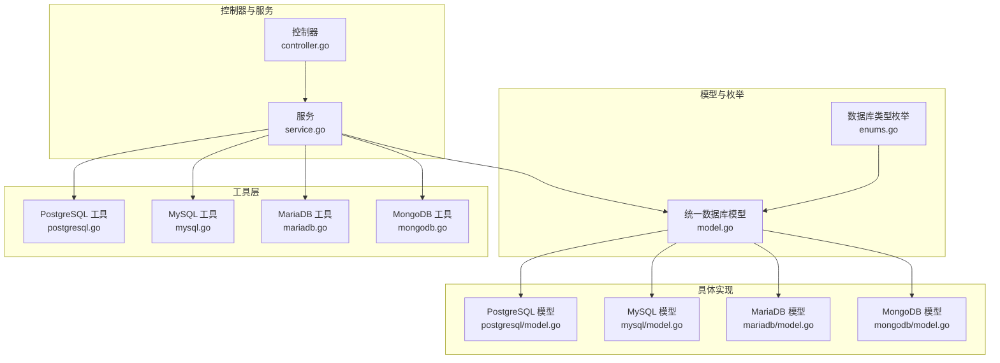
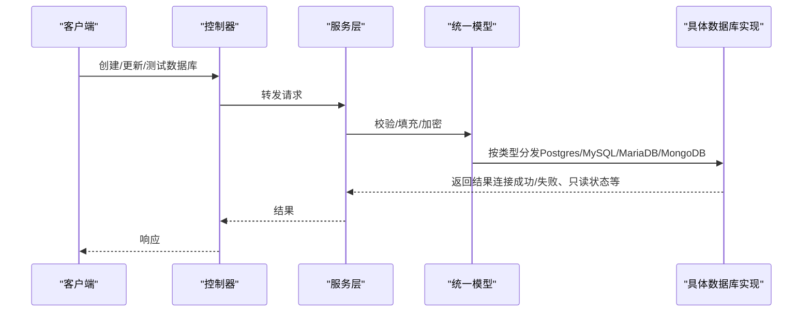
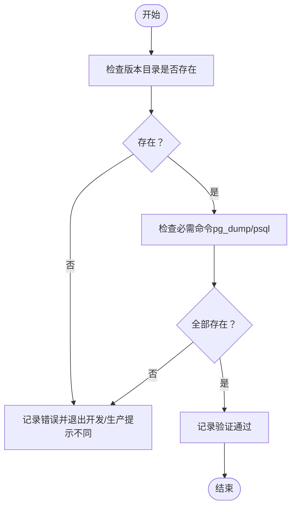
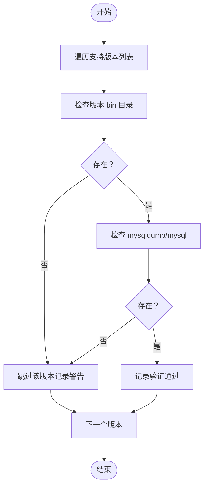
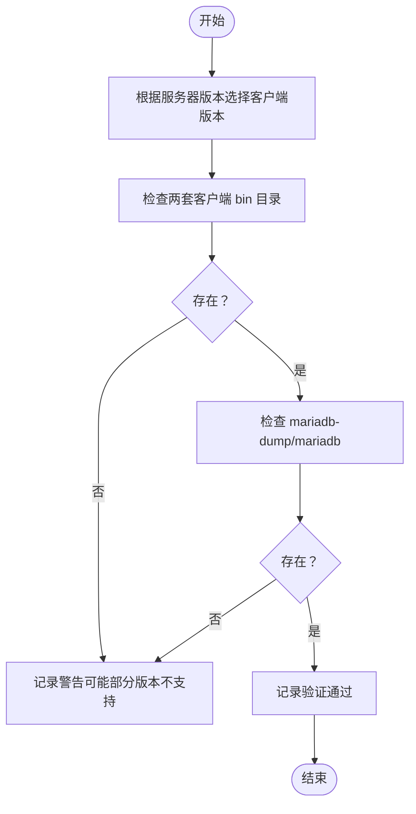
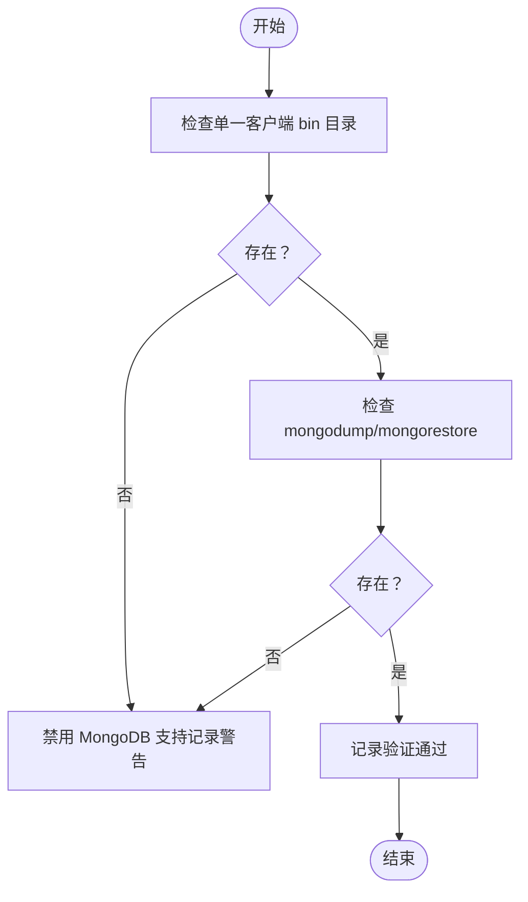
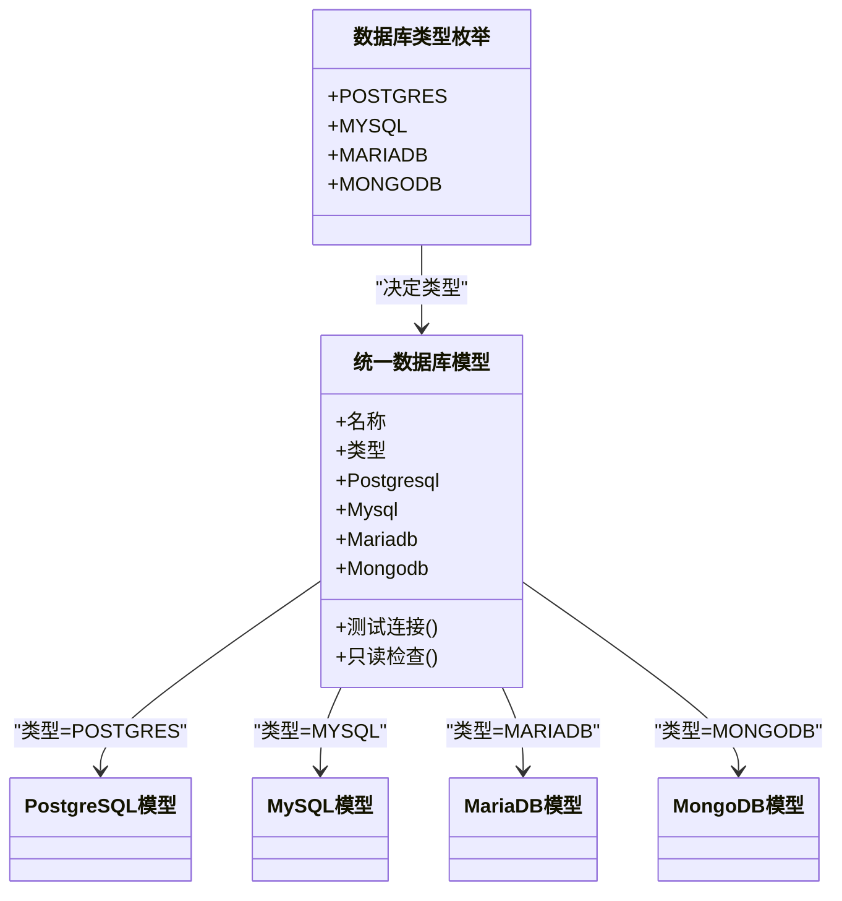

# 数据库类型支持

<cite>
**本文引用的文件**
- [backend/internal/features/databases/enums.go](file://backend/internal/features/databases/enums.go)
- [backend/internal/features/databases/model.go](file://backend/internal/features/databases/model.go)
- [backend/internal/features/databases/controller.go](file://backend/internal/features/databases/controller.go)
- [backend/internal/features/databases/service.go](file://backend/internal/features/databases/service.go)
- [backend/internal/util/tools/postgresql.go](file://backend/internal/util/tools/postgresql.go)
- [backend/internal/util/tools/mysql.go](file://backend/internal/util/tools/mysql.go)
- [backend/internal/util/tools/mariadb.go](file://backend/internal/util/tools/mariadb.go)
- [backend/internal/util/tools/mongodb.go](file://backend/internal/util/tools/mongodb.go)
- [backend/internal/features/databases/databases/postgresql/model.go](file://backend/internal/features/databases/databases/postgresql/model.go)
- [backend/internal/features/databases/databases/mysql/model.go](file://backend/internal/features/databases/databases/mysql/model.go)
- [backend/internal/features/databases/databases/mariadb/model.go](file://backend/internal/features/databases/databases/mariadb/model.go)
- [backend/internal/features/databases/databases/mongodb/model.go](file://backend/internal/features/databases/databases/mongodb/model.go)
- [assets/tools/README.md](file://assets/tools/README.md)
</cite>

## 目录
1. [简介](#简介)
2. [项目结构](#项目结构)
3. [核心组件](#核心组件)
4. [架构总览](#架构总览)
5. [详细组件分析](#详细组件分析)
6. [依赖关系分析](#依赖关系分析)
7. [性能考虑](#性能考虑)
8. [故障排查指南](#故障排查指南)
9. [结论](#结论)
10. [附录](#附录)

## 简介
本文件系统化梳理 Databasus 支持的四种数据库类型：PostgreSQL（版本 12–18）、MySQL（版本 5.7–9）、MariaDB（版本 10–12）、MongoDB（版本 4–8）。内容涵盖：
- 各数据库的特性差异与功能限制
- 版本兼容性矩阵、向后兼容性与升级路径
- 连接字符串格式、参数配置与 SSL/TLS 设置要点
- 版本特定配置项、性能调优建议与已知限制
- 数据库类型检测与自动适配机制

## 项目结构
围绕“数据库类型支持”的核心代码分布在以下模块：
- 枚举与模型层：定义数据库类型枚举、统一数据库模型及多态行为
- 工具层：按版本解析与工具验证逻辑（PostgreSQL/MySQL/MariaDB/MongoDB）
- 具体数据库实现：各数据库的配置模型与能力边界
- 控制器与服务：对外暴露的 API 与业务编排

图表来源
- [backend/internal/features/databases/controller.go:20-34](file://backend/internal/features/databases/controller.go#L20-L34)
- [backend/internal/features/databases/service.go:26-38](file://backend/internal/features/databases/service.go#L26-L38)
- [backend/internal/features/databases/enums.go:3-10](file://backend/internal/features/databases/enums.go#L3-L10)
- [backend/internal/features/databases/model.go:19-44](file://backend/internal/features/databases/model.go#L19-L44)
- [backend/internal/util/tools/postgresql.go:34-166](file://backend/internal/util/tools/postgresql.go#L34-L166)
- [backend/internal/util/tools/mysql.go:49-176](file://backend/internal/util/tools/mysql.go#L49-L176)
- [backend/internal/util/tools/mariadb.go:82-179](file://backend/internal/util/tools/mariadb.go#L82-L179)
- [backend/internal/util/tools/mongodb.go:49-126](file://backend/internal/util/tools/mongodb.go#L49-L126)

章节来源
- [backend/internal/features/databases/controller.go:20-34](file://backend/internal/features/databases/controller.go#L20-L34)
- [backend/internal/features/databases/service.go:26-38](file://backend/internal/features/databases/service.go#L26-L38)
- [backend/internal/features/databases/enums.go:3-10](file://backend/internal/features/databases/enums.go#L3-L10)
- [backend/internal/features/databases/model.go:19-44](file://backend/internal/features/databases/model.go#L19-L44)
- [backend/internal/util/tools/postgresql.go:34-166](file://backend/internal/util/tools/postgresql.go#L34-L166)
- [backend/internal/util/tools/mysql.go:49-176](file://backend/internal/util/tools/mysql.go#L49-L176)
- [backend/internal/util/tools/mariadb.go:82-179](file://backend/internal/util/tools/mariadb.go#L82-L179)
- [backend/internal/util/tools/mongodb.go:49-126](file://backend/internal/util/tools/mongodb.go#L49-L126)

## 核心组件
- 数据库类型枚举：定义 POSTGRES、MYSQL、MARIADB、MONGODB 四类
- 统一数据库模型：通过嵌套子模型承载各数据库的专属字段与行为
- 服务层：负责权限校验、连接测试、只读用户检查、加密存储、监听事件等
- 工具层：按版本定位客户端工具、执行安装验证、生成安全转义字符串

章节来源
- [backend/internal/features/databases/enums.go:3-10](file://backend/internal/features/databases/enums.go#L3-L10)
- [backend/internal/features/databases/model.go:19-75](file://backend/internal/features/databases/model.go#L19-L75)
- [backend/internal/features/databases/service.go:69-116](file://backend/internal/features/databases/service.go#L69-L116)
- [backend/internal/util/tools/postgresql.go:14-32](file://backend/internal/util/tools/postgresql.go#L14-L32)
- [backend/internal/util/tools/mysql.go:30-47](file://backend/internal/util/tools/mysql.go#L30-L47)
- [backend/internal/util/tools/mariadb.go:61-80](file://backend/internal/util/tools/mariadb.go#L61-L80)
- [backend/internal/util/tools/mongodb.go:31-47](file://backend/internal/util/tools/mongodb.go#L31-L47)

## 架构总览
Databasus 的数据库支持采用“统一入口 + 多态适配”模式：
- 控制器接收请求，委派给服务层
- 服务层根据数据库类型分发到对应子模型进行校验、连接测试、只读检查等
- 工具层负责版本化客户端工具的定位与可用性验证
- 具体数据库模型定义各自的字段、约束与能力边界

图表来源
- [backend/internal/features/databases/controller.go:52-77](file://backend/internal/features/databases/controller.go#L52-L77)
- [backend/internal/features/databases/service.go:69-116](file://backend/internal/features/databases/service.go#L69-L116)
- [backend/internal/features/databases/model.go:96-120](file://backend/internal/features/databases/model.go#L96-L120)

## 详细组件分析

### PostgreSQL 支持
- 版本范围：12–18
- 客户端工具：pg_dump、psql
- 开发与生产路径差异：开发使用本地 tools/postgresql/postgresql-{VERSION}/bin；生产使用 /usr/lib/postgresql/{VERSION}/bin
- Windows 特性：在开发环境下对 12、13 的管道恢复存在兼容问题，会回退到 14
- 安全转义：.pgpass 文件字段转义规则
- 备份类型：支持 WAL 管理备份（用于代理管理）

图表来源
- [backend/internal/util/tools/postgresql.go:34-166](file://backend/internal/util/tools/postgresql.go#L34-L166)

章节来源
- [backend/internal/util/tools/postgresql.go:34-166](file://backend/internal/util/tools/postgresql.go#L34-L166)
- [backend/internal/features/databases/databases/postgresql/model.go](file://backend/internal/features/databases/databases/postgresql/model.go)

### MySQL 支持
- 版本范围：5.7、8.0、8.4、9
- 客户端工具：mysqldump、mysql
- 开发与生产路径差异：开发使用 tools/mysql/mysql-{VERSION}/bin；生产使用 /usr/local/mysql-{VERSION}/bin
- 版本比较：提供备份版本与恢复目标版本的比较函数
- 密码转义：.my.cnf 密码特殊字符转义
- 版本枚举：字符串到枚举转换

图表来源
- [backend/internal/util/tools/mysql.go:49-176](file://backend/internal/util/tools/mysql.go#L49-L176)

章节来源
- [backend/internal/util/tools/mysql.go:49-176](file://backend/internal/util/tools/mysql.go#L49-L176)
- [backend/internal/features/databases/databases/mysql/model.go](file://backend/internal/features/databases/databases/mysql/model.go)

### MariaDB 支持
- 版本范围：5.5、10.1、10.2–10.6、10.11、11.4、11.8、12.0
- 客户端版本策略：旧服务器（5.5、10.1）使用 10.6 客户端；新服务器（10.2+）使用 12.1 客户端
- 客户端工具：mariadb-dump、mariadb
- 版本比较：提供备份版本与恢复目标版本的比较函数
- 版本枚举与密码转义

图表来源
- [backend/internal/util/tools/mariadb.go:48-179](file://backend/internal/util/tools/mariadb.go#L48-L179)

章节来源
- [backend/internal/util/tools/mariadb.go:48-179](file://backend/internal/util/tools/mariadb.go#L48-L179)
- [backend/internal/features/databases/databases/mariadb/model.go](file://backend/internal/features/databases/databases/mariadb/model.go)

### MongoDB 支持
- 版本范围：4–8（以主版本为准）
- 客户端工具：mongodump、mongorestore
- 单客户端版本策略：使用单一客户端版本即可兼容所有服务器主版本（向后兼容）
- 版本比较：提供备份版本与恢复目标版本的比较函数
- 版本枚举：支持形如 “X.Y.Z” 的版本字符串，提取主版本号

图表来源
- [backend/internal/util/tools/mongodb.go:49-126](file://backend/internal/util/tools/mongodb.go#L49-L126)

章节来源
- [backend/internal/util/tools/mongodb.go:49-126](file://backend/internal/util/tools/mongodb.go#L49-L126)
- [backend/internal/features/databases/databases/mongodb/model.go](file://backend/internal/features/databases/databases/mongodb/model.go)

## 依赖关系分析
- 类型检测与适配：统一模型通过类型枚举决定调用哪个具体实现
- 工具层依赖：服务层在执行连接测试、只读检查等时，间接依赖工具层提供的版本化工具路径与验证逻辑
- 配置模型：各数据库模型独立定义字段与约束，服务层在保存前进行填充与加密

图表来源
- [backend/internal/features/databases/enums.go:3-10](file://backend/internal/features/databases/enums.go#L3-L10)
- [backend/internal/features/databases/model.go:19-44](file://backend/internal/features/databases/model.go#L19-L44)

章节来源
- [backend/internal/features/databases/enums.go:3-10](file://backend/internal/features/databases/enums.go#L3-L10)
- [backend/internal/features/databases/model.go:19-44](file://backend/internal/features/databases/model.go#L19-L44)

## 性能考虑
- 客户端工具版本化：通过版本化工具减少跨版本兼容性问题，提升备份/恢复稳定性
- Windows 管道兼容：PostgreSQL 在 Windows 上对低版本的管道处理有回退策略，避免失败
- 单客户端兼容：MongoDB 使用单一客户端版本，降低部署复杂度与资源占用
- 只读用户：通过只读用户执行备份可降低对主库的影响

章节来源
- [backend/internal/util/tools/postgresql.go:192-207](file://backend/internal/util/tools/postgresql.go#L192-L207)
- [backend/internal/util/tools/mongodb.go:31-47](file://backend/internal/util/tools/mongodb.go#L31-L47)

## 故障排查指南
- 安装验证失败
  - PostgreSQL：确认版本目录与 pg_dump/psql 存在；开发环境注意 Windows 对 12/13 的回退
  - MySQL：确认版本 bin 目录与 mysqldump/mysql 存在；开发环境记录警告
  - MariaDB：确认 10.6 与 12.1 两套客户端目录；开发环境记录警告
  - MongoDB：确认单一客户端 bin 目录与 mongodump/mongorestore 存在
- 连接测试失败
  - 服务层会记录最后错误消息；检查凭据、网络连通性与 SSL/TLS 配置
- 只读用户检查
  - 仅对 PostgreSQL/MySQL/MariaDB/MongoDB 提供只读检查；若返回不支持，需确认数据库类型

章节来源
- [backend/internal/util/tools/postgresql.go:34-166](file://backend/internal/util/tools/postgresql.go#L34-L166)
- [backend/internal/util/tools/mysql.go:49-176](file://backend/internal/util/tools/mysql.go#L49-L176)
- [backend/internal/util/tools/mariadb.go:82-179](file://backend/internal/util/tools/mariadb.go#L82-L179)
- [backend/internal/util/tools/mongodb.go:49-126](file://backend/internal/util/tools/mongodb.go#L49-L126)
- [backend/internal/features/databases/service.go:313-349](file://backend/internal/features/databases/service.go#L313-L349)

## 结论
Databasus 通过统一模型与工具层版本化策略，实现了对 PostgreSQL、MySQL、MariaDB、MongoDB 的稳定支持。版本化工具与严格的安装验证确保了备份/恢复流程的可靠性；同时，针对不同平台（尤其是 Windows）的兼容性处理提升了整体可用性。

## 附录

### 版本兼容性矩阵与升级路径
- PostgreSQL：12–18；开发环境对 12/13 在 Windows 上回退至 14；生产使用标准路径
- MySQL：5.7、8.0、8.4、9；版本间二进制工具独立；提供备份/恢复版本比较
- MariaDB：5.5、10.1、10.2–10.6、10.11、11.4、11.8、12.0；旧服务器使用 10.6 客户端，新服务器使用 12.1 客户端
- MongoDB：4–8；单客户端版本向后兼容所有主版本

章节来源
- [backend/internal/util/tools/postgresql.go:34-166](file://backend/internal/util/tools/postgresql.go#L34-L166)
- [backend/internal/util/tools/mysql.go:49-176](file://backend/internal/util/tools/mysql.go#L49-L176)
- [backend/internal/util/tools/mariadb.go:48-179](file://backend/internal/util/tools/mariadb.go#L48-L179)
- [backend/internal/util/tools/mongodb.go:49-126](file://backend/internal/util/tools/mongodb.go#L49-L126)

### 连接字符串格式、参数配置与 SSL/TLS 设置
- PostgreSQL
  - 连接参数：主机、端口、数据库名、用户名、密码、SSL 模式（如启用 TLS）
  - .pgpass 转义：对特殊字符进行转义，避免 .pgpass 格式损坏
- MySQL
  - 连接参数：主机、端口、数据库名、用户名、密码、SSL 参数
  - .my.cnf 密码转义：对引号与反斜杠进行转义
- MariaDB
  - 连接参数：主机、端口、数据库名、用户名、密码、SSL 参数
  - 客户端版本选择：根据服务器版本自动选择 10.6 或 12.1 客户端
- MongoDB
  - 连接参数：主机、端口、数据库名、认证数据库、用户名、密码、SSL 参数
  - 主版本兼容：单客户端版本向后兼容

章节来源
- [backend/internal/util/tools/postgresql.go:168-184](file://backend/internal/util/tools/postgresql.go#L168-L184)
- [backend/internal/util/tools/mysql.go:192-199](file://backend/internal/util/tools/mysql.go#L192-L199)
- [backend/internal/util/tools/mariadb.go:232-237](file://backend/internal/util/tools/mariadb.go#L232-L237)
- [backend/internal/util/tools/mongodb.go:143-167](file://backend/internal/util/tools/mongodb.go#L143-L167)

### 版本特定配置选项与性能调优建议
- PostgreSQL
  - CPU 数量：可用于控制并行度（如 WAL 流或并行恢复）
  - 包含模式：可限定备份/恢复的模式集合
- MySQL/MariaDB
  - 备份/恢复版本比较：避免高版本备份在低版本恢复导致失败
- MongoDB
  - 单客户端版本：简化部署与维护成本
- 通用建议
  - 使用只读用户执行备份，降低对主库影响
  - 在 Windows 平台优先使用受支持的客户端版本
  - 生产环境使用标准路径，开发环境使用本地 tools 目录

章节来源
- [backend/internal/features/databases/model.go:19-44](file://backend/internal/features/databases/model.go#L19-L44)
- [backend/internal/util/tools/mysql.go:178-190](file://backend/internal/util/tools/mysql.go#L178-L190)
- [backend/internal/util/tools/mariadb.go:181-200](file://backend/internal/util/tools/mariadb.go#L181-L200)
- [backend/internal/util/tools/mongodb.go:128-141](file://backend/internal/util/tools/mongodb.go#L128-L141)

### 数据库类型检测与自动适配
- 统一模型根据类型枚举选择具体实现
- 工具层根据运行环境（开发/生产）与版本动态定位客户端工具路径
- Windows 平台对特定版本的兼容性回退策略

章节来源
- [backend/internal/features/databases/enums.go:3-10](file://backend/internal/features/databases/enums.go#L3-L10)
- [backend/internal/features/databases/model.go:192-205](file://backend/internal/features/databases/model.go#L192-L205)
- [backend/internal/util/tools/postgresql.go:186-207](file://backend/internal/util/tools/postgresql.go#L186-L207)

### 资源与工具准备
- assets/tools/README.md 中列出了所需客户端工具版本与体积优化策略，便于 CI/CD 快速构建

章节来源
- [assets/tools/README.md:3-17](file://assets/tools/README.md#L3-L17)