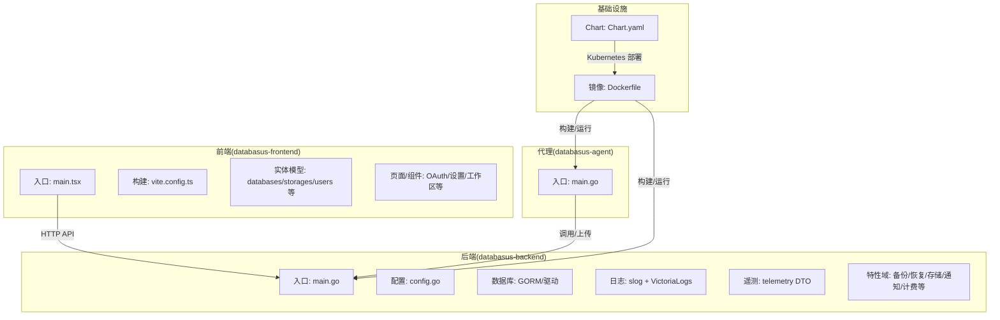
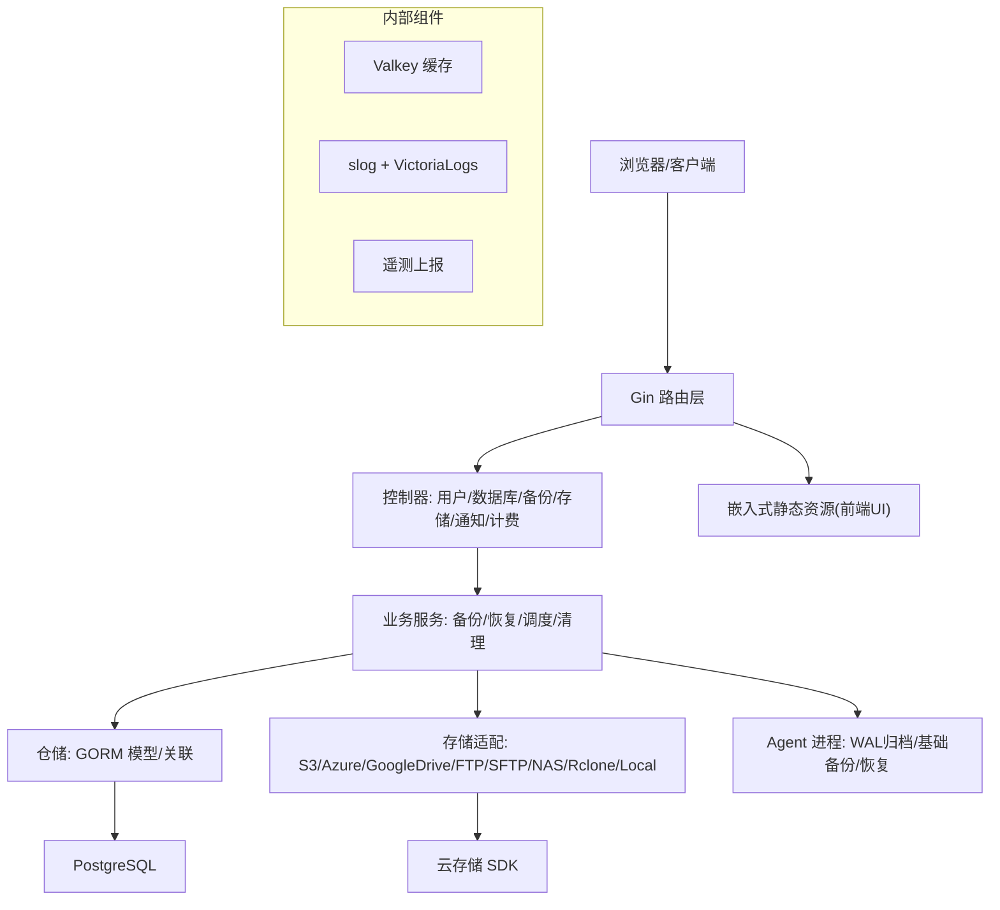
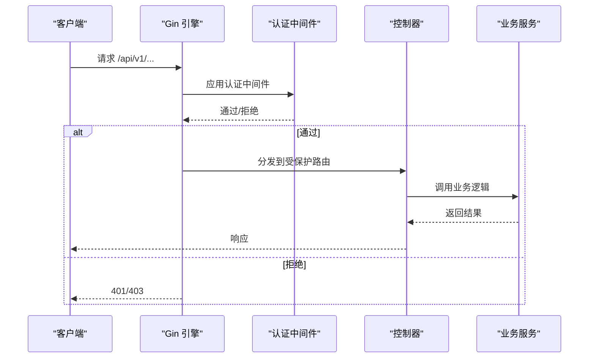
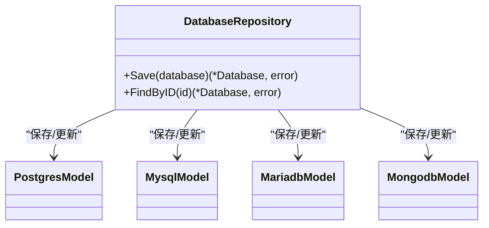
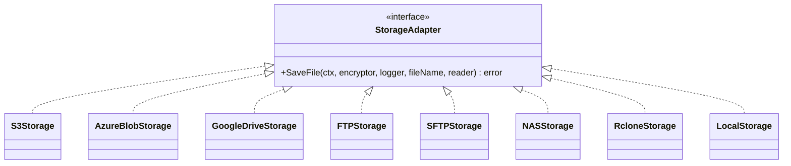
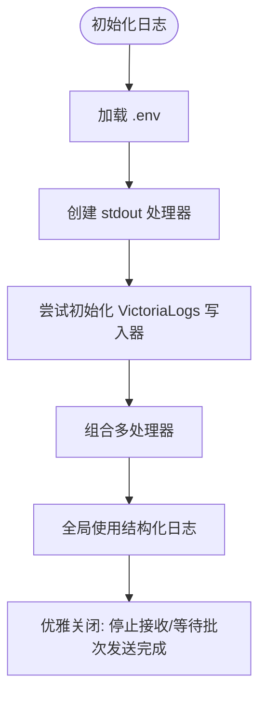
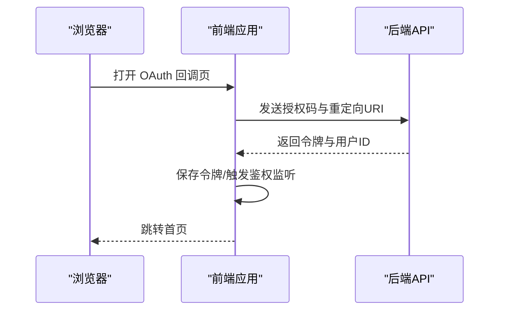
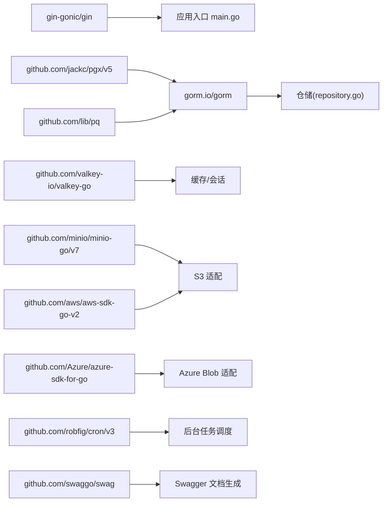

# 技术选型

<cite>
**本文引用的文件**
- [backend/go.mod](file://backend/go.mod)
- [backend/cmd/main.go](file://backend/cmd/main.go)
- [backend/internal/config/config.go](file://backend/internal/config/config.go)
- [backend/internal/features/databases/enums.go](file://backend/internal/features/databases/enums.go)
- [backend/internal/features/databases/repository.go](file://backend/internal/features/databases/repository.go)
- [backend/internal/features/databases/databases/mongodb/model.go](file://backend/internal/features/databases/databases/mongodb/model.go)
- [backend/internal/features/storages/models/azure_blob/model.go](file://backend/internal/features/storages/models/azure_blob/model.go)
- [backend/internal/features/storages/models/google_drive/model.go](file://backend/internal/features/storages/models/google_drive/model.go)
- [backend/internal/features/storages/model_test.go](file://backend/internal/features/storages/model_test.go)
- [backend/internal/util/logger/logger.go](file://backend/internal/util/logger/logger.go)
- [backend/internal/util/logger/multi_handler.go](file://backend/internal/util/logger/multi_handler.go)
- [backend/internal/util/logger/victorialogs_writer.go](file://backend/internal/util/logger/victorialogs_writer.go)
- [backend/internal/features/telemetry/dto.go](file://backend/internal/features/telemetry/dto.go)
- [frontend/package.json](file://frontend/package.json)
- [frontend/src/main.tsx](file://frontend/src/main.tsx)
- [frontend/vite.config.ts](file://frontend/vite.config.ts)
- [frontend/src/entity/databases/model/DatabaseType.ts](file://frontend/src/entity/databases/model/DatabaseType.ts)
- [frontend/src/entity/storages/models/GoogleDriveStorage.ts](file://frontend/src/entity/storages/models/GoogleDriveStorage.ts)
- [frontend/src/pages/OAuthCallbackPage.tsx](file://frontend/src/pages/OAuthCallbackPage.tsx)
- [frontend/src/features/users/ui/oauth/GithubOAuthComponent.tsx](file://frontend/src/features/users/ui/oauth/GithubOAuthComponent.tsx)
- [frontend/src/entity/users/api/userApi.ts](file://frontend/src/entity/users/api/userApi.ts)
- [agent/go.mod](file://agent/go.mod)
- [agent/cmd/main.go](file://agent/cmd/main.go)
- [Dockerfile](file://Dockerfile)
- [deploy/helm/Chart.yaml](file://deploy/helm/Chart.yaml)
</cite>

## 目录
1. [简介](#简介)
2. [项目结构](#项目结构)
3. [核心组件](#核心组件)
4. [架构总览](#架构总览)
5. [详细组件分析](#详细组件分析)
6. [依赖分析](#依赖分析)
7. [性能考量](#性能考量)
8. [故障排查指南](#故障排查指南)
9. [结论](#结论)
10. [附录](#附录)

## 简介
本文件面向Databasus项目的“技术选型”主题，系统梳理并解释后端Go生态（Gin、GORM、Valkey、数据库驱动等）、前端React+TypeScript、云存储SDK集成、容器与部署（Docker/Helm）以及安全与可观测性等关键技术栈的选择理由、优势、替代方案对比、版本兼容性、依赖管理策略、安全考虑与约束影响，并提供技术栈图表与依赖关系图。

## 项目结构
Databasus采用多模块分层组织：后端服务、前端应用、代理Agent、容器镜像构建脚本与Helm Chart。后端以模块化特性域划分（如备份、恢复、存储、通知、计费等），前端按实体与功能域组织，Agent负责远端数据库的归档与恢复任务。

图表来源
- [backend/cmd/main.go:1-137](file://backend/cmd/main.go#L1-L137)
- [frontend/src/main.tsx:1-14](file://frontend/src/main.tsx#L1-L14)
- [agent/cmd/main.go:1-246](file://agent/cmd/main.go#L1-L246)
- [Dockerfile:1-546](file://Dockerfile#L1-L546)
- [deploy/helm/Chart.yaml:1-23](file://deploy/helm/Chart.yaml#L1-L23)

章节来源
- [backend/cmd/main.go:1-137](file://backend/cmd/main.go#L1-L137)
- [frontend/src/main.tsx:1-14](file://frontend/src/main.tsx#L1-L14)
- [agent/cmd/main.go:1-246](file://agent/cmd/main.go#L1-L246)
- [Dockerfile:1-546](file://Dockerfile#L1-L546)
- [deploy/helm/Chart.yaml:1-23](file://deploy/helm/Chart.yaml#L1-L23)

## 核心组件
- 后端框架与路由：Gin（含CORS、GZIP中间件）
- 数据库访问：GORM + PostgreSQL驱动
- 缓存：Valkey（本地缓存，用于会话、速率限制、事件发布订阅等）
- 存储适配：S3、Azure Blob、Google Drive、FTP、SFTP、NAS、Rclone、本地
- 日志与可观测：slog结构化日志 + VictoriaLogs写入器（可选）
- 遥测：匿名实例遥测（版本、OS/架构、数据库类型、存储/通知类型）
- 前端：React 19 + TypeScript + Vite + TailwindCSS + Ant Design
- 容器与部署：Docker 多阶段构建 + Helm Chart
- 代理：独立Agent二进制，负责远端数据库的WAL归档与基础备份

章节来源
- [backend/go.mod:5-34](file://backend/go.mod#L5-L34)
- [backend/cmd/main.go:17-21](file://backend/cmd/main.go#L17-L21)
- [backend/internal/util/logger/logger.go:14-62](file://backend/internal/util/logger/logger.go#L14-L62)
- [backend/internal/features/telemetry/dto.go:1-17](file://backend/internal/features/telemetry/dto.go#L1-L17)
- [frontend/package.json:15-25](file://frontend/package.json#L15-L25)
- [frontend/vite.config.ts:1-9](file://frontend/vite.config.ts#L1-L9)
- [agent/go.mod:5-10](file://agent/go.mod#L5-L10)
- [Dockerfile:107-172](file://Dockerfile#L107-L172)
- [deploy/helm/Chart.yaml:1-23](file://deploy/helm/Chart.yaml#L1-L23)

## 架构总览
后端作为统一API网关，前端通过HTTP与之交互；代理在远端数据库侧执行备份/恢复任务并通过后端进行协调。存储适配器抽象了多种云/本地存储，数据库访问通过GORM实现跨数据库一致性。

图表来源
- [backend/cmd/main.go:213-276](file://backend/cmd/main.go#L213-L276)
- [backend/internal/features/storages/models/azure_blob/model.go:53-87](file://backend/internal/features/storages/models/azure_blob/model.go#L53-L87)
- [backend/internal/features/storages/models/google_drive/model.go:534-585](file://backend/internal/features/storages/models/google_drive/model.go#L534-L585)
- [Dockerfile:253-266](file://Dockerfile#L253-L266)

章节来源
- [backend/cmd/main.go:213-276](file://backend/cmd/main.go#L213-L276)
- [backend/internal/features/storages/models/azure_blob/model.go:53-87](file://backend/internal/features/storages/models/azure_blob/model.go#L53-L87)
- [backend/internal/features/storages/models/google_drive/model.go:534-585](file://backend/internal/features/storages/models/google_drive/model.go#L534-L585)
- [Dockerfile:253-266](file://Dockerfile#L253-L266)

## 详细组件分析

### 后端框架与路由（Gin）
- 选择理由：高性能、中间件生态丰富（CORS、GZIP、Swagger），适合API服务。
- 中间件：GZIP压缩、CORS、日志、panic恢复、Swagger文档生成。
- 路由：公开/受保护路由分离，认证中间件按需注入。
- 静态资源：嵌入前端构建产物，支持SPA回退到index.html。

图表来源
- [backend/cmd/main.go:213-257](file://backend/cmd/main.go#L213-L257)
- [backend/cmd/main.go:459-476](file://backend/cmd/main.go#L459-L476)

章节来源
- [backend/cmd/main.go:17-21](file://backend/cmd/main.go#L17-L21)
- [backend/cmd/main.go:112-127](file://backend/cmd/main.go#L112-L127)
- [backend/cmd/main.go:213-257](file://backend/cmd/main.go#L213-L257)
- [backend/cmd/main.go:459-476](file://backend/cmd/main.go#L459-L476)

### 数据库访问（GORM + PostgreSQL）
- 选择理由：Go生态主流ORM，支持事务、预加载、关联、迁移工具。
- 实体设计：统一仓储接口，按数据库类型（Postgres、MySQL、MariaDB、MongoDB）分别建模与保存。
- 关系映射：通过GORM Association维护多对多（如数据库与通知器）。

图表来源
- [backend/internal/features/databases/repository.go:16-129](file://backend/internal/features/databases/repository.go#L16-L129)
- [backend/internal/features/databases/enums.go:3-17](file://backend/internal/features/databases/enums.go#L3-L17)
- [backend/internal/features/databases/databases/mongodb/model.go:22-35](file://backend/internal/features/databases/databases/mongodb/model.go#L22-L35)

章节来源
- [backend/internal/features/databases/repository.go:16-129](file://backend/internal/features/databases/repository.go#L16-L129)
- [backend/internal/features/databases/enums.go:3-17](file://backend/internal/features/databases/enums.go#L3-L17)
- [backend/internal/features/databases/databases/mongodb/model.go:22-35](file://backend/internal/features/databases/databases/mongodb/model.go#L22-L35)

### 缓存与会话（Valkey）
- 选择理由：高性能键值存储，满足会话、限流、发布订阅等场景。
- 配置：容器内本地Valkey，保护模式开启，内存上限控制。
- 使用：缓存连接测试、清理、速率限制、事件发布订阅等。

章节来源
- [Dockerfile:386-409](file://Dockerfile#L386-L409)
- [backend/cmd/main.go:66-78](file://backend/cmd/main.go#L66-L78)

### 存储适配与云SDK集成
- 支持：S3、Azure Blob、Google Drive、FTP、SFTP、NAS、Rclone、本地。
- SDK：AWS SDK v2（S3）、Azure SDK（azblob）、MinIO客户端、SFTP/FTP客户端、Rclone进程调用。
- 认证：敏感凭据加密存储，按需解密使用；Google Drive使用OAuth TokenSource。

图表来源
- [backend/internal/features/storages/models/azure_blob/model.go:53-87](file://backend/internal/features/storages/models/azure_blob/model.go#L53-L87)
- [backend/internal/features/storages/models/google_drive/model.go:534-585](file://backend/internal/features/storages/models/google_drive/model.go#L534-L585)
- [backend/internal/features/storages/model_test.go:14-46](file://backend/internal/features/storages/model_test.go#L14-L46)

章节来源
- [backend/internal/features/storages/models/azure_blob/model.go:53-87](file://backend/internal/features/storages/models/azure_blob/model.go#L53-L87)
- [backend/internal/features/storages/models/google_drive/model.go:534-585](file://backend/internal/features/storages/models/google_drive/model.go#L534-L585)
- [backend/internal/features/storages/model_test.go:14-46](file://backend/internal/features/storages/model_test.go#L14-L46)

### 日志与可观测性（slog + VictoriaLogs）
- 结构化日志：slog文本处理器，统一时间格式与字段。
- 多路复用：stdout + VictoriaLogs（可选），支持批量发送与重试。
- 关闭流程：优雅关闭，避免日志丢失。

图表来源
- [backend/internal/util/logger/logger.go:19-79](file://backend/internal/util/logger/logger.go#L19-L79)
- [backend/internal/util/logger/multi_handler.go:8-65](file://backend/internal/util/logger/multi_handler.go#L8-L65)
- [backend/internal/util/logger/victorialogs_writer.go:37-95](file://backend/internal/util/logger/victorialogs_writer.go#L37-L95)

章节来源
- [backend/internal/util/logger/logger.go:19-79](file://backend/internal/util/logger/logger.go#L19-L79)
- [backend/internal/util/logger/multi_handler.go:8-65](file://backend/internal/util/logger/multi_handler.go#L8-L65)
- [backend/internal/util/logger/victorialogs_writer.go:37-95](file://backend/internal/util/logger/victorialogs_writer.go#L37-L95)

### 遥测与匿名数据收集
- 内容：实例ID、应用版本、操作系统/架构、已安装数据库类型、存储/通知器集合。
- 默认启用，可通过环境变量禁用。
- 用途：产品健康度与生态洞察。

章节来源
- [backend/internal/features/telemetry/dto.go:1-17](file://backend/internal/features/telemetry/dto.go#L1-L17)
- [backend/cmd/main.go:278-291](file://backend/cmd/main.go#L278-L291)

### 前端技术栈（React + TypeScript + Vite）
- 框架：React 19 + TypeScript
- 构建：Vite + TailwindCSS + Ant Design
- 运行时配置：容器启动时动态注入运行时配置（如OAuth客户端ID、Turnstile站点密钥、云模式参数等）。
- 页面与API：OAuth回调、用户登录、设置、工作区等页面与对应API封装。

图表来源
- [frontend/src/pages/OAuthCallbackPage.tsx:9-47](file://frontend/src/pages/OAuthCallbackPage.tsx#L9-L47)
- [frontend/src/features/users/ui/oauth/GithubOAuthComponent.tsx:6-38](file://frontend/src/features/users/ui/oauth/GithubOAuthComponent.tsx#L6-L38)
- [frontend/src/entity/users/api/userApi.ts:119-145](file://frontend/src/entity/users/api/userApi.ts#L119-L145)

章节来源
- [frontend/package.json:15-25](file://frontend/package.json#L15-L25)
- [frontend/vite.config.ts:1-9](file://frontend/vite.config.ts#L1-L9)
- [frontend/src/main.tsx:1-14](file://frontend/src/main.tsx#L1-L14)
- [frontend/src/pages/OAuthCallbackPage.tsx:9-47](file://frontend/src/pages/OAuthCallbackPage.tsx#L9-L47)
- [frontend/src/features/users/ui/oauth/GithubOAuthComponent.tsx:6-38](file://frontend/src/features/users/ui/oauth/GithubOAuthComponent.tsx#L6-L38)
- [frontend/src/entity/users/api/userApi.ts:119-145](file://frontend/src/entity/users/api/userApi.ts#L119-L145)

### 代理（Agent）与远端数据库协作
- 功能：WAL归档、基础备份、恢复、自动升级检查、守护进程管理。
- 通信：通过后端提供的Agent二进制下载接口获取对应架构的Agent可执行文件。
- 安全：令牌校验，必要时跳过更新检查。

章节来源
- [agent/cmd/main.go:24-97](file://agent/cmd/main.go#L24-L97)
- [agent/cmd/main.go:117-160](file://agent/cmd/main.go#L117-L160)
- [Dockerfile:264-266](file://Dockerfile#L264-L266)

### 容器与部署（Docker/Helm）
- Docker：多阶段构建，前端构建、后端编译、Agent二进制构建、运行时镜像安装PostgreSQL/Valkey/rclone客户端工具。
- 运行时：启动Valkey、初始化/启动PostgreSQL、注入运行时配置、挂载数据卷、暴露端口。
- Helm：Chart定义应用元信息与图标，便于Kubernetes部署。

章节来源
- [Dockerfile:1-546](file://Dockerfile#L1-L546)
- [deploy/helm/Chart.yaml:1-23](file://deploy/helm/Chart.yaml#L1-L23)

## 依赖分析

### 后端依赖关系（Go模块）
- Web框架：gin-gonic/gin
- ORM：gorm.io/gorm + gorm.io/driver/postgres
- 数据库驱动：lib/pq、jackc/pgx/v5
- 缓存：valkey-io/valkey-go
- 存储SDK：minio/minio-go/v7、Azure SDK azblob、aws-sdk-go-v2
- 工具与调度：cron/v3、gopsutil、godotenv、cleanenv
- 文档：swaggo/gin-swagger、swaggo/swag
- 测试：testify

图表来源
- [backend/go.mod:5-34](file://backend/go.mod#L5-L34)
- [backend/cmd/main.go:213-276](file://backend/cmd/main.go#L213-L276)
- [backend/internal/features/storages/models/azure_blob/model.go:53-87](file://backend/internal/features/storages/models/azure_blob/model.go#L53-L87)
- [backend/internal/features/storages/models/google_drive/model.go:534-585](file://backend/internal/features/storages/models/google_drive/model.go#L534-L585)

章节来源
- [backend/go.mod:5-34](file://backend/go.mod#L5-L34)
- [backend/cmd/main.go:213-276](file://backend/cmd/main.go#L213-L276)

### 前端依赖关系（npm）
- React 19 + React Router 7 + TypeScript
- UI：Ant Design + TailwindCSS
- 可视化：Recharts
- 时间处理：dayjs
- 构建：Vite + ESLint/Prettier

章节来源
- [frontend/package.json:15-25](file://frontend/package.json#L15-L25)
- [frontend/vite.config.ts:1-9](file://frontend/vite.config.ts#L1-L9)

### 代理依赖关系（Go模块）
- resty/v2（HTTP客户端）
- pgx/v5（PostgreSQL驱动）
- compress（压缩）

章节来源
- [agent/go.mod:5-10](file://agent/go.mod#L5-L10)

## 性能考量
- 网络吞吐：节点网络带宽通过环境变量配置，默认125MB/s（1Gbps）。
- 压缩：GZIP中间件减少响应体积，排除已压缩资源。
- 缓存：Valkey用于热点数据与会话，降低数据库压力。
- 并发：后台任务使用上下文取消与goroutine池，优雅退出。
- 存储：S3/Azure Blob等云存储采用分块/并发上传策略（由SDK与具体实现决定）。

章节来源
- [backend/cmd/main.go:112-127](file://backend/cmd/main.go#L112-L127)
- [backend/internal/config/config.go:48-51](file://backend/internal/config/config.go#L48-L51)
- [Dockerfile:386-409](file://Dockerfile#L386-L409)

## 故障排查指南
- CORS问题：开发模式下允许所有源与方法，确认请求头是否包含允许字段。
- Panic恢复：HTTP处理器捕获panic并记录堆栈，返回500。
- 日志定位：slog统一输出，若启用VictoriaLogs，检查URL/凭证；关闭时确保stdout可见。
- 数据库初始化失败：容器启动时尝试WAL重置恢复，仍失败建议删除数据卷或手动检查。
- OAuth回调：检查回调参数（code/state）与重定向URI，确认后端API路径与前端常量一致。

章节来源
- [backend/cmd/main.go:434-457](file://backend/cmd/main.go#L434-L457)
- [backend/cmd/main.go:459-476](file://backend/cmd/main.go#L459-L476)
- [backend/internal/util/logger/logger.go:57-62](file://backend/internal/util/logger/logger.go#L57-L62)
- [Dockerfile:446-490](file://Dockerfile#L446-L490)
- [frontend/src/pages/OAuthCallbackPage.tsx:9-47](file://frontend/src/pages/OAuthCallbackPage.tsx#L9-L47)

## 结论
Databasus采用“后端Gin + GORM + Valkey + 多存储SDK + 前端React/Vite + Docker/Helm”的技术栈组合，兼顾易用性、扩展性与可观测性。该选型在数据库多类型支持、云存储多样性、代理远端协作与容器化交付方面形成完整闭环。版本与依赖管理遵循Go Modules与npm规范，安全上强调凭据加密与最小暴露面，可观测性通过结构化日志与可选的VictoriaLogs实现。

## 附录

### 版本兼容性与依赖管理策略
- Go版本：后端/代理均为1.26.1，保证跨平台构建稳定性。
- 前端：React 19、TypeScript ~5.8、Vite ~6.3。
- Docker：多阶段构建，运行时镜像包含PostgreSQL 17服务器与Valkey，预装客户端工具链。
- 依赖锁定：Go Modules与package-lock.json，CI可直接复现构建。

章节来源
- [backend/go.mod:3](file://backend/go.mod#L3)
- [agent/go.mod:3](file://agent/go.mod#L3)
- [frontend/package.json:1-46](file://frontend/package.json#L1-L46)
- [Dockerfile:25-40](file://Dockerfile#L25-L40)

### 安全考虑
- 凭据加密：敏感字段（如数据库密码、存储密钥）采用字段级加密，密钥文件化管理。
- 最小暴露：内部数据库/Valkey仅本地访问，不对外暴露端口。
- OAuth：GitHub/Google回调严格校验state与code，前端仅在成功后保存令牌。
- 遥测：默认匿名收集，可完全禁用。

章节来源
- [backend/internal/util/logger/logger.go:19-79](file://backend/internal/util/logger/logger.go#L19-L79)
- [frontend/src/pages/OAuthCallbackPage.tsx:9-47](file://frontend/src/pages/OAuthCallbackPage.tsx#L9-L47)
- [backend/cmd/main.go:278-291](file://backend/cmd/main.go#L278-L291)

### 技术演进路线图（建议）
- 后端：引入OpenTelemetry（追踪/指标）、更细粒度的后台任务监控与重试策略。
- 前端：TypeScript严格模式强化、组件库升级至最新稳定版、自动化测试覆盖率提升。
- 存储：对S3/Azure Blob增加断点续传与校验，优化大文件传输体验。
- 容器：Helm Chart参数化增强，支持Ingress/TLS与持久化存储类选择。

[本节为概念性内容，无需代码引用]