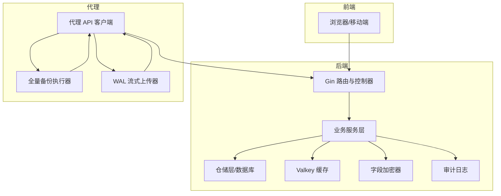
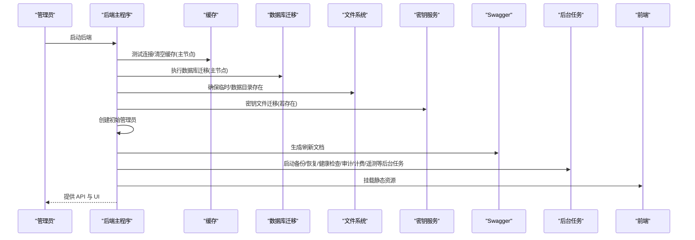
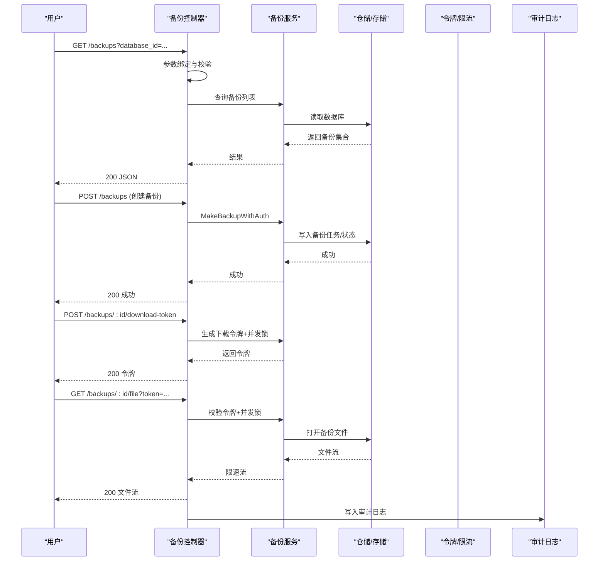
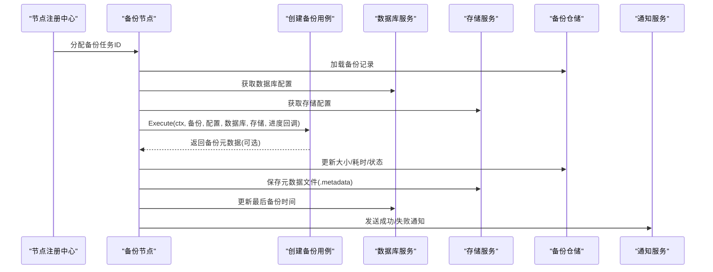
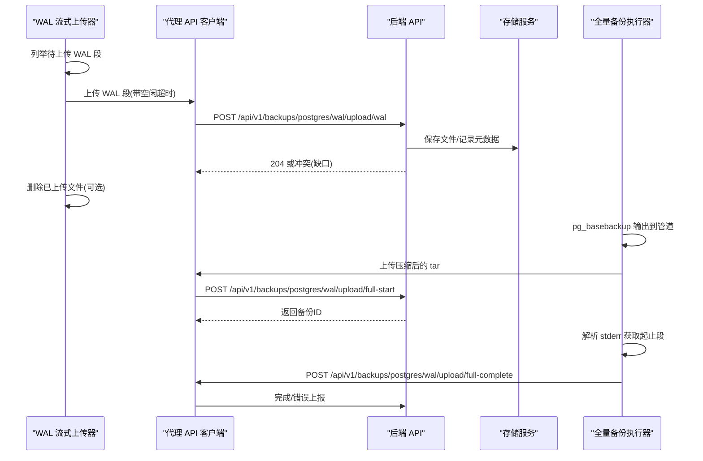
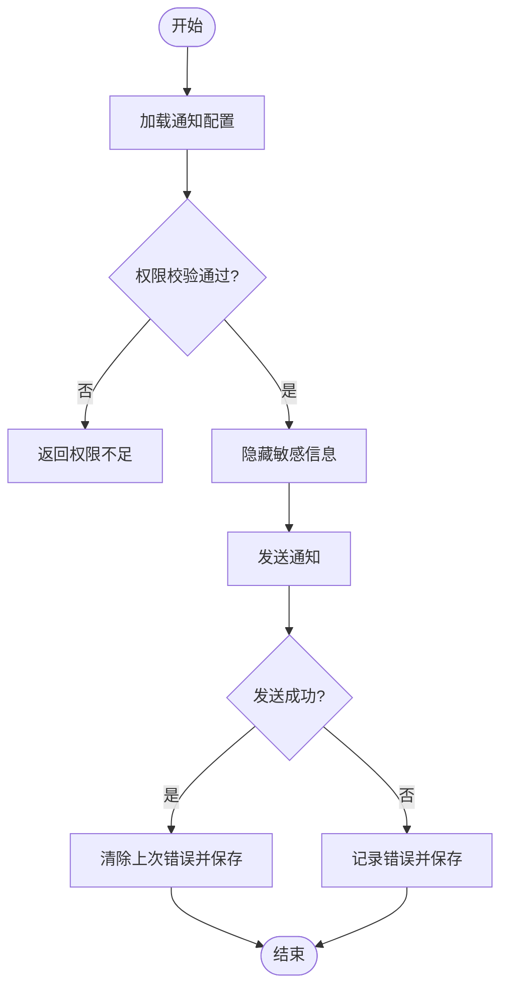
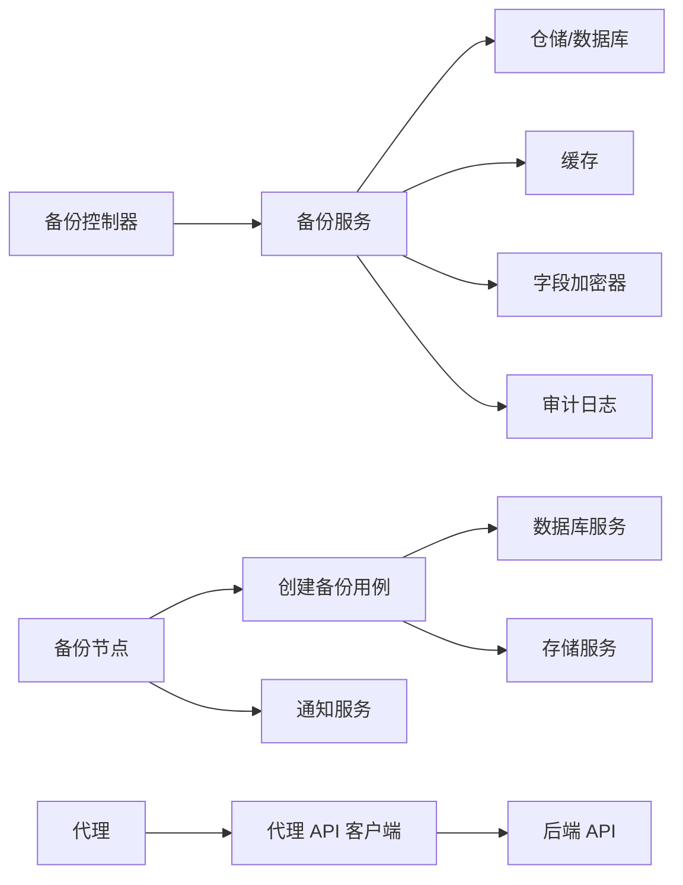

# 数据流设计

<cite>
**本文引用的文件**
- [后端入口 main.go](file://backend/cmd/main.go)
- [代理入口 main.go](file://agent/cmd/main.go)
- [后端配置 config.go](file://backend/internal/config/config.go)
- [代理配置 config.go](file://agent/internal/config/config.go)
- [备份节点 backuper.go](file://backend/internal/features/backups/backups/backuping/backuper.go)
- [全量备份 backuper.go](file://agent/internal/features/full_backup/backuper.go)
- [通知服务 service.go](file://backend/internal/features/notifiers/service.go)
- [存储服务 service.go](file://backend/internal/features/storages/service.go)
- [备份模型 model.go](file://backend/internal/features/backups/backups/core/model.go)
- [WAL 流式上传 streamer.go](file://agent/internal/features/wal/streamer.go)
- [字段加密接口 field_encryptor.go](file://backend/internal/util/encryption/field_encryptor.go)
- [缓存工具 cache.go](file://backend/internal/util/cache/cache.go)
- [创建备份用例 create_backup_uc.go](file://backend/internal/features/backups/backups/usecases/create_backup_uc.go)
- [备份控制器 controller.go](file://backend/internal/features/backups/backups/controllers/controller.go)
- [代理 API 客户端 api.go](file://agent/internal/features/api/api.go)
</cite>

## 目录
1. [引言](#引言)
2. [项目结构](#项目结构)
3. [核心组件](#核心组件)
4. [架构总览](#架构总览)
5. [详细组件分析](#详细组件分析)
6. [依赖分析](#依赖分析)
7. [性能考量](#性能考量)
8. [故障排查指南](#故障排查指南)
9. [结论](#结论)
10. [附录](#附录)

## 引言
本文件面向 Databasus 的数据流设计，系统性阐述从用户操作到备份执行、存储传输、通知发送的完整数据流转路径与处理机制。重点覆盖以下方面：
- 用户操作数据流：鉴权、请求路由、参数校验、业务处理与响应返回
- 备份执行数据流：调度、执行、进度上报、元数据持久化、状态更新
- 存储传输数据流：压缩、加密、分块上传、断点续传与错误恢复
- 通知发送数据流：权限校验、敏感信息脱敏、消息体截断与发送结果记录
- 数据一致性与事务策略：幂等性、锁与并发控制、下载并发限制
- 序列化/反序列化、压缩与加密、错误重试与超时策略
- 安全与隐私：字段级加密、令牌与密钥管理、审计日志与最小暴露原则

## 项目结构
Databasus 采用前后端分离与多进程协作的架构：
- 后端（Go）：提供 Web API、任务调度、存储与通知、审计日志、缓存与配置管理
- 代理（Go）：负责 WAL 段流式上传、全量备份执行、与后端的长连接通信
- 前端（React/Vite）：通过后端 API 进行用户交互与数据展示

图表来源
- [后端入口 main.go:213-257](file://backend/cmd/main.go#L213-L257)
- [代理入口 main.go:24-75](file://agent/cmd/main.go#L24-L75)
- [后端配置 config.go:35-41](file://backend/internal/config/config.go#L35-L41)

章节来源
- [后端入口 main.go:213-257](file://backend/cmd/main.go#L213-L257)
- [代理入口 main.go:24-75](file://agent/cmd/main.go#L24-L75)
- [后端配置 config.go:35-41](file://backend/internal/config/config.go#L35-L41)

## 核心组件
- 配置与环境：统一加载 .env、验证模式、安装目录、Valkey 连接、网络吞吐、云模式开关等
- 缓存：基于 Valkey 的连接测试、清空与键扫描清理
- 字段加密：抽象接口定义加解密行为，支持空值与已加密透明处理
- 通知：统一的发送、测试、权限校验与审计日志
- 存储：统一的连接测试、权限校验、系统存储约束与审计日志
- 备份：控制器负责路由与并发控制；用例根据数据库类型分派；后端节点负责执行与通知；代理负责 WAL 与全量备份的流式传输

章节来源
- [后端配置 config.go:152-421](file://backend/internal/config/config.go#L152-L421)
- [缓存工具 cache.go:13-124](file://backend/internal/util/cache/cache.go#L13-L124)
- [字段加密接口 field_encryptor.go:5-15](file://backend/internal/util/encryption/field_encryptor.go#L5-L15)
- [通知服务 service.go:15-396](file://backend/internal/features/notifiers/service.go#L15-L396)
- [存储服务 service.go:16-409](file://backend/internal/features/storages/service.go#L16-L409)
- [备份模型 model.go:20-60](file://backend/internal/features/backups/backups/core/model.go#L20-L60)
- [创建备份用例 create_backup_uc.go:18-77](file://backend/internal/features/backups/backups/usecases/create_backup_uc.go#L18-L77)
- [备份控制器 controller.go:23-399](file://backend/internal/features/backups/backups/controllers/controller.go#L23-L399)

## 架构总览
后端启动时初始化缓存、迁移、目录、密钥迁移、管理员创建、Swagger 文档生成、后台任务与前端静态资源挂载。代理启动时解析命令与配置，进行自动升级检查，随后进入守护态或执行一次性任务。

图表来源
- [后端入口 main.go:65-137](file://backend/cmd/main.go#L65-L137)
- [后端入口 main.go:293-374](file://backend/cmd/main.go#L293-L374)
- [后端入口 main.go:478-491](file://backend/cmd/main.go#L478-L491)

章节来源
- [后端入口 main.go:65-137](file://backend/cmd/main.go#L65-L137)
- [后端入口 main.go:293-374](file://backend/cmd/main.go#L293-L374)
- [后端入口 main.go:478-491](file://backend/cmd/main.go#L478-L491)

## 详细组件分析

### 用户操作数据流
- 鉴权中间件：受保护路由统一走认证中间件，未登录返回 401
- 控制器层：备份控制器对 GET/POST/DELETE/CANCEL 等操作进行参数绑定与校验，调用服务层执行业务逻辑
- 下载流程：生成短期下载令牌，校验令牌与并发锁，心跳维持下载锁，速率限制读取，完成后释放锁并写入审计日志

图表来源
- [备份控制器 controller.go:57-118](file://backend/internal/features/backups/backups/controllers/controller.go#L57-L118)
- [备份控制器 controller.go:192-320](file://backend/internal/features/backups/backups/controllers/controller.go#L192-L320)

章节来源
- [备份控制器 controller.go:57-118](file://backend/internal/features/backups/backups/controllers/controller.go#L57-L118)
- [备份控制器 controller.go:192-320](file://backend/internal/features/backups/backups/controllers/controller.go#L192-L320)

### 备份执行数据流
- 后端备份节点：注册心跳、订阅分配任务、执行备份、更新进度与状态、保存元数据、失败清理、发送通知
- 用例分派：根据数据库类型选择对应数据库的备份用例
- 元数据持久化：备份完成后写入加密盐、IV、算法等元数据文件

图表来源
- [备份节点 backuper.go:51-120](file://backend/internal/features/backups/backups/backuping/backuper.go#L51-L120)
- [备份节点 backuper.go:122-360](file://backend/internal/features/backups/backups/backuping/backuper.go#L122-L360)
- [创建备份用例 create_backup_uc.go:25-77](file://backend/internal/features/backups/backups/usecases/create_backup_uc.go#L25-L77)
- [备份模型 model.go:20-60](file://backend/internal/features/backups/backups/core/model.go#L20-L60)

章节来源
- [备份节点 backuper.go:51-120](file://backend/internal/features/backups/backups/backuping/backuper.go#L51-L120)
- [备份节点 backuper.go:122-360](file://backend/internal/features/backups/backups/backuping/backuper.go#L122-L360)
- [创建备份用例 create_backup_uc.go:25-77](file://backend/internal/features/backups/backups/usecases/create_backup_uc.go#L25-L77)
- [备份模型 model.go:20-60](file://backend/internal/features/backups/backups/core/model.go#L20-L60)

### 存储传输数据流
- 代理侧：
  - WAL 流式上传：周期扫描 WAL 目录，zstd 压缩后直连上传，带空闲超时检测，支持删除上传后文件
  - 全量备份：pg_basebackup 输出 tar，zstd 压缩后直连上传，解析 stderr 获取起止 WAL 段，最终完成或错误上报
- 后端侧：
  - 存储服务：统一连接测试、权限校验、系统存储约束、审计日志
  - 通知服务：统一发送、测试、权限校验、敏感信息脱敏与审计日志

图表来源
- [WAL 流式上传 streamer.go:44-90](file://agent/internal/features/wal/streamer.go#L44-L90)
- [WAL 流式上传 streamer.go:123-173](file://agent/internal/features/wal/streamer.go#L123-L173)
- [全量备份 backuper.go:164-245](file://agent/internal/features/full_backup/backuper.go#L164-L245)
- [代理 API 客户端 api.go:120-198](file://agent/internal/features/api/api.go#L120-L198)
- [存储服务 service.go:249-280](file://backend/internal/features/storages/service.go#L249-L280)
- [通知服务 service.go:276-308](file://backend/internal/features/notifiers/service.go#L276-L308)

章节来源
- [WAL 流式上传 streamer.go:44-90](file://agent/internal/features/wal/streamer.go#L44-L90)
- [WAL 流式上传 streamer.go:123-173](file://agent/internal/features/wal/streamer.go#L123-L173)
- [全量备份 backuper.go:164-245](file://agent/internal/features/full_backup/backuper.go#L164-L245)
- [代理 API 客户端 api.go:120-198](file://agent/internal/features/api/api.go#L120-L198)
- [存储服务 service.go:249-280](file://backend/internal/features/storages/service.go#L249-L280)
- [通知服务 service.go:276-308](file://backend/internal/features/notifiers/service.go#L276-L308)

### 通知发送数据流
- 权限校验：仅工作区有访问权限的用户可查看/测试通知
- 敏感信息脱敏：返回前隐藏敏感字段
- 消息截断：超过长度限制自动截断
- 发送结果记录：失败时记录最后一次错误，成功则清除错误

图表来源
- [通知服务 service.go:156-207](file://backend/internal/features/notifiers/service.go#L156-L207)
- [通知服务 service.go:276-308](file://backend/internal/features/notifiers/service.go#L276-L308)

章节来源
- [通知服务 service.go:156-207](file://backend/internal/features/notifiers/service.go#L156-L207)
- [通知服务 service.go:276-308](file://backend/internal/features/notifiers/service.go#L276-L308)

### 数据一致性与事务策略
- 幂等性与锁：
  - 下载并发控制：每个用户同一时间仅允许一次下载，使用缓存实现 5 秒 TTL 与心跳维持
  - 取消与关闭：备份取消通过上下文取消传播，避免重复写入失败状态
- 事务与回滚：
  - 失败清理：备份失败时删除部分上传文件
  - 状态原子更新：进度与状态更新在单次事务内完成
- 并发控制：
  - 全量备份：使用原子布尔位确保同时只运行一次
  - WAL 上传：逐个段顺序上传，检测缺口并报错

章节来源
- [备份控制器 controller.go:223-320](file://backend/internal/features/backups/backups/controllers/controller.go#L223-L320)
- [备份节点 backuper.go:122-281](file://backend/internal/features/backups/backups/backuping/backuper.go#L122-L281)
- [全量备份 backuper.go:85-124](file://agent/internal/features/full_backup/backuper.go#L85-L124)
- [WAL 流式上传 streamer.go:123-173](file://agent/internal/features/wal/streamer.go#L123-L173)

### 序列化/反序列化、压缩与加密
- 序列化/反序列化：JSON 用于 API 请求/响应与元数据持久化
- 压缩：zstd 压缩级别与 CRC 校验，上传时边流式编码边传输
- 加密：字段级加密器接口，支持空值与已加密透明处理；备份元数据包含盐、IV、算法
- 错误重试：REST 客户端设置最大重试次数与等待时间，5xx 自动重试；流式上传使用独立 HTTP 客户端，避免内存缓冲

章节来源
- [备份节点 backuper.go:299-329](file://backend/internal/features/backups/backups/backuping/backuper.go#L299-L329)
- [字段加密接口 field_encryptor.go:5-15](file://backend/internal/util/encryption/field_encryptor.go#L5-L15)
- [全量备份 backuper.go:247-269](file://agent/internal/features/full_backup/backuper.go#L247-L269)
- [代理 API 客户端 api.go:34-70](file://agent/internal/features/api/api.go#L34-L70)

## 依赖分析
- 组件耦合：
  - 控制器依赖服务层，服务层依赖仓储、缓存、加密与审计日志
  - 备份节点依赖用例、存储与通知，形成清晰的职责边界
  - 代理通过 API 客户端与后端交互，避免直接依赖后端内部模块
- 外部依赖：
  - Valkey 作为缓存与分布式锁
  - 数据库迁移工具 goose
  - zstd 压缩库
  - Resty HTTP 客户端

图表来源
- [备份控制器 controller.go:23-399](file://backend/internal/features/backups/backups/controllers/controller.go#L23-L399)
- [备份节点 backuper.go:32-49](file://backend/internal/features/backups/backups/backuping/backuper.go#L32-L49)
- [创建备份用例 create_backup_uc.go:18-23](file://backend/internal/features/backups/backups/usecases/create_backup_uc.go#L18-L23)
- [代理 API 客户端 api.go:36-70](file://agent/internal/features/api/api.go#L36-L70)

章节来源
- [备份控制器 controller.go:23-399](file://backend/internal/features/backups/backups/controllers/controller.go#L23-L399)
- [备份节点 backuper.go:32-49](file://backend/internal/features/backups/backups/backuping/backuper.go#L32-L49)
- [创建备份用例 create_backup_uc.go:18-23](file://backend/internal/features/backups/backups/usecases/create_backup_uc.go#L18-L23)
- [代理 API 客户端 api.go:36-70](file://agent/internal/features/api/api.go#L36-L70)

## 性能考量
- 压缩与带宽：zstd 压缩比高，结合 Valkey 主机网络吞吐配置，避免上传瓶颈
- 流式传输：避免内存缓冲，降低峰值内存占用
- 并发与限流：下载并发锁与心跳机制防止资源争用；速率限制保障公平性
- 缓存：Valkey 作为热点数据缓存，减少数据库压力；支持清空与扫描清理

## 故障排查指南
- 下载冲突：同一用户并发下载会触发 409，等待或取消后再试
- 令牌失效：下载令牌过期或不匹配返回 401，重新申请
- WAL 缺口：上传返回 409 表示缺口，需触发全量备份修复链路
- 备份失败：检查后端日志与失败消息，必要时清理部分文件并重试
- 缓存异常：使用缓存连接测试与清空功能快速定位 Valkey 问题

章节来源
- [备份控制器 controller.go:223-320](file://backend/internal/features/backups/backups/controllers/controller.go#L223-L320)
- [WAL 流式上传 streamer.go:142-173](file://agent/internal/features/wal/streamer.go#L142-L173)
- [缓存工具 cache.go:47-81](file://backend/internal/util/cache/cache.go#L47-L81)

## 结论
Databasus 的数据流设计以“流式传输 + 字段级加密 + 幂等与锁”为核心，确保在多节点、多数据库类型的复杂场景下保持高可靠与高性能。通过明确的职责划分与严格的权限控制，系统在安全性、可观测性与可维护性方面均达到工程化标准。

## 附录
- 关键配置项：数据库 DSN、Valkey 连接、网络吞吐、云模式、测试端口、SMTP、OAuth、Turnstile 等
- 环境变量加载：支持多层级 .env 加载与外部覆盖，开发/生产模式严格区分

章节来源
- [后端配置 config.go:152-421](file://backend/internal/config/config.go#L152-L421)
- [代理配置 config.go:16-101](file://agent/internal/config/config.go#L16-L101)