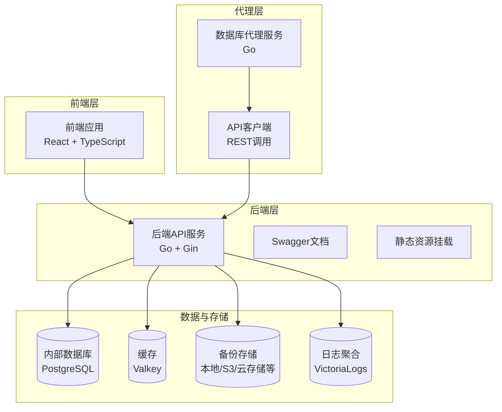
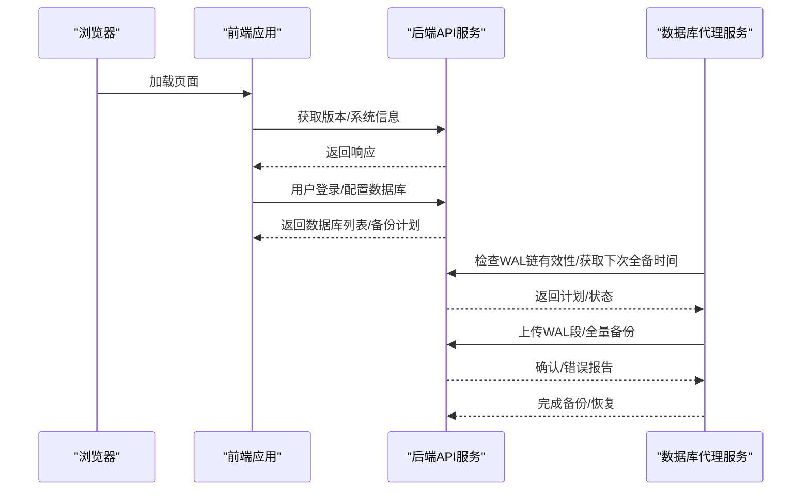
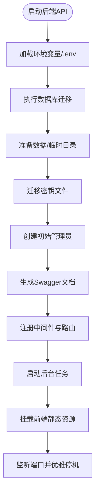
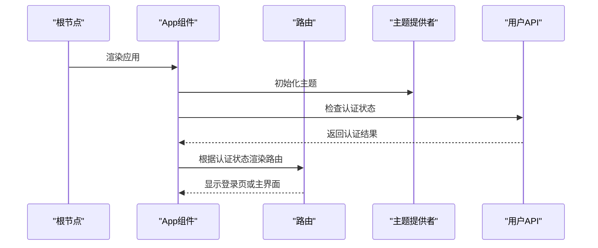
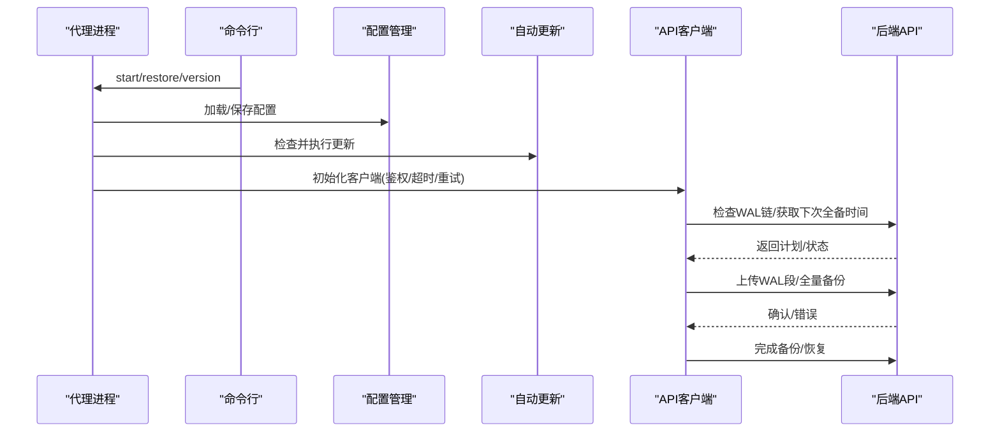
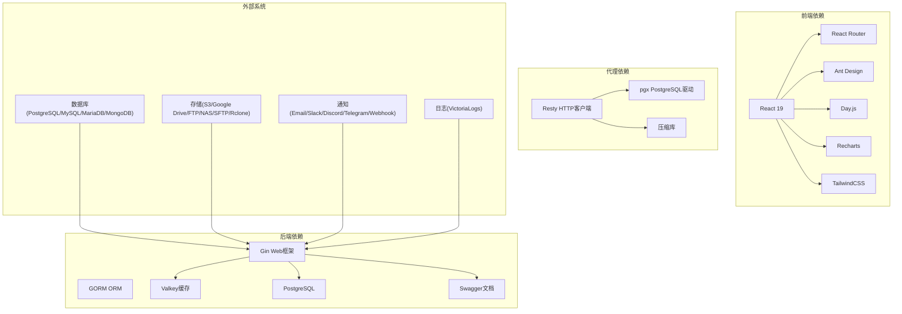
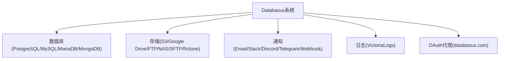

# 整体架构概览

<cite>
**本文档引用的文件**
- [README.md](file://README.md)
- [backend/cmd/main.go](file://backend/cmd/main.go)
- [agent/cmd/main.go](file://agent/cmd/main.go)
- [frontend/src/main.tsx](file://frontend/src/main.tsx)
- [backend/internal/config/config.go](file://backend/internal/config/config.go)
- [agent/internal/config/config.go](file://agent/internal/config/config.go)
- [backend/internal/features/system/agent/controller.go](file://backend/internal/features/system/agent/controller.go)
- [agent/internal/features/api/api.go](file://agent/internal/features/api/api.go)
- [frontend/src/App.tsx](file://frontend/src/App.tsx)
- [backend/go.mod](file://backend/go.mod)
- [agent/go.mod](file://agent/go.mod)
- [frontend/package.json](file://frontend/package.json)
- [backend/docker-compose.yml.example](file://backend/docker-compose.yml.example)
- [agent/docker-compose.yml.example](file://agent/docker-compose.yml.example)
- [deploy/helm/Chart.yaml](file://deploy/helm/Chart.yaml)
- [docs/how-extrnal-oauth-works.md](file://docs/how-extrnal-oauth-works.md)
</cite>

## 目录
1. [引言](#引言)
2. [项目结构](#项目结构)
3. [核心组件](#核心组件)
4. [架构总览](#架构总览)
5. [详细组件分析](#详细组件分析)
6. [依赖关系分析](#依赖关系分析)
7. [性能考虑](#性能考虑)
8. [故障排除指南](#故障排除指南)
9. [结论](#结论)
10. [附录](#附录)

## 引言
本文件面向Databasus项目的整体架构设计，阐述其微服务化、前后端分离与代理服务架构的核心理念。系统通过后端API服务（Go语言）、前端用户界面（React+TypeScript）与数据库代理服务（Go语言）三大组件协同工作，实现对多种数据库（PostgreSQL、MySQL、MariaDB、MongoDB）的备份、恢复、监控与管理。架构设计强调可扩展性、可维护性与性能优化，并通过多节点模式支持横向扩展。

## 项目结构
Databasus采用模块化的分层组织方式：
- 后端API服务：基于Go语言，使用Gin框架构建REST API，内置Swagger文档、GZIP压缩、CORS与优雅停机机制。
- 前端用户界面：基于React 19与TypeScript，使用Vite构建，提供现代化的UI与路由管理。
- 数据库代理服务：轻量级Go应用，负责与后端API通信并执行WAL归档、全量备份与恢复任务。
- 部署与运维：提供Docker Compose示例与Helm Chart，支持本地开发与Kubernetes生产部署。

图表来源
- [backend/cmd/main.go:112-137](file://backend/cmd/main.go#L112-L137)
- [agent/cmd/main.go:24-48](file://agent/cmd/main.go#L24-L48)
- [frontend/src/main.tsx:1-14](file://frontend/src/main.tsx#L1-L14)

章节来源
- [README.md:124-222](file://README.md#L124-L222)
- [backend/cmd/main.go:112-137](file://backend/cmd/main.go#L112-L137)
- [agent/cmd/main.go:24-48](file://agent/cmd/main.go#L24-L48)
- [frontend/src/main.tsx:1-14](file://frontend/src/main.tsx#L1-L14)

## 核心组件
- 后端API服务（Go）
  - 路由注册：公开与受保护路由分离，统一在/v1路径下提供REST接口。
  - 中间件：启用GZIP压缩、CORS、日志与异常恢复。
  - 后台任务：调度器、清理器、健康检查、审计日志、下载令牌清理、节点注册与计费等。
  - 静态资源：内置前端构建产物，支持SPA回退到index.html。
  - 环境配置：通过.env加载，支持开发/生产模式与多节点模式。
- 前端用户界面（React+TypeScript）
  - 路由与主题：基于React Router与Ant Design主题切换。
  - 认证流程：支持OAuth回调与本地认证；云端环境初始化Paddle支付。
  - 组件化：按功能域划分entity与features目录，清晰的UI与业务逻辑分离。
- 数据库代理服务（Go）
  - 命令行工具：start、stop、status、restore、version等子命令。
  - API客户端：封装REST调用，支持流式上传/下载、重试与鉴权头设置。
  - 自动更新：启动时检查并升级自身版本。
  - 配置管理：从JSON文件读取，支持CLI覆盖与默认值处理。

章节来源
- [backend/cmd/main.go:213-276](file://backend/cmd/main.go#L213-L276)
- [backend/internal/config/config.go:152-422](file://backend/internal/config/config.go#L152-L422)
- [agent/cmd/main.go:50-97](file://agent/cmd/main.go#L50-L97)
- [agent/internal/config/config.go:16-115](file://agent/internal/config/config.go#L16-L115)
- [frontend/src/App.tsx:16-77](file://frontend/src/App.tsx#L16-L77)

## 架构总览
Databasus采用“后端API + 前端 + 代理”的三层架构：
- 后端API作为统一入口，提供REST接口、后台任务与静态资源托管。
- 前端通过HTTP请求与后端交互，实现用户管理、数据库配置、备份计划、存储与通知等操作。
- 代理服务运行于数据库主机或容器内，负责与后端通信并执行WAL归档、全量备份与恢复任务，确保数据库无需对外暴露即可完成备份。

图表来源
- [agent/internal/features/api/api.go:72-118](file://agent/internal/features/api/api.go#L72-L118)
- [agent/internal/features/api/api.go:200-242](file://agent/internal/features/api/api.go#L200-L242)
- [agent/internal/features/api/api.go:311-327](file://agent/internal/features/api/api.go#L311-L327)

章节来源
- [backend/cmd/main.go:213-276](file://backend/cmd/main.go#L213-L276)
- [agent/internal/features/api/api.go:34-70](file://agent/internal/features/api/api.go#L34-L70)

## 详细组件分析

### 后端API服务（Go）
- 设计要点
  - 微服务化：以特性域划分模块，如backups、restores、storages、notifiers等，职责清晰。
  - 中间件链：GZIP压缩减少带宽占用；CORS适配开发环境；日志与panic恢复保障稳定性。
  - 路由分层：公开路由（如健康检查、系统版本、代理二进制下载）与受保护路由（用户、工作区、数据库、备份等）分离。
  - 后台任务：主节点负责调度与清理，处理节点负责具体备份/恢复执行，支持多节点模式。
  - 静态资源：内置前端构建产物，无额外Nginx即可提供SPA。
- 关键流程
  - 启动流程：环境变量加载、数据库迁移、目录准备、密钥迁移、管理员初始化、Swagger生成、后台任务启动、前端挂载与优雅停机。
  - 代理二进制下载：根据架构返回对应二进制文件，便于用户快速安装代理。

图表来源
- [backend/cmd/main.go:65-137](file://backend/cmd/main.go#L65-L137)
- [backend/cmd/main.go:213-276](file://backend/cmd/main.go#L213-L276)
- [backend/internal/features/system/agent/controller.go:27-48](file://backend/internal/features/system/agent/controller.go#L27-L48)

章节来源
- [backend/cmd/main.go:65-137](file://backend/cmd/main.go#L65-L137)
- [backend/cmd/main.go:213-276](file://backend/cmd/main.go#L213-L276)
- [backend/internal/features/system/agent/controller.go:13-48](file://backend/internal/features/system/agent/controller.go#L13-L48)

### 前端用户界面（React+TypeScript）
- 设计要点
  - 组件化与路由：按领域拆分entity与features，使用React Router进行页面级路由。
  - 主题与国际化：支持暗/亮主题切换，算法化主题配置。
  - 认证与云功能：云端环境初始化Paddle支付，支持OAuth回调与存储授权。
- 关键流程
  - 应用启动：初始化dayjs插件、创建根节点、渲染App。
  - 路由控制：未认证用户跳转登录页，已认证用户进入主界面。
  - 云端支付：根据配置初始化Paddle环境并监听事件。

图表来源
- [frontend/src/main.tsx:1-14](file://frontend/src/main.tsx#L1-L14)
- [frontend/src/App.tsx:16-77](file://frontend/src/App.tsx#L16-L77)

章节来源
- [frontend/src/main.tsx:1-14](file://frontend/src/main.tsx#L1-L14)
- [frontend/src/App.tsx:16-77](file://frontend/src/App.tsx#L16-L77)

### 数据库代理服务（Go）
- 设计要点
  - 子命令驱动：start、stop、status、restore、version等，便于系统集成与自动化。
  - API客户端：封装REST调用，支持JSON请求与流式上传/下载，具备重试与鉴权能力。
  - 自动更新：启动前检查服务器版本并自动升级，升级后重新执行进程。
  - 配置管理：优先从JSON文件读取，CLI参数覆盖默认值，记录配置来源。
- 关键流程
  - 启动流程：解析参数、加载配置、保存配置、检查更新、启动守护进程。
  - 备份流程：检查WAL链有效性、获取下次全备时间、上传WAL段与全量备份、最终确认或错误上报。
  - 恢复流程：获取恢复计划、下载备份文件、执行目标时间点恢复。

图表来源
- [agent/cmd/main.go:50-97](file://agent/cmd/main.go#L50-L97)
- [agent/internal/config/config.go:35-64](file://agent/internal/config/config.go#L35-L64)
- [agent/internal/features/api/api.go:34-70](file://agent/internal/features/api/api.go#L34-L70)

章节来源
- [agent/cmd/main.go:50-97](file://agent/cmd/main.go#L50-L97)
- [agent/internal/config/config.go:35-64](file://agent/internal/config/config.go#L35-L64)
- [agent/internal/features/api/api.go:34-70](file://agent/internal/features/api/api.go#L34-L70)

## 依赖关系分析
- 技术栈与依赖
  - 后端：Gin、GORM、Valkey、PostgreSQL、Swagger、Cron、加密库等。
  - 前端：React 19、Ant Design、Day.js、React Router、Recharts、TailwindCSS等。
  - 代理：Resty、pgx、压缩库等。
- 外部系统集成
  - 数据库：PostgreSQL、MySQL、MariaDB、MongoDB，支持本地与容器部署。
  - 存储：S3、Google Drive、FTP、NAS、SFTP、Rclone等。
  - 通知：Email、Slack、Discord、Telegram、Webhook等。
  - 日志：VictoriaLogs用于外部日志聚合。
- 部署与运维
  - Docker Compose：提供开发与测试环境，包含数据库、缓存、日志与各类测试容器。
  - Helm Chart：支持Kubernetes部署，提供Service、Ingress与StatefulSet模板。

图表来源
- [backend/go.mod:5-34](file://backend/go.mod#L5-L34)
- [frontend/package.json:15-25](file://frontend/package.json#L15-L25)
- [agent/go.mod:5-10](file://agent/go.mod#L5-L10)

章节来源
- [backend/go.mod:5-34](file://backend/go.mod#L5-L34)
- [frontend/package.json:15-25](file://frontend/package.json#L15-L25)
- [agent/go.mod:5-10](file://agent/go.mod#L5-L10)

## 性能考虑
- 网络与并发
  - GZIP压缩减少传输体积，适合大文件下载与API响应。
  - Valkey作为缓存层降低数据库压力，支持高并发场景。
  - 多节点模式支持备份/恢复任务的横向扩展，通过吞吐量配置限制网络带宽。
- I/O与存储
  - 流式上传/下载避免内存峰值，提升大备份文件的处理效率。
  - 支持多种存储后端，可根据成本与性能选择合适方案。
- 前端体验
  - 静态资源内置，减少额外请求；路由懒加载与主题切换优化首屏体验。
- 可观测性
  - Swagger文档自动生成，便于调试与联调。
  - VictoriaLogs提供集中日志采集，便于问题定位。

## 故障排除指南
- 后端常见问题
  - 环境变量缺失：检查.env是否正确加载，特别是DATABASE_DSN、VALKEY_*等关键配置。
  - 迁移失败：查看迁移输出，确认数据库连接与权限。
  - CORS跨域：开发模式下自动启用CORS，生产需正确配置域名。
- 代理常见问题
  - 无法连接后端：检查databasus-host与token配置，确认鉴权头设置。
  - 更新失败：查看自动更新日志，确认网络可达与版本检查接口可用。
  - WAL上传冲突：根据返回的期望段名修复WAL队列顺序。
- 前端常见问题
  - OAuth回调失败：确认回调地址与代理转发配置，参考外部OAuth流程文档。
  - 云端支付初始化：检查Paddle配置与沙箱模式设置。

章节来源
- [backend/internal/config/config.go:157-204](file://backend/internal/config/config.go#L157-L204)
- [agent/internal/config/config.go:35-64](file://agent/internal/config/config.go#L35-L64)
- [docs/how-extrnal-oauth-works.md:9-25](file://docs/how-extrnal-oauth-works.md#L9-L25)

## 结论
Databasus通过清晰的微服务架构、前后端分离与代理服务设计，实现了对多数据库的高效备份与管理。后端API提供统一入口与后台任务编排，前端提供直观的用户体验，代理服务则确保数据库侧的自动化与安全性。该架构在可扩展性、可维护性与性能方面均具备良好基础，适合从小规模到企业级的多样化部署场景。

## 附录
- 系统上下文图（与外部系统集成）
  - 数据库：本地/容器部署，支持多版本与多引擎。
  - 存储：本地磁盘、S3、Google Drive、FTP/NAS/SFTP/Rclone等。
  - 通知：Email、Slack、Discord、Telegram、Webhook。
  - 日志：VictoriaLogs集中采集。
  - OAuth：通过databasus.com代理实现本地HTTPS授权。

图表来源
- [docs/how-extrnal-oauth-works.md:3-5](file://docs/how-extrnal-oauth-works.md#L3-L5)

- 基础设施要求与部署拓扑
  - 开发/测试：Docker Compose示例包含PostgreSQL、Valkey、VictoriaLogs与多版本数据库测试容器。
  - 生产：Helm Chart支持Kubernetes部署，提供Service、Ingress与StatefulSet。
  - 扩展策略：多节点模式支持备份/恢复任务的水平扩展，结合网络吞吐配置优化带宽使用。

章节来源
- [backend/docker-compose.yml.example:1-586](file://backend/docker-compose.yml.example#L1-L586)
- [agent/docker-compose.yml.example:1-59](file://agent/docker-compose.yml.example#L1-L59)
- [deploy/helm/Chart.yaml:1-23](file://deploy/helm/Chart.yaml#L1-L23)