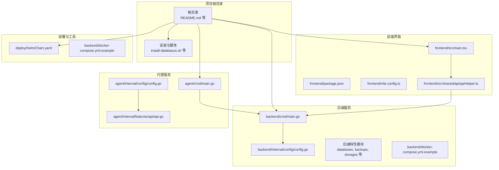
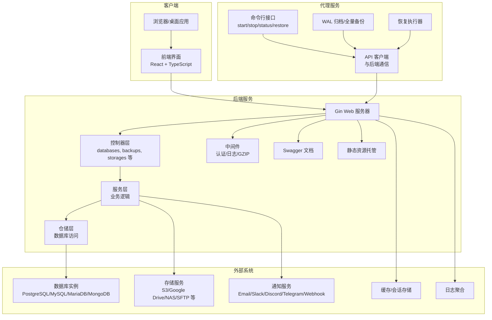
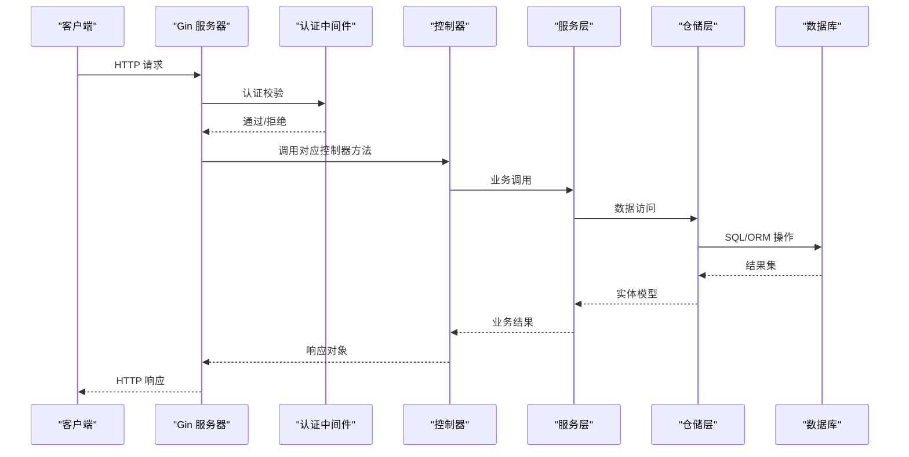
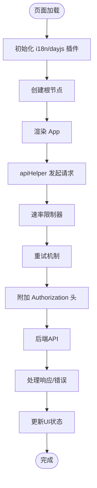
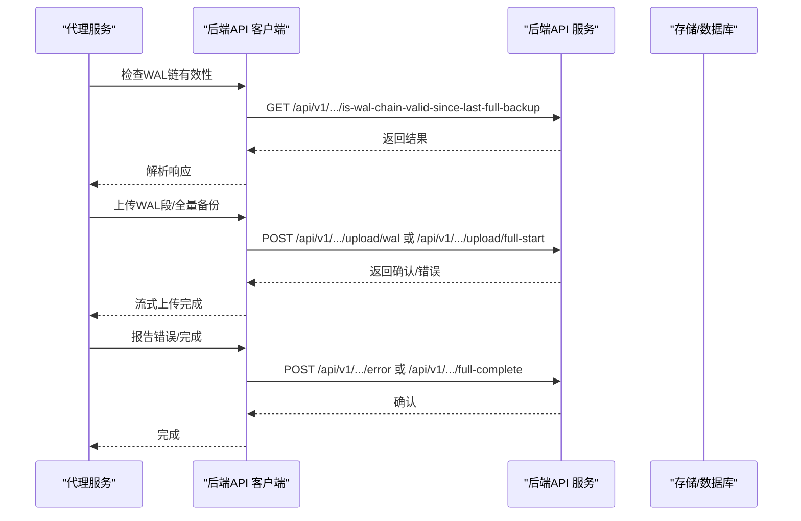
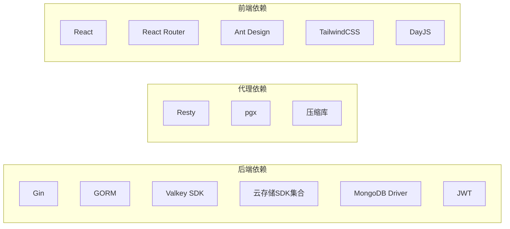

# 架构设计

<cite>
**本文档引用的文件**
- [README.md](file://README.md)
- [backend/cmd/main.go](file://backend/cmd/main.go)
- [agent/cmd/main.go](file://agent/cmd/main.go)
- [frontend/src/main.tsx](file://frontend/src/main.tsx)
- [backend/go.mod](file://backend/go.mod)
- [agent/go.mod](file://agent/go.mod)
- [frontend/package.json](file://frontend/package.json)
- [backend/internal/config/config.go](file://backend/internal/config/config.go)
- [agent/internal/config/config.go](file://agent/internal/config/config.go)
- [backend/docker-compose.yml.example](file://backend/docker-compose.yml.example)
- [deploy/helm/Chart.yaml](file://deploy/helm/Chart.yaml)
- [backend/internal/features/databases/controller.go](file://backend/internal/features/databases/controller.go)
- [agent/internal/features/api/api.go](file://agent/internal/features/api/api.go)
- [frontend/src/shared/api/apiHelper.ts](file://frontend/src/shared/api/apiHelper.ts)
</cite>

## 目录
1. [引言](#引言)
2. [项目结构](#项目结构)
3. [核心组件](#核心组件)
4. [架构总览](#架构总览)
5. [详细组件分析](#详细组件分析)
6. [依赖关系分析](#依赖关系分析)
7. [性能考量](#性能考量)
8. [故障排查指南](#故障排查指南)
9. [结论](#结论)
10. [附录](#附录)

## 引言
本架构设计文档面向Databasus项目的整体架构，重点阐述其微服务化、前后端分离与代理服务架构的设计理念与实现细节。系统由三大部分组成：后端API服务（Go语言）、前端用户界面（React+TypeScript）、数据库代理服务（Go语言）。本文将从系统上下文、组件交互、数据流、技术选型与权衡、扩展性与部署拓扑、安全与监控等方面进行深入解析，并提供可视化图表帮助理解。

## 项目结构
Databasus采用多模块仓库组织方式，包含后端服务、前端界面、代理服务以及部署与工具链。项目根目录提供了统一的安装与部署脚本，便于快速启动与运维。

**图表来源**
- [backend/cmd/main.go:1-491](file://backend/cmd/main.go#L1-L491)
- [agent/cmd/main.go:1-246](file://agent/cmd/main.go#L1-L246)
- [frontend/src/main.tsx:1-14](file://frontend/src/main.tsx#L1-L14)
- [backend/internal/config/config.go:1-422](file://backend/internal/config/config.go#L1-L422)
- [agent/internal/config/config.go:1-272](file://agent/internal/config/config.go#L1-L272)
- [frontend/src/shared/api/apiHelper.ts:1-264](file://frontend/src/shared/api/apiHelper.ts#L1-L264)
- [backend/docker-compose.yml.example:1-586](file://backend/docker-compose.yml.example#L1-L586)
- [deploy/helm/Chart.yaml:1-23](file://deploy/helm/Chart.yaml#L1-L23)

**章节来源**
- [README.md:1-310](file://README.md#L1-L310)
- [backend/cmd/main.go:1-491](file://backend/cmd/main.go#L1-L491)
- [agent/cmd/main.go:1-246](file://agent/cmd/main.go#L1-L246)
- [frontend/src/main.tsx:1-14](file://frontend/src/main.tsx#L1-L14)
- [backend/docker-compose.yml.example:1-586](file://backend/docker-compose.yml.example#L1-L586)
- [deploy/helm/Chart.yaml:1-23](file://deploy/helm/Chart.yaml#L1-L23)

## 核心组件
- 后端API服务（Go）
  - 基于Gin框架构建REST API，提供认证、工作区管理、数据库配置、备份与恢复、存储与通知、健康检查、审计日志、计费等完整功能域。
  - 支持多节点模式（主节点与处理节点），通过环境变量控制角色与网络吞吐。
  - 内置Swagger文档生成与GZIP压缩中间件，提供静态资源托管以服务前端。
- 前端用户界面（React+TypeScript）
  - 使用Vite构建，基于React 19与Ant Design，提供响应式UI与路由管理。
  - 通过统一的API辅助层封装请求与错误处理，内置速率限制与重试机制。
- 数据库代理服务（Go）
  - 轻量级代理，负责与后端API通信、执行WAL归档与全量备份、支持物理备份与增量恢复。
  - 提供命令行接口（start/stop/status/restore/version），支持自动更新与配置持久化。

**章节来源**
- [backend/cmd/main.go:213-276](file://backend/cmd/main.go#L213-L276)
- [frontend/src/main.tsx:1-14](file://frontend/src/main.tsx#L1-L14)
- [agent/cmd/main.go:24-171](file://agent/cmd/main.go#L24-L171)
- [frontend/src/shared/api/apiHelper.ts:1-264](file://frontend/src/shared/api/apiHelper.ts#L1-L264)

## 架构总览
Databasus采用“后端API服务 + 前端界面 + 代理服务”的三层架构。后端作为统一的数据与业务中心，前端提供用户体验，代理服务在数据库侧完成备份与恢复任务并与后端协作。

**图表来源**
- [backend/cmd/main.go:112-137](file://backend/cmd/main.go#L112-L137)
- [agent/internal/features/api/api.go:1-200](file://agent/internal/features/api/api.go#L1-L200)
- [backend/internal/features/databases/controller.go:1-200](file://backend/internal/features/databases/controller.go#L1-L200)
- [frontend/src/shared/api/apiHelper.ts:1-264](file://frontend/src/shared/api/apiHelper.ts#L1-L264)

## 详细组件分析

### 后端API服务（Go）
- 入口与生命周期
  - 主程序初始化日志、缓存、迁移、目录准备、密钥迁移、管理员账户创建、密码重置命令行参数处理、Swagger生成、Gin路由注册、依赖注入、后台任务启动、前端静态资源挂载、优雅关闭。
- 路由与中间件
  - 分组路由：公开路由（健康检查、版本、代理、备份WAL、数据库连接测试等）与受保护路由（用户、工作区、磁盘、通知、存储、数据库、备份、恢复、健康检查配置与尝试、审计日志、计费等）。
  - 中间件：GZIP压缩、CORS（开发模式）、全局异常恢复、认证中间件。
- 多节点模式
  - 通过环境变量控制是否为主节点或处理节点，分别运行调度器、清理器、恢复器、健康检查尝试、审计日志清理、下载令牌清理、节点注册、计费与遥测等后台任务。
- 配置管理
  - 统一读取.env与环境变量，设置数据库DSN、Valkey连接、安装目录、数据与临时目录、遥测实例文件路径、云模式与计费参数、OAuth与Cloudflare Turnstile、SMTP等。

**图表来源**
- [backend/cmd/main.go:213-276](file://backend/cmd/main.go#L213-L276)
- [backend/internal/features/databases/controller.go:1-200](file://backend/internal/features/databases/controller.go#L1-L200)

**章节来源**
- [backend/cmd/main.go:65-137](file://backend/cmd/main.go#L65-L137)
- [backend/cmd/main.go:213-276](file://backend/cmd/main.go#L213-L276)
- [backend/internal/config/config.go:1-422](file://backend/internal/config/config.go#L1-L422)

### 前端用户界面（React+TypeScript）
- 应用入口
  - 初始化国际化与时长格式化库，创建根节点并渲染App。
- 构建与插件
  - 使用Vite与React插件、TailwindCSS插件，提供开发与生产构建能力。
- API辅助层
  - 统一封装fetch请求，支持JSON/文本/Blob类型，内置速率限制、重试与鉴权头注入；对401、502/504等状态进行统一处理。

**图表来源**
- [frontend/src/main.tsx:1-14](file://frontend/src/main.tsx#L1-L14)
- [frontend/src/shared/api/apiHelper.ts:1-264](file://frontend/src/shared/api/apiHelper.ts#L1-L264)

**章节来源**
- [frontend/src/main.tsx:1-14](file://frontend/src/main.tsx#L1-L14)
- [frontend/package.json:1-46](file://frontend/package.json#L1-L46)
- [frontend/src/shared/api/apiHelper.ts:1-264](file://frontend/src/shared/api/apiHelper.ts#L1-L264)

### 数据库代理服务（Go）
- 命令行接口
  - start：启动代理（WAL归档+全量备份），加载配置、保存配置、检查更新、启动守护进程。
  - stop/status：停止或查询代理状态。
  - restore：从备份恢复数据库到目标目录，支持指定备份ID与PITR时间。
  - version：打印代理版本。
- 与后端API通信
  - 通过REST客户端与后端交互，支持JSON请求与流式上传（basebackup与WAL段），内置超时、重试与鉴权头设置。
- 配置管理
  - 从JSON文件加载配置，支持命令行覆盖，记录配置来源，提供默认值与敏感信息掩码日志。

**图表来源**
- [agent/cmd/main.go:24-171](file://agent/cmd/main.go#L24-L171)
- [agent/internal/features/api/api.go:1-200](file://agent/internal/features/api/api.go#L1-L200)

**章节来源**
- [agent/cmd/main.go:24-171](file://agent/cmd/main.go#L24-L171)
- [agent/internal/config/config.go:1-272](file://agent/internal/config/config.go#L1-L272)
- [agent/internal/features/api/api.go:1-200](file://agent/internal/features/api/api.go#L1-L200)

## 依赖关系分析
- 技术栈与版本
  - 后端：Go 1.26.1，Gin 1.10.0，GORM 1.26.1，Valkey Go SDK，多种云存储SDK（AWS S3、Azure Blob、MinIO、Rclone等），MongoDB驱动，JWT等。
  - 代理：Go 1.26.1，Resty 2.x，pgx 5.x，压缩库等。
  - 前端：React 19，React Router 7，Ant Design 5，Vite 6，TailwindCSS 4，DayJS等。
- 第三方依赖与兼容性
  - 后端依赖广泛覆盖数据库驱动、云存储SDK、通知渠道SDK、加密与安全库、定时任务库等，确保对主流数据库与存储平台的支持。
  - 代理依赖轻量HTTP客户端与PostgreSQL驱动，专注于与后端API的高效通信。
  - 前端使用现代构建工具链，具备良好的开发体验与产物优化能力。

**图表来源**
- [backend/go.mod:1-288](file://backend/go.mod#L1-L288)
- [agent/go.mod:1-23](file://agent/go.mod#L1-L23)
- [frontend/package.json:1-46](file://frontend/package.json#L1-L46)

**章节来源**
- [backend/go.mod:1-288](file://backend/go.mod#L1-L288)
- [agent/go.mod:1-23](file://agent/go.mod#L1-L23)
- [frontend/package.json:1-46](file://frontend/package.json#L1-L46)

## 性能考量
- 并发与吞吐
  - 后端通过多节点模式分担调度与处理压力，主节点负责计划与清理，处理节点负责实际备份/恢复任务，结合网络吞吐配置提升整体吞吐。
- 网络与I/O
  - 代理采用流式上传避免内存缓冲，后端启用GZIP压缩减少传输体积，前端API辅助层内置速率限制防止突发请求冲击后端。
- 存储与压缩
  - 支持多种存储后端，结合压缩算法与分片策略降低存储成本与传输时间。
- 缓存与会话
  - 使用Valkey作为缓存与会话存储，提升高频查询与鉴权效率。

[本节为通用指导，无需特定文件引用]

## 故障排查指南
- 后端常见问题
  - 环境变量缺失或无效：检查.env与环境变量，特别是DATABASE_DSN、ENV_MODE、VALKEY_*等。
  - 迁移失败：查看迁移输出与数据库连接状态。
  - CORS与跨域：开发模式下启用CORS，生产环境需正确配置反向代理。
  - 优雅关闭：确保信号处理与资源释放（如VictoriaLogs写入器）。
- 代理常见问题
  - 配置加载：检查databasus.json是否存在与权限，命令行参数覆盖顺序。
  - 通信失败：验证databasusHost与token，检查网络连通性与防火墙。
  - 自动更新：开发模式与跳过更新选项影响升级流程。
- 前端常见问题
  - 鉴权失效：401时清理本地token并刷新页面。
  - 网络抖动：利用重试机制与错误提示，必要时调整重试次数与间隔。
  - 速率限制：合理配置并发与限速，避免触发后端限流。

**章节来源**
- [backend/internal/config/config.go:157-204](file://backend/internal/config/config.go#L157-L204)
- [agent/internal/config/config.go:76-101](file://agent/internal/config/config.go#L76-L101)
- [frontend/src/shared/api/apiHelper.ts:10-40](file://frontend/src/shared/api/apiHelper.ts#L10-L40)

## 结论
Databasus通过清晰的微服务架构、前后端分离与代理服务设计，实现了对多数据库与多存储平台的统一管理与自动化备份恢复。后端提供完善的业务能力与可观测性，前端提供优秀的用户体验，代理服务在数据库侧高效完成备份与恢复任务。该架构在可扩展性、安全性与运维友好性方面均具备良好基础，适合在企业级环境中部署与演进。

[本节为总结，无需特定文件引用]

## 附录

### 系统上下文与集成
- 数据库：支持PostgreSQL 12-18、MySQL 5.7/8/9、MariaDB 10/11/12、MongoDB 4-8。
- 存储：S3、Google Drive、FTP、NAS、Dropbox、SFTP、Rclone、Azure Blob等。
- 通知：Email、Slack、Discord、Telegram、Webhook等。
- 基础设施：Docker容器化部署，Kubernetes Helm Chart，本地开发使用docker-compose示例。

**章节来源**
- [README.md:40-110](file://README.md#L40-L110)
- [backend/docker-compose.yml.example:1-586](file://backend/docker-compose.yml.example#L1-L586)
- [deploy/helm/Chart.yaml:1-23](file://deploy/helm/Chart.yaml#L1-L23)

### 部署拓扑与基础设施要求
- 单机部署：Docker单容器或docker-compose，映射端口与数据卷。
- 多节点部署：通过环境变量启用多节点模式，区分主节点与处理节点角色。
- Kubernetes：使用Helm Chart，支持ClusterIP/LoadBalancer/Ingress等多种暴露方式。
- 基础设施：需要PostgreSQL用于元数据存储、Valkey用于缓存、可选VictoriaLogs用于日志聚合。

**章节来源**
- [README.md:124-222](file://README.md#L124-L222)
- [backend/docker-compose.yml.example:1-586](file://backend/docker-compose.yml.example#L1-L586)
- [deploy/helm/Chart.yaml:1-23](file://deploy/helm/Chart.yaml#L1-L23)

### 横切关注点
- 安全性：JWT鉴权、Cloudflare Turnstile人机验证、加密密钥管理、只读用户策略、审计日志。
- 监控：匿名遥测、后台任务状态、健康检查、日志聚合。
- 灾难恢复：物理备份与WAL归档、增量备份与PITR、恢复计划与下载。

**章节来源**
- [backend/cmd/main.go:278-291](file://backend/cmd/main.go#L278-L291)
- [backend/internal/config/config.go:120-146](file://backend/internal/config/config.go#L120-L146)