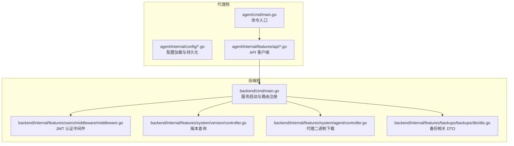
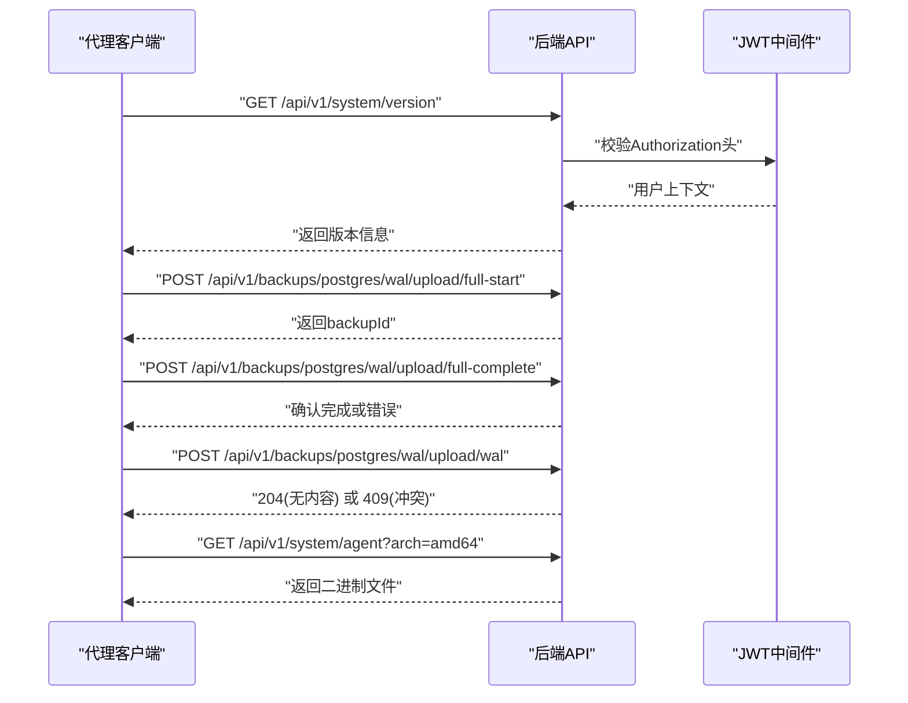
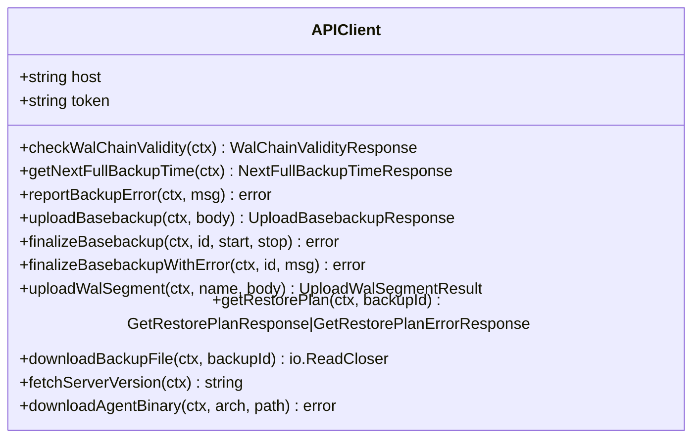
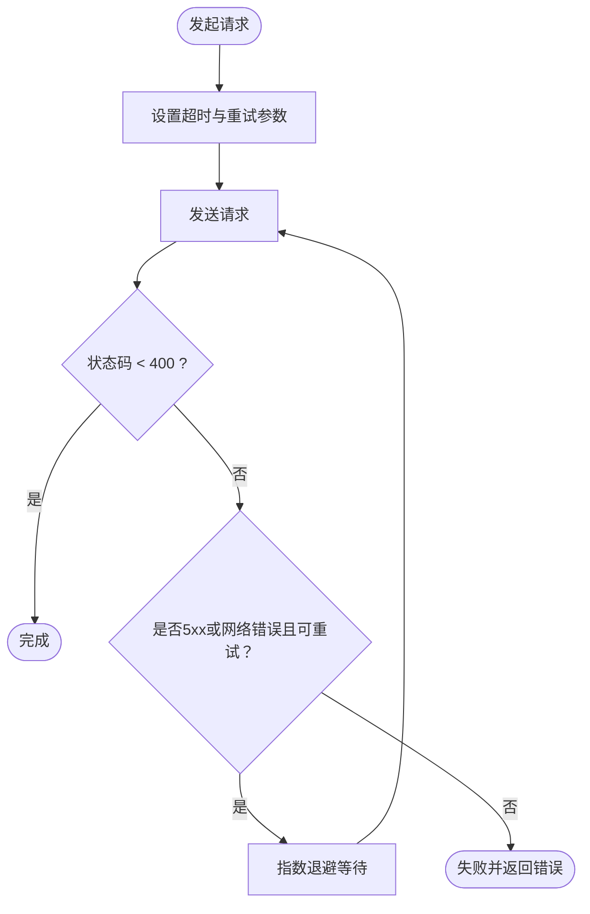
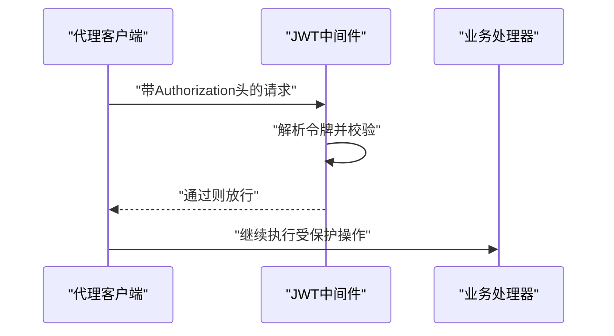
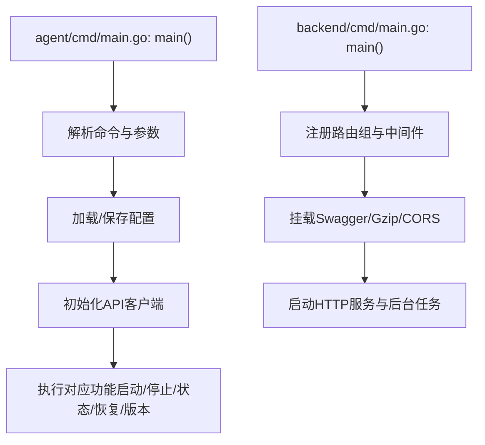
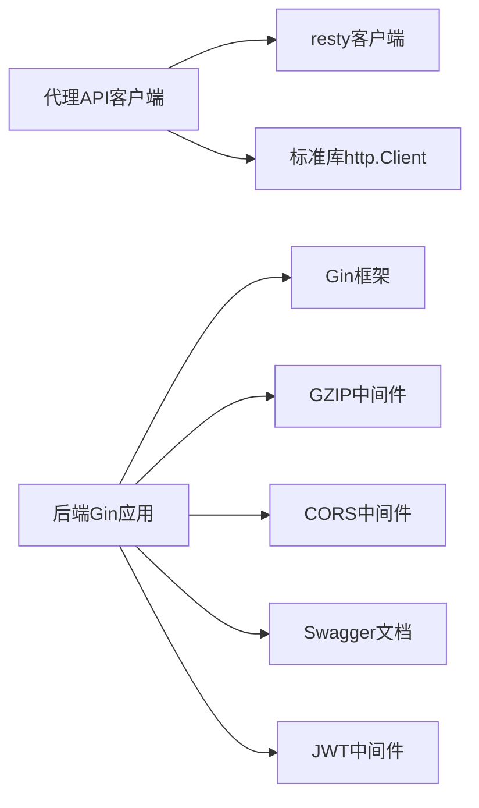

# API接口设计

<cite>
**本文引用的文件**
- [agent/cmd/main.go](file://agent/cmd/main.go)
- [agent/internal/config/config.go](file://agent/internal/config/config.go)
- [agent/internal/config/dto.go](file://agent/internal/config/dto.go)
- [agent/internal/features/api/api.go](file://agent/internal/features/api/api.go)
- [agent/internal/features/api/dto.go](file://agent/internal/features/api/dto.go)
- [agent/internal/features/api/idle_timeout_reader.go](file://agent/internal/features/api/idle_timeout_reader.go)
- [backend/cmd/main.go](file://backend/cmd/main.go)
- [backend/internal/features/system/agent/controller.go](file://backend/internal/features/system/agent/controller.go)
- [backend/internal/features/system/version/controller.go](file://backend/internal/features/system/version/controller.go)
- [backend/internal/features/backups/backups/dto/dto.go](file://backend/internal/features/backups/backups/dto/dto.go)
- [backend/internal/features/users/middleware/middleware.go](file://backend/internal/features/users/middleware/middleware.go)
</cite>

## 目录
1. [引言](#引言)
2. [项目结构](#项目结构)
3. [核心组件](#核心组件)
4. [架构总览](#架构总览)
5. [详细组件分析](#详细组件分析)
6. [依赖分析](#依赖分析)
7. [性能考虑](#性能考虑)
8. [故障排查指南](#故障排查指南)
9. [结论](#结论)
10. [附录](#附录)

## 引言
本技术文档围绕 Databasus 代理（Agent）与后端（Backend）之间的 API 接口设计进行系统化阐述，重点覆盖以下方面：
- 代理与后端的通信协议与数据传输格式
- 错误处理与重试策略
- API 客户端实现要点：HTTP 请求封装、认证机制、重试与超时
- DTO 设计模式：请求/响应结构与数据校验规则
- 网络超时处理、连接复用与流量控制
- API 通信流程图与数据交换示例
- 性能优化、并发处理与错误恢复策略
- 安全性设计：数据加密、访问控制与审计日志

## 项目结构
Databasus 采用前后端分离的模块化组织方式：
- 前端（Web UI）与后端（Go Gin 服务）通过 REST API 交互
- 代理（Go 程序）独立运行于目标数据库所在环境，负责 WAL 归档、全量备份上传、恢复计划与下载等任务
- 后端提供统一的 API 路由注册、认证中间件、GZIP 压缩、CORS 配置与 Swagger 文档

图表来源
- [agent/cmd/main.go:1-246](file://agent/cmd/main.go#L1-L246)
- [agent/internal/config/config.go:1-272](file://agent/internal/config/config.go#L1-L272)
- [agent/internal/features/api/api.go:1-377](file://agent/internal/features/api/api.go#L1-L377)
- [backend/cmd/main.go:1-491](file://backend/cmd/main.go#L1-L491)
- [backend/internal/features/users/middleware/middleware.go:1-77](file://backend/internal/features/users/middleware/middleware.go#L1-L77)
- [backend/internal/features/system/version/controller.go:1-39](file://backend/internal/features/system/version/controller.go#L1-L39)
- [backend/internal/features/system/agent/controller.go:1-49](file://backend/internal/features/system/agent/controller.go#L1-L49)
- [backend/internal/features/backups/backups/dto/dto.go:1-94](file://backend/internal/features/backups/backups/dto/dto.go#L1-L94)

章节来源
- [agent/cmd/main.go:1-246](file://agent/cmd/main.go#L1-L246)
- [backend/cmd/main.go:1-491](file://backend/cmd/main.go#L1-L491)

## 核心组件
- 代理 API 客户端：封装 REST 与流式上传/下载，内置超时、重试与鉴权头设置；区分 JSON 请求与大体积流式传输两类路径
- 后端路由与中间件：统一注册 /api/v1 路由组，启用 GZIP 压缩、CORS、JWT 认证中间件，并提供版本查询与代理二进制下载接口
- 配置管理：支持从 JSON 文件与命令行参数加载配置，含敏感信息掩码输出
- 备份相关 DTO：定义 WAL 链有效性检查、下次全备时间、恢复计划、上传/完成等请求/响应结构

章节来源
- [agent/internal/features/api/api.go:1-377](file://agent/internal/features/api/api.go#L1-L377)
- [agent/internal/features/api/dto.go:1-73](file://agent/internal/features/api/dto.go#L1-L73)
- [backend/cmd/main.go:213-257](file://backend/cmd/main.go#L213-L257)
- [backend/internal/features/users/middleware/middleware.go:13-38](file://backend/internal/features/users/middleware/middleware.go#L13-L38)
- [agent/internal/config/config.go:16-115](file://agent/internal/config/config.go#L16-L115)

## 架构总览
代理与后端通过 HTTP 协议交互，代理侧使用两个客户端：
- JSON 客户端：基于 resty，统一设置超时、重试、鉴权头
- 流式 HTTP 客户端：用于 WAL 段与全量备份的流式上传/下载

后端侧以 Gin 注册路由，JWT 中间件对受保护资源进行鉴权。

图表来源
- [agent/internal/features/api/api.go:311-358](file://agent/internal/features/api/api.go#L311-L358)
- [backend/internal/features/system/version/controller.go:18-38](file://backend/internal/features/system/version/controller.go#L18-L38)
- [backend/internal/features/system/agent/controller.go:17-48](file://backend/internal/features/system/agent/controller.go#L17-L48)
- [backend/internal/features/users/middleware/middleware.go:13-38](file://backend/internal/features/users/middleware/middleware.go#L13-L38)

## 详细组件分析

### 代理 API 客户端
- 超时与重试：JSON 客户端设置固定超时与有限次数重试，自动对 5xx 类错误重试；流式客户端不使用 resty 的重试逻辑
- 鉴权：在请求前设置 Authorization 头（令牌为空则不添加）
- 路径与方法：
  - 查询 WAL 链有效性、下次全备时间、报告备份错误
  - 全量备份开始/结束（流式上传与 JSON 结束）
  - WAL 段上传（流式上传，返回 204 或 409 冲突）
  - 获取恢复计划（支持 400 错误响应）
  - 下载备份文件（流式下载）
  - 获取后端版本、下载代理二进制

图表来源
- [agent/internal/features/api/api.go:36-70](file://agent/internal/features/api/api.go#L36-L70)
- [agent/internal/features/api/api.go:72-358](file://agent/internal/features/api/api.go#L72-L358)

章节来源
- [agent/internal/features/api/api.go:17-32](file://agent/internal/features/api/api.go#L17-L32)
- [agent/internal/features/api/api.go:44-70](file://agent/internal/features/api/api.go#L44-L70)
- [agent/internal/features/api/api.go:108-118](file://agent/internal/features/api/api.go#L108-L118)
- [agent/internal/features/api/api.go:120-175](file://agent/internal/features/api/api.go#L120-L175)
- [agent/internal/features/api/api.go:177-198](file://agent/internal/features/api/api.go#L177-L198)
- [agent/internal/features/api/api.go:200-242](file://agent/internal/features/api/api.go#L200-L242)
- [agent/internal/features/api/api.go:244-280](file://agent/internal/features/api/api.go#L244-L280)
- [agent/internal/features/api/api.go:282-309](file://agent/internal/features/api/api.go#L282-L309)
- [agent/internal/features/api/api.go:311-327](file://agent/internal/features/api/api.go#L311-L327)
- [agent/internal/features/api/api.go:329-358](file://agent/internal/features/api/api.go#L329-L358)

### DTO 设计模式
- 代理侧 DTO：定义 WAL 链有效性、下次全备时间、上传 WAL 段结果、报告错误请求体、版本响应、上传全量备份响应、结束请求体、上传冲突错误响应、恢复计划实体与错误响应
- 后端侧 DTO：与备份相关的请求/响应结构，如获取备份列表、MakeBackup、ReportError、IsWalChainValid、恢复计划、上传/完成等

```mermaid
classDiagram
class WalChainValidityResponse {
+bool IsValid
+string Error
+string LastContiguousSegment
}
class NextFullBackupTimeResponse {
+time.Time NextFullBackupTime
}
class UploadWalSegmentResult {
+bool IsGapDetected
+string ExpectedSegmentName
+string ReceivedSegmentName
}
class reportErrorRequest {
+string Error
}
class versionResponse {
+string Version
}
class UploadBasebackupResponse {
+string BackupID
}
class finalizeBasebackupRequest {
+string BackupID
+string StartSegment
+string StopSegment
+string Error
}
class uploadErrorResponse {
+string Error
+string ExpectedSegmentName
+string ReceivedSegmentName
}
class GetRestorePlanResponse {
+RestorePlanFullBackup FullBackup
+[]RestorePlanWalSegment WalSegments
+int64 TotalSizeBytes
+string LatestAvailableSegment
}
class GetRestorePlanErrorResponse {
+string Error
+string Message
+string LastContiguousSegment
}
```

图表来源
- [agent/internal/features/api/dto.go:5-72](file://agent/internal/features/api/dto.go#L5-L72)

章节来源
- [agent/internal/features/api/dto.go:1-73](file://agent/internal/features/api/dto.go#L1-L73)
- [backend/internal/features/backups/backups/dto/dto.go:13-94](file://backend/internal/features/backups/backups/dto/dto.go#L13-L94)

### 网络超时与重试策略
- 超时：JSON 请求统一超时时间，避免长时间阻塞
- 重试：对 5xx 类错误与网络异常自动重试，限制最大重试次数与最大等待时间
- 流式上传：不使用 resty 重试，避免内存缓冲整块数据；通过 IdleTimeoutReader 检测上传停滞

图表来源
- [agent/internal/features/api/api.go:29-32](file://agent/internal/features/api/api.go#L29-L32)
- [agent/internal/features/api/api.go:58-61](file://agent/internal/features/api/api.go#L58-L61)

章节来源
- [agent/internal/features/api/api.go:29-61](file://agent/internal/features/api/api.go#L29-L61)
- [agent/internal/features/api/idle_timeout_reader.go:10-60](file://agent/internal/features/api/idle_timeout_reader.go#L10-L60)

### 认证与访问控制
- 后端：JWT 中间件从 Authorization 头提取令牌，移除 Bearer 前缀后调用服务解析用户；受保护路由需通过中间件校验
- 代理：在每个请求前设置 Authorization 头（若令牌存在）

图表来源
- [backend/internal/features/users/middleware/middleware.go:13-38](file://backend/internal/features/users/middleware/middleware.go#L13-L38)
- [agent/internal/features/api/api.go:44-51](file://agent/internal/features/api/api.go#L44-L51)

章节来源
- [backend/internal/features/users/middleware/middleware.go:13-38](file://backend/internal/features/users/middleware/middleware.go#L13-L38)
- [agent/internal/features/api/api.go:44-51](file://agent/internal/features/api/api.go#L44-L51)

### 数据传输格式与错误处理
- JSON 请求/响应：REST 接口统一使用 JSON，错误通过状态码与 JSON 体返回
- 流式上传/下载：使用 octet-stream，WAL 段上传通过自定义头部标识段名
- 错误处理：对非 2xx 状态码统一包装错误；上传冲突返回 409 并携带期望/实际段名

章节来源
- [agent/internal/features/api/api.go:120-150](file://agent/internal/features/api/api.go#L120-L150)
- [agent/internal/features/api/api.go:200-242](file://agent/internal/features/api/api.go#L200-L242)
- [agent/internal/features/api/api.go:282-309](file://agent/internal/features/api/api.go#L282-L309)
- [agent/internal/features/api/api.go:364-370](file://agent/internal/features/api/api.go#L364-L370)

### 配置与启动流程
- 代理启动：解析命令行参数与配置文件，加载默认值与来源标记，保存配置到 JSON；根据主机与令牌初始化 API 客户端
- 后端启动：注册 /api/v1 路由组，启用 GZIP、CORS、JWT 中间件；挂载前端静态资源；优雅关闭

图表来源
- [agent/cmd/main.go:24-171](file://agent/cmd/main.go#L24-L171)
- [agent/internal/config/config.go:33-101](file://agent/internal/config/config.go#L33-L101)
- [backend/cmd/main.go:112-137](file://backend/cmd/main.go#L112-L137)
- [backend/cmd/main.go:213-257](file://backend/cmd/main.go#L213-L257)

章节来源
- [agent/cmd/main.go:24-171](file://agent/cmd/main.go#L24-L171)
- [agent/internal/config/config.go:33-101](file://agent/internal/config/config.go#L33-L101)
- [backend/cmd/main.go:112-137](file://backend/cmd/main.go#L112-L137)
- [backend/cmd/main.go:213-257](file://backend/cmd/main.go#L213-L257)

## 依赖分析
- 代理侧依赖 resty 进行 JSON 请求，使用标准库 http.Client 进行流式传输
- 后端侧依赖 Gin、GZIP、CORS、Swagger 等中间件与组件
- 认证链路：JWT 中间件 → 用户服务 → 上下文注入

图表来源
- [agent/internal/features/api/api.go:14-15](file://agent/internal/features/api/api.go#L14-L15)
- [backend/cmd/main.go:17-22](file://backend/cmd/main.go#L17-L22)
- [backend/cmd/main.go:117-127](file://backend/cmd/main.go#L117-L127)
- [backend/internal/features/users/middleware/middleware.go:13-38](file://backend/internal/features/users/middleware/middleware.go#L13-L38)

章节来源
- [agent/internal/features/api/api.go:14-15](file://agent/internal/features/api/api.go#L14-L15)
- [backend/cmd/main.go:117-127](file://backend/cmd/main.go#L117-L127)
- [backend/internal/features/users/middleware/middleware.go:13-38](file://backend/internal/features/users/middleware/middleware.go#L13-L38)

## 性能考虑
- 连接复用：后端启用 GZIP 压缩减少传输体积；resty 默认保持连接复用（可通过配置调整）
- 流式传输：WAL 与全量备份采用流式上传/下载，避免大对象内存缓存
- 超时与重试：合理设置超时与退避重试，避免雪崩效应
- 并发处理：建议在代理侧对多个 WAL 段上传采用并发但受控的队列，结合 IdleTimeoutReader 防止卡死
- 缓存与清理：后端提供缓存清理与临时目录管理，确保磁盘空间与缓存一致性

## 故障排查指南
- 认证失败：检查 Authorization 头是否正确传递，令牌是否过期或无效
- 上传停滞：关注 IdleTimeoutReader 触发的“无字节传输”错误，检查网络稳定性与源数据流
- 409 冲突：WAL 段上传返回冲突时，依据期望/实际段名进行修复或重试
- 版本不匹配：通过版本接口确认后端版本，必要时下载对应架构的代理二进制
- 日志与审计：后端记录 panic 与错误堆栈；审计日志模块提供系统级审计能力

章节来源
- [agent/internal/features/api/idle_timeout_reader.go:10-60](file://agent/internal/features/api/idle_timeout_reader.go#L10-L60)
- [agent/internal/features/api/api.go:220-241](file://agent/internal/features/api/api.go#L220-L241)
- [backend/internal/features/system/version/controller.go:18-38](file://backend/internal/features/system/version/controller.go#L18-L38)
- [backend/internal/features/system/agent/controller.go:17-48](file://backend/internal/features/system/agent/controller.go#L17-L48)
- [backend/cmd/main.go:459-476](file://backend/cmd/main.go#L459-L476)

## 结论
本文从代理与后端的 API 交互视角出发，系统梳理了通信协议、数据传输、认证与安全、错误处理与重试、性能优化与并发策略，并提供了关键流程图与数据模型参考。建议在生产环境中：
- 明确令牌生命周期与轮换策略
- 对 WAL 与全量备份的流式传输实施监控与告警
- 合理配置超时与重试参数，避免网络抖动引发的连锁失败
- 使用审计日志与访问控制强化安全基线

## 附录
- 关键 API 路径与方法
  - 版本查询：GET /api/v1/system/version
  - 代理二进制下载：GET /api/v1/system/agent?arch={amd64|arm64}
  - WAL 链有效性：GET /api/v1/backups/postgres/wal/is-wal-chain-valid-since-last-full-backup
  - 下次全备时间：GET /api/v1/backups/postgres/wal/next-full-backup-time
  - 报告备份错误：POST /api/v1/backups/postgres/wal/error
  - 全量备份开始：POST /api/v1/backups/postgres/wal/upload/full-start
  - 全量备份结束：POST /api/v1/backups/postgres/wal/upload/full-complete
  - WAL 段上传：POST /api/v1/backups/postgres/wal/upload/wal（流式，带 X-Wal-Segment-Name）
  - 恢复计划：GET /api/v1/backups/postgres/wal/restore/plan?backupId={uuid}
  - 下载备份文件：GET /api/v1/backups/postgres/wal/restore/download?backupId={uuid}

章节来源
- [agent/internal/features/api/api.go:17-28](file://agent/internal/features/api/api.go#L17-L28)
- [agent/internal/features/api/api.go:360-362](file://agent/internal/features/api/api.go#L360-L362)
- [backend/internal/features/system/version/controller.go:14-26](file://backend/internal/features/system/version/controller.go#L14-L26)
- [backend/internal/features/system/agent/controller.go:13-48](file://backend/internal/features/system/agent/controller.go#L13-L48)
- [agent/internal/features/api/api.go:72-118](file://agent/internal/features/api/api.go#L72-L118)
- [agent/internal/features/api/api.go:120-198](file://agent/internal/features/api/api.go#L120-L198)
- [agent/internal/features/api/api.go:200-242](file://agent/internal/features/api/api.go#L200-L242)
- [agent/internal/features/api/api.go:244-280](file://agent/internal/features/api/api.go#L244-L280)
- [agent/internal/features/api/api.go:282-309](file://agent/internal/features/api/api.go#L282-L309)