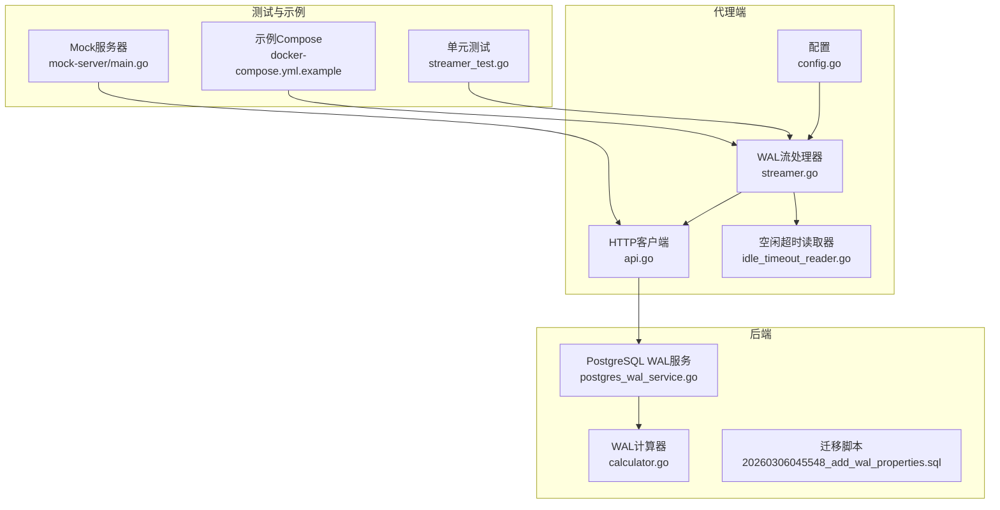
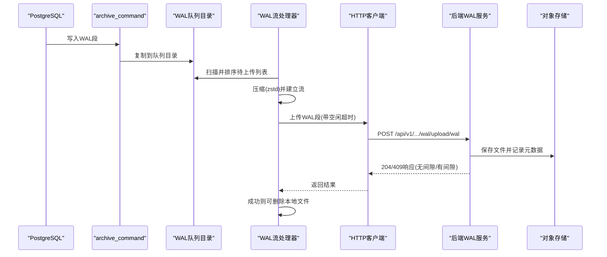
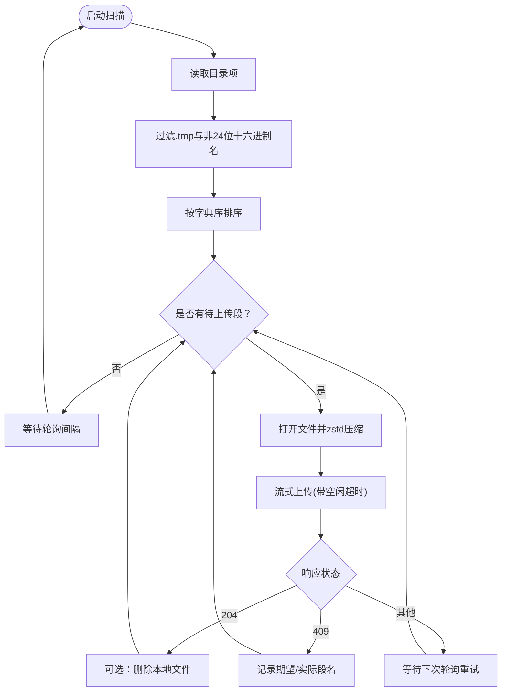
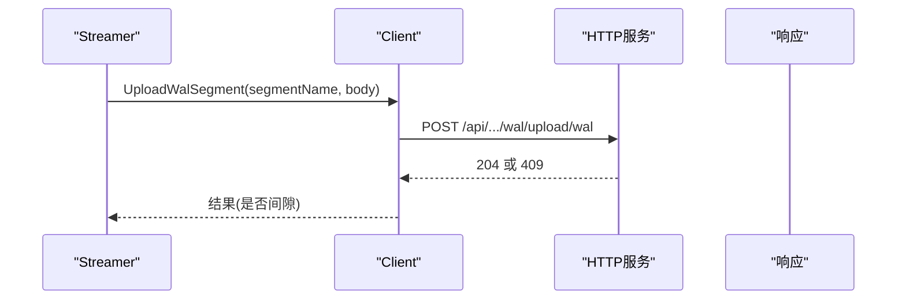
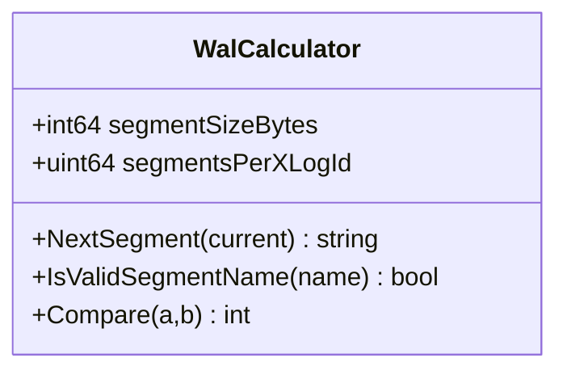
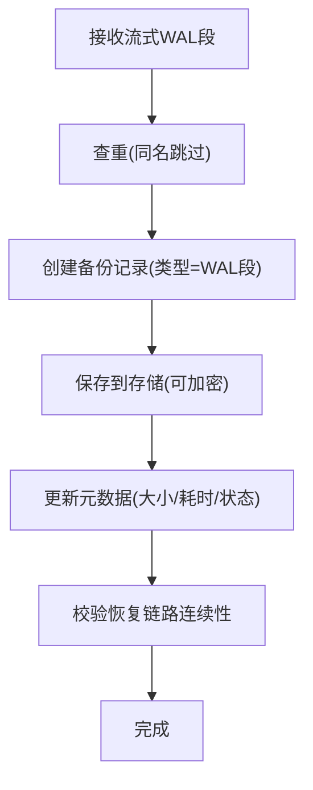
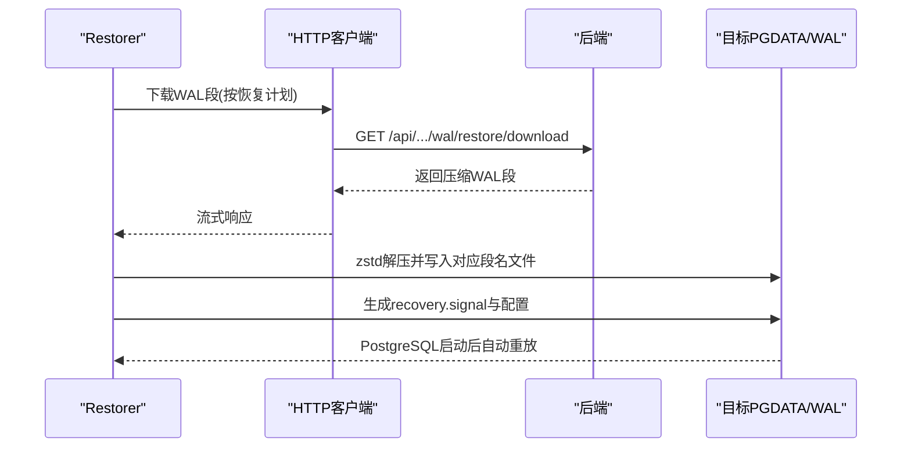
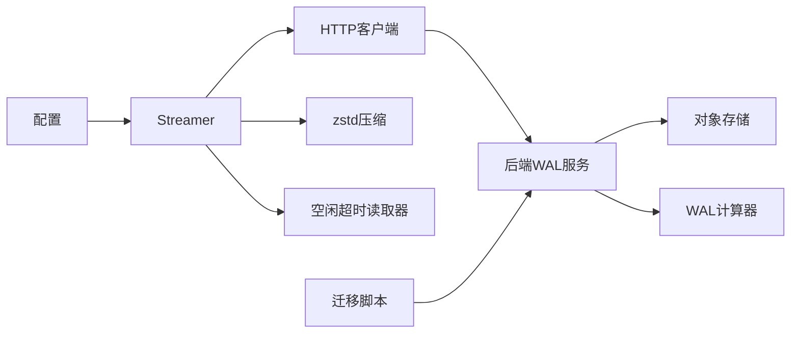

# WAL流处理

<cite>
**本文引用的文件**
- [agent/internal/features/wal/streamer.go](file://agent/internal/features/wal/streamer.go)
- [agent/internal/features/wal/streamer_test.go](file://agent/internal/features/wal/streamer_test.go)
- [agent/internal/features/api/api.go](file://agent/internal/features/api/api.go)
- [agent/internal/features/api/idle_timeout_reader.go](file://agent/internal/features/api/idle_timeout_reader.go)
- [agent/internal/config/config.go](file://agent/internal/config/config.go)
- [backend/internal/util/wal/calculator.go](file://backend/internal/util/wal/calculator.go)
- [backend/internal/util/wal/calculator_test.go](file://backend/internal/util/wal/calculator_test.go)
- [backend/internal/features/backups/backups/services/postgres_wal_service.go](file://backend/internal/features/backups/backups/services/postgres_wal_service.go)
- [backend/migrations/20260306045548_add_wal_properties.sql](file://backend/migrations/20260306045548_add_wal_properties.sql)
- [agent/docker-compose.yml.example](file://agent/docker-compose.yml.example)
- [agent/e2e/mock-server/main.go](file://agent/e2e/mock-server/main.go)
- [agent/internal/features/restore/restorer.go](file://agent/internal/features/restore/restorer.go)
- [frontend/src/entity/backups/model/PgWalBackupType.ts](file://frontend/src/entity/backups/model/PgWalBackupType.ts)
</cite>

## 目录
1. [简介](#简介)
2. [项目结构](#项目结构)
3. [核心组件](#核心组件)
4. [架构总览](#架构总览)
5. [详细组件分析](#详细组件分析)
6. [依赖关系分析](#依赖关系分析)
7. [性能考量](#性能考量)
8. [故障排查指南](#故障排查指南)
9. [结论](#结论)
10. [附录](#附录)

## 简介
本技术文档聚焦于 Databasus 的 WAL 流处理模块，系统性阐述 PostgreSQL WAL（Write-Ahead Logging）的实时捕获、压缩传输与归档机制。内容覆盖：
- 实时捕获算法：基于 WAL 队列目录扫描、有序上传与断点续传
- 数据传输协议：基于 HTTP 流式上传、超时与空闲检测、错误重试
- 完整性校验：WAL 段名称格式、序列号演进与链路连续性验证
- 性能优化：zstd 压缩、批量传输、带宽控制与资源管理
- 异常处理：空闲超时、链路间隙、错误上报与恢复策略
- PITR 关键作用：WAL 段在时间点恢复中的角色与实现路径

## 项目结构
WAL 流处理涉及代理端（采集与传输）、后端（接收与持久化）与工具库（WAL 名称计算），并辅以前端模型与示例配置。

**图表来源**
- [agent/internal/config/config.go:16-31](file://agent/internal/config/config.go#L16-L31)
- [agent/internal/features/wal/streamer.go:30-42](file://agent/internal/features/wal/streamer.go#L30-L42)
- [agent/internal/features/api/api.go:36-42](file://agent/internal/features/api/api.go#L36-L42)
- [agent/internal/features/api/idle_timeout_reader.go:16-21](file://agent/internal/features/api/idle_timeout_reader.go#L16-L21)
- [backend/internal/features/backups/backups/services/postgres_wal_service.go:24-32](file://backend/internal/features/backups/backups/services/postgres_wal_service.go#L24-L32)
- [backend/internal/util/wal/calculator.go:18-30](file://backend/internal/util/wal/calculator.go#L18-L30)
- [backend/migrations/20260306045548_add_wal_properties.sql:18-27](file://backend/migrations/20260306045548_add_wal_properties.sql#L18-L27)
- [agent/internal/features/wal/streamer_test.go:26-61](file://agent/internal/features/wal/streamer_test.go#L26-L61)
- [agent/e2e/mock-server/main.go:230-256](file://agent/e2e/mock-server/main.go#L230-L256)
- [agent/docker-compose.yml.example:15-20](file://agent/docker-compose.yml.example#L15-L20)

**章节来源**
- [agent/internal/config/config.go:16-31](file://agent/internal/config/config.go#L16-L31)
- [agent/internal/features/wal/streamer.go:30-42](file://agent/internal/features/wal/streamer.go#L30-L42)
- [agent/internal/features/api/api.go:36-42](file://agent/internal/features/api/api.go#L36-L42)
- [agent/internal/features/api/idle_timeout_reader.go:16-21](file://agent/internal/features/api/idle_timeout_reader.go#L16-L21)
- [backend/internal/features/backups/backups/services/postgres_wal_service.go:24-32](file://backend/internal/features/backups/backups/services/postgres_wal_service.go#L24-L32)
- [backend/internal/util/wal/calculator.go:18-30](file://backend/internal/util/wal/calculator.go#L18-L30)
- [backend/migrations/20260306045548_add_wal_properties.sql:18-27](file://backend/migrations/20260306045548_add_wal_properties.sql#L18-L27)
- [agent/internal/features/wal/streamer_test.go:26-61](file://agent/internal/features/wal/streamer_test.go#L26-L61)
- [agent/e2e/mock-server/main.go:230-256](file://agent/e2e/mock-server/main.go#L230-L256)
- [agent/docker-compose.yml.example:15-20](file://agent/docker-compose.yml.example#L15-L20)

## 核心组件
- WAL 流处理器（Streamer）
  - 负责扫描 WAL 队列目录、按序上传、压缩传输、删除策略与错误处理
- HTTP 客户端（Client）
  - 提供 WAL 段上传、基础备份上传/完成、恢复计划与下载等接口
- 空闲超时读取器（IdleTimeoutReader）
  - 检测上传过程中的网络停滞，避免资源浪费
- WAL 计算器（WalCalculator）
  - 解析与演进 WAL 段名称，支持比较与顺序判断
- 后端 WAL 服务（PostgreWalBackupService）
  - 接收流式上传、记录元数据、校验链路连续性、支持加密存储

**章节来源**
- [agent/internal/features/wal/streamer.go:30-42](file://agent/internal/features/wal/streamer.go#L30-L42)
- [agent/internal/features/api/api.go:200-242](file://agent/internal/features/api/api.go#L200-L242)
- [agent/internal/features/api/idle_timeout_reader.go:16-21](file://agent/internal/features/api/idle_timeout_reader.go#L16-L21)
- [backend/internal/util/wal/calculator.go:18-30](file://backend/internal/util/wal/calculator.go#L18-L30)
- [backend/internal/features/backups/backups/services/postgres_wal_service.go:34-97](file://backend/internal/features/backups/backups/services/postgres_wal_service.go#L34-L97)

## 架构总览
WAL 流处理从数据库写入开始，经由 archive_command 进入 WAL 队列目录，代理端周期扫描并上传压缩后的 WAL 段；后端接收后写入存储并记录元数据，用于后续 PITR 恢复。

**图表来源**
- [agent/docker-compose.yml.example:15-20](file://agent/docker-compose.yml.example#L15-L20)
- [agent/internal/features/wal/streamer.go:123-173](file://agent/internal/features/wal/streamer.go#L123-L173)
- [agent/internal/features/api/api.go:200-242](file://agent/internal/features/api/api.go#L200-L242)
- [backend/internal/features/backups/backups/services/postgres_wal_service.go:34-97](file://backend/internal/features/backups/backups/services/postgres_wal_service.go#L34-L97)
- [agent/e2e/mock-server/main.go:230-256](file://agent/e2e/mock-server/main.go#L230-L256)

## 详细组件分析

### 组件A：WAL流处理器（Streamer）
- 实时捕获算法
  - 周期性扫描 WAL 队列目录，过滤临时文件与非标准名称，按字典序升序上传
  - 使用管道与 goroutine 实现边读边压，避免内存峰值
- 数据传输协议
  - 通过自定义 HTTP 客户端进行流式上传，设置 Content-Type 与自定义头部标识段名
  - 采用空闲超时读取器检测网络停滞，防止长时间阻塞
- 错误重传机制
  - 单个段上传失败不中断整体流程，等待下次轮询重试
  - 对链路间隙返回 409 时，记录期望与实际段名，便于恢复策略
- 删除策略
  - 可配置上传成功后删除本地 WAL 段文件，减少磁盘占用

**图表来源**
- [agent/internal/features/wal/streamer.go:63-90](file://agent/internal/features/wal/streamer.go#L63-L90)
- [agent/internal/features/wal/streamer.go:123-173](file://agent/internal/features/wal/streamer.go#L123-L173)
- [agent/internal/features/api/idle_timeout_reader.go:43-55](file://agent/internal/features/api/idle_timeout_reader.go#L43-L55)

**章节来源**
- [agent/internal/features/wal/streamer.go:44-61](file://agent/internal/features/wal/streamer.go#L44-L61)
- [agent/internal/features/wal/streamer.go:63-90](file://agent/internal/features/wal/streamer.go#L63-L90)
- [agent/internal/features/wal/streamer.go:123-173](file://agent/internal/features/wal/streamer.go#L123-L173)
- [agent/internal/features/api/idle_timeout_reader.go:10-21](file://agent/internal/features/api/idle_timeout_reader.go#L10-L21)

### 组件B：HTTP客户端与API交互
- 上传接口
  - 上传 WAL 段：POST /api/v1/.../wal/upload/wal，携带 X-Wal-Segment-Name 头部
  - 响应 204 表示成功；409 表示链路间隙，返回期望与实际段名
- 其他接口
  - 基础备份上传/完成、恢复计划查询、下载备份文件等

**图表来源**
- [agent/internal/features/api/api.go:200-242](file://agent/internal/features/api/api.go#L200-L242)
- [agent/e2e/mock-server/main.go:230-256](file://agent/e2e/mock-server/main.go#L230-L256)

**章节来源**
- [agent/internal/features/api/api.go:17-32](file://agent/internal/features/api/api.go#L17-L32)
- [agent/internal/features/api/api.go:200-242](file://agent/internal/features/api/api.go#L200-L242)
- [agent/e2e/mock-server/main.go:230-256](file://agent/e2e/mock-server/main.go#L230-L256)

### 组件C：WAL名称与序列号管理
- 名称格式
  - 固定长度 24 位十六进制字符串：TTTTTTTTLLLLLLLLSSSSSSSS
  - 分别表示：时间线（TL）、日志文件（XLogId）、段内偏移（Segment）
- 序列号演进
  - 段编号递增，达到上限回绕并递增日志文件编号
  - 时间线保持不变
- 比较与有效性
  - 支持字典序比较，确保正确排序与连续性判断

**图表来源**
- [backend/internal/util/wal/calculator.go:18-30](file://backend/internal/util/wal/calculator.go#L18-L30)
- [backend/internal/util/wal/calculator.go:45-73](file://backend/internal/util/wal/calculator.go#L45-L73)
- [backend/internal/util/wal/calculator.go:75-84](file://backend/internal/util/wal/calculator.go#L75-L84)
- [backend/internal/util/wal/calculator.go:86-112](file://backend/internal/util/wal/calculator.go#L86-L112)

**章节来源**
- [backend/internal/util/wal/calculator.go:10-16](file://backend/internal/util/wal/calculator.go#L10-L16)
- [backend/internal/util/wal/calculator.go:45-73](file://backend/internal/util/wal/calculator.go#L45-L73)
- [backend/internal/util/wal/calculator.go:75-112](file://backend/internal/util/wal/calculator.go#L75-L112)
- [backend/internal/util/wal/calculator_test.go:16-132](file://backend/internal/util/wal/calculator_test.go#L16-L132)

### 组件D：后端WAL服务与归档
- 接收与存储
  - 接收流式 WAL 段，去重后写入对象存储，记录元数据（类型、段名、版本等）
- 链路连续性校验
  - 基于 WAL 计算器对恢复链路进行连续性检查，发现间隙时返回最后连续段
- 加密与进度跟踪
  - 支持加密存储与上传进度统计

**图表来源**
- [backend/internal/features/backups/backups/services/postgres_wal_service.go:34-97](file://backend/internal/features/backups/backups/services/postgres_wal_service.go#L34-L97)
- [backend/internal/features/backups/backups/services/postgres_wal_service.go:416-430](file://backend/internal/features/backups/backups/services/postgres_wal_service.go#L416-L430)
- [backend/internal/features/backups/backups/services/postgres_wal_service.go:482-512](file://backend/internal/features/backups/backups/services/postgres_wal_service.go#L482-L512)

**章节来源**
- [backend/internal/features/backups/backups/services/postgres_wal_service.go:34-97](file://backend/internal/features/backups/backups/services/postgres_wal_service.go#L34-L97)
- [backend/internal/features/backups/backups/services/postgres_wal_service.go:416-430](file://backend/internal/features/backups/backups/services/postgres_wal_service.go#L416-L430)
- [backend/internal/features/backups/backups/services/postgres_wal_service.go:482-512](file://backend/internal/features/backups/backups/services/postgres_wal_service.go#L482-L512)

### 组件E：恢复与PITR
- 下载与解压
  - 从后端下载加密/未加密的 WAL 段，使用 zstd 解压并写入目标实例的 WAL 目录
- 恢复配置
  - 生成恢复信号文件与自动配置，设置 restore_command 与 recovery_end_command
- PITR 关键作用
  - 通过连续的 WAL 段重放到指定时间点，实现精确的时间点恢复

**图表来源**
- [agent/internal/features/restore/restorer.go:301-327](file://agent/internal/features/restore/restorer.go#L301-L327)

**章节来源**
- [agent/internal/features/restore/restorer.go:279-327](file://agent/internal/features/restore/restorer.go#L279-L327)

## 依赖关系分析
- 代理端依赖
  - 配置驱动：PgWalDir、Token、删除策略
  - API 客户端：统一鉴权、流式上传、错误码解析
  - 工具库：zstd 压缩、空闲超时检测
- 后端依赖
  - 存储抽象：支持多种对象存储
  - WAL 计算器：保证段名演进与比较的正确性
  - 数据模型：新增 WAL 相关字段与索引

**图表来源**
- [agent/internal/config/config.go:16-28](file://agent/internal/config/config.go#L16-L28)
- [agent/internal/features/wal/streamer.go:175-204](file://agent/internal/features/wal/streamer.go#L175-L204)
- [agent/internal/features/api/api.go:36-42](file://agent/internal/features/api/api.go#L36-L42)
- [backend/internal/features/backups/backups/services/postgres_wal_service.go:24-32](file://backend/internal/features/backups/backups/services/postgres_wal_service.go#L24-L32)
- [backend/internal/util/wal/calculator.go:18-30](file://backend/internal/util/wal/calculator.go#L18-L30)
- [backend/migrations/20260306045548_add_wal_properties.sql:18-27](file://backend/migrations/20260306045548_add_wal_properties.sql#L18-L27)

**章节来源**
- [agent/internal/config/config.go:16-28](file://agent/internal/config/config.go#L16-L28)
- [agent/internal/features/wal/streamer.go:175-204](file://agent/internal/features/wal/streamer.go#L175-L204)
- [agent/internal/features/api/api.go:36-42](file://agent/internal/features/api/api.go#L36-L42)
- [backend/internal/features/backups/backups/services/postgres_wal_service.go:24-32](file://backend/internal/features/backups/backups/services/postgres_wal_service.go#L24-L32)
- [backend/internal/util/wal/calculator.go:18-30](file://backend/internal/util/wal/calculator.go#L18-L30)
- [backend/migrations/20260306045548_add_wal_properties.sql:18-27](file://backend/migrations/20260306045548_add_wal_properties.sql#L18-L27)

## 性能考量
- 压缩策略
  - 使用 zstd 中等压缩等级，兼顾 CPU 与带宽开销
- 传输模式
  - 流式上传避免整包缓存，降低内存峰值
- 扫描与排序
  - 按字典序上传，确保链路连续性，减少重传
- 删除策略
  - 成功上传后可删除本地文件，降低磁盘压力
- 并发与限速
  - 后端支持动态带宽管理与并发控制，避免拥塞

**章节来源**
- [agent/internal/features/wal/streamer.go:183-186](file://agent/internal/features/wal/streamer.go#L183-L186)
- [agent/internal/features/wal/streamer.go:123-173](file://agent/internal/features/wal/streamer.go#L123-L173)
- [agent/internal/features/wal/streamer.go:163-170](file://agent/internal/features/wal/streamer.go#L163-L170)
- [backend/internal/features/backups/backups/services/postgres_wal_service.go:495-508](file://backend/internal/features/backups/backups/services/postgres_wal_service.go#L495-L508)

## 故障排查指南
- 上传停滞
  - 现象：空闲超时触发，上传失败
  - 排查：检查网络稳定性、源文件是否损坏、带宽限制
  - 处理：等待下次轮询重试或修复网络后继续
- 链路间隙
  - 现象：后端返回 409，包含期望与实际段名
  - 排查：确认上游 archive_command 是否正确、是否存在丢段
  - 处理：补齐缺失段或调整恢复计划
- 服务器错误
  - 现象：后端返回 5xx，本地文件保留
  - 排查：查看后端日志、存储可用性
  - 处理：修复后端问题或切换存储后重试
- 删除策略
  - 现象：启用删除后文件被清理，禁用则保留
  - 排查：确认配置项 IsDeleteWalAfterUpload
  - 处理：根据磁盘空间与恢复需求选择策略

**章节来源**
- [agent/internal/features/api/idle_timeout_reader.go:10-21](file://agent/internal/features/api/idle_timeout_reader.go#L10-L21)
- [agent/internal/features/wal/streamer.go:142-173](file://agent/internal/features/wal/streamer.go#L142-L173)
- [agent/internal/features/wal/streamer_test.go:190-213](file://agent/internal/features/wal/streamer_test.go#L190-L213)
- [agent/internal/features/wal/streamer_test.go:259-290](file://agent/internal/features/wal/streamer_test.go#L259-L290)
- [agent/internal/features/wal/streamer_test.go:134-188](file://agent/internal/features/wal/streamer_test.go#L134-L188)

## 结论
Databasus 的 WAL 流处理模块通过“队列扫描 + 流式压缩 + 空闲超时 + 链路校验”的组合，实现了高可靠、低延迟的 WAL 传输与归档。配合后端的连续性校验与恢复能力，能够支撑稳定的 PITR 场景。建议在生产环境结合带宽与磁盘策略，持续监控链路间隙与空闲超时事件，确保 WAL 链路的完整性与可恢复性。

## 附录
- WAL 段类型枚举（前端）
  - PG_FULL_BACKUP：全量备份
  - PG_WAL_SEGMENT：WAL 段
- 示例配置
  - PostgreSQL 通过 archive_command 将 WAL 段复制到队列目录，配合代理端扫描上传

**章节来源**
- [frontend/src/entity/backups/model/PgWalBackupType.ts:1-4](file://frontend/src/entity/backups/model/PgWalBackupType.ts#L1-L4)
- [agent/docker-compose.yml.example:15-20](file://agent/docker-compose.yml.example#L15-L20)