# 代理服务

<cite>
**本文引用的文件**
- [agent/cmd/main.go](file://agent/cmd/main.go)
- [agent/internal/config/config.go](file://agent/internal/config/config.go)
- [agent/internal/config/dto.go](file://agent/internal/config/dto.go)
- [agent/internal/features/start/start.go](file://agent/internal/features/start/start.go)
- [agent/internal/features/start/daemon.go](file://agent/internal/features/start/daemon.go)
- [agent/internal/features/wal/streamer.go](file://agent/internal/features/wal/streamer.go)
- [agent/internal/features/full_backup/backuper.go](file://agent/internal/features/full_backup/backuper.go)
- [agent/internal/features/full_backup/stderr_parser.go](file://agent/internal/features/full_backup/stderr_parser.go)
- [agent/internal/features/restore/restorer.go](file://agent/internal/features/restore/restorer.go)
- [agent/internal/features/api/api.go](file://agent/internal/features/api/api.go)
- [agent/internal/features/api/idle_timeout_reader.go](file://agent/internal/features/api/idle_timeout_reader.go)
- [agent/internal/features/upgrade/upgrader.go](file://agent/internal/features/upgrade/upgrader.go)
- [agent/internal/features/upgrade/background_upgrader.go](file://agent/internal/features/upgrade/background_upgrader.go)
- [agent/internal/features/upgrade/errors.go](file://agent/internal/features/upgrade/errors.go)
- [agent/internal/logger/logger.go](file://agent/internal/logger/logger.go)
- [agent/go.mod](file://agent/go.mod)
- [agent/internal/features/full_backup/backuper_test.go](file://agent/internal/features/full_backup/backuper_test.go)
- [agent/internal/features/wal/streamer_test.go](file://agent/internal/features/wal/streamer_test.go)
</cite>

## 目录
1. [简介](#简介)
2. [项目结构](#项目结构)
3. [核心组件](#核心组件)
4. [架构总览](#架构总览)
5. [详细组件分析](#详细组件分析)
6. [依赖分析](#依赖分析)
7. [性能考虑](#性能考虑)
8. [故障排查指南](#故障排查指南)
9. [结论](#结论)
10. [附录](#附录)

## 简介
本文件为 Databasus 代理服务（databasus-agent）的组件设计文档，面向运维与开发人员，系统化阐述代理的架构设计与实现细节，覆盖以下主题：
- 守护进程管理：跨平台启动、停止、状态查询与锁文件机制
- WAL 流处理：队列扫描、zstd 压缩、空闲超时检测、断点续传与删除策略
- 备份执行引擎：基于 pg_basebackup 的全量备份、压缩上传、LSN 解析与最终化
- 自动升级机制：前后台升级、版本校验与重启策略
- 与数据库的直接通信协议：REST API 调用、流式上传、鉴权与重试
- 数据传输优化：管道压缩、空闲超时、分块传输
- 连接池管理：未使用传统连接池，采用短连接与流式直传
- 备份与恢复任务调度：周期检查、链路有效性判断、PITR 恢复
- 监控与日志：结构化日志、轮转、关键指标与告警建议
- 分布式协作：代理作为数据采集与传输节点，与后端服务协同工作

## 项目结构
代理服务采用按功能域划分的目录结构，核心模块如下：
- cmd：命令入口与参数解析
- internal/config：配置加载、持久化与来源追踪
- internal/features：功能特性模块（启动、WAL、全量备份、恢复、API、升级、锁）
- internal/logger：结构化日志与轮转

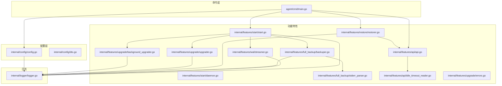

**图表来源**
- [agent/cmd/main.go:1-246](file://agent/cmd/main.go#L1-L246)
- [agent/internal/config/config.go:1-272](file://agent/internal/config/config.go#L1-L272)
- [agent/internal/config/dto.go:1-18](file://agent/internal/config/dto.go#L1-L18)
- [agent/internal/features/start/start.go:1-326](file://agent/internal/features/start/start.go#L1-L326)
- [agent/internal/features/start/daemon.go:1-122](file://agent/internal/features/start/daemon.go#L1-L122)
- [agent/internal/features/wal/streamer.go:1-205](file://agent/internal/features/wal/streamer.go#L1-L205)
- [agent/internal/features/full_backup/backuper.go:1-317](file://agent/internal/features/full_backup/backuper.go#L1-L317)
- [agent/internal/features/full_backup/stderr_parser.go:1-98](file://agent/internal/features/full_backup/stderr_parser.go#L1-L98)
- [agent/internal/features/restore/restorer.go:1-445](file://agent/internal/features/restore/restorer.go#L1-L445)
- [agent/internal/features/api/api.go:1-377](file://agent/internal/features/api/api.go#L1-L377)
- [agent/internal/features/api/idle_timeout_reader.go:1-61](file://agent/internal/features/api/idle_timeout_reader.go#L1-L61)
- [agent/internal/features/upgrade/upgrader.go:1-90](file://agent/internal/features/upgrade/upgrader.go#L1-L90)
- [agent/internal/features/upgrade/background_upgrader.go:1-89](file://agent/internal/features/upgrade/background_upgrader.go#L1-L89)
- [agent/internal/features/upgrade/errors.go:1-6](file://agent/internal/features/upgrade/errors.go#L1-L6)
- [agent/internal/logger/logger.go:1-116](file://agent/internal/logger/logger.go#L1-L116)

**章节来源**
- [agent/cmd/main.go:1-246](file://agent/cmd/main.go#L1-L246)
- [agent/internal/config/config.go:1-272](file://agent/internal/config/config.go#L1-L272)
- [agent/internal/features/start/start.go:1-326](file://agent/internal/features/start/start.go#L1-L326)
- [agent/internal/features/wal/streamer.go:1-205](file://agent/internal/features/wal/streamer.go#L1-L205)
- [agent/internal/features/full_backup/backuper.go:1-317](file://agent/internal/features/full_backup/backuper.go#L1-L317)
- [agent/internal/features/restore/restorer.go:1-445](file://agent/internal/features/restore/restorer.go#L1-L445)
- [agent/internal/features/api/api.go:1-377](file://agent/internal/features/api/api.go#L1-L377)
- [agent/internal/features/upgrade/background_upgrader.go:1-89](file://agent/internal/features/upgrade/background_upgrader.go#L1-L89)
- [agent/internal/logger/logger.go:1-116](file://agent/internal/logger/logger.go#L1-L116)

## 核心组件
- 命令入口与生命周期
  - 支持 start、stop、status、restore、version 等子命令
  - 启动前进行配置加载、保存、自动更新检查；支持开发模式跳过更新
  - 后台运行通过守护进程模式或 Windows 平台直接运行
- 配置系统
  - 从 JSON 文件与命令行参数加载，支持默认值与来源追踪
  - 关键项：Databasus 主机地址、数据库标识、令牌、PostgreSQL 连接信息、WAL 队列目录、是否上传后删除 WAL
- 启动与守护
  - 启动时验证配置、pg_basebackup 可用性、数据库连通性与版本
  - 获取互斥锁，初始化后台升级器、全量备份器与 WAL 流处理器
  - Windows 平台不使用守护进程，直接在前台运行
- WAL 流处理
  - 周期扫描 WAL 队列目录，按名称排序上传
  - 使用 zstd 压缩并通过管道流式上传，带空闲超时保护
  - 支持上传后删除与 GAP 检测
- 全量备份引擎
  - 定时检查 WAL 链有效性与下次全备时间，触发 pg_basebackup
  - 标准输出通过管道压缩后直传，stderr 解析 LSN 转换为段名并最终化
  - 失败上报并按指数退避重试
- 恢复执行器
  - 从服务器获取恢复计划，下载并解压 basebackup，批量下载 WAL
  - 写入 recovery.signal 与 postgresql.auto.conf，支持 PITR 时间点
- API 客户端
  - REST JSON 接口用于链路检查、下一次全备时间、错误上报、版本与二进制下载
  - 流式上传/下载使用独立 HTTP 客户端，设置空闲超时读取器
- 升级机制
  - 前台检查更新与后台升级器并发运行
  - 下载目标架构二进制、权限设置、版本校验、替换并重启
- 日志系统
  - 结构化文本日志，带时间戳与轮转，最大 5MB，保留旧日志

**章节来源**
- [agent/cmd/main.go:24-193](file://agent/cmd/main.go#L24-L193)
- [agent/internal/config/config.go:35-272](file://agent/internal/config/config.go#L35-L272)
- [agent/internal/features/start/start.go:33-101](file://agent/internal/features/start/start.go#L33-L101)
- [agent/internal/features/wal/streamer.go:44-173](file://agent/internal/features/wal/streamer.go#L44-L173)
- [agent/internal/features/full_backup/backuper.go:66-244](file://agent/internal/features/full_backup/backuper.go#L66-L244)
- [agent/internal/features/restore/restorer.go:58-102](file://agent/internal/features/restore/restorer.go#L58-L102)
- [agent/internal/features/api/api.go:44-377](file://agent/internal/features/api/api.go#L44-L377)
- [agent/internal/features/upgrade/background_upgrader.go:42-88](file://agent/internal/features/upgrade/background_upgrader.go#L42-L88)
- [agent/internal/logger/logger.go:76-116](file://agent/internal/logger/logger.go#L76-L116)

## 架构总览
代理在本地以守护进程方式运行，负责：
- 与数据库建立直接连接（通过 pg_basebackup 与 psql），采集 WAL 与全量数据
- 将 WAL 与全量备份以流式方式上传至后端服务
- 在后台执行自动升级，确保代理版本与后端一致
- 提供恢复能力，按恢复计划下载并配置恢复环境

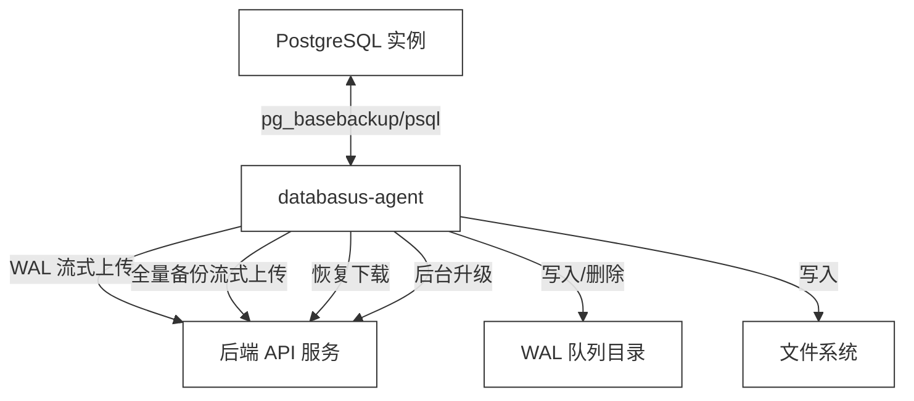

**图表来源**
- [agent/internal/features/start/start.go:76-101](file://agent/internal/features/start/start.go#L76-L101)
- [agent/internal/features/wal/streamer.go:44-90](file://agent/internal/features/wal/streamer.go#L44-L90)
- [agent/internal/features/full_backup/backuper.go:164-244](file://agent/internal/features/full_backup/backuper.go#L164-L244)
- [agent/internal/features/restore/restorer.go:130-146](file://agent/internal/features/restore/restorer.go#L130-L146)
- [agent/internal/features/api/api.go:120-198](file://agent/internal/features/api/api.go#L120-L198)

## 详细组件分析

### 命令入口与生命周期
- 子命令解析与执行
  - start：加载配置、保存 JSON、可选跳过更新、执行启动逻辑
  - _run：后台守护运行，获取锁、初始化升级器、启动 WAL 与全量备份
  - stop/status：基于锁文件与进程存在性控制
  - restore：构建恢复器，下载 basebackup 与 WAL，生成恢复配置
  - version：打印版本
- 自动更新检查
  - 若未跳过且主机有效，调用 API 检查版本并下载新二进制，随后重新执行自身

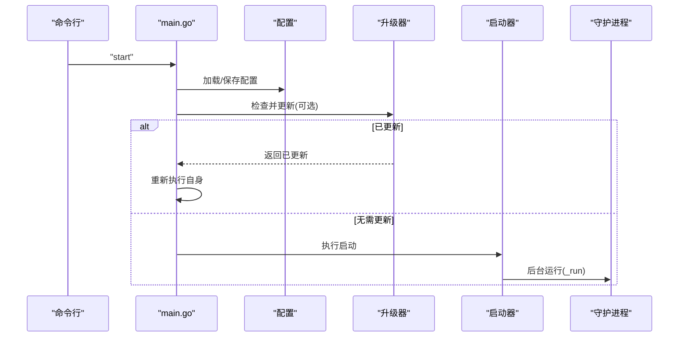

**图表来源**
- [agent/cmd/main.go:50-97](file://agent/cmd/main.go#L50-L97)
- [agent/internal/features/upgrade/upgrader.go:18-73](file://agent/internal/features/upgrade/upgrader.go#L18-L73)
- [agent/internal/features/start/start.go:60-101](file://agent/internal/features/start/start.go#L60-L101)

**章节来源**
- [agent/cmd/main.go:24-193](file://agent/cmd/main.go#L24-L193)
- [agent/internal/features/upgrade/upgrader.go:18-73](file://agent/internal/features/upgrade/upgrader.go#L18-L73)
- [agent/internal/features/start/daemon.go:23-76](file://agent/internal/features/start/daemon.go#L23-L76)

### 配置系统
- 数据结构与来源追踪
  - Config 包含 Databasus 主机、数据库 ID、令牌、PostgreSQL 连接参数、WAL 队列目录、上传后删除策略等
  - parsedFlags 记录每个字段的来源（JSON 或命令行），便于审计与排错
- 加载与应用
  - 优先从 JSON 文件加载，再用命令行参数覆盖
  - 应用默认值（如端口、类型、删除策略）
  - 输出配置来源日志，避免“凭空出现”的参数

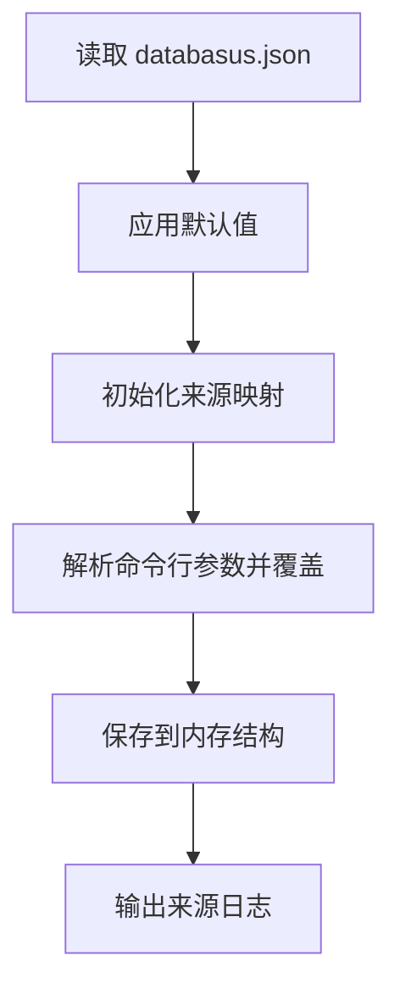

**图表来源**
- [agent/internal/config/config.go:35-272](file://agent/internal/config/config.go#L35-L272)
- [agent/internal/config/dto.go:3-17](file://agent/internal/config/dto.go#L3-L17)

**章节来源**
- [agent/internal/config/config.go:16-115](file://agent/internal/config/config.go#L16-L115)
- [agent/internal/config/config.go:117-234](file://agent/internal/config/config.go#L117-L234)
- [agent/internal/config/config.go:236-272](file://agent/internal/config/config.go#L236-L272)

### 启动与守护
- 启动阶段
  - 校验必要参数与连接信息
  - 验证 pg_basebackup 可用性（主机/容器两种模式）
  - 连接数据库并检查版本（最低 15）
- 守护运行
  - 获取互斥锁，初始化信号上下文
  - 启动后台升级器（非 Windows、非 dev）
  - 启动全量备份器与 WAL 流处理器
  - 等待升级器完成，若已升级则返回重启信号

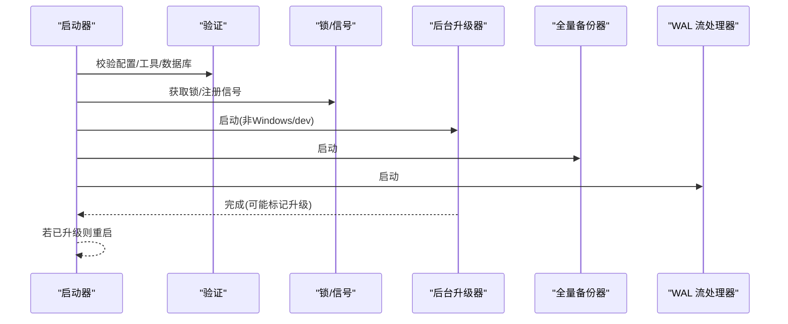

**图表来源**
- [agent/internal/features/start/start.go:33-101](file://agent/internal/features/start/start.go#L33-L101)
- [agent/internal/features/start/start.go:143-325](file://agent/internal/features/start/start.go#L143-L325)
- [agent/internal/features/upgrade/background_upgrader.go:42-88](file://agent/internal/features/upgrade/background_upgrader.go#L42-L88)

**章节来源**
- [agent/internal/features/start/start.go:103-141](file://agent/internal/features/start/start.go#L103-L141)
- [agent/internal/features/start/start.go:143-325](file://agent/internal/features/start/start.go#L143-L325)

### WAL 流处理
- 扫描与排序
  - 读取 WAL 队列目录，过滤临时文件与非法命名，按字典序升序上传
- 压缩与流式上传
  - 使用 zstd 编码器与 io.Pipe，边压缩边上传
  - 通过 IdleTimeoutReader 检测空闲超时，避免网络/源停滞导致资源占用
- 结果处理
  - 成功返回 204 表示无 GAP
  - 409 返回 GAP 详情，记录期望与实际段名
  - 可配置上传后删除，失败则保留以便重试

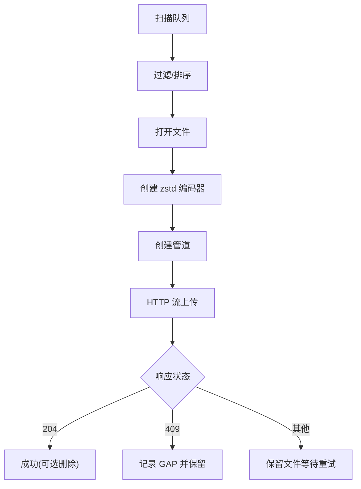

**图表来源**
- [agent/internal/features/wal/streamer.go:92-173](file://agent/internal/features/wal/streamer.go#L92-L173)
- [agent/internal/features/api/idle_timeout_reader.go:23-61](file://agent/internal/features/api/idle_timeout_reader.go#L23-L61)

**章节来源**
- [agent/internal/features/wal/streamer.go:44-173](file://agent/internal/features/wal/streamer.go#L44-L173)
- [agent/internal/features/api/idle_timeout_reader.go:10-61](file://agent/internal/features/api/idle_timeout_reader.go#L10-L61)

### 全量备份引擎
- 触发条件
  - WAL 链无效（无全量或链断裂）
  - 到达下次全量备份时间
- 执行流程
  - 构建 pg_basebackup 命令（主机/容器两种）
  - 标准输出经管道压缩后直传
  - 等待上传完成，解析 stderr 中的起止 LSN 并转换为段名
  - 调用最终化接口，上报错误或完成结果
- 错误与重试
  - 上传失败时上报错误，按固定延迟重试
  - 进程被杀时清理残留

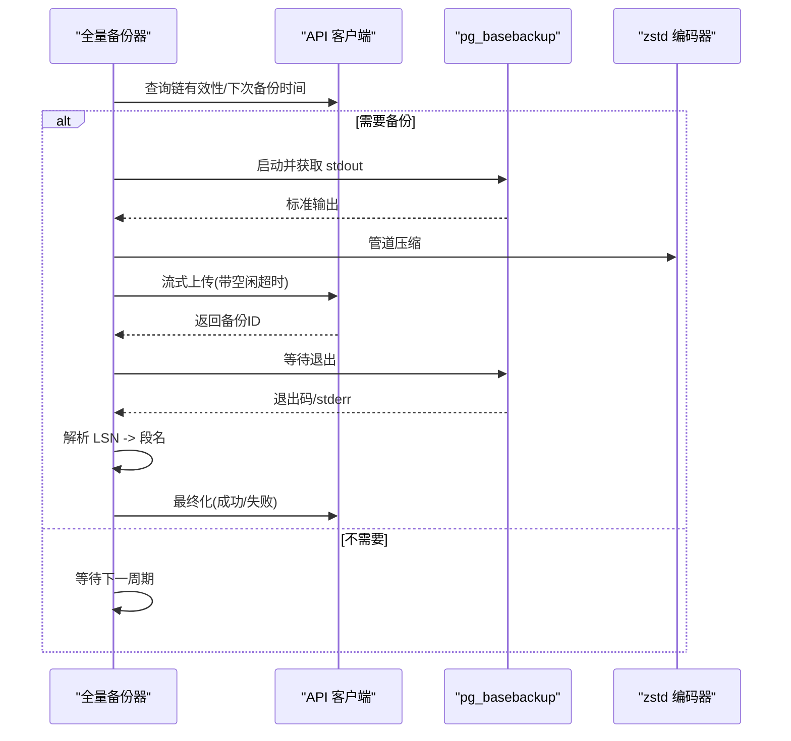

**图表来源**
- [agent/internal/features/full_backup/backuper.go:85-244](file://agent/internal/features/full_backup/backuper.go#L85-L244)
- [agent/internal/features/full_backup/stderr_parser.go:18-98](file://agent/internal/features/full_backup/stderr_parser.go#L18-L98)
- [agent/internal/features/api/api.go:120-198](file://agent/internal/features/api/api.go#L120-L198)

**章节来源**
- [agent/internal/features/full_backup/backuper.go:66-244](file://agent/internal/features/full_backup/backuper.go#L66-L244)
- [agent/internal/features/full_backup/stderr_parser.go:18-98](file://agent/internal/features/full_backup/stderr_parser.go#L18-L98)

### 恢复执行器
- 恢复计划
  - 从服务器获取恢复计划，包含 basebackup ID、WAL 段列表、总量等
- 下载与解压
  - 下载 basebackup 并解压到目标 PGDATA
  - 下载所有 WAL 段到临时目录
- 恢复配置
  - 创建 recovery.signal
  - 写入 postgresql.auto.conf，设置 restore_command、recovery_end_command、recovery_target_action
  - 若指定时间点，则写入 recovery_target_time
- 权限与提示
  - 设置 PGDATA 权限
  - 输出启动 PostgreSQL 的指引（容器/主机）

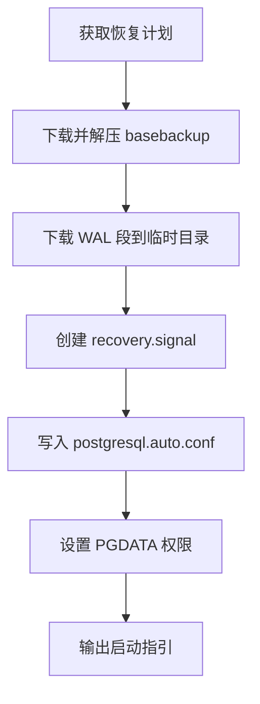

**图表来源**
- [agent/internal/features/restore/restorer.go:130-146](file://agent/internal/features/restore/restorer.go#L130-L146)
- [agent/internal/features/restore/restorer.go:165-181](file://agent/internal/features/restore/restorer.go#L165-L181)
- [agent/internal/features/restore/restorer.go:245-327](file://agent/internal/features/restore/restorer.go#L245-L327)
- [agent/internal/features/restore/restorer.go:329-363](file://agent/internal/features/restore/restorer.go#L329-L363)

**章节来源**
- [agent/internal/features/restore/restorer.go:58-102](file://agent/internal/features/restore/restorer.go#L58-L102)
- [agent/internal/features/restore/restorer.go:130-146](file://agent/internal/features/restore/restorer.go#L130-L146)
- [agent/internal/features/restore/restorer.go:329-402](file://agent/internal/features/restore/restorer.go#L329-L402)

### API 客户端与通信协议
- 接口定义
  - 链有效性检查、下次全备时间、错误上报、WAL/全量上传、恢复计划、版本与二进制下载
- 传输方式
  - JSON 请求使用 resty 客户端，带超时与重试
  - 流式上传/下载使用标准 http.Client，避免整包缓冲
- 空闲超时
  - 对上传流包装 IdleTimeoutReader，在长时间无数据时取消并关闭底层读取器

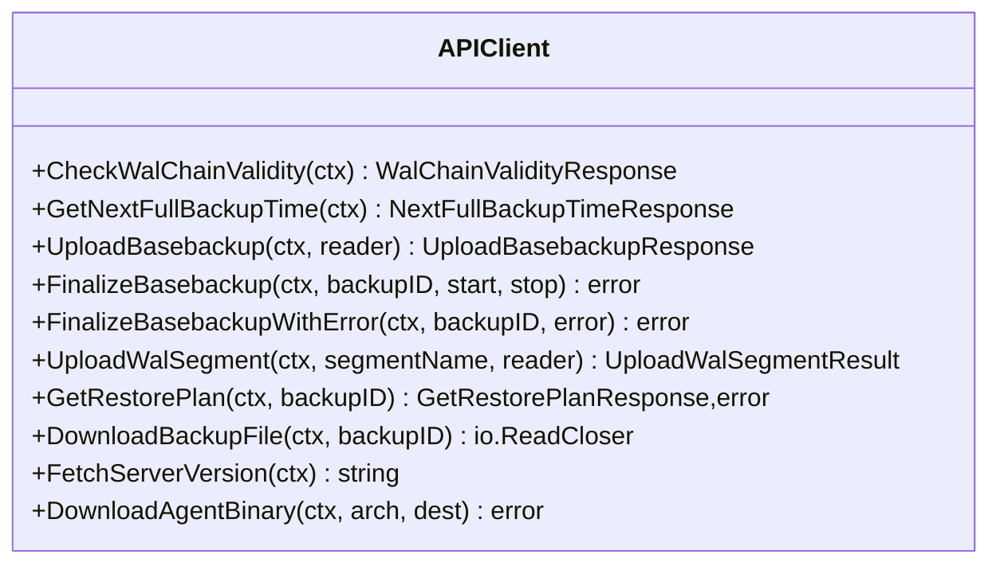

**图表来源**
- [agent/internal/features/api/api.go:36-377](file://agent/internal/features/api/api.go#L36-L377)
- [agent/internal/features/api/idle_timeout_reader.go:16-61](file://agent/internal/features/api/idle_timeout_reader.go#L16-L61)

**章节来源**
- [agent/internal/features/api/api.go:17-32](file://agent/internal/features/api/api.go#L17-L32)
- [agent/internal/features/api/api.go:44-377](file://agent/internal/features/api/api.go#L44-L377)
- [agent/internal/features/api/idle_timeout_reader.go:10-61](file://agent/internal/features/api/idle_timeout_reader.go#L10-L61)

### 升级机制
- 前台检查
  - 非 dev 模式下拉取服务器版本，下载对应架构二进制，校验版本后替换
- 后台升级
  - 定时轮询检查，发现新版本后立即触发升级并通知主循环重启
- 重启策略
  - 通过错误信号通知上层重新执行自身

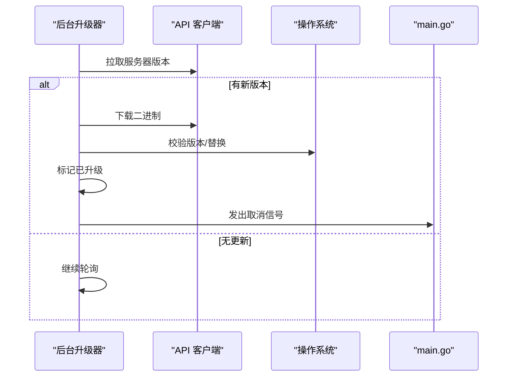

**图表来源**
- [agent/internal/features/upgrade/background_upgrader.go:42-88](file://agent/internal/features/upgrade/background_upgrader.go#L42-L88)
- [agent/internal/features/upgrade/upgrader.go:18-73](file://agent/internal/features/upgrade/upgrader.go#L18-L73)
- [agent/cmd/main.go:232-245](file://agent/cmd/main.go#L232-L245)

**章节来源**
- [agent/internal/features/upgrade/background_upgrader.go:14-88](file://agent/internal/features/upgrade/background_upgrader.go#L14-L88)
- [agent/internal/features/upgrade/upgrader.go:15-73](file://agent/internal/features/upgrade/upgrader.go#L15-L73)
- [agent/internal/features/upgrade/errors.go:1-6](file://agent/internal/features/upgrade/errors.go#L1-L6)

### 日志与监控
- 日志
  - 结构化文本日志，统一时间格式，同时输出到控制台与轮转文件
  - 文件大小上限 5MB，旧日志自动轮转
- 监控建议
  - 关键指标：WAL 上传速率、全量备份耗时、错误率、升级次数与时延
  - 告警阈值：上传空闲超时次数、备份失败重试次数、恢复下载失败次数

**章节来源**
- [agent/internal/logger/logger.go:18-116](file://agent/internal/logger/logger.go#L18-L116)

## 依赖分析
- 外部库
  - resty：HTTP JSON 客户端，带重试与超时
  - pgx：PostgreSQL 连接与验证
  - zstd：压缩编码
  - testify：单元测试断言
- 内部模块耦合
  - 启动器依赖配置、API、升级器、WAL、全量备份
  - API 客户端被 WAL、全量备份、恢复器广泛使用
  - 升级器与启动器通过信号交互

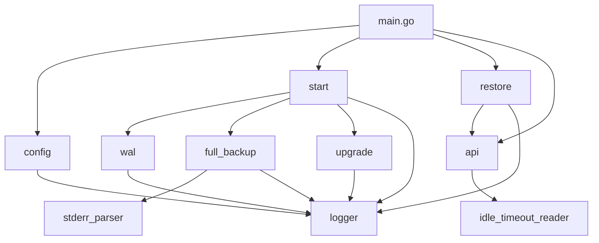

**图表来源**
- [agent/go.mod:5-10](file://agent/go.mod#L5-L10)
- [agent/cmd/main.go:14-20](file://agent/cmd/main.go#L14-L20)
- [agent/internal/features/start/start.go:18-25](file://agent/internal/features/start/start.go#L18-L25)
- [agent/internal/features/api/api.go:14](file://agent/internal/features/api/api.go#L14)

**章节来源**
- [agent/go.mod:1-23](file://agent/go.mod#L1-L23)

## 性能考虑
- 流式传输与压缩
  - 使用 io.Pipe 与 zstd 编码器，避免大对象内存驻留
  - 上传超时与空闲超时防止卡顿与资源泄漏
- 并发与隔离
  - WAL 上传与全量备份并发执行，互不阻塞
  - 全量备份使用原子标志串行化，避免重复执行
- I/O 与存储
  - WAL 队列目录仅存放二进制段文件，上传后可删除以节省空间
  - 恢复阶段先解压 basebackup 再下载 WAL，减少磁盘碎片

[本节为通用指导，无需特定文件引用]

## 故障排查指南
- 启动失败
  - 检查配置来源日志，确认参数是否来自 JSON 或命令行
  - 确认 pg_basebackup 可用性与数据库连接信息
- WAL 上传异常
  - 查看空闲超时日志，定位网络或上游停滞
  - 检查服务器返回状态（204/409），关注 GAP 检测
- 全量备份失败
  - 查看 stderr 解析日志，确认 LSN 是否可识别
  - 检查重试日志与错误上报
- 恢复失败
  - 确认目标 PGDATA 目录为空且可写
  - 检查 postgresql.auto.conf 中路径是否正确
- 升级失败
  - 查看版本拉取与二进制下载日志
  - 确认替换权限与版本校验

**章节来源**
- [agent/internal/features/wal/streamer.go:63-90](file://agent/internal/features/wal/streamer.go#L63-L90)
- [agent/internal/features/full_backup/backuper.go:126-162](file://agent/internal/features/full_backup/backuper.go#L126-L162)
- [agent/internal/features/restore/restorer.go:104-128](file://agent/internal/features/restore/restorer.go#L104-L128)
- [agent/internal/features/upgrade/upgrader.go:54-73](file://agent/internal/features/upgrade/upgrader.go#L54-L73)

## 结论
Databasus 代理服务通过清晰的模块化设计与稳健的工程实践，实现了：
- 高可用的守护进程管理与跨平台兼容
- 高效的 WAL 流处理与全量备份上传
- 强健的错误恢复与重试机制
- 平滑的自动升级与版本一致性保障
- 易于维护的日志与可观测性

该架构为分布式备份系统提供了可靠的本地采集与传输节点，配合后端服务实现完整的备份、恢复与治理能力。

[本节为总结性内容，无需特定文件引用]

## 附录
- 关键流程图（WAL 上传与全量备份）
  - WAL 上传：见“WAL 流处理”章节的流程图
  - 全量备份：见“全量备份引擎”章节的序列图

**章节来源**
- [agent/internal/features/wal/streamer.go:92-173](file://agent/internal/features/wal/streamer.go#L92-L173)
- [agent/internal/features/full_backup/backuper.go:85-244](file://agent/internal/features/full_backup/backuper.go#L85-L244)