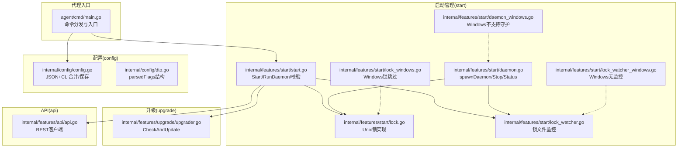
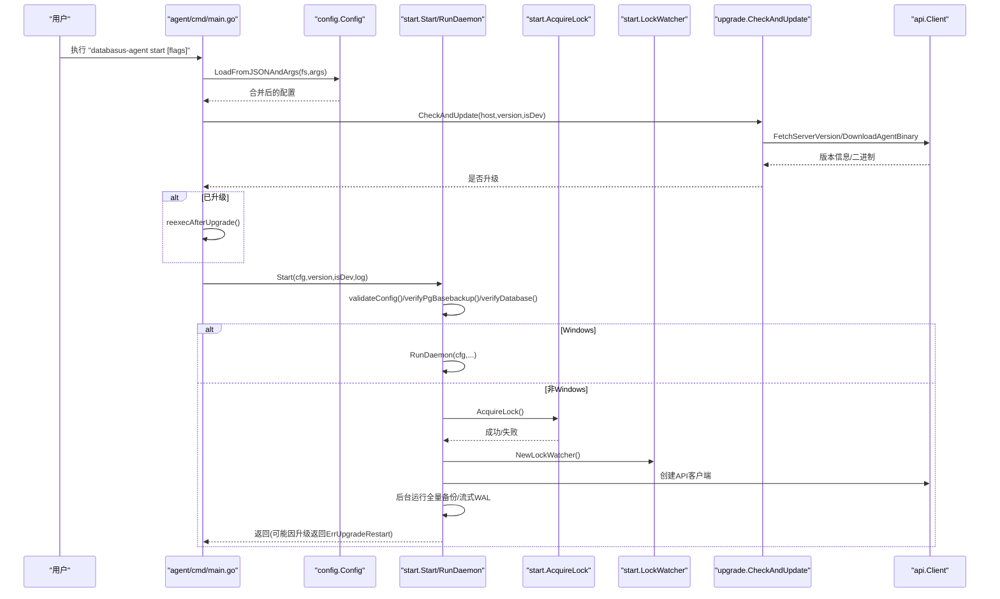
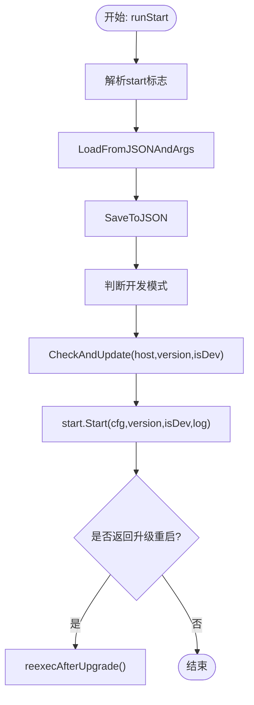
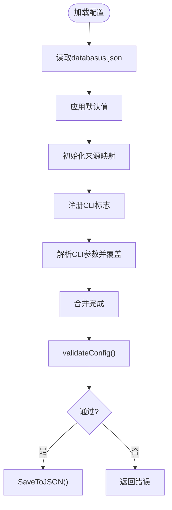
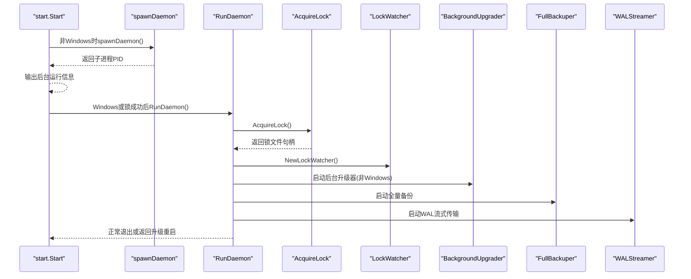
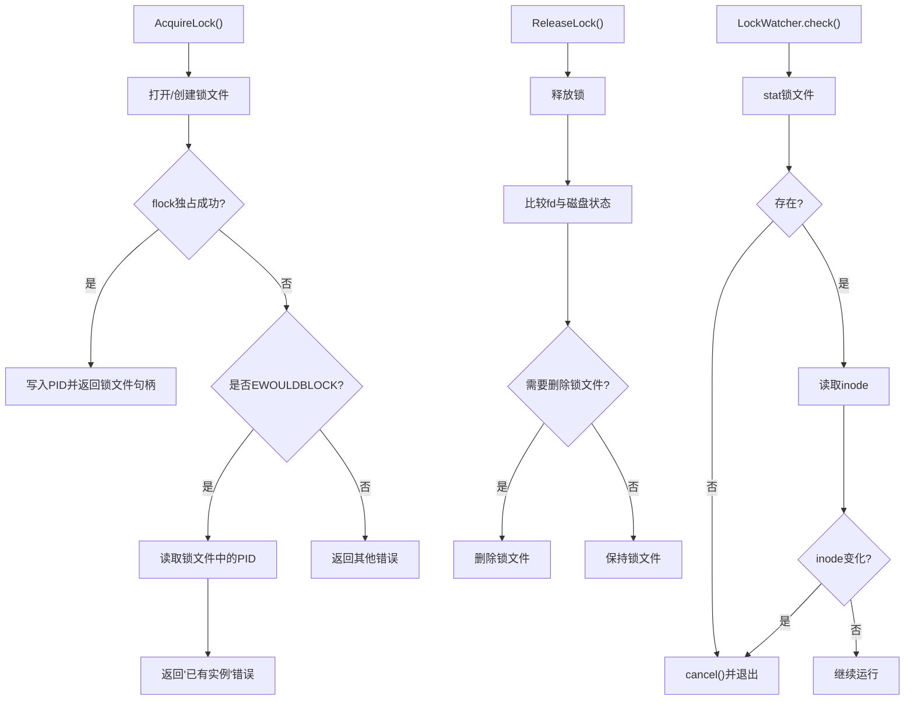
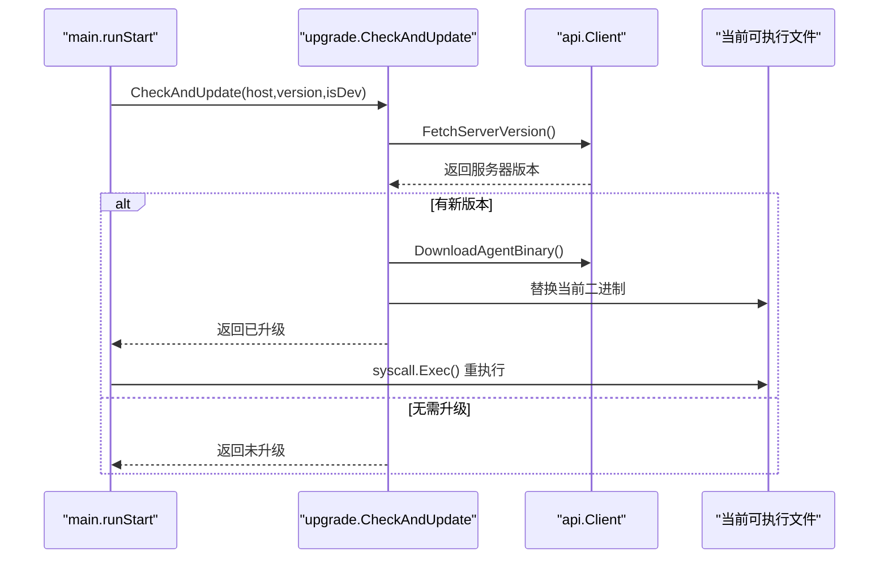
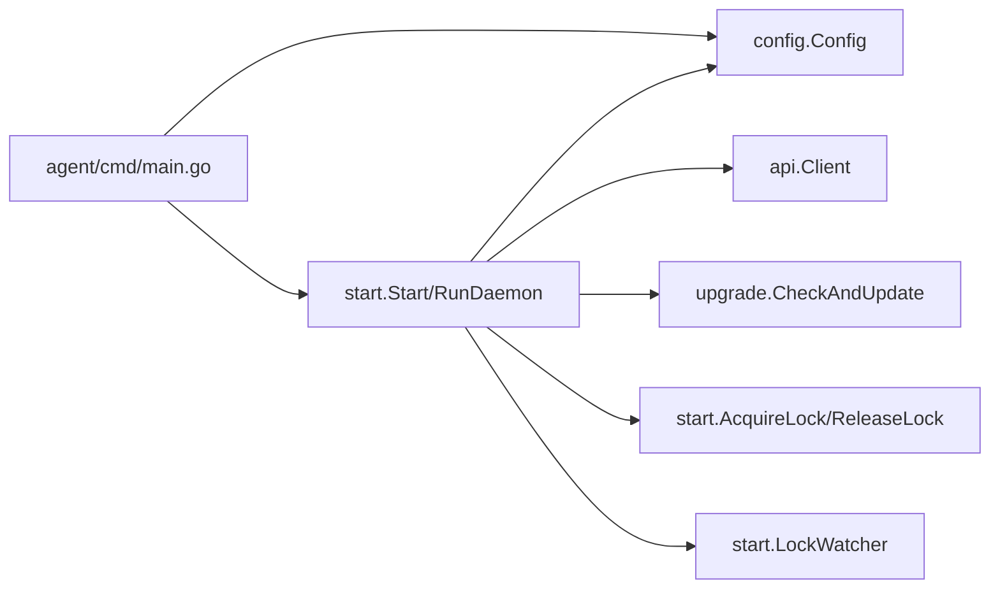

# 启动管理

<cite>
**本文引用的文件**
- [agent/cmd/main.go](file://agent/cmd/main.go)
- [agent/internal/config/config.go](file://agent/internal/config/config.go)
- [agent/internal/config/dto.go](file://agent/internal/config/dto.go)
- [agent/internal/features/start/start.go](file://agent/internal/features/start/start.go)
- [agent/internal/features/start/daemon.go](file://agent/internal/features/start/daemon.go)
- [agent/internal/features/start/daemon_windows.go](file://agent/internal/features/start/daemon_windows.go)
- [agent/internal/features/start/lock.go](file://agent/internal/features/start/lock.go)
- [agent/internal/features/start/lock_windows.go](file://agent/internal/features/start/lock_windows.go)
- [agent/internal/features/start/lock_watcher.go](file://agent/internal/features/start/lock_watcher.go)
- [agent/internal/features/start/lock_watcher_windows.go](file://agent/internal/features/start/lock_watcher_windows.go)
- [agent/internal/features/upgrade/upgrader.go](file://agent/internal/features/upgrade/upgrader.go)
- [agent/internal/features/api/api.go](file://agent/internal/features/api/api.go)
</cite>

## 目录
1. [简介](#简介)
2. [项目结构](#项目结构)
3. [核心组件](#核心组件)
4. [架构总览](#架构总览)
5. [详细组件分析](#详细组件分析)
6. [依赖分析](#依赖分析)
7. [性能考虑](#性能考虑)
8. [故障排查指南](#故障排查指南)
9. [结论](#结论)
10. [附录](#附录)

## 简介
本文件面向Databasus代理启动管理模块，系统化阐述“start”命令的实现逻辑与守护进程生命周期管理，覆盖以下关键主题：
- 启动流程：参数解析、配置加载、校验与初始化、守护进程创建
- 进程锁机制：跨平台实现差异、获取/释放/监控
- 错误处理与升级重入：自动更新检查、升级后重启
- 启动失败常见原因与调试方法

## 项目结构
启动管理相关代码集中在agent模块的cmd入口与internal/features/start子包中，并通过internal/config与internal/features/upgrade等模块协同工作。

图表来源
- [agent/cmd/main.go:24-75](file://agent/cmd/main.go#L24-L75)
- [agent/internal/features/start/start.go:33-101](file://agent/internal/features/start/start.go#L33-L101)
- [agent/internal/features/start/daemon.go:78-121](file://agent/internal/features/start/daemon.go#L78-L121)
- [agent/internal/features/start/daemon_windows.go:18-20](file://agent/internal/features/start/daemon_windows.go#L18-L20)
- [agent/internal/features/start/lock.go:18-49](file://agent/internal/features/start/lock.go#L18-L49)
- [agent/internal/features/start/lock_windows.go:8-18](file://agent/internal/features/start/lock_windows.go#L8-L18)
- [agent/internal/features/start/lock_watcher.go:21-72](file://agent/internal/features/start/lock_watcher.go#L21-L72)
- [agent/internal/features/start/lock_watcher_windows.go:13-17](file://agent/internal/features/start/lock_watcher_windows.go#L13-L17)
- [agent/internal/config/config.go:35-74](file://agent/internal/config/config.go#L35-L74)
- [agent/internal/config/dto.go:3-17](file://agent/internal/config/dto.go#L3-L17)
- [agent/internal/features/upgrade/upgrader.go:18-73](file://agent/internal/features/upgrade/upgrader.go#L18-L73)
- [agent/internal/features/api/api.go:44-70](file://agent/internal/features/api/api.go#L44-L70)

章节来源
- [agent/cmd/main.go:24-75](file://agent/cmd/main.go#L24-L75)
- [agent/internal/features/start/start.go:33-101](file://agent/internal/features/start/start.go#L33-L101)
- [agent/internal/config/config.go:35-74](file://agent/internal/config/config.go#L35-L74)

## 核心组件
- 命令入口与分发：解析命令与参数，调用对应子流程（start/_run/stop/status/restore/version）
- 配置系统：从JSON与CLI合并配置，应用默认值并持久化
- 启动器：执行配置校验、数据库连通性与版本校验、守护进程创建或直接运行
- 守护进程：Unix下创建会话并后台运行；Windows不支持守护模式
- 进程锁：Unix使用flock实现互斥，写入PID；Windows跳过锁
- 锁监控：定期检查锁文件inode变化，异常时触发优雅退出
- 升级：在非开发模式下检查服务器版本并下载替换二进制，必要时重执行自身

章节来源
- [agent/cmd/main.go:24-75](file://agent/cmd/main.go#L24-L75)
- [agent/internal/config/config.go:35-74](file://agent/internal/config/config.go#L35-L74)
- [agent/internal/features/start/start.go:33-101](file://agent/internal/features/start/start.go#L33-L101)
- [agent/internal/features/start/daemon.go:78-121](file://agent/internal/features/start/daemon.go#L78-L121)
- [agent/internal/features/start/daemon_windows.go:18-20](file://agent/internal/features/start/daemon_windows.go#L18-L20)
- [agent/internal/features/start/lock.go:18-49](file://agent/internal/features/start/lock.go#L18-L49)
- [agent/internal/features/start/lock_windows.go:8-18](file://agent/internal/features/start/lock_windows.go#L8-L18)
- [agent/internal/features/start/lock_watcher.go:21-72](file://agent/internal/features/start/lock_watcher.go#L21-L72)
- [agent/internal/features/upgrade/upgrader.go:18-73](file://agent/internal/features/upgrade/upgrader.go#L18-L73)

## 架构总览
下图展示从命令执行到守护进程运行的完整路径，包括配置加载、校验、锁获取与守护进程创建。

图表来源
- [agent/cmd/main.go:50-75](file://agent/cmd/main.go#L50-L75)
- [agent/internal/config/config.go:35-74](file://agent/internal/config/config.go#L35-L74)
- [agent/internal/features/start/start.go:33-101](file://agent/internal/features/start/start.go#L33-L101)
- [agent/internal/features/start/lock.go:18-49](file://agent/internal/features/start/lock.go#L18-L49)
- [agent/internal/features/start/lock_watcher.go:21-72](file://agent/internal/features/start/lock_watcher.go#L21-L72)
- [agent/internal/features/upgrade/upgrader.go:18-73](file://agent/internal/features/upgrade/upgrader.go#L18-L73)
- [agent/internal/features/api/api.go:44-70](file://agent/internal/features/api/api.go#L44-L70)

## 详细组件分析

### 命令入口与启动流程
- 入口函数根据第一个参数分发到不同子命令，start命令进入runStart流程
- runStart负责：
  - 解析start专用标志（如skip-update）
  - 加载并合并配置（JSON与CLI），保存到JSON
  - 判断是否开发模式，执行自动更新检查
  - 调用start.Start进行启动
  - 若返回升级重启信号，则重新执行自身

图表来源
- [agent/cmd/main.go:50-75](file://agent/cmd/main.go#L50-L75)
- [agent/internal/config/config.go:35-74](file://agent/internal/config/config.go#L35-L74)
- [agent/internal/features/upgrade/upgrader.go:18-73](file://agent/internal/features/upgrade/upgrader.go#L18-L73)

章节来源
- [agent/cmd/main.go:50-75](file://agent/cmd/main.go#L50-L75)

### 配置加载与验证
- 配置结构体包含Databasus主机、数据库ID、Token、PostgreSQL连接参数、WAL目录、删除策略等
- 加载顺序：先读取JSON，应用默认值，初始化来源映射，注册CLI标志，解析CLI并覆盖同名字段
- 保存配置：将当前内存状态写回JSON文件
- 启动前验证：校验必填项与类型合法性；对pg-basebackup与数据库连通性进行探测

图表来源
- [agent/internal/config/config.go:35-74](file://agent/internal/config/config.go#L35-L74)
- [agent/internal/config/config.go:103-115](file://agent/internal/config/config.go#L103-L115)
- [agent/internal/config/config.go:117-177](file://agent/internal/config/config.go#L117-L177)
- [agent/internal/config/config.go:179-234](file://agent/internal/config/config.go#L179-L234)
- [agent/internal/features/start/start.go:103-141](file://agent/internal/features/start/start.go#L103-L141)

章节来源
- [agent/internal/config/config.go:35-74](file://agent/internal/config/config.go#L35-L74)
- [agent/internal/config/dto.go:3-17](file://agent/internal/config/dto.go#L3-L17)
- [agent/internal/features/start/start.go:103-141](file://agent/internal/features/start/start.go#L103-L141)

### 守护进程创建与生命周期
- 非Windows平台：spawnDaemon创建子进程，设置Setsid使其成为新会话首进程，重定向标准错误到日志文件，稍作延时检测子进程存活
- Windows平台：不支持守护模式，Stop/Status/Spawn均返回不支持提示
- RunDaemon流程：
  - 获取进程锁并写入PID
  - 启动锁监控协程，监听锁文件inode变化
  - 初始化API客户端
  - 在非开发且非Windows环境下启动后台升级器
  - 启动全量备份与WAL流式传输
  - 等待升级器完成，若已升级则返回升级重启信号

图表来源
- [agent/internal/features/start/daemon.go:78-121](file://agent/internal/features/start/daemon.go#L78-L121)
- [agent/internal/features/start/daemon_windows.go:18-20](file://agent/internal/features/start/daemon_windows.go#L18-L20)
- [agent/internal/features/start/start.go:60-101](file://agent/internal/features/start/start.go#L60-L101)
- [agent/internal/features/start/lock.go:18-49](file://agent/internal/features/start/lock.go#L18-L49)
- [agent/internal/features/start/lock_watcher.go:21-72](file://agent/internal/features/start/lock_watcher.go#L21-L72)

章节来源
- [agent/internal/features/start/daemon.go:78-121](file://agent/internal/features/start/daemon.go#L78-L121)
- [agent/internal/features/start/daemon_windows.go:18-20](file://agent/internal/features/start/daemon_windows.go#L18-L20)
- [agent/internal/features/start/start.go:60-101](file://agent/internal/features/start/start.go#L60-L101)

### 进程锁机制与监控
- Unix实现：
  - 使用flock尝试独占非阻塞锁；成功则写入PID；失败且非EWOULDBLOCK则报错；否则读取锁文件中的PID并提示已有实例
  - 释放锁时先解锁，再比较文件描述符与磁盘状态以决定是否删除锁文件
  - 通过syscall.Kill(pid,0)判断进程是否存在
- Windows实现：
  - 不支持进程锁，直接记录警告并跳过
- 锁监控：
  - 记录初始inode，周期性检查锁文件是否存在及inode是否变化
  - 发现异常立即取消上下文，触发优雅退出

图表来源
- [agent/internal/features/start/lock.go:18-70](file://agent/internal/features/start/lock.go#L18-L70)
- [agent/internal/features/start/lock_windows.go:8-18](file://agent/internal/features/start/lock_windows.go#L8-L18)
- [agent/internal/features/start/lock_watcher.go:21-72](file://agent/internal/features/start/lock_watcher.go#L21-L72)
- [agent/internal/features/start/lock_watcher_windows.go:13-17](file://agent/internal/features/start/lock_watcher_windows.go#L13-L17)

章节来源
- [agent/internal/features/start/lock.go:18-70](file://agent/internal/features/start/lock.go#L18-L70)
- [agent/internal/features/start/lock_windows.go:8-18](file://agent/internal/features/start/lock_windows.go#L8-L18)
- [agent/internal/features/start/lock_watcher.go:21-72](file://agent/internal/features/start/lock_watcher.go#L21-L72)
- [agent/internal/features/start/lock_watcher_windows.go:13-17](file://agent/internal/features/start/lock_watcher_windows.go#L13-L17)

### 自动更新与重启
- 非开发模式下，通过API查询服务器版本，若发现新版本则下载并替换当前二进制，随后重执行自身
- 启动阶段若检测到升级，start.RunDaemon可能返回升级重启信号，入口层捕获并触发重执行

图表来源
- [agent/cmd/main.go:173-193](file://agent/cmd/main.go#L173-L193)
- [agent/internal/features/upgrade/upgrader.go:18-73](file://agent/internal/features/upgrade/upgrader.go#L18-L73)
- [agent/internal/features/api/api.go:44-70](file://agent/internal/features/api/api.go#L44-L70)

章节来源
- [agent/cmd/main.go:173-193](file://agent/cmd/main.go#L173-L193)
- [agent/internal/features/upgrade/upgrader.go:18-73](file://agent/internal/features/upgrade/upgrader.go#L18-L73)

## 依赖分析
- 启动模块依赖配置模块进行参数合并与持久化
- 启动模块依赖API模块进行版本检查与数据上传
- 启动模块依赖升级模块进行在线升级
- Unix守护与锁实现依赖系统调用（flock、syscall.Kill、Setsid）

图表来源
- [agent/cmd/main.go:50-75](file://agent/cmd/main.go#L50-L75)
- [agent/internal/features/start/start.go:33-101](file://agent/internal/features/start/start.go#L33-L101)
- [agent/internal/config/config.go:35-74](file://agent/internal/config/config.go#L35-L74)
- [agent/internal/features/upgrade/upgrader.go:18-73](file://agent/internal/features/upgrade/upgrader.go#L18-L73)
- [agent/internal/features/api/api.go:44-70](file://agent/internal/features/api/api.go#L44-L70)

章节来源
- [agent/cmd/main.go:50-75](file://agent/cmd/main.go#L50-L75)
- [agent/internal/features/start/start.go:33-101](file://agent/internal/features/start/start.go#L33-L101)

## 性能考虑
- 启动阶段的外部工具与数据库连通性检查采用超时控制，避免阻塞
- 非Windows平台守护进程通过Setsid脱离终端，减少前台交互开销
- 锁监控周期适中，避免频繁IO；升级器完成后等待一定时间再判定是否升级

## 故障排查指南
- 启动失败常见原因
  - 缺少必要配置：如databasus-host/db-id/token/pg-host/pg-port/pg-user/pg-type/pg-wal-dir等
  - pg-basebackup不可用：PATH未包含或容器内不存在
  - 数据库连接失败：主机、端口、用户、密码错误或版本过低（最低15）
  - 进程锁冲突：已有实例运行或锁文件残留
  - Windows不支持守护：无法后台运行
- 排查步骤
  - 检查配置文件与CLI参数合并结果，确认各字段来源
  - 查看启动日志（守护模式下查看databasus.log）
  - 验证PostgreSQL连通性与版本
  - 检查锁文件是否存在与内容（PID是否有效）
  - 非Windows平台确认进程是否已进入新会话
- 相关实现参考
  - 配置加载与保存：[agent/internal/config/config.go:35-74](file://agent/internal/config/config.go#L35-L74)
  - 启动校验与数据库验证：[agent/internal/features/start/start.go:103-325](file://agent/internal/features/start/start.go#L103-325)
  - 进程锁与监控：[agent/internal/features/start/lock.go:18-70](file://agent/internal/features/start/lock.go#L18-70)、[agent/internal/features/start/lock_watcher.go:21-72](file://agent/internal/features/start/lock_watcher.go#L21-72)
  - Windows限制：[agent/internal/features/start/daemon_windows.go:18-20](file://agent/internal/features/start/daemon_windows.go#L18-20)、[agent/internal/features/start/lock_windows.go:8-18](file://agent/internal/features/start/lock_windows.go#L8-18)

章节来源
- [agent/internal/config/config.go:35-74](file://agent/internal/config/config.go#L35-L74)
- [agent/internal/features/start/start.go:103-325](file://agent/internal/features/start/start.go#L103-L325)
- [agent/internal/features/start/lock.go:18-70](file://agent/internal/features/start/lock.go#L18-L70)
- [agent/internal/features/start/lock_watcher.go:21-72](file://agent/internal/features/start/lock_watcher.go#L21-L72)
- [agent/internal/features/start/daemon_windows.go:18-20](file://agent/internal/features/start/daemon_windows.go#L18-L20)
- [agent/internal/features/start/lock_windows.go:8-18](file://agent/internal/features/start/lock_windows.go#L8-L18)

## 结论
Databasus代理启动管理模块通过清晰的职责划分与跨平台适配，实现了从配置加载、环境校验到守护进程创建与锁监控的完整链路。非Windows平台具备完善的后台运行能力与进程互斥保障，Windows平台提供明确的功能限制提示。结合自动升级与优雅退出机制，整体具备良好的可用性与可维护性。

## 附录
- 关键流程图与类图已在前述章节中给出，读者可按需查阅
- 如需进一步了解API接口与升级细节，请参阅相应源码文件