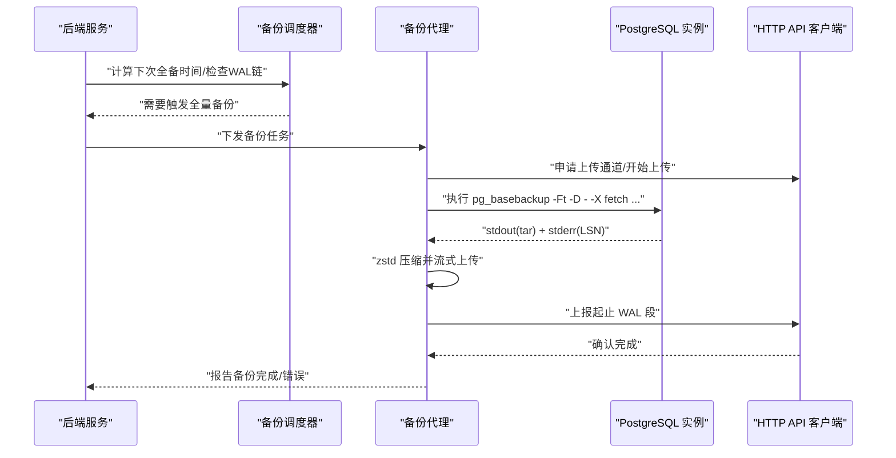
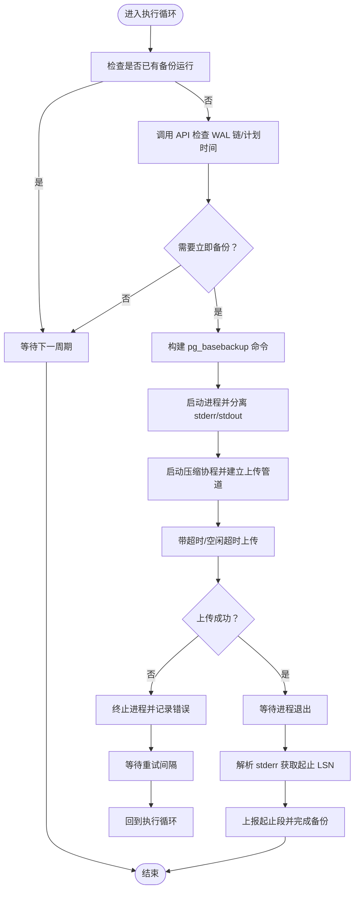
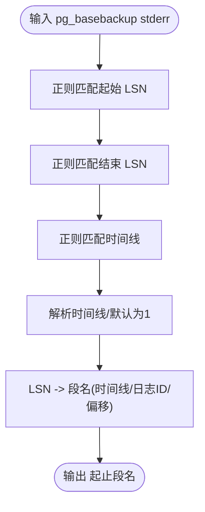
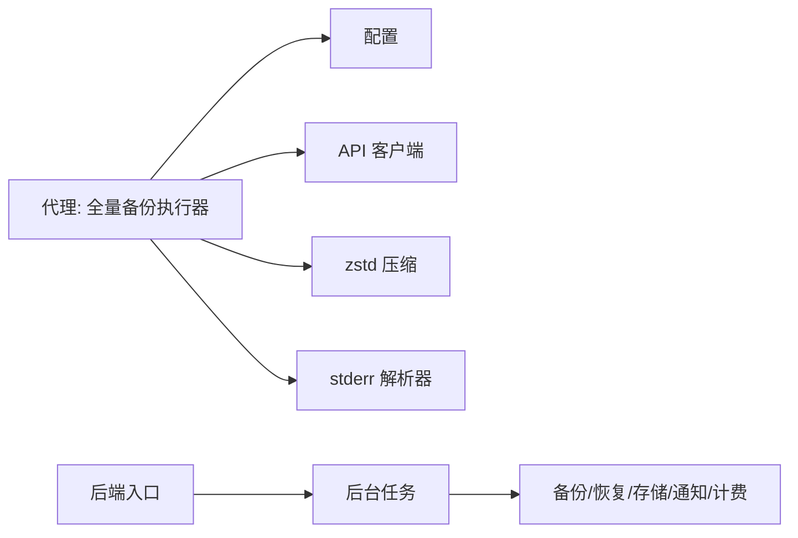
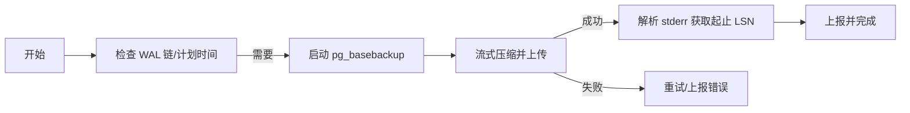

# 备份执行引擎

<cite>
**本文引用的文件**
- [agent/cmd/main.go](file://agent/cmd/main.go)
- [agent/internal/features/full_backup/backuper.go](file://agent/internal/features/full_backup/backuper.go)
- [agent/internal/features/full_backup/stderr_parser.go](file://agent/internal/features/full_backup/stderr_parser.go)
- [backend/cmd/main.go](file://backend/cmd/main.go)
</cite>

## 目录
1. [简介](#简介)
2. [项目结构](#项目结构)
3. [核心组件](#核心组件)
4. [架构总览](#架构总览)
5. [详细组件分析](#详细组件分析)
6. [依赖分析](#依赖分析)
7. [性能考虑](#性能考虑)
8. [故障排查指南](#故障排查指南)
9. [结论](#结论)
10. [附录](#附录)

## 简介
本技术文档聚焦于 Databasus 的“备份执行引擎”，系统性阐述全量备份的执行流程、并发控制与进度跟踪机制；覆盖 PostgreSQL 的 pg_basebackup、MySQL 的 mysqldump、MongoDB 的 mongodump 等数据库类型的备份策略；解释备份任务的调度算法、资源限制与超时处理；详述备份输出解析、错误检测与日志分析机制；并提供备份执行流程图与进度监控图，展示从任务启动到备份完成的全过程。最后给出性能优化建议、并发备份策略与存储空间管理方法，并解释备份完整性验证与数据一致性保障。

## 项目结构
Databasus 后端与代理（Agent）协同工作：后端负责业务编排、调度与持久化，代理负责在目标主机上执行具体备份命令并上传结果。关键入口如下：
- 后端入口：backend/cmd/main.go，初始化路由、依赖注入、后台任务与服务器启动
- 代理入口：agent/cmd/main.go，提供 start/stop/status/restore/version 等命令，其中 start 进入守护进程模式，内部启动 WAL 归档与全量备份执行器

**图表来源**
- [backend/cmd/main.go:293-374](file://backend/cmd/main.go#L293-L374)
- [agent/cmd/main.go:24-75](file://agent/cmd/main.go#L24-L75)
- [agent/internal/features/full_backup/backuper.go:33-83](file://agent/internal/features/full_backup/backuper.go#L33-L83)
- [agent/internal/features/full_backup/stderr_parser.go:18-45](file://agent/internal/features/full_backup/stderr_parser.go#L18-L45)

**章节来源**
- [backend/cmd/main.go:213-276](file://backend/cmd/main.go#L213-L276)
- [agent/cmd/main.go:24-48](file://agent/cmd/main.go#L24-L48)

## 核心组件
- 全量备份执行器（PostgreSQL pg_basebackup）
  - 周期性检查 WAL 链有效性与下次全备时间，触发单实例运行的全量备份
  - 使用管道压缩与流式上传，带空闲超时检测与重试机制
  - 解析 pg_basebackup stderr 提取起止 WAL 段，上报并完成备份
- stderr 解析器
  - 从 pg_basebackup 输出中提取起止 LSN、时间线，换算为 WAL 段名
- 后端调度与后台任务
  - 启动备份/清理/恢复节点，注册公开与受保护路由，挂载前端静态资源
  - 后台任务包含备份调度器、清理器、健康检查、审计日志清理、下载令牌清理、节点注册表、遥测等

**章节来源**
- [agent/internal/features/full_backup/backuper.go:33-162](file://agent/internal/features/full_backup/backuper.go#L33-L162)
- [agent/internal/features/full_backup/stderr_parser.go:18-61](file://agent/internal/features/full_backup/stderr_parser.go#L18-L61)
- [backend/cmd/main.go:293-374](file://backend/cmd/main.go#L293-L374)

## 架构总览
下图展示了从后端触发到代理执行、再到上传与最终落库的端到端流程：

**图表来源**
- [agent/internal/features/full_backup/backuper.go:164-245](file://agent/internal/features/full_backup/backuper.go#L164-L245)
- [agent/internal/features/full_backup/stderr_parser.go:18-45](file://agent/internal/features/full_backup/stderr_parser.go#L18-L45)

## 详细组件分析

### 全量备份执行器（PostgreSQL）
- 触发条件
  - WAL 链无效或缺失全量备份
  - 到达计划的全量备份时间点
- 并发控制
  - 使用原子布尔位确保同一时刻仅有一个全量备份在运行
- 执行流程
  - 构建命令（宿主/容器两种模式）
  - 启动进程，分离 stderr 与 stdout 管道
  - 启动压缩协程，将 tar 流经管道写入 zstd 编码器
  - 使用带超时与空闲超时的上下文进行上传
  - 若上传失败或超时，终止进程并重试
  - 等待进程退出，解析 stderr 获取起止 LSN，上报并完成
- 超时与重试
  - 上传超时、空闲超时、固定重试间隔（可覆盖）
- 错误上报
  - 将错误信息上报至后端，便于统一告警与追踪

**图表来源**
- [agent/internal/features/full_backup/backuper.go:66-162](file://agent/internal/features/full_backup/backuper.go#L66-L162)
- [agent/internal/features/full_backup/backuper.go:164-245](file://agent/internal/features/full_backup/backuper.go#L164-L245)

**章节来源**
- [agent/internal/features/full_backup/backuper.go:33-162](file://agent/internal/features/full_backup/backuper.go#L33-L162)
- [agent/internal/features/full_backup/backuper.go:164-245](file://agent/internal/features/full_backup/backuper.go#L164-L245)

### stderr 解析器（PostgreSQL）
- 功能
  - 从 pg_basebackup stderr 中提取起止 LSN 与时间线
  - 将 LSN 转换为 WAL 段文件名（含时间线、日志 ID、段偏移）
- 正则匹配与容错
  - 对缺失时间线的情况提供默认值以保持兼容
- 错误处理
  - 对格式不合法、越界等场景返回明确错误

**图表来源**
- [agent/internal/features/full_backup/stderr_parser.go:18-61](file://agent/internal/features/full_backup/stderr_parser.go#L18-L61)
- [agent/internal/features/full_backup/stderr_parser.go:63-97](file://agent/internal/features/full_backup/stderr_parser.go#L63-L97)

**章节来源**
- [agent/internal/features/full_backup/stderr_parser.go:18-61](file://agent/internal/features/full_backup/stderr_parser.go#L18-L61)
- [agent/internal/features/full_backup/stderr_parser.go:63-97](file://agent/internal/features/full_backup/stderr_parser.go#L63-L97)

### 后端调度与后台任务
- 路由与中间件
  - 注册公开与受保护路由，启用认证中间件
  - 开启 GZIP 压缩、CORS（开发环境）
- 后台任务
  - 备份调度器、备份清理器、恢复调度器、健康检查尝试、审计日志清理、下载令牌清理、节点注册表、遥测等
  - 支持优雅关闭，信号处理与上下文取消
- 服务器启动
  - 统一监听与优雅关闭，VictoriaLogs 写入器安全关闭

**章节来源**
- [backend/cmd/main.go:213-276](file://backend/cmd/main.go#L213-L276)
- [backend/cmd/main.go:293-374](file://backend/cmd/main.go#L293-L374)
- [backend/cmd/main.go:175-211](file://backend/cmd/main.go#L175-L211)

## 依赖分析
- 代理侧
  - 全量备份执行器依赖配置、API 客户端与 zstd 压缩库
  - stderr 解析器依赖正则与数学运算
- 后端侧
  - 通过依赖注入装配备份/恢复/存储/通知/计费等模块
  - 后台任务按角色（主节点/处理节点）分发执行

**图表来源**
- [agent/internal/features/full_backup/backuper.go:15-19](file://agent/internal/features/full_backup/backuper.go#L15-L19)
- [agent/internal/features/full_backup/stderr_parser.go:3-8](file://agent/internal/features/full_backup/stderr_parser.go#L3-L8)
- [backend/cmd/main.go:259-276](file://backend/cmd/main.go#L259-L276)

**章节来源**
- [agent/internal/features/full_backup/backuper.go:15-19](file://agent/internal/features/full_backup/backuper.go#L15-L19)
- [agent/internal/features/full_backup/stderr_parser.go:3-8](file://agent/internal/features/full_backup/stderr_parser.go#L3-L8)
- [backend/cmd/main.go:259-276](file://backend/cmd/main.go#L259-L276)

## 性能考虑
- 压缩与传输
  - 使用 zstd 流式压缩，减少磁盘 IO 与网络带宽占用
  - 上传采用管道直传，避免中间文件
- 超时与空闲检测
  - 上传超时与空闲超时组合，防止长时间阻塞
- 并发与节流
  - 单实例全量备份，避免多进程竞争 IO
  - 可根据数据库规模与网络状况调整重试间隔
- 存储空间管理
  - 临时目录与数据目录预创建与清理
  - 备份清理器定期清理过期备份，释放空间
- 数据一致性
  - pg_basebackup 使用 fast checkpoint，降低锁竞争
  - 通过 WAL 段范围校验，确保备份窗口完整

[本节为通用性能建议，无需特定文件引用]

## 故障排查指南
- 常见问题定位
  - 无法连接数据库：检查主机、端口、用户与密码配置
  - WAL 链无效：确认归档与连续性，必要时强制全量备份
  - 上传超时/空闲超时：检查网络质量与后端可用性
  - stderr 解析失败：确认 pg_basebackup 版本与输出格式
- 日志与错误上报
  - 代理侧记录详细错误与 stderr 内容
  - 后端接收错误并纳入审计与告警
- 重试策略
  - 固定重试间隔，支持覆盖；在上下文中优雅退出

**章节来源**
- [agent/internal/features/full_backup/backuper.go:146-161](file://agent/internal/features/full_backup/backuper.go#L146-L161)
- [agent/internal/features/full_backup/backuper.go:207-213](file://agent/internal/features/full_backup/backuper.go#L207-L213)
- [agent/internal/features/full_backup/stderr_parser.go:18-45](file://agent/internal/features/full_backup/stderr_parser.go#L18-L45)

## 结论
Databasus 的备份执行引擎以“代理 + 后端”的协作模式实现高可靠、可观测的全量备份能力。代理侧通过严格的并发控制、流式压缩与超时/空闲检测保障备份稳定性；后端侧通过调度与清理后台任务确保整体生命周期管理。对 PostgreSQL 的 pg_basebackup 已形成完整的执行闭环，对 MySQL 与 MongoDB 的备份策略可在现有框架基础上扩展实现。

[本节为总结性内容，无需特定文件引用]

## 附录

### 不同数据库类型的备份策略（概念性说明）
- PostgreSQL
  - 使用 pg_basebackup 流式打包，配合 WAL 段范围校验
- MySQL
  - 使用 mysqldump 或物理拷贝（如 Percona XtraBackup），结合二进制日志位置标记
- MongoDB
  - 使用 mongodump 逻辑备份或快照（如云厂商卷快照），记录 oplog 截止点

[本节为概念性说明，无需特定文件引用]

### 备份任务调度算法（概念性说明）
- 基于时间窗口的调度：根据上次全备时间与间隔计算下次执行时间
- 基于事件的触发：WAL 链断裂或缺失全备时立即触发
- 节点角色：主节点负责调度与清理，处理节点负责执行

[本节为概念性说明，无需特定文件引用]

### 进度监控图表（概念性说明）

[本图为概念性流程示意，无需图表来源]