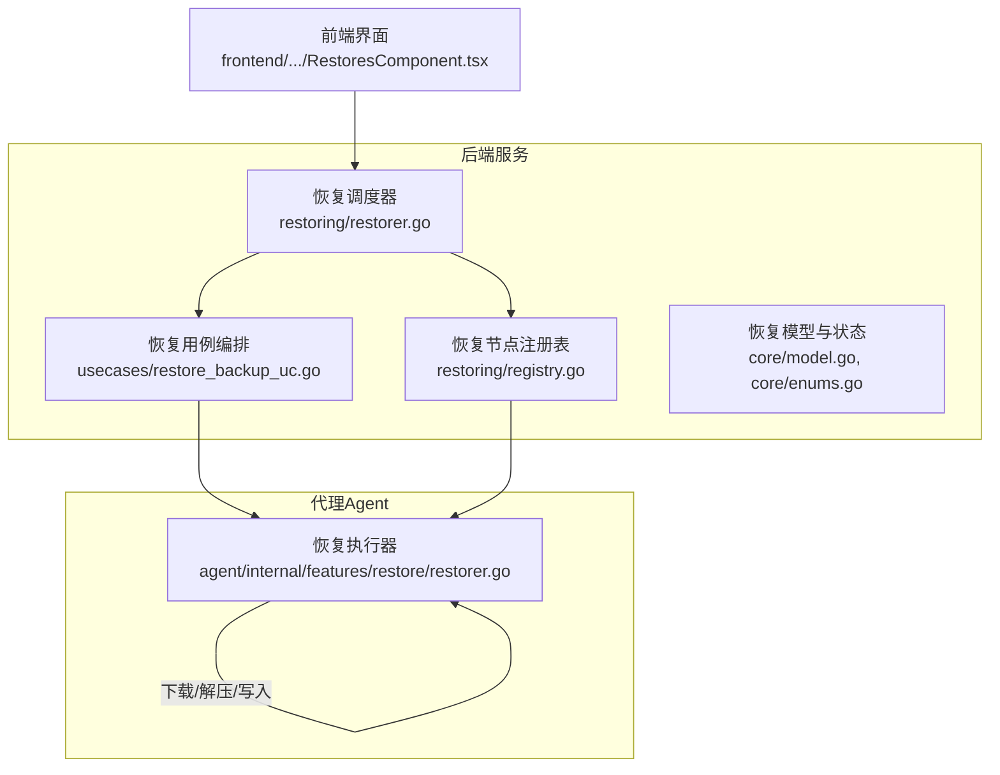
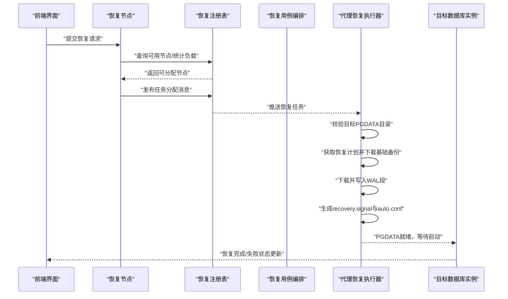
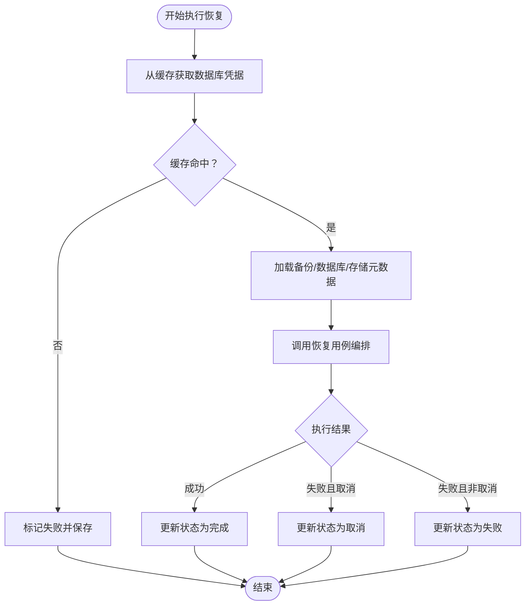
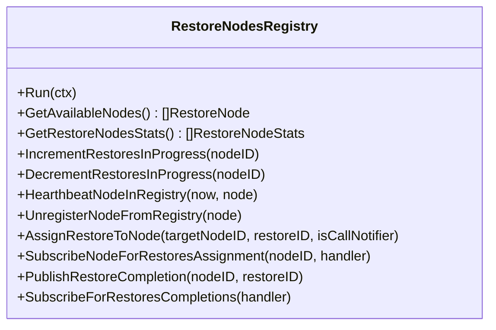
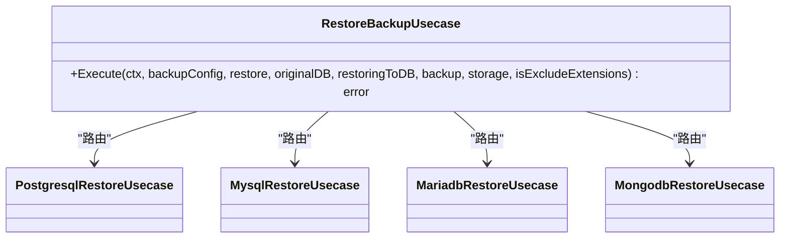
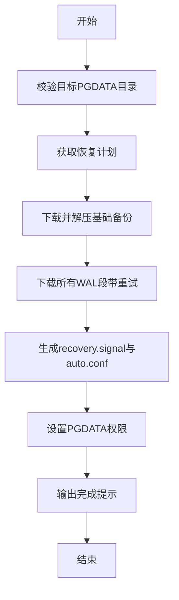
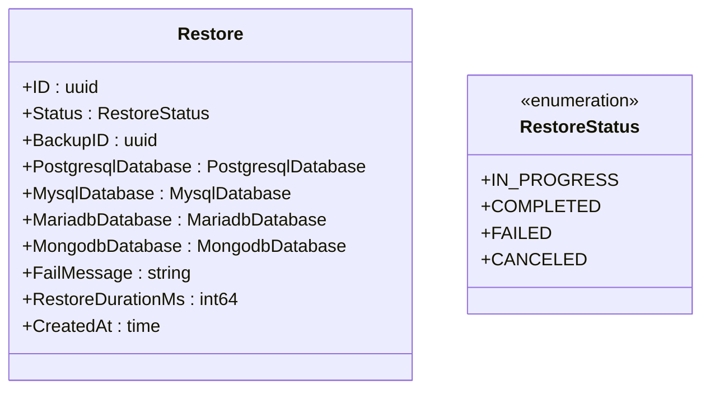
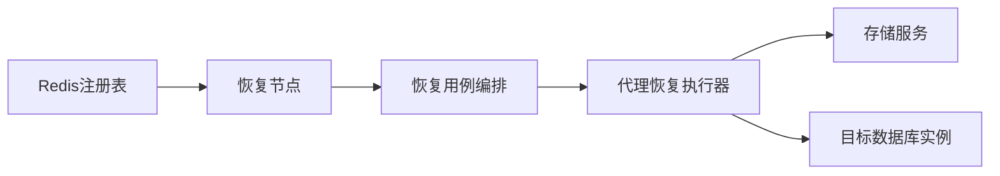

# 恢复操作

<cite>
**本文引用的文件**
- [agent/internal/features/restore/restorer.go](file://agent/internal/features/restore/restorer.go)
- [backend/internal/features/restores/restoring/restorer.go](file://backend/internal/features/restores/restoring/restorer.go)
- [backend/internal/features/restores/restoring/registry.go](file://backend/internal/features/restores/restoring/registry.go)
- [backend/internal/features/restores/usecases/restore_backup_uc.go](file://backend/internal/features/restores/usecases/restore_backup_uc.go)
- [backend/internal/features/restores/core/model.go](file://backend/internal/features/restores/core/model.go)
- [backend/internal/features/restores/core/enums.go](file://backend/internal/features/restores/core/enums.go)
- [backend/internal/features/backups/backups/services/postgres_wal_service.go](file://backend/internal/features/backups/backups/services/postgres_wal_service.go)
- [frontend/src/features/restores/ui/RestoresComponent.tsx](file://frontend/src/features/restores/ui/RestoresComponent.tsx)
</cite>

## 目录
1. [简介](#简介)
2. [项目结构](#项目结构)
3. [核心组件](#核心组件)
4. [架构总览](#架构总览)
5. [详细组件分析](#详细组件分析)
6. [依赖分析](#依赖分析)
7. [性能考虑](#性能考虑)
8. [故障排查指南](#故障排查指南)
9. [结论](#结论)
10. [附录](#附录)

## 简介
本技术文档聚焦于 Databasus 数据库恢复操作模块，系统性阐述从备份恢复数据库的完整流程，覆盖全量备份恢复与时间点恢复（PITR）两种模式。文档详细说明恢复前准备（目标实例检查、权限验证、存储空间确认）、恢复过程中的数据传输与解压解密、导入机制与 WAL 应用、恢复进度监控、错误处理与回滚策略，并提供恢复操作流程图与数据流向图。同时给出恢复性能优化、并发控制与资源管理策略，以及在恢复过程中如何保证数据一致性与完整性验证的方法。

## 项目结构
恢复相关代码主要分布在后端服务与代理（Agent）两部分：
- 后端服务负责调度、注册表管理、任务状态持久化与跨节点协调
- 代理（Agent）负责具体数据库实例侧的数据下载、解压解密、文件写入与 PostgreSQL 的恢复配置（含 PITR）

图表来源
- [backend/internal/features/restores/restoring/restorer.go:50-115](file://backend/internal/features/restores/restoring/restorer.go#L50-L115)
- [backend/internal/features/restores/restoring/registry.go:30-77](file://backend/internal/features/restores/restoring/registry.go#L30-L77)
- [backend/internal/features/restores/usecases/restore_backup_uc.go:25-80](file://backend/internal/features/restores/usecases/restore_backup_uc.go#L25-L80)
- [agent/internal/features/restore/restorer.go:58-102](file://agent/internal/features/restore/restorer.go#L58-L102)

章节来源
- [backend/internal/features/restores/restoring/restorer.go:1-302](file://backend/internal/features/restores/restoring/restorer.go#L1-L302)
- [backend/internal/features/restores/restoring/registry.go:1-643](file://backend/internal/features/restores/restoring/registry.go#L1-L643)
- [backend/internal/features/restores/usecases/restore_backup_uc.go:1-81](file://backend/internal/features/restores/usecases/restore_backup_uc.go#L1-L81)
- [agent/internal/features/restore/restorer.go:1-445](file://agent/internal/features/restore/restorer.go#L1-L445)
- [frontend/src/features/restores/ui/RestoresComponent.tsx:66-79](file://frontend/src/features/restores/ui/RestoresComponent.tsx#L66-L79)

## 核心组件
- 恢复节点（RestorerNode）
  - 负责心跳上报、订阅恢复任务分配、执行恢复并更新状态
  - 关键职责：缓存数据库凭据获取、拉取备份与存储信息、调用恢复用例、状态持久化
- 恢复节点注册表（RestoreNodesRegistry）
  - 基于 Redis 的节点发现与任务分发，维护活跃节点与进行中任务计数
  - 提供发布/订阅通道用于任务分配与完成通知
- 恢复用例编排（RestoreBackupUsecase）
  - 根据数据库类型路由到具体数据库的恢复实现（PostgreSQL/MySQL/MariaDB/MongoDB）
- 代理恢复执行器（Agent Restorer）
  - 下载并解压 zstd 压缩的备份归档，写入目标 PGDATA 目录
  - 下载 WAL 段并配置 recovery.signal 与 postgresql.auto.conf 实现 PITR
- 恢复模型与状态
  - 定义恢复记录结构与状态枚举（进行中/已完成/失败/取消）

章节来源
- [backend/internal/features/restores/restoring/restorer.go:30-48](file://backend/internal/features/restores/restoring/restorer.go#L30-L48)
- [backend/internal/features/restores/restoring/registry.go:45-53](file://backend/internal/features/restores/restoring/registry.go#L45-L53)
- [backend/internal/features/restores/usecases/restore_backup_uc.go:18-23](file://backend/internal/features/restores/usecases/restore_backup_uc.go#L18-L23)
- [agent/internal/features/restore/restorer.go:31-56](file://agent/internal/features/restore/restorer.go#L31-L56)
- [backend/internal/features/restores/core/model.go:15-31](file://backend/internal/features/restores/core/model.go#L15-L31)
- [backend/internal/features/restores/core/enums.go:3-10](file://backend/internal/features/restores/core/enums.go#L3-L10)

## 架构总览
下图展示了从用户触发恢复到数据库可用的完整路径，包括后端调度、节点执行、代理下载与配置、以及 WAL 应用与 PITR。

图表来源
- [backend/internal/features/restores/restoring/restorer.go:121-294](file://backend/internal/features/restores/restoring/restorer.go#L121-L294)
- [backend/internal/features/restores/restoring/registry.go:359-422](file://backend/internal/features/restores/restoring/registry.go#L359-L422)
- [agent/internal/features/restore/restorer.go:58-102](file://agent/internal/features/restore/restorer.go#L58-L102)

## 详细组件分析

### 组件A：恢复节点（后端）
- 职责
  - 注册心跳、订阅恢复任务、执行恢复、更新状态与耗时
  - 从缓存获取数据库凭据，若缓存缺失则直接失败
  - 拉取备份、数据库与存储信息，构造“恢复到”目标数据库对象
  - 调用恢复用例编排，处理取消/关闭等上下文事件
- 关键流程
  - 缓存命中：填充 restoringToDB 并执行恢复
  - 缓存缺失：标记失败并保存
  - 执行成功：更新状态为完成；失败：根据是否取消设置 CANCELED 或 FAILED
- 错误处理
  - 显式识别“取消/关闭”场景，避免与普通失败混淆
  - 记录详细上下文（数据库类型、存储类型、备份ID等）

图表来源
- [backend/internal/features/restores/restoring/restorer.go:121-294](file://backend/internal/features/restores/restoring/restorer.go#L121-L294)

章节来源
- [backend/internal/features/restores/restoring/restorer.go:50-115](file://backend/internal/features/restores/restoring/restorer.go#L50-L115)
- [backend/internal/features/restores/restoring/restorer.go:121-294](file://backend/internal/features/restores/restoring/restorer.go#L121-L294)

### 组件B：恢复节点注册表（后端）
- 职责
  - 维护节点信息与活跃任务计数，清理超时节点
  - 通过 Pub/Sub 分发恢复任务给指定节点
  - 提供可用节点列表与节点统计接口
- 关键机制
  - 心跳阈值：超过阈值未心跳的节点被视为“死亡”，不参与调度
  - 周期清理：定期扫描并删除过期节点键
  - 计数安全：计数器小于0时自动重置为0

图表来源
- [backend/internal/features/restores/restoring/registry.go:45-53](file://backend/internal/features/restores/restoring/registry.go#L45-L53)

章节来源
- [backend/internal/features/restores/restoring/registry.go:30-77](file://backend/internal/features/restores/restoring/registry.go#L30-L77)
- [backend/internal/features/restores/restoring/registry.go:359-422](file://backend/internal/features/restores/restoring/registry.go#L359-L422)
- [backend/internal/features/restores/restoring/registry.go:495-537](file://backend/internal/features/restores/restoring/registry.go#L495-L537)
- [backend/internal/features/restores/restoring/registry.go:539-642](file://backend/internal/features/restores/restoring/registry.go#L539-L642)

### 组件C：恢复用例编排（后端）
- 职责
  - 根据原始数据库类型路由到对应数据库的恢复实现
  - 传入备份配置、恢复记录、原始数据库、恢复目标数据库、备份与存储对象
- 支持类型
  - PostgreSQL、MySQL、MariaDB、MongoDB

图表来源
- [backend/internal/features/restores/usecases/restore_backup_uc.go:18-23](file://backend/internal/features/restores/usecases/restore_backup_uc.go#L18-L23)
- [backend/internal/features/restores/usecases/restore_backup_uc.go:25-80](file://backend/internal/features/restores/usecases/restore_backup_uc.go#L25-L80)

章节来源
- [backend/internal/features/restores/usecases/restore_backup_uc.go:1-81](file://backend/internal/features/restores/usecases/restore_backup_uc.go#L1-L81)

### 组件D：代理恢复执行器（Agent）
- 职责
  - 校验目标 PGDATA 目录（必须存在、为空）
  - 获取恢复计划（包含基础备份与 WAL 段列表），下载并解压 zstd 压缩的基础备份归档，逐个下载 WAL 段
  - 配置 recovery.signal 与 postgresql.auto.conf，支持 PITR（基于目标时间）
  - 输出完成提示，指导用户启动 PostgreSQL
- 关键机制
  - 下载重试：WAL 段下载最多重试固定次数，指数退避
  - 安全解包：防路径穿越检测
  - WAL 应用：通过 restore_command 从临时目录拉取 WAL，recovery_end_command 清理临时目录
- 支持模式
  - 全量恢复：应用到最新可用 WAL
  - 时间点恢复（PITR）：配置 recovery_target_time

图表来源
- [agent/internal/features/restore/restorer.go:58-102](file://agent/internal/features/restore/restorer.go#L58-L102)
- [agent/internal/features/restore/restorer.go:165-181](file://agent/internal/features/restore/restorer.go#L165-L181)
- [agent/internal/features/restore/restorer.go:245-258](file://agent/internal/features/restore/restorer.go#L245-L258)
- [agent/internal/features/restore/restorer.go:329-363](file://agent/internal/features/restore/restorer.go#L329-L363)

章节来源
- [agent/internal/features/restore/restorer.go:104-128](file://agent/internal/features/restore/restorer.go#L104-L128)
- [agent/internal/features/restore/restorer.go:130-146](file://agent/internal/features/restore/restorer.go#L130-L146)
- [agent/internal/features/restore/restorer.go:165-181](file://agent/internal/features/restore/restorer.go#L165-L181)
- [agent/internal/features/restore/restorer.go:245-258](file://agent/internal/features/restore/restorer.go#L245-L258)
- [agent/internal/features/restore/restorer.go:260-299](file://agent/internal/features/restore/restorer.go#L260-L299)
- [agent/internal/features/restore/restorer.go:301-327](file://agent/internal/features/restore/restorer.go#L301-L327)
- [agent/internal/features/restore/restorer.go:329-363](file://agent/internal/features/restore/restorer.go#L329-L363)
- [agent/internal/features/restore/restorer.go:404-417](file://agent/internal/features/restore/restorer.go#L404-L417)

### 组件E：恢复模型与状态
- 恢复记录结构包含：唯一ID、状态、关联备份ID、各数据库类型的恢复目标对象、失败信息、耗时、创建时间
- 状态枚举：进行中、已完成、失败、取消

图表来源
- [backend/internal/features/restores/core/model.go:15-31](file://backend/internal/features/restores/core/model.go#L15-L31)
- [backend/internal/features/restores/core/enums.go:3-10](file://backend/internal/features/restores/core/enums.go#L3-L10)

章节来源
- [backend/internal/features/restores/core/model.go:1-32](file://backend/internal/features/restores/core/model.go#L1-L32)
- [backend/internal/features/restores/core/enums.go:1-11](file://backend/internal/features/restores/core/enums.go#L1-L11)

### 组件F：前端交互
- 前端提供恢复入口，支持按数据库类型选择恢复目标参数（如凭据等），并在恢复过程中显示状态与错误信息

章节来源
- [frontend/src/features/restores/ui/RestoresComponent.tsx:66-79](file://frontend/src/features/restores/ui/RestoresComponent.tsx#L66-L79)

## 依赖分析
- 后端内部依赖
  - 恢复节点依赖注册表进行任务分发与节点健康检查
  - 恢复用例编排依赖数据库类型路由到具体实现
  - 恢复节点在执行前依赖缓存获取数据库凭据，失败即刻终止
- 外部依赖
  - Redis：用于节点注册表的心跳、任务计数与 Pub/Sub
  - 存储服务：提供备份文件下载能力
  - 数据库工具链：代理侧使用 zstd 解压与 tar 解包，PostgreSQL 使用 WAL 恢复机制

图表来源
- [backend/internal/features/restores/restoring/registry.go:303-332](file://backend/internal/features/restores/restoring/registry.go#L303-L332)
- [backend/internal/features/restores/restoring/restorer.go:222-231](file://backend/internal/features/restores/restoring/restorer.go#L222-L231)
- [agent/internal/features/restore/restorer.go:165-181](file://agent/internal/features/restore/restorer.go#L165-L181)

章节来源
- [backend/internal/features/restores/restoring/registry.go:30-77](file://backend/internal/features/restores/restoring/registry.go#L30-L77)
- [backend/internal/features/restores/restoring/restorer.go:121-294](file://backend/internal/features/restores/restoring/restorer.go#L121-L294)
- [agent/internal/features/restore/restorer.go:1-445](file://agent/internal/features/restore/restorer.go#L1-L445)

## 性能考虑
- 网络吞吐与并发
  - 恢复节点启动时读取环境变量中的网络吞吐限制，用于评估节点承载能力
  - 注册表维护每个节点的活跃恢复任务计数，避免过载
- 下载与解压
  - 代理对 WAL 段下载采用固定次数重试与指数退避，降低网络抖动影响
  - 使用 zstd 流式解压减少内存占用
- 资源管理
  - 仅在目标 PGDATA 目录为空时允许恢复，避免覆盖现有数据
  - WAL 恢复完成后自动清理临时目录，避免磁盘膨胀
- 可观测性
  - 恢复节点周期性发送心跳，注册表清理超时节点，保持调度准确性

章节来源
- [backend/internal/features/restores/restoring/restorer.go:57-62](file://backend/internal/features/restores/restoring/restorer.go#L57-L62)
- [backend/internal/features/restores/restoring/registry.go:18-28](file://backend/internal/features/restores/restoring/registry.go#L18-L28)
- [agent/internal/features/restore/restorer.go:260-299](file://agent/internal/features/restore/restorer.go#L260-L299)
- [agent/internal/features/restore/restorer.go:104-128](file://agent/internal/features/restore/restorer.go#L104-L128)
- [agent/internal/features/restore/restorer.go:329-363](file://agent/internal/features/restore/restorer.go#L329-L363)

## 故障排查指南
- 常见问题与定位
  - 目标 PGDATA 目录不存在或非空：代理会直接报错，需先清理或修正路径
  - 缓存缺失导致恢复失败：检查节点重启或缓存失效情况，必要时重新触发凭据缓存
  - WAL 下载失败：查看重试日志与网络状况，确认存储可达性
  - 恢复计划错误：当 WAL 链不连续或存在断点时，服务端会返回错误及最后连续段信息
- 回滚与恢复
  - 若恢复失败，可通过重新发起恢复任务替换目标实例数据
  - 对于 PostgreSQL，若启动后仍处于恢复模式，可调整 recovery_target_time 或删除 recovery.signal 后重启
- 日志与监控
  - 后端节点记录详细的失败上下文（数据库类型、存储类型、备份ID等）
  - 前端显示恢复状态与错误信息，便于用户感知

章节来源
- [agent/internal/features/restore/restorer.go:104-128](file://agent/internal/features/restore/restorer.go#L104-L128)
- [backend/internal/features/restores/restoring/restorer.go:121-149](file://backend/internal/features/restores/restoring/restorer.go#L121-L149)
- [backend/internal/features/restores/restoring/restorer.go:232-278](file://backend/internal/features/restores/restoring/restorer.go#L232-L278)
- [backend/internal/features/backups/backups/services/postgres_wal_service.go:418-430](file://backend/internal/features/backups/backups/services/postgres_wal_service.go#L418-L430)
- [backend/internal/features/backups/backups/services/postgres_wal_service.go:652-707](file://backend/internal/features/backups/backups/services/postgres_wal_service.go#L652-L707)

## 结论
Databasus 的恢复模块通过后端节点注册表实现分布式调度，结合代理侧的高效下载与解压、PostgreSQL 的 WAL 恢复与 PITR 配置，实现了从备份到数据库可用的自动化流程。模块具备完善的错误处理、可观测性与资源管理能力，能够满足生产环境对可靠性与性能的要求。建议在生产环境中配合严格的备份链校验与恢复演练，确保恢复流程的稳定与可预期。

## 附录
- 恢复准备清单
  - 目标数据库实例状态：停止服务、确认 PGDATA 目录为空
  - 权限验证：代理进程对 PGDATA 目录具有读写权限
  - 存储空间：确保磁盘容量足以容纳基础备份与所需 WAL 段
  - 网络连通：代理可访问存储服务与目标数据库实例
- 恢复后验证
  - 启动数据库后检查恢复日志，确认 WAL 应用至目标时间点
  - 运行基础查询验证数据完整性与业务功能