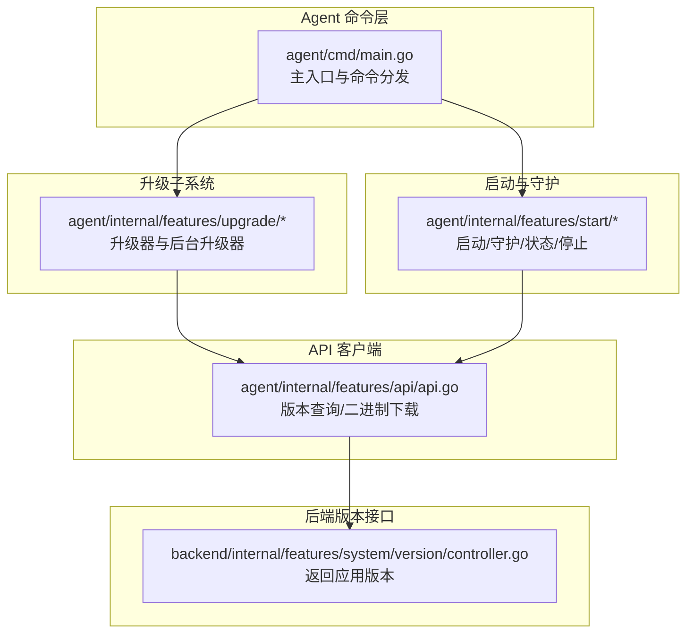
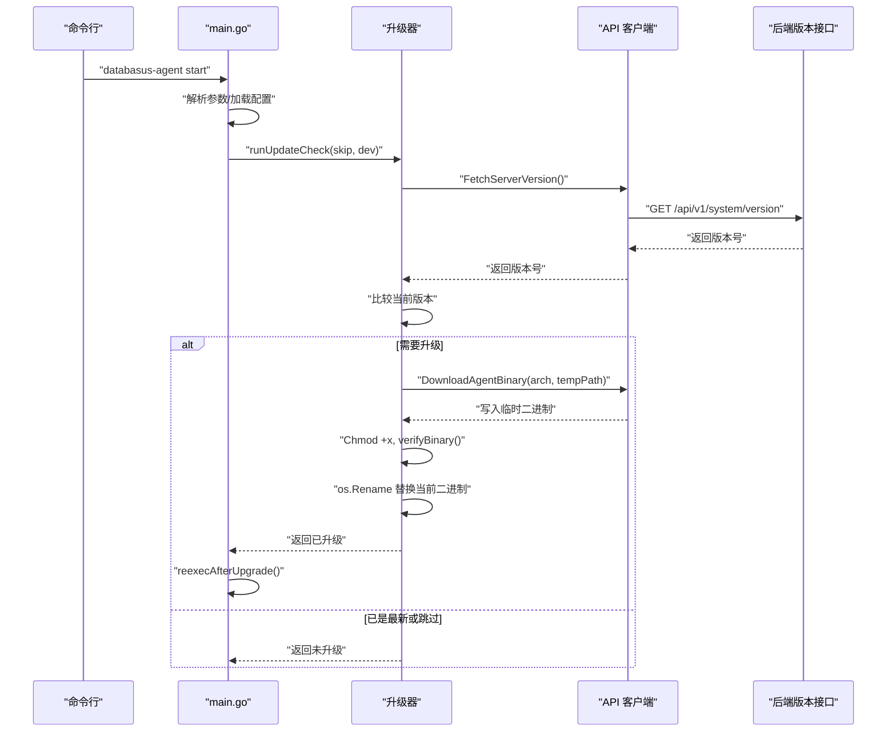
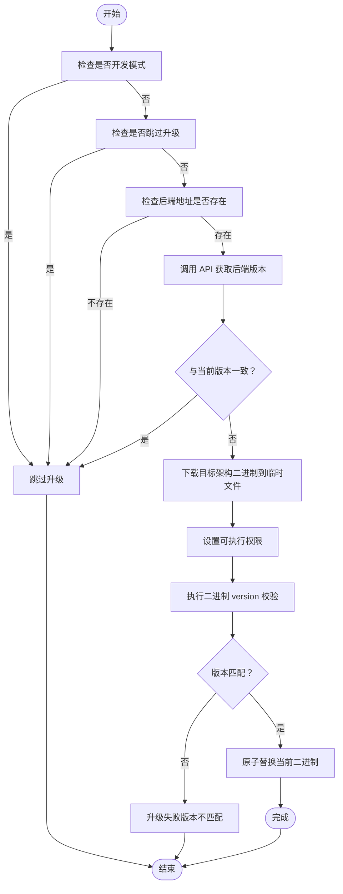
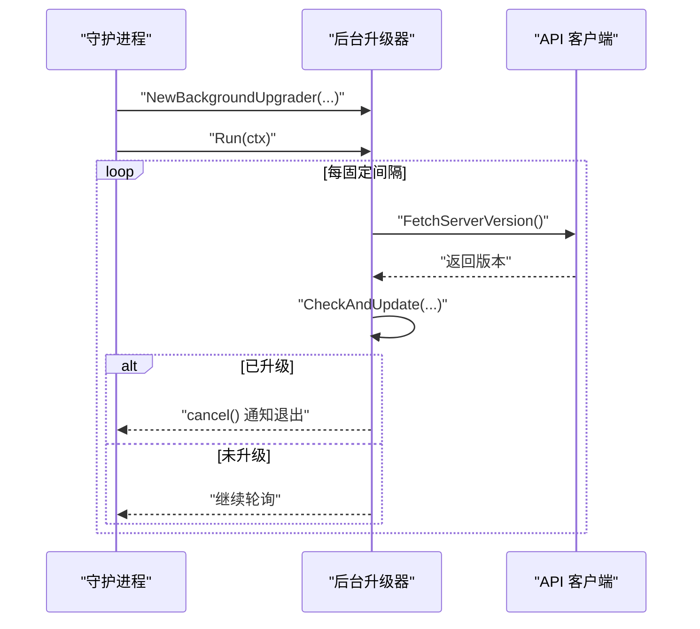
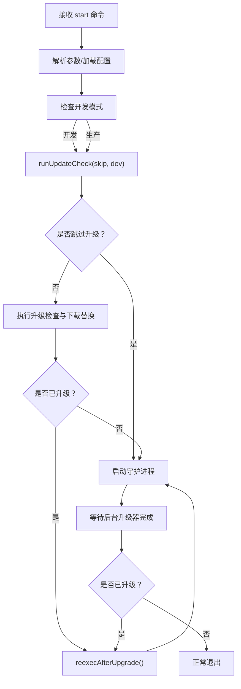
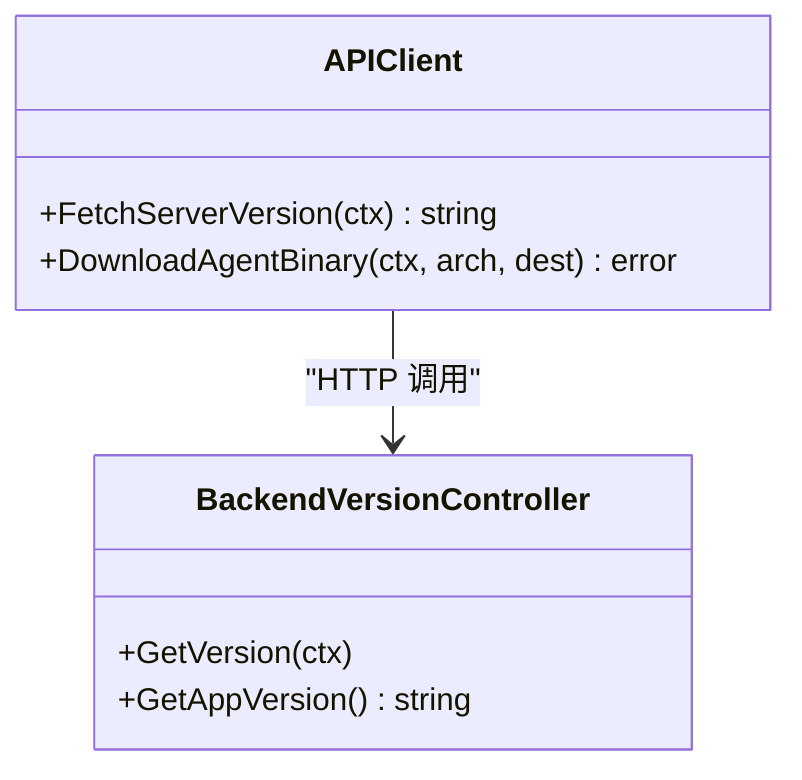
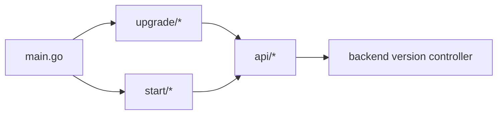

# 自动升级机制

<cite>
**本文引用的文件**
- [agent/cmd/main.go](file://agent/cmd/main.go)
- [agent/internal/features/upgrade/background_upgrader.go](file://agent/internal/features/upgrade/background_upgrader.go)
- [agent/internal/features/upgrade/upgrader.go](file://agent/internal/features/upgrade/upgrader.go)
- [agent/internal/features/upgrade/errors.go](file://agent/internal/features/upgrade/errors.go)
- [agent/internal/features/api/api.go](file://agent/internal/features/api/api.go)
- [agent/internal/features/start/start.go](file://agent/internal/features/start/start.go)
- [agent/internal/features/start/daemon.go](file://agent/internal/features/start/daemon.go)
- [agent/internal/config/config.go](file://agent/internal/config/config.go)
- [backend/internal/features/system/version/controller.go](file://backend/internal/features/system/version/controller.go)
- [agent/e2e/scripts/test-upgrade-success.sh](file://agent/e2e/scripts/test-upgrade-success.sh)
- [agent/e2e/scripts/test-upgrade-background.sh](file://agent/e2e/scripts/test-upgrade-background.sh)
- [agent/e2e/scripts/test-upgrade-skip.sh](file://agent/e2e/scripts/test-upgrade-skip.sh)
</cite>

## 目录
1. [简介](#简介)
2. [项目结构](#项目结构)
3. [核心组件](#核心组件)
4. [架构总览](#架构总览)
5. [详细组件分析](#详细组件分析)
6. [依赖分析](#依赖分析)
7. [性能考虑](#性能考虑)
8. [故障排查指南](#故障排查指南)
9. [结论](#结论)
10. [附录](#附录)

## 简介
本文件系统性阐述 Databasus 代理（Agent）的自动升级机制，覆盖版本检查、下载更新与无缝升级全流程。重点包括：
- 升级检测机制：版本比较、更新策略、开发模式跳过与强制升级开关
- 升级包下载、验证与安装：完整性校验、权限设置、替换逻辑
- 运行时升级：后台轮询升级、信号驱动重启、Windows 平台差异
- 服务中断最小化与优雅降级：日志记录、超时控制、回滚路径
- 安全保障：二进制自检、版本一致性校验
- 失败处理与手动干预：错误传播、退出码、重试与回退策略

## 项目结构
围绕升级功能的关键模块分布于 Agent 的命令入口、升级子系统、API 客户端、启动与守护逻辑以及后端版本接口。

**图表来源**
- [agent/cmd/main.go:1-246](file://agent/cmd/main.go#L1-L246)
- [agent/internal/features/upgrade/background_upgrader.go:1-89](file://agent/internal/features/upgrade/background_upgrader.go#L1-L89)
- [agent/internal/features/upgrade/upgrader.go:1-90](file://agent/internal/features/upgrade/upgrader.go#L1-L90)
- [agent/internal/features/start/start.go:1-326](file://agent/internal/features/start/start.go#L1-L326)
- [agent/internal/features/api/api.go:1-377](file://agent/internal/features/api/api.go#L1-L377)
- [backend/internal/features/system/version/controller.go:1-39](file://backend/internal/features/system/version/controller.go#L1-L39)

**章节来源**
- [agent/cmd/main.go:1-246](file://agent/cmd/main.go#L1-L246)
- [agent/internal/features/upgrade/background_upgrader.go:1-89](file://agent/internal/features/upgrade/background_upgrader.go#L1-L89)
- [agent/internal/features/upgrade/upgrader.go:1-90](file://agent/internal/features/upgrade/upgrader.go#L1-L90)
- [agent/internal/features/start/start.go:1-326](file://agent/internal/features/start/start.go#L1-L326)
- [agent/internal/features/api/api.go:1-377](file://agent/internal/features/api/api.go#L1-L377)
- [backend/internal/features/system/version/controller.go:1-39](file://backend/internal/features/system/version/controller.go#L1-L39)

## 核心组件
- 版本检查与下载客户端：负责向后端查询最新版本并下载对应架构的二进制包。
- 升级执行器：在本地替换当前可执行文件，并进行版本一致性自检。
- 后台升级器：周期性轮询版本并触发升级，支持优雅重启。
- 启动/守护流程：在非 Windows 平台启动守护进程，注册锁与信号；Windows 平台直接运行守护逻辑。
- 主入口：解析命令、参数与配置，决定是否跳过升级、是否开发模式、是否立即执行升级与重启。

**章节来源**
- [agent/internal/features/api/api.go:311-358](file://agent/internal/features/api/api.go#L311-L358)
- [agent/internal/features/upgrade/upgrader.go:15-73](file://agent/internal/features/upgrade/upgrader.go#L15-L73)
- [agent/internal/features/upgrade/background_upgrader.go:42-88](file://agent/internal/features/upgrade/background_upgrader.go#L42-L88)
- [agent/internal/features/start/start.go:60-101](file://agent/internal/features/start/start.go#L60-L101)
- [agent/cmd/main.go:50-193](file://agent/cmd/main.go#L50-L193)

## 架构总览
下图展示从命令入口到后端版本接口的调用链路，以及升级器如何通过 API 客户端获取版本与下载二进制。

**图表来源**
- [agent/cmd/main.go:173-193](file://agent/cmd/main.go#L173-L193)
- [agent/internal/features/upgrade/upgrader.go:18-73](file://agent/internal/features/upgrade/upgrader.go#L18-L73)
- [agent/internal/features/api/api.go:311-358](file://agent/internal/features/api/api.go#L311-L358)
- [backend/internal/features/system/version/controller.go:25-38](file://backend/internal/features/system/version/controller.go#L25-L38)

## 详细组件分析

### 升级检测与下载流程
- 检测条件
  - 开发模式（ENV_MODE=development）：跳过升级检查。
  - 跳过标志（--skip-update）：跳过升级检查。
  - 未配置后端地址：跳过升级检查。
- 版本比较
  - 通过 API 获取后端版本，与当前版本字符串比较。
  - 若相同则不升级；若不同则进入下载与替换流程。
- 下载与替换
  - 使用架构参数请求后端二进制下载接口。
  - 将下载内容写入临时文件，设置可执行权限，执行版本自检，最后原子替换当前二进制文件。
- 重启策略
  - 成功升级后，使用系统调用重新执行当前可执行文件，确保新版本生效。

**图表来源**
- [agent/cmd/main.go:173-193](file://agent/cmd/main.go#L173-L193)
- [agent/internal/features/upgrade/upgrader.go:18-73](file://agent/internal/features/upgrade/upgrader.go#L18-L73)
- [agent/internal/features/upgrade/upgrader.go:75-89](file://agent/internal/features/upgrade/upgrader.go#L75-L89)

**章节来源**
- [agent/cmd/main.go:173-193](file://agent/cmd/main.go#L173-L193)
- [agent/internal/features/upgrade/upgrader.go:15-73](file://agent/internal/features/upgrade/upgrader.go#L15-L73)
- [agent/internal/features/upgrade/upgrader.go:75-89](file://agent/internal/features/upgrade/upgrader.go#L75-L89)

### 后台升级器（守护态）
- 触发时机
  - 在非 Windows 平台且非开发模式下，启动守护进程时初始化后台升级器。
- 轮询策略
  - 固定间隔轮询后端版本，一旦发现新版本即触发升级。
- 优雅重启
  - 升级完成后通过取消信号通知守护进程退出，由上层捕获并触发重新执行。
- 完成等待
  - 守护进程在退出前等待后台升级器完成，避免并发冲突。

**图表来源**
- [agent/internal/features/start/start.go:78-96](file://agent/internal/features/start/start.go#L78-L96)
- [agent/internal/features/upgrade/background_upgrader.go:42-88](file://agent/internal/features/upgrade/background_upgrader.go#L42-L88)
- [agent/internal/features/api/api.go:311-327](file://agent/internal/features/api/api.go#L311-L327)

**章节来源**
- [agent/internal/features/start/start.go:60-101](file://agent/internal/features/start/start.go#L60-L101)
- [agent/internal/features/upgrade/background_upgrader.go:12-88](file://agent/internal/features/upgrade/background_upgrader.go#L12-L88)

### 主入口与命令处理
- 命令分发
  - 支持 start、_run、stop、status、restore、version 等命令。
- 启动流程
  - 解析配置与参数，判断是否跳过升级、是否开发模式。
  - 执行同步升级检查；如已升级则重新执行当前二进制。
  - 启动守护进程；若守护进程返回“需要重启”错误，则重新执行。
- 开发模式识别
  - 通过多级目录查找 .env 中 ENV_MODE=development 判断开发模式。
- 重新执行
  - 使用系统调用替换当前进程镜像，实现无缝重启。

**图表来源**
- [agent/cmd/main.go:50-193](file://agent/cmd/main.go#L50-L193)
- [agent/cmd/main.go:232-245](file://agent/cmd/main.go#L232-L245)
- [agent/internal/features/start/start.go:78-96](file://agent/internal/features/start/start.go#L78-L96)

**章节来源**
- [agent/cmd/main.go:50-193](file://agent/cmd/main.go#L50-L193)
- [agent/cmd/main.go:232-245](file://agent/cmd/main.go#L232-L245)
- [agent/internal/features/start/start.go:78-96](file://agent/internal/features/start/start.go#L78-L96)

### API 客户端与后端版本接口
- 版本查询
  - 通过 JSON 客户端调用 GET /api/v1/system/version，返回后端当前版本。
- 二进制下载
  - 通过流式 HTTP 客户端按架构参数下载二进制，写入本地临时文件。
- 后端默认版本
  - 当未设置环境变量时，返回硬编码默认版本。

**图表来源**
- [agent/internal/features/api/api.go:311-358](file://agent/internal/features/api/api.go#L311-L358)
- [backend/internal/features/system/version/controller.go:25-38](file://backend/internal/features/system/version/controller.go#L25-L38)

**章节来源**
- [agent/internal/features/api/api.go:311-358](file://agent/internal/features/api/api.go#L311-L358)
- [backend/internal/features/system/version/controller.go:10-38](file://backend/internal/features/system/version/controller.go#L10-L38)

### 升级验证与安全
- 版本自检
  - 通过执行新二进制的 version 子命令，读取输出并与期望版本比对，确保一致性。
- 权限设置
  - 下载完成后设置可执行权限，保证替换后可直接运行。
- 替换策略
  - 使用临时文件下载，校验通过后再原子替换当前二进制，降低损坏风险。
- 安全建议
  - 当前实现未显式实现数字签名验证与哈希校验。建议在后端发布二进制时提供校验信息并在客户端增加校验逻辑，以增强抗篡改能力。

**章节来源**
- [agent/internal/features/upgrade/upgrader.go:54-73](file://agent/internal/features/upgrade/upgrader.go#L54-L73)
- [agent/internal/features/upgrade/upgrader.go:75-89](file://agent/internal/features/upgrade/upgrader.go#L75-L89)

### 失败处理与回滚
- 失败场景
  - 无法连接后端：返回明确错误提示，不强制升级。
  - 下载失败：返回错误，保留原二进制。
  - 权限设置失败：返回错误，保留原二进制。
  - 版本自检不匹配：返回错误，保留原二进制。
  - 替换失败：返回错误，保留原二进制与临时文件。
- 回滚机制
  - 当前实现未提供自动回滚；建议在替换前备份原二进制，失败时恢复。
- 手动干预
  - 使用 --skip-update 跳过自动升级，保持现状。
  - 使用版本子命令确认当前版本。
  - 使用 stop/status 控制与诊断守护进程状态。

**章节来源**
- [agent/internal/features/upgrade/upgrader.go:25-33](file://agent/internal/features/upgrade/upgrader.go#L25-L33)
- [agent/internal/features/upgrade/upgrader.go:54-68](file://agent/internal/features/upgrade/upgrader.go#L54-L68)
- [agent/cmd/main.go:173-193](file://agent/cmd/main.go#L173-L193)

### E2E 测试与行为验证
- 成功升级（同步）
  - 设置后端返回新版本与新二进制路径，执行 start 后二进制被替换并重新执行，最终版本一致。
- 后台升级（异步）
  - 初始版本一致时不立即升级；后台轮询发现新版本后触发升级，最终版本一致且守护进程仍可查询状态。
- 跳过升级
  - 明确跳过升级时，输出包含“已是最新”，二进制版本不变。

**章节来源**
- [agent/e2e/scripts/test-upgrade-success.sh:1-70](file://agent/e2e/scripts/test-upgrade-success.sh#L1-L70)
- [agent/e2e/scripts/test-upgrade-background.sh:1-91](file://agent/e2e/scripts/test-upgrade-background.sh#L1-L91)
- [agent/e2e/scripts/test-upgrade-skip.sh:1-65](file://agent/e2e/scripts/test-upgrade-skip.sh#L1-L65)

## 依赖分析
- 组件耦合
  - 升级器依赖 API 客户端进行版本查询与二进制下载。
  - 启动/守护流程依赖升级器结果决定是否需要重启。
  - 主入口贯穿配置解析、升级检查与重新执行。
- 外部依赖
  - 后端版本接口提供版本号；二进制下载接口提供对应架构的二进制。
- 平台差异
  - Windows 平台不启用后台升级器，直接运行守护逻辑。
  - 非 Windows 平台通过信号与锁机制实现优雅重启。

**图表来源**
- [agent/cmd/main.go:50-193](file://agent/cmd/main.go#L50-L193)
- [agent/internal/features/upgrade/background_upgrader.go:12-88](file://agent/internal/features/upgrade/background_upgrader.go#L12-L88)
- [agent/internal/features/start/start.go:60-101](file://agent/internal/features/start/start.go#L60-L101)
- [agent/internal/features/api/api.go:311-358](file://agent/internal/features/api/api.go#L311-L358)
- [backend/internal/features/system/version/controller.go:25-38](file://backend/internal/features/system/version/controller.go#L25-L38)

**章节来源**
- [agent/cmd/main.go:50-193](file://agent/cmd/main.go#L50-L193)
- [agent/internal/features/start/start.go:60-101](file://agent/internal/features/start/start.go#L60-L101)
- [agent/internal/features/api/api.go:311-358](file://agent/internal/features/api/api.go#L311-L358)

## 性能考虑
- 轮询频率
  - 后台升级器采用固定时间间隔轮询，建议根据部署规模与更新频率调整间隔，避免频繁请求。
- I/O 与网络
  - 二进制下载采用流式传输，减少内存占用；建议在受限带宽环境下限制并发与重试次数。
- 重启成本
  - 重新执行当前二进制的开销极低；确保替换前完成权限设置与版本自检，避免多次失败重试。

## 故障排查指南
- 无法连接后端
  - 现象：升级检查失败并退出。
  - 排查：确认后端可达、网络连通、令牌有效。
- 下载失败
  - 现象：下载接口返回非 200 或写入失败。
  - 排查：检查磁盘空间、权限、后端二进制路径。
- 权限问题
  - 现象：设置可执行权限失败。
  - 排查：确认运行用户具备写权限与文件系统属性允许变更。
- 版本不匹配
  - 现象：版本自检失败。
  - 排查：确认后端返回的二进制与期望版本一致，必要时手动替换。
- 替换失败
  - 现象：原子替换失败。
  - 排查：检查文件锁、权限、磁盘空间；建议保留原二进制并手动恢复。
- 后台升级未触发
  - 现象：版本已更新但代理未重启。
  - 排查：确认非 Windows 平台、守护进程未退出、信号通道正常。

**章节来源**
- [agent/internal/features/upgrade/upgrader.go:25-33](file://agent/internal/features/upgrade/upgrader.go#L25-L33)
- [agent/internal/features/upgrade/upgrader.go:54-68](file://agent/internal/features/upgrade/upgrader.go#L54-L68)
- [agent/internal/features/upgrade/upgrader.go:75-89](file://agent/internal/features/upgrade/upgrader.go#L75-L89)
- [agent/internal/features/start/start.go:78-96](file://agent/internal/features/start/start.go#L78-L96)

## 结论
Databasus 代理的自动升级机制以简洁可靠为核心设计：通过 API 查询版本、下载对应架构二进制、执行版本自检与原子替换，并在非 Windows 平台提供后台轮询与优雅重启。当前实现具备良好的可运维性与最小化停机特性；为进一步提升安全性与鲁棒性，建议引入二进制签名/哈希校验与自动回滚机制。

## 附录
- 关键命令与参数
  - start：启动代理，支持 --skip-update 跳过升级。
  - version：打印当前版本。
  - stop/status：停止与查询守护进程状态。
- 平台差异
  - Windows：不启用后台升级器，直接运行守护逻辑。
- 版本来源
  - 后端版本接口返回当前应用版本，未设置时使用默认版本。

**章节来源**
- [agent/cmd/main.go:162-171](file://agent/cmd/main.go#L162-L171)
- [agent/internal/features/start/daemon.go:1-122](file://agent/internal/features/start/daemon.go#L1-L122)
- [backend/internal/features/system/version/controller.go:29-38](file://backend/internal/features/system/version/controller.go#L29-L38)