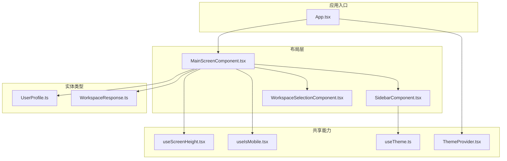
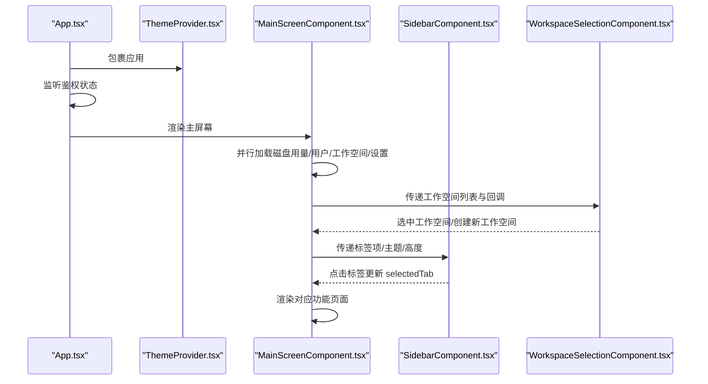
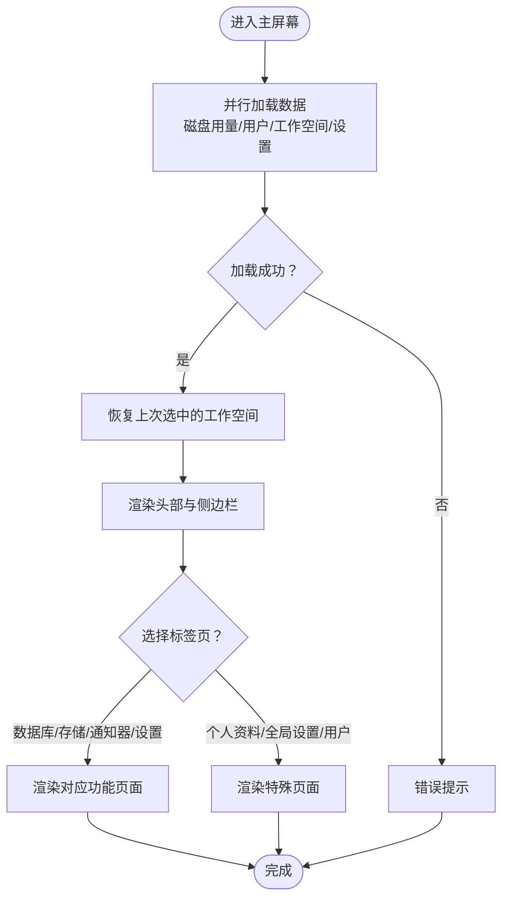
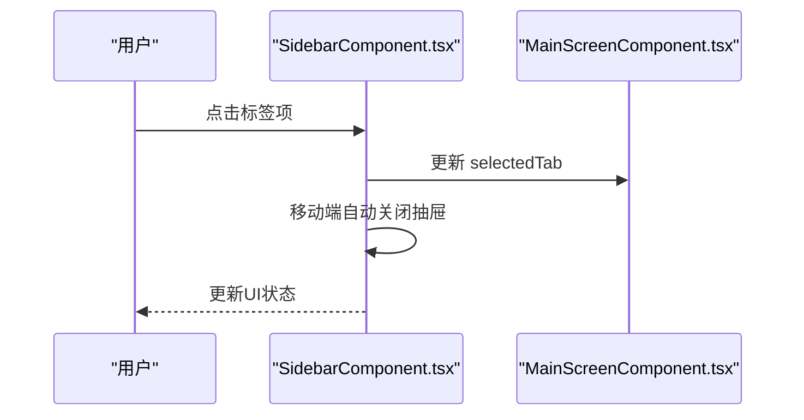
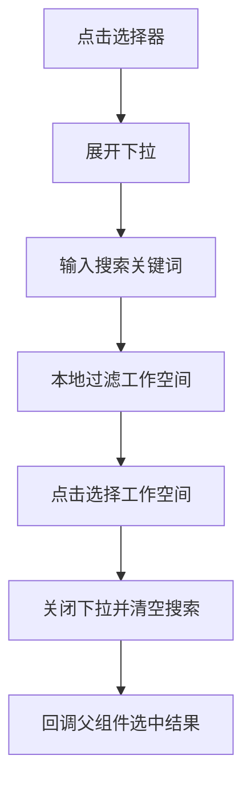
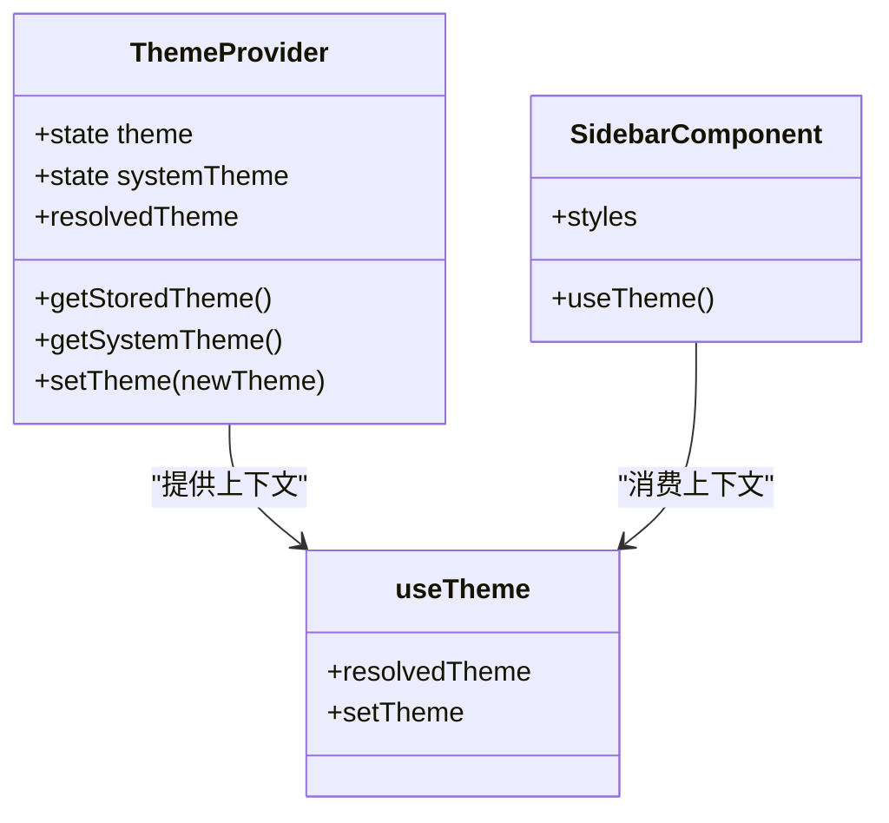
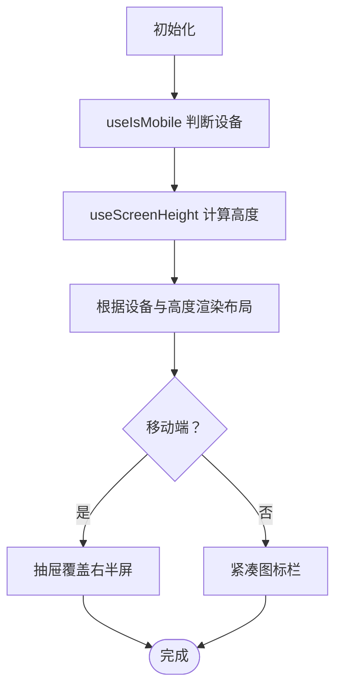
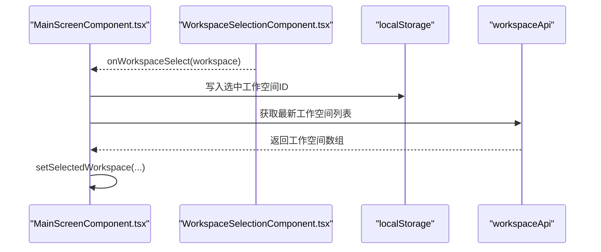
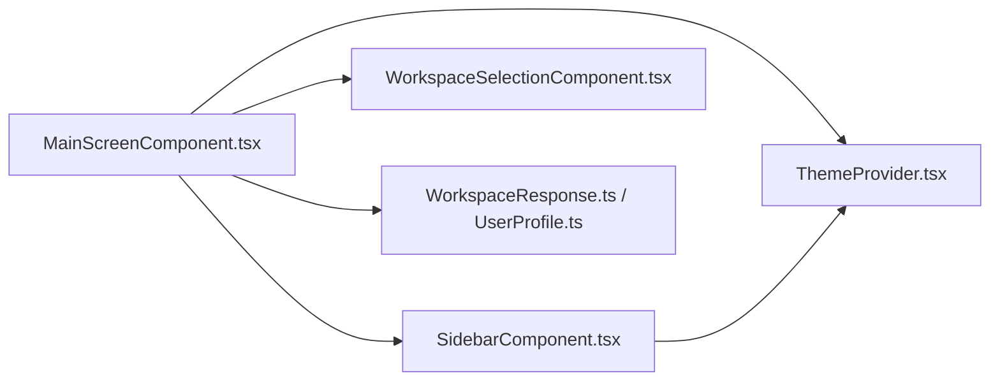

# 主布局组件

<cite>
**本文引用的文件**
- [MainScreenComponent.tsx](file://frontend/src/widgets/main/MainScreenComponent.tsx)
- [SidebarComponent.tsx](file://frontend/src/widgets/main/SidebarComponent.tsx)
- [WorkspaceSelectionComponent.tsx](file://frontend/src/widgets/main/WorkspaceSelectionComponent.tsx)
- [ThemeProvider.tsx](file://frontend/src/shared/theme/ThemeProvider.tsx)
- [useTheme.ts](file://frontend/src/shared/theme/useTheme.ts)
- [useIsMobile.tsx](file://frontend/src/shared/hooks/useIsMobile.tsx)
- [useScreenHeight.tsx](file://frontend/src/shared/hooks/useScreenHeight.tsx)
- [App.tsx](file://frontend/src/App.tsx)
- [WorkspaceResponse.ts](file://frontend/src/entity/workspaces/model/WorkspaceResponse.ts)
- [UserProfile.ts](file://frontend/src/entity/users/model/UserProfile.ts)
</cite>

## 目录
1. [简介](#简介)
2. [项目结构](#项目结构)
3. [核心组件](#核心组件)
4. [架构总览](#架构总览)
5. [详细组件分析](#详细组件分析)
6. [依赖关系分析](#依赖关系分析)
7. [性能考虑](#性能考虑)
8. [故障排查指南](#故障排查指南)
9. [结论](#结论)
10. [附录](#附录)

## 简介
本设计文档围绕 Databasus 的主布局组件进行系统化梳理，重点覆盖主屏幕组件的整体布局架构、侧边栏导航系统与工作空间选择组件的设计实现，并深入解析响应式布局策略、主题切换机制、导航状态管理与工作空间切换流程。文档同时解释组件间通信模式、状态共享机制与路由集成方案，涵盖移动端适配、导航菜单折叠、磁盘使用提示等细节，提供生命周期管理、性能优化策略与用户体验设计原则，并给出可操作的最佳实践与参考路径。

## 项目结构
主布局组件位于前端工程的 widgets/main 目录，配合共享主题与钩子模块共同构成布局层。整体采用“容器-展示”分层：MainScreenComponent 负责顶层布局与状态聚合；SidebarComponent 提供桌面/移动端双态导航；WorkspaceSelectionComponent 提供工作空间选择与搜索；主题与响应式能力由 ThemeProvider、useTheme、useIsMobile、useScreenHeight 提供。

**图表来源**
- [MainScreenComponent.tsx:1-405](file://frontend/src/widgets/main/MainScreenComponent.tsx#L1-L405)
- [SidebarComponent.tsx:1-227](file://frontend/src/widgets/main/SidebarComponent.tsx#L1-L227)
- [WorkspaceSelectionComponent.tsx:1-140](file://frontend/src/widgets/main/WorkspaceSelectionComponent.tsx#L1-L140)
- [ThemeProvider.tsx:1-79](file://frontend/src/shared/theme/ThemeProvider.tsx#L1-L79)
- [useTheme.ts:1-12](file://frontend/src/shared/theme/useTheme.ts#L1-L12)
- [useIsMobile.tsx:1-27](file://frontend/src/shared/hooks/useIsMobile.tsx#L1-L27)
- [useScreenHeight.tsx:1-39](file://frontend/src/shared/hooks/useScreenHeight.tsx#L1-L39)
- [App.tsx:1-77](file://frontend/src/App.tsx#L1-L77)
- [WorkspaceResponse.ts:1-50](file://frontend/src/entity/workspaces/model/WorkspaceResponse.ts#L1-L50)
- [UserProfile.ts:1-50](file://frontend/src/entity/users/model/UserProfile.ts#L1-L50)

**章节来源**
- [MainScreenComponent.tsx:1-405](file://frontend/src/widgets/main/MainScreenComponent.tsx#L1-L405)
- [SidebarComponent.tsx:1-227](file://frontend/src/widgets/main/SidebarComponent.tsx#L1-L227)
- [WorkspaceSelectionComponent.tsx:1-140](file://frontend/src/widgets/main/WorkspaceSelectionComponent.tsx#L1-L140)
- [ThemeProvider.tsx:1-79](file://frontend/src/shared/theme/ThemeProvider.tsx#L1-L79)
- [useTheme.ts:1-12](file://frontend/src/shared/theme/useTheme.ts#L1-L12)
- [useIsMobile.tsx:1-27](file://frontend/src/shared/hooks/useIsMobile.tsx#L1-L27)
- [useScreenHeight.tsx:1-39](file://frontend/src/shared/hooks/useScreenHeight.tsx#L1-L39)
- [App.tsx:1-77](file://frontend/src/App.tsx#L1-L77)

## 核心组件
- 主屏幕容器（MainScreenComponent）
  - 职责：聚合用户信息、全局设置、磁盘用量、工作空间列表与当前选中工作空间；管理顶部工具栏、侧边栏开关、标签页切换与内容渲染；处理创建工作空间对话框。
  - 关键状态：selectedTab、workspaces、selectedWorkspace、isLoading、isSidebarOpen、showCreateWorkspaceDialog。
  - 数据加载：并行拉取磁盘用量、当前用户、工作空间列表与全局设置，统一错误提示。
  - 响应式高度：基于 useScreenHeight 动态计算内容区域高度，移动端与桌面端差异处理。
  - 工作空间持久化：通过 localStorage 记录上次选中的工作空间 ID，刷新后自动恢复。
  - 导航可见性：根据角色与工作空间可用性动态过滤侧边栏与标签页项。
  - 内容渲染：按 selectedTab 渲染数据库、存储、通知器、设置、个人资料、全局设置或用户管理等页面。

- 侧边栏导航（SidebarComponent）
  - 职责：在桌面端以紧凑图标栏形式呈现，在移动端以抽屉形式呈现；根据主题色调整抽屉样式；支持磁盘用量提示与外部链接。
  - 双态适配：useIsMobile 判断设备类型；移动端打开时禁用背景滚动；桌面端自动关闭抽屉。
  - 过滤逻辑：仅显示对当前用户可见的标签项（管理员专用项仅管理员可见）。
  - 交互行为：点击标签后更新父组件 selectedTab，并在移动端自动收起抽屉。

- 工作空间选择（WorkspaceSelectionComponent）
  - 职责：提供工作空间下拉选择、搜索过滤、创建新工作空间入口；处理点击外部关闭与输入聚焦。
  - 搜索逻辑：本地过滤工作空间名称，支持空值回退到全量列表。
  - 外部事件：通过回调 onWorkspaceSelect/onCreateWorkspace 与父组件通信。

**章节来源**
- [MainScreenComponent.tsx:31-405](file://frontend/src/widgets/main/MainScreenComponent.tsx#L31-L405)
- [SidebarComponent.tsx:34-227](file://frontend/src/widgets/main/SidebarComponent.tsx#L34-L227)
- [WorkspaceSelectionComponent.tsx:14-140](file://frontend/src/widgets/main/WorkspaceSelectionComponent.tsx#L14-L140)

## 架构总览
主布局组件采用“容器-展示”分层与上下文共享机制：
- 容器层：MainScreenComponent 聚合业务状态与副作用，向下传递 props。
- 展示层：SidebarComponent、WorkspaceSelectionComponent 专注 UI 行为与交互。
- 主题层：ThemeProvider 管理主题模式与系统偏好监听，useTheme 提供消费接口。
- 响应式层：useIsMobile、useScreenHeight 提供设备检测与视口高度计算。
- 路由层：App.tsx 集成路由与鉴权状态，决定渲染登录页或主屏幕。

**图表来源**
- [App.tsx:16-66](file://frontend/src/App.tsx#L16-L66)
- [ThemeProvider.tsx:32-78](file://frontend/src/shared/theme/ThemeProvider.tsx#L32-L78)
- [MainScreenComponent.tsx:53-111](file://frontend/src/widgets/main/MainScreenComponent.tsx#L53-L111)
- [SidebarComponent.tsx:70-75](file://frontend/src/widgets/main/SidebarComponent.tsx#L70-L75)
- [WorkspaceSelectionComponent.tsx:31-35](file://frontend/src/widgets/main/WorkspaceSelectionComponent.tsx#L31-L35)

## 详细组件分析

### 主屏幕组件（MainScreenComponent）
- 状态与生命周期
  - 初始化加载：useEffect 触发并行数据加载，统一错误提示。
  - 工作空间恢复：useEffect 在 workspaces 就绪后从 localStorage 恢复上次选中项。
  - 本地持久化：selectedWorkspace 变更时写入 localStorage。
  - 响应式高度：useScreenHeight 计算 contentHeight，isMobile 控制头部高度差异。
- 导航与标签页
  - tabs 定义包含文本、图标、点击回调、可见性与权限控制；根据 selectedWorkspace 与用户角色动态过滤。
  - 选中态：selectedTab 控制当前渲染的功能页面。
- 内容渲染策略
  - 当无工作空间时，提供创建入口按钮。
  - 根据 selectedTab 渲染数据库、存储、通知器、设置、个人资料、全局设置或用户管理页面。
- 交互与提示
  - 移动端通过按钮触发侧边栏抽屉；桌面端隐藏该按钮。
  - 磁盘使用率阈值提示：超过 85% 显示使用情况，超过 95% 标记为危险色。
  - 顶部工具栏包含文档、社区、云服务入口与主题切换、星标按钮等。

**图表来源**
- [MainScreenComponent.tsx:53-111](file://frontend/src/widgets/main/MainScreenComponent.tsx#L53-L111)
- [MainScreenComponent.tsx:121-192](file://frontend/src/widgets/main/MainScreenComponent.tsx#L121-L192)

**章节来源**
- [MainScreenComponent.tsx:31-405](file://frontend/src/widgets/main/MainScreenComponent.tsx#L31-L405)

### 侧边栏组件（SidebarComponent）
- 设备适配
  - 桌面端：紧凑图标栏，垂直排列，选中态高亮。
  - 移动端：右侧抽屉，宽度固定，支持关闭按钮与自定义样式。
- 主题联动
  - 使用 useTheme 获取 resolvedTheme，动态设置抽屉与头部背景色。
- 交互与行为
  - 点击标签项更新父组件 selectedTab，并在移动端自动关闭抽屉。
  - 打开抽屉时禁用背景滚动，离开时恢复。
- 权限与可见性
  - 过滤管理员专用标签项；仅显示可见标签。

**图表来源**
- [SidebarComponent.tsx:70-75](file://frontend/src/widgets/main/SidebarComponent.tsx#L70-L75)
- [SidebarComponent.tsx:111-225](file://frontend/src/widgets/main/SidebarComponent.tsx#L111-L225)

**章节来源**
- [SidebarComponent.tsx:34-227](file://frontend/src/widgets/main/SidebarComponent.tsx#L34-L227)

### 工作空间选择组件（WorkspaceSelectionComponent）
- 下拉与搜索
  - 点击触发下拉展开；输入框支持实时搜索过滤。
  - 点击外部区域自动收起并清空搜索。
- 创建入口
  - 底部提供“创建新工作空间”入口，调用 onCreateWorkspace 回调。
- 无障碍与体验
  - 支持移动端小尺寸按钮与输入；自动聚焦搜索框。
  - 无匹配结果时显示提示文案。

**图表来源**
- [WorkspaceSelectionComponent.tsx:31-35](file://frontend/src/widgets/main/WorkspaceSelectionComponent.tsx#L31-L35)
- [WorkspaceSelectionComponent.tsx:91-135](file://frontend/src/widgets/main/WorkspaceSelectionComponent.tsx#L91-L135)

**章节来源**
- [WorkspaceSelectionComponent.tsx:14-140](file://frontend/src/widgets/main/WorkspaceSelectionComponent.tsx#L14-L140)

### 主题切换机制
- 主题提供者（ThemeProvider）
  - 存储策略：优先使用用户选择的主题，否则回退到系统偏好；系统偏好通过 matchMedia 监听变化。
  - 解析逻辑：resolvedTheme = theme === 'system' ? systemTheme : theme。
  - DOM 应用：将 'dark' 类名添加到 documentElement，驱动 Tailwind dark 模式。
  - 设置方法：setTheme 更新状态并持久化到 localStorage。
- 组件消费（useTheme）
  - 提供 resolvedTheme 与 setTheme，供 UI 组件按需使用。
- 布局联动
  - Sidebar 抽屉样式根据 resolvedTheme 自适应深浅色背景。
  - Ant Design ConfigProvider 根据 resolvedTheme 切换算法与主色调。

**图表来源**
- [ThemeProvider.tsx:32-78](file://frontend/src/shared/theme/ThemeProvider.tsx#L32-L78)
- [useTheme.ts:5-11](file://frontend/src/shared/theme/useTheme.ts#L5-L11)
- [SidebarComponent.tsx:130-139](file://frontend/src/widgets/main/SidebarComponent.tsx#L130-L139)

**章节来源**
- [ThemeProvider.tsx:1-79](file://frontend/src/shared/theme/ThemeProvider.tsx#L1-L79)
- [useTheme.ts:1-12](file://frontend/src/shared/theme/useTheme.ts#L1-L12)
- [SidebarComponent.tsx:130-139](file://frontend/src/widgets/main/SidebarComponent.tsx#L130-L139)
- [App.tsx:44-51](file://frontend/src/App.tsx#L44-L51)

### 响应式布局策略
- 设备检测：useIsMobile 以 768px 为阈值判断移动设备，动态监听窗口 resize。
- 视口高度：useScreenHeight 结合 visualViewport 与 innerHeight，解决 iOS 键盘弹出导致的 100vh 异常。
- 头部高度：移动端头部高度较小，桌面端较大，保证内容区域高度一致。
- 侧边栏形态：移动端使用抽屉，桌面端使用紧凑图标栏；抽屉打开时禁用背景滚动。

**图表来源**
- [useIsMobile.tsx:9-26](file://frontend/src/shared/hooks/useIsMobile.tsx#L9-L26)
- [useScreenHeight.tsx:12-38](file://frontend/src/shared/hooks/useScreenHeight.tsx#L12-L38)
- [MainScreenComponent.tsx:33-35](file://frontend/src/widgets/main/MainScreenComponent.tsx#L33-L35)
- [SidebarComponent.tsx:77-109](file://frontend/src/widgets/main/SidebarComponent.tsx#L77-L109)

**章节来源**
- [useIsMobile.tsx:1-27](file://frontend/src/shared/hooks/useIsMobile.tsx#L1-L27)
- [useScreenHeight.tsx:1-39](file://frontend/src/shared/hooks/useScreenHeight.tsx#L1-L39)
- [MainScreenComponent.tsx:33-35](file://frontend/src/widgets/main/MainScreenComponent.tsx#L33-L35)
- [SidebarComponent.tsx:46-61](file://frontend/src/widgets/main/SidebarComponent.tsx#L46-L61)

### 导航状态管理与工作空间切换流程
- 状态来源
  - 用户信息、全局设置、磁盘用量、工作空间列表均由 MainScreenComponent 并行加载。
  - selectedWorkspace 通过 WorkspaceSelectionComponent 与 SidebarComponent 共享。
- 切换流程
  - 选择工作空间后，MainScreenComponent 更新 selectedWorkspace 并持久化到 localStorage。
  - 根据角色与工作空间可用性动态过滤标签页与可见性。
- 对话框集成
  - 创建工作空间对话框在 MainScreenComponent 中统一管理，创建成功后刷新工作空间列表并选中新建项。

**图表来源**
- [MainScreenComponent.tsx:80-96](file://frontend/src/widgets/main/MainScreenComponent.tsx#L80-L96)
- [MainScreenComponent.tsx:102-111](file://frontend/src/widgets/main/MainScreenComponent.tsx#L102-L111)
- [WorkspaceSelectionComponent.tsx:31-35](file://frontend/src/widgets/main/WorkspaceSelectionComponent.tsx#L31-L35)

**章节来源**
- [MainScreenComponent.tsx:44-111](file://frontend/src/widgets/main/MainScreenComponent.tsx#L44-L111)
- [WorkspaceSelectionComponent.tsx:14-140](file://frontend/src/widgets/main/WorkspaceSelectionComponent.tsx#L14-L140)

### 组件间通信与状态共享
- 父子通信
  - MainScreenComponent -> SidebarComponent：传递 selectedTab、tabs、contentHeight、diskUsage、user。
  - MainScreenComponent -> WorkspaceSelectionComponent：传递 workspaces、selectedWorkspace、回调。
  - MainScreenComponent -> 对话框：传递 user、globalSettings、回调。
- 上下文共享
  - ThemeProvider 提供 resolvedTheme 与 setTheme，SidebarComponent 与 ThemeToggleComponent 消费。
- 本地存储
  - selected_workspace_id 用于跨会话保持工作空间选择。

**章节来源**
- [MainScreenComponent.tsx:287-399](file://frontend/src/widgets/main/MainScreenComponent.tsx#L287-L399)
- [SidebarComponent.tsx:34-42](file://frontend/src/widgets/main/SidebarComponent.tsx#L34-L42)
- [ThemeProvider.tsx:63-66](file://frontend/src/shared/theme/ThemeProvider.tsx#L63-L66)

### 路由集成方案
- 路由配置
  - App.tsx 使用 BrowserRouter 与 Routes，根路径根据鉴权状态决定渲染登录页或主屏幕。
  - 鉴权监听：userApi.addAuthListener 实时更新 isAuthorized。
- 主题与配置
  - Ant Design ConfigProvider 根据 resolvedTheme 切换算法与主色调。
- 云环境与支付
  - 云端部署时初始化 Paddle 环境与令牌，订阅事件通过自定义事件派发。

**章节来源**
- [App.tsx:16-66](file://frontend/src/App.tsx#L16-L66)

## 依赖关系分析
- 组件耦合
  - MainScreenComponent 作为枢纽，耦合 SidebarComponent、WorkspaceSelectionComponent、各功能页面组件与对话框组件。
  - SidebarComponent 与 ThemeProvider 通过 useTheme 解耦主题细节。
- 外部依赖
  - Ant Design 组件库提供 Drawer、Button、Tooltip、Spin 等基础 UI。
  - 浏览器 API：matchMedia、localStorage、visualViewport。
- 类型约束
  - WorkspaceResponse、UserProfile 提供强类型保障，确保工作空间与用户数据结构一致。

**图表来源**
- [MainScreenComponent.tsx:1-405](file://frontend/src/widgets/main/MainScreenComponent.tsx#L1-L405)
- [SidebarComponent.tsx:1-227](file://frontend/src/widgets/main/SidebarComponent.tsx#L1-L227)
- [WorkspaceSelectionComponent.tsx:1-140](file://frontend/src/widgets/main/WorkspaceSelectionComponent.tsx#L1-L140)
- [ThemeProvider.tsx:1-79](file://frontend/src/shared/theme/ThemeProvider.tsx#L1-L79)
- [WorkspaceResponse.ts:1-50](file://frontend/src/entity/workspaces/model/WorkspaceResponse.ts#L1-L50)
- [UserProfile.ts:1-50](file://frontend/src/entity/users/model/UserProfile.ts#L1-L50)

**章节来源**
- [MainScreenComponent.tsx:1-405](file://frontend/src/widgets/main/MainScreenComponent.tsx#L1-L405)
- [SidebarComponent.tsx:1-227](file://frontend/src/widgets/main/SidebarComponent.tsx#L1-L227)
- [WorkspaceSelectionComponent.tsx:1-140](file://frontend/src/widgets/main/WorkspaceSelectionComponent.tsx#L1-L140)
- [ThemeProvider.tsx:1-79](file://frontend/src/shared/theme/ThemeProvider.tsx#L1-L79)
- [WorkspaceResponse.ts:1-50](file://frontend/src/entity/workspaces/model/WorkspaceResponse.ts#L1-L50)
- [UserProfile.ts:1-50](file://frontend/src/entity/users/model/UserProfile.ts#L1-L50)

## 性能考虑
- 并行加载
  - 使用 Promise.all 并行请求磁盘用量、用户、工作空间与全局设置，减少首屏等待时间。
- 懒加载与条件渲染
  - 仅在需要时渲染对应功能页面；无工作空间时渲染创建入口，避免无效渲染。
- 本地存储
  - 工作空间选择与主题模式均持久化，减少重复请求与计算。
- 移动端优化
  - 抽屉打开时禁用背景滚动，避免重排与滚动抖动。
- 视口高度稳定
  - useScreenHeight 结合 visualViewport，降低 iOS 键盘弹出带来的布局抖动风险。
- 图标与资源
  - 使用懒加载属性与合适的尺寸，减少首屏资源压力。

[本节为通用性能建议，不直接分析具体文件]

## 故障排查指南
- 无法加载数据
  - 检查网络请求是否被拦截或跨域限制；确认并行加载逻辑是否抛错并触发消息提示。
  - 参考路径：[MainScreenComponent.tsx:53-73](file://frontend/src/widgets/main/MainScreenComponent.tsx#L53-L73)
- 工作空间未恢复
  - 确认 localStorage 中是否存在 selected_workspace_id；检查 workspaces 是否已就绪。
  - 参考路径：[MainScreenComponent.tsx:80-96](file://frontend/src/widgets/main/MainScreenComponent.tsx#L80-L96)
- 移动端抽屉无法关闭
  - 检查 handleTabClick 是否正确调用 onClose；确认 isMobile 判断逻辑。
  - 参考路径：[SidebarComponent.tsx:70-75](file://frontend/src/widgets/main/SidebarComponent.tsx#L70-L75)
- 主题未生效
  - 确认 ThemeProvider 是否包裹应用；检查 resolvedTheme 是否正确应用到 documentElement。
  - 参考路径：[ThemeProvider.tsx:54-61](file://frontend/src/shared/theme/ThemeProvider.tsx#L54-L61)
- 视口高度异常
  - 在 iOS 设备上确认 visualViewport 是否存在；检查 useScreenHeight 的事件绑定与清理。
  - 参考路径：[useScreenHeight.tsx:15-35](file://frontend/src/shared/hooks/useScreenHeight.tsx#L15-L35)

**章节来源**
- [MainScreenComponent.tsx:53-111](file://frontend/src/widgets/main/MainScreenComponent.tsx#L53-L111)
- [SidebarComponent.tsx:70-75](file://frontend/src/widgets/main/SidebarComponent.tsx#L70-L75)
- [ThemeProvider.tsx:54-61](file://frontend/src/shared/theme/ThemeProvider.tsx#L54-L61)
- [useScreenHeight.tsx:15-35](file://frontend/src/shared/hooks/useScreenHeight.tsx#L15-L35)

## 结论
主布局组件通过清晰的职责划分与上下文共享机制，实现了稳定的响应式布局、灵活的主题切换与高效的工作空间管理。其并行加载策略、本地持久化与移动端优化显著提升了用户体验。后续可在以下方面持续改进：增强错误边界与降级策略、引入缓存与增量更新、进一步抽象导航与权限控制逻辑，以及完善面包屑与页面标题管理（如需扩展）。

[本节为总结性内容，不直接分析具体文件]

## 附录
- 最佳实践
  - 使用并行加载提升首屏性能，避免串行阻塞。
  - 将主题与响应式逻辑收敛至共享模块，降低组件间耦合。
  - 对移动端交互进行一致性测试，确保抽屉与滚动行为稳定。
  - 对关键状态（工作空间、主题）进行持久化，提升连续性体验。
- 参考路径
  - 主屏幕容器：[MainScreenComponent.tsx:31-405](file://frontend/src/widgets/main/MainScreenComponent.tsx#L31-L405)
  - 侧边栏导航：[SidebarComponent.tsx:34-227](file://frontend/src/widgets/main/SidebarComponent.tsx#L34-L227)
  - 工作空间选择：[WorkspaceSelectionComponent.tsx:14-140](file://frontend/src/widgets/main/WorkspaceSelectionComponent.tsx#L14-L140)
  - 主题提供者：[ThemeProvider.tsx:32-78](file://frontend/src/shared/theme/ThemeProvider.tsx#L32-L78)
  - 设备检测：[useIsMobile.tsx:9-26](file://frontend/src/shared/hooks/useIsMobile.tsx#L9-L26)
  - 视口高度：[useScreenHeight.tsx:12-38](file://frontend/src/shared/hooks/useScreenHeight.tsx#L12-L38)
  - 应用入口与路由：[App.tsx:16-66](file://frontend/src/App.tsx#L16-L66)