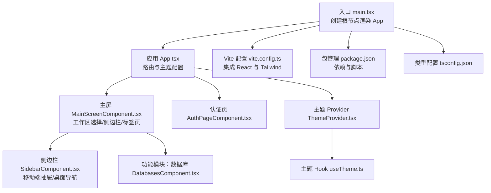
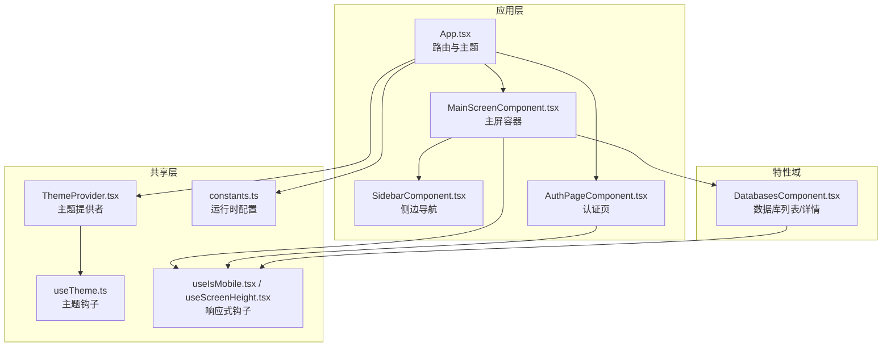
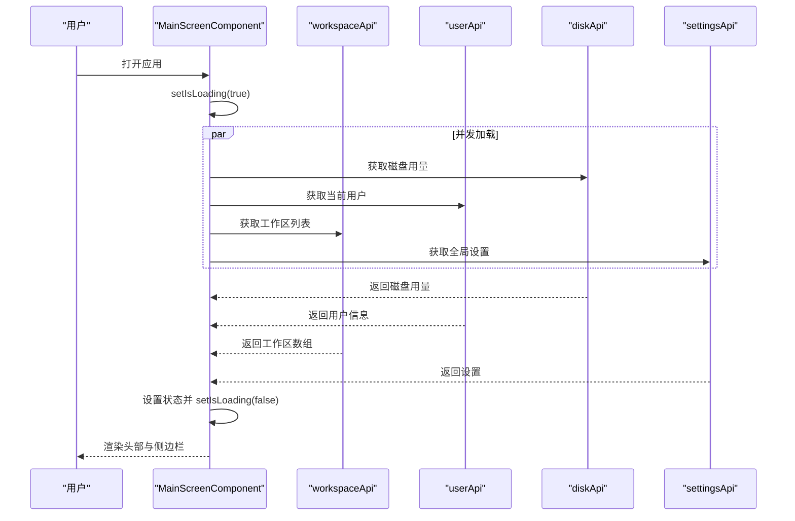
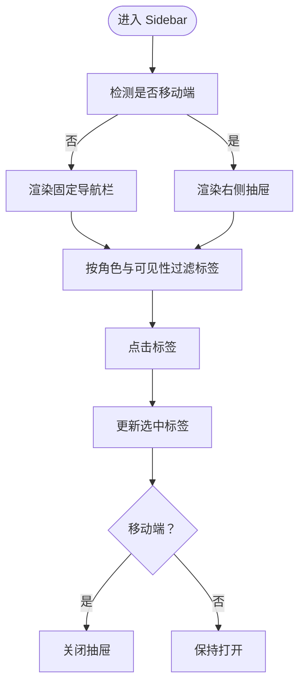
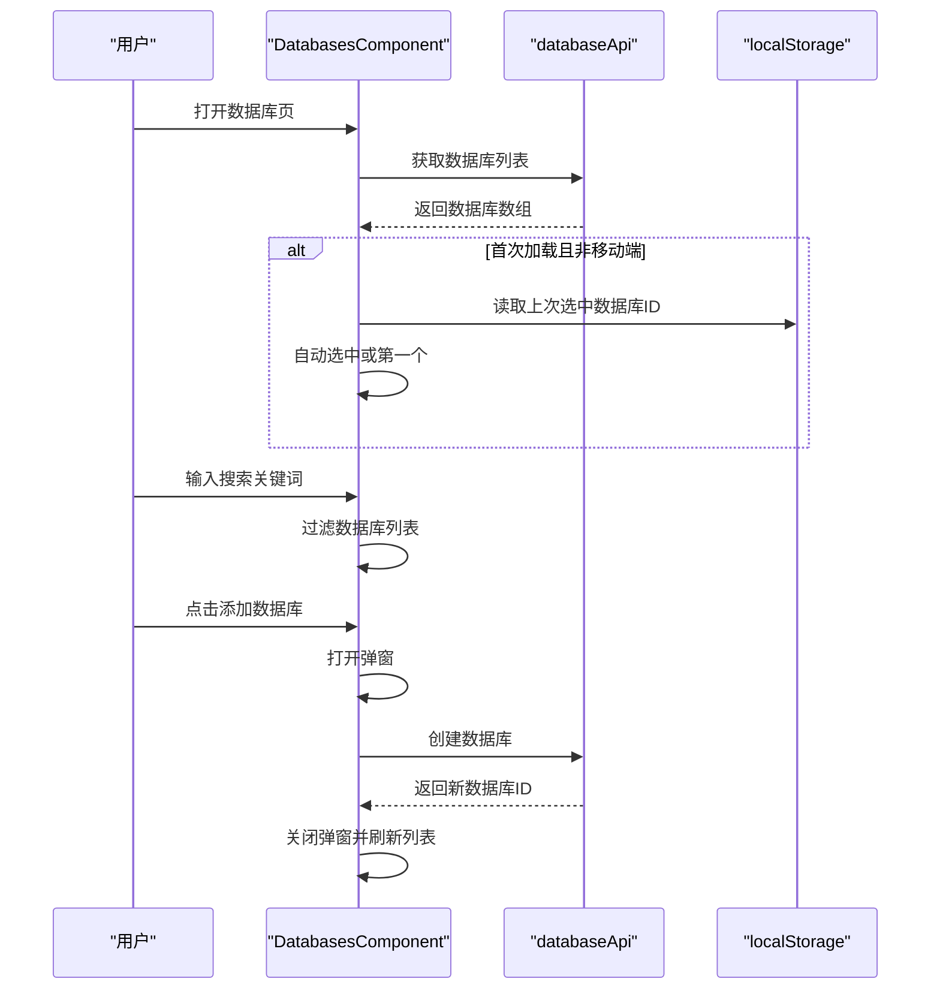
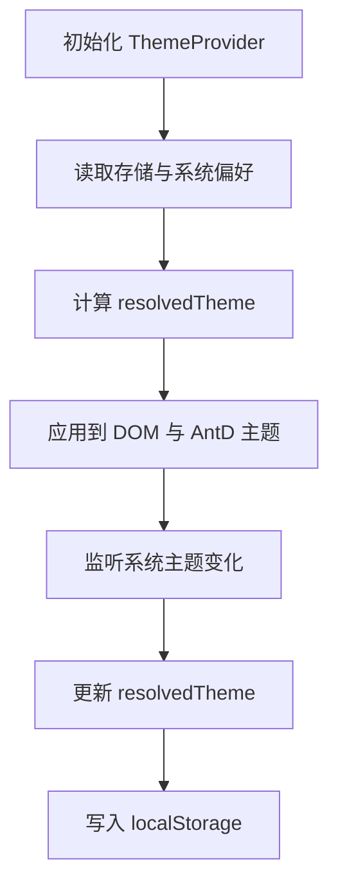
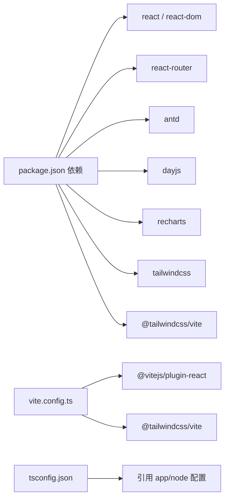

# 前端UI组件

<cite>
**本文引用的文件**
- [frontend/src/main.tsx](file://frontend/src/main.tsx)
- [frontend/src/App.tsx](file://frontend/src/App.tsx)
- [frontend/package.json](file://frontend/package.json)
- [frontend/vite.config.ts](file://frontend/vite.config.ts)
- [frontend/tsconfig.json](file://frontend/tsconfig.json)
- [frontend/src/shared/theme/ThemeProvider.tsx](file://frontend/src/shared/theme/ThemeProvider.tsx)
- [frontend/src/shared/theme/useTheme.ts](file://frontend/src/shared/theme/useTheme.ts)
- [frontend/src/widgets/main/MainScreenComponent.tsx](file://frontend/src/widgets/main/MainScreenComponent.tsx)
- [frontend/src/widgets/main/SidebarComponent.tsx](file://frontend/src/widgets/main/SidebarComponent.tsx)
- [frontend/src/pages/AuthPageComponent.tsx](file://frontend/src/pages/AuthPageComponent.tsx)
- [frontend/src/entity/users/index.ts](file://frontend/src/entity/users/index.ts)
- [frontend/src/features/databases/ui/DatabasesComponent.tsx](file://frontend/src/features/databases/ui/DatabasesComponent.tsx)
- [frontend/src/shared/hooks/useIsMobile.tsx](file://frontend/src/shared/hooks/useIsMobile.tsx)
- [frontend/src/shared/hooks/useScreenHeight.tsx](file://frontend/src/shared/hooks/useScreenHeight.tsx)
- [frontend/src/constants.ts](file://frontend/src/constants.ts)
</cite>

## 目录
1. [简介](#简介)
2. [项目结构](#项目结构)
3. [核心组件](#核心组件)
4. [架构总览](#架构总览)
5. [详细组件分析](#详细组件分析)
6. [依赖分析](#依赖分析)
7. [性能考量](#性能考量)
8. [故障排查指南](#故障排查指南)
9. [结论](#结论)
10. [附录](#附录)

## 简介
本文件为 Databasus 前端 UI 组件的设计文档，聚焦于基于 React 19 + TypeScript 的组件化架构。内容覆盖主应用结构、页面布局组件、功能模块组件与 UI 基础组件的设计模式；阐述组件层次结构、状态管理模式、路由配置与主题系统实现；解释响应式设计策略、组件复用机制、表单验证与数据绑定方案；并提供组件树结构图与数据流向图，展示从用户交互到状态更新的完整流程。同时包含组件测试策略、性能优化技巧与可访问性设计考虑。

## 项目结构
前端采用 Vite + React 19 + TypeScript 构建，使用 Ant Design 作为基础 UI 库，并通过 TailwindCSS 实现样式与主题切换。项目按“实体-特性-小部件-页面”分层组织，形成清晰的职责边界与可复用性。

图表来源
- [frontend/src/main.tsx:1-14](file://frontend/src/main.tsx#L1-L14)
- [frontend/src/App.tsx:1-77](file://frontend/src/App.tsx#L1-L77)
- [frontend/src/widgets/main/MainScreenComponent.tsx:1-405](file://frontend/src/widgets/main/MainScreenComponent.tsx#L1-L405)
- [frontend/src/widgets/main/SidebarComponent.tsx:1-227](file://frontend/src/widgets/main/SidebarComponent.tsx#L1-L227)
- [frontend/src/features/databases/ui/DatabasesComponent.tsx:1-204](file://frontend/src/features/databases/ui/DatabasesComponent.tsx#L1-L204)
- [frontend/src/pages/AuthPageComponent.tsx:1-115](file://frontend/src/pages/AuthPageComponent.tsx#L1-L115)
- [frontend/src/shared/theme/ThemeProvider.tsx:1-79](file://frontend/src/shared/theme/ThemeProvider.tsx#L1-L79)
- [frontend/src/shared/theme/useTheme.ts:1-12](file://frontend/src/shared/theme/useTheme.ts#L1-L12)
- [frontend/vite.config.ts:1-9](file://frontend/vite.config.ts#L1-L9)
- [frontend/package.json:1-46](file://frontend/package.json#L1-L46)
- [frontend/tsconfig.json:1-5](file://frontend/tsconfig.json#L1-L5)

章节来源
- [frontend/src/main.tsx:1-14](file://frontend/src/main.tsx#L1-L14)
- [frontend/src/App.tsx:1-77](file://frontend/src/App.tsx#L1-L77)
- [frontend/vite.config.ts:1-9](file://frontend/vite.config.ts#L1-L9)
- [frontend/package.json:1-46](file://frontend/package.json#L1-L46)
- [frontend/tsconfig.json:1-5](file://frontend/tsconfig.json#L1-L5)

## 核心组件
- 应用根组件与路由
  - 入口在 main.tsx 中创建根节点并渲染 App。
  - App.tsx 使用 BrowserRouter + Routes 进行路由配置，支持认证回调、OAuth 存储授权与主屏。
  - 通过 ConfigProvider + AntdApp 提供全局主题算法与设计令牌。
- 主屏组件 MainScreenComponent
  - 负责头部区域（Logo、工作区选择、磁盘用量提示、主题切换等）、侧边栏、标签页内容区。
  - 支持工作区多选、本地存储上次选择、权限控制（不同角色可见不同标签）。
- 侧边栏 SidebarComponent
  - 桌面端为固定导航栏，移动端为抽屉式导航；根据屏幕宽度动态切换。
  - 内置磁盘用量提示、文档链接、社区链接、云服务入口与星标按钮。
- 认证页 AuthPageComponent
  - 动态切换登录/注册/请求重置/重置密码等子组件，支持管理员初始密码设置。
- 数据库功能模块 DatabasesComponent
  - 列表与详情联动，支持搜索过滤、自动刷新、添加数据库弹窗。
  - 移动端与桌面端布局差异明显，桌面端默认选中首个数据库。
- 主题系统 ThemeProvider/useTheme
  - 支持 light/dark/system 三种模式，持久化到 localStorage，监听系统偏好变化。
  - 将 resolvedTheme 注入 Ant Design 主题算法与 CSS 类名切换。
- 响应式钩子
  - useIsMobile：窗口宽度阈值判断，用于布局切换。
  - useScreenHeight：兼容 iOS 视口高度变化，确保全屏高度一致。

章节来源
- [frontend/src/App.tsx:1-77](file://frontend/src/App.tsx#L1-L77)
- [frontend/src/widgets/main/MainScreenComponent.tsx:1-405](file://frontend/src/widgets/main/MainScreenComponent.tsx#L1-L405)
- [frontend/src/widgets/main/SidebarComponent.tsx:1-227](file://frontend/src/widgets/main/SidebarComponent.tsx#L1-L227)
- [frontend/src/pages/AuthPageComponent.tsx:1-115](file://frontend/src/pages/AuthPageComponent.tsx#L1-L115)
- [frontend/src/features/databases/ui/DatabasesComponent.tsx:1-204](file://frontend/src/features/databases/ui/DatabasesComponent.tsx#L1-L204)
- [frontend/src/shared/theme/ThemeProvider.tsx:1-79](file://frontend/src/shared/theme/ThemeProvider.tsx#L1-L79)
- [frontend/src/shared/theme/useTheme.ts:1-12](file://frontend/src/shared/theme/useTheme.ts#L1-L12)
- [frontend/src/shared/hooks/useIsMobile.tsx:1-27](file://frontend/src/shared/hooks/useIsMobile.tsx#L1-L27)
- [frontend/src/shared/hooks/useScreenHeight.tsx:1-39](file://frontend/src/shared/hooks/useScreenHeight.tsx#L1-L39)

## 架构总览
整体采用“容器-展示”分离与“特性域”划分：
- 容器组件负责状态管理与副作用（如加载数据、权限判断、工作区选择）。
- 展示组件负责 UI 呈现与事件回调（如点击、输入、开关）。
- 特性域组件（如数据库、存储、通知）封装业务逻辑与 UI。
- 基础 UI 组件（如按钮、模态框、主题切换）提供通用能力。

图表来源
- [frontend/src/App.tsx:1-77](file://frontend/src/App.tsx#L1-L77)
- [frontend/src/widgets/main/MainScreenComponent.tsx:1-405](file://frontend/src/widgets/main/MainScreenComponent.tsx#L1-L405)
- [frontend/src/widgets/main/SidebarComponent.tsx:1-227](file://frontend/src/widgets/main/SidebarComponent.tsx#L1-L227)
- [frontend/src/pages/AuthPageComponent.tsx:1-115](file://frontend/src/pages/AuthPageComponent.tsx#L1-L115)
- [frontend/src/features/databases/ui/DatabasesComponent.tsx:1-204](file://frontend/src/features/databases/ui/DatabasesComponent.tsx#L1-L204)
- [frontend/src/shared/theme/ThemeProvider.tsx:1-79](file://frontend/src/shared/theme/ThemeProvider.tsx#L1-L79)
- [frontend/src/shared/theme/useTheme.ts:1-12](file://frontend/src/shared/theme/useTheme.ts#L1-L12)
- [frontend/src/shared/hooks/useIsMobile.tsx:1-27](file://frontend/src/shared/hooks/useIsMobile.tsx#L1-L27)
- [frontend/src/shared/hooks/useScreenHeight.tsx:1-39](file://frontend/src/shared/hooks/useScreenHeight.tsx#L1-L39)
- [frontend/src/constants.ts:1-72](file://frontend/src/constants.ts#L1-L72)

## 详细组件分析

### 主应用与路由
- 路由策略
  - /auth/callback：OAuth 回调页
  - /storages/google-oauth：存储授权页
  - /：未授权显示认证页，已授权显示主屏
- 主题注入
  - ConfigProvider 设置算法与主色令牌，随 resolvedTheme 切换明暗主题
- 授权监听
  - 初始化时检查授权状态并订阅变更，驱动路由与内容切换

章节来源
- [frontend/src/App.tsx:1-77](file://frontend/src/App.tsx#L1-L77)

### 主屏组件 MainScreenComponent
- 职责
  - 加载磁盘用量、当前用户、工作区列表与全局设置
  - 工作区选择与持久化、权限控制（只读用户隐藏部分标签）
  - 头部信息（Logo、工作区选择、磁盘用量提示、主题切换、云入口）
  - 标签页内容区（数据库、存储、通知、设置、个人资料、全局设置、用户管理）
- 状态管理
  - 本地状态：当前选中标签、磁盘用量、用户、全局设置、工作区列表与选中项、加载状态、侧边栏开关、创建工作区弹窗
  - 本地存储：上次选中的工作区 ID
- 性能
  - 并发加载多个数据源，Promise.all
  - 错误统一通过消息提示反馈

图表来源
- [frontend/src/widgets/main/MainScreenComponent.tsx:53-77](file://frontend/src/widgets/main/MainScreenComponent.tsx#L53-L77)

章节来源
- [frontend/src/widgets/main/MainScreenComponent.tsx:1-405](file://frontend/src/widgets/main/MainScreenComponent.tsx#L1-L405)

### 侧边栏 SidebarComponent
- 响应式行为
  - 桌面端：固定宽度导航栏，图标+悬浮提示
  - 移动端：右侧抽屉，关闭时阻止背景滚动
- 权限过滤
  - 管理员专用标签仅管理员可见
- 交互细节
  - 点击标签后自动关闭移动端抽屉
  - 磁盘用量提示，超限时高亮

图表来源
- [frontend/src/widgets/main/SidebarComponent.tsx:46-75](file://frontend/src/widgets/main/SidebarComponent.tsx#L46-L75)
- [frontend/src/widgets/main/SidebarComponent.tsx:109-227](file://frontend/src/widgets/main/SidebarComponent.tsx#L109-L227)

章节来源
- [frontend/src/widgets/main/SidebarComponent.tsx:1-227](file://frontend/src/widgets/main/SidebarComponent.tsx#L1-L227)

### 认证页 AuthPageComponent
- 功能
  - 动态切换登录/注册/请求重置/重置密码视图
  - 管理员初始密码设置流程
  - 加载状态与错误提示
- 响应式
  - 使用 useScreenHeight 保证全屏高度

章节来源
- [frontend/src/pages/AuthPageComponent.tsx:1-115](file://frontend/src/pages/AuthPageComponent.tsx#L1-L115)

### 数据库功能模块 DatabasesComponent
- 功能
  - 列表展示与搜索过滤
  - 添加数据库弹窗与实时刷新
  - 移动端/桌面端布局差异：桌面端默认选中第一个数据库，移动端先列表再详情
- 状态与存储
  - 本地存储每个工作区最近选中的数据库 ID
  - 定时轮询更新（每 5 分钟）

图表来源
- [frontend/src/features/databases/ui/DatabasesComponent.tsx:40-75](file://frontend/src/features/databases/ui/DatabasesComponent.tsx#L40-L75)
- [frontend/src/features/databases/ui/DatabasesComponent.tsx:179-202](file://frontend/src/features/databases/ui/DatabasesComponent.tsx#L179-L202)

章节来源
- [frontend/src/features/databases/ui/DatabasesComponent.tsx:1-204](file://frontend/src/features/databases/ui/DatabasesComponent.tsx#L1-L204)

### 主题系统
- 设计
  - 支持 light/dark/system 三种模式
  - 优先级：用户选择 > 系统偏好 > 默认 light
  - 将 resolvedTheme 应用到 Ant Design 与 HTML 根元素类名
- 生命周期
  - 监听系统主题变化（prefers-color-scheme）
  - 写入 localStorage 以持久化用户选择

图表来源
- [frontend/src/shared/theme/ThemeProvider.tsx:9-26](file://frontend/src/shared/theme/ThemeProvider.tsx#L9-L26)
- [frontend/src/shared/theme/ThemeProvider.tsx:48-61](file://frontend/src/shared/theme/ThemeProvider.tsx#L48-L61)
- [frontend/src/shared/theme/useTheme.ts:5-11](file://frontend/src/shared/theme/useTheme.ts#L5-L11)

章节来源
- [frontend/src/shared/theme/ThemeProvider.tsx:1-79](file://frontend/src/shared/theme/ThemeProvider.tsx#L1-L79)
- [frontend/src/shared/theme/useTheme.ts:1-12](file://frontend/src/shared/theme/useTheme.ts#L1-L12)

### 响应式与屏幕适配
- useIsMobile：窗口宽度阈值判断，动态响应窗口尺寸变化
- useScreenHeight：优先使用 visualViewport 高度，兼容 iOS 键盘弹出场景

章节来源
- [frontend/src/shared/hooks/useIsMobile.tsx:1-27](file://frontend/src/shared/hooks/useIsMobile.tsx#L1-L27)
- [frontend/src/shared/hooks/useScreenHeight.tsx:1-39](file://frontend/src/shared/hooks/useScreenHeight.tsx#L1-L39)

### 实体与类型导出
- 用户相关实体集中导出，便于跨模块引用
- 包含登录/注册/设置/管理等请求模型与枚举类型

章节来源
- [frontend/src/entity/users/index.ts:1-25](file://frontend/src/entity/users/index.ts#L1-L25)

## 依赖分析
- 构建与工具链
  - Vite + React 插件 + TailwindCSS 插件
  - TypeScript 多项目引用配置
- 运行时依赖
  - React 19、Ant Design、React Router 7、Day.js、Recharts、TailwindCSS
- 开发依赖
  - ESLint、Prettier、Vitest、TypeScript Eslint 等

图表来源
- [frontend/package.json:15-44](file://frontend/package.json#L15-L44)
- [frontend/vite.config.ts:1-9](file://frontend/vite.config.ts#L1-L9)
- [frontend/tsconfig.json:1-5](file://frontend/tsconfig.json#L1-L5)

章节来源
- [frontend/package.json:1-46](file://frontend/package.json#L1-L46)
- [frontend/vite.config.ts:1-9](file://frontend/vite.config.ts#L1-L9)
- [frontend/tsconfig.json:1-5](file://frontend/tsconfig.json#L1-L5)

## 性能考量
- 并发加载
  - 主屏并发获取磁盘用量、用户、工作区与全局设置，减少首屏等待时间
- 定时刷新
  - 数据库列表每 5 分钟轮询一次，避免频繁请求带来的压力
- 本地存储
  - 工作区与数据库选择持久化，提升二次进入体验
- 响应式渲染
  - 移动端抽屉关闭时阻止背景滚动，避免布局抖动
- 主题切换
  - 通过 CSS 类名与 AntD 算法切换，避免重复渲染整个应用

章节来源
- [frontend/src/widgets/main/MainScreenComponent.tsx:57-62](file://frontend/src/widgets/main/MainScreenComponent.tsx#L57-L62)
- [frontend/src/features/databases/ui/DatabasesComponent.tsx:70-74](file://frontend/src/features/databases/ui/DatabasesComponent.tsx#L70-L74)
- [frontend/src/widgets/main/SidebarComponent.tsx:53-61](file://frontend/src/widgets/main/SidebarComponent.tsx#L53-L61)

## 故障排查指南
- 路由与授权
  - 若无法进入主屏，请确认授权监听是否正常触发，以及用户 API 的授权状态返回
- 主题不生效
  - 检查 ThemeProvider 是否包裹 AppContent，resolvedTheme 是否正确计算，HTML 根元素类名是否包含 dark
- 数据未刷新
  - 确认定时轮询是否启动，网络请求是否报错；数据库列表弹窗关闭后需手动刷新
- 移动端布局异常
  - 检查 useIsMobile 与 useScreenHeight 的监听是否生效，iOS 视口变化事件是否绑定

章节来源
- [frontend/src/App.tsx:34-41](file://frontend/src/App.tsx#L34-L41)
- [frontend/src/shared/theme/ThemeProvider.tsx:54-61](file://frontend/src/shared/theme/ThemeProvider.tsx#L54-L61)
- [frontend/src/features/databases/ui/DatabasesComponent.tsx:70-74](file://frontend/src/features/databases/ui/DatabasesComponent.tsx#L70-L74)
- [frontend/src/shared/hooks/useIsMobile.tsx:13-23](file://frontend/src/shared/hooks/useIsMobile.tsx#L13-L23)
- [frontend/src/shared/hooks/useScreenHeight.tsx:15-35](file://frontend/src/shared/hooks/useScreenHeight.tsx#L15-L35)

## 结论
该前端 UI 架构以 React 19 + TypeScript 为基础，结合 Ant Design 与 TailwindCSS，实现了清晰的分层与良好的可维护性。通过主题系统、响应式钩子与特性域组件，满足了多角色、多设备下的复杂交互需求。建议后续在以下方面持续优化：完善错误边界与降级策略、增强可访问性（ARIA、键盘导航）、引入更细粒度的懒加载与缓存策略，并扩展组件测试覆盖率。

## 附录
- 组件测试策略
  - 单元测试：针对纯函数与自定义 Hook（如 useIsMobile、useScreenHeight）进行断言
  - 集成测试：对容器组件（如 MainScreenComponent、DatabasesComponent）模拟 API 返回与本地存储
  - UI 测试：使用 Vitest + React Testing Library 或 Playwright，覆盖关键交互路径（点击、输入、切换标签）
- 可访问性设计
  - 为图片提供替代文本，为按钮与链接提供语义化标签
  - 确保键盘可操作性（Tab 导航、焦点管理）
  - 对颜色对比度进行校验，保障暗色模式下可读性
- 性能优化技巧
  - 使用 React.memo 与 useMemo 缓存昂贵计算
  - 图片懒加载与骨架屏提升感知性能
  - 代码分割与路由级懒加载减少首屏体积