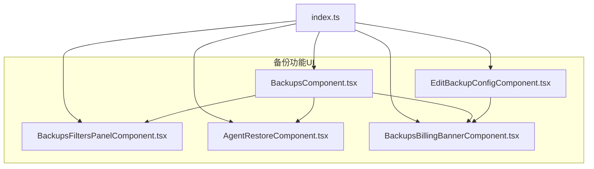
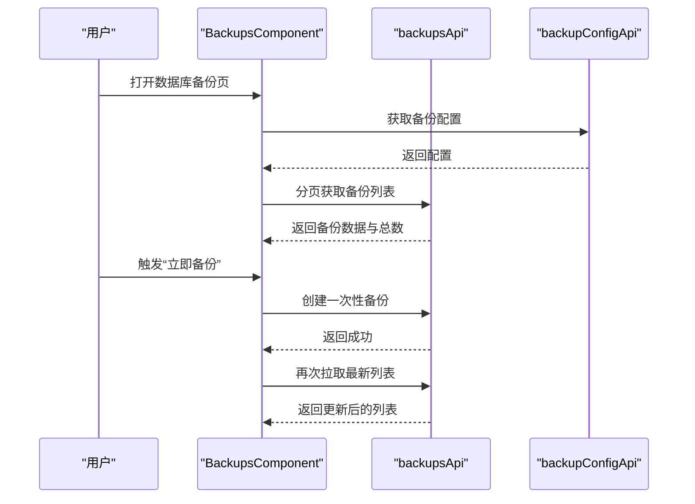
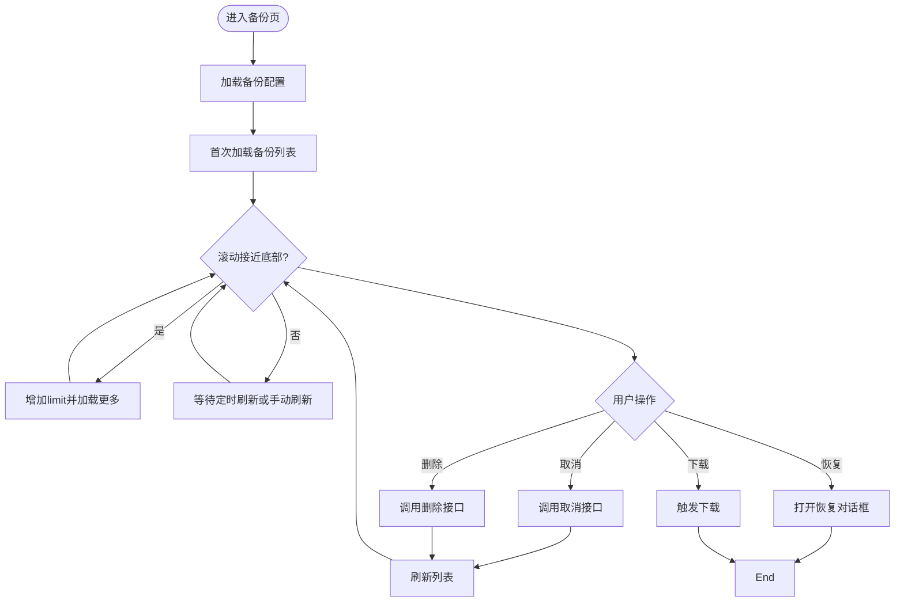
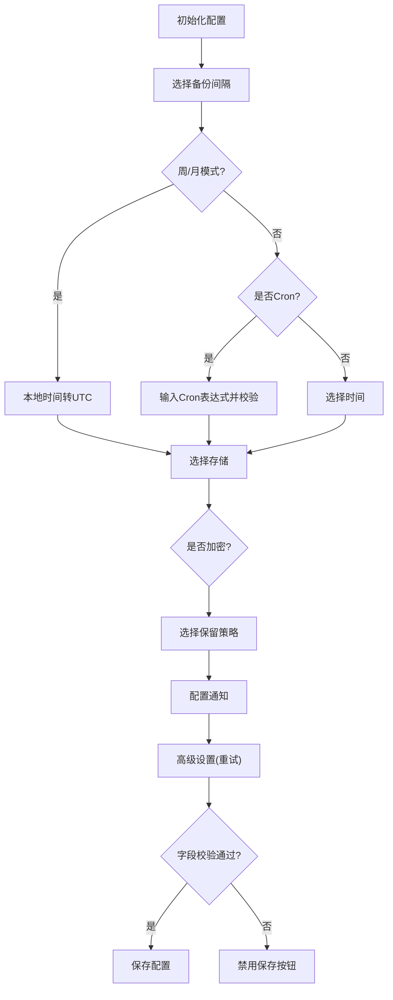
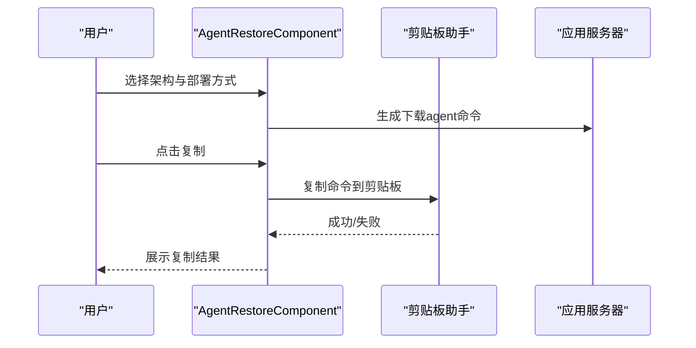
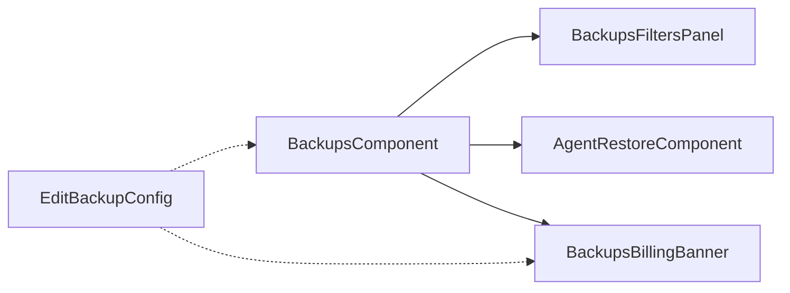

# 备份管理UI

<cite>
**本文引用的文件**
- [BackupsComponent.tsx](file://frontend/src/features/backups/ui/BackupsComponent.tsx)
- [EditBackupConfigComponent.tsx](file://frontend/src/features/backups/ui/EditBackupConfigComponent.tsx)
- [BackupsFiltersPanelComponent.tsx](file://frontend/src/features/backups/ui/BackupsFiltersPanelComponent.tsx)
- [AgentRestoreComponent.tsx](file://frontend/src/features/backups/ui/AgentRestoreComponent.tsx)
- [BackupsBillingBannerComponent.tsx](file://frontend/src/features/backups/ui/BackupsBillingBannerComponent.tsx)
- [index.ts](file://frontend/src/features/backups/index.ts)
</cite>

## 目录
1. [简介](#简介)
2. [项目结构](#项目结构)
3. [核心组件](#核心组件)
4. [架构总览](#架构总览)
5. [详细组件分析](#详细组件分析)
6. [依赖关系分析](#依赖关系分析)
7. [性能考量](#性能考量)
8. [故障排查指南](#故障排查指南)
9. [结论](#结论)
10. [附录](#附录)

## 简介
本文件面向Databasus备份管理UI组件，系统化梳理备份列表展示、备份配置编辑、备份过滤面板、代理恢复界面等关键功能模块。文档同时覆盖备份状态可视化、进度条组件、定时任务配置界面、备份历史记录展示、备份配置向导的步骤设计与参数验证、备份下载界面与断点续传思路、备份策略选择与保留策略配置、批量操作界面以及备份监控图表与异常告警的设计建议。

## 项目结构
备份相关UI位于前端模块的features/backups/ui目录下，采用按功能分层组织：
- 列表与交互：BackupsComponent.tsx
- 配置编辑：EditBackupConfigComponent.tsx
- 过滤面板：BackupsFiltersPanelComponent.tsx
- 代理恢复：AgentRestoreComponent.tsx
- 计费横幅：BackupsBillingBannerComponent.tsx
- 模块导出：index.ts

**图示来源**
- [index.ts:1-4](file://frontend/src/features/backups/index.ts#L1-L4)
- [BackupsComponent.tsx:1-731](file://frontend/src/features/backups/ui/BackupsComponent.tsx#L1-L731)
- [EditBackupConfigComponent.tsx:1-859](file://frontend/src/features/backups/ui/EditBackupConfigComponent.tsx#L1-L859)
- [BackupsFiltersPanelComponent.tsx:1-93](file://frontend/src/features/backups/ui/BackupsFiltersPanelComponent.tsx#L1-L93)
- [AgentRestoreComponent.tsx:1-254](file://frontend/src/features/backups/ui/AgentRestoreComponent.tsx#L1-L254)
- [BackupsBillingBannerComponent.tsx:1-132](file://frontend/src/features/backups/ui/BackupsBillingBannerComponent.tsx#L1-L132)

**章节来源**
- [index.ts:1-4](file://frontend/src/features/backups/index.ts#L1-L4)

## 核心组件
- 备份列表与历史记录展示：负责加载备份数据、分页与滚动加载、状态渲染、动作按钮（删除、恢复、下载、取消）以及错误详情弹窗。
- 备份配置编辑：提供定时任务配置（小时/日/周/月/Cron）、存储选择、加密开关、保留策略（时间周期、数量、GFS）、通知开关、高级重试设置等。
- 备份过滤面板：支持按状态、截止日期、PostgreSQL WAL类型筛选。
- 代理恢复界面：针对WAL模式数据库提供“代理恢复”步骤指引，包括下载agent、停止数据库、准备卷挂载（Docker场景）、执行恢复命令、处理archive_command、启动数据库与清理。
- 计费横幅：在云环境根据订阅状态展示试用期、取消/过期提醒及购买存储入口。

**章节来源**
- [BackupsComponent.tsx:48-731](file://frontend/src/features/backups/ui/BackupsComponent.tsx#L48-L731)
- [EditBackupConfigComponent.tsx:76-859](file://frontend/src/features/backups/ui/EditBackupConfigComponent.tsx#L76-L859)
- [BackupsFiltersPanelComponent.tsx:26-93](file://frontend/src/features/backups/ui/BackupsFiltersPanelComponent.tsx#L26-L93)
- [AgentRestoreComponent.tsx:20-254](file://frontend/src/features/backups/ui/AgentRestoreComponent.tsx#L20-L254)
- [BackupsBillingBannerComponent.tsx:15-132](file://frontend/src/features/backups/ui/BackupsBillingBannerComponent.tsx#L15-L132)

## 架构总览
备份UI围绕数据库实例展开，通过API封装调用后端备份服务，实现配置读写、备份列表查询与操作、过滤与分页、以及订阅状态联动。

**图示来源**
- [BackupsComponent.tsx:201-230](file://frontend/src/features/backups/ui/BackupsComponent.tsx#L201-L230)
- [BackupsComponent.tsx:151-165](file://frontend/src/features/backups/ui/BackupsComponent.tsx#L151-L165)
- [BackupsComponent.tsx:94-119](file://frontend/src/features/backups/ui/BackupsComponent.tsx#L94-L119)

## 详细组件分析

### 备份列表与历史记录展示（BackupsComponent）
- 数据加载与分页
  - 首次进入时加载配置并拉取第一页备份；后续按需增加limit触发滚动加载。
  - 使用请求时间戳防竞态，避免请求交错导致的数据错乱。
- 状态可视化
  - 成功、失败、进行中、已取消、已删除分别以不同图标与颜色呈现；失败项可点击查看错误详情。
  - 对PostgreSQL WAL备份区分FULL/WAL标签辅助识别。
- 动作与交互
  - 支持取消进行中的备份、删除已完成备份、从备份恢复、下载备份文件。
  - 下载流程通过API触发，下载完成后复位状态。
- 过滤与刷新
  - 内置过滤面板，支持多选状态、截止日期与WAL类型筛选；定时轮询刷新列表。
- 移动端适配
  - 提供卡片式布局与桌面表格布局，移动端展示更紧凑的信息与操作。

**图示来源**
- [BackupsComponent.tsx:94-149](file://frontend/src/features/backups/ui/BackupsComponent.tsx#L94-L149)
- [BackupsComponent.tsx:188-199](file://frontend/src/features/backups/ui/BackupsComponent.tsx#L188-L199)
- [BackupsComponent.tsx:167-186](file://frontend/src/features/backups/ui/BackupsComponent.tsx#L167-L186)
- [BackupsComponent.tsx:317-407](file://frontend/src/features/backups/ui/BackupsComponent.tsx#L317-L407)

**章节来源**
- [BackupsComponent.tsx:48-731](file://frontend/src/features/backups/ui/BackupsComponent.tsx#L48-L731)

### 备份配置编辑（EditBackupConfigComponent）
- 配置读取与默认值
  - 若存在数据库配置则读取；否则初始化默认配置（启用备份、每日定时、系统存储优先、保留策略随环境变化）。
- 定时任务配置
  - 支持小时/日/周/月/Cron五种间隔；周/月模式下提供本地化的星期与日期转换；Cron表达式支持实时校验与下次运行时间提示。
- 存储与加密
  - 存储选择支持新建存储；切换存储时给出风险提示；非云环境提供加密开关。
- 保留策略
  - 时间周期、数量保留、GFS（按小时/天/周/月/年）四种策略，GFS提供可视化提示与自动填充。
- 通知与高级设置
  - 可开启备份成功/失败通知；失败重试次数上限可配置。
- 参数验证与保存
  - 保存按钮仅在字段完整且满足当前策略约束时可用；支持直接保存到API或仅本地回调。

**图示来源**
- [EditBackupConfigComponent.tsx:166-212](file://frontend/src/features/backups/ui/EditBackupConfigComponent.tsx#L166-L212)
- [EditBackupConfigComponent.tsx:297-443](file://frontend/src/features/backups/ui/EditBackupConfigComponent.tsx#L297-L443)
- [EditBackupConfigComponent.tsx:450-510](file://frontend/src/features/backups/ui/EditBackupConfigComponent.tsx#L450-L510)
- [EditBackupConfigComponent.tsx:512-681](file://frontend/src/features/backups/ui/EditBackupConfigComponent.tsx#L512-L681)
- [EditBackupConfigComponent.tsx:683-726](file://frontend/src/features/backups/ui/EditBackupConfigComponent.tsx#L683-L726)
- [EditBackupConfigComponent.tsx:743-786](file://frontend/src/features/backups/ui/EditBackupConfigComponent.tsx#L743-L786)
- [EditBackupConfigComponent.tsx:251-277](file://frontend/src/features/backups/ui/EditBackupConfigComponent.tsx#L251-L277)
- [EditBackupConfigComponent.tsx:133-148](file://frontend/src/features/backups/ui/EditBackupConfigComponent.tsx#L133-L148)

**章节来源**
- [EditBackupConfigComponent.tsx:76-859](file://frontend/src/features/backups/ui/EditBackupConfigComponent.tsx#L76-L859)

### 备份过滤面板（BackupsFiltersPanelComponent）
- 支持多选状态过滤、截止日期过滤、PostgreSQL WAL类型过滤（仅WAL数据库可见）。
- 通过受控组件更新父组件filters，实现无刷新筛选。

**章节来源**
- [BackupsFiltersPanelComponent.tsx:26-93](file://frontend/src/features/backups/ui/BackupsFiltersPanelComponent.tsx#L26-L93)

### 代理恢复界面（AgentRestoreComponent）
- 面向PostgreSQL WAL模式数据库的“代理恢复”步骤化指引，支持选择CPU架构与部署方式（主机/Docker），自动生成下载agent、停止数据库、准备卷挂载（Docker）、执行恢复命令（含PITR）、处理archive_command、启动数据库与清理等步骤的命令模板。
- 提供复制到剪贴板能力与代码块高亮展示。

**图示来源**
- [AgentRestoreComponent.tsx:28-35](file://frontend/src/features/backups/ui/AgentRestoreComponent.tsx#L28-L35)
- [AgentRestoreComponent.tsx:69-92](file://frontend/src/features/backups/ui/AgentRestoreComponent.tsx#L69-L92)
- [AgentRestoreComponent.tsx:108-254](file://frontend/src/features/backups/ui/AgentRestoreComponent.tsx#L108-L254)

**章节来源**
- [AgentRestoreComponent.tsx:20-254](file://frontend/src/features/backups/ui/AgentRestoreComponent.tsx#L20-L254)

### 计费横幅（BackupsBillingBannerComponent）
- 基于订阅状态展示试用期结束、取消/过期提醒与购买存储入口；支持跳转至计费页面。
- 与订阅API联动，动态更新状态与到期时间。

**章节来源**
- [BackupsBillingBannerComponent.tsx:15-132](file://frontend/src/features/backups/ui/BackupsBillingBannerComponent.tsx#L15-L132)

## 依赖关系分析
- 组件间耦合
  - BackupsComponent依赖过滤面板与恢复组件；编辑配置组件与计费横幅独立但可被主界面组合使用。
- 外部依赖
  - 依赖Ant Design图标与组件库、dayjs时间工具、确认对话框组件、REST API封装（备份与配置）。
- 数据流
  - 配置读取→列表加载→状态渲染→动作触发→刷新列表；过滤变更→重新查询→更新视图。

**图示来源**
- [BackupsComponent.tsx:34-36](file://frontend/src/features/backups/ui/BackupsComponent.tsx#L34-L36)
- [BackupsComponent.tsx:696-715](file://frontend/src/features/backups/ui/BackupsComponent.tsx#L696-L715)
- [EditBackupConfigComponent.tsx:39-40](file://frontend/src/features/backups/ui/EditBackupConfigComponent.tsx#L39-L40)

**章节来源**
- [BackupsComponent.tsx:31-36](file://frontend/src/features/backups/ui/BackupsComponent.tsx#L31-L36)
- [EditBackupConfigComponent.tsx:24-29](file://frontend/src/features/backups/ui/EditBackupConfigComponent.tsx#L24-L29)

## 性能考量
- 列表加载
  - 使用分页与滚动触底加载减少单次请求数据量；请求去重（请求时间戳）避免竞态。
  - 定时刷新频率为1秒，适合实时性要求高的场景，建议在后台或低频场景下调大间隔。
- 渲染优化
  - 表格与卡片双视图，移动端优先使用卡片布局降低首屏复杂度。
- 网络与错误
  - 统一错误提示与加载状态，避免重复提交；对下载与删除等耗时操作提供明确反馈。

[本节为通用指导，无需列出具体文件来源]

## 故障排查指南
- 列表不刷新或显示旧数据
  - 检查请求时间戳防竞态逻辑是否生效；确认filters变更是否触发重新加载。
- 下载失败
  - 确认下载接口返回与状态复位逻辑；检查网络与权限。
- 配置保存不可用
  - 校验保留策略与存储、时间、Cron表达式等字段是否满足当前策略约束。
- 订阅状态异常
  - 检查订阅API调用与状态映射；确认横幅组件渲染条件。

**章节来源**
- [BackupsComponent.tsx:94-119](file://frontend/src/features/backups/ui/BackupsComponent.tsx#L94-L119)
- [BackupsComponent.tsx:232-236](file://frontend/src/features/backups/ui/BackupsComponent.tsx#L232-L236)
- [EditBackupConfigComponent.tsx:251-277](file://frontend/src/features/backups/ui/EditBackupConfigComponent.tsx#L251-L277)
- [BackupsBillingBannerComponent.tsx:23-34](file://frontend/src/features/backups/ui/BackupsBillingBannerComponent.tsx#L23-L34)

## 结论
备份管理UI以清晰的职责划分与良好的数据流控制实现了从配置到执行、从展示到恢复的全链路体验。通过状态可视化、参数校验与步骤化指引，提升了用户在复杂备份场景下的可控性与可操作性。建议在后续迭代中补充断点续传、批量操作与监控图表等能力，进一步完善运维体验。

[本节为总结性内容，无需列出具体文件来源]

## 附录

### 备份下载界面与断点续传思路
- 下载流程
  - 触发下载后由API发起下载任务，UI显示加载状态；下载完成后复位状态。
- 断点续传
  - 建议在后端支持Range请求与分片续传；前端记录已下载偏移与分片信息，失败时从断点继续。
- 文件大小显示
  - 后端返回压缩后存储大小，前端统一格式化显示（MB/GB）。

**章节来源**
- [BackupsComponent.tsx:84-92](file://frontend/src/features/backups/ui/BackupsComponent.tsx#L84-L92)
- [BackupsComponent.tsx:409-427](file://frontend/src/features/backups/ui/BackupsComponent.tsx#L409-L427)

### 备份策略与保留策略配置
- 策略类型
  - 时间周期：保留最近N天备份。
  - 数量：保留最近N个备份。
  - GFS：按小时/天/周/月/年维度保留，适合长期归档。
- 配置要点
  - Cron表达式校验与下次运行时间提示；周/月模式的本地时间与UTC转换；GFS自动填充与可视化提示。

**章节来源**
- [EditBackupConfigComponent.tsx:512-681](file://frontend/src/features/backups/ui/EditBackupConfigComponent.tsx#L512-L681)
- [EditBackupConfigComponent.tsx:358-414](file://frontend/src/features/backups/ui/EditBackupConfigComponent.tsx#L358-L414)
- [EditBackupConfigComponent.tsx:226-244](file://frontend/src/features/backups/ui/EditBackupConfigComponent.tsx#L226-L244)

### 批量操作界面设计
- 建议
  - 在列表顶部提供批量勾选与批量删除/恢复入口；对高危操作（如批量删除）增加二次确认。
  - 批量操作应异步执行并提供进度反馈与结果汇总。

[本节为设计建议，无需列出具体文件来源]

### 备份监控图表与异常告警
- 监控图表
  - 建议展示备份成功率趋势、失败率、平均时长、存储用量与保留策略命中情况。
- 异常告警
  - 结合通知开关与订阅状态，对失败、取消、超时等事件推送告警；支持邮件/IM等渠道。

[本节为设计建议，无需列出具体文件来源]