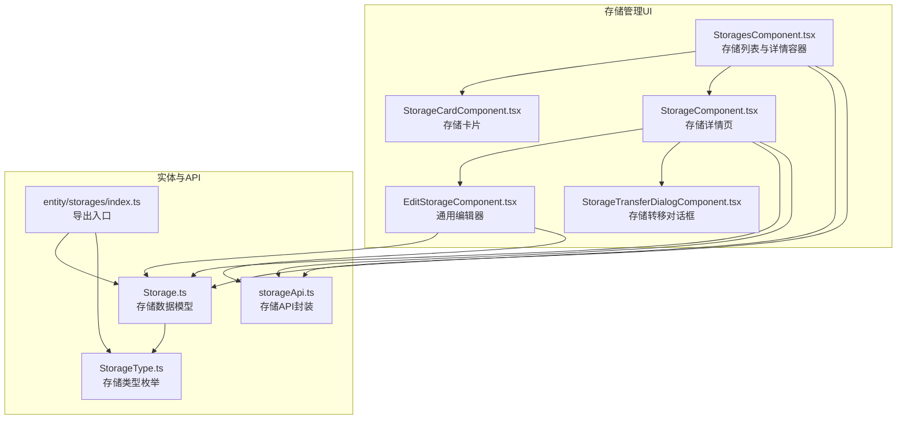
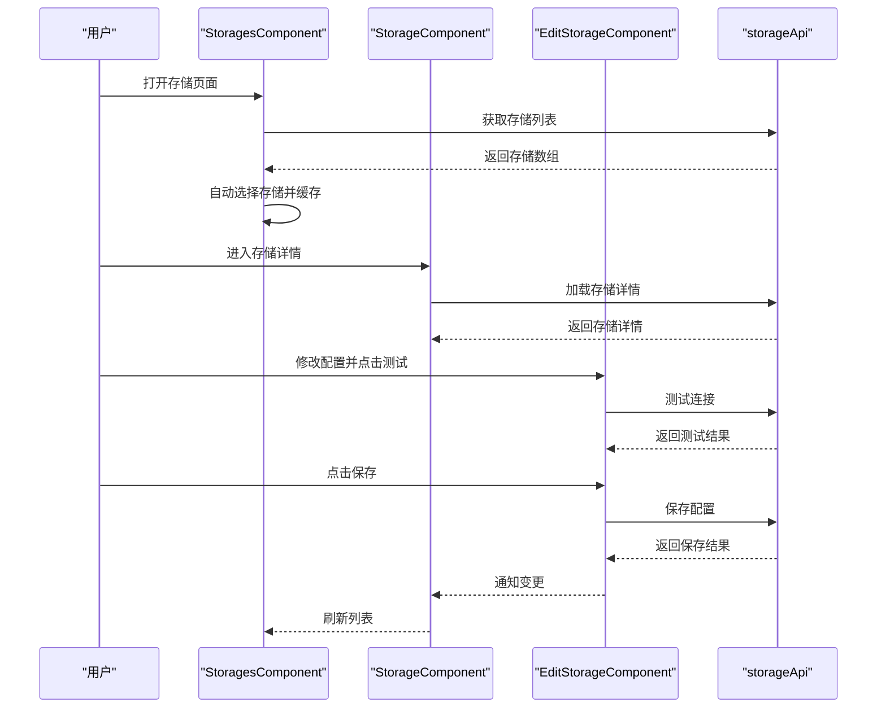
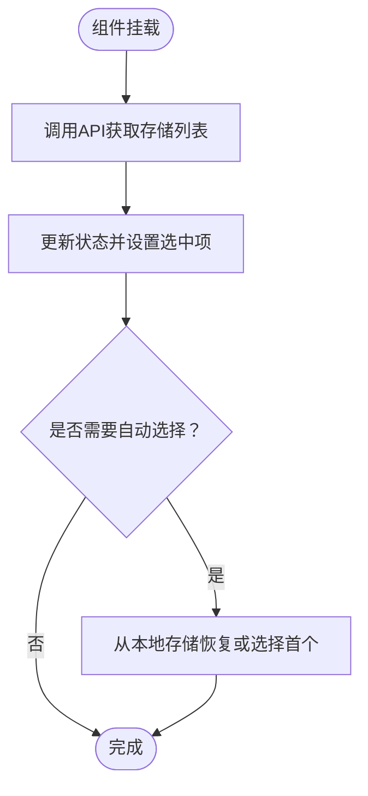
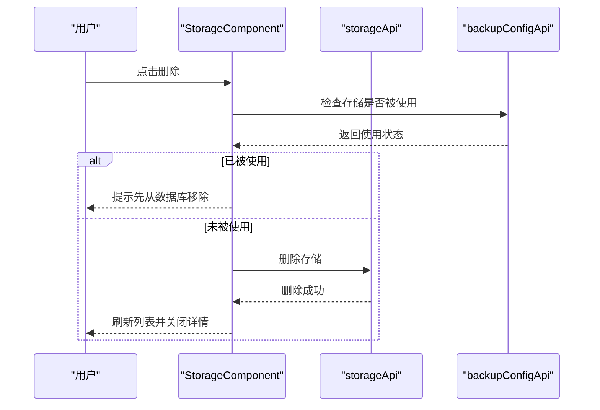
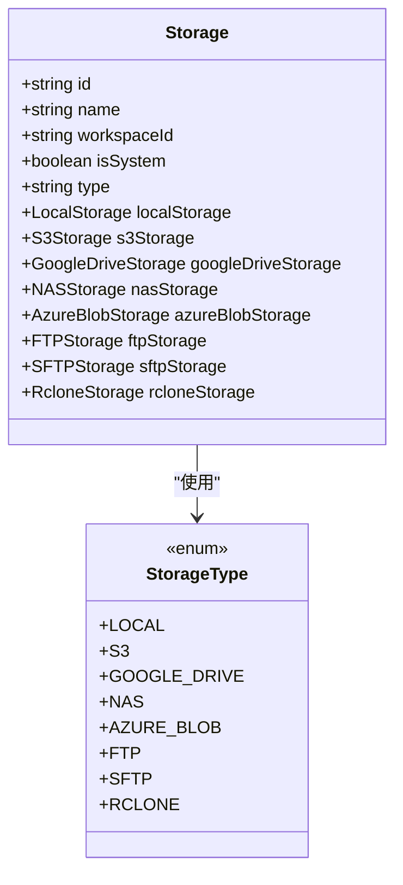
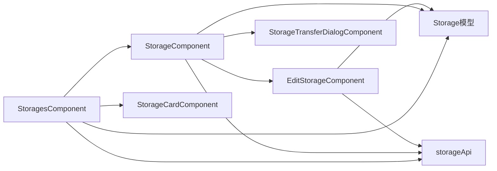

# 存储管理UI

<cite>
**本文档引用的文件**
- [StoragesComponent.tsx](file://frontend/src/features/storages/ui/StoragesComponent.tsx)
- [StorageCardComponent.tsx](file://frontend/src/features/storages/ui/StorageCardComponent.tsx)
- [StorageComponent.tsx](file://frontend/src/features/storages/ui/StorageComponent.tsx)
- [EditStorageComponent.tsx](file://frontend/src/features/storages/ui/edit/EditStorageComponent.tsx)
- [Storage.ts](file://frontend/src/entity/storages/models/Storage.ts)
- [StorageType.ts](file://frontend/src/entity/storages/models/StorageType.ts)
- [index.ts](file://frontend/src/entity/storages/index.ts)
- [storageApi.ts](file://frontend/src/entity/storages/api/storageApi.ts)
- [StorageTransferDialogComponent.tsx](file://frontend/src/features/storages/ui/StorageTransferDialogComponent.tsx)
</cite>

## 目录
1. [简介](#简介)
2. [项目结构](#项目结构)
3. [核心组件](#核心组件)
4. [架构总览](#架构总览)
5. [详细组件分析](#详细组件分析)
6. [依赖关系分析](#依赖关系分析)
7. [性能考虑](#性能考虑)
8. [故障排除指南](#故障排除指南)
9. [结论](#结论)
10. [附录](#附录)

## 简介
本设计文档聚焦于 Databasus 存储管理UI组件，系统性阐述存储列表展示、存储配置编辑、存储卡片组件与存储转移对话框的设计实现；深入解析各类存储类型的配置界面设计、连接测试功能与存储验证机制；覆盖存储类型特定的配置表单、凭据管理界面与存储状态监控展示；并提供存储测试连接、容量显示与使用情况统计的实现方案建议，以及存储迁移向导、批量配置与导入导出的界面设计思路，最终总结不同存储提供商的配置差异处理与统一用户体验设计原则。

## 项目结构
存储管理UI位于前端模块的 features/storages/ui 目录下，采用按功能域分层组织：
- 列表与详情容器：StoragesComponent、StorageComponent
- 展示与交互：StorageCardComponent
- 编辑与配置：EditStorageComponent 及其子组件（按存储类型）
- 数据模型与API：entity/storages 下的 models 与 api
- 转移对话框：StorageTransferDialogComponent

图表来源
- [StoragesComponent.tsx:1-215](file://frontend/src/features/storages/ui/StoragesComponent.tsx#L1-L215)
- [StorageComponent.tsx:1-333](file://frontend/src/features/storages/ui/StorageComponent.tsx#L1-L333)
- [StorageCardComponent.tsx:1-52](file://frontend/src/features/storages/ui/StorageCardComponent.tsx#L1-L52)
- [EditStorageComponent.tsx:1-568](file://frontend/src/features/storages/ui/edit/EditStorageComponent.tsx#L1-L568)
- [Storage.ts:1-29](file://frontend/src/entity/storages/models/Storage.ts#L1-L29)
- [StorageType.ts:1-11](file://frontend/src/entity/storages/models/StorageType.ts#L1-L11)
- [index.ts:1-15](file://frontend/src/entity/storages/index.ts#L1-L15)
- [storageApi.ts](file://frontend/src/entity/storages/api/storageApi.ts)

章节来源
- [StoragesComponent.tsx:1-215](file://frontend/src/features/storages/ui/StoragesComponent.tsx#L1-L215)
- [StorageComponent.tsx:1-333](file://frontend/src/features/storages/ui/StorageComponent.tsx#L1-L333)
- [StorageCardComponent.tsx:1-52](file://frontend/src/features/storages/ui/StorageCardComponent.tsx#L1-L52)
- [EditStorageComponent.tsx:1-568](file://frontend/src/features/storages/ui/edit/EditStorageComponent.tsx#L1-L568)
- [Storage.ts:1-29](file://frontend/src/entity/storages/models/Storage.ts#L1-L29)
- [StorageType.ts:1-11](file://frontend/src/entity/storages/models/StorageType.ts#L1-L11)
- [index.ts:1-15](file://frontend/src/entity/storages/index.ts#L1-L15)

## 核心组件
- 存储列表容器（StoragesComponent）：负责加载存储列表、移动端/桌面端布局切换、新增存储弹窗、自动选择逻辑与本地持久化。
- 存储详情容器（StorageComponent）：负责加载指定存储、名称编辑、设置编辑、连接测试、删除确认、存储转移对话框调用。
- 存储卡片（StorageCardComponent）：展示存储名称、类型、图标、错误状态与系统存储标识。
- 通用编辑器（EditStorageComponent）：根据存储类型渲染对应配置表单，支持连接测试、保存、系统存储开关等。
- 数据模型（Storage、StorageType）：统一描述存储实体与类型枚举，支撑多存储类型配置。
- API封装（storageApi）：提供获取、保存、测试连接、删除、转移等接口。

章节来源
- [StoragesComponent.tsx:24-215](file://frontend/src/features/storages/ui/StoragesComponent.tsx#L24-L215)
- [StorageComponent.tsx:30-333](file://frontend/src/features/storages/ui/StorageComponent.tsx#L30-L333)
- [StorageCardComponent.tsx:13-52](file://frontend/src/features/storages/ui/StorageCardComponent.tsx#L13-L52)
- [EditStorageComponent.tsx:37-568](file://frontend/src/features/storages/ui/edit/EditStorageComponent.tsx#L37-L568)
- [Storage.ts:11-29](file://frontend/src/entity/storages/models/Storage.ts#L11-L29)
- [StorageType.ts:1-11](file://frontend/src/entity/storages/models/StorageType.ts#L1-L11)
- [index.ts:1-15](file://frontend/src/entity/storages/index.ts#L1-L15)

## 架构总览
存储管理UI采用“容器组件 + 展示组件 + 模型/服务”的分层架构：
- 容器组件负责状态管理、路由与业务流程控制（StoragesComponent、StorageComponent）。
- 展示组件负责UI呈现与用户交互（StorageCardComponent、EditStorageComponent及其子组件）。
- 模型与API提供数据契约与后端交互能力（Storage、StorageType、storageApi）。

图表来源
- [StoragesComponent.tsx:46-75](file://frontend/src/features/storages/ui/StoragesComponent.tsx#L46-L75)
- [StorageComponent.tsx:126-134](file://frontend/src/features/storages/ui/StorageComponent.tsx#L126-L134)
- [EditStorageComponent.tsx:70-90](file://frontend/src/features/storages/ui/edit/EditStorageComponent.tsx#L70-L90)
- [storageApi.ts](file://frontend/src/entity/storages/api/storageApi.ts)

## 详细组件分析

### 存储列表容器（StoragesComponent）
职责与行为：
- 加载存储列表，支持静默加载与选择指定存储。
- 移动端与桌面端布局切换：移动端默认不展开详情，桌面端默认展开详情。
- 新增存储弹窗：弹出通用编辑器，保存成功后刷新列表并选中新建存储。
- 本地持久化：记录上次选中的存储ID，便于恢复会话。

关键流程图（加载与选择逻辑）：

图表来源
- [StoragesComponent.tsx:46-75](file://frontend/src/features/storages/ui/StoragesComponent.tsx#L46-L75)
- [StoragesComponent.tsx:57-67](file://frontend/src/features/storages/ui/StoragesComponent.tsx#L57-L67)

章节来源
- [StoragesComponent.tsx:24-215](file://frontend/src/features/storages/ui/StoragesComponent.tsx#L24-L215)

### 存储卡片组件（StorageCardComponent）
职责与行为：
- 渲染存储名称、类型与图标。
- 显示最近保存错误状态与系统存储标识。
- 支持点击选中并触发父级回调。

章节来源
- [StorageCardComponent.tsx:13-52](file://frontend/src/features/storages/ui/StorageCardComponent.tsx#L13-L52)

### 存储详情容器（StorageComponent）
职责与行为：
- 加载并展示存储详情，支持名称编辑与设置编辑。
- 提供连接测试按钮，测试通过可清除lastSaveError。
- 删除前校验是否被数据库备份配置使用，避免破坏性操作。
- 调用存储转移对话框进行跨工作区迁移。

序列图（删除流程）：

图表来源
- [StorageComponent.tsx:79-98](file://frontend/src/features/storages/ui/StorageComponent.tsx#L79-L98)

章节来源
- [StorageComponent.tsx:30-333](file://frontend/src/features/storages/ui/StorageComponent.tsx#L30-L333)

### 通用编辑器（EditStorageComponent）
职责与行为：
- 根据存储类型动态渲染对应配置表单（S3、Google Drive、NAS、Azure Blob、FTP、SFTP、Rclone、Local）。
- 统一的连接测试与保存流程：测试通过后允许保存；保存成功后通知上层刷新。
- 系统存储开关（仅管理员可见且不可逆）。
- 不同部署模式下的可用类型过滤（云版默认启用S3，自托管默认启用Local）。

类图（存储类型与配置关系）：

图表来源
- [Storage.ts:11-29](file://frontend/src/entity/storages/models/Storage.ts#L11-L29)
- [StorageType.ts:1-11](file://frontend/src/entity/storages/models/StorageType.ts#L1-L11)

章节来源
- [EditStorageComponent.tsx:37-568](file://frontend/src/features/storages/ui/edit/EditStorageComponent.tsx#L37-L568)
- [Storage.ts:1-29](file://frontend/src/entity/storages/models/Storage.ts#L1-L29)
- [StorageType.ts:1-11](file://frontend/src/entity/storages/models/StorageType.ts#L1-L11)

### 存储转移对话框（StorageTransferDialogComponent）
职责与行为：
- 提供跨工作区的存储转移流程，包括目标工作区选择、确认与执行。
- 转移完成后通知父级刷新列表并关闭对话框。

章节来源
- [StorageTransferDialogComponent.tsx](file://frontend/src/features/storages/ui/StorageTransferDialogComponent.tsx)

### 存储类型特定配置表单
- S3：桶名、区域、访问密钥、私有密钥、端点（可选）。
- Google Drive：客户端ID、客户端密钥、令牌JSON（OAuth凭据）。
- NAS：主机、端口、共享名、用户名、密码、域名、路径、SSL开关。
- Azure Blob：认证方式（连接字符串/账户密钥）、连接字符串或账户名+密钥、容器名、端点、前缀。
- FTP：主机、端口、用户名、密码、SSL开关、路径。
- SFTP：主机、端口、用户名、密码或私钥、路径。
- Rclone：配置内容、远端路径。
- Local：无额外字段（最小化配置）。

章节来源
- [EditStorageComponent.tsx:92-185](file://frontend/src/features/storages/ui/edit/EditStorageComponent.tsx#L92-L185)

### 凭据管理界面
- EditStorageComponent 提供统一的凭据输入与测试连接入口，确保凭据安全与可用性。
- 对于OAuth类（如Google Drive），需在外部完成授权后回填令牌JSON。
- 对于密钥类（如S3、Azure Blob、SFTP），支持敏感信息输入与最小化暴露。

章节来源
- [EditStorageComponent.tsx:70-90](file://frontend/src/features/storages/ui/edit/EditStorageComponent.tsx#L70-L90)
- [EditStorageComponent.tsx:117-122](file://frontend/src/features/storages/ui/edit/EditStorageComponent.tsx#L117-L122)

### 存储状态监控展示
- StorageCardComponent 展示最近保存错误状态，便于快速定位问题。
- StorageComponent 在详情页顶部展示lastSaveError，并提供测试连接按钮以清除错误状态。

章节来源
- [StorageCardComponent.tsx:37-42](file://frontend/src/features/storages/ui/StorageCardComponent.tsx#L37-L42)
- [StorageComponent.tsx:207-228](file://frontend/src/features/storages/ui/StorageComponent.tsx#L207-L228)

### 存储测试连接与验证机制
- EditStorageComponent：提供“测试连接”按钮，调用后端直连测试接口，成功后允许保存。
- StorageComponent：提供“测试连接”按钮，调用后端存储测试接口，成功后清除lastSaveError。
- 验证规则：根据不同存储类型对必填字段进行校验，确保配置完整性。

章节来源
- [EditStorageComponent.tsx:70-90](file://frontend/src/features/storages/ui/edit/EditStorageComponent.tsx#L70-L90)
- [StorageComponent.tsx:54-77](file://frontend/src/features/storages/ui/StorageComponent.tsx#L54-L77)
- [EditStorageComponent.tsx:213-326](file://frontend/src/features/storages/ui/edit/EditStorageComponent.tsx#L213-L326)

### 容量显示与使用情况统计
- 建议在存储详情页增加“容量概览”区域，展示已用空间、剩余空间与保留策略。
- 使用情况统计可通过后端返回的备份元数据聚合计算，UI以图表或数值形式呈现。
- 该部分为实现建议，当前仓库未包含具体实现代码。

### 存储迁移向导、批量配置与导入导出
- 迁移向导：StorageTransferDialogComponent 提供跨工作区迁移流程，建议扩展为多步骤向导（预检查、备份迁移、验证、清理）。
- 批量配置：建议在列表页增加批量选择与统一编辑入口，减少重复配置工作量。
- 导入导出：建议提供模板下载与批量导入功能，支持CSV/JSON格式，便于运维场景快速部署。

### 不同存储提供商的配置差异处理与统一体验
- 通过 EditStorageComponent 的类型分支渲染，屏蔽底层差异，统一表单风格与交互。
- 对于OAuth类存储，提供“授权”按钮与令牌回填流程，简化用户操作。
- 对于密钥类存储，提供“显示/隐藏”敏感字段与“生成随机值”等便捷功能。
- 统一的系统存储开关与权限控制，确保管理员与普通用户的差异化体验。

## 依赖关系分析
- 组件间依赖：StoragesComponent -> StorageCardComponent、StorageComponent；StorageComponent -> EditStorageComponent、StorageTransferDialogComponent。
- 模型依赖：Storage 引入所有存储类型的具体配置模型；StorageType 提供类型枚举。
- API依赖：各组件通过 storageApi 与后端交互，保证数据一致性与错误处理。

图表来源
- [StoragesComponent.tsx:11-13](file://frontend/src/features/storages/ui/StoragesComponent.tsx#L11-L13)
- [StorageComponent.tsx:17-19](file://frontend/src/features/storages/ui/StorageComponent.tsx#L17-L19)
- [EditStorageComponent.tsx:14-21](file://frontend/src/features/storages/ui/edit/EditStorageComponent.tsx#L14-L21)
- [Storage.ts:1-29](file://frontend/src/entity/storages/models/Storage.ts#L1-L29)
- [storageApi.ts](file://frontend/src/entity/storages/api/storageApi.ts)

章节来源
- [index.ts:1-15](file://frontend/src/entity/storages/index.ts#L1-L15)

## 性能考虑
- 列表懒加载与本地缓存：StoragesComponent 已实现本地存储选中项，减少重复请求。
- 条件渲染：EditStorageComponent 仅渲染当前类型配置，降低DOM复杂度。
- 错误与加载状态：通过局部状态控制加载与错误提示，避免全屏重绘。
- 移动端优化：移动端默认不展开详情，提升首屏性能与交互效率。

## 故障排除指南
- 连接测试失败：检查凭据完整性与网络可达性；查看lastSaveError提示并重新测试。
- 删除失败：若提示被使用，需先从数据库备份配置中移除该存储。
- 保存未生效：确保测试连接成功后再保存；检查必填字段是否完整。
- 系统存储权限：非管理员无法修改系统存储属性。

章节来源
- [StorageComponent.tsx:79-98](file://frontend/src/features/storages/ui/StorageComponent.tsx#L79-L98)
- [EditStorageComponent.tsx:213-326](file://frontend/src/features/storages/ui/edit/EditStorageComponent.tsx#L213-L326)

## 结论
Databasus 存储管理UI通过清晰的容器-展示分层、统一的数据模型与API封装，实现了多存储类型的配置管理与一致的用户体验。编辑器按类型动态渲染、连接测试与保存流程标准化、错误状态可视化与权限控制完善，满足从个人到企业级的多样化需求。后续可在容量统计、迁移向导、批量配置与导入导出方面进一步增强，以提升运维效率与易用性。

## 附录
- API接口建议：在 storageApi 中补充“获取存储容量”、“批量更新配置”、“导出/导入配置”等方法，配合UI组件实现更完整的功能闭环。
- 设计规范：保持表单字段对齐、提示文案一致、错误高亮与成功反馈明确，确保跨存储类型的统一体验。