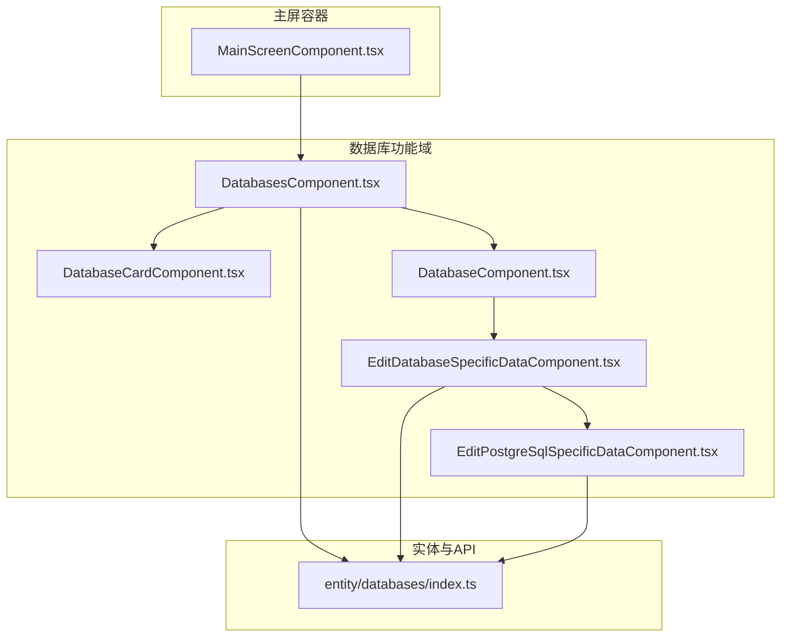
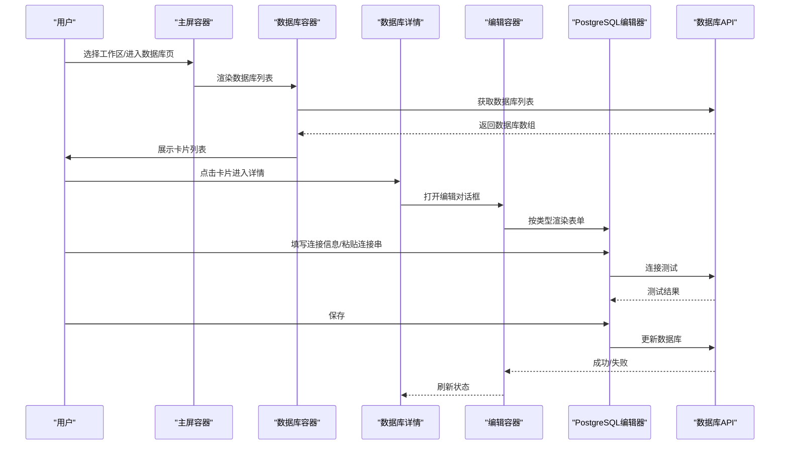
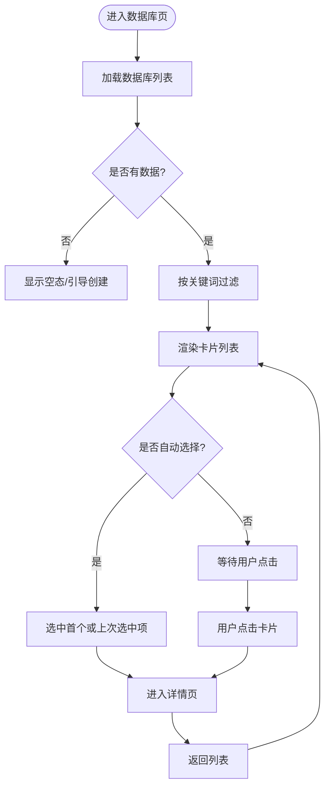
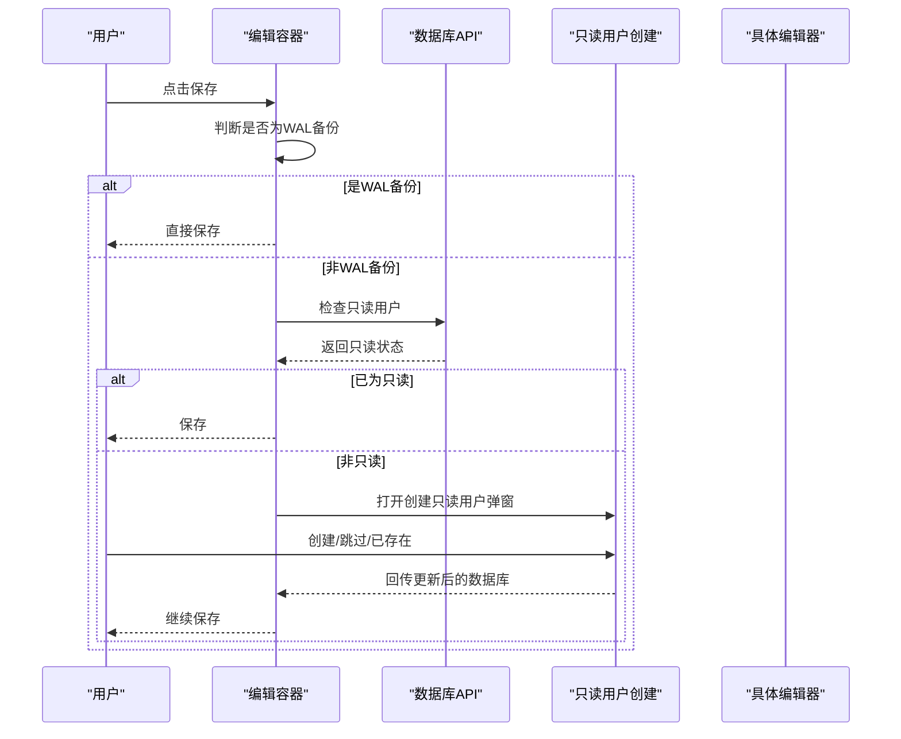
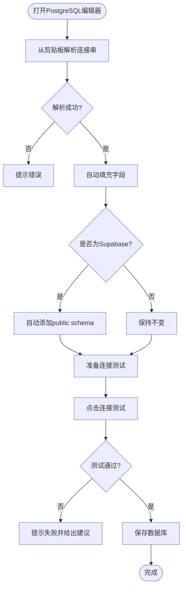
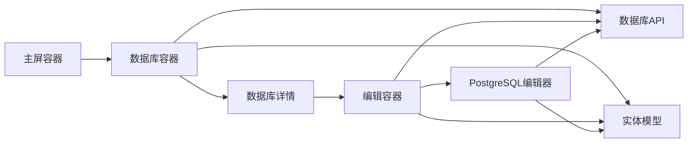

# 数据库管理UI

<cite>
**本文引用的文件**
- [MainScreenComponent.tsx](file://frontend/src/widgets/main/MainScreenComponent.tsx)
- [DatabasesComponent.tsx](file://frontend/src/features/databases/ui/DatabasesComponent.tsx)
- [EditDatabaseSpecificDataComponent.tsx](file://frontend/src/features/databases/ui/edit/EditDatabaseSpecificDataComponent.tsx)
- [EditPostgreSqlSpecificDataComponent.tsx](file://frontend/src/features/databases/ui/edit/EditPostgreSqlSpecificDataComponentComponent.tsx)
- [index.ts](file://frontend/src/entity/databases/index.ts)
</cite>

## 目录
1. [简介](#简介)
2. [项目结构](#项目结构)
3. [核心组件](#核心组件)
4. [架构总览](#架构总览)
5. [组件详解](#组件详解)
6. [依赖关系分析](#依赖关系分析)
7. [性能考量](#性能考量)
8. [故障排查指南](#故障排查指南)
9. [结论](#结论)
10. [附录](#附录)

## 简介
本设计文档聚焦于Databasus数据库管理UI组件，系统性梳理数据库列表展示、创建与编辑流程、详情页交互、只读用户管理以及连接字符串解析器等关键能力。文档从架构视角解释组件间数据流与状态同步机制，并给出响应式布局与用户体验优化策略，帮助开发者与产品人员快速理解并扩展数据库管理界面。

## 项目结构
数据库管理UI位于前端工程的features/databases/ui路径下，采用按功能域分层组织：页面容器组件负责状态与路由切换，业务组件负责具体交互（如数据库卡片、创建/编辑表单），实体层提供类型定义与API封装。

图示来源
- [MainScreenComponent.tsx](file://frontend/src/widgets/main/MainScreenComponent.tsx)
- [DatabasesComponent.tsx](file://frontend/src/features/databases/ui/DatabasesComponent.tsx)
- [EditDatabaseSpecificDataComponent.tsx](file://frontend/src/features/databases/ui/edit/EditDatabaseSpecificDataComponent.tsx)
- [EditPostgreSqlSpecificDataComponent.tsx](file://frontend/src/features/databases/ui/edit/EditPostgreSqlSpecificDataComponent.tsx)
- [index.ts](file://frontend/src/entity/databases/index.ts)

章节来源
- [MainScreenComponent.tsx](file://frontend/src/widgets/main/MainScreenComponent.tsx)
- [DatabasesComponent.tsx](file://frontend/src/features/databases/ui/DatabasesComponent.tsx)
- [index.ts](file://frontend/src/entity/databases/index.ts)

## 核心组件
- 主屏容器：负责工作区选择、侧边栏导航、标签页切换与全局加载状态管理。
- 数据库容器：负责数据库列表加载、筛选、自动选择、详情页切换与弹窗创建数据库。
- 编辑容器：根据数据库类型动态渲染对应表单，支持连接测试、保存、只读用户创建流程。
- PostgreSQL专用编辑器：提供连接字符串解析、自动补全公共schema、连接测试、备份类型选择与高级设置。
- 实体索引：统一导出数据库模型、枚举与API，便于上层组件引用。

章节来源
- [MainScreenComponent.tsx](file://frontend/src/widgets/main/MainScreenComponent.tsx)
- [DatabasesComponent.tsx](file://frontend/src/features/databases/ui/DatabasesComponent.tsx)
- [EditDatabaseSpecificDataComponent.tsx](file://frontend/src/features/databases/ui/edit/EditDatabaseSpecificDataComponent.tsx)
- [EditPostgreSqlSpecificDataComponent.tsx](file://frontend/src/features/databases/ui/edit/EditPostgreSqlSpecificDataComponent.tsx)
- [index.ts](file://frontend/src/entity/databases/index.ts)

## 架构总览
数据库管理UI采用“容器-组件”分层设计：
- 容器组件（MainScreenComponent、DatabasesComponent）负责状态管理、副作用与跨组件协调。
- 业务组件（DatabaseCard、Database、Edit*）专注单一职责，通过props与回调进行解耦。
- 实体层（entity/databases）提供类型与API，屏蔽后端细节。

图示来源
- [MainScreenComponent.tsx](file://frontend/src/widgets/main/MainScreenComponent.tsx)
- [DatabasesComponent.tsx](file://frontend/src/features/databases/ui/DatabasesComponent.tsx)
- [EditDatabaseSpecificDataComponent.tsx](file://frontend/src/features/databases/ui/edit/EditDatabaseSpecificDataComponent.tsx)
- [EditPostgreSqlSpecificDataComponent.tsx](file://frontend/src/features/databases/ui/edit/EditPostgreSqlSpecificDataComponent.tsx)

## 组件详解

### 数据库列表与详情容器（DatabasesComponent）
- 职责
  - 加载数据库列表，支持本地缓存与定时刷新。
  - 支持搜索过滤，移动端与桌面端不同展示策略。
  - 自动选择逻辑：桌面端默认选中首个或上次选中项；移动端优先显示列表。
  - 弹窗创建数据库，创建成功后刷新列表并选中新建项。
- 关键状态
  - databases：数据库数组。
  - searchQuery：搜索关键词。
  - selectedDatabaseId：当前选中数据库ID，持久化到localStorage。
  - isShowAddDatabase：创建弹窗开关。
- 数据流
  - 通过databaseApi获取数据，更新本地状态。
  - 通过onDatabaseChanged/onDatabaseDeleted回调通知父级刷新。
- 错误处理
  - 请求异常时弹出错误提示，避免阻塞UI。

图示来源
- [DatabasesComponent.tsx](file://frontend/src/features/databases/ui/DatabasesComponent.tsx)

章节来源
- [DatabasesComponent.tsx](file://frontend/src/features/databases/ui/DatabasesComponent.tsx)

### 编辑容器与数据库类型适配（EditDatabaseSpecificDataComponent）
- 职责
  - 根据数据库类型动态渲染对应编辑器（PostgreSQL、MySQL、MariaDB、MongoDB）。
  - 在保存前进行只读用户检查，必要时弹出创建只读用户对话框。
  - 支持直接保存或调用API保存两种模式。
- 关键流程
  - 保存前判断是否为WAL备份（PostgreSQL），若是则跳过只读检查。
  - 非WAL模式下调用API检查只读状态，若非只读则弹出只读用户创建流程。
  - 创建完成后回传更新后的数据库对象，继续保存。
- 状态与回调
  - editingDatabase：当前编辑副本。
  - isShowReadOnlyDialog：只读用户创建弹窗开关。
  - onSaved：保存完成回调，用于上层刷新。

图示来源
- [EditDatabaseSpecificDataComponent.tsx](file://frontend/src/features/databases/ui/edit/EditDatabaseSpecificDataComponent.tsx)

章节来源
- [EditDatabaseSpecificDataComponent.tsx](file://frontend/src/features/databases/ui/edit/EditDatabaseSpecificDataComponent.tsx)

### PostgreSQL专用编辑器（EditPostgreSqlSpecificDataComponent）
- 职责
  - 提供PostgreSQL连接参数输入与校验。
  - 支持从剪贴板解析连接字符串，自动填充字段并智能补全公共schema。
  - 提供连接测试、保存、备份类型选择（pg_dump/WAL）与高级设置。
- 关键特性
  - 连接字符串解析：使用ConnectionStringParser，支持host/port/username/password/database/isHttps等字段提取。
  - 自动补全：针对Supabase场景自动添加public schema。
  - 连接测试：调用后端直连测试接口，反馈测试结果。
  - 备份类型：远程备份（pg_dump）与代理增量备份（WAL）两种模式。
  - 高级设置：包括模式包含、扩展排除等。
- 表单验证与动态字段
  - 表单字段完整性校验（主机、端口、用户名、密码、数据库名）。
  - 根据备份类型切换表单内容（WAL模式仅保存不测试）。
  - 高级面板可折叠，按需展开。

图示来源
- [EditPostgreSqlSpecificDataComponent.tsx](file://frontend/src/features/databases/ui/edit/EditPostgreSqlSpecificDataComponent.tsx)

章节来源
- [EditPostgreSqlSpecificDataComponent.tsx](file://frontend/src/features/databases/ui/edit/EditPostgreSqlSpecificDataComponent.tsx)

### 数据模型与API导出（entity/databases/index.ts）
- 职责
  - 统一导出数据库模型、类型枚举、Logo映射、备份类型与版本等。
  - 导出数据库API，供上层组件调用。
- 作用
  - 降低上层组件对内部实现的耦合，集中管理类型与API入口。

章节来源
- [index.ts](file://frontend/src/entity/databases/index.ts)

## 依赖关系分析
- 组件耦合
  - MainScreenComponent作为顶层容器，向下注入workspace、user、isCanManageDBs等上下文。
  - DatabasesComponent依赖databaseApi与entity/databases模型，负责列表与详情的切换。
  - EditDatabaseSpecificDataComponent根据类型委派至具体编辑器，形成多态渲染。
- 外部依赖
  - 后端数据库API：提供列表、连接测试、更新等能力。
  - 剪贴板与Toast工具：提升连接串输入体验与反馈。
- 循环依赖
  - 当前结构清晰，容器与业务组件分离，未见循环依赖迹象。

图示来源
- [MainScreenComponent.tsx](file://frontend/src/widgets/main/MainScreenComponent.tsx)
- [DatabasesComponent.tsx](file://frontend/src/features/databases/ui/DatabasesComponent.tsx)
- [EditDatabaseSpecificDataComponent.tsx](file://frontend/src/features/databases/ui/edit/EditDatabaseSpecificDataComponent.tsx)
- [EditPostgreSqlSpecificDataComponent.tsx](file://frontend/src/features/databases/ui/edit/EditPostgreSqlSpecificDataComponent.tsx)
- [index.ts](file://frontend/src/entity/databases/index.ts)

章节来源
- [MainScreenComponent.tsx](file://frontend/src/widgets/main/MainScreenComponent.tsx)
- [DatabasesComponent.tsx](file://frontend/src/features/databases/ui/DatabasesComponent.tsx)
- [EditDatabaseSpecificDataComponent.tsx](file://frontend/src/features/databases/ui/edit/EditDatabaseSpecificDataComponent.tsx)
- [EditPostgreSqlSpecificDataComponent.tsx](file://frontend/src/features/databases/ui/edit/EditPostgreSqlSpecificDataComponent.tsx)
- [index.ts](file://frontend/src/entity/databases/index.ts)

## 性能考量
- 列表刷新策略
  - 首次加载阻塞UI，后续采用静默轮询（每5分钟）以减少闪烁与请求压力。
- 本地存储
  - 使用localStorage缓存选中数据库ID，避免频繁网络请求与状态丢失。
- 表单交互
  - 连接测试与保存过程禁用相关按钮，防止重复提交。
  - 高级设置面板按需展开，减少DOM渲染负担。
- 移动端体验
  - 列表优先展示，详情页通过返回按钮切换，降低内存占用与重绘成本。

## 故障排查指南
- 连接测试失败
  - 检查IP白名单与网络可达性；查看失败提示与浏览器权限（剪贴板访问）。
  - 对于Supabase场景，确认是否已自动添加public schema。
- 只读用户创建
  - 若提示需要创建只读用户，请先完成创建流程再保存。
  - 如用户已存在，可选择跳过或继续。
- 列表不刷新
  - 确认轮询是否生效；手动刷新页面或等待下次轮询。
- 剪贴板解析失败
  - 确认剪贴板内容格式正确；若浏览器不支持剪贴板API，使用弹窗输入方式。

章节来源
- [EditPostgreSqlSpecificDataComponent.tsx](file://frontend/src/features/databases/ui/edit/EditPostgreSqlSpecificDataComponent.tsx)
- [EditDatabaseSpecificDataComponent.tsx](file://frontend/src/features/databases/ui/edit/EditDatabaseSpecificDataComponent.tsx)
- [DatabasesComponent.tsx](file://frontend/src/features/databases/ui/DatabasesComponent.tsx)

## 结论
该数据库管理UI以清晰的容器-组件分层实现了数据库列表、创建、编辑与详情的完整闭环。通过类型适配与只读用户流程保障了不同数据库类型的可用性与安全性；连接字符串解析器与连接测试提升了配置效率与可靠性。整体设计兼顾响应式体验与性能优化，适合进一步扩展批量操作、导入导出与配置向导等功能。

## 附录
- 响应式设计要点
  - 移动端优先列表展示，详情页通过返回按钮切换；桌面端左右分栏布局。
  - 输入控件尺寸与间距适配小屏设备，避免拥挤。
- 用户体验优化
  - 自动补全公共schema、连接测试即时反馈、剪贴板解析一键填充。
  - 高级设置折叠显示，降低初始复杂度。
- 扩展建议
  - 批量操作：在列表页增加多选与批量删除/启用/禁用。
  - 导入导出：提供数据库配置的导入模板与导出清单。
  - 配置向导：为首次配置提供步骤化引导，结合连接测试与权限检查。