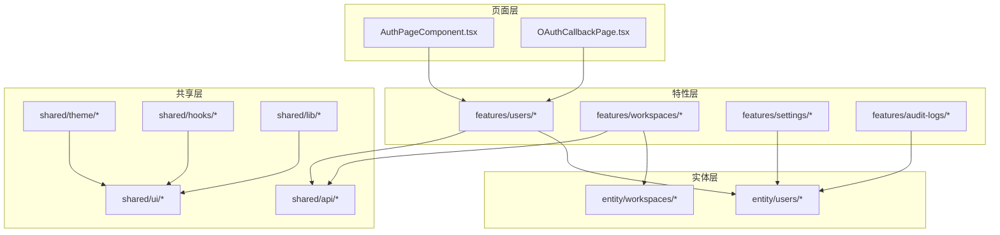
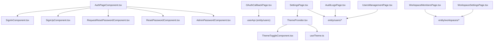
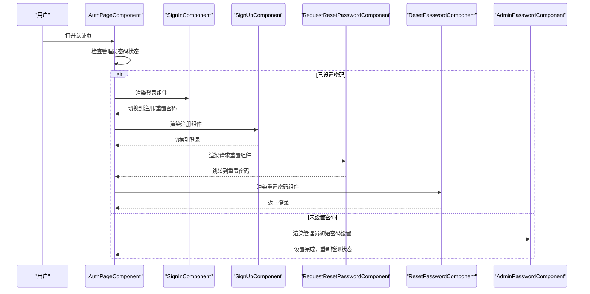
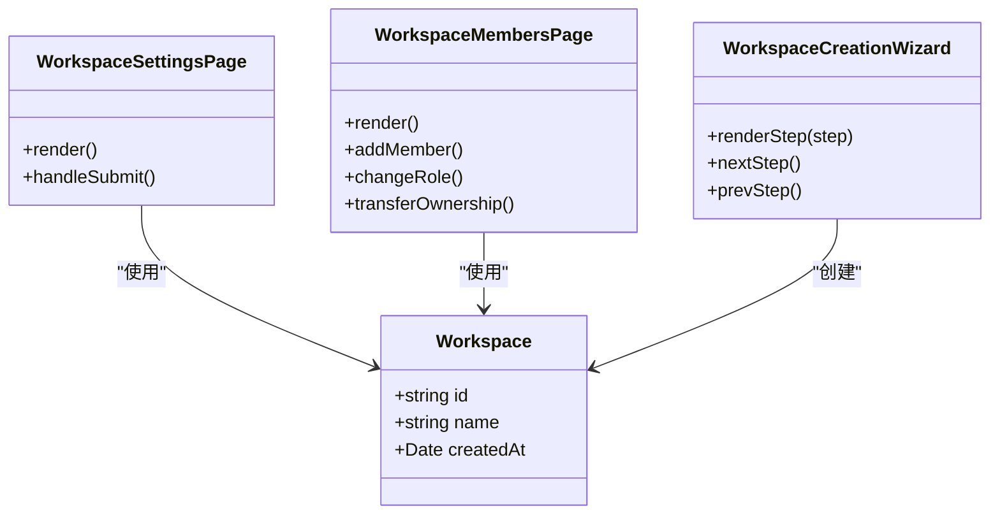
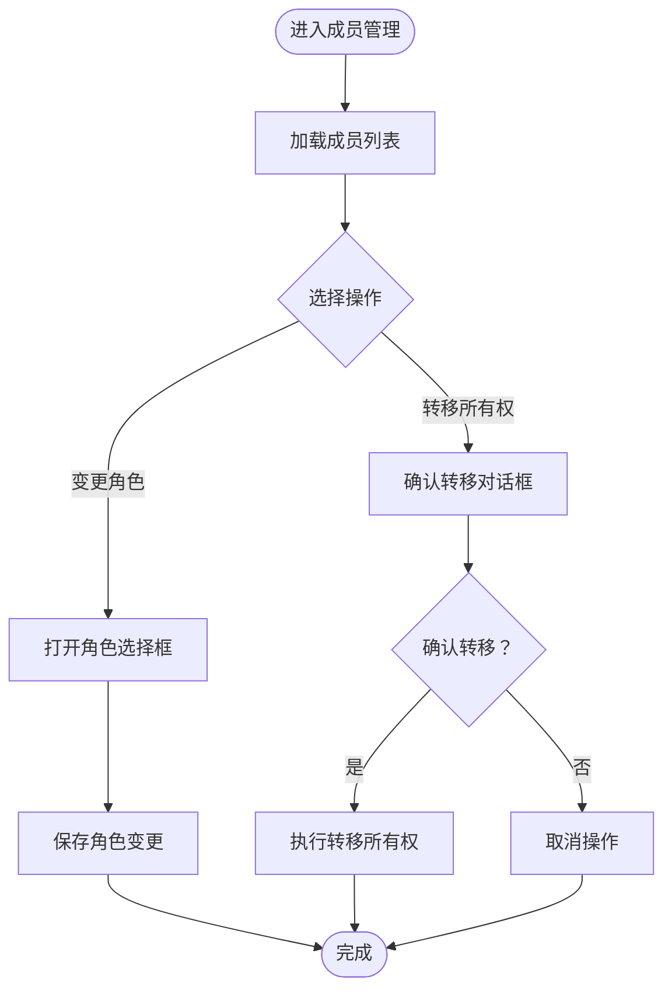
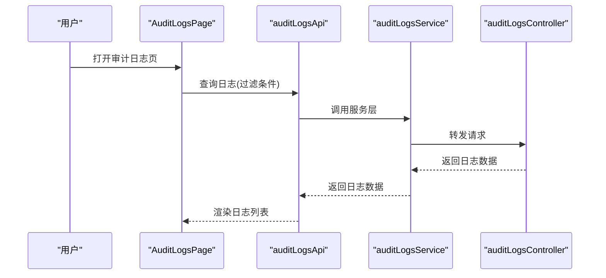
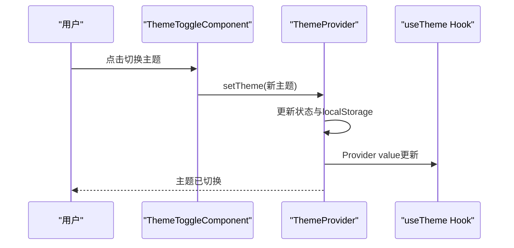
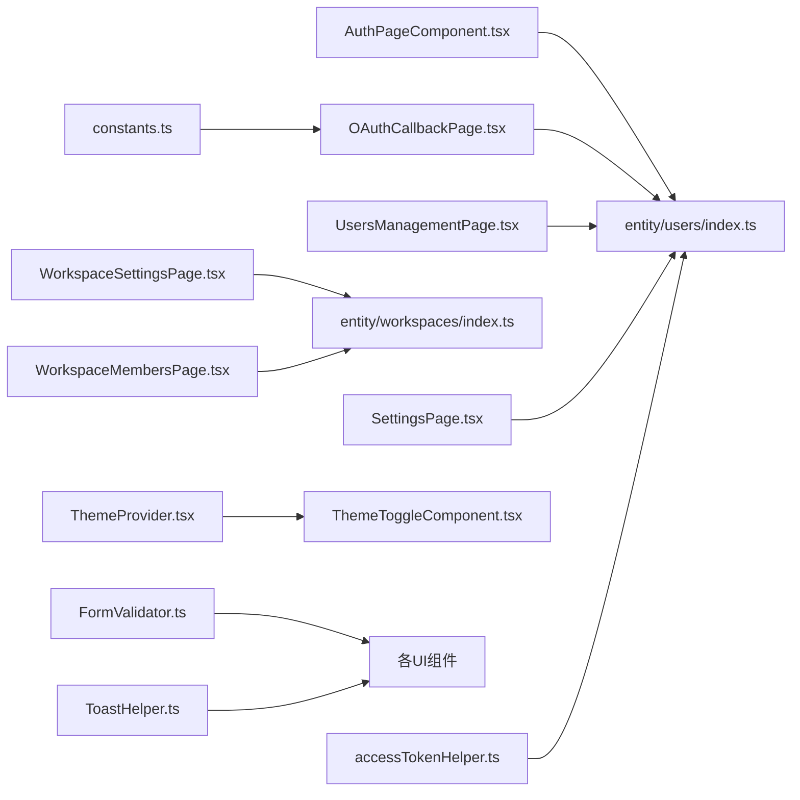

# 用户和工作空间UI

<cite>
**本文引用的文件**
- [AuthPageComponent.tsx](file://frontend/src/pages/AuthPageComponent.tsx)
- [OAuthCallbackPage.tsx](file://frontend/src/pages/OAuthCallbackPage.tsx)
- [ThemeProvider.tsx](file://frontend/src/shared/theme/ThemeProvider.tsx)
- [useTheme.ts](file://frontend/src/shared/theme/useTheme.ts)
- [users/index.ts](file://frontend/src/entity/users/index.ts)
- [workspaces/index.ts](file://frontend/src/entity/workspaces/index.ts)
- [workspace.ts](file://frontend/src/entity/workspaces/model/workspace.ts)
- [constants.ts](file://frontend/src/constants.ts)
- [accessTokenHelper.ts](file://frontend/src/shared/api/accessTokenHelper.ts)
- [FormValidator.ts](file://frontend/src/shared/lib/FormValidator.ts)
- [ToastHelper.ts](file://frontend/src/shared/toast/ToastHelper.ts)
- [MainScreenComponent.tsx](file://frontend/src/widgets/main/MainScreenComponent.tsx)
- [SidebarComponent.tsx](file://frontend/src/widgets/main/SidebarComponent.tsx)
- [WorkspaceSelectionComponent.tsx](file://frontend/src/widgets/main/WorkspaceSelectionComponent.tsx)
- [AuditLogsPage.tsx](file://frontend/src/features/audit-logs/ui/AuditLogsPage.tsx)
- [BackupsPage.tsx](file://frontend/src/features/backups/ui/BackupsPage.tsx)
- [BillingPage.tsx](file://frontend/src/features/billing/ui/BillingPage.tsx)
- [DatabasesPage.tsx](file://frontend/src/features/databases/ui/DatabasesPage.tsx)
- [HealthcheckPage.tsx](file://frontend/src/features/healthcheck/ui/HealthcheckPage.tsx)
- [NotifiersPage.tsx](file://frontend/src/features/notifiers/ui/NotifiersPage.tsx)
- [RestoresPage.tsx](file://frontend/src/features/restores/ui/RestoresPage.tsx)
- [SettingsPage.tsx](file://frontend/src/features/settings/ui/SettingsPage.tsx)
- [StoragesPage.tsx](file://frontend/src/features/storages/ui/StoragesPage.tsx)
- [UsersManagementPage.tsx](file://frontend/src/features/users/ui/UsersManagementPage.tsx)
- [WorkspaceSettingsPage.tsx](file://frontend/src/features/workspaces/ui/WorkspaceSettingsPage.tsx)
- [WorkspaceMembersPage.tsx](file://frontend/src/features/workspaces/ui/WorkspaceMembersPage.tsx)
- [WorkspaceCreationWizard.tsx](file://frontend/src/features/workspaces/ui/WorkspaceCreationWizard.tsx)
- [SignInComponent.tsx](file://frontend/src/features/users/ui/SignInComponent.tsx)
- [SignUpComponent.tsx](file://frontend/src/features/users/ui/SignUpComponent.tsx)
- [RequestResetPasswordComponent.tsx](file://frontend/src/features/users/ui/RequestResetPasswordComponent.tsx)
- [ResetPasswordComponent.tsx](file://frontend/src/features/users/ui/ResetPasswordComponent.tsx)
- [AdminPasswordComponent.tsx](file://frontend/src/features/users/ui/AdminPasswordComponent.tsx)
- [OAuthIntegrationPage.tsx](file://frontend/src/features/users/ui/OAuthIntegrationPage.tsx)
- [TwoFactorAuthPage.tsx](file://frontend/src/features/users/ui/TwoFactorAuthPage.tsx)
- [UserPreferencesPage.tsx](file://frontend/src/features/users/ui/UserPreferencesPage.tsx)
- [ThemeToggleComponent.tsx](file://frontend/src/shared/ui/ThemeToggleComponent.tsx)
- [ConfirmationComponent.tsx](file://frontend/src/shared/ui/ConfirmationComponent.tsx)
- [ClipboardPasteModalComponent.tsx](file://frontend/src/shared/ui/ClipboardPasteModalComponent.tsx)
- [CloudflareTurnstileWidget.tsx](file://frontend/src/shared/ui/CloudflareTurnstileWidget.tsx)
- [useCloudflareTurnstile.ts](file://frontend/src/shared/hooks/useCloudflareTurnstile.ts)
- [useIsMobile.tsx](file://frontend/src/shared/hooks/useIsMobile.tsx)
- [useScreenHeight.tsx](file://frontend/src/shared/hooks/useScreenHeight.tsx)
- [RateLimiter.ts](file://frontend/src/shared/api/RateLimiter.ts)
- [RequestOptions.ts](file://frontend/src/shared/api/RequestOptions.ts)
- [apiHelper.ts](file://frontend/src/shared/api/apiHelper.ts)
- [how-extrnal-oauth-works.md](file://docs/how-extrnal-oauth-works.md)
- [backend users controllers](file://backend/internal/features/users/controllers/)
- [backend workspaces controllers](file://backend/internal/features/workspaces/controllers/)
- [backend audit logs controller](file://backend/internal/features/audit_logs/controller.go)
- [backend users services](file://backend/internal/features/users/services/)
- [backend workspaces services](file://backend/internal/features/workspaces/services/)
- [backend audit logs service](file://backend/internal/features/audit_logs/service.go)
</cite>

## 目录
1. [简介](#简介)
2. [项目结构](#项目结构)
3. [核心组件](#核心组件)
4. [架构总览](#架构总览)
5. [详细组件分析](#详细组件分析)
6. [依赖关系分析](#依赖关系分析)
7. [性能考虑](#性能考虑)
8. [故障排除指南](#故障排除指南)
9. [结论](#结论)
10. [附录](#附录)

## 简介
本设计文档聚焦于Databasus的用户与工作空间UI组件，系统性梳理并解释以下关键界面与交互：用户管理界面、个人资料设置、用户认证界面（含OAuth与密码重置）、工作空间管理界面（含成员管理与角色权限）。文档同时覆盖用户偏好设置（主题、语言、通知）的界面设计、用户体验优化策略（表单验证、错误处理），以及工作空间创建向导、成员角色分配、权限继承机制与审计日志查看的实现方案。

## 项目结构
前端采用按功能域分层的组织方式：
- pages：页面级容器组件，负责路由与页面布局
- features：业务特性模块，包含用户、工作空间、备份、存储等特性
- entity：领域模型与API封装，提供类型定义与数据访问接口
- shared：共享工具库（主题、表单验证、Toast、Hooks等）
- widgets：主屏组件（侧边栏、主屏幕、工作空间选择器）

图表来源
- [AuthPageComponent.tsx:1-115](file://frontend/src/pages/AuthPageComponent.tsx#L1-L115)
- [OAuthCallbackPage.tsx:1-77](file://frontend/src/pages/OAuthCallbackPage.tsx#L1-L77)
- [users/index.ts:1-25](file://frontend/src/entity/users/index.ts#L1-L25)
- [workspaces/index.ts:1-18](file://frontend/src/entity/workspaces/index.ts#L1-L18)

章节来源
- [AuthPageComponent.tsx:1-115](file://frontend/src/pages/AuthPageComponent.tsx#L1-L115)
- [OAuthCallbackPage.tsx:1-77](file://frontend/src/pages/OAuthCallbackPage.tsx#L1-L77)
- [users/index.ts:1-25](file://frontend/src/entity/users/index.ts#L1-L25)
- [workspaces/index.ts:1-18](file://frontend/src/entity/workspaces/index.ts#L1-L18)

## 核心组件
本节概述与用户、工作空间直接相关的UI组件职责与协作关系：

- 认证页面容器：根据管理员是否已设置密码动态切换注册/登录、请求重置码、重置密码或管理员初始密码设置流程，并提供加载状态与屏幕高度适配。
- OAuth回调页：接收授权码与state参数，调用后端完成第三方登录并导航至应用主页。
- 主题系统：提供主题上下文、系统主题监听、本地持久化与文档根类名切换。
- 用户实体与API：统一导出用户相关类型、枚举与API封装，支撑认证、管理、设置等功能。
- 工作空间实体与API：统一导出工作空间与成员管理类型、枚举与API封装，支撑创建工作空间、成员管理与角色变更。
- 页面级特性：用户管理、工作空间设置、成员管理、审计日志、设置等页面组件。

章节来源
- [AuthPageComponent.tsx:17-114](file://frontend/src/pages/AuthPageComponent.tsx#L17-L114)
- [OAuthCallbackPage.tsx:9-76](file://frontend/src/pages/OAuthCallbackPage.tsx#L9-L76)
- [ThemeProvider.tsx:32-78](file://frontend/src/shared/theme/ThemeProvider.tsx#L32-L78)
- [users/index.ts:1-25](file://frontend/src/entity/users/index.ts#L1-L25)
- [workspaces/index.ts:1-18](file://frontend/src/entity/workspaces/index.ts#L1-L18)

## 架构总览
下图展示了从页面到特性、实体与API的整体交互路径，以及主题与共享工具的贯穿使用。

图表来源
- [AuthPageComponent.tsx:55-81](file://frontend/src/pages/AuthPageComponent.tsx#L55-L81)
- [OAuthCallbackPage.tsx:32-44](file://frontend/src/pages/OAuthCallbackPage.tsx#L32-L44)
- [ThemeProvider.tsx:32-78](file://frontend/src/shared/theme/ThemeProvider.tsx#L32-L78)
- [users/index.ts:1-25](file://frontend/src/entity/users/index.ts#L1-L25)
- [workspaces/index.ts:1-18](file://frontend/src/entity/workspaces/index.ts#L1-L18)

## 详细组件分析

### 认证与用户管理界面
- 认证页面容器：根据管理员密码状态决定显示注册/登录、请求重置码、重置密码或管理员初始密码设置；通过API检测状态并处理异常；支持屏幕高度自适应。
- 登录/注册/重置密码组件：作为子组件在不同模式间切换，传递回调以实现无刷新跳转。
- OAuth回调页：解析URL参数，调用对应OAuth处理器（GitHub/Google），成功后导航至应用首页，失败时展示错误信息。
- 用户管理页面：支持用户列表展示、邀请用户、角色变更等操作（具体实现位于特性层）。
- 设置页面：支持修改个人信息、密码、偏好设置等（具体实现位于特性层）。

图表来源
- [AuthPageComponent.tsx:17-81](file://frontend/src/pages/AuthPageComponent.tsx#L17-L81)

章节来源
- [AuthPageComponent.tsx:17-114](file://frontend/src/pages/AuthPageComponent.tsx#L17-L114)
- [OAuthCallbackPage.tsx:9-76](file://frontend/src/pages/OAuthCallbackPage.tsx#L9-L76)
- [SignInComponent.tsx](file://frontend/src/features/users/ui/SignInComponent.tsx)
- [SignUpComponent.tsx](file://frontend/src/features/users/ui/SignUpComponent.tsx)
- [RequestResetPasswordComponent.tsx](file://frontend/src/features/users/ui/RequestResetPasswordComponent.tsx)
- [ResetPasswordComponent.tsx](file://frontend/src/features/users/ui/ResetPasswordComponent.tsx)
- [AdminPasswordComponent.tsx](file://frontend/src/features/users/ui/AdminPasswordComponent.tsx)

### 工作空间管理界面
- 工作空间实体模型：包含标识、名称与创建时间等基础字段。
- 工作空间设置页面：用于配置工作空间基本信息与策略。
- 成员管理页面：支持添加成员、变更角色、转移所有权等操作。
- 创建向导：引导式流程创建新工作空间，包含多步骤与校验。

图表来源
- [workspace.ts:1-6](file://frontend/src/entity/workspaces/model/workspace.ts#L1-L6)
- [WorkspaceSettingsPage.tsx](file://frontend/src/features/workspaces/ui/WorkspaceSettingsPage.tsx)
- [WorkspaceMembersPage.tsx](file://frontend/src/features/workspaces/ui/WorkspaceMembersPage.tsx)
- [WorkspaceCreationWizard.tsx](file://frontend/src/features/workspaces/ui/WorkspaceCreationWizard.tsx)

章节来源
- [workspace.ts:1-6](file://frontend/src/entity/workspaces/model/workspace.ts#L1-L6)
- [workspaces/index.ts:1-18](file://frontend/src/entity/workspaces/index.ts#L1-L18)

### 角色权限管理界面
- 用户角色与工作空间角色：通过枚举定义用户在系统与工作空间中的角色，支撑权限控制。
- 成员角色变更：在成员管理页面中对成员角色进行调整。
- 权限继承机制：工作空间内的成员权限由其角色决定，具体继承规则由后端服务实现。

图表来源
- [users/index.ts:23-24](file://frontend/src/entity/users/index.ts#L23-L24)
- [workspaces/index.ts:14-16](file://frontend/src/entity/workspaces/index.ts#L14-L16)

章节来源
- [users/index.ts:23-24](file://frontend/src/entity/users/index.ts#L23-L24)
- [workspaces/index.ts:14-16](file://frontend/src/entity/workspaces/index.ts#L14-L16)

### 审计日志查看
- 审计日志页面：展示系统与工作空间范围内的审计事件，支持筛选与分页。
- 后端控制器与服务：提供审计日志的查询与后台处理能力。

图表来源
- [AuditLogsPage.tsx](file://frontend/src/features/audit-logs/ui/AuditLogsPage.tsx)
- [backend audit logs controller](file://backend/internal/features/audit_logs/controller.go)
- [backend audit logs service](file://backend/internal/features/audit_logs/service.go)

章节来源
- [AuditLogsPage.tsx](file://frontend/src/features/audit-logs/ui/AuditLogsPage.tsx)
- [backend audit logs controller](file://backend/internal/features/audit_logs/controller.go)
- [backend audit logs service](file://backend/internal/features/audit_logs/service.go)

### 用户偏好设置与主题切换
- 主题提供者：监听系统主题变化、持久化用户选择、应用到文档根元素。
- 主题切换组件：暴露切换接口供其他组件调用。
- 使用示例：在设置页或全局导航中集成主题切换控件。

图表来源
- [ThemeProvider.tsx:32-78](file://frontend/src/shared/theme/ThemeProvider.tsx#L32-L78)
- [useTheme.ts:5-11](file://frontend/src/shared/theme/useTheme.ts#L5-L11)
- [ThemeToggleComponent.tsx](file://frontend/src/shared/ui/ThemeToggleComponent.tsx)

章节来源
- [ThemeProvider.tsx:32-78](file://frontend/src/shared/theme/ThemeProvider.tsx#L32-L78)
- [useTheme.ts:5-11](file://frontend/src/shared/theme/useTheme.ts#L5-L11)

### 表单验证与错误处理最佳实践
- 表单验证器：提供通用的表单字段校验逻辑，支持必填、格式、长度等规则。
- 错误提示：通过Toast组件统一展示错误信息，确保一致性与可读性。
- 加载与禁用：在异步操作期间禁用提交按钮并显示加载指示，提升用户体验。
- 确认对话框：对危险操作（如删除、转移所有权）使用确认对话框，避免误操作。

章节来源
- [FormValidator.ts](file://frontend/src/shared/lib/FormValidator.ts)
- [ToastHelper.ts](file://frontend/src/shared/toast/ToastHelper.ts)
- [ConfirmationComponent.tsx](file://frontend/src/shared/ui/ConfirmationComponent.tsx)

### 主屏与导航
- 主屏幕组件：承载主要内容区域与侧边栏。
- 侧边栏组件：提供导航菜单与工作空间切换入口。
- 工作空间选择器：允许用户在多个工作空间之间快速切换。

章节来源
- [MainScreenComponent.tsx](file://frontend/src/widgets/main/MainScreenComponent.tsx)
- [SidebarComponent.tsx](file://frontend/src/widgets/main/SidebarComponent.tsx)
- [WorkspaceSelectionComponent.tsx](file://frontend/src/widgets/main/WorkspaceSelectionComponent.tsx)

## 依赖关系分析
- 页面到特性：认证页与OAuth回调页依赖用户特性API；工作空间相关页面依赖工作空间特性API。
- 特性到实体：各特性通过entity层封装的API访问后端服务。
- 共享工具：主题系统、表单验证、Toast、Hooks贯穿于所有页面与特性。
- 常量与令牌：认证常量与访问令牌辅助类提供OAuth重定向URI与令牌管理。

图表来源
- [AuthPageComponent.tsx:6-14](file://frontend/src/pages/AuthPageComponent.tsx#L6-L14)
- [OAuthCallbackPage.tsx:6-7](file://frontend/src/pages/OAuthCallbackPage.tsx#L6-L7)
- [users/index.ts:1-4](file://frontend/src/entity/users/index.ts#L1-L4)
- [workspaces/index.ts:1-3](file://frontend/src/entity/workspaces/index.ts#L1-L3)
- [constants.ts](file://frontend/src/constants.ts)
- [accessTokenHelper.ts](file://frontend/src/shared/api/accessTokenHelper.ts)
- [FormValidator.ts](file://frontend/src/shared/lib/FormValidator.ts)
- [ToastHelper.ts](file://frontend/src/shared/toast/ToastHelper.ts)

章节来源
- [AuthPageComponent.tsx:6-14](file://frontend/src/pages/AuthPageComponent.tsx#L6-L14)
- [OAuthCallbackPage.tsx:6-7](file://frontend/src/pages/OAuthCallbackPage.tsx#L6-L7)
- [users/index.ts:1-4](file://frontend/src/entity/users/index.ts#L1-L4)
- [workspaces/index.ts:1-3](file://frontend/src/entity/workspaces/index.ts#L1-L3)
- [constants.ts](file://frontend/src/constants.ts)
- [accessTokenHelper.ts](file://frontend/src/shared/api/accessTokenHelper.ts)

## 性能考虑
- 组件懒加载：对非首屏使用的页面与特性组件采用懒加载，减少初始包体与首屏渲染压力。
- 主题切换最小化重绘：通过文档根元素类名切换而非深层重渲染，降低主题切换成本。
- 表单防抖与节流：对高频输入（如搜索、筛选）使用防抖/节流，减少无效请求。
- 缓存策略：对只读数据（如审计日志、成员列表）采用内存缓存与分页加载，避免重复请求。
- 图标与资源：使用矢量图标与按需加载静态资源，优化网络传输。

## 故障排除指南
- OAuth回调失败：检查回调页对code/state参数的解析与后端OAuth处理器返回值；确认redirectUri与后端配置一致。
- 主题不生效：确认ThemeProvider已包裹应用根节点，且localStorage键值正确；检查系统主题监听事件是否正常触发。
- 表单提交失败：检查FormValidator规则与后端错误响应映射；使用ToastHelper统一展示错误信息。
- 成员角色变更无效：确认当前用户具备相应权限；检查后端控制器与服务层的权限校验逻辑。
- 审计日志为空：确认筛选条件与分页参数；检查后端控制器与数据库连接状态。

章节来源
- [OAuthCallbackPage.tsx:14-47](file://frontend/src/pages/OAuthCallbackPage.tsx#L14-L47)
- [ThemeProvider.tsx:37-61](file://frontend/src/shared/theme/ThemeProvider.tsx#L37-L61)
- [FormValidator.ts](file://frontend/src/shared/lib/FormValidator.ts)
- [ToastHelper.ts](file://frontend/src/shared/toast/ToastHelper.ts)

## 结论
本文档系统梳理了Databasus用户与工作空间UI的设计与实现要点，覆盖认证流程（含OAuth与密码重置）、工作空间管理（成员与角色）、审计日志、用户偏好与主题切换等关键场景。通过清晰的组件分层、统一的实体与API封装、完善的共享工具与最佳实践，确保了良好的用户体验与可维护性。后续可在权限继承细节、国际化与无障碍方面进一步完善。

## 附录
- OAuth集成说明：参见文档[how-extrnal-oauth-works.md](file://docs/how-extrnal-oauth-works.md)，了解外部OAuth的工作原理与配置要点。
- 后端控制器与服务：用户与工作空间相关控制器与服务位于后端内部特性目录，负责具体的业务逻辑与数据访问。

章节来源
- [how-extrnal-oauth-works.md](file://docs/how-extrnal-oauth-works.md)
- [backend users controllers](file://backend/internal/features/users/controllers/)
- [backend workspaces controllers](file://backend/internal/features/workspaces/controllers/)
- [backend users services](file://backend/internal/features/users/services/)
- [backend workspaces services](file://backend/internal/features/workspaces/services/)