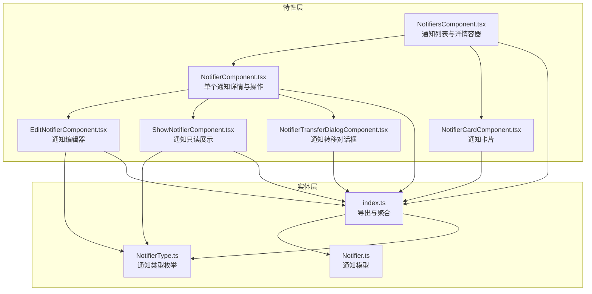
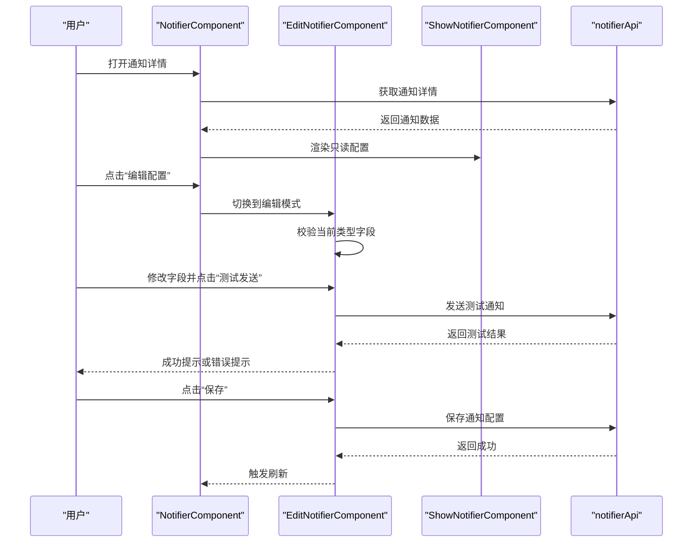
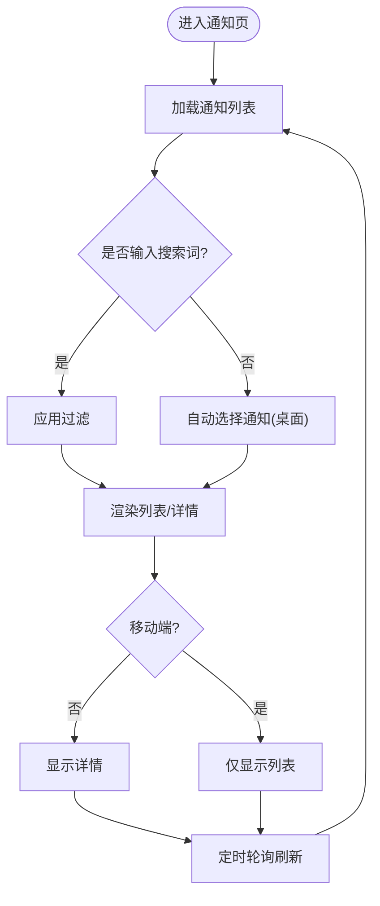
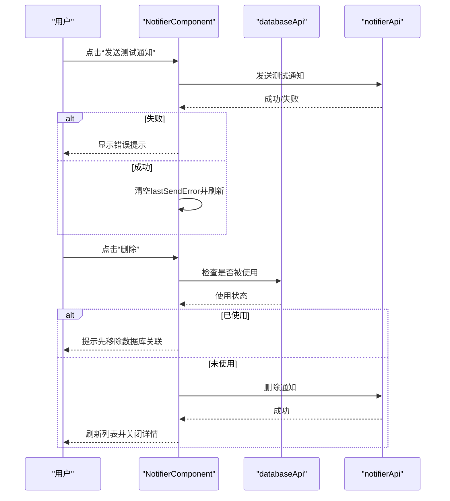
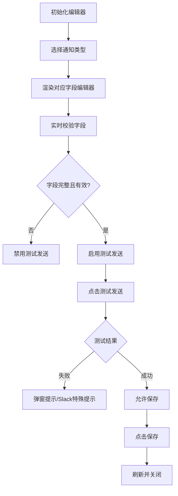
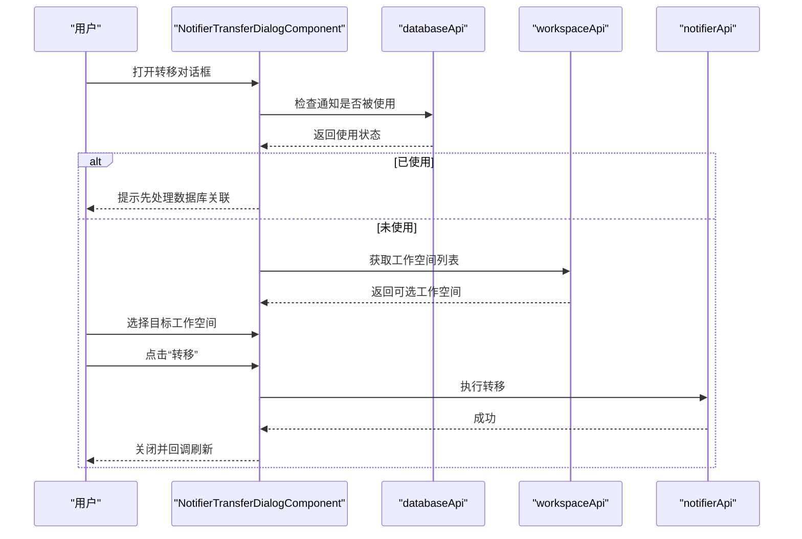
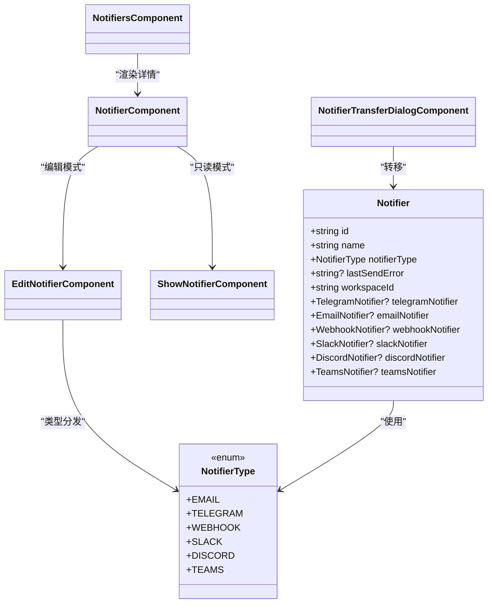

# 通知管理UI

<cite>
**本文引用的文件**
- [NotifierComponent.tsx](file://frontend/src/features/notifiers/ui/NotifierComponent.tsx)
- [NotifiersComponent.tsx](file://frontend/src/features/notifiers/ui/NotifiersComponent.tsx)
- [NotifierCardComponent.tsx](file://frontend/src/features/notifiers/ui/NotifierCardComponent.tsx)
- [EditNotifierComponent.tsx](file://frontend/src/features/notifiers/ui/edit/EditNotifierComponent.tsx)
- [ShowNotifierComponent.tsx](file://frontend/src/features/notifiers/ui/show/ShowNotifierComponent.tsx)
- [NotifierTransferDialogComponent.tsx](file://frontend/src/features/notifiers/ui/NotifierTransferDialogComponent.tsx)
- [index.ts](file://frontend/src/features/notifiers/index.ts)
- [index.ts](file://frontend/src/entity/notifiers/index.ts)
- [NotifierType.ts](file://frontend/src/entity/notifiers/models/NotifierType.ts)
- [Notifier.ts](file://frontend/src/entity/notifiers/models/Notifier.ts)
</cite>

## 目录
1. [简介](#简介)
2. [项目结构](#项目结构)
3. [核心组件](#核心组件)
4. [架构总览](#架构总览)
5. [详细组件分析](#详细组件分析)
6. [依赖关系分析](#依赖关系分析)
7. [性能考虑](#性能考虑)
8. [故障排查指南](#故障排查指南)
9. [结论](#结论)
10. [附录](#附录)

## 简介
本文件面向Databasus通知管理UI组件，系统性梳理通知列表展示、通知配置编辑、通知卡片组件与通知转移对话框的设计与实现。文档覆盖邮件、Telegram、Slack、Discord、Teams、Webhook等通知渠道的配置界面设计与表单校验机制；解释测试发送、消息模板编辑与通知历史记录展示的交互流程；并提供通知规则配置、条件触发设置与批量管理的界面设计思路，以及模板语法高亮、预览与错误处理的实现建议。

## 项目结构
通知管理UI位于前端模块的features/notifiers与entity/notifiers路径下，采用按特性分层组织：
- 特性层：features/notifiers/ui 提供页面级组件（列表、详情、卡片、编辑、显示、转移对话框）
- 实体层：entity/notifiers 提供类型定义、API封装与各渠道模型与校验器
- 导出入口：features/notifiers/index.ts 与 entity/notifiers/index.ts 暴露对外接口

图表来源
- [NotifiersComponent.tsx:1-209](file://frontend/src/features/notifiers/ui/NotifiersComponent.tsx#L1-L209)
- [NotifierComponent.tsx:1-316](file://frontend/src/features/notifiers/ui/NotifierComponent.tsx#L1-L316)
- [NotifierCardComponent.tsx:1-46](file://frontend/src/features/notifiers/ui/NotifierCardComponent.tsx#L1-L46)
- [EditNotifierComponent.tsx:1-371](file://frontend/src/features/notifiers/ui/edit/EditNotifierComponent.tsx#L1-L371)
- [ShowNotifierComponent.tsx:1-53](file://frontend/src/features/notifiers/ui/show/ShowNotifierComponent.tsx#L1-L53)
- [NotifierTransferDialogComponent.tsx:1-121](file://frontend/src/features/notifiers/ui/NotifierTransferDialogComponent.tsx#L1-L121)
- [index.ts:1-3](file://frontend/src/features/notifiers/index.ts#L1-L3)
- [index.ts:1-24](file://frontend/src/entity/notifiers/index.ts#L1-L24)
- [Notifier.ts:1-24](file://frontend/src/entity/notifiers/models/Notifier.ts#L1-L24)
- [NotifierType.ts:1-9](file://frontend/src/entity/notifiers/models/NotifierType.ts#L1-L9)

章节来源
- [NotifiersComponent.tsx:1-209](file://frontend/src/features/notifiers/ui/NotifiersComponent.tsx#L1-L209)
- [index.ts:1-3](file://frontend/src/features/notifiers/index.ts#L1-L3)
- [index.ts:1-24](file://frontend/src/entity/notifiers/index.ts#L1-L24)

## 核心组件
- NotifiersComponent：负责通知列表加载、搜索过滤、移动端/桌面端布局切换，并承载通知详情页与新增弹窗。
- NotifierComponent：单个通知的详情视图，支持名称编辑、配置查看、测试发送、删除与转移。
- NotifierCardComponent：列表项卡片，展示名称、类型与最近发送错误状态。
- EditNotifierComponent：通知编辑器，支持类型切换、字段输入、实时校验与测试发送。
- ShowNotifierComponent：根据类型渲染对应渠道的只读配置展示。
- NotifierTransferDialogComponent：在工作空间间转移通知配置，前置检查使用状态。

章节来源
- [NotifiersComponent.tsx:1-209](file://frontend/src/features/notifiers/ui/NotifiersComponent.tsx#L1-L209)
- [NotifierComponent.tsx:1-316](file://frontend/src/features/notifiers/ui/NotifierComponent.tsx#L1-L316)
- [NotifierCardComponent.tsx:1-46](file://frontend/src/features/notifiers/ui/NotifierCardComponent.tsx#L1-L46)
- [EditNotifierComponent.tsx:1-371](file://frontend/src/features/notifiers/ui/edit/EditNotifierComponent.tsx#L1-L371)
- [ShowNotifierComponent.tsx:1-53](file://frontend/src/features/notifiers/ui/show/ShowNotifierComponent.tsx#L1-L53)
- [NotifierTransferDialogComponent.tsx:1-121](file://frontend/src/features/notifiers/ui/NotifierTransferDialogComponent.tsx#L1-L121)

## 架构总览
通知管理UI采用“容器组件 + 展示组件 + 渠道专用编辑器”的分层设计：
- 容器组件负责数据获取、状态管理与路由式布局（列表/详情）。
- 展示组件负责通用UI与类型分发。
- 渠道编辑器负责具体字段与校验逻辑。
- 实体层提供统一模型与类型约束，确保跨渠道一致性。

图表来源
- [NotifierComponent.tsx:51-74](file://frontend/src/features/notifiers/ui/NotifierComponent.tsx#L51-L74)
- [EditNotifierComponent.tsx:68-91](file://frontend/src/features/notifiers/ui/edit/EditNotifierComponent.tsx#L68-L91)
- [ShowNotifierComponent.tsx:1-53](file://frontend/src/features/notifiers/ui/show/ShowNotifierComponent.tsx#L1-L53)

## 详细组件分析

### 通知列表与详情容器（NotifiersComponent）
- 职责
  - 加载工作空间下的通知列表，支持轮询刷新。
  - 支持搜索过滤与移动端/桌面端布局切换。
  - 提供新增通知弹窗与默认选中策略。
- 关键行为
  - 自动选择逻辑：桌面端自动选中第一个通知，移动端保持列表可见。
  - 本地存储：持久化上次选中的通知ID，便于回退与恢复。
  - 增量刷新：每5分钟静默拉取更新，避免频繁闪烁。
- 错误处理
  - 异常通过全局提示弹窗展示，不影响主流程。

图表来源
- [NotifiersComponent.tsx:38-73](file://frontend/src/features/notifiers/ui/NotifiersComponent.tsx#L38-L73)

章节来源
- [NotifiersComponent.tsx:1-209](file://frontend/src/features/notifiers/ui/NotifiersComponent.tsx#L1-L209)

### 单个通知详情（NotifierComponent）
- 职责
  - 展示通知名称与最近发送错误状态。
  - 名称可编辑（若具备管理权限），支持取消与保存。
  - 配置区域支持切换到编辑模式，或只读展示。
  - 提供“发送测试通知”、“转移”、“删除”等操作。
- 关键行为
  - 测试发送：调用后端接口，成功则清除lastSendError并回调上层刷新。
  - 删除前检查：若被数据库使用，提示先移除关联数据库。
  - 转移：打开转移对话框，完成工作空间间迁移。
- 错误处理
  - 最近一次发送错误以卡片形式显式提示，提供清理指引。

图表来源
- [NotifierComponent.tsx:51-97](file://frontend/src/features/notifiers/ui/NotifierComponent.tsx#L51-L97)

章节来源
- [NotifierComponent.tsx:1-316](file://frontend/src/features/notifiers/ui/NotifierComponent.tsx#L1-L316)

### 通知卡片（NotifierCardComponent）
- 职责
  - 列表项卡片，展示名称、类型与图标。
  - 若存在最近发送错误，显示错误标记。
  - 点击切换详情页选中状态。
- 设计要点
  - 选中态样式区分，提升可发现性。
  - 图标与类型名称来自统一映射工具，保证一致性。

章节来源
- [NotifierCardComponent.tsx:1-46](file://frontend/src/features/notifiers/ui/NotifierCardComponent.tsx#L1-L46)

### 通知编辑器（EditNotifierComponent）
- 职责
  - 类型选择：支持从多种通知渠道中切换。
  - 字段输入：按类型渲染对应编辑器（Telegram、Email、Webhook、Slack、Discord、Teams）。
  - 实时校验：根据当前类型调用相应校验器，控制“测试发送”按钮可用性。
  - 测试发送：调用直接测试接口，成功后允许保存。
  - 保存：提交完整配置并回调上层刷新。
- 关键行为
  - 初始化：新建时默认Telegram类型并填充基础字段结构。
  - 校验策略：按类型分别调用validateXxxNotifier，确保必填与格式正确。
  - Slack特殊提示：测试失败时给出频道可见性与DM用户ID的指引。
- 错误处理
  - 测试失败弹窗提示；成功后Toast提示。

图表来源
- [EditNotifierComponent.tsx:93-206](file://frontend/src/features/notifiers/ui/edit/EditNotifierComponent.tsx#L93-L206)

章节来源
- [EditNotifierComponent.tsx:1-371](file://frontend/src/features/notifiers/ui/edit/EditNotifierComponent.tsx#L1-L371)

### 通知只读展示（ShowNotifierComponent）
- 职责
  - 根据通知类型分发到对应渠道的只读展示组件。
  - 用于NotifierComponent的只读模式，便于用户快速浏览配置。
- 设计要点
  - 统一的类型到组件映射，避免重复逻辑。

章节来源
- [ShowNotifierComponent.tsx:1-53](file://frontend/src/features/notifiers/ui/show/ShowNotifierComponent.tsx#L1-L53)

### 通知转移对话框（NotifierTransferDialogComponent）
- 职责
  - 在工作空间间转移通知配置。
  - 先行检查通知是否被数据库使用，若使用则禁止转移并引导先处理数据库关联。
- 关键行为
  - 加载目标工作空间列表（排除当前工作空间）。
  - 选择目标工作空间后执行转移请求。
- 错误处理
  - 异常统一弹窗提示。

图表来源
- [NotifierTransferDialogComponent.tsx:21-53](file://frontend/src/features/notifiers/ui/NotifierTransferDialogComponent.tsx#L21-L53)

章节来源
- [NotifierTransferDialogComponent.tsx:1-121](file://frontend/src/features/notifiers/ui/NotifierTransferDialogComponent.tsx#L1-L121)

## 依赖关系分析
- 组件耦合
  - NotifiersComponent作为顶层容器，协调列表与详情的显示与状态。
  - NotifierComponent依赖EditNotifierComponent与ShowNotifierComponent进行内容渲染。
  - EditNotifierComponent依赖各渠道编辑器与校验器，形成类型到组件/校验的多路分发。
  - NotifierTransferDialogComponent依赖databaseApi与workspaceApi进行前置检查与目标选择。
- 数据模型
  - Notifier模型统一承载各渠道配置字段，通过notifierType进行区分。
  - NotifierType枚举集中管理所有通知渠道类型，保证前后端一致。

图表来源
- [Notifier.ts:1-24](file://frontend/src/entity/notifiers/models/Notifier.ts#L1-L24)
- [NotifierType.ts:1-9](file://frontend/src/entity/notifiers/models/NotifierType.ts#L1-L9)
- [NotifiersComponent.tsx:1-209](file://frontend/src/features/notifiers/ui/NotifiersComponent.tsx#L1-L209)
- [NotifierComponent.tsx:1-316](file://frontend/src/features/notifiers/ui/NotifierComponent.tsx#L1-L316)
- [EditNotifierComponent.tsx:1-371](file://frontend/src/features/notifiers/ui/edit/EditNotifierComponent.tsx#L1-L371)
- [ShowNotifierComponent.tsx:1-53](file://frontend/src/features/notifiers/ui/show/ShowNotifierComponent.tsx#L1-L53)
- [NotifierTransferDialogComponent.tsx:1-121](file://frontend/src/features/notifiers/ui/NotifierTransferDialogComponent.tsx#L1-L121)

章节来源
- [Notifier.ts:1-24](file://frontend/src/entity/notifiers/models/Notifier.ts#L1-L24)
- [NotifierType.ts:1-9](file://frontend/src/entity/notifiers/models/NotifierType.ts#L1-L9)

## 性能考虑
- 列表轮询：每5分钟静默刷新，减少不必要的网络请求与重绘。
- 本地存储：持久化选中通知ID，避免每次进入都重新计算默认值。
- 条件渲染：编辑/只读模式按需切换，减少DOM节点数量。
- 表单校验：按类型即时校验，避免无效提交。

## 故障排查指南
- 测试发送失败
  - 检查最近一次发送错误提示，确认是否已通过“发送测试通知”清除。
  - 对Slack通道问题，参考编辑器中的特殊提示（公开频道、私有频道邀请、DM用户ID）。
- 删除失败
  - 若提示被数据库使用，请先从相关数据库中移除该通知配置。
- 转移失败
  - 若提示正在使用，先处理数据库关联后再尝试转移。
- 保存不可用
  - 确认名称与当前类型所需字段均已填写并通过校验。

章节来源
- [NotifierComponent.tsx:198-221](file://frontend/src/features/notifiers/ui/NotifierComponent.tsx#L198-L221)
- [EditNotifierComponent.tsx:83-87](file://frontend/src/features/notifiers/ui/edit/EditNotifierComponent.tsx#L83-L87)
- [NotifierTransferDialogComponent.tsx:71-83](file://frontend/src/features/notifiers/ui/NotifierTransferDialogComponent.tsx#L71-L83)

## 结论
通知管理UI通过清晰的分层设计与类型化模型，实现了对多渠道通知的统一管理。列表/详情双视图适配多端场景，编辑器提供实时校验与测试能力，转移对话框保障跨工作空间迁移的安全性。后续可在模板语法高亮、预览与批量管理方面进一步增强用户体验。

## 附录
- 通知渠道与类型映射
  - 邮件：EmailNotifier
  - Telegram：TelegramNotifier
  - Webhook：WebhookNotifier
  - Slack：SlackNotifier
  - Discord：DiscordNotifier
  - Teams：TeamsNotifier
- 表单校验与测试
  - 各渠道提供validateXxxNotifier函数，确保必填字段与格式正确。
  - 测试发送接口支持直接测试当前配置的有效性。
- 批量管理与规则配置
  - 当前实现聚焦于单通知管理；如需批量管理与规则配置，可在现有编辑器基础上扩展批量导入/导出与规则表达式编辑器。