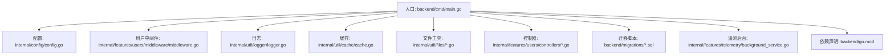
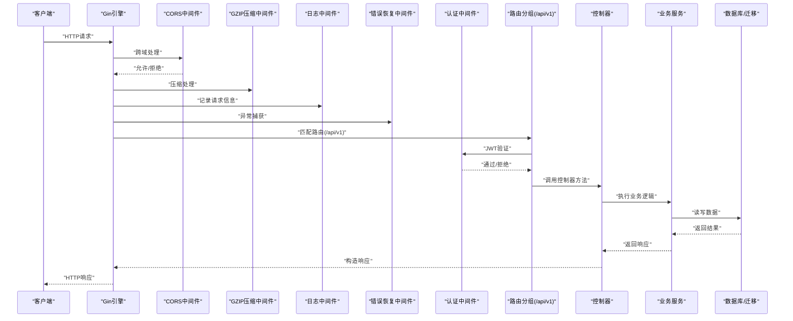
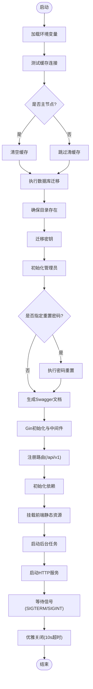
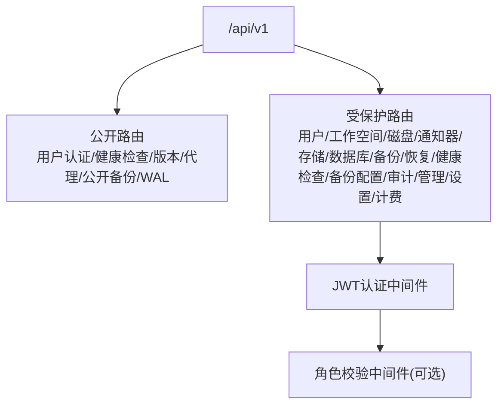
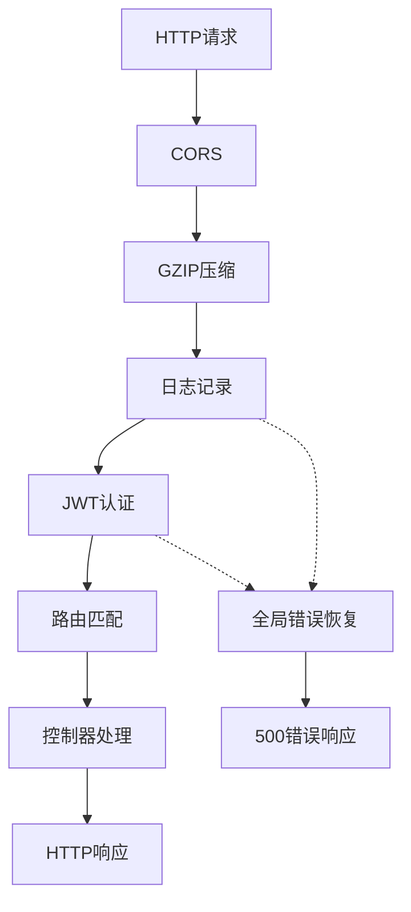
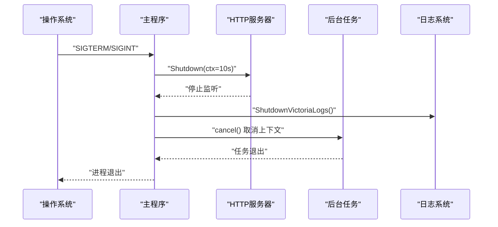
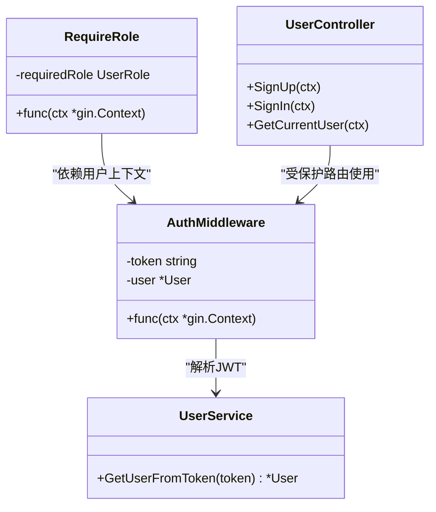
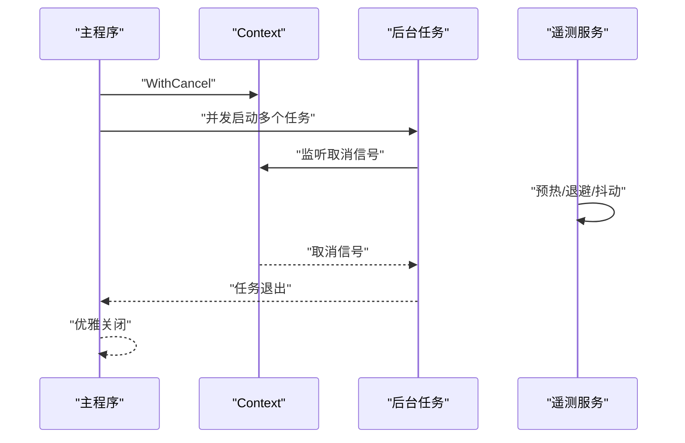
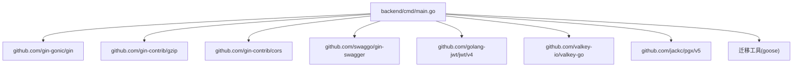

# API架构设计

<cite>
**本文档引用的文件**
- [main.go](file://backend/cmd/main.go)
- [config.go](file://backend/internal/config/config.go)
- [signals.go](file://backend/internal/config/signals.go)
- [middleware.go](file://backend/internal/features/users/middleware/middleware.go)
- [logger.go](file://backend/internal/util/logger/logger.go)
- [cache.go](file://backend/internal/util/cache/cache.go)
- [creator.go](file://backend/internal/util/files/creator.go)
- [cleaner.go](file://backend/internal/util/files/cleaner.go)
- [user_controller.go](file://backend/internal/features/users/controllers/user_controller.go)
- [di.go](file://backend/internal/features/users/controllers/di.go)
- [20250605090323_init.sql](file://backend/migrations/20250605090323_init.sql)
- [background_service.go](file://backend/internal/features/telemetry/background_service.go)
- [go.mod](file://backend/go.mod)
</cite>

## 目录
1. [简介](#简介)
2. [项目结构](#项目结构)
3. [核心组件](#核心组件)
4. [架构总览](#架构总览)
5. [详细组件分析](#详细组件分析)
6. [依赖关系分析](#依赖关系分析)
7. [性能考量](#性能考量)
8. [故障排除指南](#故障排除指南)
9. [结论](#结论)
10. [附录](#附录)

## 简介
本文件面向Databasus后端API架构设计，围绕基于Gin框架的RESTful服务进行系统化技术文档整理。重点覆盖以下方面：
- 路由分组策略与API版本控制（/api/v1）
- 中间件体系（CORS、GZIP压缩、日志记录、错误恢复）
- 优雅关闭机制与信号处理
- 认证授权中间件集成与权限控制
- 跨域配置与性能优化措施
- 主函数启动流程（数据库迁移、目录创建、依赖初始化、后台任务启动）
- 错误处理机制、日志记录策略、进程管理
- 请求处理流程架构图
- 安全考虑、监控集成与可扩展性设计原则

## 项目结构
后端采用模块化分层架构，入口位于backend/cmd/main.go，核心功能按领域拆分至internal/features下的各子模块，配置、工具类库位于internal/util。



**图表来源**
- [main.go:65-137](file://backend/cmd/main.go#L65-L137)
- [config.go:152-155](file://backend/internal/config/config.go#L152-L155)
- [middleware.go:14-38](file://backend/internal/features/users/middleware/middleware.go#L14-L38)
- [logger.go:52-55](file://backend/internal/util/logger/logger.go#L52-L55)
- [cache.go:43-45](file://backend/internal/util/cache/cache.go#L43-L45)
- [creator.go:8-22](file://backend/internal/util/files/creator.go#L8-L22)
- [user_controller.go:19-46](file://backend/internal/features/users/controllers/user_controller.go#L19-L46)
- [20250605090323_init.sql:1-50](file://backend/migrations/20250605090323_init.sql#L1-L50)
- [background_service.go:50-83](file://backend/internal/features/telemetry/background_service.go#L50-L83)
- [go.mod:1-34](file://backend/go.mod#L1-L34)

**章节来源**
- [main.go:65-137](file://backend/cmd/main.go#L65-L137)
- [config.go:152-155](file://backend/internal/config/config.go#L152-L155)

## 核心组件
- 入口与启动流程：负责环境加载、数据库迁移、目录准备、依赖初始化、后台任务启动、服务器启动与优雅关闭。
- 配置系统：集中管理环境变量、默认值、路径计算与外部资源覆盖。
- 中间件体系：CORS、GZIP、日志、错误恢复、JWT认证与角色校验。
- 控制器与路由：用户登录注册、认证、设置、管理等接口。
- 工具库：日志、缓存、文件操作、速率限制等。
- 数据层：数据库迁移脚本与表结构定义。
- 遥测与监控：匿名遥测后台服务与可配置开关。

**章节来源**
- [main.go:65-137](file://backend/cmd/main.go#L65-L137)
- [config.go:152-155](file://backend/internal/config/config.go#L152-L155)
- [middleware.go:14-38](file://backend/internal/features/users/middleware/middleware.go#L14-L38)
- [logger.go:52-55](file://backend/internal/util/logger/logger.go#L52-L55)
- [cache.go:43-45](file://backend/internal/util/cache/cache.go#L43-L45)
- [user_controller.go:19-46](file://backend/internal/features/users/controllers/user_controller.go#L19-L46)
- [20250605090323_init.sql:1-50](file://backend/migrations/20250605090323_init.sql#L1-L50)
- [background_service.go:50-83](file://backend/internal/features/telemetry/background_service.go#L50-L83)

## 架构总览
下图展示了从HTTP请求到业务逻辑执行的完整链路，包括中间件处理、路由分组、认证授权、控制器调用与后台任务协作。



**图表来源**
- [main.go:112-127](file://backend/cmd/main.go#L112-L127)
- [main.go:213-257](file://backend/cmd/main.go#L213-L257)
- [middleware.go:14-38](file://backend/internal/features/users/middleware/middleware.go#L14-L38)
- [user_controller.go:58-100](file://backend/internal/features/users/controllers/user_controller.go#L58-L100)
- [config.go:415-421](file://backend/internal/config/config.go#L415-L421)

## 详细组件分析

### 启动流程与主函数
- 环境与缓存：加载配置、测试缓存连接、必要时清空缓存。
- 数据库迁移：仅在主节点执行，使用goose执行SQL迁移。
- 目录准备：确保临时目录与数据目录存在。
- 密钥迁移：从数据库迁移到文件系统。
- 初始化管理员：创建初始管理员账户。
- 密码重置命令行：支持通过命令行参数重置密码。
- Swagger文档生成：开发模式下动态生成API文档。
- 服务器配置：设置Gin运行模式、添加日志与恢复中间件、GZIP压缩、CORS、路由注册、依赖初始化。
- 前端静态资源挂载：SPA回退到index.html。
- 后台任务：根据节点角色启动备份、恢复、健康检查、审计清理、下载令牌清理、遥测等任务。
- 优雅关闭：监听SIGTERM/SIGINT，10秒超时优雅停机，关闭VictoriaLogs写入器。



**图表来源**
- [main.go:65-137](file://backend/cmd/main.go#L65-L137)
- [main.go:139-173](file://backend/cmd/main.go#L139-L173)
- [main.go:175-211](file://backend/cmd/main.go#L175-L211)
- [main.go:213-257](file://backend/cmd/main.go#L213-L257)
- [main.go:259-276](file://backend/cmd/main.go#L259-L276)
- [main.go:293-374](file://backend/cmd/main.go#L293-L374)
- [main.go:478-490](file://backend/cmd/main.go#L478-L490)

**章节来源**
- [main.go:65-137](file://backend/cmd/main.go#L65-L137)
- [main.go:139-173](file://backend/cmd/main.go#L139-L173)
- [main.go:175-211](file://backend/cmd/main.go#L175-L211)
- [main.go:213-257](file://backend/cmd/main.go#L213-L257)
- [main.go:259-276](file://backend/cmd/main.go#L259-L276)
- [main.go:293-374](file://backend/cmd/main.go#L293-L374)
- [main.go:478-490](file://backend/cmd/main.go#L478-L490)

### 路由分组与API版本控制
- 路由前缀：所有受管路由统一置于/api/v1分组。
- 公开路由：用户认证、健康检查、版本查询、代理相关、公开备份与PostgreSQL WAL备份等。
- 受保护路由：需要JWT认证的用户、工作空间、磁盘、通知器、存储、数据库、备份、恢复、健康检查配置与尝试、备份配置、审计日志、管理与设置、计费等。
- 认证中间件：从Authorization头提取JWT，去除Bearer前缀后调用用户服务解析用户信息，失败则返回401。
- 角色中间件：可选的角色权限校验，用于管理员或特定资源访问控制。



**图表来源**
- [main.go:213-257](file://backend/cmd/main.go#L213-L257)
- [middleware.go:14-38](file://backend/internal/features/users/middleware/middleware.go#L14-L38)
- [middleware.go:40-64](file://backend/internal/features/users/middleware/middleware.go#L40-L64)

**章节来源**
- [main.go:213-257](file://backend/cmd/main.go#L213-L257)
- [middleware.go:14-38](file://backend/internal/features/users/middleware/middleware.go#L14-L38)
- [middleware.go:40-64](file://backend/internal/features/users/middleware/middleware.go#L40-L64)

### 中间件体系
- CORS：开发模式下允许任意源，支持常用头部与凭据。
- GZIP压缩：默认压缩级别，排除图片、PDF、视频等已压缩格式。
- 日志：标准输出结构化日志，开发模式下额外输出。
- 错误恢复：全局panic捕获，记录堆栈并返回500。
- 认证授权：JWT解析与用户上下文注入；可选角色校验。



**图表来源**
- [main.go:112-127](file://backend/cmd/main.go#L112-L127)
- [main.go:434-457](file://backend/cmd/main.go#L434-L457)
- [main.go:459-476](file://backend/cmd/main.go#L459-L476)
- [middleware.go:14-38](file://backend/internal/features/users/middleware/middleware.go#L14-L38)

**章节来源**
- [main.go:112-127](file://backend/cmd/main.go#L112-L127)
- [main.go:434-457](file://backend/cmd/main.go#L434-L457)
- [main.go:459-476](file://backend/cmd/main.go#L459-L476)
- [middleware.go:14-38](file://backend/internal/features/users/middleware/middleware.go#L14-L38)

### 优雅关闭机制与信号处理
- 信号监听：接收SIGTERM/SIGINT，触发优雅关闭流程。
- 服务器关闭：10秒超时优雅停机，避免强制中断正在处理的请求。
- 资源清理：优雅关闭VictoriaLogs写入器，确保日志不丢失。
- 上下文取消：后台任务通过context.WithCancel接收关闭信号并退出循环。



**图表来源**
- [main.go:175-211](file://backend/cmd/main.go#L175-L211)
- [signals.go:11-23](file://backend/internal/config/signals.go#L11-L23)
- [logger.go:58-62](file://backend/internal/util/logger/logger.go#L58-L62)

**章节来源**
- [main.go:175-211](file://backend/cmd/main.go#L175-L211)
- [signals.go:11-23](file://backend/internal/config/signals.go#L11-L23)
- [logger.go:58-62](file://backend/internal/util/logger/logger.go#L58-L62)

### 认证授权中间件集成
- JWT解析：从Authorization头提取token，去除Bearer前缀后调用用户服务解析用户。
- 用户上下文：成功后将用户对象注入Gin上下文，供后续处理器使用。
- 权限控制：可选的角色中间件，基于用户角色判断访问权限。
- 控制器示例：用户注册/登录接口中集成Cloudflare Turnstile验证与速率限制。



**图表来源**
- [middleware.go:14-38](file://backend/internal/features/users/middleware/middleware.go#L14-L38)
- [middleware.go:40-64](file://backend/internal/features/users/middleware/middleware.go#L40-L64)
- [user_controller.go:58-100](file://backend/internal/features/users/controllers/user_controller.go#L58-L100)
- [user_controller.go:113-158](file://backend/internal/features/users/controllers/user_controller.go#L113-L158)

**章节来源**
- [middleware.go:14-38](file://backend/internal/features/users/middleware/middleware.go#L14-L38)
- [middleware.go:40-64](file://backend/internal/features/users/middleware/middleware.go#L40-L64)
- [user_controller.go:58-100](file://backend/internal/features/users/controllers/user_controller.go#L58-L100)
- [user_controller.go:113-158](file://backend/internal/features/users/controllers/user_controller.go#L113-L158)

### 跨域配置与性能优化
- CORS：开发模式允许任意源，支持常见请求头与凭据，生产环境需按需收紧。
- GZIP：默认压缩级别，排除图片、PDF、视频等已压缩格式以避免二次压缩。
- 日志：结构化日志输出，支持多处理器（控制台+可选VictoriaLogs）。
- 缓存：Valkey客户端初始化与连接测试，支持批量清空键空间。
- 文件系统：确保目录存在与清理临时文件夹，避免磁盘空间膨胀。

**章节来源**
- [main.go:434-457](file://backend/cmd/main.go#L434-L457)
- [main.go:118-124](file://backend/cmd/main.go#L118-L124)
- [logger.go:19-49](file://backend/internal/util/logger/logger.go#L19-L49)
- [cache.go:47-81](file://backend/internal/util/cache/cache.go#L47-L81)
- [creator.go:8-22](file://backend/internal/util/files/creator.go#L8-L22)
- [cleaner.go:9-27](file://backend/internal/util/files/cleaner.go#L9-L27)

### 数据库迁移与版本控制
- 迁移执行：仅在主节点执行，通过goose驱动PostgreSQL执行SQL迁移脚本。
- 版本控制：迁移脚本按时间戳命名，确保顺序执行与幂等性。
- 初始表结构：包含用户、密钥、通知器、存储、数据库、备份等核心表及索引约束。

```mermaid
erDiagram
USERS {
uuid id PK
text email UK
text hashed_password
timestamptz password_creation_time
timestamptz created_at
text role
}
SECRET_KEYS {
text secret UK
}
NOTIFIERS {
uuid id PK
uuid user_id FK
varchar name
varchar notifier_type
text last_send_error
}
TELEGRAM_NOTIFIERS {
uuid notifier_id PK,FK
text bot_token
text target_chat_id
}
EMAIL_NOTIFIERS {
uuid notifier_id PK,FK
varchar target_email
varchar smtp_host
integer smtp_port
varchar smtp_user
varchar smtp_password
}
STORAGE_TYPES {
uuid id PK
uuid user_id FK
text type
text name
text last_save_error
}
LOCAL_STORAGES {
uuid storage_id PK,FK
}
S3_STORAGES {
uuid storage_id PK,FK
text s3_bucket
text s3_region
text s3_access_key
text s3_secret_key
text s3_endpoint
}
INTERVALS {
uuid id PK
text interval
text time_of_day
int weekday
int day_of_month
}
DATABASES {
uuid id PK
uuid user_id FK
text name
text type
uuid backup_interval_id FK
uuid storage_id FK
text store_period
timestamptz last_backup_time
text last_backup_error_message
text send_notifications_on
}
POSTGRESQL_DATABASES {
uuid id PK
uuid database_id UK
text version
text host
int port
text username
text password
text database
boolean is_https
int cpu_count
uuid restore_id
}
DATABASE_NOTIFIERS {
uuid database_id FK
uuid notifier_id FK
PK(database_id, notifier_id)
}
BACKUPS {
uuid id PK
uuid database_id FK
uuid storage_id FK
text status
text fail_message
double precision backup_size_mb
bigint backup_duration_ms
timestamptz created_at
}
USERS ||--o{ NOTIFIERS : "拥有"
NOTIFIERS ||--o{ TELEGRAM_NOTIFIERS : "一对一"
NOTIFIERS ||--o{ EMAIL_NOTIFIERS : "一对一"
USERS ||--o{ STORAGE_TYPES : "拥有"
STORAGE_TYPES ||--o{ LOCAL_STORAGES : "一对一"
STORAGE_TYPES ||--o{ S3_STORAGES : "一对一"
INTERVALS ||--o{ DATABASES : "被引用"
USERS ||--o{ DATABASES : "拥有"
DATABASES ||--o{ BACKUPS : "产生"
DATABASES ||--o{ DATABASE_NOTIFIERS : "关联"
NOTIFIERS ||--o{ DATABASE_NOTIFIERS : "关联"
```

**图表来源**
- [20250605090323_init.sql:4-200](file://backend/migrations/20250605090323_init.sql#L4-L200)

**章节来源**
- [main.go:415-432](file://backend/cmd/main.go#L415-L432)
- [20250605090323_init.sql:1-200](file://backend/migrations/20250605090323_init.sql#L1-L200)

### 后台任务与遥测
- 任务类型：备份调度、备份清理、恢复调度、健康检查尝试、审计日志清理、下载令牌清理、备份节点/恢复节点注册、计费（云模式）、遥测。
- 优雅退出：所有任务通过context.WithCancel接收关闭信号，确保任务有序退出。
- 遥测：匿名遥测服务带预热、指数退避与抖动，支持禁用开关。



**图表来源**
- [main.go:293-374](file://backend/cmd/main.go#L293-L374)
- [background_service.go:50-83](file://backend/internal/features/telemetry/background_service.go#L50-L83)

**章节来源**
- [main.go:293-374](file://backend/cmd/main.go#L293-L374)
- [background_service.go:50-83](file://backend/internal/features/telemetry/background_service.go#L50-L83)

### 错误处理机制与日志记录策略
- 全局恢复：捕获panic，记录错误与堆栈，返回500。
- 控制器级错误：参数绑定失败返回400，业务错误返回对应状态码与错误信息。
- 日志策略：结构化文本日志，支持多处理器；可选VictoriaLogs远程写入；优雅关闭时安全关闭写入器。
- 速率限制：登录接口集成基于Valkey的速率限制，防止暴力破解。

**章节来源**
- [main.go:459-476](file://backend/cmd/main.go#L459-L476)
- [user_controller.go:58-100](file://backend/internal/features/users/controllers/user_controller.go#L58-L100)
- [user_controller.go:113-158](file://backend/internal/features/users/controllers/user_controller.go#L113-L158)
- [logger.go:19-49](file://backend/internal/util/logger/logger.go#L19-L49)
- [cache.go:47-81](file://backend/internal/util/cache/cache.go#L47-L81)

### 进程管理与依赖初始化
- 进程管理：通过信号处理实现优雅关闭，确保资源释放与任务退出。
- 依赖初始化：按领域模块调用SetupDependencies，确保数据库、通知器、存储、备份配置、任务取消、计费等依赖就绪。
- 前端集成：SPA静态资源挂载，未命中路由回退到index.html。

**章节来源**
- [main.go:175-211](file://backend/cmd/main.go#L175-L211)
- [main.go:259-276](file://backend/cmd/main.go#L259-L276)
- [main.go:478-490](file://backend/cmd/main.go#L478-L490)

## 依赖关系分析
后端模块依赖Go标准库与第三方库，核心依赖包括Gin Web框架、GZIP/CORS中间件、JWT、Valkey、PostgreSQL驱动、迁移工具等。



**图表来源**
- [go.mod:5-34](file://backend/go.mod#L5-L34)
- [main.go:17-21](file://backend/cmd/main.go#L17-L21)

**章节来源**
- [go.mod:1-34](file://backend/go.mod#L1-L34)
- [main.go:17-21](file://backend/cmd/main.go#L17-L21)

## 性能考量
- 压缩策略：启用GZIP压缩减少传输体积，排除已压缩格式避免重复压缩。
- 缓存：Valkey作为高性能键值存储，支持连接测试与批量清理，降低数据库压力。
- 日志：结构化日志与可选远程写入，避免阻塞请求处理。
- 速率限制：登录接口的速率限制可有效缓解暴力破解风险。
- 后台任务：任务并发执行与优雅退出，避免阻塞主请求线程。

[本节为通用指导，无需具体文件分析]

## 故障排除指南
- 启动失败：检查.env配置、数据库DSN、Valkey连接参数；查看日志输出定位错误。
- CORS问题：确认开发模式下CORS配置与浏览器跨域策略。
- 500错误：查看全局恢复中间件日志，定位panic堆栈。
- 登录失败：检查Cloudflare Turnstile配置与速率限制；核对用户凭据。
- 迁移失败：确认主节点标识与数据库连接字符串，查看goose输出。
- 优雅关闭：确认信号发送与10秒超时设置，检查日志中关闭阶段输出。

**章节来源**
- [main.go:459-476](file://backend/cmd/main.go#L459-L476)
- [main.go:415-432](file://backend/cmd/main.go#L415-L432)
- [logger.go:58-62](file://backend/internal/util/logger/logger.go#L58-L62)

## 结论
Databasus后端以Gin为核心，构建了清晰的路由分组与中间件体系，结合优雅关闭、认证授权、跨域与性能优化，形成了稳定可靠的RESTful API架构。通过模块化的依赖初始化与后台任务管理，系统具备良好的可维护性与可扩展性。建议在生产环境中进一步收紧CORS策略、完善监控告警与日志聚合，并持续演进API版本与安全策略。

[本节为总结性内容，无需具体文件分析]

## 附录
- API版本控制：统一使用/api/v1前缀，未来可通过新增版本前缀平滑演进。
- 安全增强：建议引入CSRF防护、请求体大小限制、敏感字段脱敏、审计日志细化。
- 监控集成：结合遥测服务与日志系统，建立指标采集与告警机制。
- 可扩展性：采用领域驱动设计，按功能模块独立扩展控制器、服务与仓库。

[本节为概念性内容，无需具体文件分析]