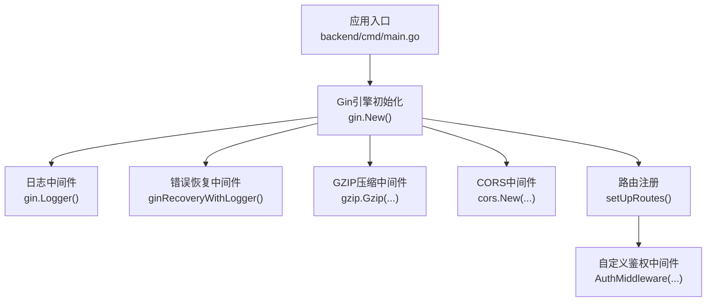
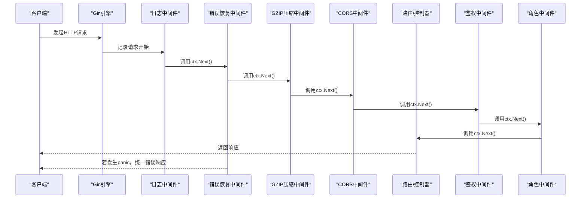
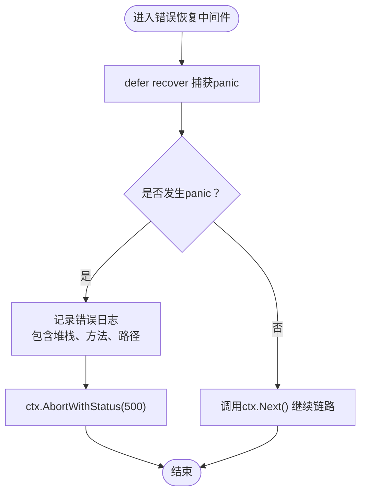
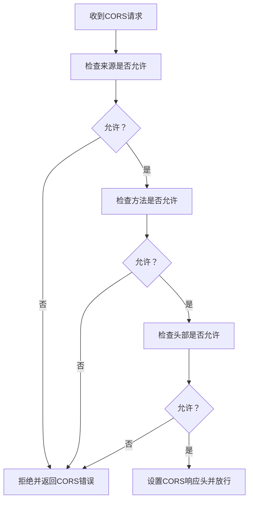
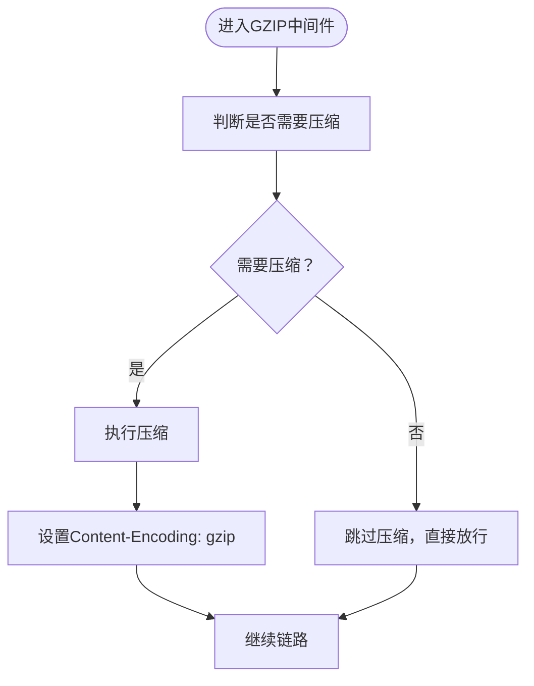
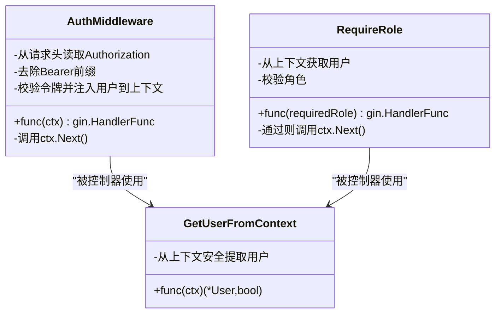
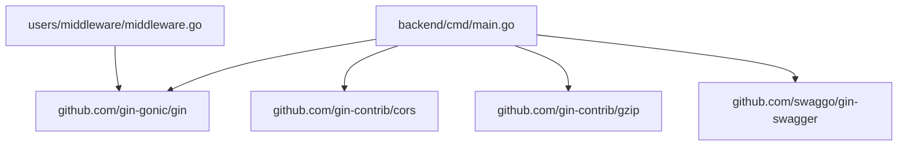

# 中间件栈

<cite>
**本文引用的文件列表**
- [main.go](file://backend/cmd/main.go)
- [middleware.go](file://backend/internal/features/users/middleware/middleware.go)
- [logger.go](file://backend/internal/util/logger/logger.go)
- [requests.go](file://backend/internal/util/testing/requests.go)
- [go.mod](file://backend/go.mod)
</cite>

## 目录
1. [简介](#简介)
2. [项目结构](#项目结构)
3. [核心组件](#核心组件)
4. [架构总览](#架构总览)
5. [详细组件分析](#详细组件分析)
6. [依赖分析](#依赖分析)
7. [性能考量](#性能考量)
8. [故障排查指南](#故障排查指南)
9. [结论](#结论)
10. [附录](#附录)

## 简介
本文件面向Databasus后端中间件栈，聚焦于Gin框架中间件的执行顺序与作用机制，覆盖以下方面：
- 日志中间件：Gin内置日志记录器
- 错误恢复中间件：统一panic捕获与错误响应
- CORS中间件：跨域控制策略
- GZIP压缩中间件：响应体压缩策略
- 自定义中间件：鉴权中间件与角色校验
- 执行顺序对请求处理的影响与调优
- 开发最佳实践：上下文传递、错误处理、日志规范、性能优化
- 调试方法与常见问题解决

## 项目结构
Databasus后端以Gin为核心HTTP框架，中间件在应用启动阶段集中注册，随后按顺序链式执行。关键位置如下：
- 应用入口与中间件注册：backend/cmd/main.go
- 自定义鉴权中间件：backend/internal/features/users/middleware/middleware.go
- 全局日志与日志写入器：backend/internal/util/logger/logger.go
- 测试工具（便于中间件行为验证）：backend/internal/util/testing/requests.go
- 外部依赖（Gin、CORS、GZIP等）：backend/go.mod

图表来源
- [main.go:112-127](file://backend/cmd/main.go#L112-L127)
- [main.go:434-457](file://backend/cmd/main.go#L434-L457)
- [main.go:459-476](file://backend/cmd/main.go#L459-L476)

章节来源
- [main.go:112-127](file://backend/cmd/main.go#L112-L127)
- [main.go:434-457](file://backend/cmd/main.go#L434-L457)
- [main.go:459-476](file://backend/cmd/main.go#L459-L476)

## 核心组件
- Gin内置日志中间件：记录请求/响应元数据与耗时，便于审计与排障
- 自定义错误恢复中间件：捕获panic并输出结构化日志，返回统一错误码
- CORS中间件：开发环境允许任意源访问，生产环境按需收紧
- GZIP压缩中间件：对文本类响应进行压缩，排除已压缩资源类型
- 自定义鉴权中间件：从请求头解析令牌，校验有效性并将用户对象注入上下文
- 角色中间件：基于上下文中的用户角色进行权限判定

章节来源
- [main.go:112-127](file://backend/cmd/main.go#L112-L127)
- [main.go:434-457](file://backend/cmd/main.go#L434-L457)
- [main.go:459-476](file://backend/cmd/main.go#L459-L476)
- [middleware.go:13-38](file://backend/internal/features/users/middleware/middleware.go#L13-L38)
- [middleware.go:40-64](file://backend/internal/features/users/middleware/middleware.go#L40-L64)

## 架构总览
下图展示Databasus中间件栈在请求生命周期中的执行顺序与职责分工。

图表来源
- [main.go:112-127](file://backend/cmd/main.go#L112-L127)
- [main.go:434-457](file://backend/cmd/main.go#L434-L457)
- [main.go:459-476](file://backend/cmd/main.go#L459-L476)
- [middleware.go:13-38](file://backend/internal/features/users/middleware/middleware.go#L13-L38)
- [middleware.go:40-64](file://backend/internal/features/users/middleware/middleware.go#L40-L64)

## 详细组件分析

### 日志中间件（Gin.Logger）
- 作用：记录请求方法、路径、状态码、耗时、客户端IP等信息
- 注册位置：在应用启动时通过gin.New()后立即注册
- 性能影响：开销极低，建议在所有环境中启用
- 配置要点：默认配置即可满足大多数场景；如需更细粒度控制可参考Gin文档扩展

章节来源
- [main.go:112-115](file://backend/cmd/main.go#L112-L115)

### 错误恢复中间件（ginRecoveryWithLogger）
- 作用：捕获请求处理过程中的panic，记录堆栈与请求上下文，并返回统一错误码
- 注册位置：在应用启动时注册，位于日志之后
- 行为特征：recover后终止后续处理，直接返回错误响应
- 性能影响：仅在异常情况下触发，正常路径几乎无额外开销
- 日志字段：错误信息、堆栈、请求方法、路径

图表来源
- [main.go:459-476](file://backend/cmd/main.go#L459-L476)

章节来源
- [main.go:459-476](file://backend/cmd/main.go#L459-L476)
- [logger.go:14-49](file://backend/internal/util/logger/logger.go#L14-L49)

### CORS中间件（gin-contrib/cors）
- 作用：控制跨域请求的来源、方法、头部与凭证
- 注册位置：在应用启动时注册
- 开发环境策略：允许任意源与方法，便于前端联调
- 生产环境策略：应按需收紧，避免使用通配符
- 常见问题：预检请求OPTIONS未正确处理或允许头缺失

图表来源
- [main.go:434-457](file://backend/cmd/main.go#L434-L457)

章节来源
- [main.go:434-457](file://backend/cmd/main.go#L434-L457)

### GZIP压缩中间件（gin-contrib/gzip）
- 作用：对文本类响应进行压缩，减少带宽占用
- 注册位置：在应用启动时注册
- 排除规则：对图片、视频、PDF等已压缩格式不进行二次压缩
- 性能影响：CPU开销与带宽节省之间的平衡，建议在高流量接口上启用

图表来源
- [main.go:117-124](file://backend/cmd/main.go#L117-L124)

章节来源
- [main.go:117-124](file://backend/cmd/main.go#L117-L124)

### 自定义中间件：鉴权与角色校验
- 鉴权中间件（AuthMiddleware）
  - 从Authorization头提取令牌，去除“Bearer ”前缀
  - 调用服务层校验令牌有效性，失败则返回未授权
  - 成功则将用户对象注入上下文，继续链路
- 角色中间件（RequireRole）
  - 从上下文中取出用户对象
  - 校验角色是否满足要求，否则返回禁止
- 上下文传递
  - 使用ctx.Set("user", user)注入用户对象
  - 使用ctx.Get("user")安全提取，配合类型断言
- 错误处理
  - 缺失令牌、无效令牌、上下文类型不符均返回相应状态码并中止

图表来源
- [middleware.go:13-38](file://backend/internal/features/users/middleware/middleware.go#L13-L38)
- [middleware.go:40-64](file://backend/internal/features/users/middleware/middleware.go#L40-L64)
- [middleware.go:66-76](file://backend/internal/features/users/middleware/middleware.go#L66-L76)

章节来源
- [middleware.go:13-38](file://backend/internal/features/users/middleware/middleware.go#L13-L38)
- [middleware.go:40-64](file://backend/internal/features/users/middleware/middleware.go#L40-L64)
- [middleware.go:66-76](file://backend/internal/features/users/middleware/middleware.go#L66-L76)

### 执行顺序对请求处理的影响
- 注册顺序即执行顺序：日志 -> 错误恢复 -> GZIP -> CORS -> 鉴权 -> 控制器
- 影响点：
  - CORS在鉴权之前，确保鉴权前的预检与跨域协商正常
  - GZIP在鉴权之后，避免对鉴权失败的响应进行不必要的压缩
  - 错误恢复在最内层，保证任何中间件或控制器异常都能被捕获
- 场景调整建议：
  - 需要对特定路由禁用GZIP：将该路由置于GZIP之后或单独包装
  - 需要对特定路由放宽CORS：在路由组内局部启用
  - 需要对特定路由增加额外校验：在鉴权之后追加自定义中间件

章节来源
- [main.go:112-127](file://backend/cmd/main.go#L112-L127)
- [main.go:434-457](file://backend/cmd/main.go#L434-L457)
- [main.go:459-476](file://backend/cmd/main.go#L459-L476)

## 依赖分析
- Gin核心：提供路由、中间件链与上下文
- gin-contrib/cors：跨域支持
- gin-contrib/gzip：响应压缩
- gin-swagger：文档生成（不影响中间件链）

图表来源
- [go.mod:9-11](file://backend/go.mod#L9-L11)
- [go.mod:26-27](file://backend/go.mod#L26-L27)
- [main.go:17-21](file://backend/cmd/main.go#L17-L21)

章节来源
- [go.mod:9-11](file://backend/go.mod#L9-L11)
- [go.mod:26-27](file://backend/go.mod#L26-L27)
- [main.go:17-21](file://backend/cmd/main.go#L17-L21)

## 性能考量
- 日志中间件：默认配置开销极小，建议保留
- 错误恢复中间件：仅在panic时触发，正常路径无额外成本
- GZIP中间件：
  - CPU消耗与压缩比相关，建议对大体积文本响应启用
  - 对已压缩资源（图片、视频、PDF）显式排除，避免二次压缩
  - 可根据业务流量与带宽情况评估启用与否
- CORS中间件：对预检请求有轻微开销，但通常可忽略
- 自定义中间件：
  - 鉴权与角色校验应尽量轻量，避免阻塞链路
  - 将昂贵操作（如数据库查询）放在控制器内部按需执行

## 故障排查指南
- 请求未命中预期路由
  - 检查路由组挂载顺序与中间件注册顺序
  - 确认鉴权中间件是否导致提前中止
- CORS报错
  - 确认请求头是否包含必要字段
  - 开发环境可临时放宽策略，定位问题后再收紧
- 响应过大或慢
  - 启用GZIP并确认未对已压缩资源重复压缩
  - 分析控制器是否返回冗余数据
- 500错误但无日志
  - 确认错误恢复中间件已注册且未被覆盖
  - 检查全局日志级别与输出目标
- 单元/集成测试验证中间件行为
  - 使用测试工具构造请求，设置Authorization头
  - 断言期望状态码与响应内容
  - 参考测试工具封装的请求构造函数

章节来源
- [main.go:434-457](file://backend/cmd/main.go#L434-L457)
- [main.go:459-476](file://backend/cmd/main.go#L459-L476)
- [requests.go:15-28](file://backend/internal/util/testing/requests.go#L15-L28)
- [requests.go:127-165](file://backend/internal/util/testing/requests.go#L127-L165)

## 结论
Databasus后端中间件栈以清晰的注册顺序与职责划分保障了请求处理的可观测性、安全性与性能。通过合理配置CORS、GZIP与鉴权中间件，并结合统一的错误恢复策略，可在开发与生产环境中获得一致的体验。建议在变更中间件配置时，优先考虑对请求链路的影响与性能权衡，并辅以测试工具验证行为。

## 附录
- 中间件开发最佳实践
  - 上下文传递：使用ctx.Set/ctx.Get进行键值传递，避免全局变量
  - 错误处理：在中间件中尽早返回错误并中止链路，避免污染后续逻辑
  - 日志规范：统一字段命名与日志级别，便于检索与聚合
  - 性能优化：对CPU密集型操作延迟到控制器内部，对I/O操作使用异步或缓存
- 调试方法
  - 在测试环境中使用gin.TestMode与httptest.NewRecorder
  - 使用测试工具构造带Authorization头的请求，验证鉴权与角色中间件
  - 关注错误恢复中间件输出的堆栈信息，快速定位异常点