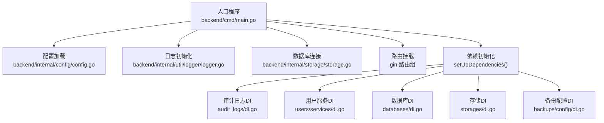
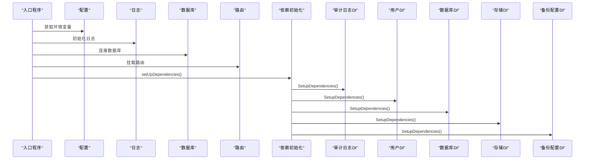
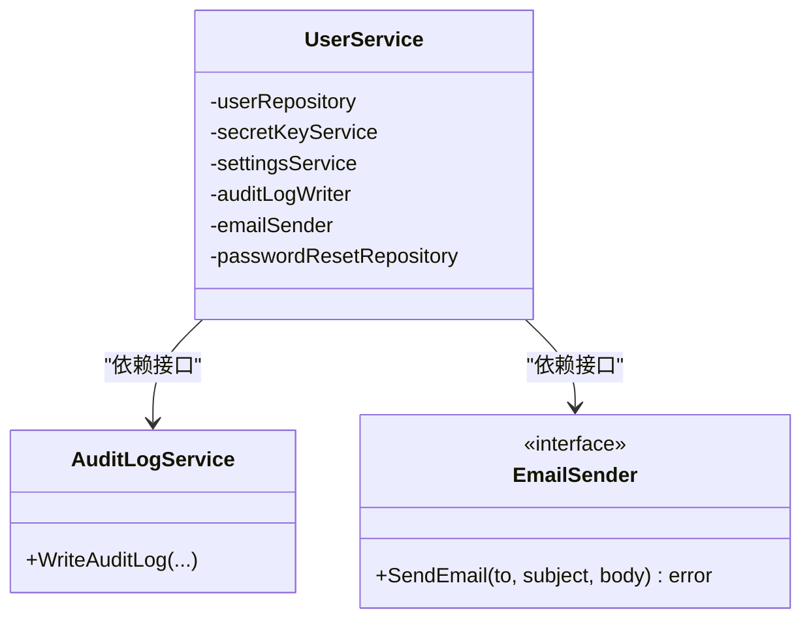
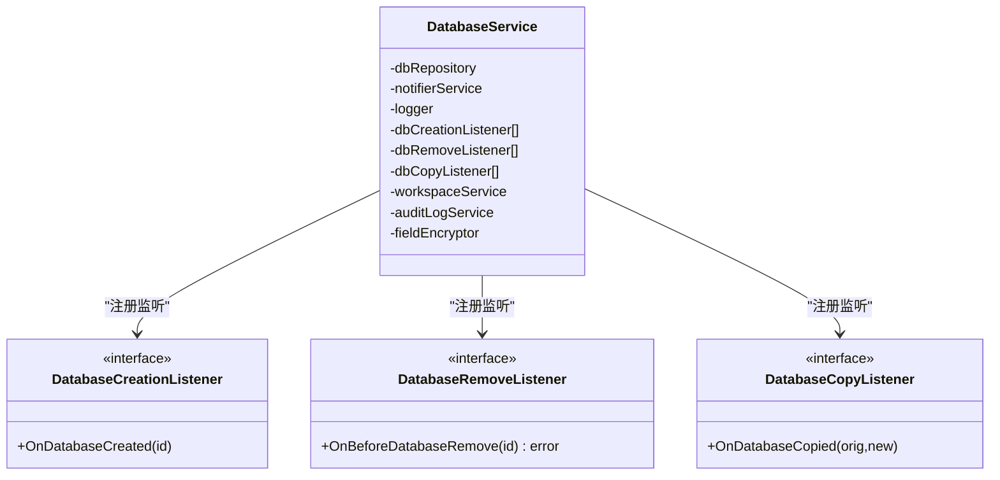
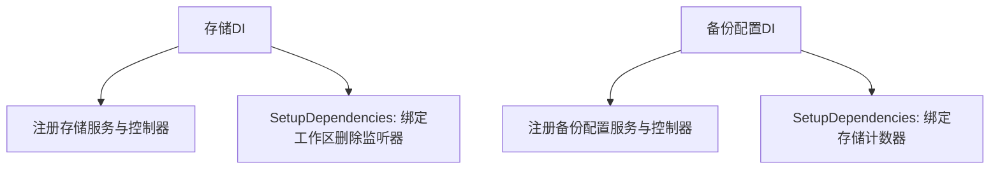
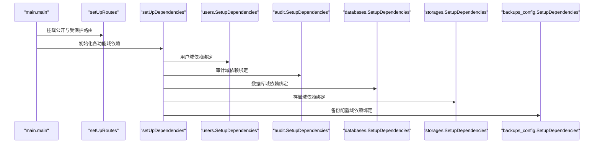
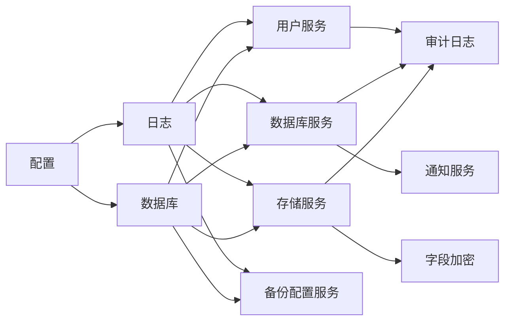

# 依赖注入

<cite>
**本文引用的文件**
- [backend/cmd/main.go](file://backend/cmd/main.go)
- [backend/internal/config/config.go](file://backend/internal/config/config.go)
- [backend/internal/storage/storage.go](file://backend/internal/storage/storage.go)
- [backend/internal/util/logger/logger.go](file://backend/internal/util/logger/logger.go)
- [backend/internal/features/audit_logs/di.go](file://backend/internal/features/audit_logs/di.go)
- [backend/internal/features/users/services/di.go](file://backend/internal/features/users/services/di.go)
- [backend/internal/features/users/services/user_services.go](file://backend/internal/features/users/services/user_services.go)
- [backend/internal/features/users/interfaces/interfaces.go](file://backend/internal/features/users/interfaces/interfaces.go)
- [backend/internal/features/databases/di.go](file://backend/internal/features/databases/di.go)
- [backend/internal/features/databases/service.go](file://backend/internal/features/databases/service.go)
- [backend/internal/features/databases/interfaces.go](file://backend/internal/features/databases/interfaces.go)
- [backend/internal/features/storages/di.go](file://backend/internal/features/storages/di.go)
- [backend/internal/features/backups/config/di.go](file://backend/internal/features/backups/config/di.go)
</cite>

## 目录
1. [引言](#引言)
2. [项目结构](#项目结构)
3. [核心组件](#核心组件)
4. [架构总览](#架构总览)
5. [详细组件分析](#详细组件分析)
6. [依赖分析](#依赖分析)
7. [性能考虑](#性能考虑)
8. [故障排查指南](#故障排查指南)
9. [结论](#结论)
10. [附录](#附录)

## 引言
本文件面向Databasus后端的依赖注入与服务编排，系统性梳理基于Go语言的依赖注入模式：服务注册、依赖解析与生命周期管理。重点覆盖用户服务、数据库服务、备份配置服务、存储服务等模块的依赖初始化流程；解释单例模式的应用、工厂模式的使用以及接口抽象的设计原则；阐述依赖注入容器的配置方式、服务获取机制与循环依赖的规避策略；并给出接口设计原则、服务解耦策略、测试友好架构与调试技巧、性能优化建议。

## 项目结构
后端入口位于命令行程序，负责环境加载、数据库迁移、目录准备、路由挂载、依赖初始化、后台任务启动与优雅停机。各功能域通过独立的“SetupDependencies”函数完成域内服务注册与跨域依赖绑定；域内服务通过包级变量与GetXxx()函数暴露单例实例；日志、配置、存储等基础设施采用Once初始化保证全局唯一。

**图表来源**
- [backend/cmd/main.go:259-276](file://backend/cmd/main.go#L259-L276)
- [backend/internal/config/config.go:150-155](file://backend/internal/config/config.go#L150-L155)
- [backend/internal/util/logger/logger.go:19-55](file://backend/internal/util/logger/logger.go#L19-L55)
- [backend/internal/storage/storage.go:19-24](file://backend/internal/storage/storage.go#L19-L24)

**章节来源**
- [backend/cmd/main.go:65-137](file://backend/cmd/main.go#L65-L137)
- [backend/internal/config/config.go:150-155](file://backend/internal/config/config.go#L150-L155)
- [backend/internal/util/logger/logger.go:19-55](file://backend/internal/util/logger/logger.go#L19-L55)
- [backend/internal/storage/storage.go:19-24](file://backend/internal/storage/storage.go#L19-L24)

## 核心组件
- 单例与延迟初始化
  - 配置、日志、数据库均采用sync.OnceFunc确保全局唯一且仅初始化一次。
  - 各功能域通过包级变量持有服务实例，并提供GetXxx()函数返回单例引用。
- 接口抽象与解耦
  - 用户服务依赖AuditLogWriter、EmailSender等接口，便于替换实现与测试替身。
  - 数据库服务依赖FieldEncryptor、监听器接口，支持扩展与事件驱动。
- 依赖绑定与生命周期
  - 域内SetupDependencies在应用启动时执行，完成跨域依赖绑定（如设置审计写入器、计数器等）。
  - 后台任务通过上下文取消实现优雅停机。

**章节来源**
- [backend/internal/config/config.go:150-155](file://backend/internal/config/config.go#L150-L155)
- [backend/internal/util/logger/logger.go:19-55](file://backend/internal/util/logger/logger.go#L19-L55)
- [backend/internal/storage/storage.go:19-24](file://backend/internal/storage/storage.go#L19-L24)
- [backend/internal/features/users/services/di.go:9-39](file://backend/internal/features/users/services/di.go#L9-L39)
- [backend/internal/features/databases/di.go:42-45](file://backend/internal/features/databases/di.go#L42-L45)
- [backend/internal/features/audit_logs/di.go:39-43](file://backend/internal/features/audit_logs/di.go#L39-L43)

## 架构总览
下图展示从入口到各功能域的依赖初始化路径与关键交互点：

**图表来源**
- [backend/cmd/main.go:259-276](file://backend/cmd/main.go#L259-L276)
- [backend/internal/config/config.go:150-155](file://backend/internal/config/config.go#L150-L155)
- [backend/internal/util/logger/logger.go:19-55](file://backend/internal/util/logger/logger.go#L19-L55)
- [backend/internal/storage/storage.go:19-24](file://backend/internal/storage/storage.go#L19-L24)
- [backend/internal/features/audit_logs/di.go:39-43](file://backend/internal/features/audit_logs/di.go#L39-L43)
- [backend/internal/features/users/services/di.go:9-39](file://backend/internal/features/users/services/di.go#L9-L39)
- [backend/internal/features/databases/di.go:42-45](file://backend/internal/features/databases/di.go#L42-L45)
- [backend/internal/features/storages/di.go:35-37](file://backend/internal/features/storages/di.go#L35-L37)
- [backend/internal/features/backups/config/di.go:36-38](file://backend/internal/features/backups/config/di.go#L36-L38)

## 详细组件分析

### 用户服务与审计日志的依赖绑定
- 用户服务通过接口注入审计写入器与邮件发送器，便于替换实现与测试。
- 审计日志DI在SetupDependencies中将审计服务注入到用户、设置、管理服务，形成跨域依赖。
- 入口程序在setUpRoutes前调用审计日志DI的SetupDependencies，确保后续服务可写审计。

**图表来源**
- [backend/internal/features/users/services/di.go:9-26](file://backend/internal/features/users/services/di.go#L9-L26)
- [backend/internal/features/users/services/user_services.go:30-45](file://backend/internal/features/users/services/user_services.go#L30-L45)
- [backend/internal/features/users/interfaces/interfaces.go:7-13](file://backend/internal/features/users/interfaces/interfaces.go#L7-L13)
- [backend/internal/features/audit_logs/di.go:10-25](file://backend/internal/features/audit_logs/di.go#L10-L25)

**章节来源**
- [backend/internal/features/users/services/di.go:9-39](file://backend/internal/features/users/services/di.go#L9-L39)
- [backend/internal/features/users/services/user_services.go:30-45](file://backend/internal/features/users/services/user_services.go#L30-L45)
- [backend/internal/features/users/interfaces/interfaces.go:7-13](file://backend/internal/features/users/interfaces/interfaces.go#L7-L13)
- [backend/internal/features/audit_logs/di.go:39-43](file://backend/internal/features/audit_logs/di.go#L39-L43)

### 数据库服务的依赖与监听器模式
- 数据库服务聚合通知、工作区、审计、字段加密等能力，通过监听器接口扩展事件处理。
- DI中将数据库服务注册为单例，并在SetupDependencies中绑定工作区删除监听器与通知计数器。

**图表来源**
- [backend/internal/features/databases/di.go:14-32](file://backend/internal/features/databases/di.go#L14-L32)
- [backend/internal/features/databases/service.go:26-56](file://backend/internal/features/databases/service.go#L26-L56)
- [backend/internal/features/databases/interfaces.go:25-35](file://backend/internal/features/databases/interfaces.go#L25-L35)

**章节来源**
- [backend/internal/features/databases/di.go:42-45](file://backend/internal/features/databases/di.go#L42-L45)
- [backend/internal/features/databases/service.go:26-56](file://backend/internal/features/databases/service.go#L26-L56)
- [backend/internal/features/databases/interfaces.go:25-35](file://backend/internal/features/databases/interfaces.go#L25-L35)

### 存储服务与备份配置的依赖绑定
- 存储服务依赖工作区、审计、字段加密，DI中注册控制器与服务，并在SetupDependencies中绑定工作区删除监听器。
- 备份配置服务依赖数据库、存储、通知、工作区，DI中注册控制器与服务，并在SetupDependencies中绑定存储计数器。

**图表来源**
- [backend/internal/features/storages/di.go:11-37](file://backend/internal/features/storages/di.go#L11-L37)
- [backend/internal/features/backups/config/di.go:12-38](file://backend/internal/features/backups/config/di.go#L12-L38)

**章节来源**
- [backend/internal/features/storages/di.go:35-37](file://backend/internal/features/storages/di.go#L35-L37)
- [backend/internal/features/backups/config/di.go:36-38](file://backend/internal/features/backups/config/di.go#L36-L38)

### 依赖初始化流程（序列）
以下序列展示入口程序如何组织依赖初始化与路由挂载：

**图表来源**
- [backend/cmd/main.go:213-257](file://backend/cmd/main.go#L213-L257)
- [backend/cmd/main.go:259-276](file://backend/cmd/main.go#L259-L276)
- [backend/internal/features/audit_logs/di.go:39-43](file://backend/internal/features/audit_logs/di.go#L39-L43)
- [backend/internal/features/users/services/di.go:9-39](file://backend/internal/features/users/services/di.go#L9-L39)
- [backend/internal/features/databases/di.go:42-45](file://backend/internal/features/databases/di.go#L42-L45)
- [backend/internal/features/storages/di.go:35-37](file://backend/internal/features/storages/di.go#L35-L37)
- [backend/internal/features/backups/config/di.go:36-38](file://backend/internal/features/backups/config/di.go#L36-L38)

## 依赖分析
- 组件耦合与内聚
  - 功能域内部高内聚：每个域通过DI文件集中注册与绑定，降低跨域耦合。
  - 跨域依赖通过接口与Once绑定，避免直接构造外部实例。
- 直接与间接依赖
  - 用户服务依赖审计接口与邮件接口，审计DI在启动时注入具体实现。
  - 数据库服务依赖工作区、通知、审计、加密等多域能力，通过监听器与计数器进行解耦扩展。
- 循环依赖规避
  - 通过接口抽象与延迟绑定（Once）避免编译期循环；启动阶段通过SetupDependencies顺序绑定，确保依赖链稳定。
- 外部依赖与集成点
  - 配置加载、日志、数据库连接均为全局单例，作为所有业务服务的基础依赖。

**图表来源**
- [backend/internal/config/config.go:150-155](file://backend/internal/config/config.go#L150-L155)
- [backend/internal/util/logger/logger.go:19-55](file://backend/internal/util/logger/logger.go#L19-L55)
- [backend/internal/storage/storage.go:19-24](file://backend/internal/storage/storage.go#L19-L24)
- [backend/internal/features/users/services/di.go:9-26](file://backend/internal/features/users/services/di.go#L9-L26)
- [backend/internal/features/databases/di.go:16-26](file://backend/internal/features/databases/di.go#L16-L26)
- [backend/internal/features/storages/di.go:13-19](file://backend/internal/features/storages/di.go#L13-L19)
- [backend/internal/features/backups/config/di.go:14-21](file://backend/internal/features/backups/config/di.go#L14-L21)

**章节来源**
- [backend/internal/config/config.go:150-155](file://backend/internal/config/config.go#L150-L155)
- [backend/internal/util/logger/logger.go:19-55](file://backend/internal/util/logger/logger.go#L19-L55)
- [backend/internal/storage/storage.go:19-24](file://backend/internal/storage/storage.go#L19-L24)
- [backend/internal/features/users/services/di.go:9-26](file://backend/internal/features/users/services/di.go#L9-L26)
- [backend/internal/features/databases/di.go:16-26](file://backend/internal/features/databases/di.go#L16-L26)
- [backend/internal/features/storages/di.go:13-19](file://backend/internal/features/storages/di.go#L13-L19)
- [backend/internal/features/backups/config/di.go:14-21](file://backend/internal/features/backups/config/di.go#L14-L21)

## 性能考虑
- 单例与延迟初始化
  - 配置、日志、数据库均采用Once初始化，避免重复开销与竞态。
- 连接池与日志级别
  - 数据库连接池参数在初始化时设定，减少并发场景下的连接抖动。
  - ORM日志级别设为静默，降低I/O开销。
- 后台任务与优雅停机
  - 使用上下文取消控制后台任务生命周期，避免资源泄漏。
- 中间件与静态资源
  - GZIP压缩与CORS中间件按需启用，生产环境减少不必要的处理。

**章节来源**
- [backend/internal/storage/storage.go:49-54](file://backend/internal/storage/storage.go#L49-L54)
- [backend/cmd/main.go:117-124](file://backend/cmd/main.go#L117-L124)
- [backend/cmd/main.go:376-383](file://backend/cmd/main.go#L376-L383)

## 故障排查指南
- 环境变量与配置
  - 确认.DOTENV加载顺序与必需项（如DATABASE_DSN、ENV_MODE），检查默认值与外部覆盖逻辑。
- 日志与可观测性
  - 启用VictoriaLogs时确认URL、用户名、密码；关闭时通过Once安全关闭。
- 数据库连接
  - 初始化失败会直接退出，检查DSN与网络可达性；关注连接池参数是否合理。
- 依赖未生效
  - 确保setUpDependencies在路由与控制器获取之前执行；核对SetupDependencies中的绑定顺序。
- 后台任务异常
  - 使用panic捕获与日志记录定位问题；结合优雅停机信号验证资源释放。

**章节来源**
- [backend/internal/config/config.go:179-203](file://backend/internal/config/config.go#L179-L203)
- [backend/internal/util/logger/logger.go:58-62](file://backend/internal/util/logger/logger.go#L58-L62)
- [backend/internal/storage/storage.go:35-41](file://backend/internal/storage/storage.go#L35-L41)
- [backend/cmd/main.go:259-276](file://backend/cmd/main.go#L259-L276)
- [backend/cmd/main.go:376-383](file://backend/cmd/main.go#L376-L383)

## 结论
Databasus后端采用“包级单例+接口抽象+Once初始化”的轻量依赖注入模式：以入口程序为调度中心，通过各功能域DI文件集中注册与绑定，辅以外部基础设施（配置、日志、数据库）的全局单例，形成清晰、可测试、可扩展的架构。该模式在不引入复杂容器的前提下，实现了服务解耦、生命周期可控与可观测性增强。

## 附录
- 最佳实践清单
  - 优先使用接口抽象，避免直接依赖具体实现。
  - 将跨域依赖绑定集中在SetupDependencies，保持启动顺序明确。
  - 对外暴露GetXxx()单例函数，统一服务获取入口。
  - 使用Once初始化确保全局唯一与线程安全。
  - 在后台任务中使用上下文取消，配合优雅停机。
  - 为关键服务提供测试替身（Mock），提升单元测试覆盖率。
- 调试技巧
  - 开启panic日志与堆栈追踪，快速定位后台任务异常。
  - 利用日志中间件捕获HTTP请求异常，保留上下文信息。
  - 分阶段验证依赖绑定，先验证接口可用性，再验证业务流程。