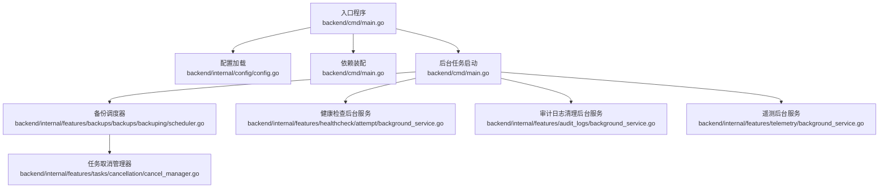
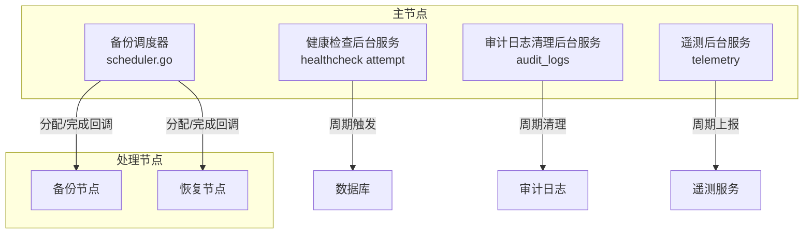
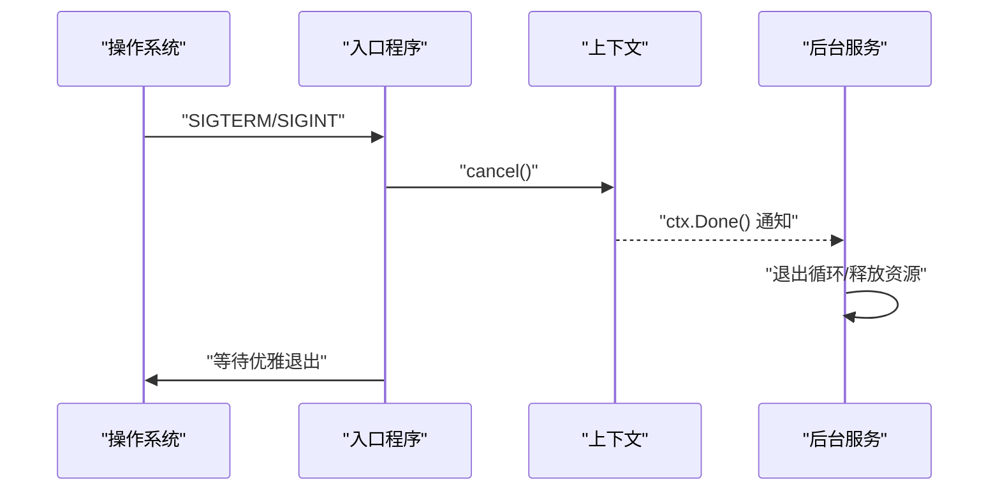
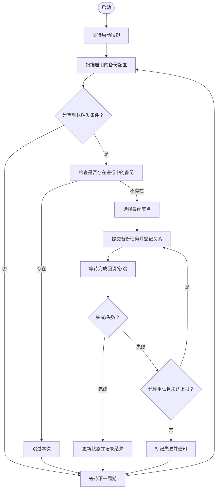
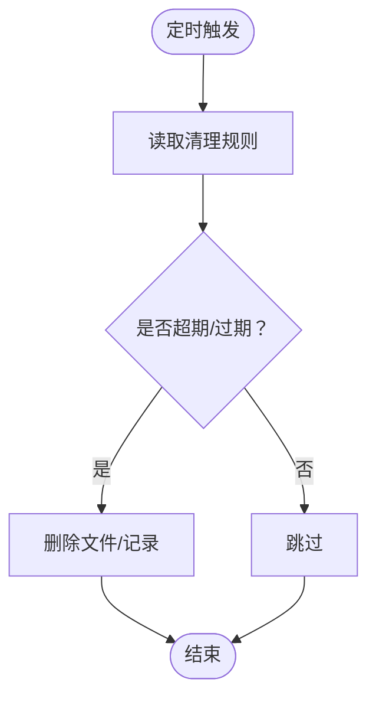
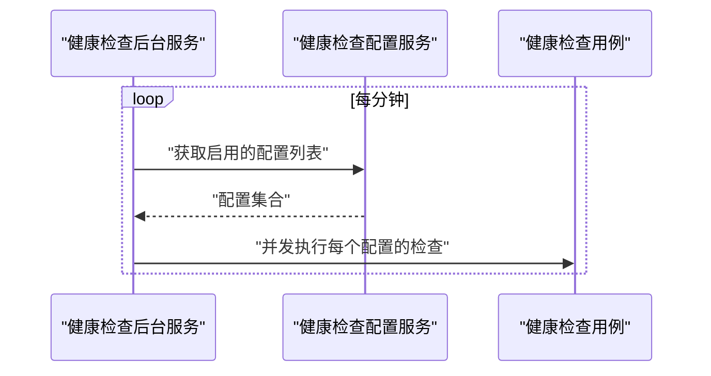
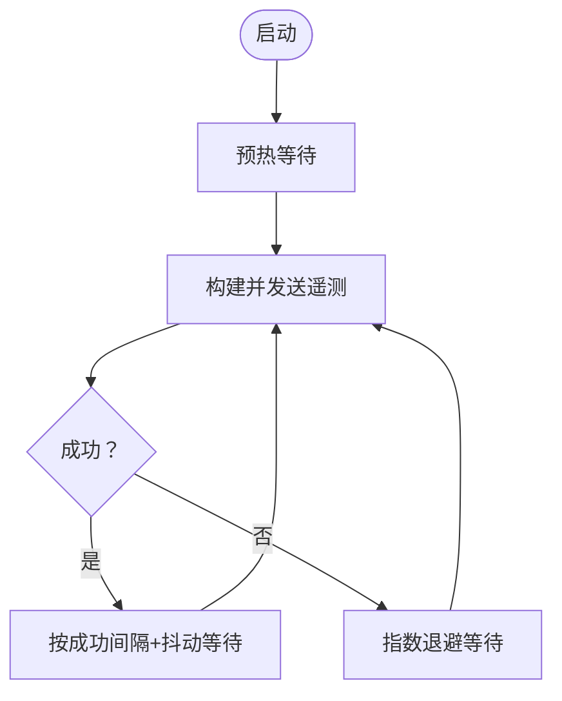
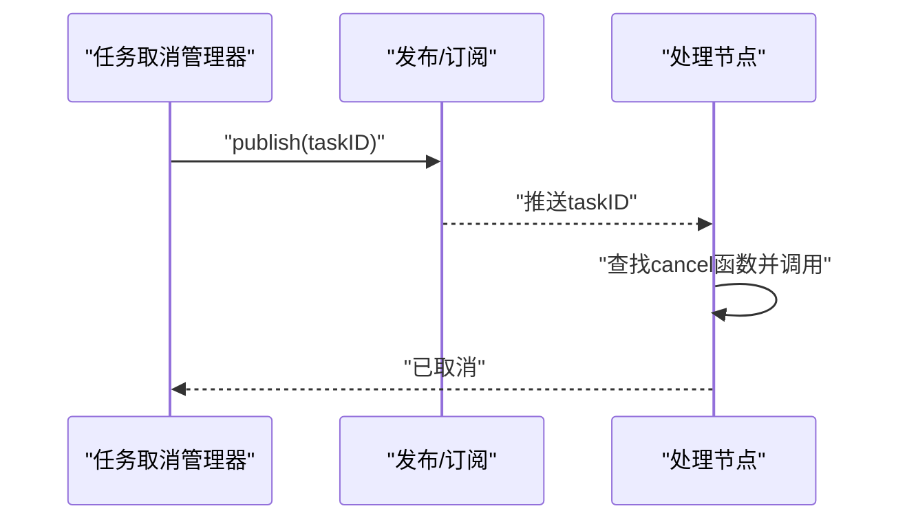
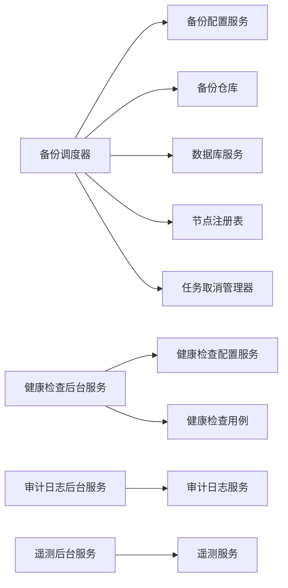

# 后台任务管理

<cite>
**本文引用的文件**
- [backend/cmd/main.go](file://backend/cmd/main.go)
- [backend/internal/config/config.go](file://backend/internal/config/config.go)
- [backend/internal/config/signals.go](file://backend/internal/config/signals.go)
- [backend/internal/features/audit_logs/background_service.go](file://backend/internal/features/audit_logs/background_service.go)
- [backend/internal/features/healthcheck/attempt/background_service.go](file://backend/internal/features/healthcheck/attempt/background_service.go)
- [backend/internal/features/telemetry/background_service.go](file://backend/internal/features/telemetry/background_service.go)
- [backend/internal/features/backups/backups/backuping/scheduler.go](file://backend/internal/features/backups/backups/backuping/scheduler.go)
- [backend/internal/features/tasks/cancellation/cancel_manager.go](file://backend/internal/features/tasks/cancellation/cancel_manager.go)
</cite>

## 目录
1. [简介](#简介)
2. [项目结构](#项目结构)
3. [核心组件](#核心组件)
4. [架构总览](#架构总览)
5. [详细组件分析](#详细组件分析)
6. [依赖分析](#依赖分析)
7. [性能考虑](#性能考虑)
8. [故障排除指南](#故障排除指南)
9. [结论](#结论)
10. [附录](#附录)

## 简介
本文件面向Databasus后端的后台任务管理系统，系统性阐述基于context.Context的任务生命周期管理、优雅关闭、并发与资源控制、错误处理与重试策略，并覆盖主节点与处理节点的任务分工与协调机制。文档聚焦以下任务类型：备份调度任务、清理任务（审计日志、下载令牌、临时文件）、健康检查任务、通知与遥测任务，以及任务取消与重试策略。

## 项目结构
后端入口在命令行程序中集中初始化环境、路由、依赖注入与后台任务；配置模块负责多节点模式与运行参数；各功能域通过独立的后台服务实现定时或事件驱动的任务执行；任务取消通过发布/订阅通道实现跨进程/协程的优雅中断。

图表来源
- [backend/cmd/main.go:293-374](file://backend/cmd/main.go#L293-L374)
- [backend/internal/config/config.go:48-52](file://backend/internal/config/config.go#L48-L52)
- [backend/internal/features/backups/backups/backuping/scheduler.go:42-94](file://backend/internal/features/backups/backups/backuping/scheduler.go#L42-L94)
- [backend/internal/features/healthcheck/attempt/background_service.go:21-40](file://backend/internal/features/healthcheck/attempt/background_service.go#L21-L40)
- [backend/internal/features/audit_logs/background_service.go:18-42](file://backend/internal/features/audit_logs/background_service.go#L18-L42)
- [backend/internal/features/telemetry/background_service.go:50-83](file://backend/internal/features/telemetry/background_service.go#L50-L83)
- [backend/internal/features/tasks/cancellation/cancel_manager.go:22-49](file://backend/internal/features/tasks/cancellation/cancel_manager.go#L22-L49)

章节来源
- [backend/cmd/main.go:293-374](file://backend/cmd/main.go#L293-L374)
- [backend/internal/config/config.go:48-52](file://backend/internal/config/config.go#L48-L52)

## 核心组件
- 上下文与信号
  - 入口程序创建可取消上下文，并监听SIGTERM/SIGINT，触发所有后台任务的优雅退出。
  - 配置模块提供全局环境变量，决定是否作为主节点、处理节点、网络吞吐等。
  - 信号工具提供全局shutdown标记，便于其他组件感知停机状态。
- 后台服务
  - 备份调度器：周期扫描备份配置，按策略选择处理节点，提交备份任务并跟踪完成与失败。
  - 健康检查后台服务：周期拉取启用的数据库健康检查配置，异步触发健康检查用例。
  - 审计日志后台服务：定时清理过期审计日志。
  - 遥测后台服务：带退避与抖动的周期性遥测上报。
- 任务取消
  - 通过发布/订阅通道广播任务ID，持有对应cancel函数的消费者收到消息后立即取消任务。

章节来源
- [backend/cmd/main.go:293-374](file://backend/cmd/main.go#L293-L374)
- [backend/internal/config/config.go:48-52](file://backend/internal/config/config.go#L48-L52)
- [backend/internal/config/signals.go:11-23](file://backend/internal/config/signals.go#L11-L23)
- [backend/internal/features/audit_logs/background_service.go:18-42](file://backend/internal/features/audit_logs/background_service.go#L18-L42)
- [backend/internal/features/healthcheck/attempt/background_service.go:21-40](file://backend/internal/features/healthcheck/attempt/background_service.go#L21-L40)
- [backend/internal/features/telemetry/background_service.go:50-83](file://backend/internal/features/telemetry/background_service.go#L50-L83)
- [backend/internal/features/tasks/cancellation/cancel_manager.go:22-49](file://backend/internal/features/tasks/cancellation/cancel_manager.go#L22-L49)

## 架构总览
Databasus采用“主节点+处理节点”的分布式后台任务模型：
- 主节点负责任务编排、调度、清理与监控，不直接执行备份/恢复等重负载操作。
- 处理节点负责实际的备份/恢复执行，接收来自主节点的任务分配与完成回调。
- 所有后台任务均以Run(ctx)形式运行，统一通过context取消信号实现优雅关闭。

图表来源
- [backend/internal/features/backups/backups/backuping/scheduler.go:42-94](file://backend/internal/features/backups/backups/backuping/scheduler.go#L42-L94)
- [backend/internal/features/healthcheck/attempt/background_service.go:21-40](file://backend/internal/features/healthcheck/attempt/background_service.go#L21-L40)
- [backend/internal/features/audit_logs/background_service.go:18-42](file://backend/internal/features/audit_logs/background_service.go#L18-L42)
- [backend/internal/features/telemetry/background_service.go:50-83](file://backend/internal/features/telemetry/background_service.go#L50-L83)

## 详细组件分析

### 基于context.Context的任务生命周期
- 生命周期阶段
  - 初始化：入口创建根上下文与取消函数，注册信号处理器。
  - 运行：各后台服务在独立goroutine中循环执行，使用select监听ctx.Done()。
  - 关闭：收到信号后调用cancel()，后台服务在下次tick或阻塞点返回。
- 优雅关闭流程

图表来源
- [backend/cmd/main.go:175-211](file://backend/cmd/main.go#L175-L211)
- [backend/cmd/main.go:293-306](file://backend/cmd/main.go#L293-L306)

章节来源
- [backend/cmd/main.go:175-211](file://backend/cmd/main.go#L175-L211)
- [backend/cmd/main.go:293-306](file://backend/cmd/main.go#L293-L306)

### 备份调度任务
- 调度策略
  - 启动时等待若干分钟，避免多节点竞争。
  - 每分钟扫描一次启用的备份配置，结合最近一次备份时间与重试窗口判断是否触发。
  - 对每个数据库仅允许一个进行中的备份，避免重复执行。
  - 依据节点可用性与吞吐计算“最闲节点”，分配备份任务。
- 错误处理与重试
  - 应用重启时会取消并标记进行中的备份为失败，确保一致性。
  - 失败备份根据配置决定是否重试，统计最近N次失败数量，不超过上限则允许重试。
- 节点健康与回收
  - 定期检测死节点，将关联的进行中备份标记为失败并释放计数。
- 任务取消
  - 通过任务取消管理器向处理节点广播取消指令，处理节点收到后立即终止执行。

图表来源
- [backend/internal/features/backups/backups/backuping/scheduler.go:42-94](file://backend/internal/features/backups/backups/backuping/scheduler.go#L42-L94)
- [backend/internal/features/backups/backups/backuping/scheduler.go:320-397](file://backend/internal/features/backups/backups/backuping/scheduler.go#L320-L397)
- [backend/internal/features/backups/backups/backuping/scheduler.go:442-488](file://backend/internal/features/backups/backups/backuping/scheduler.go#L442-L488)
- [backend/internal/features/backups/backups/backuping/scheduler.go:490-549](file://backend/internal/features/backups/backups/backuping/scheduler.go#L490-L549)
- [backend/internal/features/tasks/cancellation/cancel_manager.go:58-69](file://backend/internal/features/tasks/cancellation/cancel_manager.go#L58-L69)

章节来源
- [backend/internal/features/backups/backups/backuping/scheduler.go:42-94](file://backend/internal/features/backups/backups/backuping/scheduler.go#L42-L94)
- [backend/internal/features/backups/backups/backuping/scheduler.go:320-397](file://backend/internal/features/backups/backups/backuping/scheduler.go#L320-L397)
- [backend/internal/features/backups/backups/backuping/scheduler.go:442-488](file://backend/internal/features/backups/backups/backuping/scheduler.go#L442-L488)
- [backend/internal/features/backups/backups/backuping/scheduler.go:490-549](file://backend/internal/features/backups/backups/backuping/scheduler.go#L490-L549)
- [backend/internal/features/tasks/cancellation/cancel_manager.go:58-69](file://backend/internal/features/tasks/cancellation/cancel_manager.go#L58-L69)

### 清理任务
- 审计日志清理
  - 每小时执行一次，清理过期审计日志，避免数据库膨胀。
- 下载令牌清理
  - 在入口处启动前清理临时目录，保证磁盘空间。
- 临时文件清理
  - 后台服务启动后定期清理临时目录，防止碎片堆积。

图表来源
- [backend/internal/features/audit_logs/background_service.go:18-42](file://backend/internal/features/audit_logs/background_service.go#L18-L42)
- [backend/cmd/main.go:308-311](file://backend/cmd/main.go#L308-L311)

章节来源
- [backend/internal/features/audit_logs/background_service.go:18-42](file://backend/internal/features/audit_logs/background_service.go#L18-L42)
- [backend/cmd/main.go:308-311](file://backend/cmd/main.go#L308-L311)

### 健康检查任务
- 触发频率：每分钟一次。
- 行为：拉取启用的数据库健康检查配置，对每个配置异步触发健康检查用例。
- 并发：对每个数据库独立goroutine执行，避免相互阻塞。

图表来源
- [backend/internal/features/healthcheck/attempt/background_service.go:21-40](file://backend/internal/features/healthcheck/attempt/background_service.go#L21-L40)

章节来源
- [backend/internal/features/healthcheck/attempt/background_service.go:21-40](file://backend/internal/features/healthcheck/attempt/background_service.go#L21-L40)

### 通知与遥测任务
- 遥测服务
  - 启动预热期后开始周期性上报，成功间隔与失败指数退避结合，加入抖动避免风暴。
  - 支持禁用匿名遥测的配置开关。
- 通知
  - 备份调度器在应用重启或节点异常时，会向相关存储/通知渠道发送失败通知，确保可观测性。

图表来源
- [backend/internal/features/telemetry/background_service.go:50-83](file://backend/internal/features/telemetry/background_service.go#L50-L83)
- [backend/internal/features/telemetry/background_service.go:85-100](file://backend/internal/features/telemetry/background_service.go#L85-L100)
- [backend/internal/features/telemetry/background_service.go:102-109](file://backend/internal/features/telemetry/background_service.go#L102-L109)

章节来源
- [backend/internal/features/telemetry/background_service.go:50-83](file://backend/internal/features/telemetry/background_service.go#L50-L83)
- [backend/internal/features/telemetry/background_service.go:85-100](file://backend/internal/features/telemetry/background_service.go#L85-L100)
- [backend/internal/features/telemetry/background_service.go:102-109](file://backend/internal/features/telemetry/background_service.go#L102-L109)

### 任务取消与重试策略
- 取消机制
  - 任务取消管理器维护任务ID到cancel函数的映射，通过发布/订阅通道广播任务ID。
  - 接收方在收到消息后立即调用cancel函数，确保快速响应。
- 重试策略
  - 备份调度器根据最近N次失败次数与配置的重试上限决定剩余重试次数。
  - 失败时可选择是否跳过重试（如订阅到期），并生成失败记录与通知。

图表来源
- [backend/internal/features/tasks/cancellation/cancel_manager.go:22-49](file://backend/internal/features/tasks/cancellation/cancel_manager.go#L22-L49)
- [backend/internal/features/tasks/cancellation/cancel_manager.go:58-69](file://backend/internal/features/tasks/cancellation/cancel_manager.go#L58-L69)

章节来源
- [backend/internal/features/tasks/cancellation/cancel_manager.go:22-49](file://backend/internal/features/tasks/cancellation/cancel_manager.go#L22-L49)
- [backend/internal/features/tasks/cancellation/cancel_manager.go:58-69](file://backend/internal/features/tasks/cancellation/cancel_manager.go#L58-L69)
- [backend/internal/features/backups/backups/backuping/scheduler.go:275-318](file://backend/internal/features/backups/backups/backuping/scheduler.go#L275-L318)

### 并发控制、资源限制与性能监控
- 并发控制
  - 健康检查对每个数据库独立goroutine执行，避免串行瓶颈。
  - 备份调度器在提交任务前检查进行中备份，避免重复执行。
- 资源限制
  - 节点选择时考虑吞吐量与活跃备份数，计算得分以选择最闲节点，均衡负载。
  - 通过环境变量设置节点网络吞吐上限，默认125MB/s。
- 性能监控
  - 遥测服务内置退避与抖动，降低网络波动影响。
  - 审计日志清理与临时文件清理减少I/O压力与存储占用。

章节来源
- [backend/internal/features/healthcheck/attempt/background_service.go:52-58](file://backend/internal/features/healthcheck/attempt/background_service.go#L52-L58)
- [backend/internal/features/backups/backups/backuping/scheduler.go:442-488](file://backend/internal/features/backups/backups/backuping/scheduler.go#L442-L488)
- [backend/internal/config/config.go:282-284](file://backend/internal/config/config.go#L282-L284)
- [backend/internal/features/telemetry/background_service.go:14-20](file://backend/internal/features/telemetry/background_service.go#L14-L20)

### 配置选项、调度算法与优先级管理
- 配置项
  - 多节点模式开关：IS_MANY_NODES_MODE、IS_PRIMARY_NODE、IS_PROCESSING_NODE。
  - 节点网络吞吐：NODE_NETWORK_THROUGHPUT_MBPS。
  - 匿名遥测开关：IS_DISABLE_ANONYMOUS_TELEMETRY。
- 调度算法
  - 最闲节点选择：以“活跃备份数/吞吐”为评分，吞吐未知时以活跃备份数加权放大惩罚。
- 优先级管理
  - 通过节点吞吐与活跃任务数综合评估，吞吐越高、越空闲的节点优先承接新任务。

章节来源
- [backend/internal/config/config.go:48-52](file://backend/internal/config/config.go#L48-L52)
- [backend/internal/config/config.go:282-284](file://backend/internal/config/config.go#L282-L284)
- [backend/internal/features/backups/backups/backuping/scheduler.go:442-488](file://backend/internal/features/backups/backups/backuping/scheduler.go#L442-L488)

### 主节点与处理节点的任务分工与协调
- 主节点职责
  - 维护备份/恢复调度、健康检查、审计日志清理、遥测上报。
  - 通过节点注册表选择处理节点并跟踪任务完成。
- 处理节点职责
  - 执行备份/恢复任务，接收主节点分配的任务并上报完成。
- 协调机制
  - 主节点在启动时等待冷却，扫描配置并提交任务至节点注册表。
  - 节点完成任务后回调主节点，主节点更新状态并释放计数。

章节来源
- [backend/internal/features/backups/backups/backuping/scheduler.go:49-69](file://backend/internal/features/backups/backups/backuping/scheduler.go#L49-L69)
- [backend/internal/features/backups/backups/backuping/scheduler.go:490-549](file://backend/internal/features/backups/backups/backuping/scheduler.go#L490-L549)

## 依赖分析
- 组件耦合
  - 备份调度器依赖备份配置服务、备份仓库、数据库服务、节点注册表与任务取消管理器。
  - 健康检查后台服务依赖健康检查配置服务与健康检查用例。
  - 遥测后台服务依赖遥测服务与配置模块。
  - 审计日志后台服务依赖审计日志服务。
- 外部依赖
  - 发布/订阅用于任务取消广播。
  - 定时器与ticker用于周期性任务。

图表来源
- [backend/internal/features/backups/backups/backuping/scheduler.go:25-31](file://backend/internal/features/backups/backups/backuping/scheduler.go#L25-L31)
- [backend/internal/features/healthcheck/attempt/background_service.go:13-16](file://backend/internal/features/healthcheck/attempt/background_service.go#L13-L16)
- [backend/internal/features/audit_logs/background_service.go:11-13](file://backend/internal/features/audit_logs/background_service.go#L11-L13)
- [backend/internal/features/telemetry/background_service.go:22-24](file://backend/internal/features/telemetry/background_service.go#L22-L24)

章节来源
- [backend/internal/features/backups/backups/backuping/scheduler.go:25-31](file://backend/internal/features/backups/backups/backuping/scheduler.go#L25-L31)
- [backend/internal/features/healthcheck/attempt/background_service.go:13-16](file://backend/internal/features/healthcheck/attempt/background_service.go#L13-L16)
- [backend/internal/features/audit_logs/background_service.go:11-13](file://backend/internal/features/audit_logs/background_service.go#L11-L13)
- [backend/internal/features/telemetry/background_service.go:22-24](file://backend/internal/features/telemetry/background_service.go#L22-L24)

## 性能考虑
- 定时器与阻塞
  - 使用ticker与select组合，确保在ctx取消时能及时退出。
- 退避与抖动
  - 遥测服务采用指数退避与抖动，降低网络拥塞风险。
- 节点选择
  - 基于吞吐与活跃任务数的评分，避免热点节点过载。
- 清理与缓存
  - 审计日志与临时文件定期清理，减少I/O与存储压力。

## 故障排除指南
- 任务未执行
  - 检查是否为主节点与处理节点模式正确配置。
  - 查看备份配置是否启用、最近一次备份时间与重试窗口。
- 任务卡住
  - 检查节点是否存活，确认节点注册表中的可用节点列表。
  - 通过任务取消管理器发布取消指令，观察是否快速退出。
- 优雅关闭失败
  - 确认信号处理是否生效，检查ctx取消是否在循环中被正确检测。
- 遥测不上传
  - 检查匿名遥测开关，确认网络连通性与退避逻辑是否导致长时间等待。

章节来源
- [backend/internal/config/config.go:48-52](file://backend/internal/config/config.go#L48-L52)
- [backend/internal/features/backups/backups/backuping/scheduler.go:551-633](file://backend/internal/features/backups/backups/backuping/scheduler.go#L551-L633)
- [backend/internal/features/tasks/cancellation/cancel_manager.go:58-69](file://backend/internal/features/tasks/cancellation/cancel_manager.go#L58-L69)
- [backend/internal/features/telemetry/background_service.go:55-58](file://backend/internal/features/telemetry/background_service.go#L55-L58)

## 结论
Databasus的后台任务体系以context为中心，结合定时器、发布/订阅与节点注册表，实现了主-处理节点分离、可扩展、可观测且具备优雅关闭能力的任务编排。通过退避与抖动、节点评分与清理策略，系统在复杂场景下仍能保持稳定与高效。

## 附录
- 关键路径参考
  - 入口与优雅关闭：[backend/cmd/main.go:175-211](file://backend/cmd/main.go#L175-L211)
  - 后台任务启动与节点分工：[backend/cmd/main.go:293-374](file://backend/cmd/main.go#L293-L374)
  - 配置与多节点模式：[backend/internal/config/config.go:48-52](file://backend/internal/config/config.go#L48-L52)
  - 备份调度与重试：[backend/internal/features/backups/backups/backuping/scheduler.go:275-318](file://backend/internal/features/backups/backups/backuping/scheduler.go#L275-L318)
  - 任务取消广播：[backend/internal/features/tasks/cancellation/cancel_manager.go:58-69](file://backend/internal/features/tasks/cancellation/cancel_manager.go#L58-L69)
  - 健康检查与审计清理：[backend/internal/features/healthcheck/attempt/background_service.go:21-40](file://backend/internal/features/healthcheck/attempt/background_service.go#L21-L40), [backend/internal/features/audit_logs/background_service.go:18-42](file://backend/internal/features/audit_logs/background_service.go#L18-L42)
  - 遥测退避与抖动：[backend/internal/features/telemetry/background_service.go:50-83](file://backend/internal/features/telemetry/background_service.go#L50-L83)