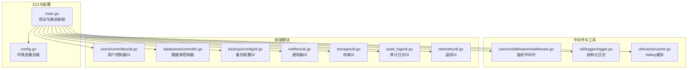
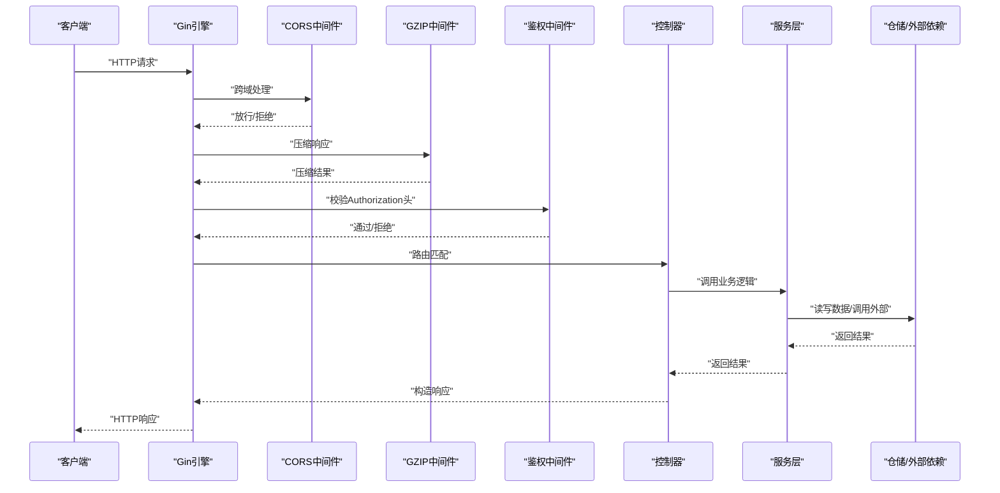
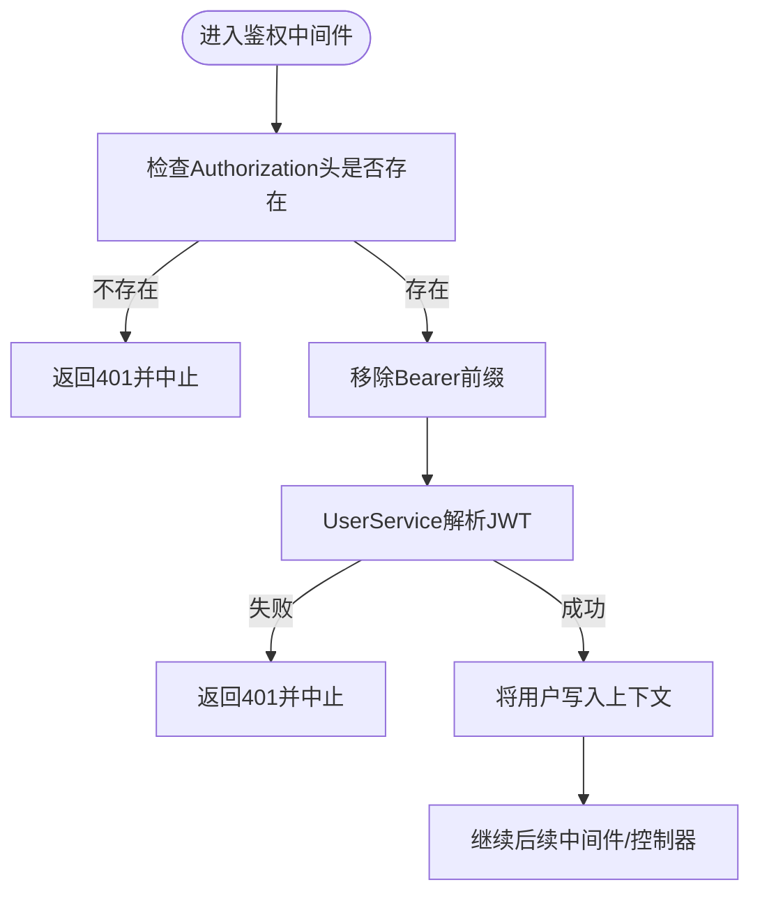
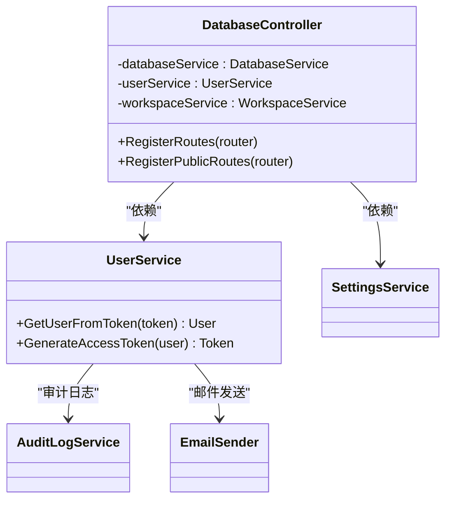
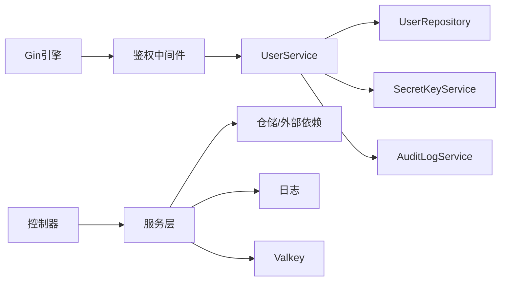

# 后端API服务

<cite>
**本文引用的文件**
- [main.go](file://backend/cmd/main.go)
- [config.go](file://backend/internal/config/config.go)
- [middleware.go](file://backend/internal/features/users/middleware/middleware.go)
- [di.go（用户控制器）](file://backend/internal/features/users/controllers/di.go)
- [controller.go（数据库）](file://backend/internal/features/databases/controller.go)
- [di.go（备份配置）](file://backend/internal/features/backups/config/di.go)
- [user_services.go](file://backend/internal/features/users/services/user_services.go)
- [cache.go](file://backend/internal/util/cache/cache.go)
- [logger.go](file://backend/internal/util/logger/logger.go)
- [di.go（审计日志）](file://backend/internal/features/audit_logs/di.go)
- [di.go（通知器）](file://backend/internal/features/notifiers/di.go)
- [di.go（存储）](file://backend/internal/features/storages/di.go)
- [di.go（遥测）](file://backend/internal/features/telemetry/di.go)
</cite>

## 目录
1. [简介](#简介)
2. [项目结构](#项目结构)
3. [核心组件](#核心组件)
4. [架构总览](#架构总览)
5. [详细组件分析](#详细组件分析)
6. [依赖分析](#依赖分析)
7. [性能考虑](#性能考虑)
8. [故障排查指南](#故障排查指南)
9. [结论](#结论)
10. [附录](#附录)

## 简介
本文件面向Databasus后端API服务，围绕基于Gin框架的RESTful架构进行系统化设计文档梳理。重点覆盖以下方面：
- 路由组织与版本控制：以“/api/v1”为版本前缀，公共路由与受保护路由分离。
- 中间件体系：GZIP压缩、CORS、全局恢复、自定义鉴权中间件。
- 控制器模式与依赖注入：控制器通过包级单例暴露Get方法，服务层在各自模块内完成依赖装配。
- 功能模块化：用户管理、数据库管理、备份管理、存储管理、通知系统等按领域分层。
- 错误处理与日志：统一panic捕获、结构化日志与可选VictoriaLogs远端写入。
- 优雅关闭与后台任务：信号监听、上下文取消传播、后台服务生命周期管理。

## 项目结构
后端采用“入口程序 + 领域模块 + 工具库”的分层组织：
- 入口程序：backend/cmd/main.go负责初始化环境、迁移、中间件、路由注册、依赖装配、后台任务与前端静态资源挂载。
- 配置模块：backend/internal/config 提供环境变量加载与校验。
- 领域模块：每个功能域（如users、databases、backups、storages、notifiers、audit_logs、telemetry等）内部包含controller、service、repository、dto、enums、interfaces等子结构。
- 工具库：backend/internal/util/cache、logger等提供缓存、加密、日志等通用能力。

图表来源
- [main.go:113-137](file://backend/cmd/main.go#L113-L137)
- [config.go:152-204](file://backend/internal/config/config.go#L152-L204)
- [middleware.go:14-38](file://backend/internal/features/users/middleware/middleware.go#L14-L38)
- [logger.go:19-49](file://backend/internal/util/logger/logger.go#L19-L49)
- [cache.go:15-36](file://backend/internal/util/cache/cache.go#L15-L36)
- [di.go（用户控制器）:21-31](file://backend/internal/features/users/controllers/di.go#L21-L31)
- [controller.go（数据库）:20-38](file://backend/internal/features/databases/controller.go#L20-L38)
- [di.go（备份配置）:28-38](file://backend/internal/features/backups/config/di.go#L28-L38)
- [di.go（通知器）:29-43](file://backend/internal/features/notifiers/di.go#L29-L43)
- [di.go（存储）:27-37](file://backend/internal/features/storages/di.go#L27-L37)
- [di.go（审计日志）:35-43](file://backend/internal/features/audit_logs/di.go#L35-L43)
- [di.go（遥测）:40-50](file://backend/internal/features/telemetry/di.go#L40-L50)

章节来源
- [main.go:213-276](file://backend/cmd/main.go#L213-L276)
- [config.go:152-204](file://backend/internal/config/config.go#L152-L204)

## 核心组件
- Gin引擎与中间件
  - 初始化：设置运行模式、接入Logger与自定义Recovery中间件。
  - 压缩：启用GZIP中间件并排除常见二进制扩展名。
  - CORS：开发模式下允许所有源与头部，生产模式下可通过反向代理或网关统一处理。
- 路由组织
  - 版本前缀：/api/v1。
  - 公共路由：登录、健康检查、公开的数据库验证等。
  - 受保护路由：使用鉴权中间件保护。
- 依赖注入
  - 模块内通过包级单例与OnceFunc延迟初始化，避免循环依赖。
  - 控制器持有服务实例，服务实例持有仓储与工具依赖。
- 错误处理与日志
  - 全局Recovery中间件捕获panic并记录堆栈。
  - 结构化日志支持stdout与可选VictoriaLogs远端输出。
- 优雅关闭
  - 监听系统信号，10秒超时优雅关闭HTTP服务器，并关闭日志写入器。
- 后台任务
  - 主节点：备份调度、清理、恢复调度、健康检查尝试、审计日志清理、下载令牌清理、节点注册、计费与遥测。
  - 处理节点：备份节点与恢复节点。
  - 信号触发上下文取消，确保任务可中断。

章节来源
- [main.go:112-137](file://backend/cmd/main.go#L112-L137)
- [main.go:213-257](file://backend/cmd/main.go#L213-L257)
- [main.go:259-276](file://backend/cmd/main.go#L259-L276)
- [main.go:293-374](file://backend/cmd/main.go#L293-L374)
- [main.go:459-476](file://backend/cmd/main.go#L459-L476)
- [logger.go:19-62](file://backend/internal/util/logger/logger.go#L19-L62)

## 架构总览
下图展示了从HTTP请求到业务逻辑执行的完整链路，以及各模块间的依赖关系。

图表来源
- [main.go:112-137](file://backend/cmd/main.go#L112-L137)
- [main.go:213-257](file://backend/cmd/main.go#L213-L257)
- [middleware.go:14-38](file://backend/internal/features/users/middleware/middleware.go#L14-L38)
- [controller.go（数据库）:52-77](file://backend/internal/features/databases/controller.go#L52-L77)

## 详细组件分析

### 路由与版本控制
- 版本前缀：/api/v1。
- 公共路由：用户登录、健康检查、公开数据库验证等。
- 受保护路由：需要鉴权的用户管理、工作区、磁盘、通知器、存储、数据库、备份、恢复、健康检查配置与尝试、备份配置、审计日志、设置、计费等。
- Swagger：在v1组下挂载Swagger UI。

章节来源
- [main.go:213-257](file://backend/cmd/main.go#L213-L257)

### 中间件体系
- GZIP压缩：对文本类内容进行压缩，排除图片、PDF等已压缩格式。
- CORS：开发模式允许通配符源与常用头部；生产模式建议由网关或反向代理统一处理。
- 全局恢复：捕获panic并记录堆栈，返回500。

章节来源
- [main.go:117-124](file://backend/cmd/main.go#L117-L124)
- [main.go:434-457](file://backend/cmd/main.go#L434-L457)
- [main.go:459-476](file://backend/cmd/main.go#L459-L476)

### 鉴权与授权
- 鉴权中间件：从Authorization头提取JWT，去除“Bearer ”前缀，调用UserService解析用户信息并写入上下文。
- 授权中间件：根据用户角色进行权限校验。
- 用户服务：提供签发JWT、从Token解析用户、密码变更、OAuth回调等能力。

图表来源
- [middleware.go:14-38](file://backend/internal/features/users/middleware/middleware.go#L14-L38)
- [user_services.go:185-239](file://backend/internal/features/users/services/user_services.go#L185-L239)

章节来源
- [middleware.go:14-38](file://backend/internal/features/users/middleware/middleware.go#L14-L38)
- [user_services.go:185-239](file://backend/internal/features/users/services/user_services.go#L185-L239)

### 控制器模式与依赖注入
- 控制器：每个功能域提供GetXxxController()单例方法，控制器内部持有服务实例。
- 服务：服务实例在模块内通过OnceFunc初始化，依赖仓储、日志、加密、工作区服务等。
- 示例：数据库控制器注册公共与受保护路由；用户控制器通过包级单例暴露GetUserController()。

图表来源
- [controller.go（数据库）:14-18](file://backend/internal/features/databases/controller.go#L14-L18)
- [di.go（用户控制器）:8-19](file://backend/internal/features/users/controllers/di.go#L8-L19)
- [user_services.go:30-46](file://backend/internal/features/users/services/user_services.go#L30-L46)

章节来源
- [di.go（用户控制器）:21-31](file://backend/internal/features/users/controllers/di.go#L21-L31)
- [controller.go（数据库）:20-38](file://backend/internal/features/databases/controller.go#L20-L38)

### 数据库管理模块
- 路由：创建、更新、删除、查询、连接测试、复制、只读用户、代理令牌验证与重生成等。
- 权限：多数操作需要鉴权；部分公开接口用于代理侧验证。
- 业务：调用DatabaseService执行具体逻辑，如连接测试、只读用户创建、代理令牌重生成等。

章节来源
- [controller.go（数据库）:20-38](file://backend/internal/features/databases/controller.go#L20-L38)
- [controller.go（数据库）:52-77](file://backend/internal/features/databases/controller.go#L52-L77)

### 备份配置模块
- 依赖装配：通过SetupDependencies一次性绑定存储计数器，确保存储与备份配置协同。

章节来源
- [di.go（备份配置）:36-38](file://backend/internal/features/backups/config/di.go#L36-L38)

### 通知系统与存储模块
- 通知器：提供通知器服务与控制器，支持工作区删除事件监听。
- 存储：提供存储服务与控制器，支持工作区删除事件监听。

章节来源
- [di.go（通知器）:41-43](file://backend/internal/features/notifiers/di.go#L41-L43)
- [di.go（存储）:35-37](file://backend/internal/features/storages/di.go#L35-L37)

### 审计日志与遥测
- 审计日志：服务与控制器单例，通过SetupDependencies将审计写入器注入用户、设置、管理服务。
- 遥测：服务与后台服务单例，初始化实例文件加载器与HTTP发送器，收集应用指标并上报。

章节来源
- [di.go（审计日志）:39-43](file://backend/internal/features/audit_logs/di.go#L39-L43)
- [di.go（遥测）:48-50](file://backend/internal/features/telemetry/di.go#L48-L50)

## 依赖分析
- 组件耦合
  - 控制器仅依赖服务，服务依赖仓储与工具，降低控制器复杂度。
  - 鉴权中间件依赖UserService，形成清晰的横切关注点。
- 外部依赖
  - Gin：HTTP框架与路由。
  - Valkey：缓存与键空间操作。
  - 日志：slog与可选VictoriaLogs。
  - JWT：用户鉴权。
- 循环依赖规避
  - 使用包级单例与OnceFunc延迟初始化，避免导入顺序导致的循环依赖。

图表来源
- [main.go:112-137](file://backend/cmd/main.go#L112-L137)
- [middleware.go:14-38](file://backend/internal/features/users/middleware/middleware.go#L14-L38)
- [user_services.go:30-46](file://backend/internal/features/users/services/user_services.go#L30-L46)
- [cache.go:15-36](file://backend/internal/util/cache/cache.go#L15-L36)
- [logger.go:19-49](file://backend/internal/util/logger/logger.go#L19-L49)

章节来源
- [main.go:112-137](file://backend/cmd/main.go#L112-L137)
- [cache.go:15-36](file://backend/internal/util/cache/cache.go#L15-L36)
- [logger.go:19-49](file://backend/internal/util/logger/logger.go#L19-L49)

## 性能考虑
- 压缩策略：对文本类响应启用GZIP，避免对已压缩媒体重复压缩，减少带宽占用。
- 缓存：Valkey作为高性能键值存储，用于会话、速率限制与临时数据，需确保连接参数正确与TLS配置。
- 日志：结构化日志减少解析成本，远端写入可选开启，避免阻塞主路径。
- 后台任务：通过上下文取消实现可中断的后台服务，避免资源泄漏。

## 故障排查指南
- 启动失败
  - 环境变量缺失：确认.env加载与ENV_MODE、DATABASE_DSN、VALKEY_*等关键变量。
  - 迁移失败：查看数据库迁移命令输出，确认驱动与DSN正确。
- 鉴权失败
  - 检查Authorization头是否包含“Bearer ”前缀，确认JWT签名密钥与用户状态。
- 请求异常
  - 查看全局Recovery中间件日志中的堆栈信息，定位panic位置。
- 日志问题
  - 检查VictoriaLogs配置与网络连通性，必要时关闭远端写入以降噪。
- 缓存问题
  - 使用TestCacheConnection验证Valkey连通性与基本读写。

章节来源
- [config.go:152-204](file://backend/internal/config/config.go#L152-L204)
- [main.go:415-432](file://backend/cmd/main.go#L415-L432)
- [main.go:459-476](file://backend/cmd/main.go#L459-L476)
- [logger.go:57-79](file://backend/internal/util/logger/logger.go#L57-L79)
- [cache.go:47-81](file://backend/internal/util/cache/cache.go#L47-L81)

## 结论
该后端API服务以Gin为核心，结合模块化领域设计与简洁的依赖注入模式，实现了清晰的路由分层、可控的中间件链路与稳健的后台任务管理。通过结构化日志与可选远端写入、GZIP压缩与Valkey缓存，兼顾了可观测性与性能。建议在生产环境中统一通过网关或反向代理处理CORS与TLS，并持续完善监控与告警体系。

## 附录
- 环境变量加载流程：从当前目录与后端根目录查找.env，读取并校验关键字段，设置默认值与安装路径。
- 前端静态资源挂载：未命中路由时回退至index.html，便于SPA路由。

章节来源
- [config.go:157-204](file://backend/internal/config/config.go#L157-L204)
- [main.go:478-490](file://backend/cmd/main.go#L478-L490)