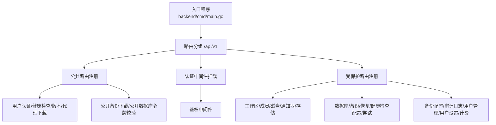
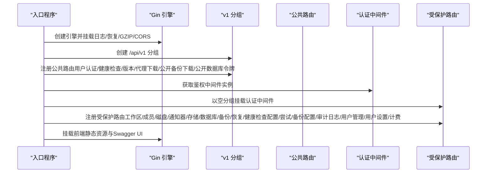
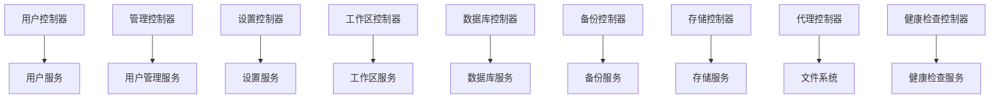
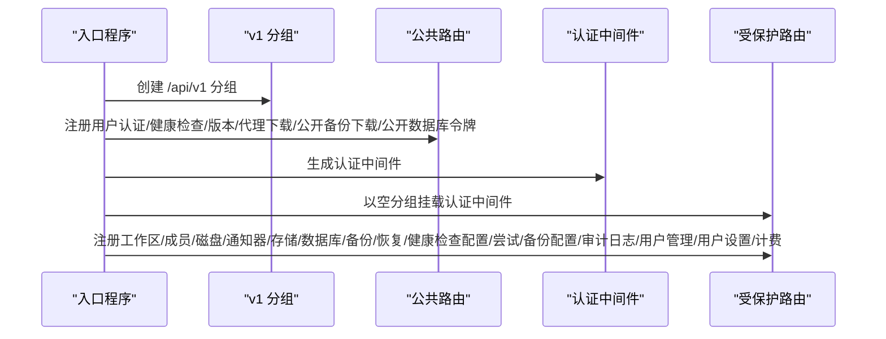

# 路由系统

<cite>
**本文引用的文件**
- [backend/cmd/main.go](file://backend/cmd/main.go)
- [users/controllers/user_controller.go](file://backend/internal/features/users/controllers/user_controller.go)
- [users/controllers/management_controller.go](file://backend/internal/features/users/controllers/management_controller.go)
- [users/controllers/settings_controller.go](file://backend/internal/features/users/controllers/settings_controller.go)
- [system/healthcheck/controller.go](file://backend/internal/features/system/healthcheck/controller.go)
- [system/version/controller.go](file://backend/internal/features/system/version/controller.go)
- [system/agent/controller.go](file://backend/internal/features/system/agent/controller.go)
- [databases/controller.go](file://backend/internal/features/databases/controller.go)
- [backups/backups/controllers/controller.go](file://backend/internal/features/backups/backups/controllers/controller.go)
- [workspaces/controllers/workspace_controller.go](file://backend/internal/features/workspaces/controllers/workspace_controller.go)
- [storages/controller.go](file://backend/internal/features/storages/controller.go)
</cite>

## 目录
1. [简介](#简介)
2. [项目结构](#项目结构)
3. [核心组件](#核心组件)
4. [架构总览](#架构总览)
5. [详细组件分析](#详细组件分析)
6. [依赖关系分析](#依赖关系分析)
7. [性能考量](#性能考量)
8. [故障排查指南](#故障排查指南)
9. [结论](#结论)
10. [附录](#附录)

## 简介
本文件面向Databasus后端路由系统的实现与使用，基于Gin框架构建，采用版本前缀分组（/api/v1）进行路由组织。系统将路由分为“公共路由”和“受保护路由”，通过统一的认证中间件保障安全访问。本文将从路由分组、中间件挂载顺序、注册流程、各功能模块路由定义、参数处理与校验、响应格式化等方面进行深入分析，并提供配置示例、最佳实践、调试技巧与性能优化建议。

## 项目结构
- 入口程序负责初始化日志、缓存、迁移、目录准备、密钥迁移、初始管理员创建、密码重置命令行处理、Swagger生成、Gin引擎配置、CORS启用、路由注册、依赖注入、后台任务启动、前端静态资源挂载以及优雅关闭。
- 路由在入口中按版本分组并注册：先注册公共路由（如用户认证、健康检查、版本、代理下载、公开备份下载、公开数据库令牌校验），再注册认证中间件，最后注册受保护路由（工作区、成员、磁盘、通知器、存储、数据库、备份、恢复、健康检查配置与尝试、备份配置、审计日志、用户管理、用户设置、计费等）。

图表来源
- [backend/cmd/main.go:213-257](file://backend/cmd/main.go#L213-L257)

章节来源
- [backend/cmd/main.go:112-137](file://backend/cmd/main.go#L112-L137)
- [backend/cmd/main.go:213-257](file://backend/cmd/main.go#L213-L257)

## 核心组件
- Gin引擎与中间件
  - 设置运行模式为发布模式，启用日志与自定义恢复中间件。
  - 启用GZIP压缩中间件，排除常见二进制扩展名。
  - 开发环境启用CORS中间件。
  - 挂载Swagger UI（仅在v1分组下）。
- 版本分组与路由注册
  - v1分组作为所有API的根路径，后续所有路由均在此分组下注册。
  - 公共路由优先注册，随后挂载认证中间件，再注册受保护路由。
- 中间件链
  - 日志中间件 → 自定义恢复中间件 → GZIP压缩 → CORS（开发） → 认证中间件（受保护路由）。

章节来源
- [backend/cmd/main.go:112-137](file://backend/cmd/main.go#L112-L137)
- [backend/cmd/main.go:213-257](file://backend/cmd/main.go#L213-L257)
- [backend/cmd/main.go:434-457](file://backend/cmd/main.go#L434-L457)
- [backend/cmd/main.go:459-476](file://backend/cmd/main.go#L459-L476)

## 架构总览
下图展示路由注册的总体流程与分层关系：

图表来源
- [backend/cmd/main.go:213-257](file://backend/cmd/main.go#L213-L257)

## 详细组件分析

### 路由分组与中间件挂载顺序
- 分组策略
  - 使用v1分组承载全部REST接口，便于未来版本演进。
- 中间件顺序
  - 日志 → 恢复 → GZIP → CORS（开发） → 认证中间件（受保护路由）。
- Swagger
  - 在v1分组下挂载Swagger UI，路径为/docs/swagger/*any。

章节来源
- [backend/cmd/main.go:112-137](file://backend/cmd/main.go#L112-L137)
- [backend/cmd/main.go:213-217](file://backend/cmd/main.go#L213-L217)

### 公共路由（无需Bearer认证）
公共路由用于开放能力或具备独立认证机制的场景，例如：
- 用户认证相关：注册、登录、管理员密码设置、密码重置码发送、密码重置、OAuth回调。
- 系统信息：健康检查、版本查询、代理二进制下载。
- 数据库：公开令牌校验。
- 备份：公开下载文件（需下载令牌）。

这些路由在v1分组下直接注册，不附加认证中间件。

章节来源
- [backend/cmd/main.go:219-231](file://backend/cmd/main.go#L219-L231)
- [users/controllers/user_controller.go:24-39](file://backend/internal/features/users/controllers/user_controller.go#L24-L39)
- [system/healthcheck/controller.go:13-15](file://backend/internal/features/system/healthcheck/controller.go#L13-L15)
- [system/version/controller.go:14-16](file://backend/internal/features/system/version/controller.go#L14-L16)
- [system/agent/controller.go:13-15](file://backend/internal/features/system/agent/controller.go#L13-L15)
- [databases/controller.go:36-38](file://backend/internal/features/databases/controller.go#L36-L38)
- [backups/backups/controllers/controller.go:35-39](file://backend/internal/features/backups/backups/controllers/controller.go#L35-L39)

### 受保护路由（需要Bearer认证）
受保护路由在v1分组下以空分组挂载认证中间件，再注册各类业务控制器路由。典型模块：
- 工作区与成员：创建工作区、获取工作区列表、获取工作区详情、更新工作区、删除工作区、获取工作区审计日志。
- 磁盘：磁盘相关操作（具体方法见控制器）。
- 通知器：通知器相关操作（具体方法见控制器）。
- 存储：保存存储、获取存储列表、获取存储详情、删除存储、测试连接、转移至工作区、直连测试。
- 数据库：创建/更新/删除/获取、测试连接、复制、是否被通知器使用、统计、只读用户检测与创建、代理令牌再生。
- 备份：获取备份列表、创建备份、删除备份、取消备份、生成下载令牌、公开下载文件（需令牌）。
- 恢复：恢复相关操作（具体方法见控制器）。
- 健康检查配置与尝试：健康检查配置与尝试记录。
- 备份配置：备份策略配置。
- 审计日志：审计日志查询。
- 用户管理：用户列表、用户档案、停用/启用、变更角色。
- 用户设置：全局用户设置获取与更新。
- 计费：计费相关（云模式下）。

章节来源
- [backend/cmd/main.go:237-256](file://backend/cmd/main.go#L237-L256)
- [workspaces/controllers/workspace_controller.go:22-31](file://backend/internal/features/workspaces/controllers/workspace_controller.go#L22-L31)
- [storages/controller.go:19-27](file://backend/internal/features/storages/controller.go#L19-L27)
- [databases/controller.go:20-34](file://backend/internal/features/databases/controller.go#L20-L34)
- [backups/backups/controllers/controller.go:27-33](file://backend/internal/features/backups/backups/controllers/controller.go#L27-L33)

### 认证中间件与权限控制
- 认证中间件
  - 通过用户服务生成并挂载到受保护路由分组，确保所有受保护路由均需有效Bearer Token。
- 角色权限
  - 部分管理类路由（如用户管理、用户设置）使用角色中间件限制为管理员。

章节来源
- [backend/cmd/main.go:233-239](file://backend/cmd/main.go#L233-L239)
- [users/controllers/management_controller.go:20-38](file://backend/internal/features/users/controllers/management_controller.go#L20-L38)
- [users/controllers/settings_controller.go:18-25](file://backend/internal/features/users/controllers/settings_controller.go#L18-L25)

### 参数处理、查询参数解析与请求体验证
- 路由参数
  - 使用Gin的路径参数绑定（如:id），并在处理器中解析UUID。
- 查询参数
  - 使用ShouldBindQuery解析分页、过滤、日期等查询参数；对非法值进行显式校验与错误返回。
- 请求体
  - 使用ShouldBindJSON解析请求体；对必填字段、长度、格式进行校验；必要时结合DTO结构体约束。
- 响应格式
  - 统一返回JSON；成功返回2xx状态码及相应数据结构；错误返回4xx状态码及错误信息。

示例要点（以具体文件为准）：
- 用户登录/注册：请求体绑定、Cloudflare Turnstile校验、速率限制、生成访问令牌。
- 获取备份列表：查询参数绑定（数据库ID、分页、状态、时间、WAL类型）、过滤器构建。
- 获取工作区审计日志：查询参数绑定（分页、时间）、权限校验。
- 代理下载：查询参数校验（架构枚举）、文件存在性检查、响应头设置。

章节来源
- [users/controllers/user_controller.go:113-158](file://backend/internal/features/users/controllers/user_controller.go#L113-L158)
- [users/controllers/user_controller.go:409-460](file://backend/internal/features/users/controllers/user_controller.go#L409-L460)
- [backups/backups/controllers/controller.go:57-85](file://backend/internal/features/backups/backups/controllers/controller.go#L57-L85)
- [workspaces/controllers/workspace_controller.go:237-268](file://backend/internal/features/workspaces/controllers/workspace_controller.go#L237-L268)
- [system/agent/controller.go:27-48](file://backend/internal/features/system/agent/controller.go#L27-L48)

### 响应格式化与错误处理
- 成功响应
  - 使用HTTP 2xx状态码返回JSON数据；部分无内容操作返回204。
- 错误响应
  - 对参数非法、鉴权失败、权限不足、业务异常等情况返回对应状态码与错误信息。
- 特殊场景
  - 健康检查允许跨域并处理预检请求；备份下载令牌校验失败返回401/409等。

章节来源
- [system/healthcheck/controller.go:25-51](file://backend/internal/features/system/healthcheck/controller.go#L25-L51)
- [backups/backups/controllers/controller.go:242-320](file://backend/internal/features/backups/backups/controllers/controller.go#L242-L320)

### 路由命名规范与RESTful设计
- 路径设计
  - 使用名词复数形式表示集合（如/users、/workspaces、/storages、/databases、/backups），使用:id表示单个资源。
- 动作映射
  - GET/POST/PUT/DELETE分别映射到读取、创建、更新、删除；复杂动作使用子路径（如/:id/test-connection、/:id/cancel）。
- 过滤与分页
  - 使用查询参数实现分页（limit/offset）与过滤（status、beforeDate、pgWalBackupType等）。
- 权限与作用域
  - 管理类接口明确标注所需角色（如管理员），避免越权访问。

章节来源
- [users/controllers/management_controller.go:20-38](file://backend/internal/features/users/controllers/management_controller.go#L20-L38)
- [backups/backups/controllers/controller.go:41-85](file://backend/internal/features/backups/backups/controllers/controller.go#L41-L85)
- [workspaces/controllers/workspace_controller.go:33-96](file://backend/internal/features/workspaces/controllers/workspace_controller.go#L33-L96)

### 路由调试技巧
- Swagger UI
  - 在v1分组下提供/docs/swagger/*any，便于在线查看与测试接口。
- 日志与恢复
  - 启用Gin日志中间件与自定义恢复中间件，捕获panic并记录堆栈信息。
- CORS
  - 开发环境下允许任意来源，便于前端联调；生产环境谨慎放行。
- 参数校验
  - 明确区分查询参数与请求体绑定，对非法输入快速失败并返回清晰错误信息。

章节来源
- [backend/cmd/main.go:213-217](file://backend/cmd/main.go#L213-L217)
- [backend/cmd/main.go:114-115](file://backend/cmd/main.go#L114-L115)
- [backend/cmd/main.go:459-476](file://backend/cmd/main.go#L459-L476)
- [backend/cmd/main.go:434-457](file://backend/cmd/main.go#L434-L457)

## 依赖关系分析
- 控制器到服务层
  - 各控制器通过依赖注入获取服务实例，执行业务逻辑后再封装为HTTP响应。
- 中间件依赖
  - 认证中间件依赖用户服务；角色中间件依赖用户模型与权限枚举。
- 跨模块协作
  - 数据库控制器与工作区服务协作进行权限校验；存储控制器与工作区服务协作进行可见性与权限校验。

图表来源
- [users/controllers/user_controller.go:19-22](file://backend/internal/features/users/controllers/user_controller.go#L19-L22)
- [users/controllers/management_controller.go:16-18](file://backend/internal/features/users/controllers/management_controller.go#L16-L18)
- [users/controllers/settings_controller.go:14-16](file://backend/internal/features/users/controllers/settings_controller.go#L14-L16)
- [workspaces/controllers/workspace_controller.go:18-20](file://backend/internal/features/workspaces/controllers/workspace_controller.go#L18-L20)
- [databases/controller.go:14-18](file://backend/internal/features/databases/controller.go#L14-L18)
- [backups/backups/controllers/controller.go:23-25](file://backend/internal/features/backups/backups/controllers/controller.go#L23-L25)
- [storages/controller.go:14-17](file://backend/internal/features/storages/controller.go#L14-L17)
- [system/agent/controller.go:11](file://backend/internal/features/system/agent/controller.go#L11)
- [system/healthcheck/controller.go:9-11](file://backend/internal/features/system/healthcheck/controller.go#L9-L11)

## 性能考量
- 压缩传输
  - 启用GZIP中间件，减少文本类响应体积；排除常见二进制扩展名避免重复压缩。
- 并发与锁
  - 备份下载并发控制：通过缓存与心跳机制限制每个用户的并发下载，避免资源争用。
- 速率限制
  - 登录与重置密码接口内置速率限制，防止暴力破解与滥用。
- 前端静态资源
  - 未命中路由时回退到index.html，支持SPA路由；静态资源目录可按需调整。

章节来源
- [backend/cmd/main.go:117-124](file://backend/cmd/main.go#L117-L124)
- [users/controllers/user_controller.go:142-149](file://backend/internal/features/users/controllers/user_controller.go#L142-L149)
- [users/controllers/user_controller.go:439-451](file://backend/internal/features/users/controllers/user_controller.go#L439-L451)
- [backups/backups/controllers/controller.go:223-320](file://backend/internal/features/backups/backups/controllers/controller.go#L223-L320)

## 故障排查指南
- 常见问题定位
  - 401/403：确认Bearer Token有效性与角色权限；检查认证中间件是否正确挂载。
  - 400：检查请求体JSON格式、查询参数合法性、UUID格式；查看控制器中的显式校验分支。
  - 409：下载并发冲突或业务冲突，根据控制器返回信息调整重试策略。
  - 500：查看恢复中间件日志，定位panic与堆栈信息。
- 健康检查
  - 健康检查接口允许跨域并处理OPTIONS预检，便于监控工具访问。
- 下载令牌
  - 公开下载接口需携带有效且未过期的下载令牌；若冲突则返回409。

章节来源
- [backend/cmd/main.go:459-476](file://backend/cmd/main.go#L459-L476)
- [system/healthcheck/controller.go:25-51](file://backend/internal/features/system/healthcheck/controller.go#L25-L51)
- [backups/backups/controllers/controller.go:242-320](file://backend/internal/features/backups/backups/controllers/controller.go#L242-L320)

## 结论
Databasus后端路由系统以Gin为核心，采用v1版本分组与清晰的中间件顺序，实现了公共路由与受保护路由的分离。通过认证中间件与角色中间件保障安全性，结合查询参数、请求体与路由参数的严格校验，形成一致的响应格式与错误处理机制。备份下载并发控制、GZIP压缩与速率限制等特性提升了系统可用性与性能。建议在实际部署中结合Swagger进行接口验证，并持续完善日志与监控体系。

## 附录
- 路由注册流程（序列图）

图表来源
- [backend/cmd/main.go:213-257](file://backend/cmd/main.go#L213-L257)