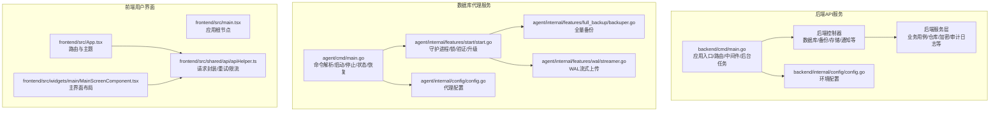
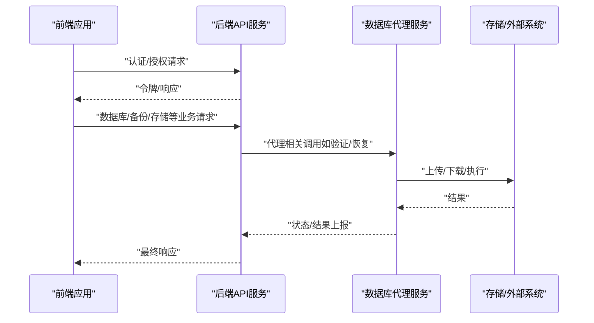
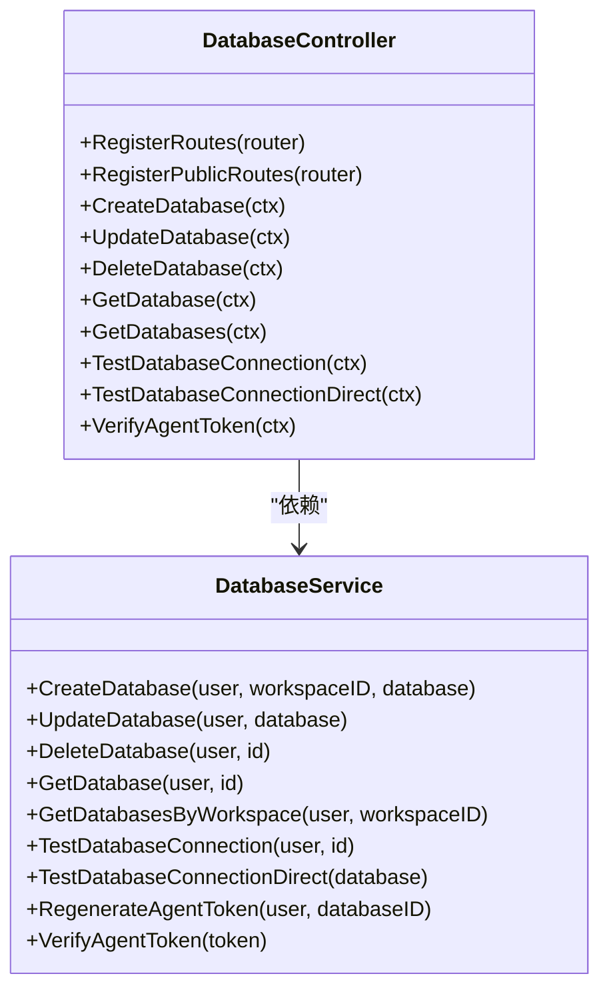
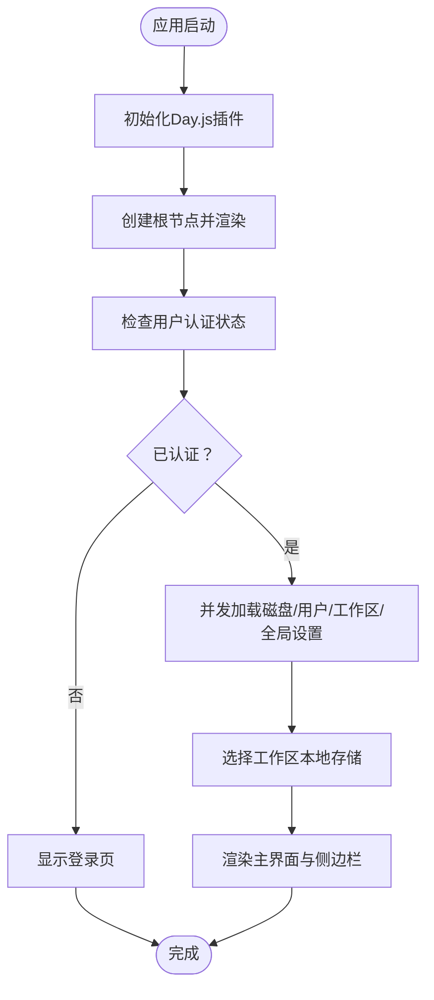
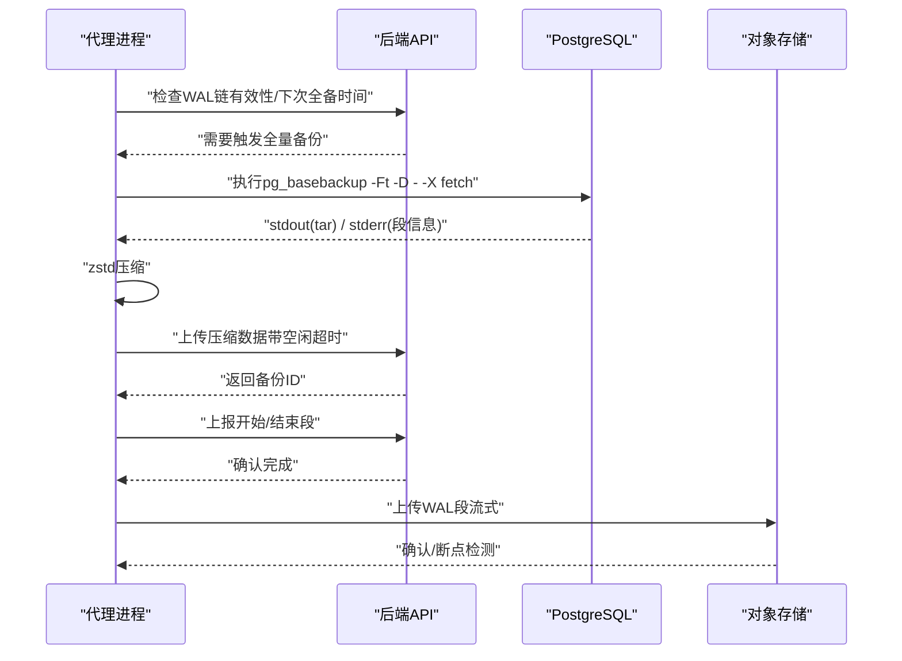
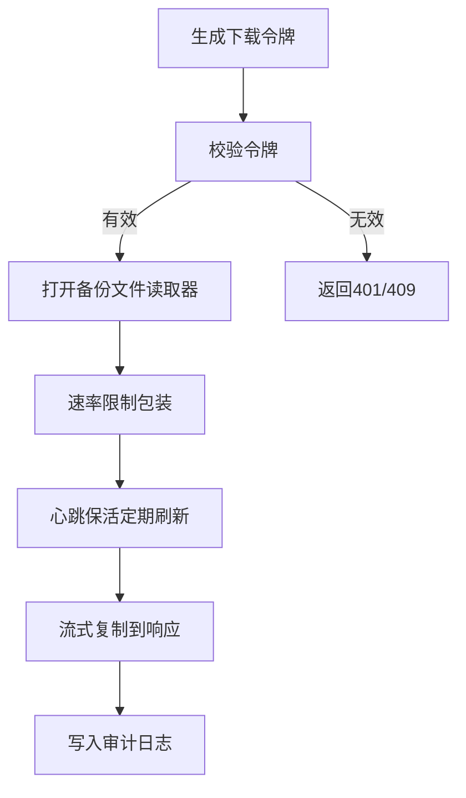
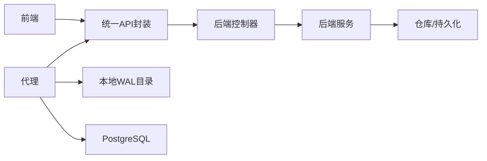

# 组件设计

<cite>
**本文档引用的文件**
- [backend/cmd/main.go](file://backend/cmd/main.go)
- [agent/cmd/main.go](file://agent/cmd/main.go)
- [frontend/src/main.tsx](file://frontend/src/main.tsx)
- [backend/internal/config/config.go](file://backend/internal/config/config.go)
- [agent/internal/config/config.go](file://agent/internal/config/config.go)
- [backend/internal/features/databases/controller.go](file://backend/internal/features/databases/controller.go)
- [agent/internal/features/start/start.go](file://agent/internal/features/start/start.go)
- [backend/internal/features/backups/backups/controllers/controller.go](file://backend/internal/features/backups/backups/controllers/controller.go)
- [frontend/src/App.tsx](file://frontend/src/App.tsx)
- [backend/internal/features/databases/service.go](file://backend/internal/features/databases/service.go)
- [agent/internal/features/full_backup/backuper.go](file://agent/internal/features/full_backup/backuper.go)
- [frontend/src/shared/api/apiHelper.ts](file://frontend/src/shared/api/apiHelper.ts)
- [backend/internal/features/backups/backups/services/service.go](file://backend/internal/features/backups/backups/services/service.go)
- [agent/internal/features/wal/streamer.go](file://agent/internal/features/wal/streamer.go)
- [frontend/src/widgets/main/MainScreenComponent.tsx](file://frontend/src/widgets/main/MainScreenComponent.tsx)
</cite>

## 目录
1. [引言](#引言)
2. [项目结构](#项目结构)
3. [核心组件](#核心组件)
4. [架构总览](#架构总览)
5. [详细组件分析](#详细组件分析)
6. [依赖分析](#依赖分析)
7. [性能考虑](#性能考虑)
8. [故障排查指南](#故障排查指南)
9. [结论](#结论)
10. [附录](#附录)

## 引言
本文件面向Databasus项目的三大核心组件：后端API服务、前端用户界面与数据库代理服务（Agent），系统性阐述其设计理念、模块划分、接口与依赖关系，并给出组件间通信机制、数据流与状态同步策略。文档同时覆盖生命周期管理、错误处理与性能优化建议，并通过多种图示帮助读者理解组件协作过程与演进方向。

## 项目结构
Databasus采用多模块分层架构：
- 后端API服务：基于Gin框架，按功能域拆分为多个特性模块（数据库、备份、通知、存储等），统一在入口处注册路由与依赖。
- 数据库代理服务（Agent）：以命令行工具形式运行，负责WAL归档与全量备份上传、恢复执行与自动升级。
- 前端用户界面：基于React + Ant Design，采用组件化与特性域划分，提供工作区、数据库、存储、通知、设置等功能视图。

**图表来源**
- [backend/cmd/main.go:1-491](file://backend/cmd/main.go#L1-L491)
- [agent/cmd/main.go:1-246](file://agent/cmd/main.go#L1-L246)
- [frontend/src/main.tsx:1-14](file://frontend/src/main.tsx#L1-L14)
- [frontend/src/App.tsx:1-77](file://frontend/src/App.tsx#L1-L77)
- [frontend/src/widgets/main/MainScreenComponent.tsx:1-405](file://frontend/src/widgets/main/MainScreenComponent.tsx#L1-L405)
- [frontend/src/shared/api/apiHelper.ts:1-264](file://frontend/src/shared/api/apiHelper.ts#L1-L264)
- [backend/internal/config/config.go:1-422](file://backend/internal/config/config.go#L1-L422)
- [agent/internal/config/config.go:1-272](file://agent/internal/config/config.go#L1-L272)
- [agent/internal/features/start/start.go:1-326](file://agent/internal/features/start/start.go#L1-L326)
- [agent/internal/features/full_backup/backuper.go:1-317](file://agent/internal/features/full_backup/backuper.go#L1-L317)
- [agent/internal/features/wal/streamer.go:1-205](file://agent/internal/features/wal/streamer.go#L1-L205)

**章节来源**
- [backend/cmd/main.go:1-491](file://backend/cmd/main.go#L1-L491)
- [agent/cmd/main.go:1-246](file://agent/cmd/main.go#L1-L246)
- [frontend/src/main.tsx:1-14](file://frontend/src/main.tsx#L1-L14)

## 核心组件
- 后端API服务：统一HTTP入口，注册公开与受保护路由，装配各特性模块依赖，启动后台任务与静态资源挂载。
- 数据库代理服务：命令行工具，支持启动/停止/状态查询/恢复；守护进程内协调全量备份与WAL流式上传。
- 前端用户界面：单页应用，集中于工作区选择、数据库/存储/通知/设置等视图，统一认证态与主题切换。

**章节来源**
- [backend/cmd/main.go:213-276](file://backend/cmd/main.go#L213-L276)
- [agent/cmd/main.go:24-171](file://agent/cmd/main.go#L24-L171)
- [frontend/src/App.tsx:16-77](file://frontend/src/App.tsx#L16-L77)

## 架构总览
后端API服务作为中枢，承载认证中间件、路由分组与特性模块；代理服务与后端通过REST接口交互；前端通过统一API网关访问后端能力。

**图表来源**
- [backend/internal/features/databases/controller.go:1-505](file://backend/internal/features/databases/controller.go#L1-L505)
- [agent/internal/features/full_backup/backuper.go:164-245](file://agent/internal/features/full_backup/backuper.go#L164-L245)
- [agent/internal/features/wal/streamer.go:123-173](file://agent/internal/features/wal/streamer.go#L123-L173)
- [frontend/src/shared/api/apiHelper.ts:42-61](file://frontend/src/shared/api/apiHelper.ts#L42-L61)

## 详细组件分析

### 后端API服务：模块化架构与依赖注入
- 应用入口负责：
  - 环境变量加载与校验（数据库DSN、Valkey、目录结构等）
  - 首次启动迁移、缓存清理、密钥迁移
  - 初始化Gin引擎、中间件（GZIP、CORS、日志、异常恢复）
  - 注册公开/受保护路由与依赖装配
  - 启动后台任务（备份/恢复/健康检查/审计/计费/遥测等）
  - 挂载前端静态资源
  - 优雅关闭与日志器收尾
- 特性模块通过“控制器-服务-仓库”三层解耦，控制器仅做参数绑定与鉴权，服务层编排业务流程，仓库负责持久化。

**图表来源**
- [backend/internal/features/databases/controller.go:14-38](file://backend/internal/features/databases/controller.go#L14-L38)
- [backend/internal/features/databases/controller.go:52-110](file://backend/internal/features/databases/controller.go#L52-L110)
- [backend/internal/features/databases/service.go:26-38](file://backend/internal/features/databases/service.go#L26-L38)
- [backend/internal/features/databases/service.go:69-116](file://backend/internal/features/databases/service.go#L69-L116)

**章节来源**
- [backend/cmd/main.go:65-137](file://backend/cmd/main.go#L65-L137)
- [backend/cmd/main.go:213-276](file://backend/cmd/main.go#L213-L276)
- [backend/internal/config/config.go:152-422](file://backend/internal/config/config.go#L152-L422)
- [backend/internal/features/databases/controller.go:1-505](file://backend/internal/features/databases/controller.go#L1-L505)
- [backend/internal/features/databases/service.go:1-800](file://backend/internal/features/databases/service.go#L1-L800)

### 前端用户界面：组件化设计与状态管理
- 入口初始化：Day.js扩展、根节点渲染。
- 应用主体：路由与主题配置，OAuth回调与存储授权页面，根据登录态切换主界面或登录页。
- 主界面：侧边栏、工作区选择、磁盘使用提示、标签页切换（数据库/存储/通知/设置/个人资料/全局设置/用户管理）。
- API封装：统一请求方法、重试策略、速率限制、认证头注入与错误处理。

**图表来源**
- [frontend/src/main.tsx:1-14](file://frontend/src/main.tsx#L1-L14)
- [frontend/src/App.tsx:16-77](file://frontend/src/App.tsx#L16-L77)
- [frontend/src/widgets/main/MainScreenComponent.tsx:53-96](file://frontend/src/widgets/main/MainScreenComponent.tsx#L53-L96)
- [frontend/src/shared/api/apiHelper.ts:10-61](file://frontend/src/shared/api/apiHelper.ts#L10-L61)

**章节来源**
- [frontend/src/main.tsx:1-14](file://frontend/src/main.tsx#L1-L14)
- [frontend/src/App.tsx:1-77](file://frontend/src/App.tsx#L1-L77)
- [frontend/src/widgets/main/MainScreenComponent.tsx:1-405](file://frontend/src/widgets/main/MainScreenComponent.tsx#L1-L405)
- [frontend/src/shared/api/apiHelper.ts:1-264](file://frontend/src/shared/api/apiHelper.ts#L1-L264)

### 数据库代理服务：轻量级守护进程与数据通道
- 命令行入口：start/stop/status/restore/version等子命令，支持开发模式检测与自动升级。
- 守护进程：跨平台锁、信号处理、锁监控器；启动时进行PostgreSQL版本与连接验证；后台升级器在非Windows平台启用。
- 全量备份：周期性检查WAL链有效性与计划时间，串行执行pg_basebackup，zstd压缩并通过管道上传，解析stderr获取WAL段范围并最终落库。
- WAL流式上传：定时扫描WAL目录，zstd压缩并上传，超时与空闲超时控制，支持删除已上传段。

**图表来源**
- [agent/cmd/main.go:24-171](file://agent/cmd/main.go#L24-L171)
- [agent/internal/features/start/start.go:33-101](file://agent/internal/features/start/start.go#L33-L101)
- [agent/internal/features/full_backup/backuper.go:85-162](file://agent/internal/features/full_backup/backuper.go#L85-L162)
- [agent/internal/features/full_backup/backuper.go:164-245](file://agent/internal/features/full_backup/backuper.go#L164-L245)
- [agent/internal/features/wal/streamer.go:123-173](file://agent/internal/features/wal/streamer.go#L123-L173)

**章节来源**
- [agent/cmd/main.go:1-246](file://agent/cmd/main.go#L1-L246)
- [agent/internal/config/config.go:1-272](file://agent/internal/config/config.go#L1-L272)
- [agent/internal/features/start/start.go:1-326](file://agent/internal/features/start/start.go#L1-L326)
- [agent/internal/features/full_backup/backuper.go:1-317](file://agent/internal/features/full_backup/backuper.go#L1-L317)
- [agent/internal/features/wal/streamer.go:1-205](file://agent/internal/features/wal/streamer.go#L1-L205)

### 备份下载与并发控制
- 控制器负责生成下载令牌、校验令牌与文件流式传输；服务层负责读取存储文件、按需解密、速率限制与心跳续期。
- 并发控制：基于用户维度的下载锁与心跳，避免并发下载冲突；失败/取消自动释放锁。

**图表来源**
- [backend/internal/features/backups/backups/controllers/controller.go:182-320](file://backend/internal/features/backups/backups/controllers/controller.go#L182-L320)
- [backend/internal/features/backups/backups/services/service.go:385-435](file://backend/internal/features/backups/backups/services/service.go#L385-L435)
- [backend/internal/features/backups/backups/services/service.go:470-484](file://backend/internal/features/backups/backups/services/service.go#L470-L484)

**章节来源**
- [backend/internal/features/backups/backups/controllers/controller.go:1-399](file://backend/internal/features/backups/backups/controllers/controller.go#L1-L399)
- [backend/internal/features/backups/backups/services/service.go:1-538](file://backend/internal/features/backups/backups/services/service.go#L1-L538)

## 依赖分析
- 后端依赖注入：入口集中装配各特性模块依赖，控制器仅依赖服务层，服务层依赖仓库与工具组件，降低耦合度。
- 代理服务：配置驱动，启动阶段完成环境验证与守护进程初始化，后续通过API客户端与后端交互。
- 前端依赖：统一API封装，按需并发加载数据，本地存储工作区选择，主题与国际化通过上下文注入。

**图表来源**
- [frontend/src/shared/api/apiHelper.ts:63-263](file://frontend/src/shared/api/apiHelper.ts#L63-L263)
- [backend/internal/features/databases/controller.go:20-38](file://backend/internal/features/databases/controller.go#L20-L38)
- [agent/internal/features/full_backup/backuper.go:164-245](file://agent/internal/features/full_backup/backuper.go#L164-L245)

**章节来源**
- [frontend/src/shared/api/apiHelper.ts:1-264](file://frontend/src/shared/api/apiHelper.ts#L1-L264)
- [backend/internal/features/databases/controller.go:1-505](file://backend/internal/features/databases/controller.go#L1-L505)
- [agent/internal/features/full_backup/backuper.go:1-317](file://agent/internal/features/full_backup/backuper.go#L1-L317)

## 性能考虑
- 后端
  - 中间件：GZIP压缩、CORS、日志与异常恢复，减少网络传输与提升可观测性。
  - 缓存：启动时清理缓存并测试连接，确保一致性与可用性。
  - 后台任务：按节点角色（主节点/处理节点）差异化启动，避免重复执行。
- 代理
  - 流式压缩：zstd压缩+管道传输，降低内存占用与I/O压力。
  - 超时与空闲超时：防止长时间阻塞，提升稳定性。
  - 并发控制：全量备份串行，避免资源争用。
- 前端
  - 并发加载：Promise.all聚合请求，缩短首屏等待。
  - 速率限制：统一限流，避免频繁请求导致后端压力。
  - 重试策略：指数退避重试，提升弱网容错。

[本节为通用指导，无需特定文件引用]

## 故障排查指南
- 后端
  - 环境变量缺失：入口会严格校验DATABASE_DSN、ENV_MODE、Valkey等，未满足将直接退出。
  - 迁移失败：首次启动执行数据库迁移，失败会记录输出并终止。
  - 优雅关闭：捕获信号，关闭HTTP服务器与日志器，保证资源释放。
- 代理
  - 配置校验：启动前验证Databasus主机、数据库ID、令牌、PostgreSQL主机/端口/用户、类型与WAL目录等。
  - 数据库连通性：验证PostgreSQL版本（最低15）、Ping与版本号解析。
  - 错误上报：备份失败通过API上报错误，按延迟重试直至成功。
- 前端
  - 认证失效：401时清理本地令牌并刷新页面。
  - 服务不可达：502/504统一报错，提示网络问题。
  - 请求重试：默认有限次数与间隔重试，避免瞬时抖动影响体验。

**章节来源**
- [backend/cmd/main.go:139-173](file://backend/cmd/main.go#L139-L173)
- [backend/cmd/main.go:415-432](file://backend/cmd/main.go#L415-L432)
- [agent/internal/features/start/start.go:103-141](file://agent/internal/features/start/start.go#L103-L141)
- [agent/internal/features/start/start.go:207-325](file://agent/internal/features/start/start.go#L207-L325)
- [frontend/src/shared/api/apiHelper.ts:10-40](file://frontend/src/shared/api/apiHelper.ts#L10-L40)

## 结论
Databasus通过清晰的模块化与分层设计，实现了后端API服务的高内聚低耦合、代理服务的轻量可靠与前端界面的组件化体验。组件间通过REST接口与统一API封装协同，具备良好的可扩展性与可维护性。未来可在以下方向演进：增强可观测性（指标/追踪）、引入事件驱动与消息队列、完善多租户隔离与配额治理、扩展更多数据库类型与存储后端。

[本节为总结性内容，无需特定文件引用]

## 附录
- 可扩展性设计
  - 后端：特性模块独立注册与依赖装配，便于新增领域与替换实现。
  - 代理：配置驱动与命令扩展，易于接入新数据库或存储。
  - 前端：特性域组件化与API抽象，便于新增页面与功能。
- 未来演进方向
  - 微服务化：将部分特性模块拆分为独立服务，提升弹性与可扩展性。
  - 自动化运维：增强健康检查、自动扩缩容与故障自愈能力。
  - 多云与混合部署：统一抽象存储与计算资源，支持跨云部署。

[本节为概念性内容，无需特定文件引用]