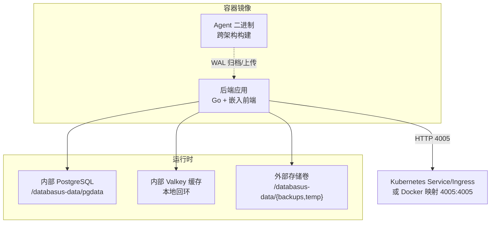
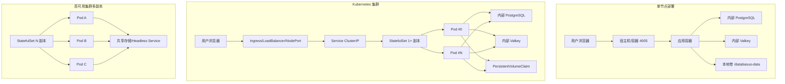
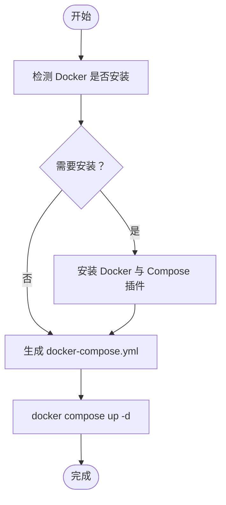
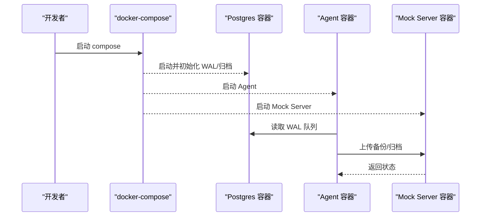
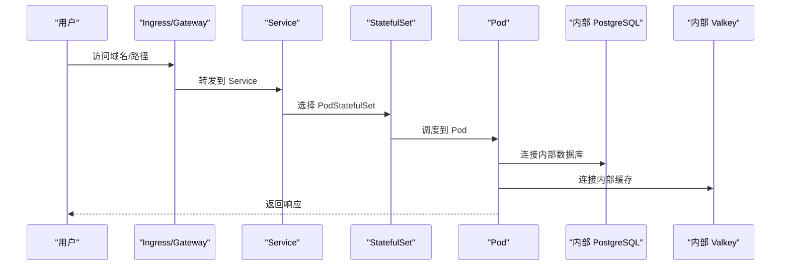
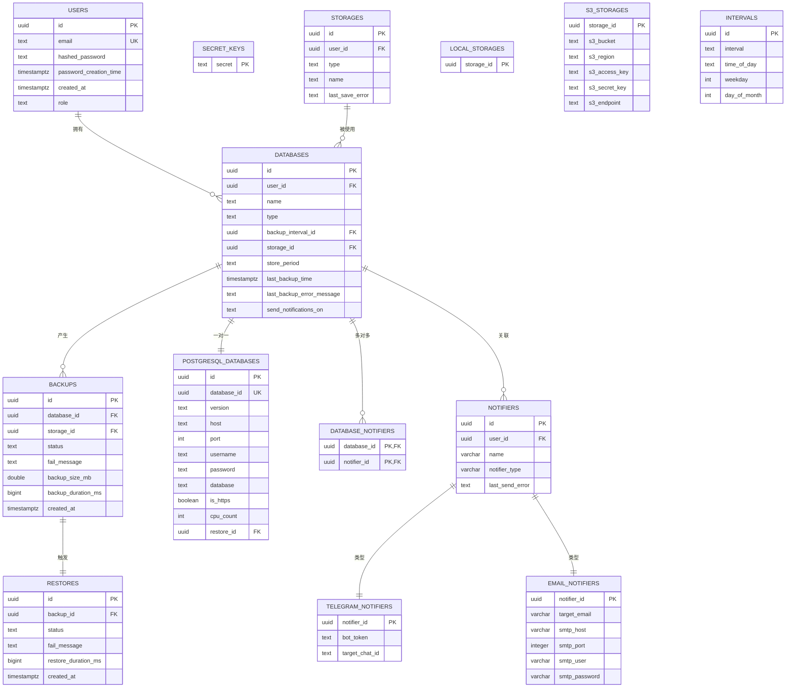
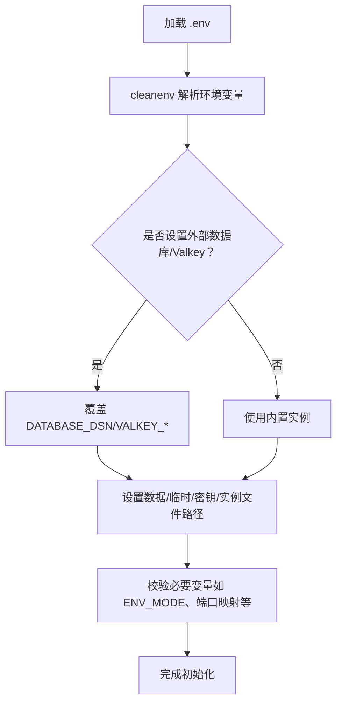
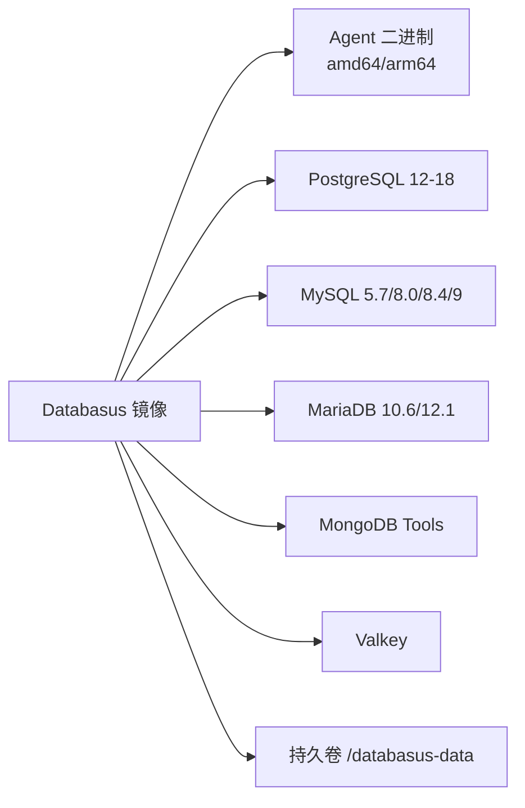
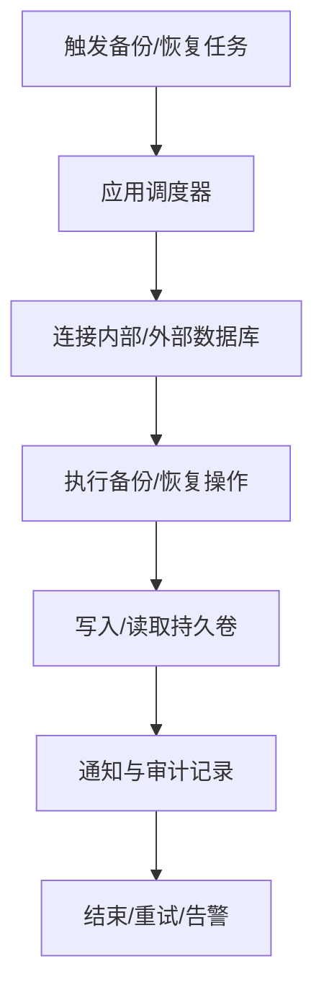

# 部署架构

<cite>
**本文引用的文件**
- [Dockerfile](file://Dockerfile)
- [install-databasus.sh](file://install-databasus.sh)
- [backend/README.md](file://backend/README.md)
- [backend/docker-compose.yml.example](file://backend/docker-compose.yml.example)
- [agent/docker-compose.yml.example](file://agent/docker-compose.yml.example)
- [agent/e2e/docker-compose.yml](file://agent/e2e/docker-compose.yml)
- [agent/e2e/docker-compose.backup-restore.yml](file://agent/e2e/docker-compose.backup-restore.yml)
- [backend/internal/config/config.go](file://backend/internal/config/config.go)
- [agent/internal/config/config.go](file://agent/internal/config/config.go)
- [deploy/helm/Chart.yaml](file://deploy/helm/Chart.yaml)
- [deploy/helm/values.yaml](file://deploy/helm/values.yaml)
- [deploy/helm/templates/statefulset.yaml](file://deploy/helm/templates/statefulset.yaml)
- [deploy/helm/templates/service.yaml](file://deploy/helm/templates/service.yaml)
- [deploy/helm/templates/ingress.yaml](file://deploy/helm/templates/ingress.yaml)
- [deploy/helm/templates/httproute.yaml](file://deploy/helm/templates/httproute.yaml)
- [deploy/helm/README.md](file://deploy/helm/README.md)
- [backend/migrations/20250605090323_init.sql](file://backend/migrations/20250605090323_init.sql)
</cite>

## 目录
1. [简介](#简介)
2. [项目结构](#项目结构)
3. [核心组件](#核心组件)
4. [架构总览](#架构总览)
5. [详细组件分析](#详细组件分析)
6. [依赖关系分析](#依赖关系分析)
7. [性能考虑](#性能考虑)
8. [故障排查指南](#故障排查指南)
9. [结论](#结论)
10. [附录](#附录)

## 简介
本文件面向运维与平台工程团队，系统性阐述 Databasus 的部署架构与实施路径，覆盖单节点部署、高可用集群部署、容器化部署（含 Docker Compose 与 Kubernetes Helm）等多场景，并给出负载均衡、服务发现、存储持久化、监控告警、日志收集、备份恢复、性能调优与容量规划等关键主题的最佳实践。

## 项目结构
Databasus 采用前后端分离与统一镜像打包的容器化架构：
- 后端服务：Go 编写，内置前端静态资源，提供 Web API、数据库管理、备份/恢复调度、通知与存储适配等功能。
- 前端：React/Vite 构建产物嵌入后端镜像，通过后端统一暴露。
- Agent：独立可执行程序，负责远程 PostgreSQL 的 WAL 拉取、归档与上传，支持主机与 Docker 两种采集模式。
- 部署模板：Helm Chart、Docker Compose 示例、安装脚本与环境变量配置。

图表来源
- [Dockerfile:107-546](file://Dockerfile#L107-L546)
- [backend/internal/config/config.go:33-41](file://backend/internal/config/config.go#L33-L41)
- [deploy/helm/templates/statefulset.yaml:55-63](file://deploy/helm/templates/statefulset.yaml#L55-L63)

章节来源
- [Dockerfile:107-546](file://Dockerfile#L107-L546)
- [backend/internal/config/config.go:33-41](file://backend/internal/config/config.go#L33-L41)

## 核心组件
- 应用容器
  - 统一镜像包含后端、前端、内置 PostgreSQL 与 Valkey、数据库迁移工具、多种数据库客户端工具集。
  - 暴露端口 4005；数据目录 /databasus-data。
- 内部数据库与缓存
  - 内置 PostgreSQL 17 与 Valkey，用于应用元数据与缓存，不对外暴露。
- 外部存储
  - 通过挂载卷提供备份与临时文件持久化。
- Agent
  - 跨架构编译（amd64/arm64），按需从后端下载对应版本。
  - 支持主机与 Docker 两种采集模式，配置通过 JSON 文件与命令行参数组合。

章节来源
- [Dockerfile:107-546](file://Dockerfile#L107-L546)
- [agent/internal/config/config.go:16-31](file://agent/internal/config/config.go#L16-L31)

## 架构总览
下图展示了三种典型部署形态的拓扑与流量路径：

图表来源
- [deploy/helm/templates/service.yaml:12-21](file://deploy/helm/templates/service.yaml#L12-L21)
- [deploy/helm/templates/statefulset.yaml:8-14](file://deploy/helm/templates/statefulset.yaml#L8-L14)
- [deploy/helm/values.yaml:11-12](file://deploy/helm/values.yaml#L11-L12)

章节来源
- [deploy/helm/templates/service.yaml:12-21](file://deploy/helm/templates/service.yaml#L12-L21)
- [deploy/helm/templates/statefulset.yaml:8-14](file://deploy/helm/templates/statefulset.yaml#L8-L14)
- [deploy/helm/values.yaml:11-12](file://deploy/helm/values.yaml#L11-L12)

## 详细组件分析

### 单节点部署（Docker Compose）
- 使用安装脚本生成最小化 docker-compose.yml 并启动。
- 宿主端口映射 4005:4005，数据卷挂载 ./databasus-data:/databasus-data。
- 适合开发测试与小规模生产验证。

图表来源
- [install-databasus.sh:44-134](file://install-databasus.sh#L44-L134)

章节来源
- [install-databasus.sh:44-134](file://install-databasus.sh#L44-L134)
- [backend/docker-compose.yml.example:1-586](file://backend/docker-compose.yml.example#L1-L586)

### 容器化部署（Docker Compose）
- 后端示例 compose 包含开发数据库、Valkey、VictoriaLogs、多版本数据库与对象存储/FTP/SFTP/NAS 测试服务，便于集成测试与演示。
- Agent 示例 compose 提供 WAL 队列与模拟服务，用于端到端验证。

图表来源
- [agent/e2e/docker-compose.yml:10-81](file://agent/e2e/docker-compose.yml#L10-L81)
- [agent/e2e/docker-compose.backup-restore.yml:1-34](file://agent/e2e/docker-compose.backup-restore.yml#L1-L34)

章节来源
- [agent/e2e/docker-compose.yml:10-81](file://agent/e2e/docker-compose.yml#L10-L81)
- [agent/e2e/docker-compose.backup-restore.yml:1-34](file://agent/e2e/docker-compose.backup-restore.yml#L1-L34)

### Kubernetes 部署（Helm Chart）
- 默认使用 StatefulSet，Headless Service 与有状态命名，支持滚动更新与持久卷。
- Service 类型默认 ClusterIP，可通过 values 切换为 NodePort/LoadBalancer/Ingress/Gateway API HTTPRoute。
- 健康检查基于 /api/v1/system/health。
- 支持自定义根 CA 证书注入。

图表来源
- [deploy/helm/templates/statefulset.yaml:1-106](file://deploy/helm/templates/statefulset.yaml#L1-L106)
- [deploy/helm/templates/service.yaml:1-41](file://deploy/helm/templates/service.yaml#L1-L41)
- [deploy/helm/templates/ingress.yaml:1-43](file://deploy/helm/templates/ingress.yaml#L1-L43)
- [deploy/helm/templates/httproute.yaml:1-35](file://deploy/helm/templates/httproute.yaml#L1-L35)

章节来源
- [deploy/helm/Chart.yaml:1-23](file://deploy/helm/Chart.yaml#L1-L23)
- [deploy/helm/values.yaml:1-107](file://deploy/helm/values.yaml#L1-L107)
- [deploy/helm/templates/statefulset.yaml:1-106](file://deploy/helm/templates/statefulset.yaml#L1-L106)
- [deploy/helm/templates/service.yaml:1-41](file://deploy/helm/templates/service.yaml#L1-L41)
- [deploy/helm/templates/ingress.yaml:1-43](file://deploy/helm/templates/ingress.yaml#L1-L43)
- [deploy/helm/templates/httproute.yaml:1-35](file://deploy/helm/templates/httproute.yaml#L1-L35)
- [deploy/helm/README.md:1-247](file://deploy/helm/README.md#L1-L247)

### 数据模型与持久化
- 初始化迁移创建用户、密钥、通知、存储、数据库、备份、恢复等核心表，支撑系统运行。
- 数据目录 /databasus-data 下包含 pgdata、backups、temp 等子目录，分别用于内部数据库、备份文件与临时文件。

图表来源
- [backend/migrations/20250605090323_init.sql:1-261](file://backend/migrations/20250605090323_init.sql#L1-L261)

章节来源
- [backend/migrations/20250605090323_init.sql:1-261](file://backend/migrations/20250605090323_init.sql#L1-L261)

### 配置与环境变量
- 后端配置
  - 关键变量：DATABASE_DSN、VALKEY_*、ENV_MODE、IS_CLOUD、DATABASUS_URL、SMTP_*、云计费相关等。
  - 支持外部数据库/Valkey覆盖（危险变量），以及测试端口映射。
- Agent 配置
  - 配置文件 databasus.json，支持命令行覆盖，包含 Databasus 主机、数据库 ID、认证令牌、PostgreSQL 主机/端口/用户/密码、采集模式（主机/Docker）、WAL 目录、上传后删除 WAL 等。

图表来源
- [backend/internal/config/config.go:157-421](file://backend/internal/config/config.go#L157-L421)

章节来源
- [backend/internal/config/config.go:25-146](file://backend/internal/config/config.go#L25-L146)
- [agent/internal/config/config.go:16-31](file://agent/internal/config/config.go#L16-L31)

## 依赖关系分析
- 容器镜像依赖
  - 多架构 Agent 二进制由后端统一提供下载接口，按请求的 arch 参数返回对应二进制。
  - 镜像内预装 PostgreSQL 12-18、MySQL 5.7/8.0/8.4/9、MariaDB 10.6/12.1、MongoDB Database Tools，并通过 assets/tools/* 提前打包避免运行时网络下载。
- 运行时依赖
  - 内部 PostgreSQL 仅监听本地回环，Valkey 亦为本地访问。
  - 外部存储通过挂载卷提供，支持 NAS/FTP/SFTP/S3/Azure/Google Drive 等存储后端在业务层实现。

图表来源
- [Dockerfile:84-104](file://Dockerfile#L84-L104)
- [Dockerfile:125-240](file://Dockerfile#L125-L240)

章节来源
- [Dockerfile:84-104](file://Dockerfile#L84-L104)
- [Dockerfile:125-240](file://Dockerfile#L125-L240)

## 性能考虑
- 资源与存储
  - 默认资源请求/限制均为 1Gi/1Gi、500m CPU；根据并发与备份规模适当提升。
  - 存储大小默认 10Gi，建议结合备份保留策略与目标存储成本评估扩容。
- 数据库与缓存
  - 内部 PostgreSQL 与 Valkey 为本地实例，避免网络抖动；如需扩展可考虑外部托管（需配合危险变量覆盖）。
- 网络吞吐
  - 通过 NODE_NETWORK_THROUGHPUT_MBPS 控制节点网络带宽估算，影响备份/恢复任务并发与速率控制。
- 健康检查
  - 建议启用 liveness/readiness 探针，探活路径 /api/v1/system/health，确保滚动升级与自动恢复。

章节来源
- [deploy/helm/values.yaml:27-91](file://deploy/helm/values.yaml#L27-L91)
- [backend/internal/config/config.go:282-289](file://backend/internal/config/config.go#L282-L289)

## 故障排查指南
- 启动失败与 WAL 恢复
  - 镜像启动脚本包含 WAL 重置恢复逻辑，若启动失败会尝试 pg_resetwal 并重启；若仍失败，提示删除卷或人工检查 /databasus-data/pgdata。
- 外部数据库/Valkey 覆盖
  - 设置 DANGEROUS_EXTERNAL_DATABASE_DSN 或 DANGEROUS_VALKEY_* 可连接外部实例，但会同时保持内部实例运行，注意安全与一致性。
- 端口占用与权限
  - 容器内以 postgres 用户运行，UID/GID 可通过 PUID/PGID 调整；NAS 等环境需关注 /var/run/postgresql 权限问题，镜像已通过 -k /tmp 参数规避。
- 日志与可观测性
  - 建议结合 VictoriaLogs（compose 示例中提供）进行日志聚合；生产环境建议使用集中式日志与指标监控。

章节来源
- [Dockerfile:298-490](file://Dockerfile#L298-L490)
- [backend/internal/config/config.go:227-324](file://backend/internal/config/config.go#L227-L324)

## 结论
Databasus 提供了从单节点到 Kubernetes 集群的完整部署路径，统一镜像内置数据库与缓存，简化运维复杂度；通过 Helm Chart 与 Docker Compose 快速落地，结合持久化与健康检查保障稳定性。生产部署建议结合企业级存储、网络与安全策略，按容量与性能需求调整资源与存储规模。

## 附录

### 部署模式与最佳实践对照
- 单节点（Docker Compose）
  - 适用：开发、测试、小规模生产验证
  - 关键点：端口映射 4005:4005，挂载 /databasus-data，使用安装脚本一键启动
- 高可用集群（Kubernetes）
  - 适用：生产环境，需要弹性与高可用
  - 关键点：StatefulSet + Headless Service，持久卷，滚动更新策略，Ingress/Gateway API 外部接入
- 容器化集成测试
  - 适用：端到端验证 WAL/备份/恢复链路
  - 关键点：Agent 示例 compose 提供 WAL 队列与 Mock Server

章节来源
- [install-databasus.sh:113-134](file://install-databasus.sh#L113-L134)
- [deploy/helm/README.md:87-194](file://deploy/helm/README.md#L87-L194)
- [agent/e2e/docker-compose.yml:10-81](file://agent/e2e/docker-compose.yml#L10-L81)

### 监控告警与日志收集
- 健康检查
  - 探针路径：/api/v1/system/health
  - 建议：结合 Prometheus/Grafana 与告警规则（失败阈值、延迟阈值）
- 日志
  - 开发示例包含 VictoriaLogs；生产建议集中式日志（如 ELK/ECS/Cloud Logging）

章节来源
- [deploy/helm/values.yaml:71-91](file://deploy/helm/values.yaml#L71-L91)
- [backend/docker-compose.yml.example:37-49](file://backend/docker-compose.yml.example#L37-L49)

### 备份恢复流程（概念）

[此图为概念流程，无需图表来源]