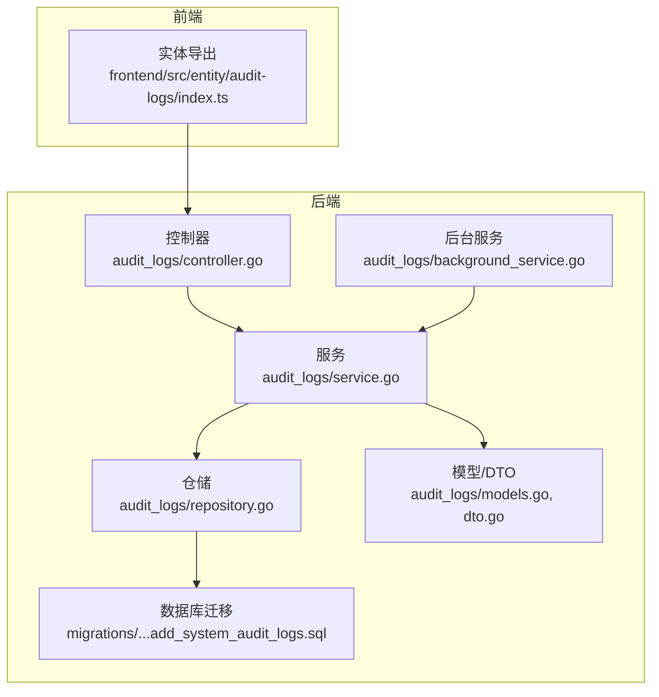
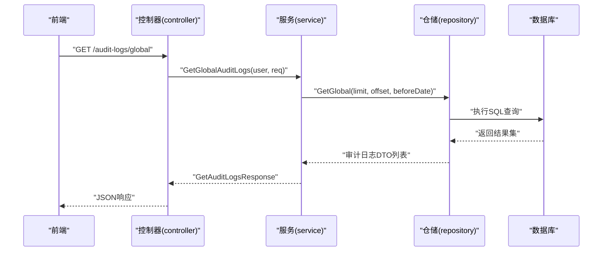
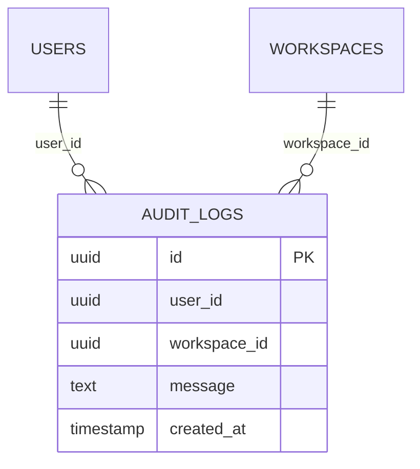
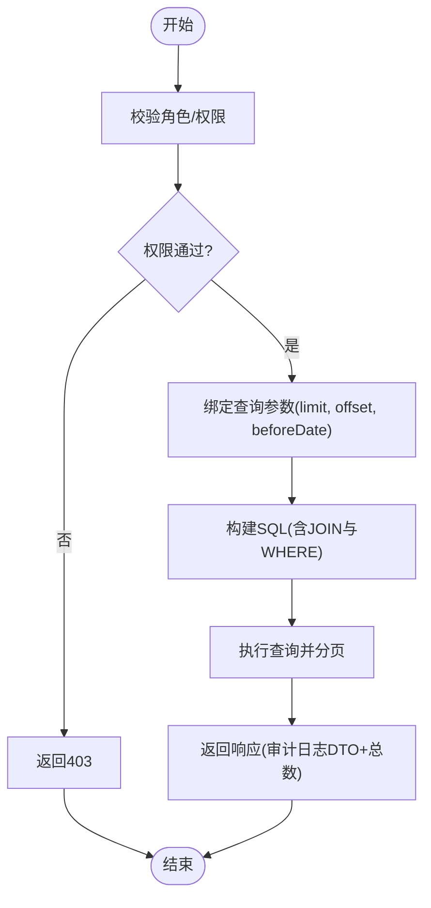
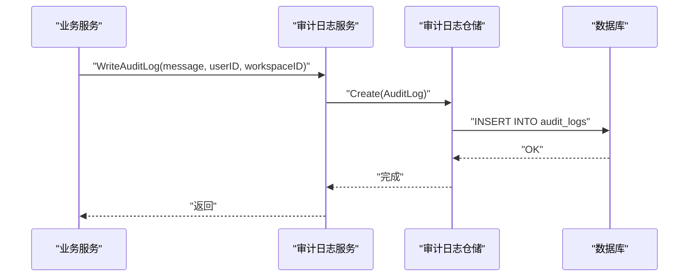
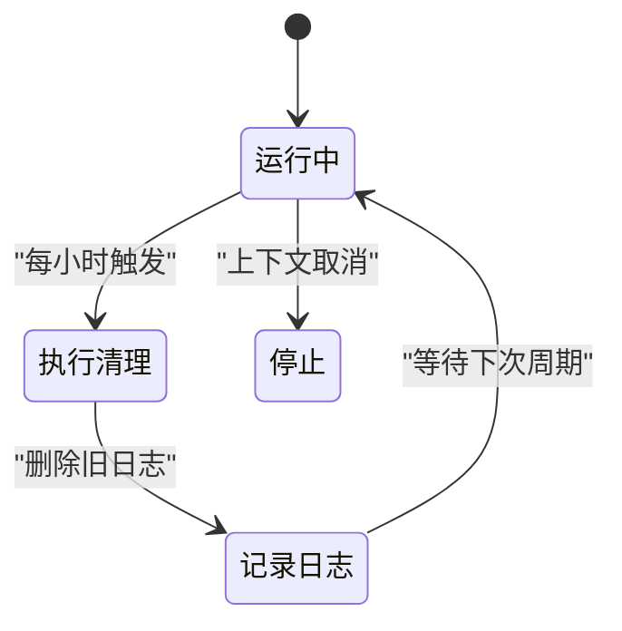
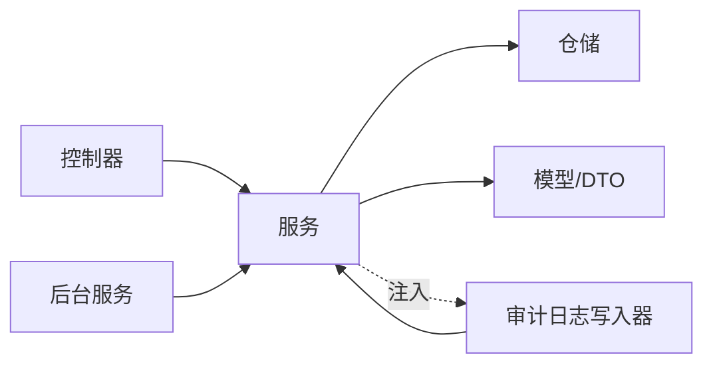

# 审计日志

<cite>
**本文引用的文件**
- [models.go](file://backend/internal/features/audit_logs/models.go)
- [dto.go](file://backend/internal/features/audit_logs/dto.go)
- [repository.go](file://backend/internal/features/audit_logs/repository.go)
- [service.go](file://backend/internal/features/audit_logs/service.go)
- [controller.go](file://backend/internal/features/audit_logs/controller.go)
- [di.go](file://backend/internal/features/audit_logs/di.go)
- [errors.go](file://backend/internal/features/audit_logs/errors.go)
- [background_service.go](file://backend/internal/features/audit_logs/background_service.go)
- [20251031145001_add_system_audit_logs.sql](file://backend/migrations/20251031145001_add_system_audit_logs.sql)
- [service.go（备份服务）](file://backend/internal/features/backups/backups/services/service.go)
- [service.go（数据库服务）](file://backend/internal/features/databases/service.go)
- [service.go（健康检查配置服务）](file://backend/internal/features/healthcheck/config/service.go)
- [service.go（通知服务）](file://backend/internal/features/notifiers/service.go)
- [service.go（恢复服务）](file://backend/internal/features/restores/service.go)
- [index.ts（前端实体导出）](file://frontend/src/entity/audit-logs/index.ts)
</cite>

## 目录
1. [简介](#简介)
2. [项目结构](#项目结构)
3. [核心组件](#核心组件)
4. [架构总览](#架构总览)
5. [详细组件分析](#详细组件分析)
6. [依赖关系分析](#依赖关系分析)
7. [性能考量](#性能考量)
8. [故障排查指南](#故障排查指南)
9. [结论](#结论)
10. [附录](#附录)

## 简介
本文件面向Databasus审计日志系统的使用者与维护者，系统性阐述审计日志的设计理念、实现架构与使用方法。内容覆盖日志采集、存储、查询、分析与清理机制；明确审计事件的类型与格式；解释数据模型与存储策略；描述查询与过滤能力；提供合规报告生成的使用建议；并给出性能优化与存储管理策略，以及在安全监控与合规检查中的应用指引。

## 项目结构
审计日志功能位于后端模块的审计日志子系统中，采用典型的分层架构：控制器(Controller)负责HTTP路由与请求参数绑定；服务(Service)封装业务逻辑与权限控制；仓储(Repository)负责数据访问与SQL查询；后台服务负责周期性清理任务。前端通过统一导出入口暴露审计日志相关的API与类型定义。

图表来源
- [controller.go:17-23](file://backend/internal/features/audit_logs/controller.go#L17-L23)
- [service.go:13-16](file://backend/internal/features/audit_logs/service.go#L13-L16)
- [repository.go:11-19](file://backend/internal/features/audit_logs/repository.go#L11-L19)
- [models.go:9-19](file://backend/internal/features/audit_logs/models.go#L9-L19)
- [background_service.go:11-16](file://backend/internal/features/audit_logs/background_service.go#L11-L16)
- [20251031145001_add_system_audit_logs.sql:4-23](file://backend/migrations/20251031145001_add_system_audit_logs.sql#L4-L23)
- [index.ts（前端实体导出）:1-8](file://frontend/src/entity/audit-logs/index.ts#L1-L8)

章节来源
- [controller.go:17-23](file://backend/internal/features/audit_logs/controller.go#L17-L23)
- [service.go:13-16](file://backend/internal/features/audit_logs/service.go#L13-L16)
- [repository.go:11-19](file://backend/internal/features/audit_logs/repository.go#L11-L19)
- [models.go:9-19](file://backend/internal/features/audit_logs/models.go#L9-L19)
- [background_service.go:11-16](file://backend/internal/features/audit_logs/background_service.go#L11-L16)
- [20251031145001_add_system_audit_logs.sql:4-23](file://backend/migrations/20251031145001_add_system_audit_logs.sql#L4-L23)
- [index.ts（前端实体导出）:1-8](file://frontend/src/entity/audit-logs/index.ts#L1-L8)

## 核心组件
- 数据模型与DTO
  - 审计日志模型包含唯一标识、用户标识、工作空间标识、消息体与创建时间。
  - DTO在模型基础上扩展了关联的用户邮箱、用户名与工作空间名称字段，便于前端展示。
- 仓储层
  - 提供全局、按用户、按工作空间的查询接口，并支持按时间上限过滤与分页。
  - 提供统计总数与删除旧日志的能力。
- 服务层
  - 写入审计日志、读取审计日志、清理旧日志。
  - 对不同查询场景进行权限校验（如全局日志仅管理员可查看）。
- 控制器层
  - 暴露HTTP接口：全局审计日志、指定用户的审计日志。
  - 参数绑定与错误处理。
- 后台服务
  - 周期性触发清理任务，默认每小时执行一次，保留一年内的日志。
- 依赖注入
  - 统一注册与获取审计日志服务、控制器与后台服务实例。
  - 将审计日志写入器注入到多个业务服务中，确保关键操作自动落库。

章节来源
- [models.go:9-19](file://backend/internal/features/audit_logs/models.go#L9-L19)
- [dto.go:22-31](file://backend/internal/features/audit_logs/dto.go#L22-L31)
- [repository.go:21-152](file://backend/internal/features/audit_logs/repository.go#L21-L152)
- [service.go:18-152](file://backend/internal/features/audit_logs/service.go#L18-L152)
- [controller.go:39-112](file://backend/internal/features/audit_logs/controller.go#L39-L112)
- [background_service.go:18-46](file://backend/internal/features/audit_logs/background_service.go#L18-L46)
- [di.go:27-43](file://backend/internal/features/audit_logs/di.go#L27-L43)

## 架构总览
审计日志系统遵循清晰的分层与职责分离原则。前端通过API调用控制器，控制器委派给服务层，服务层通过仓储层访问数据库。后台服务定时清理过期日志，保证存储容量可控。多处业务模块在关键操作完成后调用审计日志写入器，形成统一的审计事件来源。

图表来源
- [controller.go:39-62](file://backend/internal/features/audit_logs/controller.go#L39-L62)
- [service.go:41-72](file://backend/internal/features/audit_logs/service.go#L41-L72)
- [repository.go:21-54](file://backend/internal/features/audit_logs/repository.go#L21-L54)

章节来源
- [controller.go:39-62](file://backend/internal/features/audit_logs/controller.go#L39-L62)
- [service.go:41-72](file://backend/internal/features/audit_logs/service.go#L41-L72)
- [repository.go:21-54](file://backend/internal/features/audit_logs/repository.go#L21-L54)

## 详细组件分析

### 数据模型与存储策略
- 表结构与索引
  - 审计日志表包含主键、用户外键、工作空间外键、消息体与创建时间字段。
  - 外键约束允许用户或工作空间被删除时，相关审计日志保留但关联字段置空。
  - 为用户ID、工作空间ID与创建时间建立索引，提升查询与排序效率。
- 字段语义
  - 用户标识与工作空间标识用于限定可见范围与归属关系。
  - 消息体承载事件描述，应简洁明确且不包含敏感信息。
  - 创建时间用于排序与过期清理。

图表来源
- [20251031145001_add_system_audit_logs.sql:4-23](file://backend/migrations/20251031145001_add_system_audit_logs.sql#L4-L23)

章节来源
- [20251031145001_add_system_audit_logs.sql:4-23](file://backend/migrations/20251031145001_add_system_audit_logs.sql#L4-L23)

### 查询与过滤机制
- 全局查询
  - 仅管理员可访问；支持分页与“创建时间早于某时刻”的过滤。
- 用户查询
  - 普通用户仅可查看自身日志；管理员可查看任意用户日志。
- 工作空间查询
  - 支持按工作空间ID过滤，适用于多租户场景。
- 分页与限制
  - 默认每页数量与最大限制在服务层统一处理，避免过大负载。
- 关联信息
  - DTO包含用户邮箱、用户名与工作空间名称，便于前端直接展示。

图表来源
- [service.go:41-136](file://backend/internal/features/audit_logs/service.go#L41-L136)
- [repository.go:21-128](file://backend/internal/features/audit_logs/repository.go#L21-L128)
- [dto.go:9-31](file://backend/internal/features/audit_logs/dto.go#L9-L31)

章节来源
- [service.go:41-136](file://backend/internal/features/audit_logs/service.go#L41-L136)
- [repository.go:21-128](file://backend/internal/features/audit_logs/repository.go#L21-L128)
- [dto.go:9-31](file://backend/internal/features/audit_logs/dto.go#L9-L31)

### 日志写入与事件来源
- 写入流程
  - 服务接收消息、用户ID与工作空间ID，设置UTC时间后持久化。
  - 写入失败会记录错误日志，不影响主流程。
- 事件来源
  - 多个业务模块在关键操作后主动写入审计日志，例如备份、数据库管理、通知配置、健康检查与恢复等。
  - 通过依赖注入将审计日志写入器注入到各业务服务，确保一致性与可维护性。

图表来源
- [service.go:18-35](file://backend/internal/features/audit_logs/service.go#L18-L35)
- [repository.go:13-19](file://backend/internal/features/audit_logs/repository.go#L13-L19)
- [service.go（备份服务）:107-111](file://backend/internal/features/backups/backups/services/service.go#L107-L111)
- [service.go（数据库服务）:108-111](file://backend/internal/features/databases/service.go#L108-L111)
- [service.go（健康检查配置服务）:76-76](file://backend/internal/features/healthcheck/config/service.go#L76-L76)
- [service.go（通知服务）:72-72](file://backend/internal/features/notifiers/service.go#L72-L72)
- [service.go（恢复服务）:195-195](file://backend/internal/features/restores/service.go#L195-L195)

章节来源
- [service.go:18-35](file://backend/internal/features/audit_logs/service.go#L18-L35)
- [repository.go:13-19](file://backend/internal/features/audit_logs/repository.go#L13-L19)
- [service.go（备份服务）:107-111](file://backend/internal/features/backups/backups/services/service.go#L107-L111)
- [service.go（数据库服务）:108-111](file://backend/internal/features/databases/service.go#L108-L111)
- [service.go（健康检查配置服务）:76-76](file://backend/internal/features/healthcheck/config/service.go#L76-L76)
- [service.go（通知服务）:72-72](file://backend/internal/features/notifiers/service.go#L72-L72)
- [service.go（恢复服务）:195-195](file://backend/internal/features/restores/service.go#L195-L195)

### 后台清理与合规
- 清理策略
  - 后台服务每小时运行一次，删除一年前的日志，释放存储空间。
  - 清理过程记录成功与失败日志，便于运维监控。
- 合规建议
  - 结合业务需要调整保留期限；对重要事件可结合外部归档系统进行长期保存。
  - 在生产环境启用清理任务，避免日志无限增长影响性能。

图表来源
- [background_service.go:18-46](file://backend/internal/features/audit_logs/background_service.go#L18-L46)
- [service.go:138-152](file://backend/internal/features/audit_logs/service.go#L138-L152)

章节来源
- [background_service.go:18-46](file://backend/internal/features/audit_logs/background_service.go#L18-L46)
- [service.go:138-152](file://backend/internal/features/audit_logs/service.go#L138-L152)

### 权限与安全
- 全局日志访问
  - 仅管理员可查看全系统审计日志。
- 用户日志访问
  - 普通用户仅可查看自身日志；管理员可查看任意用户日志。
- 错误处理
  - 针对权限不足与参数错误分别返回相应状态码与错误信息。

章节来源
- [controller.go:39-112](file://backend/internal/features/audit_logs/controller.go#L39-L112)
- [service.go:41-107](file://backend/internal/features/audit_logs/service.go#L41-L107)
- [errors.go:5-12](file://backend/internal/features/audit_logs/errors.go#L5-L12)

## 依赖关系分析
审计日志模块内部依赖清晰，控制器依赖服务，服务依赖仓储与模型，后台服务依赖服务。依赖注入集中管理，将审计日志写入器注入到多个业务服务，形成统一的事件采集点。

图表来源
- [controller.go:13-15](file://backend/internal/features/audit_logs/controller.go#L13-L15)
- [service.go:13-16](file://backend/internal/features/audit_logs/service.go#L13-L16)
- [repository.go:11-11](file://backend/internal/features/audit_logs/repository.go#L11-L11)
- [di.go:27-43](file://backend/internal/features/audit_logs/di.go#L27-L43)

章节来源
- [controller.go:13-15](file://backend/internal/features/audit_logs/controller.go#L13-L15)
- [service.go:13-16](file://backend/internal/features/audit_logs/service.go#L13-L16)
- [repository.go:11-11](file://backend/internal/features/audit_logs/repository.go#L11-L11)
- [di.go:27-43](file://backend/internal/features/audit_logs/di.go#L27-L43)

## 性能考量
- 查询性能
  - 利用用户ID、工作空间ID与创建时间索引，减少全表扫描。
  - 分页参数限制最大值，避免一次性返回过多数据。
- 写入性能
  - 单条插入开销小，建议在高并发场景下结合批量写入策略（若业务需要）。
- 存储与清理
  - 后台定期清理一年前日志，防止表膨胀。
  - 可根据实际容量与合规要求调整保留周期。
- 前端展示
  - DTO已包含必要的关联信息，减少前端二次查询成本。

[本节为通用性能指导，无需特定文件引用]

## 故障排查指南
- 无法查看全局审计日志
  - 确认当前用户是否具备管理员角色。
  - 若提示权限不足，需以管理员身份登录或联系管理员。
- 查询参数错误
  - 检查分页参数与时间参数格式是否正确。
- 写入失败
  - 查看服务日志中的错误记录，确认数据库连接与表结构是否正常。
- 清理未生效
  - 检查后台服务是否正常运行，确认上下文未提前取消。

章节来源
- [controller.go:39-112](file://backend/internal/features/audit_logs/controller.go#L39-L112)
- [service.go:18-35](file://backend/internal/features/audit_logs/service.go#L18-L35)
- [background_service.go:18-46](file://backend/internal/features/audit_logs/background_service.go#L18-L46)

## 结论
Databasus审计日志系统以清晰的分层设计实现了从事件采集、存储、查询到清理的完整闭环。通过严格的权限控制与完善的索引策略，系统在保证安全性的同时兼顾了查询效率。结合业务场景的保留策略与外部归档方案，可满足合规与安全监控需求。

[本节为总结性内容，无需特定文件引用]

## 附录

### API定义（摘要）
- 获取全局审计日志
  - 方法与路径：GET /audit-logs/global
  - 权限：管理员
  - 查询参数：limit（默认100，最大1000）、offset（默认0）、beforeDate（RFC3339）
  - 返回：审计日志列表与总数
- 获取指定用户审计日志
  - 方法与路径：GET /audit-logs/users/{userId}
  - 权限：用户本人或管理员
  - 查询参数：limit、offset、beforeDate
  - 返回：审计日志列表

章节来源
- [controller.go:25-80](file://backend/internal/features/audit_logs/controller.go#L25-L80)

### 前端集成要点
- 通过统一导出入口引入审计日志API与类型定义，确保前后端契约一致。
- 建议在前端页面中结合用户角色与工作空间权限，动态显示与过滤审计日志。

章节来源
- [index.ts（前端实体导出）:1-8](file://frontend/src/entity/audit-logs/index.ts#L1-L8)