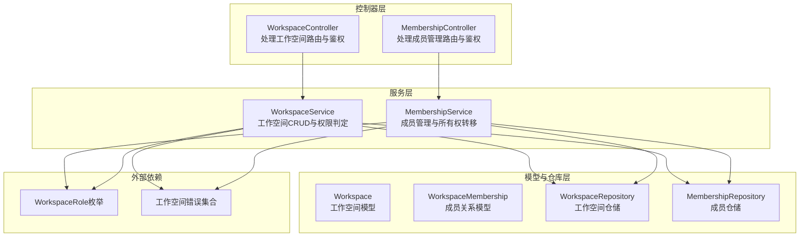
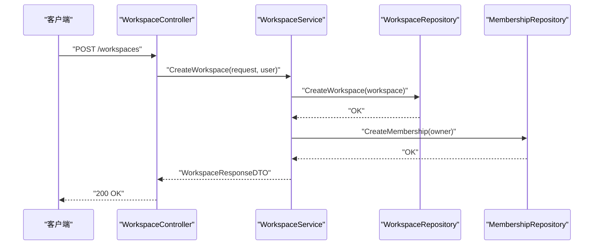
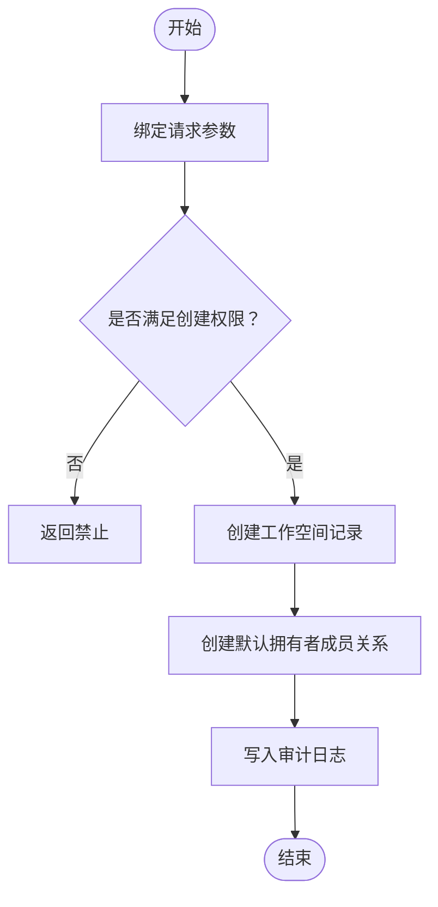
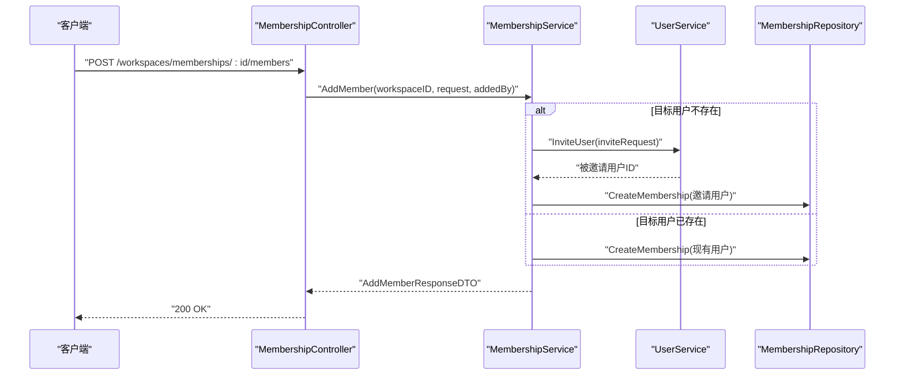
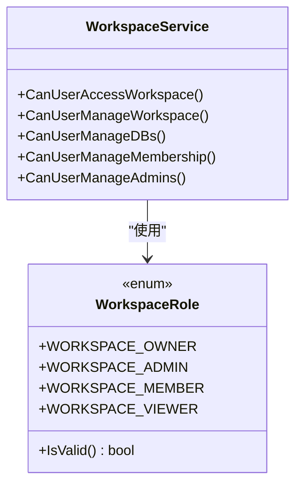
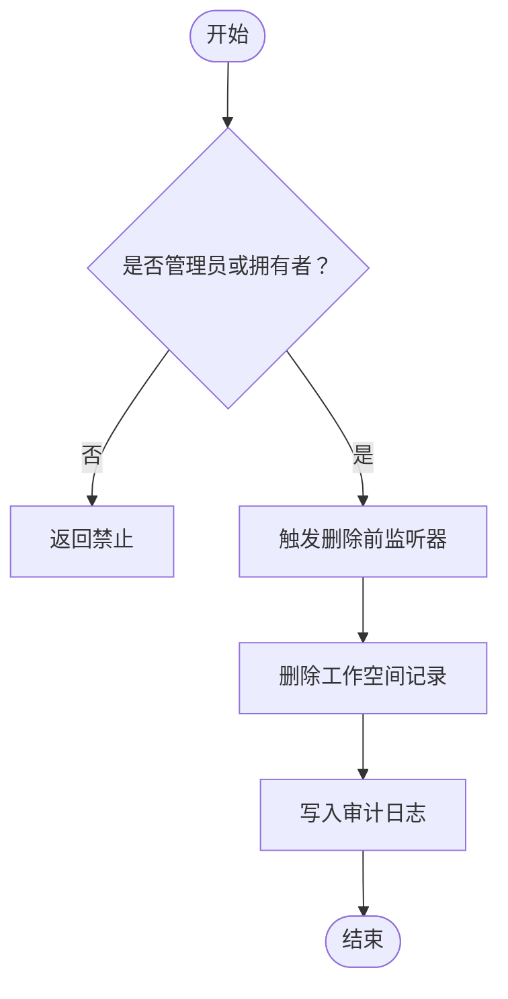
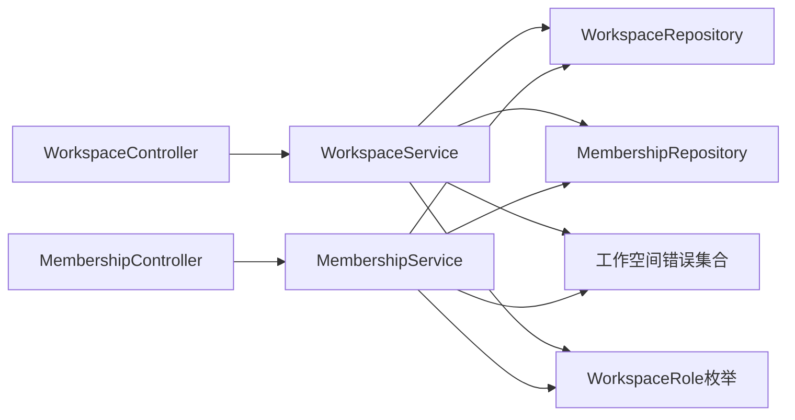

# 工作空间管理

<cite>
**本文引用的文件**
- [backend/internal/features/workspaces/controllers/di.go](file://backend/internal/features/workspaces/controllers/di.go)
- [backend/internal/features/workspaces/controllers/workspace_controller.go](file://backend/internal/features/workspaces/controllers/workspace_controller.go)
- [backend/internal/features/workspaces/controllers/membership_controller.go](file://backend/internal/features/workspaces/controllers/membership_controller.go)
- [backend/internal/features/workspaces/services/workspace_service.go](file://backend/internal/features/workspaces/services/workspace_service.go)
- [backend/internal/features/workspaces/services/membership_service.go](file://backend/internal/features/workspaces/services/membership_service.go)
- [backend/internal/features/workspaces/models/workspace.go](file://backend/internal/features/workspaces/models/workspace.go)
- [backend/internal/features/workspaces/models/workspace_membership.go](file://backend/internal/features/workspaces/models/workspace_membership.go)
- [backend/internal/features/workspaces/repositories/workspace_repository.go](file://backend/internal/features/workspaces/repositories/workspace_repository.go)
- [backend/internal/features/workspaces/repositories/membership_repository.go](file://backend/internal/features/workspaces/repositories/membership_repository.go)
- [backend/internal/features/users/enums/workspace_role.go](file://backend/internal/features/users/enums/workspace_role.go)
- [backend/internal/features/workspaces/errors/errors.go](file://backend/internal/features/workspaces/errors/errors.go)
</cite>

## 目录
1. [简介](#简介)
2. [项目结构](#项目结构)
3. [核心组件](#核心组件)
4. [架构总览](#架构总览)
5. [详细组件分析](#详细组件分析)
6. [依赖关系分析](#依赖关系分析)
7. [性能考量](#性能考量)
8. [故障排查指南](#故障排查指南)
9. [结论](#结论)
10. [附录](#附录)

## 简介
本文件面向Databasus工作空间管理系统，系统性阐述工作空间的概念与作用：作为多租户隔离单元、资源边界划分载体以及团队协作平台，围绕“创建—配置—删除”的生命周期，以及“成员邀请—角色分配—权限继承—成员移除”的成员管理闭环，提供可操作的流程说明与最佳实践。同时，结合代码实现，解释工作空间级资源（数据库、存储、通知等）的权限控制边界与审计日志机制，并给出所有权转移与迁移的指导建议。

## 项目结构
工作空间相关能力位于后端模块的workspaces子域，采用典型的分层架构：
- 控制器层：处理HTTP请求、参数绑定与鉴权上下文提取，调用服务层完成业务逻辑。
- 服务层：封装业务规则与跨仓库协调，负责权限校验、审计日志记录与跨域服务调用（如用户服务、设置服务、邮件发送）。
- 模型与仓库层：定义数据模型与持久化接口，通过统一存储访问层进行数据库操作。
- 枚举与错误：定义工作空间角色枚举与领域错误集合，保证一致性与可读性。

图表来源
- [backend/internal/features/workspaces/controllers/workspace_controller.go:18-31](file://backend/internal/features/workspaces/controllers/workspace_controller.go#L18-L31)
- [backend/internal/features/workspaces/controllers/membership_controller.go:16-28](file://backend/internal/features/workspaces/controllers/membership_controller.go#L16-L28)
- [backend/internal/features/workspaces/services/workspace_service.go:20-27](file://backend/internal/features/workspaces/services/workspace_service.go#L20-L27)
- [backend/internal/features/workspaces/services/membership_service.go:22-31](file://backend/internal/features/workspaces/services/membership_service.go#L22-L31)
- [backend/internal/features/workspaces/models/workspace.go:9-21](file://backend/internal/features/workspaces/models/workspace.go#L9-L21)
- [backend/internal/features/workspaces/models/workspace_membership.go:11-21](file://backend/internal/features/workspaces/models/workspace_membership.go#L11-L21)
- [backend/internal/features/workspaces/repositories/workspace_repository.go:12-52](file://backend/internal/features/workspaces/repositories/workspace_repository.go#L12-L52)
- [backend/internal/features/workspaces/repositories/membership_repository.go:16-131](file://backend/internal/features/workspaces/repositories/membership_repository.go#L16-L131)
- [backend/internal/features/users/enums/workspace_role.go:3-20](file://backend/internal/features/users/enums/workspace_role.go#L3-L20)
- [backend/internal/features/workspaces/errors/errors.go:5-56](file://backend/internal/features/workspaces/errors/errors.go#L5-L56)

章节来源
- [backend/internal/features/workspaces/controllers/di.go:7-21](file://backend/internal/features/workspaces/controllers/di.go#L7-L21)
- [backend/internal/features/workspaces/controllers/workspace_controller.go:22-31](file://backend/internal/features/workspaces/controllers/workspace_controller.go#L22-L31)
- [backend/internal/features/workspaces/controllers/membership_controller.go:20-28](file://backend/internal/features/workspaces/controllers/membership_controller.go#L20-L28)

## 核心组件
- 工作空间控制器：提供创建工作空间、列出/查询/更新/删除工作空间、查看工作空间审计日志的REST接口。
- 成员管理控制器：提供列出成员、添加成员（支持邀请新用户）、变更成员角色、移除成员、转移所有权的REST接口。
- 工作空间服务：封装工作空间的创建、查询、更新、删除、权限判定（访问、管理、数据库管理、成员管理、管理员管理）与审计日志查询。
- 成员管理服务：封装成员查询、添加（含邀请新用户）、角色变更、移除、所有权转移与权限校验。
- 数据模型与仓储：定义工作空间与成员关系的数据结构，并通过仓储层执行持久化操作。
- 角色与错误：定义工作空间角色枚举与领域错误，确保权限判断与错误返回的一致性。

章节来源
- [backend/internal/features/workspaces/controllers/workspace_controller.go:33-71](file://backend/internal/features/workspaces/controllers/workspace_controller.go#L33-L71)
- [backend/internal/features/workspaces/controllers/membership_controller.go:69-120](file://backend/internal/features/workspaces/controllers/membership_controller.go#L69-L120)
- [backend/internal/features/workspaces/services/workspace_service.go:35-82](file://backend/internal/features/workspaces/services/workspace_service.go#L35-L82)
- [backend/internal/features/workspaces/services/membership_service.go:60-162](file://backend/internal/features/workspaces/services/membership_service.go#L60-L162)
- [backend/internal/features/workspaces/models/workspace.go:9-21](file://backend/internal/features/workspaces/models/workspace.go#L9-L21)
- [backend/internal/features/workspaces/models/workspace_membership.go:11-21](file://backend/internal/features/workspaces/models/workspace_membership.go#L11-L21)
- [backend/internal/features/workspaces/repositories/workspace_repository.go:14-52](file://backend/internal/features/workspaces/repositories/workspace_repository.go#L14-L52)
- [backend/internal/features/workspaces/repositories/membership_repository.go:18-131](file://backend/internal/features/workspaces/repositories/membership_repository.go#L18-L131)
- [backend/internal/features/users/enums/workspace_role.go:5-20](file://backend/internal/features/users/enums/workspace_role.go#L5-L20)
- [backend/internal/features/workspaces/errors/errors.go:5-56](file://backend/internal/features/workspaces/errors/errors.go#L5-L56)

## 架构总览
工作空间管理遵循“控制器-服务-仓储-模型”的分层设计，控制器仅负责请求接入与鉴权，服务层承担业务规则与跨域协调，仓储层抽象数据持久化，模型层承载数据结构。权限判定贯穿控制器与服务层，确保对工作空间与成员管理操作的细粒度控制。

图表来源
- [backend/internal/features/workspaces/controllers/workspace_controller.go:46-71](file://backend/internal/features/workspaces/controllers/workspace_controller.go#L46-L71)
- [backend/internal/features/workspaces/services/workspace_service.go:35-82](file://backend/internal/features/workspaces/services/workspace_service.go#L35-L82)
- [backend/internal/features/workspaces/repositories/workspace_repository.go:14-24](file://backend/internal/features/workspaces/repositories/workspace_repository.go#L14-L24)
- [backend/internal/features/workspaces/repositories/membership_repository.go:18-30](file://backend/internal/features/workspaces/repositories/membership_repository.go#L18-L30)

## 详细组件分析

### 工作空间创建与配置
- 创建流程要点
  - 鉴权与权限：调用者必须已登录；需满足全局设置中关于创建工作空间的权限要求。
  - 初始化：生成唯一ID与创建时间，持久化工作空间。
  - 默认成员：自动将创建者设为拥有者，并写入成员关系。
  - 审计：记录创建工作空间的审计日志。
- 更新流程要点
  - 权限：仅拥有者或管理员可更新；否则返回禁止。
  - 变更检测：若名称发生变更，记录重命名审计日志；否则记录更新日志。
- 查询与列表
  - 列表：根据用户角色返回其所属工作空间及对应角色。
  - 单个查询：需具备访问权限，否则返回禁止。

图表来源
- [backend/internal/features/workspaces/controllers/workspace_controller.go:53-71](file://backend/internal/features/workspaces/controllers/workspace_controller.go#L53-L71)
- [backend/internal/features/workspaces/services/workspace_service.go:35-82](file://backend/internal/features/workspaces/services/workspace_service.go#L35-L82)

章节来源
- [backend/internal/features/workspaces/controllers/workspace_controller.go:33-71](file://backend/internal/features/workspaces/controllers/workspace_controller.go#L33-L71)
- [backend/internal/features/workspaces/services/workspace_service.go:35-110](file://backend/internal/features/workspaces/services/workspace_service.go#L35-L110)

### 成员管理：邀请、角色分配、权限继承、移除
- 成员查询
  - 权限：需具备访问工作空间权限；否则返回禁止。
  - 结果：返回成员列表（含邮箱、姓名、角色、加入时间）。
- 添加成员
  - 权限：非管理员需满足“管理成员”权限；若目标角色为管理员，仅拥有者可操作。
  - 用户存在性：若目标邮箱不存在，则触发邀请流程（调用用户服务生成邀请、发送邮件），随后在工作空间中建立成员关系。
  - 审计：记录邀请/添加成员的审计日志。
- 角色变更
  - 权限：非管理员需满足“管理成员”权限；若目标角色为管理员，仅拥有者可操作；不可对自己改角色。
  - 约束：不可变更当前拥有者角色。
- 移除成员
  - 权限：非管理员需满足“移除成员”权限；若目标为管理员，仅拥有者可移除。
  - 约束：不可移除当前拥有者；不可移除自身。
- 审计：所有成员相关操作均写入审计日志。

图表来源
- [backend/internal/features/workspaces/controllers/membership_controller.go:83-120](file://backend/internal/features/workspaces/controllers/membership_controller.go#L83-L120)
- [backend/internal/features/workspaces/services/membership_service.go:60-162](file://backend/internal/features/workspaces/services/membership_service.go#L60-L162)
- [backend/internal/features/workspaces/repositories/membership_repository.go:18-30](file://backend/internal/features/workspaces/repositories/membership_repository.go#L18-L30)

章节来源
- [backend/internal/features/workspaces/controllers/membership_controller.go:69-120](file://backend/internal/features/workspaces/controllers/membership_controller.go#L69-L120)
- [backend/internal/features/workspaces/services/membership_service.go:33-162](file://backend/internal/features/workspaces/services/membership_service.go#L33-L162)
- [backend/internal/features/workspaces/repositories/membership_repository.go:46-76](file://backend/internal/features/workspaces/repositories/membership_repository.go#L46-L76)

### 权限继承与角色体系
- 工作空间角色枚举：拥有者、管理员、成员、观察者。
- 权限判定矩阵（基于调用者角色与工作空间内角色）
  - 访问工作空间：管理员或任一成员。
  - 管理工作空间：管理员或拥有者。
  - 管理数据库：成员及以上。
  - 管理成员：管理员或拥有者。
  - 管理管理员：仅拥有者。
- 特殊约束
  - 管理员仅能管理非管理员成员；拥有者可管理所有成员。
  - 不可变更/移除当前拥有者。
  - 不可对自己改角色。

图表来源
- [backend/internal/features/users/enums/workspace_role.go:3-20](file://backend/internal/features/users/enums/workspace_role.go#L3-L20)
- [backend/internal/features/workspaces/services/workspace_service.go:201-298](file://backend/internal/features/workspaces/services/workspace_service.go#L201-L298)

章节来源
- [backend/internal/features/users/enums/workspace_role.go:5-20](file://backend/internal/features/users/enums/workspace_role.go#L5-L20)
- [backend/internal/features/workspaces/services/workspace_service.go:201-298](file://backend/internal/features/workspaces/services/workspace_service.go#L201-L298)

### 删除工作空间与审计日志
- 删除条件
  - 管理员可直接删除；非管理员仅拥有者可删除。
- 删除流程
  - 触发删除前监听器（预留扩展点）。
  - 执行删除并记录审计日志。
- 审计日志
  - 工作空间创建/更新/删除、成员变更、所有权转移等均有审计记录。

图表来源
- [backend/internal/features/workspaces/services/workspace_service.go:158-192](file://backend/internal/features/workspaces/services/workspace_service.go#L158-L192)
- [backend/internal/features/workspaces/controllers/workspace_controller.go:184-219](file://backend/internal/features/workspaces/controllers/workspace_controller.go#L184-L219)

章节来源
- [backend/internal/features/workspaces/services/workspace_service.go:158-192](file://backend/internal/features/workspaces/services/workspace_service.go#L158-L192)
- [backend/internal/features/workspaces/controllers/workspace_controller.go:184-219](file://backend/internal/features/workspaces/controllers/workspace_controller.go#L184-L219)

### 所有权转移与迁移
- 所有权转移
  - 发起人：管理员或当前拥有者。
  - 转移规则：将新拥有者提升为拥有者，原拥有者降级为管理员。
  - 前置条件：新拥有者必须为当前工作空间成员。
- 迁移与转移所有权的操作指南
  - 迁移：指将工作空间内的资源从一个实例/环境迁移到另一个实例/环境。该系统未提供专门的“工作空间迁移”API，但可通过以下步骤实现：
    - 在目标环境创建同名工作空间（或使用备份恢复工具链）。
    - 将成员批量导入到新工作空间（使用成员管理接口）。
    - 对数据库、存储、通知等资源进行独立迁移（分别调用相应服务的迁移/恢复流程）。
    - 完成验证后，逐步停用旧工作空间并清理不再使用的资源。
  - 注意：迁移过程中应保持审计日志连续，确保可追溯性。

章节来源
- [backend/internal/features/workspaces/services/membership_service.go:271-332](file://backend/internal/features/workspaces/services/membership_service.go#L271-L332)
- [backend/internal/features/workspaces/controllers/membership_controller.go:228-272](file://backend/internal/features/workspaces/controllers/membership_controller.go#L228-L272)

### 工作空间级资源隔离与权限控制
- 多租户隔离
  - 工作空间作为租户边界，成员关系与资源归属以工作空间为单位进行隔离。
- 资源边界
  - 数据库：通过工作空间维度限制数据库的创建、管理与访问范围。
  - 存储：工作空间级存储配置与访问控制，避免跨空间误用。
  - 通知：通知渠道（邮件、Slack、Discord等）按工作空间维度配置与授权。
- 权限控制
  - 通过角色与权限判定方法实现最小权限原则：仅授予完成任务所需的最低权限。
  - 审计日志覆盖关键操作，便于合规与追踪。

章节来源
- [backend/internal/features/workspaces/services/workspace_service.go:239-298](file://backend/internal/features/workspaces/services/workspace_service.go#L239-L298)
- [backend/internal/features/workspaces/services/membership_service.go:334-360](file://backend/internal/features/workspaces/services/membership_service.go#L334-L360)

## 依赖关系分析
- 控制器依赖服务：控制器仅依赖服务接口，不直接操作仓储，降低耦合。
- 服务依赖仓储与外部服务：服务层聚合仓储与用户/设置/审计等服务，形成清晰的业务边界。
- 模型与仓储：模型定义数据结构，仓储封装持久化细节，二者通过统一存储访问层交互。
- 错误与枚举：错误常量集中定义，角色枚举统一规范，提升一致性与可维护性。

图表来源
- [backend/internal/features/workspaces/controllers/workspace_controller.go:18-31](file://backend/internal/features/workspaces/controllers/workspace_controller.go#L18-L31)
- [backend/internal/features/workspaces/controllers/membership_controller.go:16-28](file://backend/internal/features/workspaces/controllers/membership_controller.go#L16-L28)
- [backend/internal/features/workspaces/services/workspace_service.go:20-27](file://backend/internal/features/workspaces/services/workspace_service.go#L20-L27)
- [backend/internal/features/workspaces/services/membership_service.go:22-31](file://backend/internal/features/workspaces/services/membership_service.go#L22-L31)
- [backend/internal/features/workspaces/errors/errors.go:5-56](file://backend/internal/features/workspaces/errors/errors.go#L5-L56)
- [backend/internal/features/users/enums/workspace_role.go:3-20](file://backend/internal/features/users/enums/workspace_role.go#L3-L20)

章节来源
- [backend/internal/features/workspaces/controllers/di.go:7-21](file://backend/internal/features/workspaces/controllers/di.go#L7-L21)
- [backend/internal/features/workspaces/services/workspace_service.go:20-27](file://backend/internal/features/workspaces/services/workspace_service.go#L20-L27)
- [backend/internal/features/workspaces/services/membership_service.go:22-31](file://backend/internal/features/workspaces/services/membership_service.go#L22-L31)

## 性能考量
- 查询优化
  - 成员列表查询使用JOIN与有序扫描，注意在大规模成员场景下索引与分页策略。
- 写入优化
  - 批量成员添加时，优先复用现有用户以减少邀请流程开销。
- 审计日志
  - 审计写入为顺序I/O，建议在高并发场景下评估异步化与落盘策略。
- 权限判定
  - 权限判定集中在服务层，避免重复查询；可在高频路径引入轻量缓存（如成员角色缓存）以降低数据库压力。

## 故障排查指南
- 常见错误与定位
  - 权限不足：创建/更新/删除/管理成员/转移所有权等均可能触发权限错误，检查调用者角色与工作空间内角色。
  - 用户状态异常：邀请用户失败、用户不存在、目标用户不是成员等情况，需核对邮箱与成员关系。
  - 自身操作限制：不可变更/移除自身角色，不可变更拥有者角色。
- 排查步骤
  - 确认鉴权头与用户上下文是否正确注入。
  - 核对工作空间ID与成员ID格式。
  - 查看审计日志定位具体操作时间线。
  - 检查设置项对权限的限制（如是否允许邀请用户）。

章节来源
- [backend/internal/features/workspaces/errors/errors.go:5-56](file://backend/internal/features/workspaces/errors/errors.go#L5-L56)
- [backend/internal/features/workspaces/services/membership_service.go:164-269](file://backend/internal/features/workspaces/services/membership_service.go#L164-L269)
- [backend/internal/features/workspaces/services/workspace_service.go:201-298](file://backend/internal/features/workspaces/services/workspace_service.go#L201-L298)

## 结论
Databasus工作空间管理以清晰的分层架构与严格的权限体系为核心，实现了多租户隔离、资源边界划分与团队协作。通过控制器-服务-仓储的职责分离，配合角色与审计日志机制，既保障了安全性，也提升了可维护性。建议在生产环境中结合审计日志与权限最小化原则，持续完善成员管理与资源治理流程。

## 附录
- 最佳实践
  - 成员管理：尽量使用邀请机制统一入口，避免重复添加；定期清理无效成员。
  - 权限治理：遵循“最小权限”原则，管理员仅授予必要权限；避免将管理员权限长期保留。
  - 审计与合规：开启并定期审查审计日志，确保关键操作可追溯。
  - 迁移与备份：制定标准化迁移流程，确保数据与配置一致；迁移前后进行验证。
- 安全策略
  - 强密码与多因素认证（视平台支持而定）。
  - 严格控制工作空间访问与成员变更权限。
  - 定期轮换密钥与凭证，限制敏感操作的会话有效期。