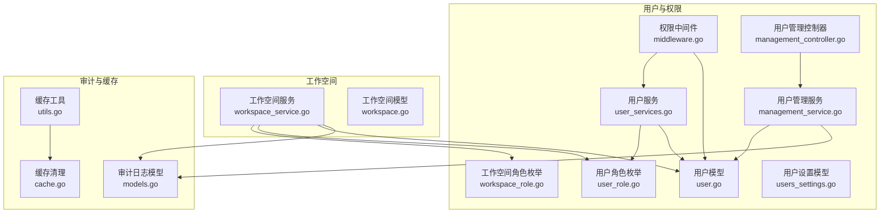
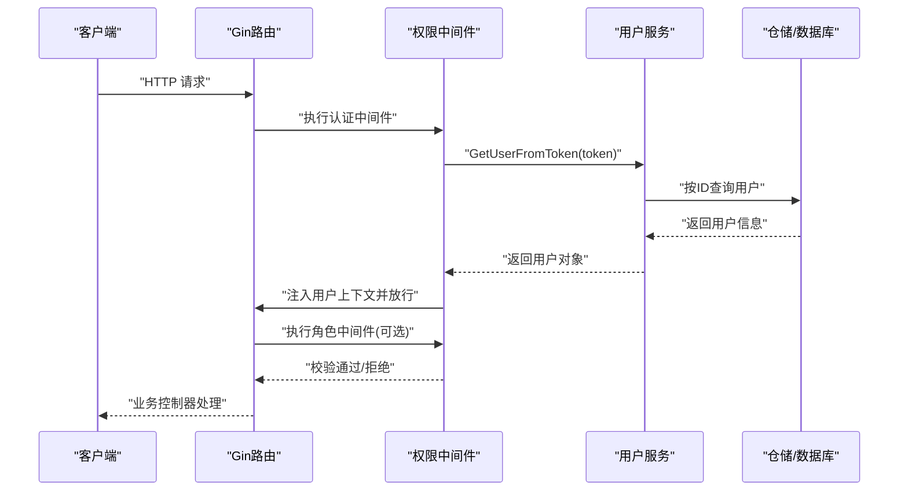
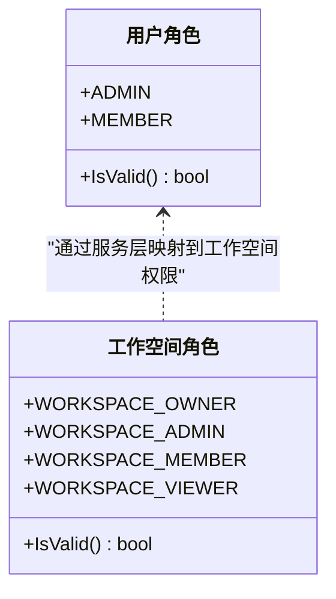
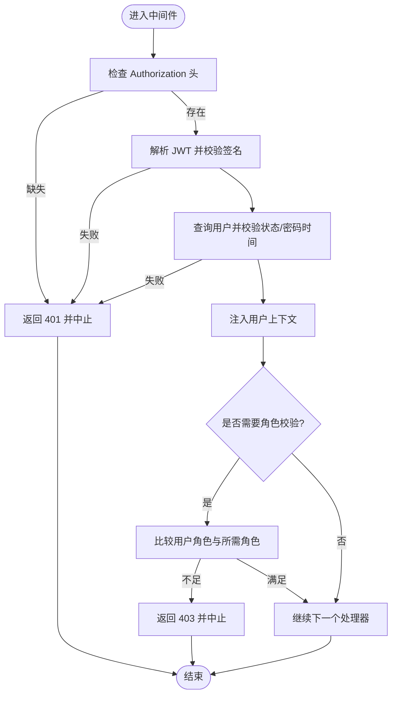
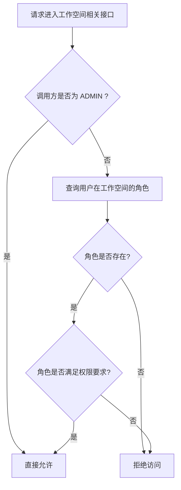
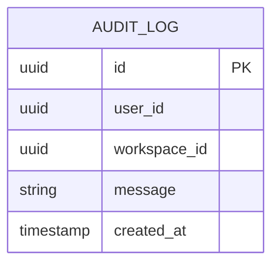
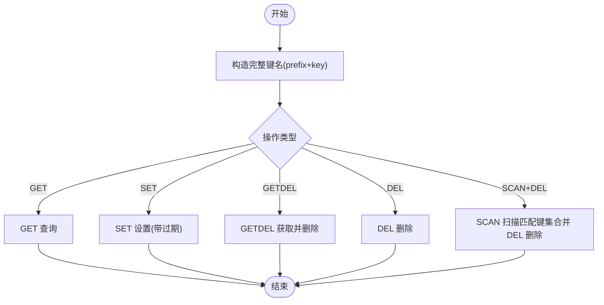
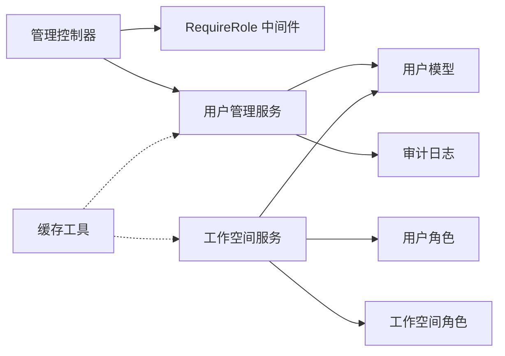

# 权限控制

<cite>
**本文引用的文件**
- [backend/internal/features/users/enums/user_role.go](file://backend/internal/features/users/enums/user_role.go)
- [backend/internal/features/users/enums/workspace_role.go](file://backend/internal/features/users/enums/workspace_role.go)
- [backend/internal/features/users/middleware/middleware.go](file://backend/internal/features/users/middleware/middleware.go)
- [backend/internal/features/users/models/user.go](file://backend/internal/features/users/models/user.go)
- [backend/internal/features/users/models/users_settings.go](file://backend/internal/features/users/models/users_settings.go)
- [backend/internal/features/users/services/user_services.go](file://backend/internal/features/users/services/user_services.go)
- [backend/internal/features/users/controllers/management_controller.go](file://backend/internal/features/users/controllers/management_controller.go)
- [backend/internal/features/users/services/management_service.go](file://backend/internal/features/users/services/management_service.go)
- [backend/internal/features/workspaces/services/workspace_service.go](file://backend/internal/features/workspaces/services/workspace_service.go)
- [backend/internal/features/workspaces/models/workspace.go](file://backend/internal/features/workspaces/models/workspace.go)
- [backend/internal/features/audit_logs/models.go](file://backend/internal/features/audit_logs/models.go)
- [backend/internal/util/cache/utils.go](file://backend/internal/util/cache/utils.go)
- [backend/internal/util/cache/cache.go](file://backend/internal/util/cache/cache.go)
</cite>

## 目录
1. [简介](#简介)
2. [项目结构](#项目结构)
3. [核心组件](#核心组件)
4. [架构总览](#架构总览)
5. [详细组件分析](#详细组件分析)
6. [依赖分析](#依赖分析)
7. [性能考量](#性能考量)
8. [故障排查指南](#故障排查指南)
9. [结论](#结论)
10. [附录](#附录)

## 简介
本文件系统性阐述 Databasus 的权限控制系统，重点覆盖以下方面：
- 基于角色的访问控制（RBAC）：用户全局角色与工作空间角色的定义与映射
- 权限继承与边界：管理员角色在系统级的特权，以及工作空间内角色对资源的授权范围
- 权限中间件：请求拦截、令牌解析、用户上下文注入与角色校验
- 细粒度资源访问控制：数据库管理、备份与恢复、存储配置等场景下的权限判定
- 权限缓存策略与性能优化：基于 Valkey 的通用缓存工具与清理机制
- 审计与追踪：权限相关操作的审计日志记录
- 实际配置示例与权限矩阵图：帮助快速理解与落地
- 安全最佳实践与常见问题排查

## 项目结构
权限控制相关代码主要分布在后端模块的 users、workspaces、audit_logs 与 util/cache 子目录中，采用分层设计（控制器 -> 服务 -> 模型/仓库），并以 Gin 中间件贯穿认证与授权流程。

**图示来源**
- [backend/internal/features/users/enums/user_role.go:1-18](file://backend/internal/features/users/enums/user_role.go#L1-L18)
- [backend/internal/features/users/enums/workspace_role.go:1-21](file://backend/internal/features/users/enums/workspace_role.go#L1-L21)
- [backend/internal/features/users/middleware/middleware.go:1-77](file://backend/internal/features/users/middleware/middleware.go#L1-L77)
- [backend/internal/features/users/models/user.go:1-59](file://backend/internal/features/users/models/user.go#L1-L59)
- [backend/internal/features/users/models/users_settings.go:1-18](file://backend/internal/features/users/models/users_settings.go#L1-L18)
- [backend/internal/features/users/services/user_services.go:1-270](file://backend/internal/features/users/services/user_services.go#L1-L270)
- [backend/internal/features/users/controllers/management_controller.go:1-261](file://backend/internal/features/users/controllers/management_controller.go#L1-L261)
- [backend/internal/features/users/services/management_service.go:1-167](file://backend/internal/features/users/services/management_service.go#L1-L167)
- [backend/internal/features/workspaces/services/workspace_service.go:205-261](file://backend/internal/features/workspaces/services/workspace_service.go#L205-L261)
- [backend/internal/features/workspaces/models/workspace.go:1-22](file://backend/internal/features/workspaces/models/workspace.go#L1-L22)
- [backend/internal/features/audit_logs/models.go:1-20](file://backend/internal/features/audit_logs/models.go#L1-L20)
- [backend/internal/util/cache/utils.go:1-113](file://backend/internal/util/cache/utils.go#L1-L113)
- [backend/internal/util/cache/cache.go:63-124](file://backend/internal/util/cache/cache.go#L63-L124)

**章节来源**
- [backend/internal/features/users/enums/user_role.go:1-18](file://backend/internal/features/users/enums/user_role.go#L1-L18)
- [backend/internal/features/users/enums/workspace_role.go:1-21](file://backend/internal/features/users/enums/workspace_role.go#L1-L21)
- [backend/internal/features/users/middleware/middleware.go:1-77](file://backend/internal/features/users/middleware/middleware.go#L1-L77)
- [backend/internal/features/users/models/user.go:1-59](file://backend/internal/features/users/models/user.go#L1-L59)
- [backend/internal/features/users/models/users_settings.go:1-18](file://backend/internal/features/users/models/users_settings.go#L1-L18)
- [backend/internal/features/users/services/user_services.go:1-270](file://backend/internal/features/users/services/user_services.go#L1-L270)
- [backend/internal/features/users/controllers/management_controller.go:1-261](file://backend/internal/features/users/controllers/management_controller.go#L1-L261)
- [backend/internal/features/users/services/management_service.go:1-167](file://backend/internal/features/users/services/management_service.go#L1-L167)
- [backend/internal/features/workspaces/services/workspace_service.go:205-261](file://backend/internal/features/workspaces/services/workspace_service.go#L205-L261)
- [backend/internal/features/workspaces/models/workspace.go:1-22](file://backend/internal/features/workspaces/models/workspace.go#L1-L22)
- [backend/internal/features/audit_logs/models.go:1-20](file://backend/internal/features/audit_logs/models.go#L1-L20)
- [backend/internal/util/cache/utils.go:1-113](file://backend/internal/util/cache/utils.go#L1-L113)
- [backend/internal/util/cache/cache.go:63-124](file://backend/internal/util/cache/cache.go#L63-L124)

## 核心组件
- 用户角色与工作空间角色
  - 全局用户角色：ADMIN、MEMBER
  - 工作空间角色：WORKSPACE_OWNER、WORKSPACE_ADMIN、WORKSPACE_MEMBER、WORKSPACE_VIEWER
- 用户模型与权限方法
  - 用户具备“邀请成员”“管理用户”“更新设置”“创建工作空间”等能力的判定逻辑
  - 能力受全局角色与系统设置共同影响
- 权限中间件
  - 认证中间件：从 Authorization 头提取并校验 JWT，解析用户信息并注入上下文
  - 角色中间件：校验用户是否具备所需全局角色
- 工作空间权限判定
  - 管理员拥有最高权限
  - 非管理员通过查询用户在特定工作空间的角色进行授权判定
- 审计日志
  - 所有关键权限变更与登录注册行为均写入审计日志
- 缓存工具
  - 提供统一的键值缓存读取、写入、失效与批量清理能力

**章节来源**
- [backend/internal/features/users/enums/user_role.go:1-18](file://backend/internal/features/users/enums/user_role.go#L1-L18)
- [backend/internal/features/users/enums/workspace_role.go:1-21](file://backend/internal/features/users/enums/workspace_role.go#L1-L21)
- [backend/internal/features/users/models/user.go:28-59](file://backend/internal/features/users/models/user.go#L28-L59)
- [backend/internal/features/users/middleware/middleware.go:13-77](file://backend/internal/features/users/middleware/middleware.go#L13-L77)
- [backend/internal/features/workspaces/services/workspace_service.go:205-261](file://backend/internal/features/workspaces/services/workspace_service.go#L205-L261)
- [backend/internal/features/audit_logs/models.go:1-20](file://backend/internal/features/audit_logs/models.go#L1-L20)
- [backend/internal/util/cache/utils.go:17-81](file://backend/internal/util/cache/utils.go#L17-L81)

## 架构总览
下图展示从请求进入至权限判定的关键路径，包括认证、角色校验与工作空间权限判定。

**图示来源**
- [backend/internal/features/users/middleware/middleware.go:14-38](file://backend/internal/features/users/middleware/middleware.go#L14-L38)
- [backend/internal/features/users/services/user_services.go:185-239](file://backend/internal/features/users/services/user_services.go#L185-L239)

## 详细组件分析

### 用户与工作空间角色模型
- 用户角色（全局）
  - ADMIN：系统级管理员，拥有最高权限
  - MEMBER：普通成员，部分能力受系统设置限制
- 工作空间角色
  - OWNER：拥有工作空间完全控制权
  - ADMIN：工作空间管理权限
  - MEMBER：资源管理权限
  - VIEWER：只读权限

**图示来源**
- [backend/internal/features/users/enums/user_role.go:1-18](file://backend/internal/features/users/enums/user_role.go#L1-L18)
- [backend/internal/features/users/enums/workspace_role.go:1-21](file://backend/internal/features/users/enums/workspace_role.go#L1-L21)

**章节来源**
- [backend/internal/features/users/enums/user_role.go:1-18](file://backend/internal/features/users/enums/user_role.go#L1-L18)
- [backend/internal/features/users/enums/workspace_role.go:1-21](file://backend/internal/features/users/enums/workspace_role.go#L1-L21)

### 权限中间件与请求拦截
- 认证中间件
  - 从 Authorization 头提取令牌，去除前缀“Bearer ”
  - 使用密钥解析 JWT，校验签发时间与密码变更时间一致性
  - 将用户对象注入上下文，失败则返回 401 并终止链路
- 角色中间件
  - 从上下文获取用户对象
  - 对比用户角色与所需角色，不满足则返回 403 并终止链路
- 辅助函数
  - 从上下文安全提取用户对象，便于控制器使用

**图示来源**
- [backend/internal/features/users/middleware/middleware.go:14-64](file://backend/internal/features/users/middleware/middleware.go#L14-L64)
- [backend/internal/features/users/services/user_services.go:185-239](file://backend/internal/features/users/services/user_services.go#L185-L239)

**章节来源**
- [backend/internal/features/users/middleware/middleware.go:13-77](file://backend/internal/features/users/middleware/middleware.go#L13-L77)
- [backend/internal/features/users/services/user_services.go:185-239](file://backend/internal/features/users/services/user_services.go#L185-L239)

### 工作空间权限映射与继承
- 管理员（ADMIN）在系统级拥有最高权限，可绕过工作空间角色直接授权
- 非管理员需通过仓储查询其在目标工作空间的角色，并据此判断权限
- 常见判定场景
  - 管理工作空间：OWNER 或 ADMIN
  - 管理数据库：OWNER、ADMIN 或 MEMBER
  - 管理成员：OWNER 或 ADMIN
  - 查看：OWNER、ADMIN、MEMBER 或 VIEWER（视具体接口）

**图示来源**
- [backend/internal/features/workspaces/services/workspace_service.go:205-261](file://backend/internal/features/workspaces/services/workspace_service.go#L205-L261)

**章节来源**
- [backend/internal/features/workspaces/services/workspace_service.go:205-261](file://backend/internal/features/workspaces/services/workspace_service.go#L205-L261)

### 细粒度资源访问控制
- 数据库管理
  - 受工作空间角色影响：OWNER、ADMIN、MEMBER 可能具备不同子权限
- 备份与恢复
  - 通常与数据库管理权限绑定；具体权限由工作空间角色决定
- 存储配置
  - 通常由 OWNER/ADMIN 授权；涉及敏感配置时建议仅 OWNER 可更改

说明：上述场景的权限边界由工作空间角色与业务服务层判定共同决定，管理员可绕过角色直接授权。

**章节来源**
- [backend/internal/features/workspaces/services/workspace_service.go:205-261](file://backend/internal/features/workspaces/services/workspace_service.go#L205-L261)

### 权限变更审计与追踪
- 审计日志模型包含用户、工作空间、消息与时间戳
- 关键事件（如登录、注册、密码修改、用户管理、密码重置、工作空间变更等）均会写入审计日志
- 审计日志用于追踪权限变更历史，支持合规与安全审计

**图示来源**
- [backend/internal/features/audit_logs/models.go:1-20](file://backend/internal/features/audit_logs/models.go#L1-L20)

**章节来源**
- [backend/internal/features/audit_logs/models.go:1-20](file://backend/internal/features/audit_logs/models.go#L1-L20)
- [backend/internal/features/users/services/user_services.go:91-96](file://backend/internal/features/users/services/user_services.go#L91-L96)
- [backend/internal/features/users/services/user_services.go:176-181](file://backend/internal/features/users/services/user_services.go#L176-L181)
- [backend/internal/features/users/services/user_services.go:341-346](file://backend/internal/features/users/services/user_services.go#L341-L346)
- [backend/internal/features/users/services/management_service.go:77-83](file://backend/internal/features/users/services/management_service.go#L77-L83)
- [backend/internal/features/users/services/management_service.go:110-116](file://backend/internal/features/users/services/management_service.go#L110-L116)
- [backend/internal/features/users/services/management_service.go:157-163](file://backend/internal/features/users/services/management_service.go#L157-L163)

### 权限配置示例与权限矩阵
- 示例一：邀请成员
  - ADMIN 可直接邀请
  - MEMBER 是否可邀请取决于系统设置中的“允许成员邀请”
- 示例二：创建工作空间
  - ADMIN 可直接创建
  - MEMBER 是否可创建取决于系统设置中的“允许成员创建工作空间”
- 示例三：用户管理
  - ADMIN 可查看/激活/停用/改角色
  - 非 ADMIN 仅能查看自己的资料

权限矩阵（简化版）：

| 资源/操作 | ADMIN | MEMBER（受设置影响） |
| --- | --- | --- |
| 邀请成员 | ✅ | 取决于设置 |
| 创建工作空间 | ✅ | 取决于设置 |
| 查看他人资料 | ✅ | ❌ |
| 停用他人账号 | ✅（仅根管理员可停用其他管理员） | ❌ |
| 改变他人角色 | ✅（仅根管理员可升降管理员） | ❌ |
| 管理数据库 | 依据工作空间角色 | 依据工作空间角色 |
| 管理备份/存储 | 依据工作空间角色 | 依据工作空间角色 |

**章节来源**
- [backend/internal/features/users/models/user.go:28-50](file://backend/internal/features/users/models/user.go#L28-L50)
- [backend/internal/features/users/models/users_settings.go:5-13](file://backend/internal/features/users/models/users_settings.go#L5-L13)
- [backend/internal/features/users/controllers/management_controller.go:20-38](file://backend/internal/features/users/controllers/management_controller.go#L20-L38)
- [backend/internal/features/users/services/management_service.go:31-36](file://backend/internal/features/users/services/management_service.go#L31-L36)
- [backend/internal/features/users/services/management_service.go:54-71](file://backend/internal/features/users/services/management_service.go#L54-L71)
- [backend/internal/features/users/services/management_service.go:126-151](file://backend/internal/features/users/services/management_service.go#L126-L151)

### 权限缓存策略与性能优化
- 缓存工具
  - 读取：带超时的 GET
  - 写入：带默认过期时间的 SET
  - 获取并删除：GETDEL
  - 失效：DEL
  - 清理：SCAN + DEL 批量清理
- 性能建议
  - 对频繁查询的用户信息、角色映射、系统设置等进行缓存
  - 合理设置过期时间，避免脏读
  - 在权限变更后主动失效相关缓存键
  - 批量清理用于运维场景（如全量失效）

**图示来源**
- [backend/internal/util/cache/utils.go:33-113](file://backend/internal/util/cache/utils.go#L33-L113)
- [backend/internal/util/cache/cache.go:83-124](file://backend/internal/util/cache/cache.go#L83-L124)

**章节来源**
- [backend/internal/util/cache/utils.go:11-15](file://backend/internal/util/cache/utils.go#L11-L15)
- [backend/internal/util/cache/utils.go:17-31](file://backend/internal/util/cache/utils.go#L17-L31)
- [backend/internal/util/cache/utils.go:33-68](file://backend/internal/util/cache/utils.go#L33-L68)
- [backend/internal/util/cache/utils.go:70-81](file://backend/internal/util/cache/utils.go#L70-L81)
- [backend/internal/util/cache/utils.go:83-105](file://backend/internal/util/cache/utils.go#L83-L105)
- [backend/internal/util/cache/utils.go:107-113](file://backend/internal/util/cache/utils.go#L107-L113)
- [backend/internal/util/cache/cache.go:83-124](file://backend/internal/util/cache/cache.go#L83-L124)

## 依赖分析
- 控制器依赖中间件与服务层
- 服务层依赖仓储与模型，同时调用审计日志与邮件发送等外部能力
- 工作空间服务依赖用户角色与仓储查询结果
- 缓存工具独立于业务层，提供跨模块复用

**图示来源**
- [backend/internal/features/users/controllers/management_controller.go:20-38](file://backend/internal/features/users/controllers/management_controller.go#L20-L38)
- [backend/internal/features/users/middleware/middleware.go:40-64](file://backend/internal/features/users/middleware/middleware.go#L40-L64)
- [backend/internal/features/users/services/management_service.go:16-36](file://backend/internal/features/users/services/management_service.go#L16-L36)
- [backend/internal/features/workspaces/services/workspace_service.go:205-261](file://backend/internal/features/workspaces/services/workspace_service.go#L205-L261)
- [backend/internal/util/cache/utils.go:17-31](file://backend/internal/util/cache/utils.go#L17-L31)

**章节来源**
- [backend/internal/features/users/controllers/management_controller.go:1-261](file://backend/internal/features/users/controllers/management_controller.go#L1-L261)
- [backend/internal/features/users/services/management_service.go:1-167](file://backend/internal/features/users/services/management_service.go#L1-L167)
- [backend/internal/features/workspaces/services/workspace_service.go:205-261](file://backend/internal/features/workspaces/services/workspace_service.go#L205-L261)
- [backend/internal/util/cache/utils.go:1-113](file://backend/internal/util/cache/utils.go#L1-L113)

## 性能考量
- 中间件与服务层的鉴权逻辑应尽量轻量，避免重复查询用户信息
- 利用缓存工具对热点数据进行缓存，减少数据库压力
- 对批量清理与扫描操作设置合理超时，防止阻塞
- 审计日志写入建议异步化或批量提交，降低对主流程的影响

## 故障排查指南
- 401 未授权
  - 检查请求头 Authorization 是否正确传递，是否包含“Bearer ”前缀
  - 校验 JWT 是否被篡改或过期
  - 确认用户状态为激活且密码变更时间一致
- 403 权限不足
  - 确认当前用户全局角色是否满足接口要求
  - 对于工作空间相关接口，确认用户在该工作空间的角色是否具备相应权限
- 审计日志缺失
  - 检查审计日志写入是否启用，以及对应事件是否触发
- 缓存异常
  - 检查键前缀与过期时间设置
  - 使用批量清理功能验证缓存可用性

**章节来源**
- [backend/internal/features/users/middleware/middleware.go:16-36](file://backend/internal/features/users/middleware/middleware.go#L16-L36)
- [backend/internal/features/users/services/user_services.go:185-239](file://backend/internal/features/users/services/user_services.go#L185-L239)
- [backend/internal/features/users/services/management_service.go:54-71](file://backend/internal/features/users/services/management_service.go#L54-L71)
- [backend/internal/features/users/services/management_service.go:126-151](file://backend/internal/features/users/services/management_service.go#L126-L151)
- [backend/internal/util/cache/cache.go:83-124](file://backend/internal/util/cache/cache.go#L83-L124)

## 结论
Databasus 的权限体系以 RBAC 为核心，结合全局用户角色与工作空间角色，形成清晰的权限边界与继承关系。通过 Gin 中间件实现统一的认证与授权入口，并辅以审计日志与缓存工具提升可观测性与性能。实际部署中建议结合系统设置灵活开放成员能力，并在权限变更后及时清理缓存，确保一致性与安全性。

## 附录
- 安全最佳实践
  - 强制使用 HTTPS 传输，保护 Authorization 头与 JWT
  - 定期轮换密钥，确保密钥安全
  - 严格限制管理员账户数量与权限范围
  - 对高风险操作（停用/改角色/删除）增加二次确认与审计
- 常见问题
  - 用户无法登录：检查用户状态、密码时间一致性与令牌有效性
  - 成员无法创建资源：检查系统设置与工作空间角色
  - 权限不生效：检查缓存键是否正确、是否已失效