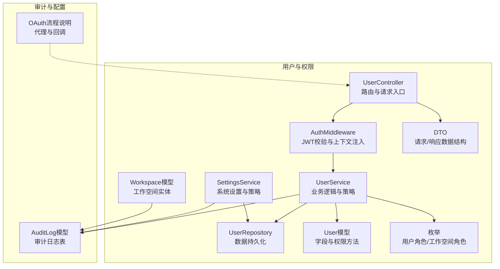
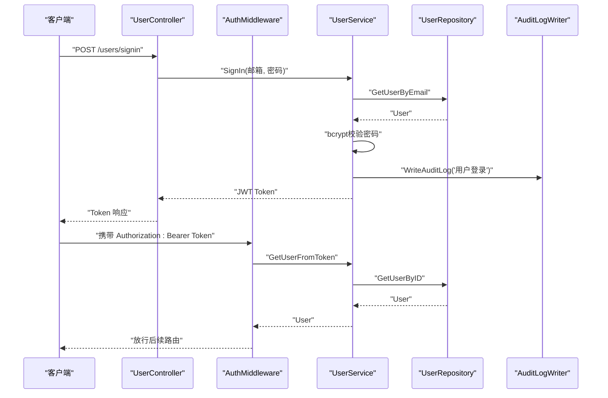
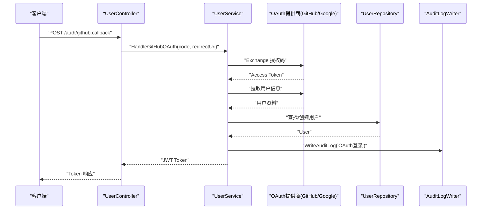
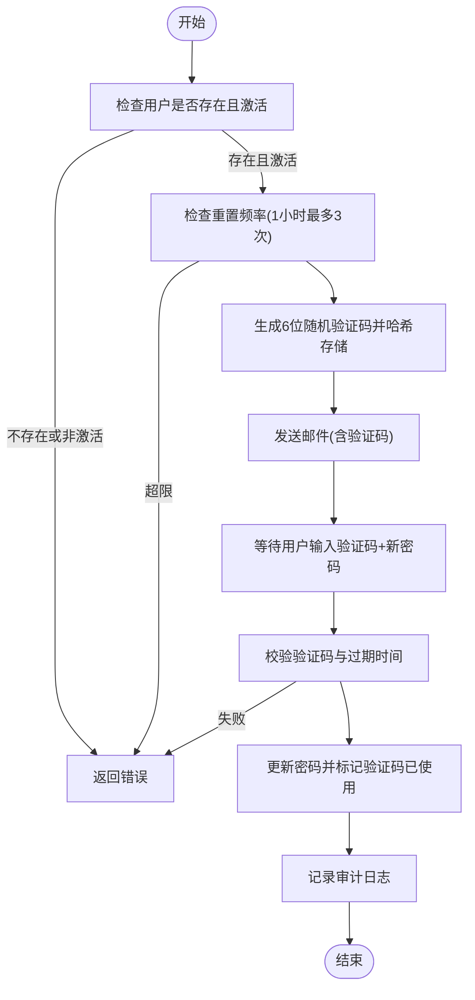
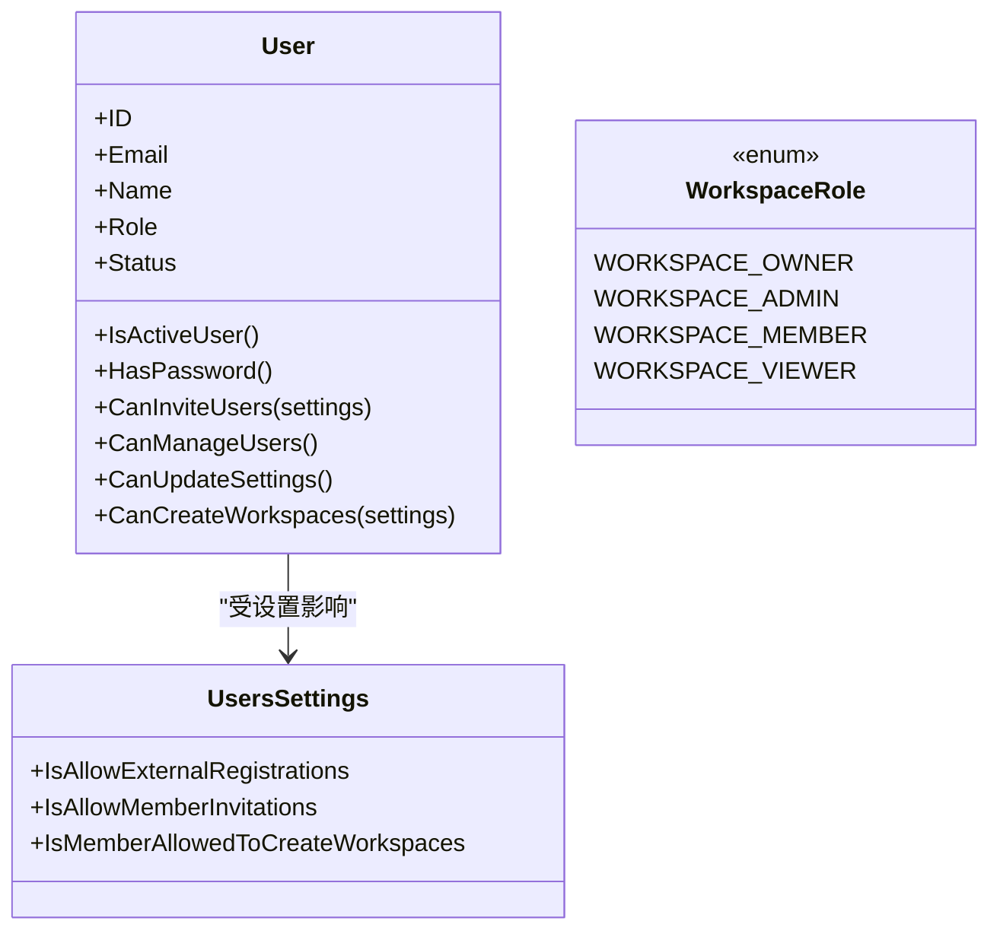
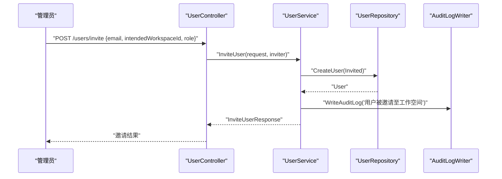
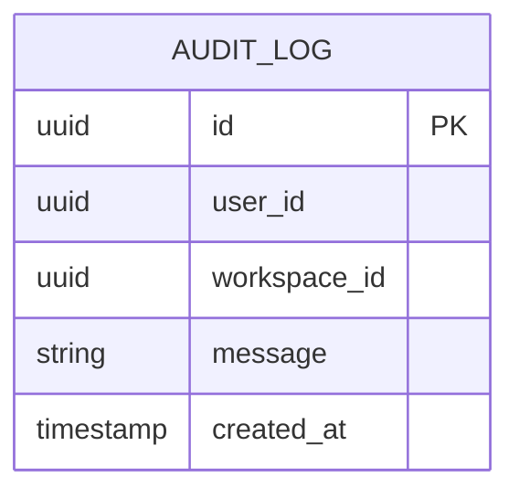
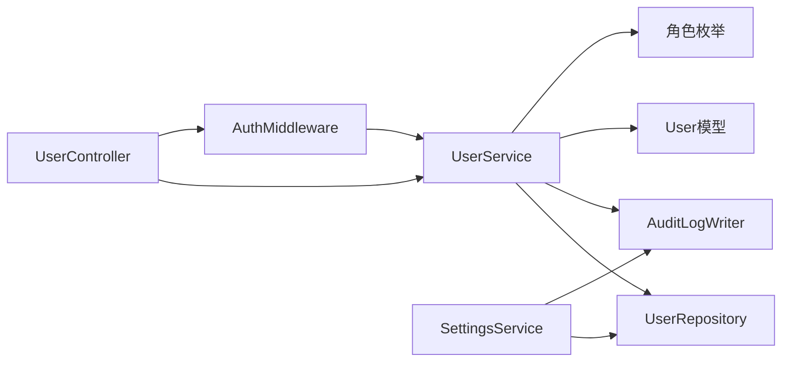

# 用户和权限管理

<cite>
**本文引用的文件**
- [backend/internal/features/users/models/user.go](file://backend/internal/features/users/models/user.go)
- [backend/internal/features/users/enums/user_role.go](file://backend/internal/features/users/enums/user_role.go)
- [backend/internal/features/users/enums/workspace_role.go](file://backend/internal/features/users/enums/workspace_role.go)
- [backend/internal/features/users/controllers/user_controller.go](file://backend/internal/features/users/controllers/user_controller.go)
- [backend/internal/features/users/services/user_services.go](file://backend/internal/features/users/services/user_services.go)
- [backend/internal/features/users/models/users_settings.go](file://backend/internal/features/users/models/users_settings.go)
- [backend/internal/features/users/repositories/user_repository.go](file://backend/internal/features/users/repositories/user_repository.go)
- [backend/internal/features/users/middleware/middleware.go](file://backend/internal/features/users/middleware/middleware.go)
- [backend/internal/features/users/services/settings_service.go](file://backend/internal/features/users/services/settings_service.go)
- [backend/internal/features/users/dto/dto.go](file://backend/internal/features/users/dto/dto.go)
- [backend/internal/features/workspaces/models/workspace.go](file://backend/internal/features/workspaces/models/workspace.go)
- [backend/internal/features/audit_logs/models.go](file://backend/internal/features/audit_logs/models.go)
- [docs/how-extrnal-oauth-works.md](file://docs/how-extrnal-oauth-works.md)
</cite>

## 目录
1. [简介](#简介)
2. [项目结构](#项目结构)
3. [核心组件](#核心组件)
4. [架构总览](#架构总览)
5. [详细组件分析](#详细组件分析)
6. [依赖关系分析](#依赖关系分析)
7. [性能考量](#性能考量)
8. [故障排除指南](#故障排除指南)
9. [结论](#结论)
10. [附录](#附录)

## 简介
本文件面向Databasus的用户与权限管理模块，系统化阐述以下能力与实现：
- 认证体系：JWT令牌生成与校验、OAuth回调处理（GitHub/Google）、密码策略与重置流程、登录节流与人机验证。
- 权限控制：基于角色的访问控制（RBAC）、用户全局角色与工作空间角色、权限继承与边界。
- 工作空间管理：团队协作、成员邀请、角色分配、工作空间级权限隔离。
- 审计日志：活动追踪、变更记录、合规性报告。
- 多租户设计：通过工作空间实现资源隔离与权限域划分。
- 最佳实践：最小权限原则、定期审计、安全策略。
- 实操示例与排障：常见场景与问题定位。

## 项目结构
用户与权限相关代码主要集中在后端模块的users与workspaces子目录中，配合中间件、服务层、仓库层与控制器层协同完成认证、授权与审计。

**图表来源**
- [backend/internal/features/users/controllers/user_controller.go:24-46](file://backend/internal/features/users/controllers/user_controller.go#L24-L46)
- [backend/internal/features/users/middleware/middleware.go:14-38](file://backend/internal/features/users/middleware/middleware.go#L14-L38)
- [backend/internal/features/users/services/user_services.go:30-37](file://backend/internal/features/users/services/user_services.go#L30-L37)
- [backend/internal/features/users/services/settings_service.go:11-14](file://backend/internal/features/users/services/settings_service.go#L11-L14)
- [backend/internal/features/users/repositories/user_repository.go:16-210](file://backend/internal/features/users/repositories/user_repository.go#L16-L210)
- [backend/internal/features/users/models/user.go:11-59](file://backend/internal/features/users/models/user.go#L11-L59)
- [backend/internal/features/workspaces/models/workspace.go:9-22](file://backend/internal/features/workspaces/models/workspace.go#L9-L22)
- [backend/internal/features/audit_logs/models.go:9-20](file://backend/internal/features/audit_logs/models.go#L9-L20)
- [docs/how-extrnal-oauth-works.md:1-27](file://docs/how-extrnal-oauth-works.md#L1-L27)

**章节来源**
- [backend/internal/features/users/controllers/user_controller.go:24-46](file://backend/internal/features/users/controllers/user_controller.go#L24-L46)
- [backend/internal/features/users/middleware/middleware.go:14-38](file://backend/internal/features/users/middleware/middleware.go#L14-L38)
- [backend/internal/features/users/services/user_services.go:30-37](file://backend/internal/features/users/services/user_services.go#L30-L37)
- [backend/internal/features/users/services/settings_service.go:11-14](file://backend/internal/features/users/services/settings_service.go#L11-L14)
- [backend/internal/features/users/repositories/user_repository.go:16-210](file://backend/internal/features/users/repositories/user_repository.go#L16-L210)
- [backend/internal/features/users/models/user.go:11-59](file://backend/internal/features/users/models/user.go#L11-L59)
- [backend/internal/features/workspaces/models/workspace.go:9-22](file://backend/internal/features/workspaces/models/workspace.go#L9-L22)
- [backend/internal/features/audit_logs/models.go:9-20](file://backend/internal/features/audit_logs/models.go#L9-L20)
- [docs/how-extrnal-oauth-works.md:1-27](file://docs/how-extrnal-oauth-works.md#L1-L27)

## 核心组件
- 用户模型与权限判定：定义用户字段、状态、角色，并提供CanInviteUsers、CanManageUsers等权限判定方法，结合系统设置决定是否允许成员邀请、创建工作空间等。
- 用户服务：负责注册、登录、JWT签发与校验、密码哈希与变更、OAuth回调、邀请用户、密码重置码发送与校验、审计日志写入。
- 设置服务：读取与更新系统设置（如是否允许外部注册、是否允许成员邀请、是否允许成员创建工作空间），并记录变更审计。
- 中间件：统一鉴权（Authorization Bearer）与角色限制；从JWT提取用户信息并注入到请求上下文。
- 控制器：暴露REST接口，绑定DTO，调用服务层执行业务逻辑，返回标准化响应。
- 工作空间模型：工作空间作为权限域与资源隔离边界，支持审计日志关联。
- 审计日志模型：记录用户行为、变更详情与时间戳，支持按用户与工作空间过滤。

**章节来源**
- [backend/internal/features/users/models/user.go:11-59](file://backend/internal/features/users/models/user.go#L11-L59)
- [backend/internal/features/users/services/user_services.go:47-133](file://backend/internal/features/users/services/user_services.go#L47-L133)
- [backend/internal/features/users/services/settings_service.go:20-80](file://backend/internal/features/users/services/settings_service.go#L20-L80)
- [backend/internal/features/users/middleware/middleware.go:14-64](file://backend/internal/features/users/middleware/middleware.go#L14-L64)
- [backend/internal/features/users/controllers/user_controller.go:24-46](file://backend/internal/features/users/controllers/user_controller.go#L24-L46)
- [backend/internal/features/workspaces/models/workspace.go:9-22](file://backend/internal/features/workspaces/models/workspace.go#L9-L22)
- [backend/internal/features/audit_logs/models.go:9-20](file://backend/internal/features/audit_logs/models.go#L9-L20)

## 架构总览
下图展示从客户端到服务层的关键交互路径，涵盖认证、授权、业务处理与审计。

**图表来源**
- [backend/internal/features/users/controllers/user_controller.go:113-158](file://backend/internal/features/users/controllers/user_controller.go#L113-L158)
- [backend/internal/features/users/services/user_services.go:135-183](file://backend/internal/features/users/services/user_services.go#L135-L183)
- [backend/internal/features/users/services/user_services.go:185-239](file://backend/internal/features/users/services/user_services.go#L185-L239)
- [backend/internal/features/users/repositories/user_repository.go:31-53](file://backend/internal/features/users/repositories/user_repository.go#L31-L53)
- [backend/internal/features/audit_logs/models.go:9-20](file://backend/internal/features/audit_logs/models.go#L9-L20)

## 详细组件分析

### 认证与会话管理
- JWT令牌生成：服务层使用对称签名算法生成长期有效令牌，载荷包含用户标识、签发/过期时间、角色与密码创建时间。
- 令牌校验：中间件解析并验证签名，从载荷提取用户ID并查询数据库确认用户状态；同时比对密码创建时间以应对密码变更导致的强制重新登录。
- 登录节流：登录接口采用速率限制，防止暴力破解。
- 人机验证：注册与登录可选启用Cloudflare Turnstile，降低自动化风险。
- OAuth回调：支持GitHub与Google，通过授权码换取第三方用户信息并完成本地用户匹配或创建，随后签发JWT。

**图表来源**
- [backend/internal/features/users/controllers/user_controller.go:344-364](file://backend/internal/features/users/controllers/user_controller.go#L344-L364)
- [backend/internal/features/users/services/user_services.go:484-504](file://backend/internal/features/users/services/user_services.go#L484-L504)
- [backend/internal/features/users/services/user_services.go:667-735](file://backend/internal/features/users/services/user_services.go#L667-L735)
- [backend/internal/features/users/repositories/user_repository.go:180-209](file://backend/internal/features/users/repositories/user_repository.go#L180-L209)
- [backend/internal/features/audit_logs/models.go:9-20](file://backend/internal/features/audit_logs/models.go#L9-L20)

**章节来源**
- [backend/internal/features/users/services/user_services.go:241-269](file://backend/internal/features/users/services/user_services.go#L241-L269)
- [backend/internal/features/users/services/user_services.go:185-239](file://backend/internal/features/users/services/user_services.go#L185-L239)
- [backend/internal/features/users/controllers/user_controller.go:113-158](file://backend/internal/features/users/controllers/user_controller.go#L113-L158)
- [backend/internal/features/users/controllers/user_controller.go:344-364](file://backend/internal/features/users/controllers/user_controller.go#L344-L364)
- [backend/internal/features/users/services/user_services.go:484-504](file://backend/internal/features/users/services/user_services.go#L484-L504)

### 密码策略与重置
- 密码强度：注册与修改密码均要求至少8位字符。
- 存储策略：使用强哈希算法存储密码，变更密码时更新密码创建时间以触发令牌失效。
- 重置流程：发送一次性6位数字验证码（带过期时间），校验通过后更新密码并记录审计日志。
- 防枚举攻击：不存在的邮箱也会静默成功，避免泄露账户存在性。

**图表来源**
- [backend/internal/features/users/services/user_services.go:506-621](file://backend/internal/features/users/services/user_services.go#L506-L621)
- [backend/internal/features/users/services/user_services.go:623-665](file://backend/internal/features/users/services/user_services.go#L623-L665)

**章节来源**
- [backend/internal/features/users/controllers/user_controller.go:190-233](file://backend/internal/features/users/controllers/user_controller.go#L190-L233)
- [backend/internal/features/users/controllers/user_controller.go:409-460](file://backend/internal/features/users/controllers/user_controller.go#L409-L460)
- [backend/internal/features/users/services/user_services.go:506-621](file://backend/internal/features/users/services/user_services.go#L506-L621)
- [backend/internal/features/users/services/user_services.go:623-665](file://backend/internal/features/users/services/user_services.go#L623-L665)

### RBAC与权限控制
- 全局角色：管理员与成员，管理员拥有最高权限，成员受系统设置约束。
- 工作空间角色：所有用户在工作空间内具有Owner/Admin/Member/Viewer等角色，用于资源级权限控制。
- 权限判定：用户模型提供CanInviteUsers、CanManageUsers、CanUpdateSettings、CanCreateWorkspaces等方法，结合系统设置进行判断。
- 中间件：提供RequireRole中间件，按全局角色进行访问控制。

**图表来源**
- [backend/internal/features/users/models/user.go:11-59](file://backend/internal/features/users/models/user.go#L11-L59)
- [backend/internal/features/users/models/users_settings.go:5-13](file://backend/internal/features/users/models/users_settings.go#L5-L13)
- [backend/internal/features/users/enums/workspace_role.go:3-21](file://backend/internal/features/users/enums/workspace_role.go#L3-L21)

**章节来源**
- [backend/internal/features/users/models/user.go:28-50](file://backend/internal/features/users/models/user.go#L28-L50)
- [backend/internal/features/users/models/users_settings.go:5-13](file://backend/internal/features/users/models/users_settings.go#L5-L13)
- [backend/internal/features/users/enums/workspace_role.go:3-21](file://backend/internal/features/users/enums/workspace_role.go#L3-L21)
- [backend/internal/features/users/middleware/middleware.go:40-64](file://backend/internal/features/users/middleware/middleware.go#L40-L64)

### 工作空间管理与权限继承
- 工作空间作为权限域：用户在不同工作空间内拥有独立的角色与权限，审计日志可关联工作空间ID。
- 成员邀请：邀请流程支持指定目标工作空间与预期角色，邀请后记录审计日志。
- 角色分配：通过工作空间角色实现资源访问控制，支持Owner/Admin/Member/Viewer等层级。

**图表来源**
- [backend/internal/features/users/controllers/user_controller.go:248-272](file://backend/internal/features/users/controllers/user_controller.go#L248-L272)
- [backend/internal/features/users/services/user_services.go:350-406](file://backend/internal/features/users/services/user_services.go#L350-L406)
- [backend/internal/features/audit_logs/models.go:9-20](file://backend/internal/features/audit_logs/models.go#L9-L20)

**章节来源**
- [backend/internal/features/users/controllers/user_controller.go:248-272](file://backend/internal/features/users/controllers/user_controller.go#L248-L272)
- [backend/internal/features/users/services/user_services.go:350-406](file://backend/internal/features/users/services/user_services.go#L350-L406)
- [backend/internal/features/workspaces/models/workspace.go:9-22](file://backend/internal/features/workspaces/models/workspace.go#L9-L22)

### 审计日志系统
- 日志模型：包含用户ID、工作空间ID、消息内容与时间戳，支持按用户与工作空间过滤。
- 写入时机：注册、登录、密码变更、邀请、设置更新、重置等关键动作均写入审计日志。
- 合规性：审计日志可用于追踪违规行为、回溯责任链与满足合规要求。

**图表来源**
- [backend/internal/features/audit_logs/models.go:9-20](file://backend/internal/features/audit_logs/models.go#L9-L20)

**章节来源**
- [backend/internal/features/audit_logs/models.go:9-20](file://backend/internal/features/audit_logs/models.go#L9-L20)
- [backend/internal/features/users/services/user_services.go:91-131](file://backend/internal/features/users/services/user_services.go#L91-L131)
- [backend/internal/features/users/services/user_services.go:341-347](file://backend/internal/features/users/services/user_services.go#L341-L347)
- [backend/internal/features/users/services/user_services.go:393-397](file://backend/internal/features/users/services/user_services.go#L393-L397)
- [backend/internal/features/users/services/settings_service.go:71-77](file://backend/internal/features/users/services/settings_service.go#L71-L77)

### 多租户架构设计
- 以工作空间为租户边界：每个工作空间内的资源与权限相互隔离，用户在不同工作空间内拥有不同的角色与权限。
- 审计日志关联工作空间：便于跨工作空间的合规审计与责任追溯。
- 策略与设置：通过系统设置控制注册、邀请与创建工作空间的策略，形成统一的多租户治理规则。

**章节来源**
- [backend/internal/features/workspaces/models/workspace.go:9-22](file://backend/internal/features/workspaces/models/workspace.go#L9-L22)
- [backend/internal/features/users/models/users_settings.go:5-13](file://backend/internal/features/users/models/users_settings.go#L5-L13)
- [backend/internal/features/audit_logs/models.go:9-20](file://backend/internal/features/audit_logs/models.go#L9-L20)

## 依赖关系分析
- 控制器依赖服务层，服务层依赖仓库层与外部组件（JWT、OAuth、邮件、密钥服务）。
- 中间件依赖服务层进行令牌校验与用户上下文注入。
- 模型与枚举为服务层与仓库层提供类型约束。
- 审计日志贯穿认证、授权与变更流程，形成闭环。

**图表来源**
- [backend/internal/features/users/controllers/user_controller.go:19-22](file://backend/internal/features/users/controllers/user_controller.go#L19-L22)
- [backend/internal/features/users/middleware/middleware.go:14-38](file://backend/internal/features/users/middleware/middleware.go#L14-L38)
- [backend/internal/features/users/services/user_services.go:30-37](file://backend/internal/features/users/services/user_services.go#L30-L37)
- [backend/internal/features/users/services/settings_service.go:11-14](file://backend/internal/features/users/services/settings_service.go#L11-L14)
- [backend/internal/features/users/repositories/user_repository.go:16-210](file://backend/internal/features/users/repositories/user_repository.go#L16-L210)
- [backend/internal/features/users/models/user.go:11-59](file://backend/internal/features/users/models/user.go#L11-L59)
- [backend/internal/features/users/enums/user_role.go:3-18](file://backend/internal/features/users/enums/user_role.go#L3-L18)
- [backend/internal/features/users/enums/workspace_role.go:3-21](file://backend/internal/features/users/enums/workspace_role.go#L3-L21)

**章节来源**
- [backend/internal/features/users/controllers/user_controller.go:19-22](file://backend/internal/features/users/controllers/user_controller.go#L19-L22)
- [backend/internal/features/users/middleware/middleware.go:14-38](file://backend/internal/features/users/middleware/middleware.go#L14-L38)
- [backend/internal/features/users/services/user_services.go:30-37](file://backend/internal/features/users/services/user_services.go#L30-L37)
- [backend/internal/features/users/services/settings_service.go:11-14](file://backend/internal/features/users/services/settings_service.go#L11-L14)
- [backend/internal/features/users/repositories/user_repository.go:16-210](file://backend/internal/features/users/repositories/user_repository.go#L16-L210)
- [backend/internal/features/users/models/user.go:11-59](file://backend/internal/features/users/models/user.go#L11-L59)
- [backend/internal/features/users/enums/user_role.go:3-18](file://backend/internal/features/users/enums/user_role.go#L3-L18)
- [backend/internal/features/users/enums/workspace_role.go:3-21](file://backend/internal/features/users/enums/workspace_role.go#L3-L21)

## 性能考量
- JWT签发与校验：使用对称签名算法，性能开销低；建议合理设置令牌有效期并在密码变更时强制重新登录。
- 数据库访问：用户查询与更新均通过仓储层封装，注意索引与查询条件优化。
- 速率限制：登录与重置密码接口已内置速率限制，避免滥用。
- OAuth回调：网络I/O由第三方OAuth提供商决定，建议缓存常用用户信息并监控第三方API可用性。

## 故障排除指南
- 无法登录
  - 检查用户状态是否为激活；确认密码正确且未过期；查看是否触发登录节流。
  - 参考：[backend/internal/features/users/services/user_services.go:135-183](file://backend/internal/features/users/services/user_services.go#L135-L183)
- 令牌无效或过期
  - 确认Authorization头格式为Bearer Token；若密码最近变更，需重新登录以刷新令牌。
  - 参考：[backend/internal/features/users/middleware/middleware.go:14-38](file://backend/internal/features/users/middleware/middleware.go#L14-L38)、[backend/internal/features/users/services/user_services.go:185-239](file://backend/internal/features/users/services/user_services.go#L185-L239)
- OAuth回调失败
  - 确认OAuth客户端配置正确；若自托管环境无公网HTTPS，参考文档中的代理方案。
  - 参考：[docs/how-extrnal-oauth-works.md:1-27](file://docs/how-extrnal-oauth-works.md#L1-L27)、[backend/internal/features/users/controllers/user_controller.go:344-364](file://backend/internal/features/users/controllers/user_controller.go#L344-L364)
- 邀请用户权限不足
  - 检查当前用户是否具备邀请权限，以及系统设置是否允许成员邀请。
  - 参考：[backend/internal/features/users/models/user.go:28-35](file://backend/internal/features/users/models/user.go#L28-L35)、[backend/internal/features/users/services/user_services.go:350-406](file://backend/internal/features/users/services/user_services.go#L350-L406)
- 密码重置失败
  - 确认验证码未过期且与用户匹配；检查邮件发送是否成功；关注重置频率限制。
  - 参考：[backend/internal/features/users/services/user_services.go:506-621](file://backend/internal/features/users/services/user_services.go#L506-L621)、[backend/internal/features/users/services/user_services.go:623-665](file://backend/internal/features/users/services/user_services.go#L623-L665)

**章节来源**
- [backend/internal/features/users/services/user_services.go:135-183](file://backend/internal/features/users/services/user_services.go#L135-L183)
- [backend/internal/features/users/middleware/middleware.go:14-38](file://backend/internal/features/users/middleware/middleware.go#L14-L38)
- [backend/internal/features/users/services/user_services.go:185-239](file://backend/internal/features/users/services/user_services.go#L185-L239)
- [docs/how-extrnal-oauth-works.md:1-27](file://docs/how-extrnal-oauth-works.md#L1-L27)
- [backend/internal/features/users/controllers/user_controller.go:344-364](file://backend/internal/features/users/controllers/user_controller.go#L344-L364)
- [backend/internal/features/users/models/user.go:28-35](file://backend/internal/features/users/models/user.go#L28-L35)
- [backend/internal/features/users/services/user_services.go:350-406](file://backend/internal/features/users/services/user_services.go#L350-L406)
- [backend/internal/features/users/services/user_services.go:506-621](file://backend/internal/features/users/services/user_services.go#L506-L621)
- [backend/internal/features/users/services/user_services.go:623-665](file://backend/internal/features/users/services/user_services.go#L623-L665)

## 结论
Databasus的用户与权限管理模块以清晰的分层架构实现了认证、授权、审计与工作空间隔离，结合系统设置与中间件提供了灵活的权限控制策略。通过JWT令牌、OAuth集成与严格的密码策略，系统在安全性与可用性之间取得平衡；审计日志与工作空间边界为合规与多租户治理提供了坚实基础。

## 附录
- 实际操作示例（步骤）
  - 注册与登录
    - 步骤1：调用注册接口提交邮箱、姓名与密码（≥8位）。
    - 步骤2：收到令牌后，在后续请求头中添加Authorization: Bearer <token>。
    - 参考：[backend/internal/features/users/controllers/user_controller.go:58-100](file://backend/internal/features/users/controllers/user_controller.go#L58-L100)、[backend/internal/features/users/controllers/user_controller.go:113-158](file://backend/internal/features/users/controllers/user_controller.go#L113-L158)
  - 修改密码
    - 步骤1：携带令牌调用修改密码接口，提交新密码（≥8位）。
    - 步骤2：密码变更后旧令牌将失效，需重新登录。
    - 参考：[backend/internal/features/users/controllers/user_controller.go:190-233](file://backend/internal/features/users/controllers/user_controller.go#L190-L233)、[backend/internal/features/users/services/user_services.go:331-348](file://backend/internal/features/users/services/user_services.go#L331-L348)
  - 邀请成员
    - 步骤1：确保当前用户具备邀请权限或系统允许成员邀请。
    - 步骤2：调用邀请接口，可选择指定工作空间与预期角色。
    - 步骤3：受邀者收到邀请后完成注册，系统记录审计日志。
    - 参考：[backend/internal/features/users/controllers/user_controller.go:248-272](file://backend/internal/features/users/controllers/user_controller.go#L248-L272)、[backend/internal/features/users/services/user_services.go:350-406](file://backend/internal/features/users/services/user_services.go#L350-L406)
  - OAuth登录
    - 步骤1：前端引导用户跳转至OAuth提供商授权。
    - 步骤2：回调至后端，后端交换授权码并拉取用户信息。
    - 步骤3：完成本地用户匹配或创建，签发JWT。
    - 参考：[docs/how-extrnal-oauth-works.md:1-27](file://docs/how-extrnal-oauth-works.md#L1-L27)、[backend/internal/features/users/controllers/user_controller.go:344-364](file://backend/internal/features/users/controllers/user_controller.go#L344-L364)
  - 密码重置
    - 步骤1：调用发送验证码接口（受频率限制）。
    - 步骤2：收到邮件验证码后调用重置接口，提交邮箱、验证码与新密码。
    - 步骤3：重置成功后旧令牌失效，需重新登录。
    - 参考：[backend/internal/features/users/controllers/user_controller.go:409-460](file://backend/internal/features/users/controllers/user_controller.go#L409-L460)、[backend/internal/features/users/services/user_services.go:623-665](file://backend/internal/features/users/services/user_services.go#L623-L665)