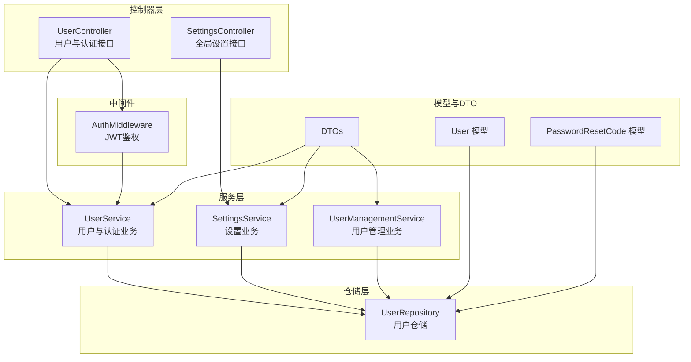
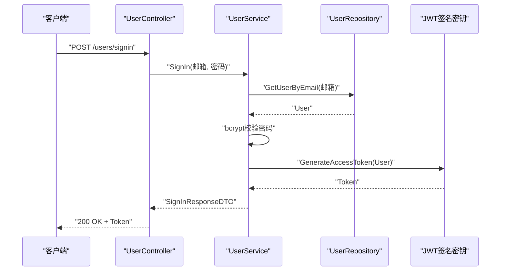
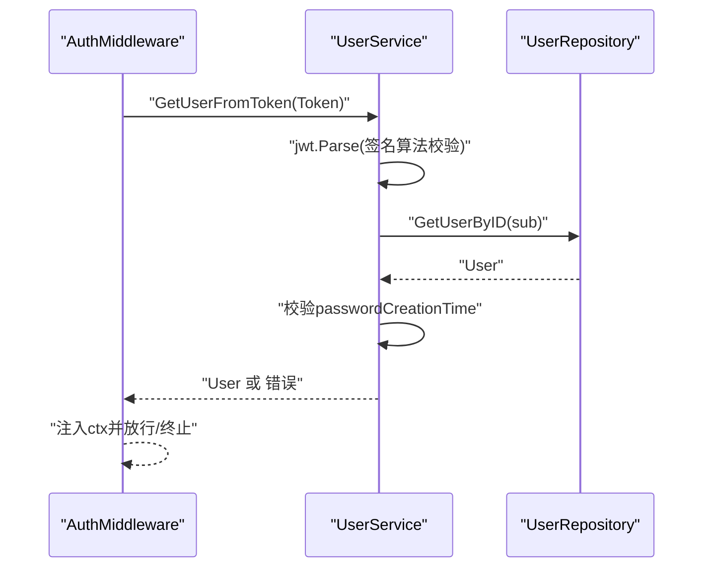
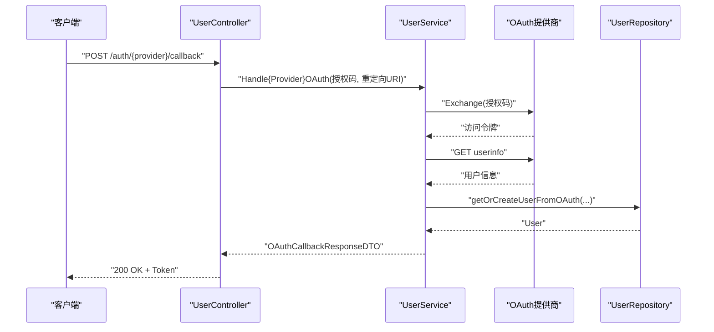
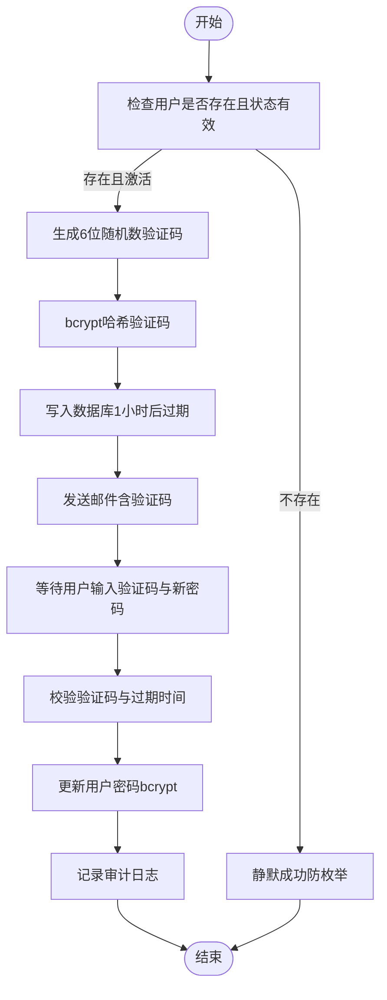
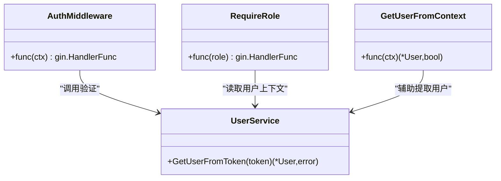
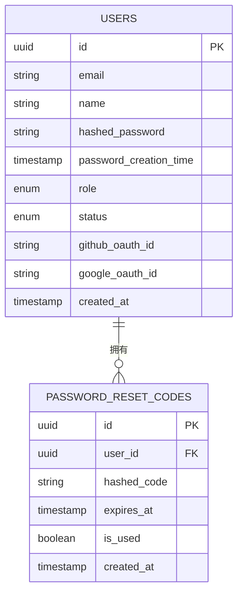
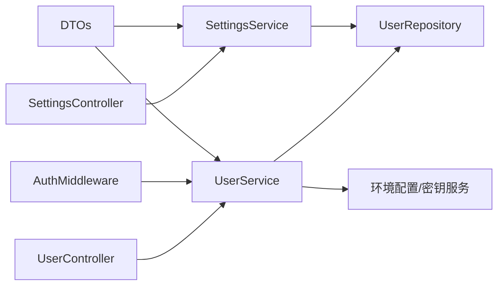

# 认证系统

<cite>
**本文引用的文件**
- [backend/internal/features/users/controllers/user_controller.go](file://backend/internal/features/users/controllers/user_controller.go)
- [backend/internal/features/users/controllers/settings_controller.go](file://backend/internal/features/users/controllers/settings_controller.go)
- [backend/internal/features/users/middleware/middleware.go](file://backend/internal/features/users/middleware/middleware.go)
- [backend/internal/features/users/services/user_services.go](file://backend/internal/features/users/services/user_services.go)
- [backend/internal/features/users/services/settings_service.go](file://backend/internal/features/users/services/settings_service.go)
- [backend/internal/features/users/services/management_service.go](file://backend/internal/features/users/services/management_service.go)
- [backend/internal/features/users/services/oauth_testing.go](file://backend/internal/features/users/services/oauth_testing.go)
- [backend/internal/features/users/models/user.go](file://backend/internal/features/users/models/user.go)
- [backend/internal/features/users/models/password_reset_code.go](file://backend/internal/features/users/models/password_reset_code.go)
- [backend/internal/features/users/dto/dto.go](file://backend/internal/features/users/dto/dto.go)
- [backend/internal/features/users/repositories/user_repository.go](file://backend/internal/features/users/repositories/user_repository.go)
- [backend/internal/util/encryption/password_generator.go](file://backend/internal/util/encryption/password_generator.go)
- [docs/how-extrnal-oauth-works.md](file://docs/how-extrnal-oauth-works.md)
</cite>

## 目录
1. [简介](#简介)
2. [项目结构](#项目结构)
3. [核心组件](#核心组件)
4. [架构总览](#架构总览)
5. [详细组件分析](#详细组件分析)
6. [依赖关系分析](#依赖关系分析)
7. [性能考量](#性能考量)
8. [故障排除指南](#故障排除指南)
9. [结论](#结论)
10. [附录](#附录)

## 简介
本文件面向Databasus认证系统，围绕以下目标展开：JWT令牌管理（生成、刷新、验证）、OAuth集成（GitHub、Google）配置与使用、密码策略与安全机制（哈希、盐值、重置流程）、会话管理策略（生命周期、并发控制、安全注销）、认证中间件实现与配置、安全最佳实践与常见攻击防护、认证流程示例与故障排除。

## 项目结构
认证相关代码主要位于后端模块的users子域中，采用分层设计：
- 控制器层：处理HTTP请求与响应，暴露REST接口
- 服务层：封装业务逻辑（JWT签发、OAuth回调、密码重置、权限校验）
- 模型与DTO：数据传输对象与持久化模型
- 中间件：统一鉴权与角色校验
- 仓储层：数据库访问抽象
- 工具与加密：密码生成、Turnstile人机验证等

**图表来源**
- [backend/internal/features/users/controllers/user_controller.go:19-46](file://backend/internal/features/users/controllers/user_controller.go#L19-L46)
- [backend/internal/features/users/controllers/settings_controller.go:14-25](file://backend/internal/features/users/controllers/settings_controller.go#L14-L25)
- [backend/internal/features/users/middleware/middleware.go:14-38](file://backend/internal/features/users/middleware/middleware.go#L14-L38)
- [backend/internal/features/users/services/user_services.go:30-37](file://backend/internal/features/users/services/user_services.go#L30-L37)
- [backend/internal/features/users/services/settings_service.go:11-14](file://backend/internal/features/users/services/settings_service.go#L11-L14)
- [backend/internal/features/users/services/management_service.go:16-19](file://backend/internal/features/users/services/management_service.go#L16-L19)
- [backend/internal/features/users/models/user.go:11-26](file://backend/internal/features/users/models/user.go#L11-L26)
- [backend/internal/features/users/models/password_reset_code.go:9-20](file://backend/internal/features/users/models/password_reset_code.go#L9-L20)
- [backend/internal/features/users/dto/dto.go:11-108](file://backend/internal/features/users/dto/dto.go#L11-L108)
- [backend/internal/features/users/repositories/user_repository.go:16-210](file://backend/internal/features/users/repositories/user_repository.go#L16-L210)

**章节来源**
- [backend/internal/features/users/controllers/user_controller.go:24-46](file://backend/internal/features/users/controllers/user_controller.go#L24-L46)
- [backend/internal/features/users/controllers/settings_controller.go:18-25](file://backend/internal/features/users/controllers/settings_controller.go#L18-L25)
- [backend/internal/features/users/middleware/middleware.go:14-38](file://backend/internal/features/users/middleware/middleware.go#L14-L38)
- [backend/internal/features/users/services/user_services.go:30-37](file://backend/internal/features/users/services/user_services.go#L30-L37)
- [backend/internal/features/users/services/settings_service.go:11-14](file://backend/internal/features/users/services/settings_service.go#L11-L14)
- [backend/internal/features/users/services/management_service.go:16-19](file://backend/internal/features/users/services/management_service.go#L16-L19)
- [backend/internal/features/users/models/user.go:11-26](file://backend/internal/features/users/models/user.go#L11-L26)
- [backend/internal/features/users/models/password_reset_code.go:9-20](file://backend/internal/features/users/models/password_reset_code.go#L9-L20)
- [backend/internal/features/users/dto/dto.go:11-108](file://backend/internal/features/users/dto/dto.go#L11-L108)
- [backend/internal/features/users/repositories/user_repository.go:16-210](file://backend/internal/features/users/repositories/user_repository.go#L16-L210)

## 核心组件
- 用户控制器：提供注册、登录、密码修改、邀请用户、当前用户信息、OAuth回调、密码重置等接口
- 设置控制器：提供获取与更新全局用户设置（如是否允许外部注册、成员邀请等）
- 认证中间件：从请求头解析Authorization，校验JWT并注入用户上下文
- 用户服务：实现JWT签发与验证、OAuth回调处理、密码哈希与重置、管理员密码设置等
- 设置服务：读取与更新全局用户设置，并记录审计日志
- 用户管理服务：用户启用/停用、角色变更等管理操作
- 模型与DTO：用户、密码重置码、请求/响应DTO
- 仓储层：用户数据的增删改查与OAuth ID关联
- 加密工具：复杂密码生成器（用于系统内部场景）

**章节来源**
- [backend/internal/features/users/controllers/user_controller.go:48-487](file://backend/internal/features/users/controllers/user_controller.go#L48-L487)
- [backend/internal/features/users/controllers/settings_controller.go:27-82](file://backend/internal/features/users/controllers/settings_controller.go#L27-L82)
- [backend/internal/features/users/middleware/middleware.go:14-77](file://backend/internal/features/users/middleware/middleware.go#L14-L77)
- [backend/internal/features/users/services/user_services.go:47-133](file://backend/internal/features/users/services/user_services.go#L47-L133)
- [backend/internal/features/users/services/settings_service.go:20-81](file://backend/internal/features/users/services/settings_service.go#L20-L81)
- [backend/internal/features/users/services/management_service.go:25-167](file://backend/internal/features/users/services/management_service.go#L25-L167)
- [backend/internal/features/users/models/user.go:11-59](file://backend/internal/features/users/models/user.go#L11-L59)
- [backend/internal/features/users/models/password_reset_code.go:9-25](file://backend/internal/features/users/models/password_reset_code.go#L9-L25)
- [backend/internal/features/users/dto/dto.go:11-108](file://backend/internal/features/users/dto/dto.go#L11-L108)
- [backend/internal/features/users/repositories/user_repository.go:27-210](file://backend/internal/features/users/repositories/user_repository.go#L27-L210)
- [backend/internal/util/encryption/password_generator.go:8-60](file://backend/internal/util/encryption/password_generator.go#L8-L60)

## 架构总览
认证系统采用“控制器-服务-仓储-模型”的分层架构，配合中间件进行统一鉴权。JWT作为无状态认证载体，结合bcrypt进行密码存储与校验；OAuth通过第三方平台授权交换令牌并映射到本地用户。

**图表来源**
- [backend/internal/features/users/controllers/user_controller.go:113-158](file://backend/internal/features/users/controllers/user_controller.go#L113-L158)
- [backend/internal/features/users/services/user_services.go:135-183](file://backend/internal/features/users/services/user_services.go#L135-L183)
- [backend/internal/features/users/services/user_services.go:241-269](file://backend/internal/features/users/services/user_services.go#L241-L269)
- [backend/internal/features/users/repositories/user_repository.go:31-43](file://backend/internal/features/users/repositories/user_repository.go#L31-L43)

**章节来源**
- [backend/internal/features/users/controllers/user_controller.go:113-158](file://backend/internal/features/users/controllers/user_controller.go#L113-L158)
- [backend/internal/features/users/services/user_services.go:135-183](file://backend/internal/features/users/services/user_services.go#L135-L183)
- [backend/internal/features/users/services/user_services.go:241-269](file://backend/internal/features/users/services/user_services.go#L241-L269)
- [backend/internal/features/users/repositories/user_repository.go:31-43](file://backend/internal/features/users/repositories/user_repository.go#L31-L43)

## 详细组件分析

### JWT令牌管理
- 令牌生成：服务层根据用户信息生成JWT，包含sub、exp、iat、role、passwordCreationTime等声明，使用HS256签名与系统密钥
- 令牌验证：中间件从Authorization头提取Bearer Token，解析并校验签名；从载荷提取用户ID与密码创建时间，查询用户并比对密码创建时间以支持密码变更强制登出
- 刷新策略：当前实现未显式提供刷新接口，建议在前端或客户端侧基于短期访问令牌与后端交互，避免长期有效令牌带来的风险

**图表来源**
- [backend/internal/features/users/middleware/middleware.go:14-38](file://backend/internal/features/users/middleware/middleware.go#L14-L38)
- [backend/internal/features/users/services/user_services.go:185-239](file://backend/internal/features/users/services/user_services.go#L185-L239)
- [backend/internal/features/users/repositories/user_repository.go:45-53](file://backend/internal/features/users/repositories/user_repository.go#L45-L53)

**章节来源**
- [backend/internal/features/users/services/user_services.go:241-269](file://backend/internal/features/users/services/user_services.go#L241-L269)
- [backend/internal/features/users/services/user_services.go:185-239](file://backend/internal/features/users/services/user_services.go#L185-L239)
- [backend/internal/features/users/middleware/middleware.go:14-38](file://backend/internal/features/users/middleware/middleware.go#L14-L38)

### OAuth集成（GitHub、Google）
- 配置项：通过环境变量提供客户端ID与密钥；若未配置则回调返回未实现错误
- 回调流程：控制器接收授权码与重定向URI，服务层使用对应Endpoint与用户信息API交换令牌并拉取用户资料，最终映射到本地用户并返回JWT
- GitHub：默认作用域包含用户邮箱；当返回邮箱为空时回退获取主邮箱
- Google：默认作用域包含邮箱与姓名；要求账户必须有邮箱

**图表来源**
- [backend/internal/features/users/controllers/user_controller.go:333-397](file://backend/internal/features/users/controllers/user_controller.go#L333-L397)
- [backend/internal/features/users/services/user_services.go:484-504](file://backend/internal/features/users/services/user_services.go#L484-L504)
- [backend/internal/features/users/services/user_services.go:667-735](file://backend/internal/features/users/services/user_services.go#L667-L735)
- [backend/internal/features/users/services/user_services.go:737-800](file://backend/internal/features/users/services/user_services.go#L737-L800)

**章节来源**
- [backend/internal/features/users/controllers/user_controller.go:344-396](file://backend/internal/features/users/controllers/user_controller.go#L344-L396)
- [backend/internal/features/users/services/user_services.go:484-504](file://backend/internal/features/users/services/user_services.go#L484-L504)
- [backend/internal/features/users/services/user_services.go:667-735](file://backend/internal/features/users/services/user_services.go#L667-L735)
- [backend/internal/features/users/services/user_services.go:737-800](file://backend/internal/features/users/services/user_services.go#L737-L800)

### 密码策略与安全机制
- 密码哈希：bcrypt，默认成本；密码变更会更新password_creation_time，用于强制令牌失效
- 盐值管理：由bcrypt库自动生成与管理
- 密码重置：发送6位随机数字验证码（高熵），使用bcrypt哈希存储，1小时过期；限制每小时最多3次；静默成功处理不存在的邮箱以防止枚举
- 安全提示：最小长度约束；注册/登录可选Cloudflare Turnstile人机验证

**图表来源**
- [backend/internal/features/users/services/user_services.go:506-621](file://backend/internal/features/users/services/user_services.go#L506-L621)
- [backend/internal/features/users/models/password_reset_code.go:9-25](file://backend/internal/features/users/models/password_reset_code.go#L9-L25)

**章节来源**
- [backend/internal/features/users/services/user_services.go:506-621](file://backend/internal/features/users/services/user_services.go#L506-L621)
- [backend/internal/features/users/models/password_reset_code.go:9-25](file://backend/internal/features/users/models/password_reset_code.go#L9-L25)
- [backend/internal/features/users/controllers/user_controller.go:399-460](file://backend/internal/features/users/controllers/user_controller.go#L399-L460)

### 会话管理策略
- 会话生命周期：当前实现为无状态JWT，服务端不维护会话；令牌有效期为10年（可在服务端调整）
- 并发会话控制：未实现服务端并发会话上限；可通过引入刷新令牌与服务端会话表实现
- 安全注销：未提供服务端撤销令牌接口；建议引入黑名单或短令牌+刷新令牌方案

**章节来源**
- [backend/internal/features/users/services/user_services.go:241-269](file://backend/internal/features/users/services/user_services.go#L241-L269)
- [backend/internal/features/users/services/user_services.go:185-239](file://backend/internal/features/users/services/user_services.go#L185-L239)

### 认证中间件与配置
- 中间件职责：从Authorization头提取Bearer Token，调用服务层验证并注入用户上下文；支持按角色拦截
- 配置要点：需确保Authorization头格式为“Bearer {token}”；服务端密钥需正确加载以完成签名验证

**图表来源**
- [backend/internal/features/users/middleware/middleware.go:14-77](file://backend/internal/features/users/middleware/middleware.go#L14-L77)
- [backend/internal/features/users/services/user_services.go:185-239](file://backend/internal/features/users/services/user_services.go#L185-L239)

**章节来源**
- [backend/internal/features/users/middleware/middleware.go:14-77](file://backend/internal/features/users/middleware/middleware.go#L14-L77)

### 数据模型与仓储
- 用户模型：包含邮箱、名称、哈希密码、密码创建时间、角色、状态、OAuth ID等字段
- 密码重置码模型：包含用户ID、哈希验证码、过期时间、是否已使用等
- 仓储方法：用户创建、查询、更新密码/状态/角色、OAuth ID关联等

**图表来源**
- [backend/internal/features/users/models/user.go:11-26](file://backend/internal/features/users/models/user.go#L11-L26)
- [backend/internal/features/users/models/password_reset_code.go:9-20](file://backend/internal/features/users/models/password_reset_code.go#L9-L20)
- [backend/internal/features/users/repositories/user_repository.go:180-210](file://backend/internal/features/users/repositories/user_repository.go#L180-L210)

**章节来源**
- [backend/internal/features/users/models/user.go:11-59](file://backend/internal/features/users/models/user.go#L11-L59)
- [backend/internal/features/users/models/password_reset_code.go:9-25](file://backend/internal/features/users/models/password_reset_code.go#L9-L25)
- [backend/internal/features/users/repositories/user_repository.go:180-210](file://backend/internal/features/users/repositories/user_repository.go#L180-L210)

### 安全最佳实践与常见攻击防护
- 防暴力破解：登录接口使用速率限制；密码重置验证码每小时最多3次
- 防枚举攻击：不存在邮箱的密码重置静默成功；登录失败消息不泄露具体原因
- 人机验证：可选Cloudflare Turnstile，降低自动化脚本风险
- 强密码与最小长度：注册/重置接口对密码长度进行约束
- 最小权限：中间件按角色拦截，避免越权访问

**章节来源**
- [backend/internal/features/users/controllers/user_controller.go:142-149](file://backend/internal/features/users/controllers/user_controller.go#L142-L149)
- [backend/internal/features/users/controllers/user_controller.go:439-451](file://backend/internal/features/users/controllers/user_controller.go#L439-L451)
- [backend/internal/features/users/services/user_services.go:512-531](file://backend/internal/features/users/services/user_services.go#L512-L531)
- [backend/internal/features/users/services/user_services.go:166-169](file://backend/internal/features/users/services/user_services.go#L166-L169)

### 实际认证流程示例
- 注册流程：客户端提交邮箱、密码、可选人机验证；服务端bcrypt哈希密码并创建用户；返回JWT
- 登录流程：客户端提交邮箱、密码、可选人机验证；服务端校验密码并返回JWT
- OAuth登录：客户端引导至第三方授权，回调携带授权码；服务端交换令牌并映射本地用户，返回JWT
- 密码重置：客户端提交邮箱与人机验证；服务端发送带验证码的邮件；客户端提交验证码与新密码完成重置

**章节来源**
- [backend/internal/features/users/controllers/user_controller.go:58-100](file://backend/internal/features/users/controllers/user_controller.go#L58-L100)
- [backend/internal/features/users/controllers/user_controller.go:113-158](file://backend/internal/features/users/controllers/user_controller.go#L113-L158)
- [backend/internal/features/users/controllers/user_controller.go:333-397](file://backend/internal/features/users/controllers/user_controller.go#L333-L397)
- [backend/internal/features/users/controllers/user_controller.go:399-460](file://backend/internal/features/users/controllers/user_controller.go#L399-L460)

## 依赖关系分析
- 控制器依赖服务层；服务层依赖仓储层与配置/密钥服务
- 中间件依赖服务层进行JWT验证
- DTO与模型在服务层与控制器之间传递
- OAuth回调依赖第三方OAuth配置与用户信息API

**图表来源**
- [backend/internal/features/users/controllers/user_controller.go:19-22](file://backend/internal/features/users/controllers/user_controller.go#L19-L22)
- [backend/internal/features/users/controllers/settings_controller.go:14-16](file://backend/internal/features/users/controllers/settings_controller.go#L14-L16)
- [backend/internal/features/users/middleware/middleware.go:14-38](file://backend/internal/features/users/middleware/middleware.go#L14-L38)
- [backend/internal/features/users/services/user_services.go:30-37](file://backend/internal/features/users/services/user_services.go#L30-L37)
- [backend/internal/features/users/services/settings_service.go:11-14](file://backend/internal/features/users/services/settings_service.go#L11-L14)

**章节来源**
- [backend/internal/features/users/controllers/user_controller.go:19-22](file://backend/internal/features/users/controllers/user_controller.go#L19-L22)
- [backend/internal/features/users/controllers/settings_controller.go:14-16](file://backend/internal/features/users/controllers/settings_controller.go#L14-L16)
- [backend/internal/features/users/middleware/middleware.go:14-38](file://backend/internal/features/users/middleware/middleware.go#L14-L38)
- [backend/internal/features/users/services/user_services.go:30-37](file://backend/internal/features/users/services/user_services.go#L30-L37)
- [backend/internal/features/users/services/settings_service.go:11-14](file://backend/internal/features/users/services/settings_service.go#L11-L14)

## 性能考量
- JWT验证为无状态计算，性能开销低；建议在网关或边缘缓存常用用户信息以减少数据库查询
- bcrypt哈希成本可按硬件能力调整；密码变更成本较高，应避免频繁触发
- OAuth回调涉及外部HTTP请求，建议设置超时与重试策略
- 速率限制与人机验证有助于缓解突发流量与恶意请求

## 故障排除指南
- “Authorization token required”：确认请求头包含“Bearer {token}”
- “Invalid token”：检查签名密钥是否正确加载、令牌是否过期、passwordCreationTime是否匹配
- “GitHub/Google OAuth未配置”：检查环境变量中的客户端ID与密钥
- “验证码无效或过期”：确认邮件是否收到、验证码是否在1小时内、是否已被使用
- “密码重置尝试过多”：每小时最多3次，稍后再试

**章节来源**
- [backend/internal/features/users/middleware/middleware.go:17-33](file://backend/internal/features/users/middleware/middleware.go#L17-L33)
- [backend/internal/features/users/services/user_services.go:185-239](file://backend/internal/features/users/services/user_services.go#L185-L239)
- [backend/internal/features/users/controllers/user_controller.go:346-349](file://backend/internal/features/users/controllers/user_controller.go#L346-L349)
- [backend/internal/features/users/controllers/user_controller.go:378-382](file://backend/internal/features/users/controllers/user_controller.go#L378-L382)
- [backend/internal/features/users/services/user_services.go:634-643](file://backend/internal/features/users/services/user_services.go#L634-L643)
- [backend/internal/features/users/services/user_services.go:523-531](file://backend/internal/features/users/services/user_services.go#L523-L531)

## 结论
Databasus认证系统以JWT为核心，结合bcrypt与OAuth实现安全的用户认证与授权。系统具备基础的速率限制、人机验证与密码重置机制。建议后续引入刷新令牌、服务端会话管理与令牌黑名单以进一步提升安全性与可运维性。

## 附录
- 外部OAuth工作原理参考文档：[docs/how-extrnal-oauth-works.md](file://docs/how-extrnal-oauth-works.md)