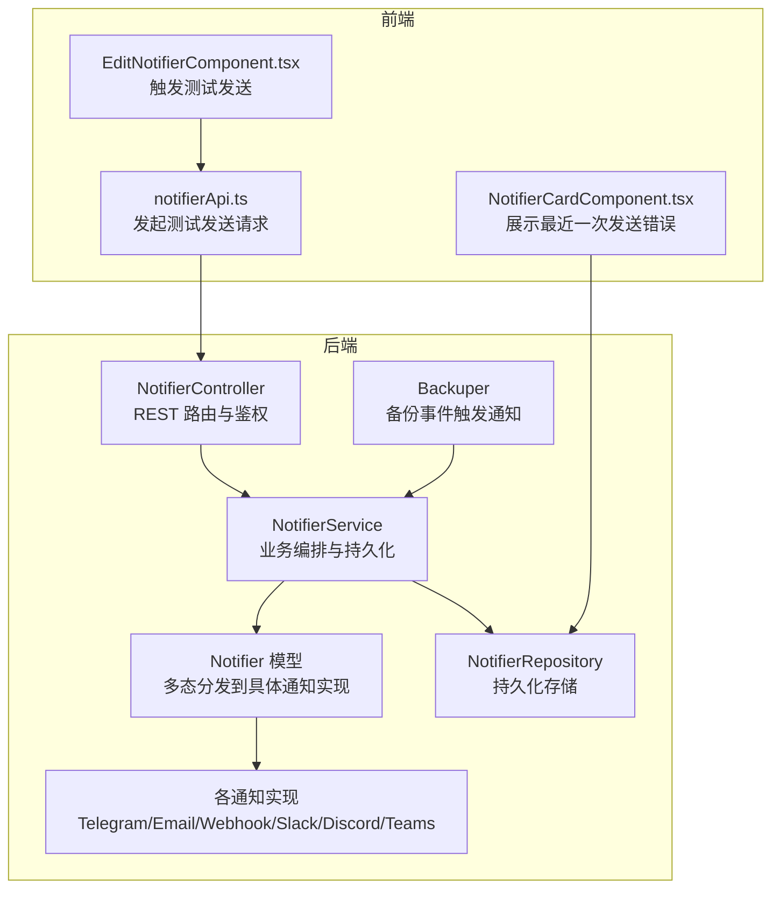
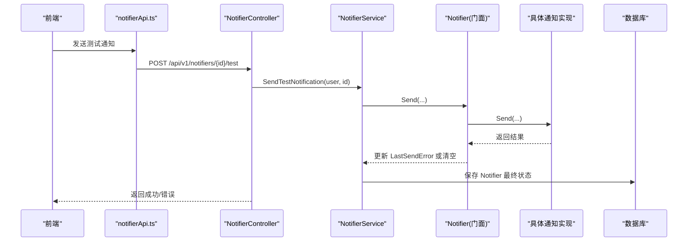
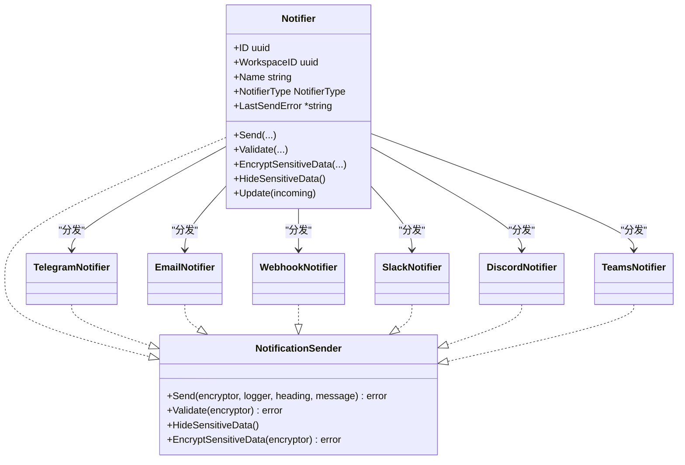
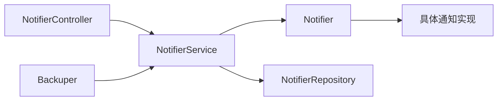

# 通知发送机制

<cite>
**本文引用的文件**
- [backend/internal/features/notifiers/controller.go](file://backend/internal/features/notifiers/controller.go)
- [backend/internal/features/notifiers/service.go](file://backend/internal/features/notifiers/service.go)
- [backend/internal/features/notifiers/interfaces.go](file://backend/internal/features/notifiers/interfaces.go)
- [backend/internal/features/notifiers/model.go](file://backend/internal/features/notifiers/model.go)
- [backend/internal/features/backups/backups/backuping/backuper.go](file://backend/internal/features/backups/backups/backuping/backuper.go)
- [frontend/src/entity/notifiers/api/notifierApi.ts](file://frontend/src/entity/notifiers/api/notifierApi.ts)
- [frontend/src/features/notifiers/ui/edit/EditNotifierComponent.tsx](file://frontend/src/features/notifiers/ui/edit/EditNotifierComponent.tsx)
- [frontend/src/features/notifiers/ui/NotifierCardComponent.tsx](file://frontend/src/features/notifiers/ui/NotifierCardComponent.tsx)
</cite>

## 目录
1. [简介](#简介)
2. [项目结构](#项目结构)
3. [核心组件](#核心组件)
4. [架构总览](#架构总览)
5. [详细组件分析](#详细组件分析)
6. [依赖分析](#依赖分析)
7. [性能考虑](#性能考虑)
8. [故障排查指南](#故障排查指南)
9. [结论](#结论)
10. [附录](#附录)

## 简介
本文件系统性阐述 Databasus 的通知发送机制，覆盖从事件触发到通知送达的完整链路，包括异步处理架构（消息队列与任务调度）、并发控制、重试与退避策略、错误分类与处理、监控与追踪、优化策略（批量、压缩、连接池）以及通知优先级与队列管理。文档以代码为依据，结合前后端交互路径，帮助技术与非技术读者全面理解通知系统的实现与运维要点。

## 项目结构
通知子系统由后端控制器、服务层、模型与具体通知实现组成；前端提供测试发送与状态展示能力；备份模块在关键事件中调用通知发送接口。

图表来源
- [backend/internal/features/notifiers/controller.go:19-27](file://backend/internal/features/notifiers/controller.go#L19-L27)
- [backend/internal/features/notifiers/service.go:15-22](file://backend/internal/features/notifiers/service.go#L15-L22)
- [backend/internal/features/notifiers/model.go:18-32](file://backend/internal/features/notifiers/model.go#L18-L32)
- [backend/internal/features/backups/backups/backuping/backuper.go:38](file://backend/internal/features/backups/backups/backuping/backuper.go#L38)

章节来源
- [backend/internal/features/notifiers/controller.go:19-27](file://backend/internal/features/notifiers/controller.go#L19-L27)
- [backend/internal/features/notifiers/service.go:15-22](file://backend/internal/features/notifiers/service.go#L15-L22)
- [backend/internal/features/notifiers/model.go:18-32](file://backend/internal/features/notifiers/model.go#L18-L32)
- [backend/internal/features/backups/backups/backuping/backuper.go:38](file://backend/internal/features/backups/backups/backuping/backuper.go#L38)

## 核心组件
- 控制器：负责路由注册、鉴权校验、参数解析与错误响应。
- 服务层：封装业务规则（权限、审计日志、消息截断、持久化更新 LastSendError），协调具体通知实现。
- 模型与接口：定义统一的 NotificationSender 接口，Notifier 作为门面对象，按类型分发到具体通知实现。
- 具体通知实现：Telegram、Email、Webhook、Slack、Discord、Teams 等。
- 备份模块：在备份生命周期关键节点调用通知发送。

章节来源
- [backend/internal/features/notifiers/controller.go:14-17](file://backend/internal/features/notifiers/controller.go#L14-L17)
- [backend/internal/features/notifiers/service.go:15-22](file://backend/internal/features/notifiers/service.go#L15-L22)
- [backend/internal/features/notifiers/interfaces.go:11-24](file://backend/internal/features/notifiers/interfaces.go#L11-L24)
- [backend/internal/features/notifiers/model.go:18-32](file://backend/internal/features/notifiers/model.go#L18-L32)
- [backend/internal/features/backups/backups/backuping/backuper.go:38](file://backend/internal/features/backups/backups/backuping/backuper.go#L38)

## 架构总览
通知发送采用同步阻塞式调用，不涉及内置消息队列或后台任务框架。发送流程通过控制器-服务-模型-具体实现的链路完成，错误信息写回数据库并在前端卡片中展示。

图表来源
- [frontend/src/entity/notifiers/api/notifierApi.ts:42-48](file://frontend/src/entity/notifiers/api/notifierApi.ts#L42-L48)
- [backend/internal/features/notifiers/controller.go:203-226](file://backend/internal/features/notifiers/controller.go#L203-L226)
- [backend/internal/features/notifiers/service.go:209-237](file://backend/internal/features/notifiers/service.go#L209-L237)
- [backend/internal/features/notifiers/model.go:46-62](file://backend/internal/features/notifiers/model.go#L46-L62)

## 详细组件分析

### 控制器层（NotifierController）
- 职责：注册路由、鉴权、参数校验、错误映射。
- 关键点：
  - 支持保存、查询、删除、转移、直接测试、ID 测试等接口。
  - 对每类操作进行用户身份与工作空间权限校验。
  - 将错误转换为 HTTP 状态码返回。

章节来源
- [backend/internal/features/notifiers/controller.go:19-27](file://backend/internal/features/notifiers/controller.go#L19-L27)
- [backend/internal/features/notifiers/controller.go:42-70](file://backend/internal/features/notifiers/controller.go#L42-L70)
- [backend/internal/features/notifiers/controller.go:203-226](file://backend/internal/features/notifiers/controller.go#L203-L226)
- [backend/internal/features/notifiers/controller.go:297-334](file://backend/internal/features/notifiers/controller.go#L297-L334)

### 服务层（NotifierService）
- 职责：业务编排、权限校验、审计日志、消息长度截断、持久化更新 LastSendError。
- 关键点：
  - 测试发送：从数据库加载 Notifier，调用具体实现发送，再保存结果。
  - 正式发送：截断消息长度至 2000 字符，调用具体实现发送，失败时记录 LastSendError，成功则清空。
  - 权限：基于工作空间访问/管理权限判断。
  - 审计：创建/更新/删除/转移均写入审计日志。

章节来源
- [backend/internal/features/notifiers/service.go:30-113](file://backend/internal/features/notifiers/service.go#L30-L113)
- [backend/internal/features/notifiers/service.go:209-237](file://backend/internal/features/notifiers/service.go#L209-L237)
- [backend/internal/features/notifiers/service.go:239-274](file://backend/internal/features/notifiers/service.go#L239-L274)
- [backend/internal/features/notifiers/service.go:276-308](file://backend/internal/features/notifiers/service.go#L276-L308)

### 模型与接口（Notifier/NotificationSender）
- NotificationSender 接口：定义 Send、Validate、HideSensitiveData、EncryptSensitiveData。
- Notifier 门面：根据 NotifierType 分发到具体实现；统一加密、隐藏敏感信息、更新字段。
- 具体实现：Telegram、Email、Webhook、Slack、Discord、Teams。

图表来源
- [backend/internal/features/notifiers/interfaces.go:11-24](file://backend/internal/features/notifiers/interfaces.go#L11-L24)
- [backend/internal/features/notifiers/model.go:18-32](file://backend/internal/features/notifiers/model.go#L18-L32)
- [backend/internal/features/notifiers/model.go:104-121](file://backend/internal/features/notifiers/model.go#L104-L121)

章节来源
- [backend/internal/features/notifiers/interfaces.go:11-24](file://backend/internal/features/notifiers/interfaces.go#L11-L24)
- [backend/internal/features/notifiers/model.go:18-32](file://backend/internal/features/notifiers/model.go#L18-L32)
- [backend/internal/features/notifiers/model.go:46-70](file://backend/internal/features/notifiers/model.go#L46-L70)

### 前端集成与测试
- notifierApi.ts：提供 /notifiers/{id}/test 与 /notifiers/direct-test 接口调用。
- EditNotifierComponent.tsx：点击“发送测试通知”触发测试流程，成功提示与错误弹窗。
- NotifierCardComponent.tsx：展示最近一次发送错误状态，便于快速定位问题。

章节来源
- [frontend/src/entity/notifiers/api/notifierApi.ts:42-57](file://frontend/src/entity/notifiers/api/notifierApi.ts#L42-L57)
- [frontend/src/features/notifiers/ui/edit/EditNotifierComponent.tsx:68-84](file://frontend/src/features/notifiers/ui/edit/EditNotifierComponent.tsx#L68-L84)
- [frontend/src/features/notifiers/ui/NotifierCardComponent.tsx:37-42](file://frontend/src/features/notifiers/ui/NotifierCardComponent.tsx#L37-L42)

### 备份模块中的通知触发
- 备份节点在心跳、大小限制等场景调用通知发送接口，确保关键事件可被通知。
- 通过 NotificationSender 接口统一调用，兼容多种通知渠道。

章节来源
- [backend/internal/features/backups/backups/backuping/backuper.go:112](file://backend/internal/features/backups/backups/backuping/backuper.go#L112)
- [backend/internal/features/backups/backups/backuping/backuper.go:191](file://backend/internal/features/backups/backups/backuping/backuper.go#L191)
- [backend/internal/features/backups/backups/backuping/backuper.go:364](file://backend/internal/features/backups/backups/backuping/backuper.go#L364)
- [backend/internal/features/backups/backups/backuping/backuper.go:377](file://backend/internal/features/backups/backups/backuping/backuper.go#L377)
- [backend/internal/features/backups/backups/backuping/backuper.go:380](file://backend/internal/features/backups/backups/backuping/backuper.go#L380)
- [backend/internal/features/backups/backups/backuping/backuper.go:427](file://backend/internal/features/backups/backups/backuping/backuper.go#L427)
- [backend/internal/features/backups/backups/backuping/backuper.go:428](file://backend/internal/features/backups/backups/backuping/backuper.go#L428)

## 依赖分析
- 控制器依赖服务层；服务层依赖模型与仓库；模型依赖具体通知实现；备份模块依赖服务层。
- 权限控制贯穿控制器与服务层，确保仅授权用户可执行测试与管理操作。
- 错误处理集中在服务层，统一持久化 LastSendError 并返回上层。

图表来源
- [backend/internal/features/notifiers/controller.go:14-17](file://backend/internal/features/notifiers/controller.go#L14-L17)
- [backend/internal/features/notifiers/service.go:15-22](file://backend/internal/features/notifiers/service.go#L15-L22)
- [backend/internal/features/notifiers/model.go:18-32](file://backend/internal/features/notifiers/model.go#L18-L32)
- [backend/internal/features/backups/backups/backuping/backuper.go:38](file://backend/internal/features/backups/backups/backuping/backuper.go#L38)

章节来源
- [backend/internal/features/notifiers/controller.go:14-17](file://backend/internal/features/notifiers/controller.go#L14-L17)
- [backend/internal/features/notifiers/service.go:15-22](file://backend/internal/features/notifiers/service.go#L15-L22)
- [backend/internal/features/notifiers/model.go:18-32](file://backend/internal/features/notifiers/model.go#L18-L32)
- [backend/internal/features/backups/backups/backuping/backuper.go:38](file://backend/internal/features/backups/backups/backuping/backuper.go#L38)

## 性能考虑
- 同步阻塞发送：当前实现为同步调用，未内置消息队列或后台任务框架，适合低并发场景。
- 批量发送：未见批量聚合发送逻辑，建议在上游事件合并后再调用发送接口，减少重复调用。
- 压缩传输：未见对通知内容的压缩处理，可在具体实现侧（如 Webhook/Email）按需启用压缩。
- 连接池管理：未见显式的连接池配置，建议在具体通知实现中复用底层 HTTP/SMTP 连接，避免频繁握手。
- 并发控制：未见全局并发限制，建议在服务层增加令牌桶或信号量，防止突发流量导致下游过载。
- 消息截断：服务层已对消息长度进行截断，避免超长消息影响下游稳定性。

章节来源
- [backend/internal/features/notifiers/service.go:281-285](file://backend/internal/features/notifiers/service.go#L281-L285)

## 故障排查指南
- 错误分类与处理
  - 认证失败：控制器对未登录用户返回 401。
  - 权限不足：控制器与服务层对查看/管理/测试权限不足返回 403。
  - 参数错误：控制器对非法 UUID、缺失参数返回 400。
  - 发送失败：服务层捕获错误并写入 Notifier.LastSendError，前端卡片可据此展示。
- 日志与审计
  - 服务层使用 slog 记录错误；审计日志记录创建/更新/删除/转移等操作。
- 监控与追踪
  - LastSendError 字段用于记录最近一次发送错误文本，前端卡片展示“有发送错误”状态。
  - 建议扩展：在服务层埋点发送耗时、成功率、失败原因统计，结合外部监控系统采集指标。

章节来源
- [backend/internal/features/notifiers/controller.go:204-223](file://backend/internal/features/notifiers/controller.go#L204-L223)
- [backend/internal/features/notifiers/service.go:293-301](file://backend/internal/features/notifiers/service.go#L293-L301)
- [frontend/src/features/notifiers/ui/NotifierCardComponent.tsx:37-42](file://frontend/src/features/notifiers/ui/NotifierCardComponent.tsx#L37-L42)

## 结论
Databasus 的通知发送机制以清晰的分层设计实现：控制器负责接入与鉴权，服务层承担业务编排与持久化，模型通过接口实现多态分发到具体通知实现。当前为同步阻塞式调用，具备良好的可维护性与可观测性（LastSendError 与审计日志）。对于高并发与可靠性需求，建议引入消息队列与后台任务、实施指数退避与最大重试、增强连接池与批量发送策略，并完善监控指标与告警。

## 附录
- 通知优先级与队列管理：当前未发现显式的优先级队列机制，建议在服务层引入队列与优先级标记，配合后台任务实现异步重试与削峰填谷。
- 重试策略与退避算法：当前未实现内置重试与退避，建议在具体通知实现中增加指数退避（含抖动）与最大重试次数配置，失败后写入失败记录以便人工干预。
- 事件触发点：备份模块在心跳、大小限制等场景触发通知，建议将更多关键事件（如备份开始/结束/失败）纳入通知范围。