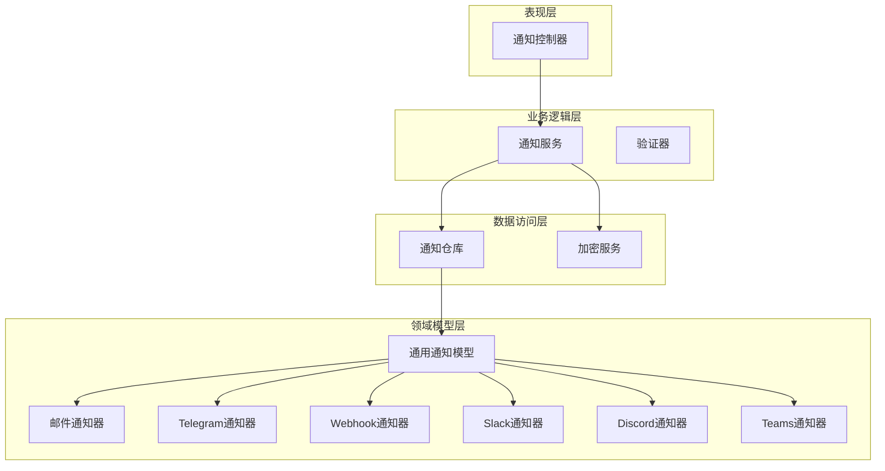
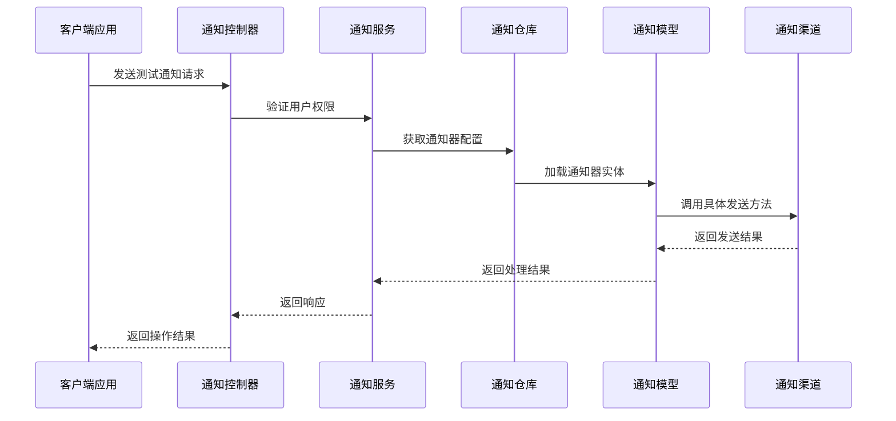
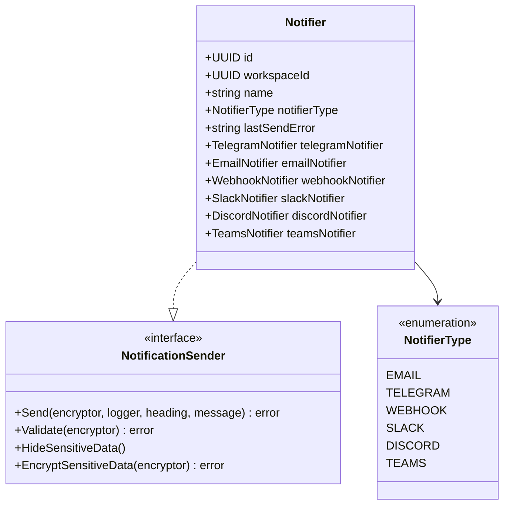
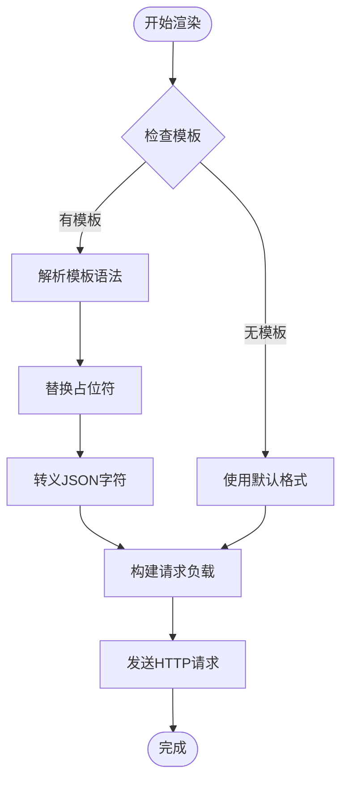
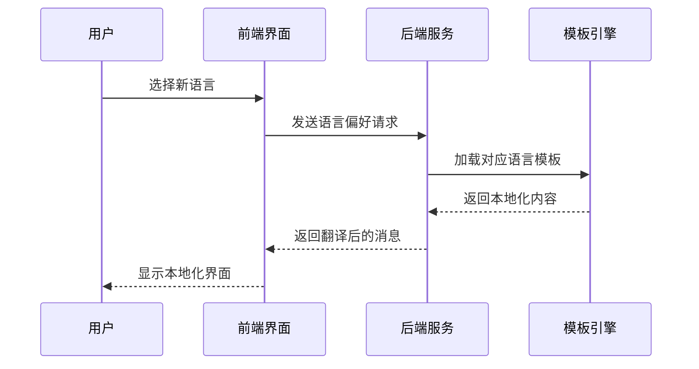
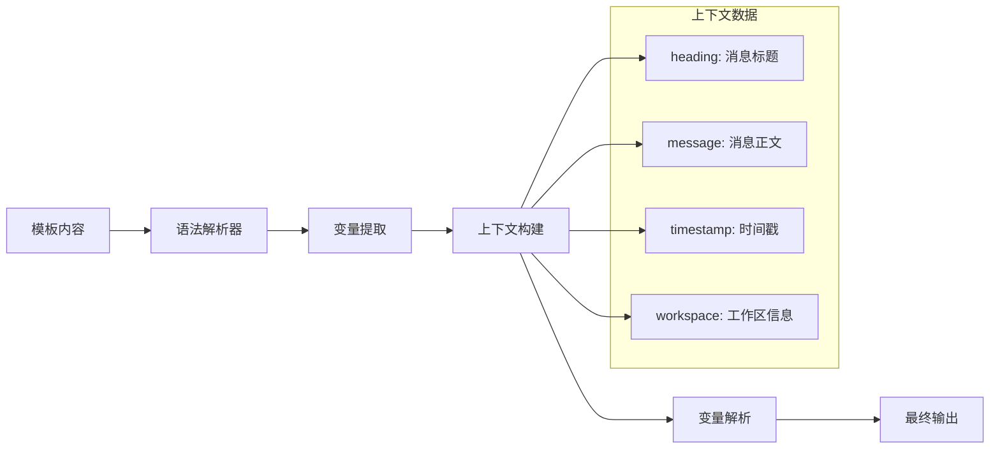
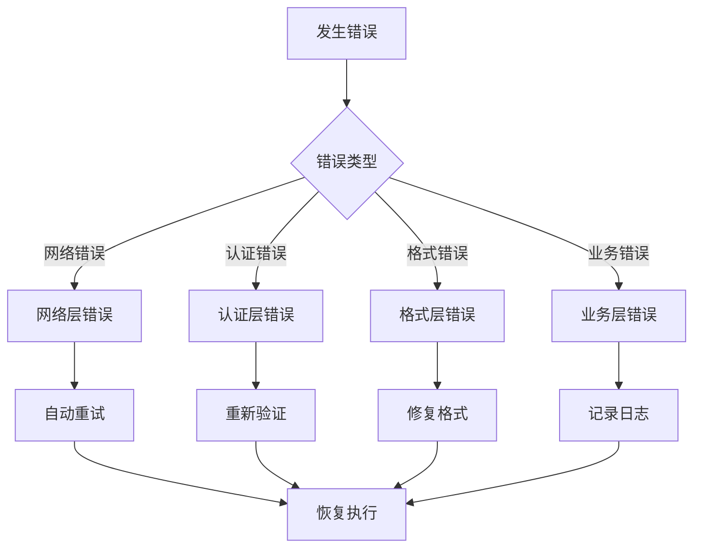

# 通知模板系统

<cite>
**本文档中引用的文件**
- [controller.go](file://backend/internal/features/notifiers/controller.go)
- [service.go](file://backend/internal/features/notifiers/service.go)
- [model.go](file://backend/internal/features/notifiers/model.go)
- [interfaces.go](file://backend/internal/features/notifiers/interfaces.go)
- [repository.go](file://backend/internal/features/notifiers/repository.go)
- [dto.go](file://backend/internal/features/notifiers/dto.go)
- [enums.go](file://backend/internal/features/notifiers/enums.go)
- [email_notifier_model.go](file://backend/internal/features/notifiers/models/email_notifier/model.go)
- [telegram_model.go](file://backend/internal/features/notifiers/models/telegram/model.go)
- [webhook_model.go](file://backend/internal/features/notifiers/models/webhook/model.go)
- [slack_model.go](file://backend/internal/features/notifiers/models/slack/model.go)
- [teams_model.go](file://backend/internal/features/notifiers/models/teams/model.go)
- [discord_model.go](file://backend/internal/features/notifiers/models/discord/model.go)
</cite>

## 目录
1. [简介](#简介)
2. [项目结构](#项目结构)
3. [核心组件](#核心组件)
4. [架构概览](#架构概览)
5. [详细组件分析](#详细组件分析)
6. [模板语法与表达式](#模板语法与表达式)
7. [多语言模板支持](#多语言模板支持)
8. [模板渲染引擎](#模板渲染引擎)
9. [模板设计指南](#模板设计指南)
10. [模板测试与调试](#模板测试与调试)
11. [版本管理与变更追踪](#版本管理与变更追踪)
12. [故障排除指南](#故障排除指南)
13. [结论](#结论)

## 简介

Databasus通知模板系统是一个功能强大的多渠道通知发送平台，支持邮件、Telegram、Webhook、Slack、Discord和Microsoft Teams等多种通知方式。该系统采用模块化设计，通过统一的接口抽象实现了不同通知渠道的标准化处理。

系统的核心特性包括：
- 多渠道通知支持（EMAIL、TELEGRAM、WEBHOOK、SLACK、DISCORD、TEAMS）
- 安全的数据加密存储（敏感信息加密）
- 统一的模板渲染机制
- 完善的权限控制和审计日志
- 可扩展的通知发送架构

## 项目结构

通知模板系统在后端采用分层架构设计，主要分为以下层次：

**图表来源**
- [controller.go:14-27](file://backend/internal/features/notifiers/controller.go#L14-L27)
- [service.go:15-22](file://backend/internal/features/notifiers/service.go#L15-L22)
- [repository.go:10-11](file://backend/internal/features/notifiers/repository.go#L10-L11)

**章节来源**
- [controller.go:1-335](file://backend/internal/features/notifiers/controller.go#L1-L335)
- [service.go:1-396](file://backend/internal/features/notifiers/service.go#L1-L396)
- [model.go:1-122](file://backend/internal/features/notifiers/model.go#L1-L122)

## 核心组件

### 通知控制器（NotifierController）

通知控制器负责处理所有与通知相关的HTTP请求，提供RESTful API接口：

- **保存通知器**：创建或更新通知配置
- **获取通知器**：按ID查询单个通知器
- **获取所有通知器**：按工作区查询通知器列表
- **删除通知器**：删除指定通知器
- **发送测试通知**：验证通知配置的有效性
- **转移通知器**：在工作区间转移通知器所有权

### 通知服务（NotifierService）

通知服务是业务逻辑的核心，负责：
- 权限验证和工作区访问控制
- 通知器的生命周期管理
- 测试通知的发送和验证
- 通知发送的错误处理和状态跟踪
- 审计日志记录

### 通知模型（Notifier）

通用通知模型采用组合模式，支持多种通知类型：
- **多态设计**：通过NotifierType字段区分不同类型的通知器
- **关联映射**：一对一关联到具体的通知器实现
- **统一接口**：通过NotificationSender接口实现多态调用

**章节来源**
- [controller.go:29-335](file://backend/internal/features/notifiers/controller.go#L29-L335)
- [service.go:30-396](file://backend/internal/features/notifiers/service.go#L30-L396)
- [model.go:18-122](file://backend/internal/features/notifiers/model.go#L18-L122)

## 架构概览

系统采用Clean Architecture设计原则，实现了关注点分离和依赖倒置：

**图表来源**
- [controller.go:191-226](file://backend/internal/features/notifiers/controller.go#L191-L226)
- [service.go:209-237](file://backend/internal/features/notifiers/service.go#L209-L237)
- [repository.go:125-142](file://backend/internal/features/notifiers/repository.go#L125-L142)

**章节来源**
- [interfaces.go:11-24](file://backend/internal/features/notifiers/interfaces.go#L11-L24)
- [repository.go:1-218](file://backend/internal/features/notifiers/repository.go#L1-L218)

## 详细组件分析

### 通知器类型枚举

系统支持六种通知器类型，每种类型都有特定的配置要求和发送逻辑：

**图表来源**
- [enums.go:3-12](file://backend/internal/features/notifiers/enums.go#L3-L12)
- [interfaces.go:11-24](file://backend/internal/features/notifiers/interfaces.go#L11-L24)
- [model.go:18-32](file://backend/internal/features/notifiers/model.go#L18-L32)

### 邮件通知器（EmailNotifier）

邮件通知器支持标准SMTP协议，具有完整的安全特性：

**核心功能**：
- 支持Implicit TLS（端口465）和StartTLS两种加密方式
- 兼容多种SMTP认证机制（PLAIN、LOGIN）
- 自动处理RFC 2047编码的邮件头
- 支持自定义发件人地址

**安全特性**：
- 敏感信息（SMTP密码）加密存储
- 可选的证书验证跳过（用于特殊环境）
- 自动主机名检测和设置

**章节来源**
- [email_notifier_model.go:27-36](file://backend/internal/features/notifiers/models/email_notifier/model.go#L27-L36)
- [email_notifier_model.go:63-93](file://backend/internal/features/notifiers/models/email_notifier/model.go#L63-L93)

### Telegram通知器（TelegramNotifier）

Telegram通知器基于官方Bot API，提供简洁的消息发送功能：

**核心功能**：
- 支持消息线程（ThreadID）功能
- HTML格式消息支持
- Bot令牌加密存储
- Chat ID验证

**发送流程**：
1. 解密Bot令牌
2. 构建完整消息（标题+正文）
3. 调用Telegram Bot API
4. 处理API响应并返回结果

**章节来源**
- [telegram_model.go:19-24](file://backend/internal/features/notifiers/models/telegram/model.go#L19-L24)
- [telegram_model.go:42-95](file://backend/internal/features/notifiers/models/telegram/model.go#L42-L95)

### Webhook通知器（WebhookNotifier）

Webhook通知器是最灵活的通知方式，支持自定义消息格式：

**核心功能**：
- 支持GET和POST两种HTTP方法
- JSON格式请求体构建
- 自定义请求头支持
- 模板化消息内容

**模板系统**：
- 使用双花括号语法：{{heading}}、{{message}}
- 自动JSON转义处理
- 可选的自定义BodyTemplate

**章节来源**
- [webhook_model.go:30-38](file://backend/internal/features/notifiers/models/webhook/model.go#L30-L38)
- [webhook_model.go:228-243](file://backend/internal/features/notifiers/models/webhook/model.go#L228-L243)

### Slack通知器（SlackNotifier）

Slack通知器提供企业级团队协作通知功能：

**核心功能**：
- 支持频道、群组、私聊和用户消息
- Markdown格式支持
- 智能重试机制（指数退避）
- 速率限制自动处理

**错误处理**：
- 429状态码的Retry-After头部处理
- 最大重试次数限制
- 详细的日志记录

**章节来源**
- [slack_model.go:21-25](file://backend/internal/features/notifiers/models/slack/model.go#L21-L25)
- [slack_model.go:49-152](file://backend/internal/features/notifiers/models/slack/model.go#L49-L152)

## 模板语法与表达式

### 占位符系统

系统提供了统一的占位符语法，用于动态内容插入：

**通用占位符**：
- `{{heading}}` - 消息标题
- `{{message}}` - 消息正文

**Webhook特有语法**：
- 在自定义BodyTemplate中使用占位符进行模板化
- 自动进行JSON字符串转义
- 支持复杂的JSON结构嵌套

### 表达式语言

系统采用简单的字符串替换机制，不支持复杂的表达式计算：

**图表来源**
- [webhook_model.go:228-243](file://backend/internal/features/notifiers/models/webhook/model.go#L228-L243)
- [webhook_model.go:253-265](file://backend/internal/features/notifiers/models/webhook/model.go#L253-L265)

**章节来源**
- [webhook_model.go:228-277](file://backend/internal/features/notifiers/models/webhook/model.go#L228-L277)

## 多语言模板支持

### 国际化配置

系统通过以下机制支持多语言模板：

**语言环境检测**：
- 基于浏览器语言设置自动检测
- 支持多种日期时间格式（MDY、DMY、YMD）
- 动态时区转换支持

**消息本地化**：
- 使用系统预设的多语言消息模板
- 支持动态语言切换
- 自动适应本地化格式

### 语言切换机制

**图表来源**
- [getUserTimeFormat.ts:1-67](file://frontend/src/shared/time/getUserTimeFormat.ts#L1-L67)

**章节来源**
- [getUserTimeFormat.ts:1-67](file://frontend/src/shared/time/getUserTimeFormat.ts#L1-L67)

## 模板渲染引擎

### 上下文构建

模板渲染引擎负责将动态数据与静态模板结合：

**上下文数据结构**：
- 消息标题（heading）
- 消息正文（message）
- 时间戳信息
- 工作区元数据

**数据绑定过程**：
1. 解析模板语法
2. 查找对应的上下文变量
3. 执行字符串替换
4. 进行必要的格式化处理

### 变量解析

系统采用简单的键值对替换机制：

**图表来源**
- [webhook_model.go:228-243](file://backend/internal/features/notifiers/models/webhook/model.go#L228-L243)

### 输出格式化

根据不同的通知渠道，系统会进行相应的格式化处理：

**邮件格式**：
- HTML内容类型
- UTF-8字符集
- RFC 2047编码的邮件头

**Telegram格式**：
- HTML解析模式
- 自动换行处理

**Slack格式**：
- Markdown支持
- 特殊字符转义

**章节来源**
- [email_notifier_model.go:142-163](file://backend/internal/features/notifiers/models/email_notifier/model.go#L142-L163)
- [telegram_model.go:53-67](file://backend/internal/features/notifiers/models/telegram/model.go#L53-L67)
- [slack_model.go:59-69](file://backend/internal/features/notifiers/models/slack/model.go#L59-L69)

## 模板设计指南

### 可读性最佳实践

**模板命名规范**：
- 使用描述性的模板名称
- 采用层级化的命名结构
- 保持模板文件组织清晰

**占位符使用建议**：
- 使用语义化的占位符名称
- 避免过长的占位符标识
- 保持占位符的一致性

**内容组织原则**：
- 将相似的内容组织在同一模板中
- 使用注释说明复杂逻辑
- 保持模板的单一职责

### 维护性考虑

**版本控制策略**：
- 为重要模板建立版本历史
- 使用分支管理模板变更
- 建立模板回滚机制

**依赖管理**：
- 最小化模板间的依赖关系
- 避免循环依赖
- 使用接口抽象减少耦合

### 性能优化

**模板缓存**：
- 对常用模板进行内存缓存
- 实现模板编译缓存
- 使用LRU缓存策略

**渲染优化**：
- 避免复杂的字符串操作
- 减少不必要的格式化步骤
- 使用高效的字符串替换算法

## 模板测试与调试

### 测试框架

系统提供了完整的测试工具链：

**单元测试**：
- 每个通知器都有对应的测试文件
- 覆盖正常和异常场景
- 包含边界条件测试

**集成测试**：
- 端到端通知发送测试
- 错误处理验证
- 性能基准测试

### 调试工具

**日志记录**：
- 详细的发送过程日志
- 错误堆栈跟踪
- 性能指标监控

**测试通知**：
- 直接测试通知器配置
- 支持离线测试模式
- 自动化测试执行

**章节来源**
- [controller.go:284-334](file://backend/internal/features/notifiers/controller.go#L284-L334)
- [service.go:209-274](file://backend/internal/features/notifiers/service.go#L209-L274)

## 版本管理与变更追踪

### 版本控制策略

**模板版本管理**：
- 使用语义化版本控制
- 为重大变更创建版本标签
- 维护向后兼容性

**变更追踪机制**：
- 审计日志记录所有模板变更
- 跟踪模板的使用情况
- 监控模板性能指标

### 数据迁移

**向后兼容性**：
- 渐进式模板升级
- 自动数据格式转换
- 兼容旧版本配置

**备份策略**：
- 模板变更前自动备份
- 支持一键回滚
- 版本差异对比

## 故障排除指南

### 常见问题诊断

**连接问题**：
- 检查网络连通性
- 验证服务器可达性
- 确认防火墙设置

**认证失败**：
- 验证凭据正确性
- 检查令牌有效期
- 确认权限设置

**格式错误**：
- 验证模板语法
- 检查占位符完整性
- 确认数据类型匹配

### 错误处理机制

系统实现了多层次的错误处理：

**图表来源**
- [slack_model.go:114-131](file://backend/internal/features/notifiers/models/slack/model.go#L114-L131)

### 性能监控

**关键指标**：
- 发送成功率
- 响应时间分布
- 错误率统计
- 资源使用情况

**监控告警**：
- 异常阈值设置
- 自动告警机制
- 性能基线对比

**章节来源**
- [service.go:28-308](file://backend/internal/features/notifiers/service.go#L28-L308)
- [slack_model.go:71-151](file://backend/internal/features/notifiers/models/slack/model.go#L71-L151)

## 结论

Databasus通知模板系统通过其模块化设计和标准化接口，为多渠道通知需求提供了完整的解决方案。系统的主要优势包括：

**技术优势**：
- 清晰的架构分层和职责分离
- 完善的安全机制和数据保护
- 灵活的模板系统和多语言支持
- 强大的错误处理和监控能力

**扩展性特点**：
- 易于添加新的通知渠道
- 支持复杂的业务场景
- 良好的性能表现
- 完善的测试和调试工具

该系统为企业级应用提供了可靠的通知基础设施，能够满足各种复杂的业务需求和合规要求。