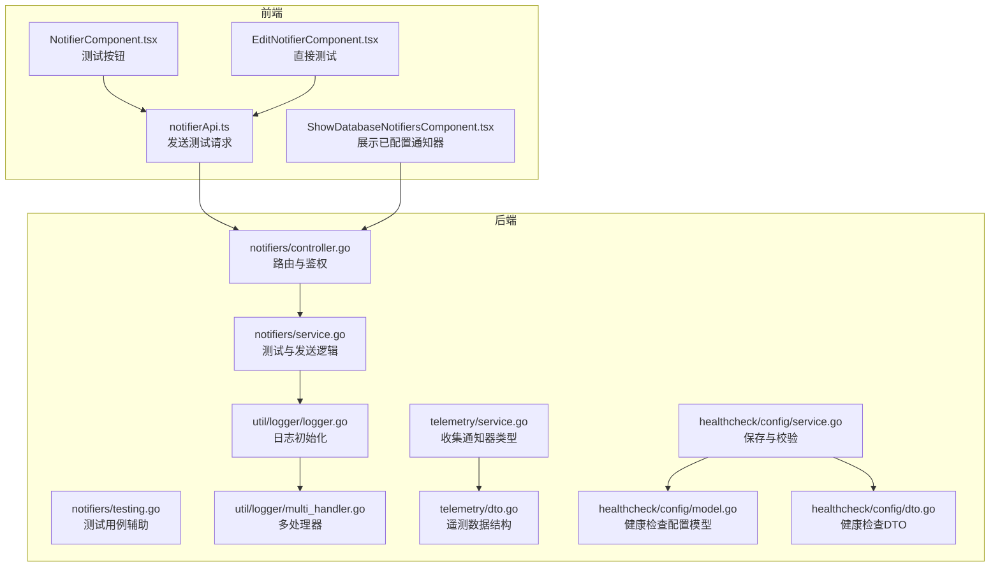
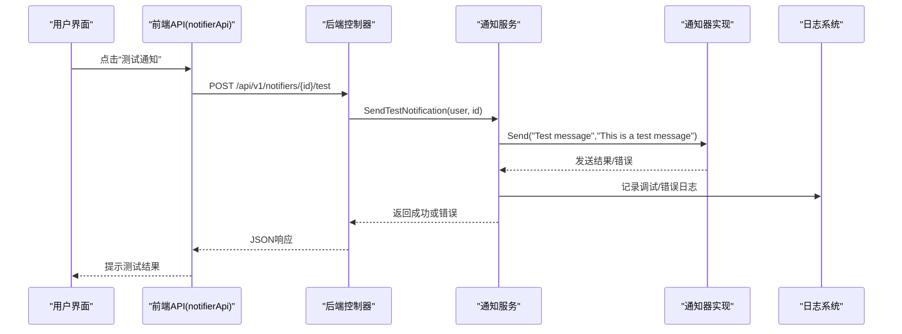
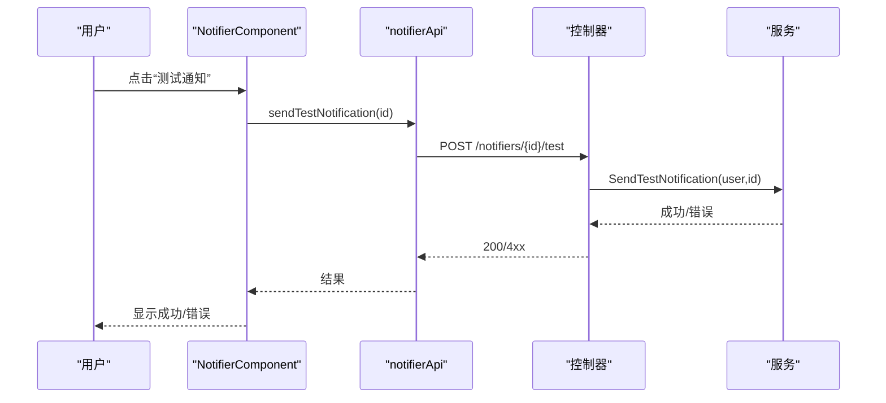
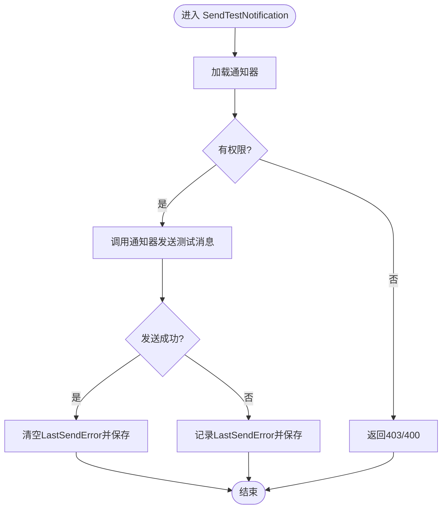
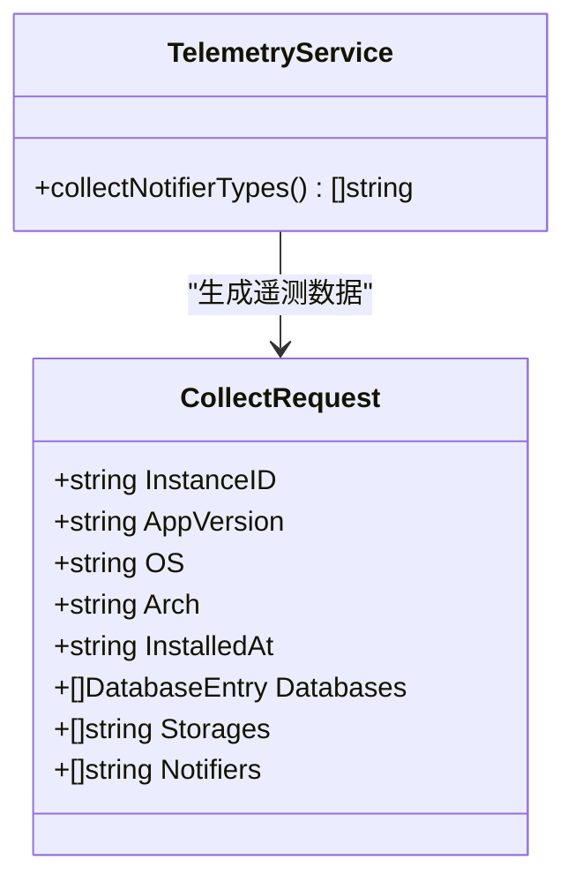
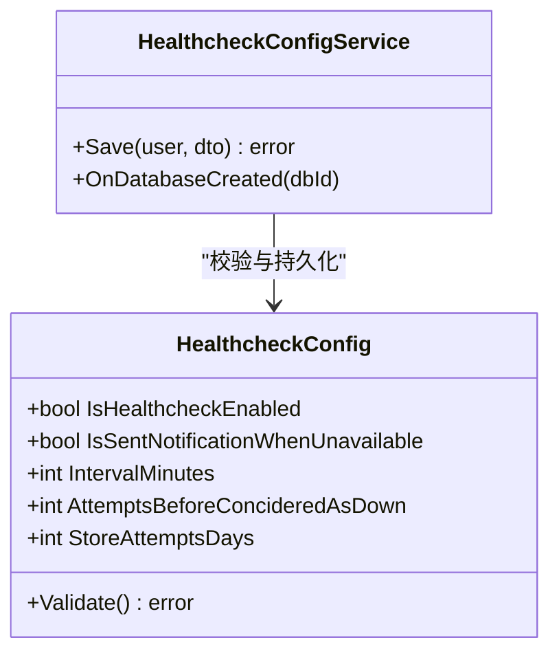
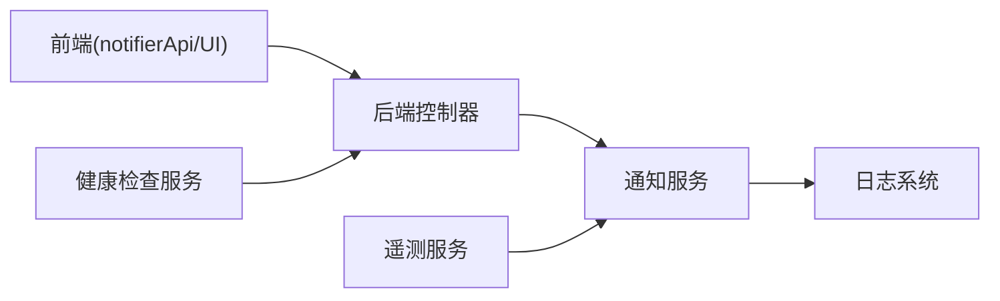
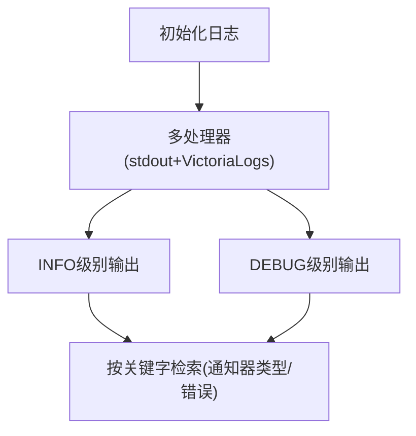

# 通知测试与故障排除

<cite>
**本文引用的文件**
- [backend/internal/features/notifiers/controller.go](file://backend/internal/features/notifiers/controller.go)
- [backend/internal/features/notifiers/service.go](file://backend/internal/features/notifiers/service.go)
- [backend/internal/features/notifiers/testing.go](file://backend/internal/features/notifiers/testing.go)
- [frontend/src/entity/notifiers/api/notifierApi.ts](file://frontend/src/entity/notifiers/api/notifierApi.ts)
- [frontend/src/features/notifiers/ui/NotifierComponent.tsx](file://frontend/src/features/notifiers/ui/NotifierComponent.tsx)
- [frontend/src/features/notifiers/ui/edit/EditNotifierComponent.tsx](file://frontend/src/features/notifiers/ui/edit/EditNotifierComponent.tsx)
- [frontend/src/features/notifiers/ui/show/ShowNotifierComponent.tsx](file://frontend/src/features/notifiers/ui/show/ShowNotifierComponent.tsx)
- [frontend/src/features/databases/ui/show/ShowDatabaseNotifiersComponent.tsx](file://frontend/src/features/databases/ui/show/ShowDatabaseNotifiersComponent.tsx)
- [backend/internal/features/telemetry/service.go](file://backend/internal/features/telemetry/service.go)
- [backend/internal/features/telemetry/dto.go](file://backend/internal/features/telemetry/dto.go)
- [backend/internal/features/telemetry/background_service.go](file://backend/internal/features/telemetry/background_service.go)
- [backend/internal/util/logger/logger.go](file://backend/internal/util/logger/logger.go)
- [backend/internal/util/logger/multi_handler.go](file://backend/internal/util/logger/multi_handler.go)
- [backend/internal/features/healthcheck/config/model.go](file://backend/internal/features/healthcheck/config/model.go)
- [backend/internal/features/healthcheck/config/dto.go](file://backend/internal/features/healthcheck/config/dto.go)
- [backend/internal/features/healthcheck/config/service.go](file://backend/internal/features/healthcheck/config/service.go)
- [frontend/src/entity/healthcheck/api/healthcheckConfigApi.ts](file://frontend/src/entity/healthcheck/api/healthcheckConfigApi.ts)
- [frontend/src/features/healthcheck/ui/ShowHealthcheckConfigComponent.tsx](file://frontend/src/features/healthcheck/ui/ShowHealthcheckConfigComponent.tsx)
</cite>

## 目录
1. [简介](#简介)
2. [项目结构](#项目结构)
3. [核心组件](#核心组件)
4. [架构总览](#架构总览)
5. [详细组件分析](#详细组件分析)
6. [依赖分析](#依赖分析)
7. [性能考虑](#性能考虑)
8. [故障排除指南](#故障排除指南)
9. [结论](#结论)
10. [附录](#附录)

## 简介
本指南面向运维与开发人员，提供 Databasus 通知系统的“测试与故障排除”实用操作手册。内容涵盖：
- 通知测试功能的使用方法：测试按钮、模拟事件、预览能力
- 常见问题诊断步骤与解决方案：连接失败、认证错误、格式错误等
- 日志分析方法：错误日志、调试信息、性能指标
- 故障排除工具与技术：网络诊断、API 测试、配置验证
- 通知系统的监控与告警配置：健康检查与通知联动
- 性能调优建议：并发限制、超时设置、资源优化
- 健康检查与定期维护流程

## 项目结构
通知系统由后端控制器与服务层、前端 API 与 UI 组件构成，并与遥测、日志、健康检查模块协同工作。

**图示来源**
- [backend/internal/features/notifiers/controller.go:19-27](file://backend/internal/features/notifiers/controller.go#L19-L27)
- [backend/internal/features/notifiers/service.go:209-237](file://backend/internal/features/notifiers/service.go#L209-L237)
- [frontend/src/entity/notifiers/api/notifierApi.ts:42-57](file://frontend/src/entity/notifiers/api/notifierApi.ts#L42-L57)
- [frontend/src/features/notifiers/ui/NotifierComponent.tsx:51-74](file://frontend/src/features/notifiers/ui/NotifierComponent.tsx#L51-L74)
- [backend/internal/util/logger/logger.go:19-49](file://backend/internal/util/logger/logger.go#L19-L49)
- [backend/internal/util/logger/multi_handler.go:31-50](file://backend/internal/util/logger/multi_handler.go#L31-L50)
- [backend/internal/features/telemetry/service.go:211-236](file://backend/internal/features/telemetry/service.go#L211-L236)
- [backend/internal/features/telemetry/dto.go:8-17](file://backend/internal/features/telemetry/dto.go#L8-L17)
- [backend/internal/features/healthcheck/config/model.go:10-47](file://backend/internal/features/healthcheck/config/model.go#L10-L47)
- [backend/internal/features/healthcheck/config/dto.go:7-28](file://backend/internal/features/healthcheck/config/dto.go#L7-L28)
- [backend/internal/features/healthcheck/config/service.go:33-47](file://backend/internal/features/healthcheck/config/service.go#L33-L47)

**章节来源**
- [backend/internal/features/notifiers/controller.go:19-27](file://backend/internal/features/notifiers/controller.go#L19-L27)
- [backend/internal/features/notifiers/service.go:209-237](file://backend/internal/features/notifiers/service.go#L209-L237)
- [frontend/src/entity/notifiers/api/notifierApi.ts:42-57](file://frontend/src/entity/notifiers/api/notifierApi.ts#L42-L57)
- [frontend/src/features/notifiers/ui/NotifierComponent.tsx:51-74](file://frontend/src/features/notifiers/ui/NotifierComponent.tsx#L51-L74)
- [backend/internal/util/logger/logger.go:19-49](file://backend/internal/util/logger/logger.go#L19-L49)
- [backend/internal/util/logger/multi_handler.go:31-50](file://backend/internal/util/logger/multi_handler.go#L31-L50)
- [backend/internal/features/telemetry/service.go:211-236](file://backend/internal/features/telemetry/service.go#L211-L236)
- [backend/internal/features/telemetry/dto.go:8-17](file://backend/internal/features/telemetry/dto.go#L8-L17)
- [backend/internal/features/healthcheck/config/model.go:10-47](file://backend/internal/features/healthcheck/config/model.go#L10-L47)
- [backend/internal/features/healthcheck/config/dto.go:7-28](file://backend/internal/features/healthcheck/config/dto.go#L7-L28)
- [backend/internal/features/healthcheck/config/service.go:33-47](file://backend/internal/features/healthcheck/config/service.go#L33-L47)

## 核心组件
- 后端通知控制器：提供保存、查询、删除、测试、转移等接口；包含鉴权与权限控制。
- 通知服务：封装测试与发送逻辑，负责敏感字段加密、持久化、审计日志记录。
- 前端通知 API：封装后端 REST 接口，支持“按ID测试”和“直接测试（不落库）”两种方式。
- 前端通知 UI：提供测试按钮、编辑与展示组件，支持直接测试并提示结果。
- 遥测服务：收集通知器类型，用于统计与上报。
- 健康检查配置：定义健康检查开关、间隔、失败阈值与存储策略，可联动通知。

**章节来源**
- [backend/internal/features/notifiers/controller.go:19-27](file://backend/internal/features/notifiers/controller.go#L19-L27)
- [backend/internal/features/notifiers/service.go:209-237](file://backend/internal/features/notifiers/service.go#L209-L237)
- [frontend/src/entity/notifiers/api/notifierApi.ts:42-57](file://frontend/src/entity/notifiers/api/notifierApi.ts#L42-L57)
- [frontend/src/features/notifiers/ui/NotifierComponent.tsx:51-74](file://frontend/src/features/notifiers/ui/NotifierComponent.tsx#L51-L74)
- [backend/internal/features/telemetry/service.go:211-236](file://backend/internal/features/telemetry/service.go#L211-L236)
- [backend/internal/features/healthcheck/config/model.go:10-47](file://backend/internal/features/healthcheck/config/model.go#L10-L47)

## 架构总览
通知测试从前端发起，经由控制器鉴权与权限校验，调用服务层执行测试发送，最终通过具体通知器通道投递。日志系统统一输出，遥测服务采集通知器类型，健康检查配置与通知联动。

**图示来源**
- [frontend/src/features/notifiers/ui/NotifierComponent.tsx:51-74](file://frontend/src/features/notifiers/ui/NotifierComponent.tsx#L51-L74)
- [frontend/src/entity/notifiers/api/notifierApi.ts:42-48](file://frontend/src/entity/notifiers/api/notifierApi.ts#L42-L48)
- [backend/internal/features/notifiers/controller.go:203-226](file://backend/internal/features/notifiers/controller.go#L203-L226)
- [backend/internal/features/notifiers/service.go:209-237](file://backend/internal/features/notifiers/service.go#L209-L237)

## 详细组件分析

### 通知测试功能（前端）
- 按钮触发：在通知项卡片中点击“测试通知”，调用后端 /notifiers/{id}/test。
- 直接测试：在编辑页点击“测试”，调用 /notifiers/direct-test，无需保存即可测试。
- 成功提示：toast 或弹窗提示“测试通知已发送”。

**图示来源**
- [frontend/src/features/notifiers/ui/NotifierComponent.tsx:51-74](file://frontend/src/features/notifiers/ui/NotifierComponent.tsx#L51-L74)
- [frontend/src/entity/notifiers/api/notifierApi.ts:42-48](file://frontend/src/entity/notifiers/api/notifierApi.ts#L42-L48)
- [backend/internal/features/notifiers/controller.go:203-226](file://backend/internal/features/notifiers/controller.go#L203-L226)
- [backend/internal/features/notifiers/service.go:209-237](file://backend/internal/features/notifiers/service.go#L209-L237)

**章节来源**
- [frontend/src/features/notifiers/ui/NotifierComponent.tsx:51-74](file://frontend/src/features/notifiers/ui/NotifierComponent.tsx#L51-L74)
- [frontend/src/features/notifiers/ui/edit/EditNotifierComponent.tsx:68-84](file://frontend/src/features/notifiers/ui/edit/EditNotifierComponent.tsx#L68-L84)
- [frontend/src/entity/notifiers/api/notifierApi.ts:42-57](file://frontend/src/entity/notifiers/api/notifierApi.ts#L42-L57)

### 通知测试功能（后端）
- 路由注册：/notifiers/{id}/test 与 /notifiers/direct-test。
- 权限校验：测试需具备查看权限；直接测试需具备工作区访问权限。
- 测试逻辑：构造固定标题与消息，调用通知器发送；若失败则持久化错误信息，成功则清空错误。

**图示来源**
- [backend/internal/features/notifiers/controller.go:203-226](file://backend/internal/features/notifiers/controller.go#L203-L226)
- [backend/internal/features/notifiers/service.go:209-237](file://backend/internal/features/notifiers/service.go#L209-L237)

**章节来源**
- [backend/internal/features/notifiers/controller.go:284-334](file://backend/internal/features/notifiers/controller.go#L284-L334)
- [backend/internal/features/notifiers/service.go:209-237](file://backend/internal/features/notifiers/service.go#L209-L237)

### 通知器类型与遥测
- 遥测服务会收集所有通知器类型，用于统计与上报。
- DTO 定义了遥测请求体，包含实例ID、版本、操作系统、架构、数据库列表、存储类型与通知器类型数组。

**图示来源**
- [backend/internal/features/telemetry/service.go:211-236](file://backend/internal/features/telemetry/service.go#L211-L236)
- [backend/internal/features/telemetry/dto.go:8-17](file://backend/internal/features/telemetry/dto.go#L8-L17)

**章节来源**
- [backend/internal/features/telemetry/service.go:211-236](file://backend/internal/features/telemetry/service.go#L211-L236)
- [backend/internal/features/telemetry/dto.go:8-17](file://backend/internal/features/telemetry/dto.go#L8-L17)

### 健康检查与通知联动
- 健康检查配置模型包含：是否启用、不可用时是否通知、检查间隔、失败阈值、尝试记录存储天数。
- 服务层负责保存配置前的校验与工作区权限校验。
- 前端组件展示配置并支持获取与显示。

**图示来源**
- [backend/internal/features/healthcheck/config/model.go:10-47](file://backend/internal/features/healthcheck/config/model.go#L10-L47)
- [backend/internal/features/healthcheck/config/dto.go:7-28](file://backend/internal/features/healthcheck/config/dto.go#L7-L28)
- [backend/internal/features/healthcheck/config/service.go:33-47](file://backend/internal/features/healthcheck/config/service.go#L33-L47)
- [frontend/src/features/healthcheck/ui/ShowHealthcheckConfigComponent.tsx:11-74](file://frontend/src/features/healthcheck/ui/ShowHealthcheckConfigComponent.tsx#L11-L74)

**章节来源**
- [backend/internal/features/healthcheck/config/model.go:10-47](file://backend/internal/features/healthcheck/config/model.go#L10-L47)
- [backend/internal/features/healthcheck/config/dto.go:7-28](file://backend/internal/features/healthcheck/config/dto.go#L7-L28)
- [backend/internal/features/healthcheck/config/service.go:33-47](file://backend/internal/features/healthcheck/config/service.go#L33-L47)
- [frontend/src/features/healthcheck/ui/ShowHealthcheckConfigComponent.tsx:11-74](file://frontend/src/features/healthcheck/ui/ShowHealthcheckConfigComponent.tsx#L11-L74)

## 依赖分析
- 前端依赖后端 REST 接口完成通知测试与配置管理。
- 控制器依赖服务层执行业务逻辑与权限校验。
- 服务层依赖日志系统输出调试与错误信息。
- 遥测服务依赖通知器服务获取类型集合。
- 健康检查配置与通知系统解耦，但可通过配置联动通知。

**图示来源**
- [frontend/src/entity/notifiers/api/notifierApi.ts:42-57](file://frontend/src/entity/notifiers/api/notifierApi.ts#L42-L57)
- [backend/internal/features/notifiers/controller.go:203-226](file://backend/internal/features/notifiers/controller.go#L203-L226)
- [backend/internal/features/notifiers/service.go:209-237](file://backend/internal/features/notifiers/service.go#L209-L237)
- [backend/internal/util/logger/logger.go:19-49](file://backend/internal/util/logger/logger.go#L19-L49)
- [backend/internal/features/telemetry/service.go:211-236](file://backend/internal/features/telemetry/service.go#L211-L236)
- [backend/internal/features/healthcheck/config/service.go:33-47](file://backend/internal/features/healthcheck/config/service.go#L33-L47)

**章节来源**
- [frontend/src/entity/notifiers/api/notifierApi.ts:42-57](file://frontend/src/entity/notifiers/api/notifierApi.ts#L42-L57)
- [backend/internal/features/notifiers/controller.go:203-226](file://backend/internal/features/notifiers/controller.go#L203-L226)
- [backend/internal/features/notifiers/service.go:209-237](file://backend/internal/features/notifiers/service.go#L209-L237)
- [backend/internal/util/logger/logger.go:19-49](file://backend/internal/util/logger/logger.go#L19-L49)
- [backend/internal/features/telemetry/service.go:211-236](file://backend/internal/features/telemetry/service.go#L211-L236)
- [backend/internal/features/healthcheck/config/service.go:33-47](file://backend/internal/features/healthcheck/config/service.go#L33-L47)

## 性能考虑
- 消息长度限制：通知服务对消息长度进行截断，避免过长文本影响传输与渲染。
- 并发与重试：通知器发送失败会记录 LastSendError，便于后续重试与排障。
- 日志级别：默认 INFO，VictoriaLogs 可选开启，便于集中化日志检索与分析。
- 遥测采样：通知器类型去重并排序，避免冗余上报。

**章节来源**
- [backend/internal/features/notifiers/service.go:276-308](file://backend/internal/features/notifiers/service.go#L276-L308)
- [backend/internal/util/logger/logger.go:19-49](file://backend/internal/util/logger/logger.go#L19-L49)
- [backend/internal/features/telemetry/service.go:211-236](file://backend/internal/features/telemetry/service.go#L211-L236)

## 故障排除指南

### 一、通知测试无法发送
- 症状：点击“测试通知”无响应或报错。
- 排查步骤：
  1) 检查前端网络：确认 /api/v1/notifiers/{id}/test 是否返回 200。
  2) 检查后端权限：确保当前用户对通知器所在工作区具有查看权限。
  3) 检查通知器配置：确认通知器参数（如 Webhook URL、Token、密钥）正确且未被隐藏字段遮蔽。
  4) 查看日志：关注服务层发送过程中的错误信息与 LastSendError 字段更新。

**章节来源**
- [frontend/src/entity/notifiers/api/notifierApi.ts:42-48](file://frontend/src/entity/notifiers/api/notifierApi.ts#L42-L48)
- [backend/internal/features/notifiers/controller.go:203-226](file://backend/internal/features/notifiers/controller.go#L203-L226)
- [backend/internal/features/notifiers/service.go:209-237](file://backend/internal/features/notifiers/service.go#L209-L237)

### 二、连接失败
- 症状：HTTP 5xx、超时、DNS 解析失败。
- 排查步骤：
  1) 使用 curl 或 Postman 直接调用 /notifiers/direct-test 进行最小化验证。
  2) 检查目标服务可达性（Webhook、IM 机器人、邮件 SMTP 端口）。
  3) 在后端开启更详细的日志级别，观察连接阶段错误。

**章节来源**
- [frontend/src/features/notifiers/ui/edit/EditNotifierComponent.tsx:68-84](file://frontend/src/features/notifiers/ui/edit/EditNotifierComponent.tsx#L68-L84)
- [backend/internal/util/logger/logger.go:19-49](file://backend/internal/util/logger/logger.go#L19-L49)

### 三、认证错误
- 症状：401/403，或通知器返回鉴权失败。
- 排查步骤：
  1) 确认 JWT Token 有效且未过期。
  2) 确认工作区访问权限与通知器归属一致。
  3) 对于外部服务（如 Slack、Teams、Discord），核对 Bot Token、Webhook 密钥等。

**章节来源**
- [backend/internal/features/notifiers/controller.go:203-226](file://backend/internal/features/notifiers/controller.go#L203-L226)
- [backend/internal/features/notifiers/service.go:209-237](file://backend/internal/features/notifiers/service.go#L209-L237)

### 四、格式错误
- 症状：400 错误，参数校验失败。
- 排查步骤：
  1) 检查请求体字段完整性（名称、类型、工作区ID）。
  2) 对于 Webhook，确认 Method、Headers、Body 模板合法。
  3) 若使用直接测试，确保 Notifier 对象结构与后端模型一致。

**章节来源**
- [backend/internal/features/notifiers/controller.go:42-70](file://backend/internal/features/notifiers/controller.go#L42-L70)
- [backend/internal/features/notifiers/testing.go:9-26](file://backend/internal/features/notifiers/testing.go#L9-L26)

### 五、日志分析方法
- 日志初始化：统一使用结构化日志，支持 stdout 与 VictoriaLogs 写入。
- 多处理器：同时输出到控制台与远程日志系统，便于集中检索。
- 关键字段：时间、消息、级别、上下文属性；结合通知器类型与 LastSendError 追踪问题。

**图示来源**
- [backend/internal/util/logger/logger.go:19-49](file://backend/internal/util/logger/logger.go#L19-L49)
- [backend/internal/util/logger/multi_handler.go:31-50](file://backend/internal/util/logger/multi_handler.go#L31-L50)

**章节来源**
- [backend/internal/util/logger/logger.go:19-49](file://backend/internal/util/logger/logger.go#L19-L49)
- [backend/internal/util/logger/multi_handler.go:31-50](file://backend/internal/util/logger/multi_handler.go#L31-L50)

### 六、故障排除工具与技术
- 网络诊断：curl/Postman 直连 /notifiers/direct-test，快速定位网络与鉴权问题。
- API 测试：前端 UI 的“直接测试”适合未保存配置的快速验证。
- 配置验证：对比工作区权限、通知器归属、敏感字段是否正确加密。

**章节来源**
- [frontend/src/features/notifiers/ui/edit/EditNotifierComponent.tsx:68-84](file://frontend/src/features/notifiers/ui/edit/EditNotifierComponent.tsx#L68-L84)
- [frontend/src/entity/notifiers/api/notifierApi.ts:50-57](file://frontend/src/entity/notifiers/api/notifierApi.ts#L50-L57)

### 七、监控与告警配置
- 通知器类型统计：通过遥测服务收集通知器类型，辅助容量规划与合规统计。
- 健康检查联动：启用健康检查并在不可用时发送通知，缩短故障发现时间。
- 建议配置：
  - 健康检查：合理设置间隔与失败阈值，避免误报与漏报。
  - 通知：选择可靠通道（如 Teams、Slack），并配置备用通道。

**章节来源**
- [backend/internal/features/telemetry/service.go:211-236](file://backend/internal/features/telemetry/service.go#L211-L236)
- [backend/internal/features/healthcheck/config/model.go:10-47](file://backend/internal/features/healthcheck/config/model.go#L10-L47)
- [frontend/src/features/healthcheck/ui/ShowHealthcheckConfigComponent.tsx:11-74](file://frontend/src/features/healthcheck/ui/ShowHealthcheckConfigComponent.tsx#L11-L74)

### 八、健康检查与定期维护
- 定期检查：确认健康检查配置生效，尝试记录正常写入。
- 维护流程：变更通知器后重新测试；调整健康检查参数后验证告警链路。
- 前端展示：通过“显示健康检查配置”组件核对当前设置。

**章节来源**
- [frontend/src/features/healthcheck/ui/ShowHealthcheckConfigComponent.tsx:11-74](file://frontend/src/features/healthcheck/ui/ShowHealthcheckConfigComponent.tsx#L11-L74)
- [backend/internal/features/healthcheck/config/service.go:33-47](file://backend/internal/features/healthcheck/config/service.go#L33-L47)

## 结论
本指南提供了从“测试—诊断—监控—维护”的完整闭环实践路径。通过前端测试按钮与直接测试、后端权限与日志体系、遥测与健康检查联动，可高效定位并解决通知系统问题，保障数据库运维告警的稳定与及时。

## 附录

### A. 常用接口速查
- 测试通知（按ID）：POST /api/v1/notifiers/{id}/test
- 直接测试（不落库）：POST /api/v1/notifiers/direct-test
- 获取通知器：GET /api/v1/notifiers?workspace_id=...
- 获取单个通知器：GET /api/v1/notifiers/{id}

**章节来源**
- [frontend/src/entity/notifiers/api/notifierApi.ts:16-57](file://frontend/src/entity/notifiers/api/notifierApi.ts#L16-L57)
- [backend/internal/features/notifiers/controller.go:19-27](file://backend/internal/features/notifiers/controller.go#L19-L27)

### B. 常见错误码与含义
- 401 未认证：Token 缺失或无效。
- 403 权限不足：用户无权查看/测试该通知器。
- 400 参数错误：请求体缺失或校验失败。
- 200 成功：测试消息已发送。

**章节来源**
- [backend/internal/features/notifiers/controller.go:203-226](file://backend/internal/features/notifiers/controller.go#L203-L226)