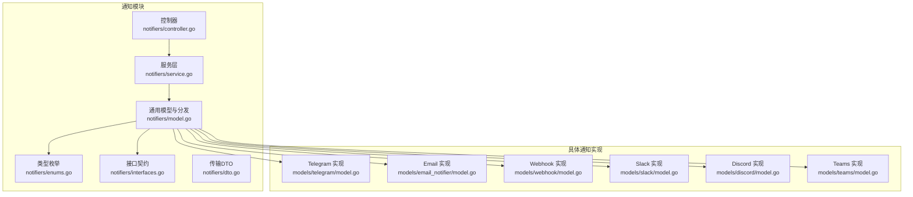
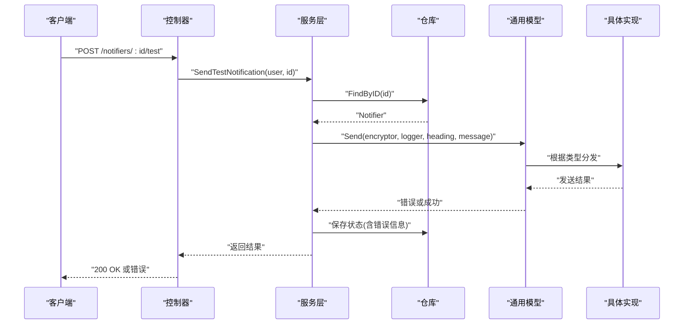
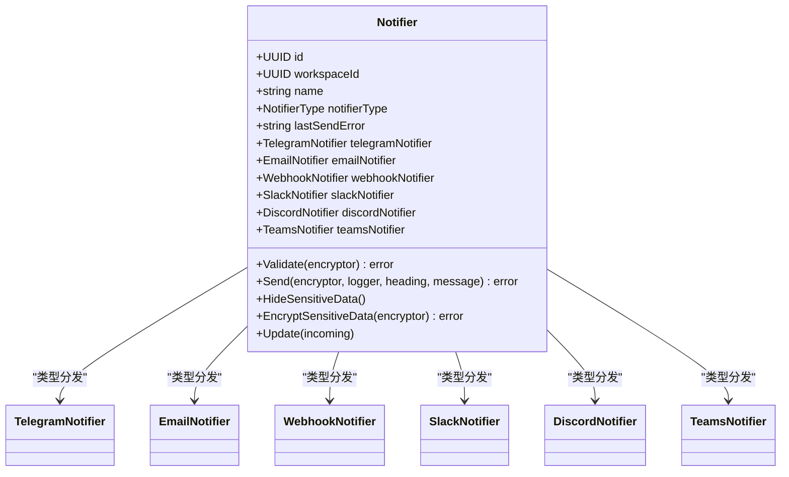
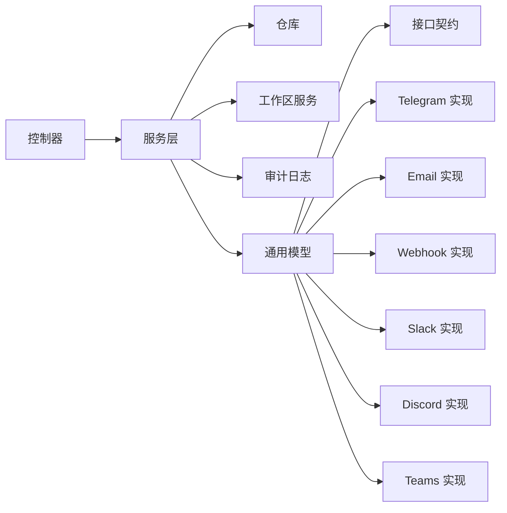

# 通知类型支持

<cite>
**本文引用的文件**
- [backend/internal/features/notifiers/controller.go](file://backend/internal/features/notifiers/controller.go)
- [backend/internal/features/notifiers/service.go](file://backend/internal/features/notifiers/service.go)
- [backend/internal/features/notifiers/model.go](file://backend/internal/features/notifiers/model.go)
- [backend/internal/features/notifiers/enums.go](file://backend/internal/features/notifiers/enums.go)
- [backend/internal/features/notifiers/interfaces.go](file://backend/internal/features/notifiers/interfaces.go)
- [backend/internal/features/notifiers/dto.go](file://backend/internal/features/notifiers/dto.go)
- [backend/internal/features/notifiers/models/telegram/model.go](file://backend/internal/features/notifiers/models/telegram/model.go)
- [backend/internal/features/notifiers/models/email_notifier/model.go](file://backend/internal/features/notifiers/models/email_notifier/model.go)
- [backend/internal/features/notifiers/models/email_notifier/auth.go](file://backend/internal/features/notifiers/models/email_notifier/auth.go)
- [backend/internal/features/notifiers/models/webhook/model.go](file://backend/internal/features/notifiers/models/webhook/model.go)
- [backend/internal/features/notifiers/models/webhook/enums.go](file://backend/internal/features/notifiers/models/webhook/enums.go)
- [backend/internal/features/notifiers/models/slack/model.go](file://backend/internal/features/notifiers/models/slack/model.go)
- [backend/internal/features/notifiers/models/discord/model.go](file://backend/internal/features/notifiers/models/discord/model.go)
- [backend/internal/features/notifiers/models/teams/model.go](file://backend/internal/features/notifiers/models/teams/model.go)
</cite>

## 目录
1. [简介](#简介)
2. [项目结构](#项目结构)
3. [核心组件](#核心组件)
4. [架构总览](#架构总览)
5. [详细组件分析](#详细组件分析)
6. [依赖关系分析](#依赖关系分析)
7. [性能考虑](#性能考虑)
8. [故障排查指南](#故障排查指南)
9. [结论](#结论)
10. [附录](#附录)

## 简介
本文件系统性梳理 Databasus 的通知类型支持，覆盖邮件、Telegram、Slack、Discord、Microsoft Teams、Webhook 六类通知渠道。内容包括：
- 各通知类型的特性与适用场景
- 参数设置、认证方式与连接配置要点
- 配置示例路径、最佳实践与常见问题
- 性能特点、限制条件与选型建议

## 项目结构
通知能力由后端统一控制器、服务层与多态模型构成，通过枚举驱动不同通知类型的分发与执行。

图表来源
- [backend/internal/features/notifiers/controller.go:19-27](file://backend/internal/features/notifiers/controller.go#L19-L27)
- [backend/internal/features/notifiers/service.go:15-22](file://backend/internal/features/notifiers/service.go#L15-L22)
- [backend/internal/features/notifiers/model.go:18-32](file://backend/internal/features/notifiers/model.go#L18-L32)
- [backend/internal/features/notifiers/enums.go:3-12](file://backend/internal/features/notifiers/enums.go#L3-L12)
- [backend/internal/features/notifiers/interfaces.go:11-24](file://backend/internal/features/notifiers/interfaces.go#L11-L24)
- [backend/internal/features/notifiers/models/telegram/model.go](file://backend/internal/features/notifiers/models/telegram/model.go)
- [backend/internal/features/notifiers/models/email_notifier/model.go](file://backend/internal/features/notifiers/models/email_notifier/model.go)
- [backend/internal/features/notifiers/models/webhook/model.go](file://backend/internal/features/notifiers/models/webhook/model.go)
- [backend/internal/features/notifiers/models/slack/model.go](file://backend/internal/features/notifiers/models/slack/model.go)
- [backend/internal/features/notifiers/models/discord/model.go](file://backend/internal/features/notifiers/models/discord/model.go)
- [backend/internal/features/notifiers/models/teams/model.go](file://backend/internal/features/notifiers/models/teams/model.go)

章节来源
- [backend/internal/features/notifiers/controller.go:19-27](file://backend/internal/features/notifiers/controller.go#L19-L27)
- [backend/internal/features/notifiers/service.go:15-22](file://backend/internal/features/notifiers/service.go#L15-L22)
- [backend/internal/features/notifiers/model.go:18-32](file://backend/internal/features/notifiers/model.go#L18-L32)
- [backend/internal/features/notifiers/enums.go:3-12](file://backend/internal/features/notifiers/enums.go#L3-L12)
- [backend/internal/features/notifiers/interfaces.go:11-24](file://backend/internal/features/notifiers/interfaces.go#L11-L24)

## 核心组件
- 控制器：提供保存、查询、删除、测试、转移等路由与鉴权校验。
- 服务层：负责工作区权限校验、数据持久化、测试发送、审计日志与迁移处理。
- 通用模型：统一存储与分发逻辑，按类型委托到具体实现。
- 类型枚举与接口：定义通知类型集合与统一行为契约（发送、校验、隐藏敏感信息、加密）。
- 具体实现：各渠道的配置结构、认证与发送流程。

章节来源
- [backend/internal/features/notifiers/controller.go:42-70](file://backend/internal/features/notifiers/controller.go#L42-L70)
- [backend/internal/features/notifiers/service.go:30-113](file://backend/internal/features/notifiers/service.go#L30-L113)
- [backend/internal/features/notifiers/model.go:38-70](file://backend/internal/features/notifiers/model.go#L38-L70)
- [backend/internal/features/notifiers/enums.go:3-12](file://backend/internal/features/notifiers/enums.go#L3-L12)
- [backend/internal/features/notifiers/interfaces.go:11-24](file://backend/internal/features/notifiers/interfaces.go#L11-L24)

## 架构总览
通知发送的典型调用链如下：

图表来源
- [backend/internal/features/notifiers/controller.go:191-226](file://backend/internal/features/notifiers/controller.go#L191-L226)
- [backend/internal/features/notifiers/service.go:209-237](file://backend/internal/features/notifiers/service.go#L209-L237)
- [backend/internal/features/notifiers/model.go:46-62](file://backend/internal/features/notifiers/model.go#L46-L62)

## 详细组件分析

### 通用模型与分发
- 统一字段：名称、类型、所属工作区、最近一次发送错误。
- 多态分发：根据类型选择具体实现，调用其 Send/Validate/HidesensitiveData/EncryptSensitiveData。
- 更新策略：按类型更新对应子对象字段。

图表来源
- [backend/internal/features/notifiers/model.go:18-32](file://backend/internal/features/notifiers/model.go#L18-L32)
- [backend/internal/features/notifiers/model.go:104-121](file://backend/internal/features/notifiers/model.go#L104-L121)

章节来源
- [backend/internal/features/notifiers/model.go:18-32](file://backend/internal/features/notifiers/model.go#L18-L32)
- [backend/internal/features/notifiers/model.go:38-70](file://backend/internal/features/notifiers/model.go#L38-L70)
- [backend/internal/features/notifiers/model.go:72-102](file://backend/internal/features/notifiers/model.go#L72-L102)
- [backend/internal/features/notifiers/model.go:104-121](file://backend/internal/features/notifiers/model.go#L104-L121)

### 通知类型枚举
- 支持类型：EMAIL、TELEGRAM、WEBHOOK、SLACK、DISCORD、TEAMS。

章节来源
- [backend/internal/features/notifiers/enums.go:3-12](file://backend/internal/features/notifiers/enums.go#L3-L12)

### 接口契约
- 统一方法：Send、Validate、HideSensitiveData、EncryptSensitiveData。
- 作用：确保各渠道实现具备一致的行为与安全处理能力。

章节来源
- [backend/internal/features/notifiers/interfaces.go:11-24](file://backend/internal/features/notifiers/interfaces.go#L11-L24)

### 控制器与服务层交互
- 路由与鉴权：保存、查询、删除、测试、转移均进行用户与工作区权限校验。
- 测试发送：支持“按ID测试”和“直接传入对象测试”两种模式。
- 权限边界：不同操作对工作区的“可查看/可管理”要求不同。

章节来源
- [backend/internal/features/notifiers/controller.go:19-27](file://backend/internal/features/notifiers/controller.go#L19-L27)
- [backend/internal/features/notifiers/controller.go:42-70](file://backend/internal/features/notifiers/controller.go#L42-L70)
- [backend/internal/features/notifiers/controller.go:122-152](file://backend/internal/features/notifiers/controller.go#L122-L152)
- [backend/internal/features/notifiers/controller.go:166-189](file://backend/internal/features/notifiers/controller.go#L166-L189)
- [backend/internal/features/notifiers/controller.go:191-226](file://backend/internal/features/notifiers/controller.go#L191-L226)
- [backend/internal/features/notifiers/controller.go:242-282](file://backend/internal/features/notifiers/controller.go#L242-L282)
- [backend/internal/features/notifiers/controller.go:297-334](file://backend/internal/features/notifiers/controller.go#L297-L334)
- [backend/internal/features/notifiers/service.go:30-113](file://backend/internal/features/notifiers/service.go#L30-L113)
- [backend/internal/features/notifiers/service.go:156-207](file://backend/internal/features/notifiers/service.go#L156-L207)
- [backend/internal/features/notifiers/service.go:209-237](file://backend/internal/features/notifiers/service.go#L209-L237)
- [backend/internal/features/notifiers/service.go:239-274](file://backend/internal/features/notifiers/service.go#L239-L274)
- [backend/internal/features/notifiers/service.go:310-380](file://backend/internal/features/notifiers/service.go#L310-L380)

### 邮件通知（Email）
- 适用场景：需要可靠、可审计的企业级通知；适合对消息格式有定制需求的场景。
- 认证与配置要点：
  - 支持多种认证方式与加密选项（如允许不安全的SMTP配置项），以适配不同邮件服务商。
  - 支持发件人与收件人配置，以及TLS/STARTTLS等安全选项。
- 参数与字段：见具体实现文件路径。
- 最佳实践：
  - 使用专用发件邮箱，避免被标记为垃圾邮件。
  - 合理设置超时与重试策略，关注发送失败的错误记录。
- 常见问题：
  - SMTP 认证失败：检查用户名、密码与授权码设置。
  - TLS/SSL 握手失败：确认服务器证书与跳过验证选项的使用场景。
  - 发送超时：检查网络连通性与防火墙策略。

章节来源
- [backend/internal/features/notifiers/models/email_notifier/model.go](file://backend/internal/features/notifiers/models/email_notifier/model.go)
- [backend/internal/features/notifiers/models/email_notifier/auth.go](file://backend/internal/features/notifiers/models/email_notifier/auth.go)

### Telegram 通知（Telegram）
- 适用场景：即时通讯、团队协作、快速告警。
- 认证与配置要点：
  - 使用 Bot Token 进行认证。
  - 可指定目标聊天或群组的 Chat ID。
- 参数与字段：见具体实现文件路径。
- 最佳实践：
  - 为不同环境/数据库创建独立的聊天或群组。
  - 合理控制消息长度与富文本格式，避免被平台限制。
- 常见问题：
  - 无法发送：确认 Bot Token 有效且机器人已启动。
  - 消息被拒：检查 Chat ID 是否正确，是否已被拉黑或禁言。

章节来源
- [backend/internal/features/notifiers/models/telegram/model.go](file://backend/internal/features/notifiers/models/telegram/model.go)

### Slack 通知（Slack）
- 适用场景：团队沟通与协作，支持富文本与附件。
- 认证与配置要点：
  - 使用应用级别的 OAuth 令牌或 Bot Token。
  - 指定目标频道或用户 ID。
- 参数与字段：见具体实现文件路径。
- 最佳实践：
  - 在应用中授予必要权限范围（chat:write 等）。
  - 使用块元素组织复杂消息。
- 常见问题：
  - 权限不足：检查应用权限与令牌范围。
  - 频道不可访问：确认机器人已加入频道。

章节来源
- [backend/internal/features/notifiers/models/slack/model.go](file://backend/internal/features/notifiers/models/slack/model.go)

### Discord 通知（Discord）
- 适用场景：社区与开发者群体，支持 Webhook 与嵌入式消息。
- 认证与配置要点：
  - 使用 Webhook URL（包含令牌）。
  - 可配置用户名、头像与嵌入消息。
- 参数与字段：见具体实现文件路径。
- 最佳实践：
  - 为不同事件类型配置独立的 Webhook。
  - 合理使用嵌入（embeds）提升可读性。
- 常见问题：
  - Webhook 无效：确认 URL 完整且未被撤销。
  - 消息被限流：遵循 Discord API 速率限制。

章节来源
- [backend/internal/features/notifiers/models/discord/model.go](file://backend/internal/features/notifiers/models/discord/model.go)

### Microsoft Teams 通知（Teams）
- 适用场景：企业内网与 Microsoft 生态集成，支持卡片式消息。
- 认证与配置要点：
  - 使用 Incoming Webhook 或 Microsoft Graph API（取决于实现）。
  - 配置目标团队、通道与可选的认证凭据。
- 参数与字段：见具体实现文件路径。
- 最佳实践：
  - 优先使用官方 Incoming Webhook，简化配置。
  - 使用 Adaptive Cards 提升交互体验。
- 常见问题：
  - 无权限：确认已启用团队通道的 Webhook。
  - 卡片渲染异常：检查 JSON 结构与字段完整性。

章节来源
- [backend/internal/features/notifiers/models/teams/model.go](file://backend/internal/features/notifiers/models/teams/model.go)

### Webhook 通知（Webhook）
- 适用场景：自定义集成、第三方系统对接、灵活的消息格式。
- 认证与配置要点：
  - 支持自定义请求头与消息体模板。
  - 可配置超时、重试与跳过 TLS 校验（谨慎使用）。
- 参数与字段：见具体实现文件路径。
- 最佳实践：
  - 使用签名或基本认证保护回调端点。
  - 对长消息进行截断或压缩。
- 常见问题：
  - 回调失败：检查端点可达性与响应码。
  - 超时与重试：合理设置超时与退避策略。

章节来源
- [backend/internal/features/notifiers/models/webhook/model.go](file://backend/internal/features/notifiers/models/webhook/model.go)
- [backend/internal/features/notifiers/models/webhook/enums.go](file://backend/internal/features/notifiers/models/webhook/enums.go)

## 依赖关系分析
- 控制器依赖服务层；服务层依赖仓库、工作区服务与审计日志。
- 通用模型依赖各具体实现，并在运行时按类型分发。
- 各具体实现遵循统一接口契约，保证一致性与扩展性。

图表来源
- [backend/internal/features/notifiers/controller.go:14-17](file://backend/internal/features/notifiers/controller.go#L14-L17)
- [backend/internal/features/notifiers/service.go:15-22](file://backend/internal/features/notifiers/service.go#L15-L22)
- [backend/internal/features/notifiers/model.go:104-121](file://backend/internal/features/notifiers/model.go#L104-L121)
- [backend/internal/features/notifiers/interfaces.go:11-24](file://backend/internal/features/notifiers/interfaces.go#L11-L24)

章节来源
- [backend/internal/features/notifiers/controller.go:14-17](file://backend/internal/features/notifiers/controller.go#L14-L17)
- [backend/internal/features/notifiers/service.go:15-22](file://backend/internal/features/notifiers/service.go#L15-L22)
- [backend/internal/features/notifiers/model.go:104-121](file://backend/internal/features/notifiers/model.go#L104-L121)
- [backend/internal/features/notifiers/interfaces.go:11-24](file://backend/internal/features/notifiers/interfaces.go#L11-L24)

## 性能考虑
- 消息长度限制：服务层会将消息截断至 2000 字符，避免超长消息导致失败或性能问题。
- 并发与限流：各渠道应遵守平台的速率限制与退避策略，避免触发限流。
- 加密与解密：敏感字段在保存前加密、显示前解密，注意 CPU 开销与密钥管理。
- 错误记录：发送失败会写入最近一次错误字段，便于诊断与重试。

章节来源
- [backend/internal/features/notifiers/service.go:276-308](file://backend/internal/features/notifiers/service.go#L276-L308)

## 故障排查指南
- 权限相关
  - 保存/删除/测试/转移通知器需具备相应工作区权限，否则返回 403。
- 发送失败
  - 查看最近一次错误字段，结合渠道日志定位问题。
  - 检查网络连通性、认证凭据与平台配额。
- 迁移与转移
  - 若通知器仍被数据库引用，禁止转移或删除；先解除关联后再操作。

章节来源
- [backend/internal/features/notifiers/controller.go:55-67](file://backend/internal/features/notifiers/controller.go#L55-L67)
- [backend/internal/features/notifiers/controller.go:99-105](file://backend/internal/features/notifiers/controller.go#L99-L105)
- [backend/internal/features/notifiers/controller.go:180-186](file://backend/internal/features/notifiers/controller.go#L180-L186)
- [backend/internal/features/notifiers/controller.go:272-279](file://backend/internal/features/notifiers/controller.go#L272-L279)
- [backend/internal/features/notifiers/service.go:138-140](file://backend/internal/features/notifiers/service.go#L138-L140)
- [backend/internal/features/notifiers/service.go:344-352](file://backend/internal/features/notifiers/service.go#L344-L352)

## 结论
Databasus 的通知体系通过统一的模型与接口，实现了对邮件、Telegram、Slack、Discord、Teams、Webhook 的一致化管理与扩展。建议在生产环境中：
- 明确各渠道的适用场景与限制，按需组合使用；
- 严格管理认证凭据与敏感字段，启用必要的安全选项；
- 关注平台限流与消息长度限制，优化消息结构与发送策略；
- 利用测试接口与错误记录完善监控与排障流程。

## 附录
- 配置示例路径（不含代码内容）：
  - 邮件通知：参见 [backend/internal/features/notifiers/models/email_notifier/model.go](file://backend/internal/features/notifiers/models/email_notifier/model.go)
  - Telegram 通知：参见 [backend/internal/features/notifiers/models/telegram/model.go](file://backend/internal/features/notifiers/models/telegram/model.go)
  - Slack 通知：参见 [backend/internal/features/notifiers/models/slack/model.go](file://backend/internal/features/notifiers/models/slack/model.go)
  - Discord 通知：参见 [backend/internal/features/notifiers/models/discord/model.go](file://backend/internal/features/notifiers/models/discord/model.go)
  - Teams 通知：参见 [backend/internal/features/notifiers/models/teams/model.go](file://backend/internal/features/notifiers/models/teams/model.go)
  - Webhook 通知：参见 [backend/internal/features/notifiers/models/webhook/model.go](file://backend/internal/features/notifiers/models/webhook/model.go)
- 传输 DTO：参见 [backend/internal/features/notifiers/dto.go:5-7](file://backend/internal/features/notifiers/dto.go#L5-L7)
- 类型枚举：参见 [backend/internal/features/notifiers/enums.go:3-12](file://backend/internal/features/notifiers/enums.go#L3-L12)
- 接口契约：参见 [backend/internal/features/notifiers/interfaces.go:11-24](file://backend/internal/features/notifiers/interfaces.go#L11-L24)