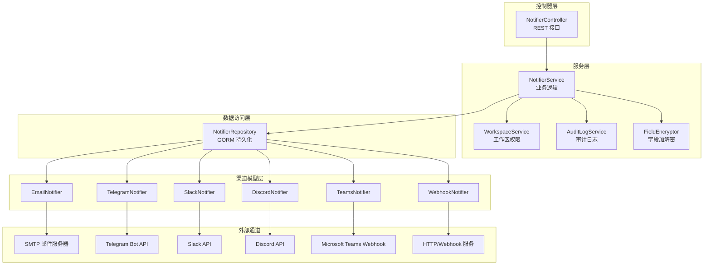
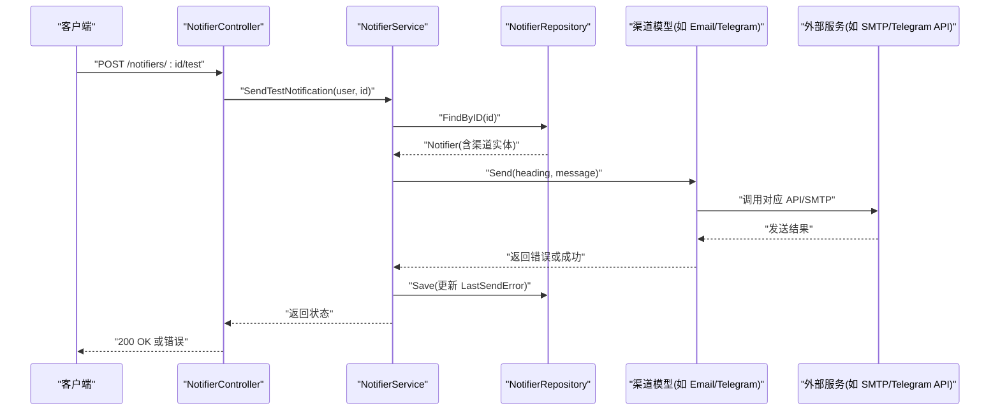
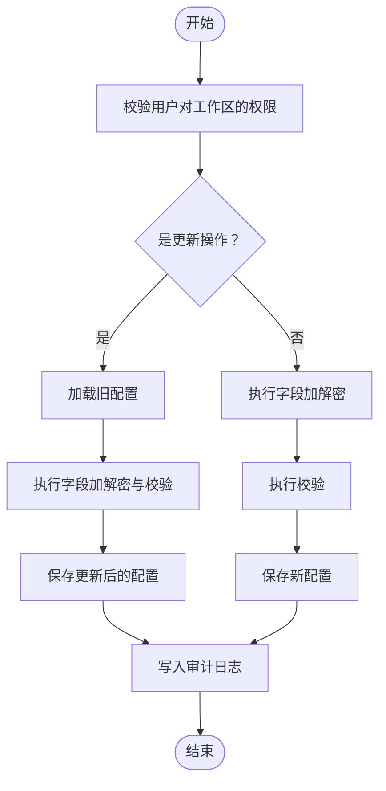
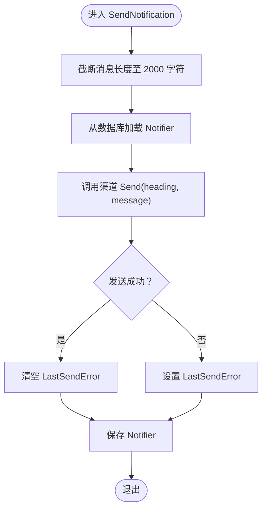
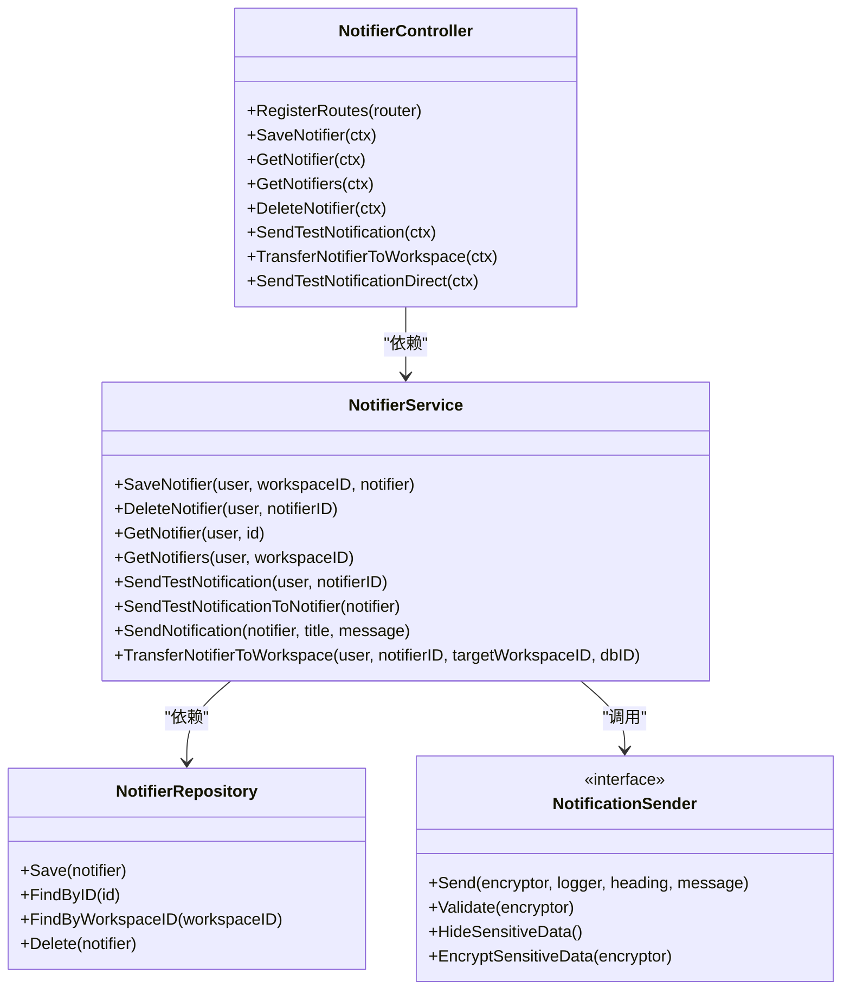

# 通知系统模块

<cite>
**本文引用的文件**
- [controller.go](file://backend/internal/features/notifiers/controller.go)
- [service.go](file://backend/internal/features/notifiers/service.go)
- [di.go](file://backend/internal/features/notifiers/di.go)
- [enums.go](file://backend/internal/features/notifiers/enums.go)
- [interfaces.go](file://backend/internal/features/notifiers/interfaces.go)
- [repository.go](file://backend/internal/features/notifiers/repository.go)
- [model.go](file://backend/internal/features/notifiers/model.go)
- [email_notifier/model.go](file://backend/internal/features/notifiers/models/email_notifier/model.go)
- [telegram/model.go](file://backend/internal/features/notifiers/models/telegram/model.go)
- [slack/model.go](file://backend/internal/features/notifiers/models/slack/model.go)
- [discord/model.go](file://backend/internal/features/notifiers/models/discord/model.go)
- [teams/model.go](file://backend/internal/features/notifiers/models/teams/model.go)
- [webhook/model.go](file://backend/internal/features/notifiers/models/webhook/model.go)
- [email.go](file://backend/internal/features/email/email.go)
- [dto.go](file://backend/internal/features/backups/config/dto.go)
- [20250618203654_create_webhook_notifiers.sql](file://backend/migrations/20250618203654_create_webhook_notifiers.sql)
- [20250624065518_add_slack_notifier.sql](file://backend/migrations/20250624065518_add_slack_notifier.sql)
- [20250716072247_add_discord_notifier.sql](file://backend/migrations/20250716072247_add_discord_notifier.sql)
- [20250906152330_add_ms_teams_notifier.sql](file://backend/migrations/20250906152330_add_ms_teams_notifier.sql)
- [20250809062256_add_telegram_thread_id.sql](file://backend/migrations/20250809062256_add_telegram_thread_id.sql)
- [20251104000000_workspace_scope_storages_notifiers.sql](file://backend/migrations/20251104000000_workspace_scope_storages_notifiers.sql)
- [20251116075135_add_virtual_host_and_prefix_to_s3.sql](file://backend/migrations/20251116075135_add_virtual_host_and_prefix_to_s3.sql)
- [20251211142507_add_include_schemas_to_postgresql_databases.sql](file://backend/migrations/20251211142507_add_include_schemas_to_postgresql_databases.sql)
- [20251213180403_add_ftp_storages.sql](file://backend/migrations/20251213180403_add_ftp_storages.sql)
- [20251213204730_remove_ftp_passive_mode.sql](file://backend/migrations/20251213204730_remove_ftp_passive_mode.sql)
- [20251218123447_add_rclone_storages.sql](file://backend/migrations/20251218123447_add_rclone_storages.sql)
- [20251219220027_add_sftp_storages.sql](file://backend/migrations/20251219220027_add_sftp_storages.sql)
- [20251219230000_add_cron_expression.sql](file://backend/migrations/20251219230000_add_cron_expression.sql)
- [20251220104453_add_mysql_databases_table.sql](file://backend/migrations/20251220104453_add_mysql_databases_table.sql)
- [20251221100000_add_mariadb_databases_table.sql](file://backend/migrations/20251221100000_add_mariadb_databases_table.sql)
- [20251221195603_add_mongodb_databases_table.sql](file://backend/migrations/20251221195603_add_mongodb_databases_table.sql)
- [20251227165710_move_cpu_count_to_databases.sql](file://backend/migrations/20251227165710_move_cpu_count_to_databases.sql)
- [20260101200438_add_backup_format.sql](file://backend/migrations/20260101200438_add_backup_format.sql)
- [20260102110334_remove_backup_type_field.sql](file://backend/migrations/20260102110334_remove_backup_type_field.sql)
- [20260104190532_add_is_exclude_events_to_mariadb.sql](file://backend/migrations/20260104190532_add_is_exclude_events_to_mariadb.sql)
- [20260105165527_add_privileges_to_mysql_mariadb.sql](file://backend/migrations/20260105165527_add_privileges_to_mysql_mariadb.sql)
- [20260105170956_add_cascade_delete_to_workspace_fks.sql](file://backend/migrations/20260105170956_add_cascade_delete_to_workspace_fks.sql)
- [20260108111730_add_download_tokens_table.sql](file://backend/migrations/20260108111730_add_download_tokens_table.sql)
- [20260119124334_add_backup_size_limits.sql](file://backend/migrations/20260119124334_add_backup_size_limits.sql)
- [20260122134856_add_database_plans_table.sql](file://backend/migrations/20260122134856_add_database_plans_table.sql)
- [20260122173935_add_is_system_to_storages.sql](file://backend/migrations/20260122173935_add_is_system_to_storages.sql)
- [20260127132617_add_cascade_delete_for_backups_and_databases.sql](file://backend/migrations/20260127132617_add_cascade_delete_for_backups_and_databases.sql)
- [20260127140305_add_cascade_delete_for_backup_configs.sql](file://backend/migrations/20260127140305_add_cascade_delete_for_backup_configs.sql)
- [20260128115419_add_password_reset_codes.sql](file://backend/migrations/20260128115419_add_password_reset_codes.sql)
- [20260209125258_add_mongodb_srv_support.sql](file://backend/migrations/20260209125258_add_mongodb_srv_support.sql)
- [20260213131117_add_mariadb_event_exclusion.sql](file://backend/migrations/20260213131117_add_mariadb_event_exclusion.sql)
- [20260217000000_add_file_name_to_backups.sql](file://backend/migrations/20260217000000_add_file_name_to_backups.sql)
- [20260220000000_add_retention_policy.sql](file://backend/migrations/20260220000000_add_retention_policy.sql)
- [20260221111333_add_mongodb_direct_connection.sql](file://backend/migrations/20260221111333_add_mongodb_direct_connection.sql)
- [20260306045548_add_wal_properties.sql](file://backend/migrations/20260306045548_add_wal_properties.sql)
- [20260308120000_add_insecure_skip_verify_to_email_notifiers.sql](file://backend/migrations/20260308120000_add_insecure_skip_verify_to_email_notifiers.sql)
- [20260311094356_add_is_zstd_supported_to_mysql.sql](file://backend/migrations/20260311094356_add_is_zstd_supported_to_mysql.sql)
- [20260316151706_add_upload_completed_at.sql](file://backend/migrations/20260316151706_add_upload_completed_at.sql)
- [20260326130504_add_billing.sql](file://backend/migrations/20260326130504_add_billing.sql)
- [20260326164625_remove_db_plan_and_backups_limits.sql](file://backend/migrations/20260326164625_remove_db_plan_and_backups_limits.sql)
- [20260327090334_add_is_skipped_to_webhook_records.sql](file://backend/migrations/20260327090334_add_is_skipped_to_webhook_records.sql)
- [20260402055223_add_storage_class_to_s3.sql](file://backend/migrations/20260402055223_add_storage_class_to_s3.sql)
</cite>

## 目录
1. [简介](#简介)
2. [项目结构](#项目结构)
3. [核心组件](#核心组件)
4. [架构总览](#架构总览)
5. [详细组件分析](#详细组件分析)
6. [依赖关系分析](#依赖关系分析)
7. [性能考量](#性能考量)
8. [故障排除指南](#故障排除指南)
9. [结论](#结论)
10. [附录](#附录)

## 简介
本文件为 Databasus 通知系统模块的详细功能文档，覆盖通知类型的配置与管理（邮件、Telegram、Slack、Discord、Microsoft Teams、Webhook）、通知配置管理（渠道特定参数、认证配置、模板定制）、通知发送机制（异步处理、重试策略、错误处理）、通知模板系统（变量替换、动态内容生成、多语言支持）、通知测试功能与故障排除、通知规则配置（事件触发条件、过滤器设置、批量处理）以及各渠道配置示例与最佳实践。

## 项目结构
通知系统位于后端模块的 notifiers 子域中，采用分层设计：
- 控制器层：提供 REST 接口，负责鉴权与请求校验
- 服务层：封装业务逻辑，协调工作区权限、审计日志、加解密与发送
- 数据访问层：统一的 NotifierRepository 负责持久化与关联实体保存
- 渠道模型层：每种通知渠道以独立模型存在，统一实现 NotificationSender 接口
- 邮件通道：独立的 SMTP 发送器，支持隐式 TLS 与 STARTTLS

图表来源
- [controller.go:19-27](file://backend/internal/features/notifiers/controller.go#L19-L27)
- [service.go:15-22](file://backend/internal/features/notifiers/service.go#L15-L22)
- [repository.go:10](file://backend/internal/features/notifiers/repository.go#L10)
- [email_notifier/model.go:26](file://backend/internal/features/notifiers/models/email_notifier/model.go#L26)
- [telegram/model.go:18](file://backend/internal/features/notifiers/models/telegram/model.go#L18)
- [slack/model.go:20](file://backend/internal/features/notifiers/models/slack/model.go#L20)
- [discord/model.go:17](file://backend/internal/features/notifiers/models/discord/model.go#L17)
- [teams/model.go:17](file://backend/internal/features/notifiers/models/teams/model.go#L17)
- [webhook/model.go:29](file://backend/internal/features/notifiers/models/webhook/model.go#L29)

章节来源
- [controller.go:19-27](file://backend/internal/features/notifiers/controller.go#L19-L27)
- [service.go:15-22](file://backend/internal/features/notifiers/service.go#L15-L22)
- [repository.go:10](file://backend/internal/features/notifiers/repository.go#L10)

## 核心组件
- NotifierController：定义通知配置的增删改查、测试发送、工作区转移等接口
- NotifierService：封装保存、删除、查询、测试、发送、迁移等业务流程，并集成权限校验、审计日志与加解密
- NotifierRepository：统一持久化入口，按通知类型分别保存/删除渠道专属实体
- NotificationSender 接口：所有通知渠道必须实现的发送、校验、隐藏敏感信息、加密能力
- 各渠道模型：Email、Telegram、Slack、Discord、Teams、Webhook 的专属配置结构
- 邮件发送器：EmailSMTPSender 提供 SMTP 发送能力，支持隐式 TLS 与 STARTTLS

章节来源
- [controller.go:29-335](file://backend/internal/features/notifiers/controller.go#L29-L335)
- [service.go:30-396](file://backend/internal/features/notifiers/service.go#L30-L396)
- [repository.go:12-218](file://backend/internal/features/notifiers/repository.go#L12-L218)
- [interfaces.go:11-24](file://backend/internal/features/notifiers/interfaces.go#L11-L24)
- [enums.go:3-12](file://backend/internal/features/notifiers/enums.go#L3-L12)
- [email.go:22-251](file://backend/internal/features/email/email.go#L22-L251)

## 架构总览
通知系统的控制流如下：
- 客户端通过 NotifierController 触发操作
- NotifierService 进行权限检查、数据校验、加解密与调用具体渠道发送
- NotifierRepository 统一持久化，按类型保存渠道专属实体
- 各渠道模型实现 NotificationSender 接口，完成实际发送

图表来源
- [controller.go:191-226](file://backend/internal/features/notifiers/controller.go#L191-L226)
- [service.go:209-237](file://backend/internal/features/notifiers/service.go#L209-L237)
- [repository.go:125-142](file://backend/internal/features/notifiers/repository.go#L125-L142)
- [interfaces.go:11-18](file://backend/internal/features/notifiers/interfaces.go#L11-L18)

## 详细组件分析

### 通知类型与枚举
- 支持类型：EMAIL、TELEGRAM、WEBHOOK、SLACK、DISCORD、TEAMS
- 类型在枚举中集中定义，便于统一扩展与校验

章节来源
- [enums.go:3-12](file://backend/internal/features/notifiers/enums.go#L3-L12)

### 通知配置管理
- 创建/更新：校验工作区权限，执行字段加解密与验证，保存到数据库
- 删除：校验工作区权限，若被数据库引用则拒绝删除
- 查询：按工作区查询，返回时隐藏敏感信息
- 工作区转移：校验源/目标工作区权限，确保无其他数据库绑定可转移

图表来源
- [service.go:30-113](file://backend/internal/features/notifiers/service.go#L30-L113)
- [repository.go:12-123](file://backend/internal/features/notifiers/repository.go#L12-L123)

章节来源
- [service.go:30-113](file://backend/internal/features/notifiers/service.go#L30-L113)
- [repository.go:12-123](file://backend/internal/features/notifiers/repository.go#L12-L123)

### 通知发送机制
- 测试发送：按用户权限检查后，调用渠道 Send 方法发送“测试消息”
- 正式发送：截断过长消息（≤2000 字符），调用渠道 Send 并记录最后发送错误
- 错误处理：捕获发送异常，写入 LastSendError 并持久化；成功则清空错误

图表来源
- [service.go:276-308](file://backend/internal/features/notifiers/service.go#L276-L308)

章节来源
- [service.go:209-237](file://backend/internal/features/notifiers/service.go#L209-L237)
- [service.go:276-308](file://backend/internal/features/notifiers/service.go#L276-L308)

### 通知模板系统
- 变量替换：通过 Send 方法传入 heading 与 message，由各渠道模型决定如何渲染
- 动态内容：各渠道模型可包含模板字段（如 Webhook 的 body 模板、Telegram 的 thread_id 等）
- 多语言支持：当前代码未见内置多语言切换逻辑，建议通过 heading/message 的国际化字符串实现

章节来源
- [interfaces.go:11-18](file://backend/internal/features/notifiers/interfaces.go#L11-L18)
- [telegram/model.go:18](file://backend/internal/features/notifiers/models/telegram/model.go#L18)
- [webhook/model.go:29](file://backend/internal/features/notifiers/models/webhook/model.go#L29)

### 通知测试功能
- 接口：/notifiers/{id}/test（基于已保存配置）与 /notifiers/direct-test（直接传入配置对象）
- 权限：测试需具备查看权限
- 行为：发送“测试消息”，并将结果持久化

章节来源
- [controller.go:191-226](file://backend/internal/features/notifiers/controller.go#L191-L226)
- [controller.go:284-334](file://backend/internal/features/notifiers/controller.go#L284-L334)
- [service.go:209-237](file://backend/internal/features/notifiers/service.go#L209-L237)
- [service.go:239-274](file://backend/internal/features/notifiers/service.go#L239-L274)

### 通知规则配置
- 当前仓库未发现专门的通知规则引擎或事件触发器配置。通知发送通常由业务流程调用 NotifierService 的 SendNotification 实现。
- 若需事件驱动通知，可在上层业务用例中集成规则判断与批量处理逻辑，再调用服务层发送。

章节来源
- [service.go:276-308](file://backend/internal/features/notifiers/service.go#L276-L308)

### 各通知渠道配置与最佳实践

#### 邮件 EMAIL
- 关键字段：SMTP 主机、端口、用户名、密码、发件人地址、是否启用隐式 TLS（465 端口）
- 认证：支持 PLAIN 与 LOGIN 两种方式，失败时自动重连并尝试另一种
- 最佳实践：优先使用 STARTTLS（端口非 465）；如使用隐式 TLS，确保证书有效；避免明文传输

章节来源
- [email.go:14-20](file://backend/internal/features/email/email.go#L14-L20)
- [email.go:32-54](file://backend/internal/features/email/email.go#L32-L54)
- [email.go:164-198](file://backend/internal/features/email/email.go#L164-L198)
- [email.go:200-223](file://backend/internal/features/email/email.go#L200-L223)

#### Telegram TELEGRAM
- 关键字段：Bot Token、Chat ID、Thread ID（可选）
- 最佳实践：使用私聊或受控群组；Thread ID 用于话题分区；限制消息长度

章节来源
- [telegram/model.go:18](file://backend/internal/features/notifiers/models/telegram/model.go#L18)
- [20250809062256_add_telegram_thread_id.sql](file://backend/migrations/20250809062256_add_telegram_thread_id.sql)

#### Slack SLACK
- 关键字段：Bot Token、App Token、Channel ID
- 最佳实践：使用 Bot 用户令牌；Channel ID 使用 # 名称或频道 ID；避免硬编码敏感信息

章节来源
- [slack/model.go:20](file://backend/internal/features/notifiers/models/slack/model.go#L20)
- [20250624065518_add_slack_notifier.sql](file://backend/migrations/20250624065518_add_slack_notifier.sql)

#### Discord DISCORD
- 关键字段：Bot Token、Webhook URL、Channel ID
- 最佳实践：优先使用 Webhook URL；Bot Token 需授权相应权限；注意速率限制

章节来源
- [discord/model.go:17](file://backend/internal/features/notifiers/models/discord/model.go#L17)
- [20250716072247_add_discord_notifier.sql](file://backend/migrations/20250716072247_add_discord_notifier.sql)

#### Microsoft Teams TEAMS
- 关键字段：Incoming Webhook URL
- 最佳实践：使用专用 Incoming Webhook；避免泄露 URL；合理设置消息格式

章节来源
- [teams/model.go:17](file://backend/internal/features/notifiers/models/teams/model.go#L17)
- [20250906152330_add_ms_teams_notifier.sql](file://backend/migrations/20250906152330_add_ms_teams_notifier.sql)

#### Webhook WEBHOOK
- 关键字段：URL、Headers（可选）、Body 模板（可选）
- 最佳实践：使用 HTTPS；为每个目标配置独立 Webhook；必要时自定义 Body 模板

章节来源
- [webhook/model.go:29](file://backend/internal/features/notifiers/models/webhook/model.go#L29)
- [20250618203654_create_webhook_notifiers.sql](file://backend/migrations/20250618203654_create_webhook_notifiers.sql)

### 数据模型与持久化
- NotifierRepository 统一保存/删除通知配置及其渠道专属实体
- 预加载策略：查询时预加载各渠道实体，保证发送时无需二次查询
- 工作区作用域：通知配置与工作区绑定，迁移与删除均考虑工作区范围

章节来源
- [repository.go:125-172](file://backend/internal/features/notifiers/repository.go#L125-L172)
- [20251104000000_workspace_scope_storages_notifiers.sql](file://backend/migrations/20251104000000_workspace_scope_storages_notifiers.sql)

## 依赖关系分析
- 控制器依赖服务层；服务层依赖工作区服务、审计日志、加解密器与仓储
- 仓储统一管理 Notifier 与其渠道专属实体的生命周期
- 各渠道模型实现 NotificationSender 接口，形成统一的发送契约

图表来源
- [controller.go:14-27](file://backend/internal/features/notifiers/controller.go#L14-L27)
- [service.go:15-22](file://backend/internal/features/notifiers/service.go#L15-L22)
- [repository.go:10](file://backend/internal/features/notifiers/repository.go#L10)
- [interfaces.go:11-24](file://backend/internal/features/notifiers/interfaces.go#L11-L24)

章节来源
- [controller.go:14-27](file://backend/internal/features/notifiers/controller.go#L14-L27)
- [service.go:15-22](file://backend/internal/features/notifiers/service.go#L15-L22)
- [repository.go:10](file://backend/internal/features/notifiers/repository.go#L10)
- [interfaces.go:11-24](file://backend/internal/features/notifiers/interfaces.go#L11-L24)

## 性能考量
- 异步处理：当前发送逻辑为同步阻塞，建议在高并发场景下引入队列与后台任务
- 重试策略：邮件发送器内部对认证失败有重试与回退机制；其他渠道可按需扩展指数退避
- 错误处理：发送失败会记录 LastSendError，便于快速定位问题
- 批量处理：建议在业务侧聚合多条通知后统一发送，减少外部 API 调用次数

## 故障排除指南
- 权限不足：检查用户对工作区的管理/查看权限
- 配置错误：确认渠道专属字段完整且有效（如 Token、URL、Chat ID）
- 发送失败：查看 Notifier 的 LastSendError 字段；针对不同渠道检查网络、证书、速率限制
- 邮件发送：确认 SMTP 端口与 TLS 类型匹配；隐式 TLS 使用 465 端口；STARTTLS 使用非 465 端口
- Webhook：确认 URL 可达、Headers 正确、Body 模板语法正确

章节来源
- [service.go:292-301](file://backend/internal/features/notifiers/service.go#L292-L301)

## 结论
通知系统模块提供了统一的配置管理、权限控制、加解密与发送流程，支持多种主流通知渠道。通过清晰的接口与仓储抽象，系统具备良好的扩展性与可维护性。建议在生产环境中结合队列与重试策略提升可靠性，并完善事件驱动的通知规则以满足复杂场景需求。

## 附录

### API 定义概览
- 创建/更新通知配置：POST /notifiers
- 获取单个通知配置：GET /notifiers/{id}
- 获取工作区全部通知配置：GET /notifiers?workspace_id=...
- 删除通知配置：DELETE /notifiers/{id}
- 测试通知（基于已保存配置）：POST /notifiers/{id}/test
- 直接测试通知（传入配置对象）：POST /notifiers/direct-test
- 工作区转移通知配置：POST /notifiers/{id}/transfer

章节来源
- [controller.go:19-27](file://backend/internal/features/notifiers/controller.go#L19-L27)
- [controller.go:110-152](file://backend/internal/features/notifiers/controller.go#L110-L152)
- [controller.go:154-189](file://backend/internal/features/notifiers/controller.go#L154-L189)
- [controller.go:191-226](file://backend/internal/features/notifiers/controller.go#L191-L226)
- [controller.go:284-334](file://backend/internal/features/notifiers/controller.go#L284-L334)
- [controller.go:228-282](file://backend/internal/features/notifiers/controller.go#L228-L282)

### 数据库迁移要点（与通知相关）
- 初始化 Webhook 通知配置表
- 增加 Slack 通知配置
- 增加 Discord 通知配置
- 增加 Microsoft Teams 通知配置
- Telegram 增加 Thread ID 字段
- 工作区作用域：通知配置与工作区绑定
- 其他存储与数据库相关迁移（与通知配置无直接关系）

章节来源
- [20250618203654_create_webhook_notifiers.sql](file://backend/migrations/20250618203654_create_webhook_notifiers.sql)
- [20250624065518_add_slack_notifier.sql](file://backend/migrations/20250624065518_add_slack_notifier.sql)
- [20250716072247_add_discord_notifier.sql](file://backend/migrations/20250716072247_add_discord_notifier.sql)
- [20250906152330_add_ms_teams_notifier.sql](file://backend/migrations/20250906152330_add_ms_teams_notifier.sql)
- [20250809062256_add_telegram_thread_id.sql](file://backend/migrations/20250809062256_add_telegram_thread_id.sql)
- [20251104000000_workspace_scope_storages_notifiers.sql](file://backend/migrations/20251104000000_workspace_scope_storages_notifiers.sql)