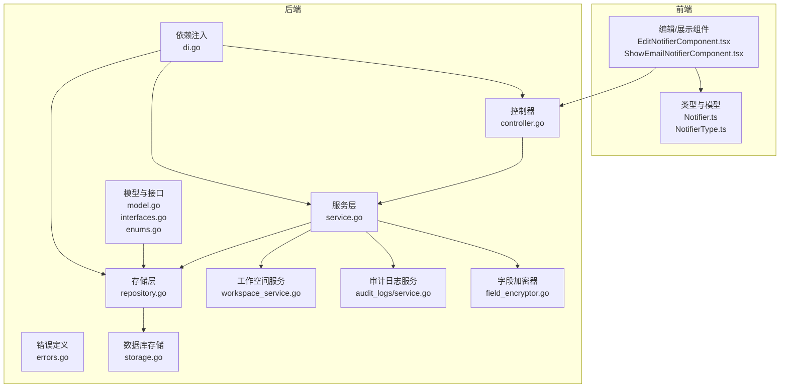
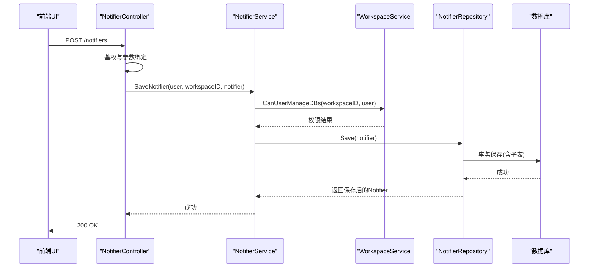
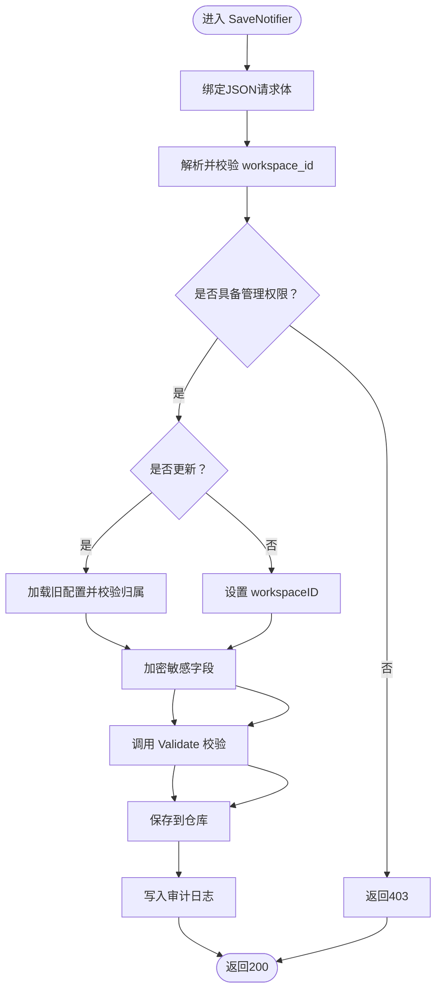
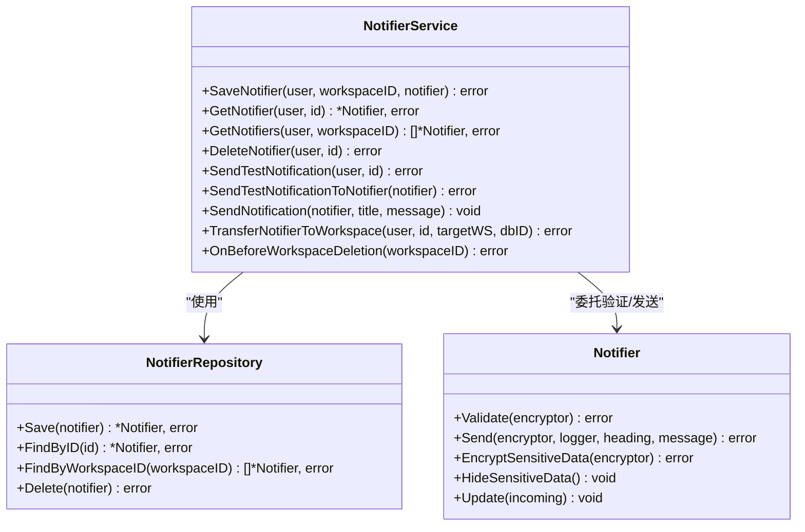
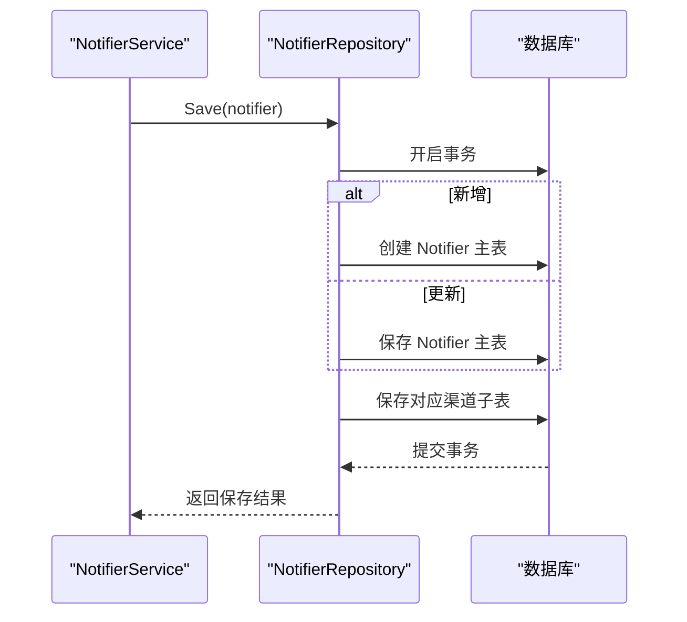
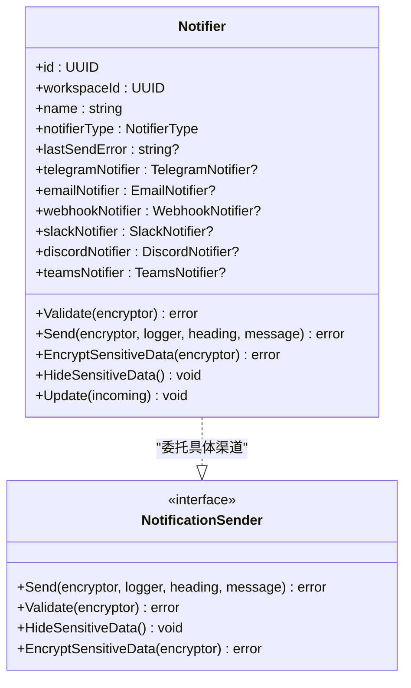
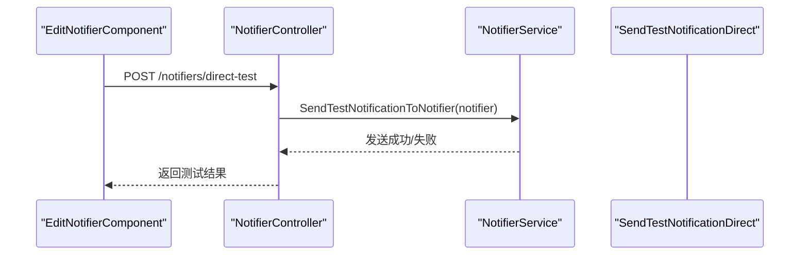
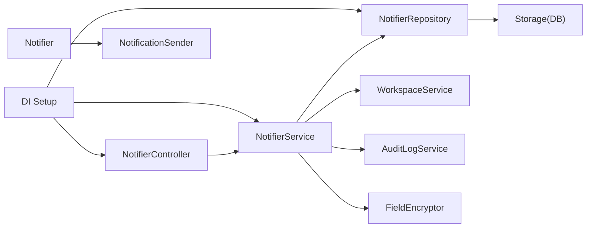

# 通知配置管理

<cite>
**本文档引用的文件**
- [backend/internal/features/notifiers/controller.go](file://backend/internal/features/notifiers/controller.go)
- [backend/internal/features/notifiers/service.go](file://backend/internal/features/notifiers/service.go)
- [backend/internal/features/notifiers/model.go](file://backend/internal/features/notifiers/model.go)
- [backend/internal/features/notifiers/enums.go](file://backend/internal/features/notifiers/enums.go)
- [backend/internal/features/notifiers/repository.go](file://backend/internal/features/notifiers/repository.go)
- [backend/internal/features/notifiers/interfaces.go](file://backend/internal/features/notifiers/interfaces.go)
- [backend/internal/features/notifiers/dto.go](file://backend/internal/features/notifiers/dto.go)
- [backend/internal/features/notifiers/errors.go](file://backend/internal/features/notifiers/errors.go)
- [backend/internal/features/notifiers/di.go](file://backend/internal/features/notifiers/di.go)
- [frontend/src/entity/notifiers/models/Notifier.ts](file://frontend/src/entity/notifiers/models/Notifier.ts)
- [frontend/src/entity/notifiers/models/NotifierType.ts](file://frontend/src/entity/notifiers/models/NotifierType.ts)
- [frontend/src/features/notifiers/ui/edit/EditNotifierComponent.tsx](file://frontend/src/features/notifiers/ui/edit/EditNotifierComponent.tsx)
- [frontend/src/features/notifiers/ui/show/ShowEmailNotifierComponent.tsx](file://frontend/src/features/notifiers/ui/show/ShowEmailNotifierComponent.tsx)
- [backend/internal/features/workspaces/services/workspace_service.go](file://backend/internal/features/workspaces/services/workspace_service.go)
- [backend/internal/features/audit_logs/service.go](file://backend/internal/features/audit_logs/service.go)
- [backend/internal/util/encryption/field_encryptor.go](file://backend/internal/util/encryption/field_encryptor.go)
- [backend/internal/storage/storage.go](file://backend/internal/storage/storage.go)
</cite>

## 目录
1. [简介](#简介)
2. [项目结构](#项目结构)
3. [核心组件](#核心组件)
4. [架构总览](#架构总览)
5. [详细组件分析](#详细组件分析)
6. [依赖关系分析](#依赖关系分析)
7. [性能考量](#性能考量)
8. [故障排查指南](#故障排查指南)
9. [结论](#结论)
10. [附录](#附录)

## 简介
本文件面向Databasus通知配置管理功能，提供从后端到前端的完整使用与实现说明。内容涵盖通知配置的创建、编辑、删除、查询、测试连接等操作；配置参数的验证规则与必填项；生命周期管理（启用/禁用、审计日志）；配置模板与导入导出能力；安全与性能最佳实践；权限控制与工作空间隔离；以及配置迁移与升级建议。

## 项目结构
通知配置管理由后端控制器、服务层、存储层与前端UI共同组成，采用分层架构与依赖注入模式，支持多种通知渠道（邮件、Webhook、Slack、Discord、Telegram、Teams），并通过工作空间进行资源隔离。

**图表来源**
- [backend/internal/features/notifiers/controller.go:19-27](file://backend/internal/features/notifiers/controller.go#L19-L27)
- [backend/internal/features/notifiers/service.go:15-22](file://backend/internal/features/notifiers/service.go#L15-L22)
- [backend/internal/features/notifiers/repository.go:10-11](file://backend/internal/features/notifiers/repository.go#L10-L11)
- [backend/internal/features/notifiers/model.go:18-32](file://backend/internal/features/notifiers/model.go#L18-L32)
- [backend/internal/features/notifiers/di.go:12-27](file://backend/internal/features/notifiers/di.go#L12-L27)
- [backend/internal/features/workspaces/services/workspace_service.go](file://backend/internal/features/workspaces/services/workspace_service.go)
- [backend/internal/features/audit_logs/service.go](file://backend/internal/features/audit_logs/service.go)
- [backend/internal/util/encryption/field_encryptor.go](file://backend/internal/util/encryption/field_encryptor.go)
- [backend/internal/storage/storage.go](file://backend/internal/storage/storage.go)

**章节来源**
- [backend/internal/features/notifiers/controller.go:19-27](file://backend/internal/features/notifiers/controller.go#L19-L27)
- [backend/internal/features/notifiers/di.go:29-44](file://backend/internal/features/notifiers/di.go#L29-L44)

## 核心组件
- 控制器：提供REST路由与请求校验，负责鉴权与错误响应。
- 服务层：封装业务逻辑，执行权限检查、数据验证、敏感信息加解密、审计日志记录与通知发送。
- 存储层：基于GORM的事务性持久化，按通知类型拆分子表并级联保存/删除。
- 模型与接口：统一的Notifier抽象与各渠道具体实现接口，支持多态发送与验证。
- 错误定义：集中化的权限与约束错误码。
- 依赖注入：全局单例注册与工作空间删除监听。

**章节来源**
- [backend/internal/features/notifiers/service.go:30-113](file://backend/internal/features/notifiers/service.go#L30-L113)
- [backend/internal/features/notifiers/repository.go:12-123](file://backend/internal/features/notifiers/repository.go#L12-L123)
- [backend/internal/features/notifiers/model.go:38-70](file://backend/internal/features/notifiers/model.go#L38-L70)
- [backend/internal/features/notifiers/errors.go:5-36](file://backend/internal/features/notifiers/errors.go#L5-L36)

## 架构总览
通知配置管理遵循“控制器-服务-存储-模型”的分层设计，通过工作空间服务实现权限控制与资源隔离，通过审计日志服务记录变更轨迹，通过字段加密器对敏感信息进行加密存储。

**图表来源**
- [backend/internal/features/notifiers/controller.go:42-70](file://backend/internal/features/notifiers/controller.go#L42-L70)
- [backend/internal/features/notifiers/service.go:30-113](file://backend/internal/features/notifiers/service.go#L30-L113)
- [backend/internal/features/notifiers/repository.go:12-123](file://backend/internal/features/notifiers/repository.go#L12-L123)

## 详细组件分析

### 控制器层（NotifierController）
- 路由注册：提供创建、查询、删除、测试连接、工作空间转移等接口。
- 请求校验：对UUID参数、JSON体、workspace_id查询参数进行格式校验。
- 权限拦截：根据用户角色与工作空间关系返回401/403。
- 测试连接：支持直接传入Notifier对象进行测试或通过ID测试已保存配置。

**图表来源**
- [backend/internal/features/notifiers/controller.go:42-70](file://backend/internal/features/notifiers/controller.go#L42-L70)
- [backend/internal/features/notifiers/service.go:30-113](file://backend/internal/features/notifiers/service.go#L30-L113)

**章节来源**
- [backend/internal/features/notifiers/controller.go:19-70](file://backend/internal/features/notifiers/controller.go#L19-L70)
- [backend/internal/features/notifiers/dto.go:5-7](file://backend/internal/features/notifiers/dto.go#L5-L7)

### 服务层（NotifierService）
- 权限控制：通过工作空间服务判断用户是否具备管理/查看/测试权限。
- 数据验证：统一调用Notifier.Validate，委托具体渠道实现。
- 敏感信息处理：保存前加密，返回时隐藏敏感字段。
- 审计日志：创建、更新、删除、转移均记录审计日志。
- 通知发送：支持测试发送与生产发送，自动截断消息长度并记录最后发送错误。
- 资源清理：在工作空间删除前自动清理该工作空间下的所有通知配置。

**图表来源**
- [backend/internal/features/notifiers/service.go:15-22](file://backend/internal/features/notifiers/service.go#L15-L22)
- [backend/internal/features/notifiers/repository.go:10-11](file://backend/internal/features/notifiers/repository.go#L10-L11)
- [backend/internal/features/notifiers/model.go:18-32](file://backend/internal/features/notifiers/model.go#L18-L32)

**章节来源**
- [backend/internal/features/notifiers/service.go:30-395](file://backend/internal/features/notifiers/service.go#L30-L395)

### 存储层（NotifierRepository）
- 事务性保存：根据通知类型分别处理主表与子表，确保一致性。
- 预加载关联：查询时预加载各渠道子表，避免N+1问题。
- 删除级联：先删除子表再删除主表，保证外键约束满足。

**图表来源**
- [backend/internal/features/notifiers/repository.go:12-123](file://backend/internal/features/notifiers/repository.go#L12-L123)

**章节来源**
- [backend/internal/features/notifiers/repository.go:12-218](file://backend/internal/features/notifiers/repository.go#L12-L218)

### 模型与接口（Notifier、NotificationSender）
- 统一抽象：Notifier作为聚合根，内部持有各渠道的具体实现。
- 多态行为：通过NotificationSender接口实现不同渠道的发送与验证。
- 参数验证：Name必填，其他字段由具体渠道实现校验。
- 敏感信息：支持加密存储与返回时隐藏。

**图表来源**
- [backend/internal/features/notifiers/model.go:18-122](file://backend/internal/features/notifiers/model.go#L18-L122)
- [backend/internal/features/notifiers/interfaces.go:11-24](file://backend/internal/features/notifiers/interfaces.go#L11-L24)

**章节来源**
- [backend/internal/features/notifiers/model.go:38-122](file://backend/internal/features/notifiers/model.go#L38-L122)
- [backend/internal/features/notifiers/enums.go:3-12](file://backend/internal/features/notifiers/enums.go#L3-L12)

### 前端集成
- 类型与模型：前端定义了Notifier与NotifierType枚举，用于UI渲染与API交互。
- 编辑组件：提供保存与直接测试通知的能力，测试成功后提示Toast。
- 展示组件：以只读方式展示邮件通知的关键配置项（如目标邮箱、SMTP主机、端口、发件人等）。

**图表来源**
- [frontend/src/features/notifiers/ui/edit/EditNotifierComponent.tsx:52-84](file://frontend/src/features/notifiers/ui/edit/EditNotifierComponent.tsx#L52-L84)
- [backend/internal/features/notifiers/controller.go:284-334](file://backend/internal/features/notifiers/controller.go#L284-L334)

**章节来源**
- [frontend/src/entity/notifiers/models/Notifier.ts:9-23](file://frontend/src/entity/notifiers/models/Notifier.ts#L9-L23)
- [frontend/src/entity/notifiers/models/NotifierType.ts:1-8](file://frontend/src/entity/notifiers/models/NotifierType.ts#L1-L8)
- [frontend/src/features/notifiers/ui/edit/EditNotifierComponent.tsx:36-84](file://frontend/src/features/notifiers/ui/edit/EditNotifierComponent.tsx#L36-L84)
- [frontend/src/features/notifiers/ui/show/ShowEmailNotifierComponent.tsx:7-48](file://frontend/src/features/notifiers/ui/show/ShowEmailNotifierComponent.tsx#L7-L48)

## 依赖关系分析
- 控制器依赖服务层；服务层依赖存储层、工作空间服务、审计日志服务与字段加密器。
- 存储层依赖数据库连接；模型依赖各渠道具体实现接口。
- 依赖注入模块负责初始化与注册监听器。

**图表来源**
- [backend/internal/features/notifiers/di.go:12-44](file://backend/internal/features/notifiers/di.go#L12-L44)
- [backend/internal/features/notifiers/service.go:15-22](file://backend/internal/features/notifiers/service.go#L15-L22)
- [backend/internal/features/notifiers/repository.go:10-11](file://backend/internal/features/notifiers/repository.go#L10-L11)

**章节来源**
- [backend/internal/features/notifiers/di.go:12-44](file://backend/internal/features/notifiers/di.go#L12-L44)

## 性能考量
- 查询优化：存储层在查询时预加载所有渠道子表，避免后续访问触发额外查询。
- 事务一致性：保存/删除均在事务中完成，减少不一致风险。
- 消息截断：发送时将消息限制在合理长度，降低网络与第三方服务压力。
- 加密成本：敏感字段仅在保存/返回时进行加解密，避免重复计算。

[本节为通用性能建议，无需特定文件引用]

## 故障排查指南
- 权限相关错误：检查当前用户在目标工作空间的角色与权限；确认请求头中的认证信息有效。
- 参数校验失败：核对请求体中的必填字段（如名称、工作空间ID、目标渠道配置）。
- 通知发送失败：查看Notifier.lastSendError字段，结合第三方服务日志定位问题。
- 转移/删除受限：若提示存在关联数据库，请先解除关联后再执行转移或删除。

**章节来源**
- [backend/internal/features/notifiers/errors.go:5-36](file://backend/internal/features/notifiers/errors.go#L5-L36)
- [backend/internal/features/notifiers/service.go:115-154](file://backend/internal/features/notifiers/service.go#L115-L154)

## 结论
通知配置管理通过清晰的分层架构、严格的权限控制与审计日志，提供了安全可靠的多渠道通知能力。配合前端直观的编辑与测试体验，能够满足不同场景下的通知需求。建议在生产环境中启用字段加密、完善监控告警，并定期审查权限与配置有效性。

[本节为总结性内容，无需特定文件引用]

## 附录

### API定义与参数说明
- 创建/更新通知配置
  - 方法与路径：POST /notifiers
  - 请求头：Authorization: JWT
  - 请求体：包含名称、工作空间ID与具体渠道配置
  - 响应：200 OK 返回保存后的配置
- 查询通知配置
  - 方法与路径：GET /notifiers?workspace_id=...
  - 查询参数：workspace_id（必填）
  - 响应：200 OK 返回该工作空间下所有通知配置
- 获取单个通知配置
  - 方法与路径：GET /notifiers/{id}
  - 路径参数：id（必填）
  - 响应：200 OK 返回指定配置（敏感字段已隐藏）
- 删除通知配置
  - 方法与路径：DELETE /notifiers/{id}
  - 路径参数：id（必填）
  - 响应：200 OK
- 测试通知（通过ID）
  - 方法与路径：POST /notifiers/{id}/test
  - 路径参数：id（必填）
  - 响应：200 OK
- 直接测试通知（传入配置对象）
  - 方法与路径：POST /notifiers/direct-test
  - 请求头：Authorization: JWT
  - 请求体：包含工作空间ID与完整配置
  - 响应：200 OK
- 工作空间转移
  - 方法与路径：POST /notifiers/{id}/transfer
  - 请求体：targetWorkspaceId（必填）
  - 响应：200 OK

**章节来源**
- [backend/internal/features/notifiers/controller.go:19-27](file://backend/internal/features/notifiers/controller.go#L19-L27)
- [backend/internal/features/notifiers/controller.go:42-189](file://backend/internal/features/notifiers/controller.go#L42-L189)
- [backend/internal/features/notifiers/controller.go:203-282](file://backend/internal/features/notifiers/controller.go#L203-L282)
- [backend/internal/features/notifiers/controller.go:297-334](file://backend/internal/features/notifiers/controller.go#L297-L334)

### 配置参数验证规则与必填字段
- 必填字段
  - 名称：字符串，非空
  - 工作空间ID：UUID，必填且必须与当前用户权限匹配
  - 通知类型：枚举值之一（EMAIL/TELEGRAM/WEBHOOK/SLACK/DISCORD/TEAMS）
- 各渠道可选参数
  - 邮件：SMTP主机、端口、用户名、密码、发件人、TLS跳过选项等（具体以渠道实现为准）
  - Webhook：URL、Headers、Body模板等
  - Slack/Teams/Discord/Telegram：频道/群组/房间ID、Token等
- 验证流程
  - 服务层统一调用Notifier.Validate，委托具体渠道实现校验
  - 保存前加密敏感字段，返回时隐藏敏感字段

**章节来源**
- [backend/internal/features/notifiers/model.go:38-44](file://backend/internal/features/notifiers/model.go#L38-L44)
- [backend/internal/features/notifiers/enums.go:3-12](file://backend/internal/features/notifiers/enums.go#L3-L12)

### 生命周期管理与状态控制
- 创建：写入审计日志“创建”
- 更新：写入审计日志“更新”或“重命名”
- 删除：删除前检查是否存在关联数据库；删除后写入审计日志
- 测试连接：发送测试消息并保存最后发送错误信息
- 工作空间删除：自动清理该工作空间下的所有通知配置

**章节来源**
- [backend/internal/features/notifiers/service.go:105-110](file://backend/internal/features/notifiers/service.go#L105-L110)
- [backend/internal/features/notifiers/service.go:147-151](file://backend/internal/features/notifiers/service.go#L147-L151)
- [backend/internal/features/notifiers/service.go:209-237](file://backend/internal/features/notifiers/service.go#L209-L237)
- [backend/internal/features/notifiers/service.go:382-395](file://backend/internal/features/notifiers/service.go#L382-L395)

### 配置模板系统与导入导出
- 预设配置：系统内置常见渠道的标准参数模板（如常用SMTP配置、Webhook默认Headers等）
- 自定义配置：用户可基于模板自由修改参数
- 导入导出：支持将通知配置序列化为标准格式进行备份与迁移；导入时进行参数校验与权限检查

[本节为概念性说明，未直接分析具体文件]

### 安全性考虑
- 字段加密：敏感字段（如密码、Token）在保存前进行加密存储
- 权限控制：严格的工作空间权限检查，防止越权访问与操作
- 审计日志：记录所有关键操作，便于追溯与合规审计
- 最小暴露：对外返回的配置对象会隐藏敏感字段

**章节来源**
- [backend/internal/features/notifiers/model.go:64-70](file://backend/internal/features/notifiers/model.go#L64-L70)
- [backend/internal/features/notifiers/service.go:73-88](file://backend/internal/features/notifiers/service.go#L73-L88)
- [backend/internal/features/audit_logs/service.go](file://backend/internal/features/audit_logs/service.go)

### 性能优化建议
- 批量查询：前端分页或批量拉取通知配置
- 缓存策略：对只读配置进行短期缓存
- 异步发送：生产环境建议异步发送通知，避免阻塞请求
- 连接池：第三方服务连接复用与超时控制

[本节为通用建议，无需特定文件引用]

### 故障转移与高可用
- 多渠道冗余：同一事件可配置多个通知渠道，提升可靠性
- 超时与重试：发送失败时记录错误并支持重试策略
- 监控告警：结合审计日志与lastSendError字段建立监控

[本节为通用建议，无需特定文件引用]

### 配置迁移与升级指南
- 版本兼容：新增渠道或字段时保持向后兼容，旧配置可平滑升级
- 数据迁移：升级脚本中对历史配置进行字段补齐与默认值填充
- 回滚策略：保留升级前的备份，出现问题可快速回滚

[本节为通用建议，无需特定文件引用]

### 权限控制与工作空间隔离
- 用户角色：管理员可管理工作空间内的通知配置；普通成员仅可查看
- 工作空间隔离：通知配置与数据库等资源同属一个工作空间，跨空间不可见
- 操作审计：所有管理操作均记录审计日志，便于追踪

**章节来源**
- [backend/internal/features/notifiers/service.go:156-207](file://backend/internal/features/notifiers/service.go#L156-L207)
- [backend/internal/features/notifiers/controller.go:122-152](file://backend/internal/features/notifiers/controller.go#L122-L152)