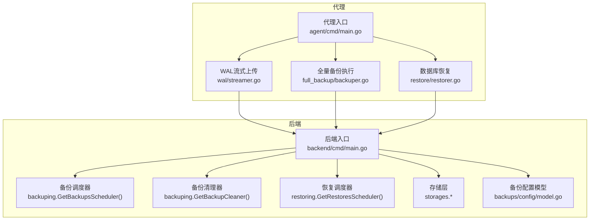
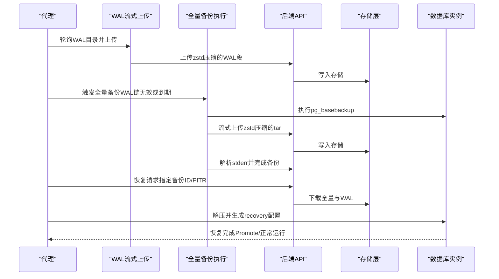
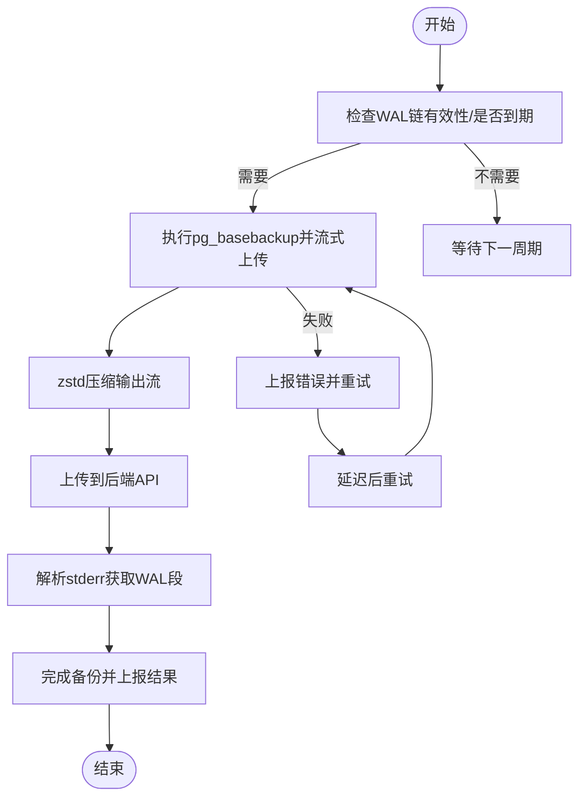
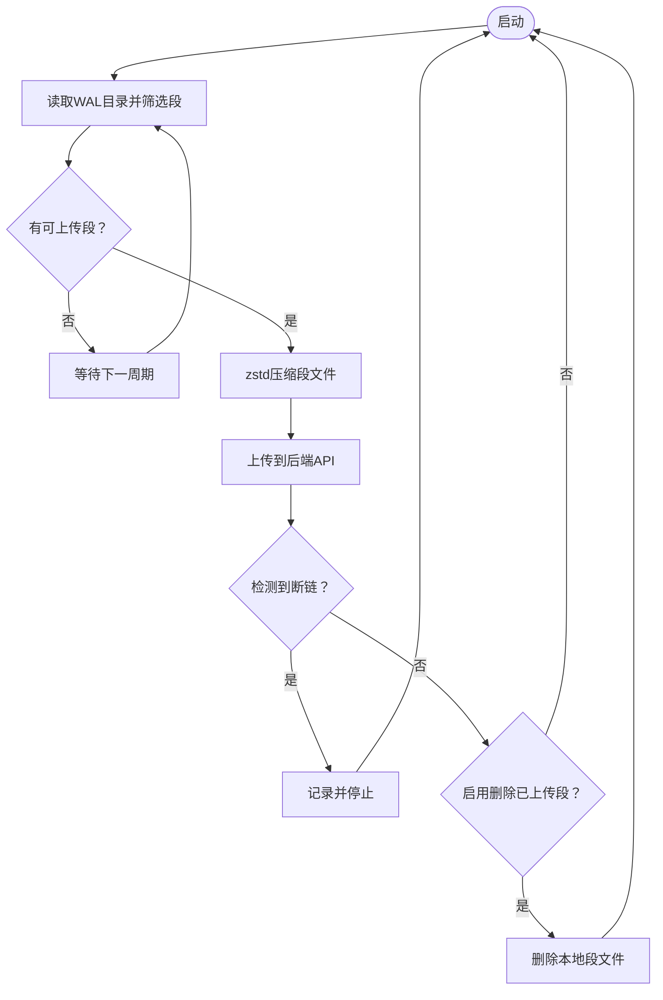
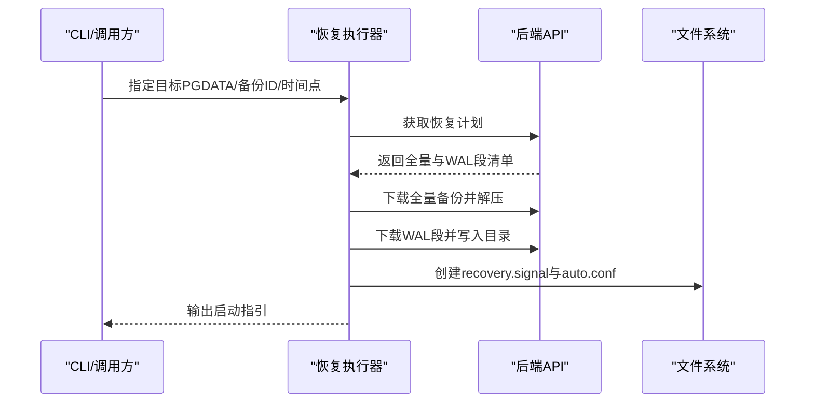
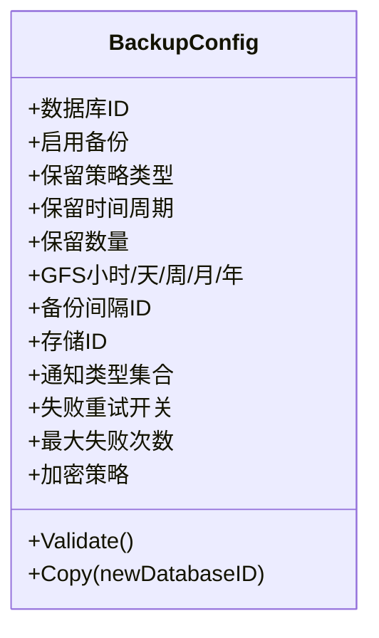
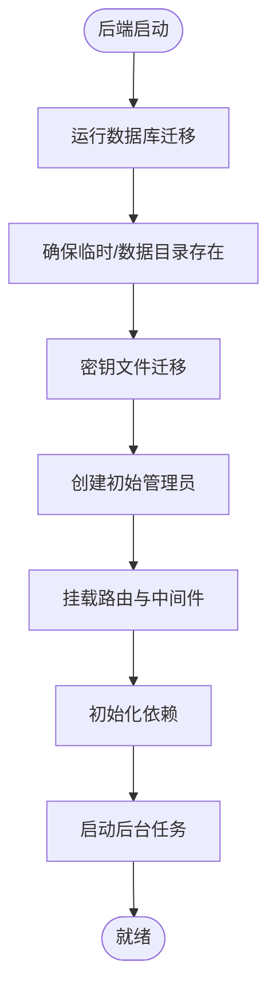
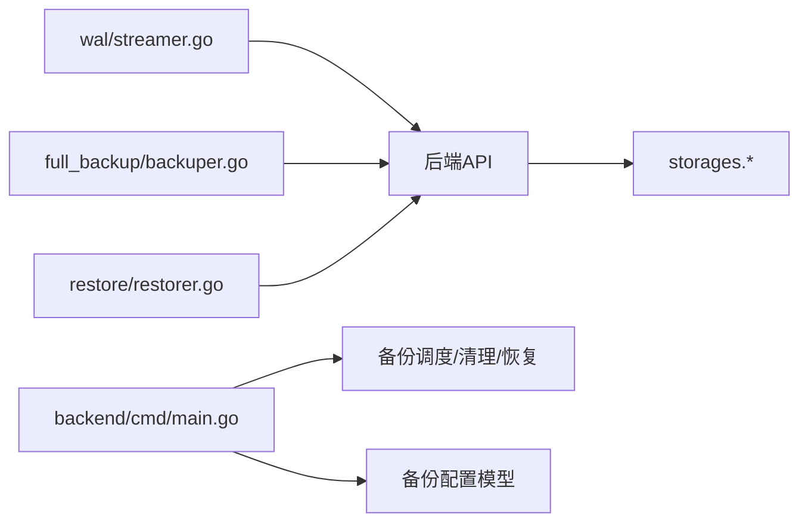

# 备份和恢复

<cite>
**本文引用的文件**
- [agent/cmd/main.go](file://agent/cmd/main.go)
- [agent/internal/features/full_backup/backuper.go](file://agent/internal/features/full_backup/backuper.go)
- [agent/internal/features/restore/restorer.go](file://agent/internal/features/restore/restorer.go)
- [agent/internal/features/wal/streamer.go](file://agent/internal/features/wal/streamer.go)
- [backend/cmd/main.go](file://backend/cmd/main.go)
- [backend/internal/features/backups/config/model.go](file://backend/internal/features/backups/config/model.go)
- [backend/internal/features/backups/config/dto.go](file://backend/internal/features/backups/config/dto.go)
</cite>

## 目录
1. [简介](#简介)
2. [项目结构](#项目结构)
3. [核心组件](#核心组件)
4. [架构总览](#架构总览)
5. [详细组件分析](#详细组件分析)
6. [依赖分析](#依赖分析)
7. [性能考虑](#性能考虑)
8. [故障排查指南](#故障排查指南)
9. [结论](#结论)
10. [附录](#附录)

## 简介
本指南面向Databasus的备份与恢复策略，覆盖以下主题：
- 数据库备份策略：全量备份、增量备份（WAL归档）、恢复到指定时间点（PITR）
- 配置备份：应用配置、用户数据、系统设置的备份范围与方法
- 灾难恢复流程：数据恢复、服务重建、业务连续性保障
- 备份验证与测试：如何验证备份可用性与可恢复性
- 存储策略：本地、远程、跨区域备份建议
- 自动化与定期维护：自动化脚本与例行维护流程
- 恢复演练与应急响应：演练计划、角色分工、回退与报告机制

## 项目结构
Databasus由后端服务与代理（Agent）两部分组成：
- 后端（backend）：负责API、调度、清理、存储与通知等后台任务；启动时初始化迁移、目录、密钥迁移、初始管理员账户，并挂载路由与依赖。
- 代理（agent）：在目标数据库主机上运行，负责WAL归档流式上传、全量备份触发与执行、恢复下载与解压、以及健康检查与升级。

**图示来源**
- [backend/cmd/main.go:314-374](file://backend/cmd/main.go#L314-L374)
- [agent/cmd/main.go:30-47](file://agent/cmd/main.go#L30-L47)
- [agent/internal/features/wal/streamer.go:44-61](file://agent/internal/features/wal/streamer.go#L44-L61)
- [agent/internal/features/full_backup/backuper.go:66-83](file://agent/internal/features/full_backup/backuper.go#L66-L83)
- [agent/internal/features/restore/restorer.go:58-102](file://agent/internal/features/restore/restorer.go#L58-L102)

**章节来源**
- [backend/cmd/main.go:86-136](file://backend/cmd/main.go#L86-L136)
- [agent/cmd/main.go:24-48](file://agent/cmd/main.go#L24-L48)

## 核心组件
- 全量备份执行器（Agent）：周期性检查WAL链有效性与下次全备时间，触发pg_basebackup，压缩并流式上传，解析stderr中的WAL段信息并最终完成备份。
- WAL流式上传（Agent）：轮询WAL目录，按顺序压缩并上传，支持检测断链并删除已上传文件（可选）。
- 恢复执行器（Agent）：从服务器获取恢复计划，下载并解压全量备份，下载所需WAL段，生成recovery信号与自动配置，指导PostgreSQL进行恢复或PITR。
- 备份配置（Backend）：定义备份启用开关、保留策略（时间/数量/GFS）、通知、重试次数、加密要求等。
- 后端调度与清理（Backend）：启动备份/恢复/清理/节点注册等后台任务，确保备份生命周期管理。

**章节来源**
- [agent/internal/features/full_backup/backuper.go:33-46](file://agent/internal/features/full_backup/backuper.go#L33-L46)
- [agent/internal/features/wal/streamer.go:30-42](file://agent/internal/features/wal/streamer.go#L30-L42)
- [agent/internal/features/restore/restorer.go:31-38](file://agent/internal/features/restore/restorer.go#L31-L38)
- [backend/internal/features/backups/config/model.go:16-44](file://backend/internal/features/backups/config/model.go#L16-L44)
- [backend/cmd/main.go:314-374](file://backend/cmd/main.go#L314-L374)

## 架构总览
下图展示备份与恢复的关键交互：代理采集WAL与全量备份，后端统一调度与存储，恢复阶段从后端下载并解压至PGDATA，再通过PostgreSQL内置恢复机制完成恢复或PITR。

**图示来源**
- [agent/internal/features/wal/streamer.go:123-173](file://agent/internal/features/wal/streamer.go#L123-L173)
- [agent/internal/features/full_backup/backuper.go:164-245](file://agent/internal/features/full_backup/backuper.go#L164-L245)
- [agent/internal/features/restore/restorer.go:165-363](file://agent/internal/features/restore/restorer.go#L165-L363)

## 详细组件分析

### 全量备份执行器（Agent）
- 触发条件：WAL链无效或到达下次全备时间；并发安全使用原子布尔值避免重复执行。
- 执行流程：构建pg_basebackup命令（主机/容器两种模式），管道压缩（zstd），流式上传到后端；解析stderr提取起止WAL段，上报完成后结束。
- 错误处理：失败时上报错误并按固定延迟重试，支持超时与空闲超时控制。

**图示来源**
- [agent/internal/features/full_backup/backuper.go:85-124](file://agent/internal/features/full_backup/backuper.go#L85-L124)
- [agent/internal/features/full_backup/backuper.go:164-245](file://agent/internal/features/full_backup/backuper.go#L164-L245)

**章节来源**
- [agent/internal/features/full_backup/backuper.go:66-162](file://agent/internal/features/full_backup/backuper.go#L66-L162)
- [agent/internal/features/full_backup/backuper.go:277-317](file://agent/internal/features/full_backup/backuper.go#L277-L317)

### WAL流式上传（Agent）
- 轮询策略：每10秒扫描WAL目录，过滤临时文件与非标准段名，按名称排序依次上传。
- 压缩与上传：对单个WAL段进行zstd压缩并流式上传，带超时与空闲超时保护。
- 断链检测：若后端返回断链提示则中止当前段并记录日志。
- 清理策略：可选删除已成功上传的WAL段以节省磁盘空间。

**图示来源**
- [agent/internal/features/wal/streamer.go:63-90](file://agent/internal/features/wal/streamer.go#L63-L90)
- [agent/internal/features/wal/streamer.go:123-173](file://agent/internal/features/wal/streamer.go#L123-L173)

**章节来源**
- [agent/internal/features/wal/streamer.go:44-61](file://agent/internal/features/wal/streamer.go#L44-L61)
- [agent/internal/features/wal/streamer.go:92-121](file://agent/internal/features/wal/streamer.go#L92-L121)

### 恢复执行器（Agent）
- 计划获取：向后端查询恢复计划，包含全量备份ID、WAL段列表、总大小、最新可用段等。
- 下载与解压：下载全量备份并解压到目标PGDATA，随后逐段下载WAL并写入专用目录。
- 恢复配置：生成recovery.signal与postgresql.auto.conf，设置restore_command、recovery_end_command、recovery_target_action与可选的recovery_target_time。
- 启动指引：输出启动PostgreSQL的步骤与注意事项，区分容器与主机部署。

**图示来源**
- [agent/internal/features/restore/restorer.go:130-146](file://agent/internal/features/restore/restorer.go#L130-L146)
- [agent/internal/features/restore/restorer.go:165-181](file://agent/internal/features/restore/restorer.go#L165-L181)
- [agent/internal/features/restore/restorer.go:245-327](file://agent/internal/features/restore/restorer.go#L245-L327)
- [agent/internal/features/restore/restorer.go:329-363](file://agent/internal/features/restore/restorer.go#L329-L363)

**章节来源**
- [agent/internal/features/restore/restorer.go:58-102](file://agent/internal/features/restore/restorer.go#L58-L102)
- [agent/internal/features/restore/restorer.go:404-417](file://agent/internal/features/restore/restorer.go#L404-L417)

### 备份配置（Backend）
- 关键字段：启用开关、保留策略类型与参数（时间/数量/GFS）、备份间隔、存储、通知、重试与最大失败次数、加密策略。
- 校验规则：保留策略必须满足对应类型的要求；云环境强制加密；重试需大于0。
- 复制逻辑：支持复制配置到新数据库ID，保留关键参数并重置关联ID。

**图示来源**
- [backend/internal/features/backups/config/model.go:16-108](file://backend/internal/features/backups/config/model.go#L16-L108)

**章节来源**
- [backend/internal/features/backups/config/model.go:108-156](file://backend/internal/features/backups/config/model.go#L108-L156)
- [backend/internal/features/backups/config/dto.go:5-12](file://backend/internal/features/backups/config/dto.go#L5-L12)

### 后端调度与清理（Backend）
- 启动流程：初始化缓存、迁移、目录、密钥迁移、初始管理员；挂载路由与依赖。
- 后台任务：在主节点启动备份/清理/恢复/健康检查/审计/下载令牌/节点注册等任务；在处理节点启动备份/恢复节点任务。
- 异常处理：统一panic捕获与日志记录，保证后台任务稳定性。

**图示来源**
- [backend/cmd/main.go:86-136](file://backend/cmd/main.go#L86-L136)
- [backend/cmd/main.go:293-374](file://backend/cmd/main.go#L293-L374)

**章节来源**
- [backend/cmd/main.go:139-173](file://backend/cmd/main.go#L139-L173)
- [backend/cmd/main.go:376-383](file://backend/cmd/main.go#L376-L383)

## 依赖分析
- 组件耦合：代理内部模块（WAL、全量备份、恢复）均依赖后端API客户端；后端通过控制器与服务层协调存储与通知。
- 外部依赖：zstd压缩库用于流式压缩；Gzip中间件用于后端HTTP响应压缩；CORS用于开发环境跨域。
- 循环依赖：未发现直接循环导入；各模块通过接口与DTO进行解耦。

**图示来源**
- [agent/internal/features/wal/streamer.go:123-173](file://agent/internal/features/wal/streamer.go#L123-L173)
- [agent/internal/features/full_backup/backuper.go:164-245](file://agent/internal/features/full_backup/backuper.go#L164-L245)
- [agent/internal/features/restore/restorer.go:165-363](file://agent/internal/features/restore/restorer.go#L165-L363)
- [backend/cmd/main.go:259-276](file://backend/cmd/main.go#L259-L276)
- [backend/internal/features/backups/config/model.go:16-44](file://backend/internal/features/backups/config/model.go#L16-L44)

**章节来源**
- [backend/cmd/main.go:434-457](file://backend/cmd/main.go#L434-L457)
- [backend/cmd/main.go:117-127](file://backend/cmd/main.go#L117-L127)

## 性能考虑
- 压缩级别：全量与WAL均采用zstd压缩，平衡压缩比与CPU开销；可根据网络与磁盘I/O调整压缩等级。
- 流式传输：避免落盘，减少内存占用；上传超时与空闲超时防止长时间阻塞。
- 并发与节流：全量备份并发受原子标志位保护；WAL上传按序进行，断链即停，降低无效IO。
- 目录与清理：WAL上传后可选择删除本地段文件，释放磁盘空间；清理器负责过期备份回收。

[本节为通用性能建议，不直接分析具体文件]

## 故障排查指南
- WAL上传失败
  - 检查WAL目录权限与磁盘空间；确认段名符合正则格式；查看断链日志并修复WAL链。
  - 参考路径：[agent/internal/features/wal/streamer.go:123-173](file://agent/internal/features/wal/streamer.go#L123-L173)
- 全量备份失败
  - 查看stderr解析日志与pg_basebackup退出码；确认数据库连接参数与权限；检查上传超时与空闲超时设置。
  - 参考路径：[agent/internal/features/full_backup/backuper.go:164-245](file://agent/internal/features/full_backup/backuper.go#L164-L245)
- 恢复无法启动或PITR不生效
  - 确认PGDATA为空且可写；检查recovery.signal与postgresql.auto.conf内容；核对restore_command与WAL目录路径；如容器部署注意卷挂载路径。
  - 参考路径：[agent/internal/features/restore/restorer.go:104-128](file://agent/internal/features/restore/restorer.go#L104-L128)、[agent/internal/features/restore/restorer.go:329-363](file://agent/internal/features/restore/restorer.go#L329-L363)
- 后端任务异常
  - 查看panic日志与后台任务状态；确认主/处理节点配置；检查缓存与数据库连接。
  - 参考路径：[backend/cmd/main.go:376-383](file://backend/cmd/main.go#L376-L383)、[backend/cmd/main.go:293-374](file://backend/cmd/main.go#L293-L374)

**章节来源**
- [agent/internal/features/wal/streamer.go:151-159](file://agent/internal/features/wal/streamer.go#L151-L159)
- [agent/internal/features/full_backup/backuper.go:215-232](file://agent/internal/features/full_backup/backuper.go#L215-L232)
- [agent/internal/features/restore/restorer.go:130-146](file://agent/internal/features/restore/restorer.go#L130-L146)
- [backend/cmd/main.go:376-383](file://backend/cmd/main.go#L376-L383)

## 结论
Databasus通过“WAL流式上传 + 全量备份 + 恢复计划”的组合实现高可靠的数据保护与可恢复性。后端提供统一的配置、调度与清理能力，代理专注于高效稳定的备份与恢复执行。结合合理的保留策略与定期演练，可有效保障业务连续性。

[本节为总结性内容，不直接分析具体文件]

## 附录

### 备份策略与配置
- 全量备份：基于pg_basebackup，流式zstd压缩上传，解析WAL段并完成备份。
- 增量备份：WAL归档流式上传，按序处理，断链检测与可选删除本地段。
- PITR：恢复时通过recovery_target_time实现精确时间点恢复。
- 保留策略：支持时间窗口、数量限制、GFS（金、银、铅、化石）多级保留策略。
- 加密：云存储场景强制加密，本地可选。

**章节来源**
- [agent/internal/features/full_backup/backuper.go:33-46](file://agent/internal/features/full_backup/backuper.go#L33-L46)
- [agent/internal/features/wal/streamer.go:30-42](file://agent/internal/features/wal/streamer.go#L30-L42)
- [agent/internal/features/restore/restorer.go:354-356](file://agent/internal/features/restore/restorer.go#L354-L356)
- [backend/internal/features/backups/config/model.go:16-44](file://backend/internal/features/backups/config/model.go#L16-L44)

### 灾难恢复流程
- 数据恢复：获取恢复计划，下载全量与WAL，生成recovery配置，启动PostgreSQL完成恢复。
- 服务重建：准备干净的PGDATA目录，按指引启动数据库；容器部署需正确挂载卷。
- 业务连续性：通过PITR将数据库恢复到故障前的最近一致点，缩短RTO/RPO。

**章节来源**
- [agent/internal/features/restore/restorer.go:58-102](file://agent/internal/features/restore/restorer.go#L58-L102)
- [agent/internal/features/restore/restorer.go:365-402](file://agent/internal/features/restore/restorer.go#L365-L402)

### 备份验证与测试
- 验证方法：定期执行恢复演练，验证下载、解压、恢复配置与启动流程；检查WAL链完整性与断链告警。
- 测试要点：不同数据库版本兼容性、容器与主机部署差异、网络抖动下的超时与重试行为。

**章节来源**
- [agent/internal/features/wal/streamer.go:151-159](file://agent/internal/features/wal/streamer.go#L151-L159)
- [agent/internal/features/restore/restorer.go:260-299](file://agent/internal/features/restore/restorer.go#L260-L299)

### 备份存储策略
- 本地备份：适合小规模或低延迟需求，注意磁盘空间与IO压力。
- 远程备份：S3/NAS/SFTP等对象存储，具备高可用与扩展性。
- 跨区域备份：建议开启加密与跨区冗余，定期校验跨区同步一致性。

**章节来源**
- [backend/internal/features/backups/config/model.go:43](file://backend/internal/features/backups/config/model.go#L43)

### 自动化与定期维护
- 自动化脚本：结合代理命令（start/status/stop/restore/version）与后端API，编写定时任务执行备份与恢复演练。
- 定期维护：清理过期备份、监控WAL链断点、更新代理版本、验证通知通道。

**章节来源**
- [agent/cmd/main.go:162-171](file://agent/cmd/main.go#L162-L171)
- [backend/cmd/main.go:314-374](file://backend/cmd/main.go#L314-L374)

### 恢复演练与应急响应
- 演练计划：制定月度/季度演练，覆盖全量+增量、PITR、跨节点恢复场景。
- 应急响应：明确角色分工（DBA/运维/开发）、回退策略（回滚到上一个全量备份）、事件报告模板与复盘流程。

**章节来源**
- [agent/internal/features/restore/restorer.go:365-402](file://agent/internal/features/restore/restorer.go#L365-L402)
- [backend/internal/features/backups/config/model.go:40-44](file://backend/internal/features/backups/config/model.go#L40-L44)