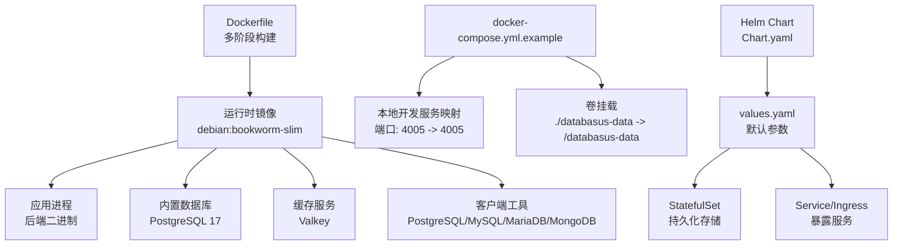
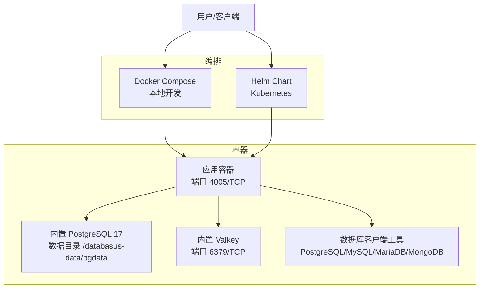
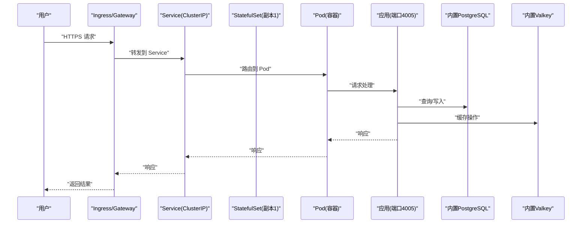
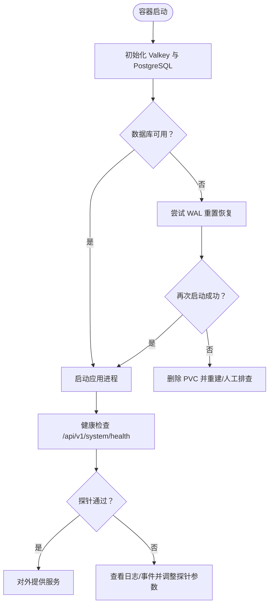
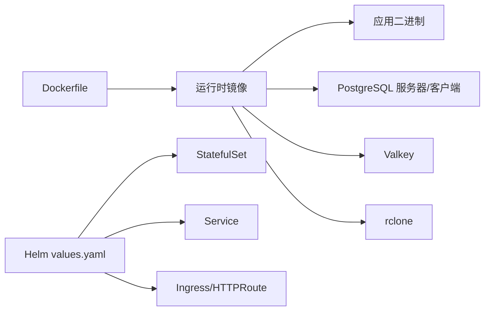

# 容器化部署

<cite>
**本文引用的文件**
- [Dockerfile](file://Dockerfile)
- [docker-compose.yml.example](file://docker-compose.yml.example)
- [.dockerignore](file://.dockerignore)
- [deploy/helm/Chart.yaml](file://deploy/helm/Chart.yaml)
- [deploy/helm/values.yaml](file://deploy/helm/values.yaml)
- [deploy/helm/templates/statefulset.yaml](file://deploy/helm/templates/statefulset.yaml)
- [deploy/helm/templates/service.yaml](file://deploy/helm/templates/service.yaml)
- [deploy/helm/templates/ingress.yaml](file://deploy/helm/templates/ingress.yaml)
- [agent/docker-compose.yml.example](file://agent/docker-compose.yml.example)
- [agent/e2e/Dockerfile.agent-builder](file://agent/e2e/Dockerfile.agent-builder)
- [agent/e2e/Dockerfile.agent-docker](file://agent/e2e/Dockerfile.agent-docker)
- [agent/e2e/Dockerfile.agent-runner](file://agent/e2e/Dockerfile.agent-runner)
- [agent/e2e/docker-compose.yml](file://agent/e2e/docker-compose.yml)
</cite>

## 目录
1. [简介](#简介)
2. [项目结构](#项目结构)
3. [核心组件](#核心组件)
4. [架构总览](#架构总览)
5. [详细组件分析](#详细组件分析)
6. [依赖关系分析](#依赖关系分析)
7. [性能考量](#性能考量)
8. [故障排除指南](#故障排除指南)
9. [结论](#结论)
10. [附录](#附录)

## 简介
本指南面向希望在本地或生产环境中以容器方式部署 Databasus 的用户与运维工程师。内容覆盖：
- Docker 镜像构建：多阶段构建、镜像优化、安全扫描建议
- Docker Compose 编排：服务编排、网络与卷挂载
- Kubernetes 部署：Deployment/StatefulSet、Service、Ingress、探针与资源限制
- Helm Chart 使用：参数配置、升级回滚、命名空间管理
- 监控与日志：采集与可观测性建议
- 安全最佳实践：镜像与运行时安全、资源限制
- 故障排除与调试：常见问题定位与修复步骤

## 项目结构
Databasus 提供了从单机到云原生的多种部署路径：
- 单体镜像：通过根目录 Dockerfile 构建，包含前端、后端、内置数据库与工具链
- 开发与测试：提供 Agent 相关的 Docker Compose 示例与 E2E 测试镜像
- 生产级编排：提供 Helm Chart，支持 StatefulSet、Service、Ingress/HTTPRoute 及探针配置

图表来源
- [Dockerfile:106-546](file://Dockerfile#L106-L546)
- [docker-compose.yml.example:1-19](file://docker-compose.yml.example#L1-L19)
- [deploy/helm/Chart.yaml:1-23](file://deploy/helm/Chart.yaml#L1-L23)
- [deploy/helm/values.yaml:1-107](file://deploy/helm/values.yaml#L1-L107)

章节来源
- [Dockerfile:1-546](file://Dockerfile#L1-L546)
- [docker-compose.yml.example:1-19](file://docker-compose.yml.example#L1-L19)
- [deploy/helm/Chart.yaml:1-23](file://deploy/helm/Chart.yaml#L1-L23)
- [deploy/helm/values.yaml:1-107](file://deploy/helm/values.yaml#L1-L107)

## 核心组件
- 多阶段构建与静态二进制
  - 前端构建：基于 Node Alpine，构建产物嵌入至运行时镜像
  - 后端构建：Go 1.26，生成静态二进制并内嵌前端产物
  - Agent 构建：纯 Go，交叉编译 x86_64 与 ARM64 静态二进制
- 运行时环境
  - 基于 Debian Slim，安装 PostgreSQL 服务器、Valkey、rclone 以及多版本数据库客户端
  - 内置启动脚本负责初始化数据库、Valkey、注入运行时配置与健康检查
- 数据与持久化
  - 挂载点 /databasus-data，包含内部 PostgreSQL 数据目录、临时目录与备份目录
- 探针与健康检查
  - 应用仅提供 /api/v1/system/health；Helm Chart 提供就绪/存活探针配置

章节来源
- [Dockerfile:23-104](file://Dockerfile#L23-L104)
- [Dockerfile:106-546](file://Dockerfile#L106-L546)
- [deploy/helm/values.yaml:71-92](file://deploy/helm/values.yaml#L71-L92)

## 架构总览
下图展示容器化部署的高层视图：单体镜像包含应用与内置数据库/缓存，通过 Compose 或 Helm 进行编排。

图表来源
- [Dockerfile:106-546](file://Dockerfile#L106-L546)
- [docker-compose.yml.example:7-19](file://docker-compose.yml.example#L7-L19)
- [deploy/helm/templates/statefulset.yaml:1-106](file://deploy/helm/templates/statefulset.yaml#L1-L106)

## 详细组件分析

### Docker 镜像构建（多阶段、优化、安全）
- 多阶段构建
  - 前端构建阶段：Node Alpine，复制前端源码与环境变量，执行构建并将产物拷贝至运行时
  - 后端构建阶段：Go 1.26，下载依赖、生成 Swagger 文档、编译静态二进制
  - Agent 构建阶段：交叉编译 x86_64 与 ARM64 静态二进制
  - 运行时阶段：Debian Slim，安装必要工具与客户端，拷贝构建产物与启动脚本
- 镜像优化
  - 使用 .dockerignore 排除不必要的文件与目录，减少层大小
  - 多阶段构建仅保留运行所需二进制与工具
  - 静态链接避免运行时库依赖
- 安全扫描建议
  - 在 CI 中集成镜像扫描（如 Trivy/Snyk），对运行时基础镜像与第三方依赖进行漏洞扫描
  - 定期更新基础镜像与依赖版本，关注 CVE 公告
  - 使用只读根文件系统与非 root 用户运行（见“安全最佳实践”）

章节来源
- [Dockerfile:1-104](file://Dockerfile#L1-L104)
- [.dockerignore:1-74](file://.dockerignore#L1-L74)

### Docker Compose 配置（服务编排、网络、卷）
- 本地开发示例
  - 服务名：databasus-local
  - 映射：4005:4005
  - 卷：将宿主机 ./databasus-data 挂载到容器 /databasus-data
  - 重启策略：unless-stopped
- 注意事项
  - 该示例仅用于本地开发，不应用于生产或 VPS
  - 如需生产部署，建议使用 Kubernetes 与 Helm

章节来源
- [docker-compose.yml.example:1-19](file://docker-compose.yml.example#L1-L19)

### Kubernetes 部署（Deployment/StatefulSet、Service、Ingress/HTTPRoute）
- StatefulSet
  - 使用持久化存储声明（PVC），默认 10Gi，可按需调整
  - 支持自定义存储类、访问模式与节点亲和/容忍
  - 更新策略为滚动更新
- Service
  - ClusterIP 类型，默认目标端口 4005
  - 同时提供 Headless Service 以适配 StatefulSet
- Ingress/HTTPRoute
  - Ingress 默认关闭，可通过 values 启用并配置域名与 TLS
  - HTTPRoute 为 Gateway API 资源，可按需启用
- 探针
  - 就绪/存活探针均指向 /api/v1/system/health
  - 可根据集群负载与启动时间调整延迟与超时参数

图表来源
- [deploy/helm/templates/service.yaml:1-41](file://deploy/helm/templates/service.yaml#L1-L41)
- [deploy/helm/templates/statefulset.yaml:1-106](file://deploy/helm/templates/statefulset.yaml#L1-L106)
- [deploy/helm/values.yaml:46-70](file://deploy/helm/values.yaml#L46-L70)

章节来源
- [deploy/helm/templates/statefulset.yaml:1-106](file://deploy/helm/templates/statefulset.yaml#L1-L106)
- [deploy/helm/templates/service.yaml:1-41](file://deploy/helm/templates/service.yaml#L1-L41)
- [deploy/helm/templates/ingress.yaml:1-43](file://deploy/helm/templates/ingress.yaml#L1-L43)
- [deploy/helm/values.yaml:1-107](file://deploy/helm/values.yaml#L1-L107)

### Helm Chart 使用指南（参数、升级回滚、命名空间）
- 参数配置
  - 镜像仓库与标签、拉取策略
  - 副本数、资源请求/限制、持久化存储大小与存储类
  - Service 类型、Ingress/HTTPRoute 开关与域名配置
  - 探针参数、节点选择与亲和/容忍
- 升级与回滚
  - 升级：helm upgrade -i databasus ./deploy/helm -n <namespace> -f values.yaml
  - 回滚：helm rollback databasus <revision> -n <namespace>
- 命名空间管理
  - 建议在独立命名空间中部署，便于资源隔离与权限控制
  - 若使用自定义根 CA，需在同命名空间提供 Secret 并通过 values 指定

章节来源
- [deploy/helm/Chart.yaml:1-23](file://deploy/helm/Chart.yaml#L1-L23)
- [deploy/helm/values.yaml:1-107](file://deploy/helm/values.yaml#L1-L107)

### 容器监控与日志收集
- 日志
  - 应用标准输出即为日志，建议在 Kubernetes 中使用集中式日志收集（如 Fluent Bit/Fluentd、Vector、Promtail）
  - 日志应包含请求链路 ID、错误堆栈与关键业务事件
- 指标
  - 可在应用侧增加指标导出（如 Prometheus），或通过 Sidecar 暴露
- 健康检查
  - 使用就绪/存活探针确保流量仅进入健康实例
  - 结合 HPA 实现自动扩缩容（需配合指标）

[本节为通用指导，无需列出具体文件来源]

### 容器安全最佳实践与资源限制
- 镜像安全
  - 使用最小化基础镜像（已采用 Debian Slim）
  - 启用镜像扫描与漏洞基线治理
- 运行时安全
  - 非 root 用户运行（当前镜像以 root 启动，建议改造）
  - 只读根文件系统、禁用不必要的 Capabilities
  - 限制容器能力（如 drop sys_admin、net_raw 等）
- 资源限制
  - 在 values.yaml 中设置 requests/limits，避免资源争抢
  - 根据数据库与并发场景调优内存与 CPU
- 凭据与密钥
  - 使用 Kubernetes Secret 管理敏感信息，避免硬编码在镜像或配置中
  - 如需自定义根 CA，通过 Secret 注入并设置 SSL_CERT_FILE

章节来源
- [deploy/helm/values.yaml:26-34](file://deploy/helm/values.yaml#L26-L34)
- [Dockerfile:106-546](file://Dockerfile#L106-L546)

### 容器化部署的故障排除与调试
- 启动失败与 WAL 恢复
  - 启动脚本包含 WAL 重置恢复逻辑，若数据库损坏可尝试自动恢复
  - 若失败，建议删除 PVC 并重新初始化（数据丢失）
- 权限与卷
  - 确保宿主机卷权限正确，UID/GID 与 postgres 用户匹配
  - 若出现权限问题，检查 /databasus-data 目录属主与权限
- 外部数据库/缓存警告
  - 当设置外部数据库或 Valkey 时，应用会发出警告
  - 确认外部实例可达且凭据正确
- 探针与健康检查
  - 若探针频繁失败，检查初始延迟、超时与失败阈值
  - 通过 kubectl describe pod 查看事件与容器状态

图表来源
- [Dockerfile:424-490](file://Dockerfile#L424-L490)
- [deploy/helm/values.yaml:71-92](file://deploy/helm/values.yaml#L71-L92)

章节来源
- [Dockerfile:298-314](file://Dockerfile#L298-L314)
- [Dockerfile:424-490](file://Dockerfile#L424-L490)
- [deploy/helm/values.yaml:71-92](file://deploy/helm/values.yaml#L71-L92)

## 依赖关系分析
- 组件耦合
  - 运行时镜像依赖内置数据库与缓存，应用通过本地回环连接
  - 启动脚本负责数据库初始化与 Valkey 启动，耦合度较高但集中管理
- 外部依赖
  - PostgreSQL 服务器与客户端工具由包管理器安装
  - rclone 用于对象存储备份
- Helm 依赖
  - values.yaml 提供默认参数，模板渲染生成 StatefulSet、Service、Ingress/HTTPRoute

图表来源
- [Dockerfile:106-546](file://Dockerfile#L106-L546)
- [deploy/helm/values.yaml:1-107](file://deploy/helm/values.yaml#L1-L107)

章节来源
- [Dockerfile:106-546](file://Dockerfile#L106-L546)
- [deploy/helm/values.yaml:1-107](file://deploy/helm/values.yaml#L1-L107)

## 性能考量
- 静态二进制与多阶段构建降低镜像体积与启动时间
- 内置数据库与缓存减少外部依赖带来的网络抖动
- 探针与资源限制避免资源争抢，提升稳定性
- 建议结合数据库连接池、缓存命中率与并发模型进行压测与调优

[本节为通用指导，无需列出具体文件来源]

## 故障排除指南
- 数据库无法启动
  - 查看启动脚本日志，确认 WAL 重置是否成功
  - 若仍失败，考虑删除 PVC 并重新初始化
- 卷权限问题
  - 检查宿主机目录属主与权限，确保 postgres 用户可写
- 外部依赖不可达
  - 核对外部数据库/Valkey 的地址、端口与凭据
- 探针失败
  - 调整 initialDelaySeconds、timeoutSeconds 与 failureThreshold
  - 使用 kubectl logs/ describe 定位具体错误

章节来源
- [Dockerfile:424-490](file://Dockerfile#L424-L490)
- [deploy/helm/values.yaml:71-92](file://deploy/helm/values.yaml#L71-L92)

## 结论
Databasus 提供了从单机到云原生的完整容器化方案。通过多阶段构建与静态二进制实现高效镜像；借助 Compose 快速本地验证，借助 Helm 在 Kubernetes 上实现高可用与弹性。结合探针、资源限制与安全加固，可在生产环境中稳定运行。

[本节为总结性内容，无需列出具体文件来源]

## 附录
- Agent 相关镜像与测试
  - e2e Agent 构建镜像：生成不同版本 Agent 二进制用于升级测试
  - Agent Runner 镜像：包含 PostgreSQL 服务，用于生命周期测试
  - Agent Docker 镜像：包含 Docker CLI，用于 docker exec 场景测试
  - E2E Compose：组合以上服务，提供端到端测试环境

章节来源
- [agent/e2e/Dockerfile.agent-builder:1-14](file://agent/e2e/Dockerfile.agent-builder#L1-L14)
- [agent/e2e/Dockerfile.agent-runner:1-15](file://agent/e2e/Dockerfile.agent-runner#L1-L15)
- [agent/e2e/Dockerfile.agent-docker:1-23](file://agent/e2e/Dockerfile.agent-docker#L1-L23)
- [agent/e2e/docker-compose.yml:1-85](file://agent/e2e/docker-compose.yml#L1-L85)
- [agent/docker-compose.yml.example:1-59](file://agent/docker-compose.yml.example#L1-L59)