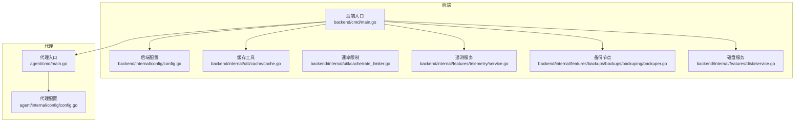
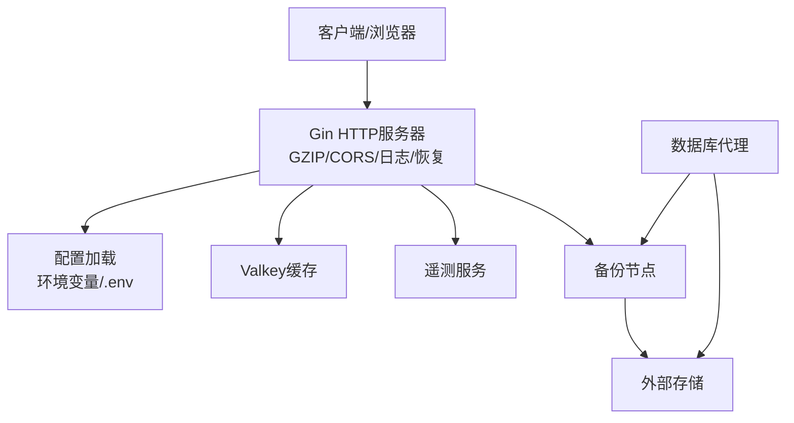
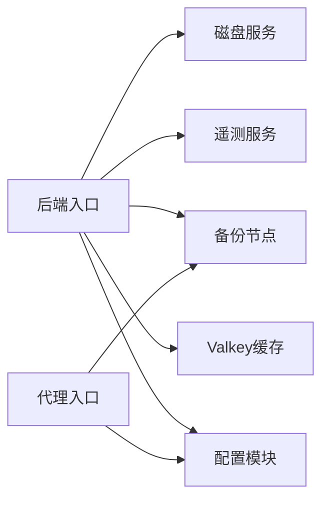

# 性能优化

<cite>
**本文引用的文件**
- [后端入口 main.go](file://backend/cmd/main.go)
- [代理入口 main.go](file://agent/cmd/main.go)
- [后端配置 config.go](file://backend/internal/config/config.go)
- [代理配置 config.go](file://agent/internal/config/config.go)
- [缓存工具 cache.go](file://backend/internal/util/cache/cache.go)
- [速率限制 rate_limiter.go](file://backend/internal/util/cache/rate_limiter.go)
- [遥测服务 service.go](file://backend/internal/features/telemetry/service.go)
- [备份执行器 backuper.go](file://backend/internal/features/backups/backups/backuping/backuper.go)
- [磁盘服务 service.go](file://backend/internal/features/disk/service.go)
</cite>

## 目录
1. [简介](#简介)
2. [项目结构](#项目结构)
3. [核心组件](#核心组件)
4. [架构总览](#架构总览)
5. [详细组件分析](#详细组件分析)
6. [依赖分析](#依赖分析)
7. [性能考量](#性能考量)
8. [故障排查指南](#故障排查指南)
9. [结论](#结论)
10. [附录](#附录)

## 简介
本指南面向Databasus项目的性能优化实践，围绕数据库性能、存储性能、网络性能、代理服务性能以及监控与容量规划等方面，结合代码实现给出可落地的优化建议与最佳实践。内容涵盖索引与查询优化、连接池配置、磁盘I/O与缓存策略、压缩算法选择、连接复用与超时控制、并发处理与资源限制、监控指标分析与瓶颈识别、性能测试与基准测试方案，以及容量规划与扩容策略。

## 项目结构
Databasus由后端（Go）与代理（Go）两部分组成，后端负责API、业务逻辑、备份调度与遥测；代理负责数据库侧的WAL归档与基础备份上传。两者通过环境变量与配置文件协同工作，并通过Valkey进行缓存与轻量协调。

**图表来源**
- [后端入口 main.go:65-137](file://backend/cmd/main.go#L65-L137)
- [后端配置 config.go:25-146](file://backend/internal/config/config.go#L25-L146)
- [缓存工具 cache.go:13-45](file://backend/internal/util/cache/cache.go#L13-L45)
- [速率限制 rate_limiter.go:12-20](file://backend/internal/util/cache/rate_limiter.go#L12-L20)
- [遥测服务 service.go:42-73](file://backend/internal/features/telemetry/service.go#L42-L73)
- [备份执行器 backuper.go](file://backend/internal/features/backups/backups/backuping/backuper.go#T32-L49)
- [磁盘服务 service.go:13-13](file://backend/internal/features/disk/service.go#L13-L13)
- [代理入口 main.go:24-48](file://agent/cmd/main.go#L24-L48)
- [代理配置 config.go:16-31](file://agent/internal/config/config.go#L16-L31)

**章节来源**
- [后端入口 main.go:65-137](file://backend/cmd/main.go#L65-L137)
- [后端配置 config.go:25-146](file://backend/internal/config/config.go#L25-L146)
- [代理入口 main.go:24-48](file://agent/cmd/main.go#L24-L48)
- [代理配置 config.go:16-31](file://agent/internal/config/config.go#L16-L31)

## 核心组件
- 后端HTTP服务器：使用Gin框架，启用GZIP压缩、CORS、日志与恢复中间件，提供REST API与Swagger文档。
- 配置系统：集中读取.env与环境变量，支持开发/生产模式切换、Valkey连接参数、节点角色与网络吞吐配置。
- 缓存与限流：基于Valkey的通用缓存工具与按端点+标识符的滑动窗口限流。
- 备份节点：多节点备份/恢复任务分发与心跳上报，依据节点网络吞吐限制并发。
- 遥测：周期性收集实例、数据库类型版本、存储与通知器类型等信息并发送。
- 磁盘监控：跨平台检测数据目录所在分区的磁盘使用情况。

**章节来源**
- [后端入口 main.go:112-127](file://backend/cmd/main.go#L112-L127)
- [后端配置 config.go:25-146](file://backend/internal/config/config.go#L25-L146)
- [缓存工具 cache.go:13-45](file://backend/internal/util/cache/cache.go#L13-L45)
- [速率限制 rate_limiter.go:12-20](file://backend/internal/util/cache/rate_limiter.go#L12-L20)
- [备份执行器 backuper.go:32-49](file://backend/internal/features/backups/backups/backuping/backuper.go#L32-L49)
- [遥测服务 service.go:42-73](file://backend/internal/features/telemetry/service.go#L42-L73)
- [磁盘服务 service.go:13-13](file://backend/internal/features/disk/service.go#L13-L13)

## 架构总览
后端作为统一入口，承载认证、路由、业务编排与后台任务；代理在目标数据库侧运行，负责WAL与基础备份的采集与上传。Valkey用于缓存与轻量协调（如限流键空间扫描）。备份节点根据网络吞吐与任务队列动态分配任务，避免拥塞。

**图表来源**
- [后端入口 main.go:112-127](file://backend/cmd/main.go#L112-L127)
- [后端配置 config.go:25-146](file://backend/internal/config/config.go#L25-L146)
- [缓存工具 cache.go:13-45](file://backend/internal/util/cache/cache.go#L13-L45)
- [遥测服务 service.go:75-108](file://backend/internal/features/telemetry/service.go#L75-L108)
- [备份执行器 backuper.go:51-116](file://backend/internal/features/backups/backups/backuping/backuper.go#L51-L116)

## 详细组件分析

### 数据库性能优化
- 索引优化
  - 建议对高频查询字段建立合适索引，避免全表扫描；定期分析查询计划，剔除冗余或失效索引。
  - 对时间序列类字段（如备份时间、健康检查时间）建立复合索引以提升范围查询效率。
- 查询优化
  - 使用参数化查询，避免SQL拼接；对聚合查询使用LIMIT与分页，避免一次性返回大量数据。
  - 将复杂查询拆分为多个简单查询，必要时引入物化视图或汇总表。
- 连接池配置
  - 合理设置最大连接数、空闲连接数与连接生命周期，避免连接泄漏与过度竞争。
  - 根据峰值QPS与平均响应时间调整池大小，结合慢查询日志定位热点SQL。

### 存储性能优化
- 磁盘I/O优化
  - 将备份数据目录挂载到高性能磁盘（SSD），并确保独立的IO路径，避免与日志争抢。
  - 使用异步写入与批量提交减少fsync频率；合理设置文件系统块大小与挂载选项。
- 缓存策略
  - 利用Valkey缓存热点元数据与临时状态，缩短重复查询路径；对大对象采用分片或压缩存储。
  - 设置合理的TTL与淘汰策略，避免缓存击穿与雪崩。
- 压缩算法选择
  - 根据数据类型选择压缩比与CPU开销平衡的算法；对二进制备份优先考虑高压缩比算法，文本类数据可适度压缩。
  - 在备份节点侧评估压缩/解压耗时与网络带宽占用，动态调整压缩级别。

**章节来源**
- [缓存工具 cache.go:13-45](file://backend/internal/util/cache/cache.go#L13-L45)
- [备份执行器 backuper.go:58-63](file://backend/internal/features/backups/backups/backuping/backuper.go#L58-L63)

### 网络性能优化
- 连接复用
  - 后端启用GZIP压缩，减少传输体积；代理与存储交互建议使用长连接与连接池。
- 超时配置
  - 明确请求超时、读写超时与重试策略；对大文件上传设置分块与断点续传。
- 带宽管理
  - 通过节点网络吞吐配置限制单节点并发度，避免网络拥塞；在高峰期降低压缩级别或延迟非关键任务。

**章节来源**
- [后端入口 main.go:117-124](file://backend/cmd/main.go#L117-L124)
- [后端配置 config.go:48-52](file://backend/internal/config/config.go#L48-L52)
- [备份执行器 backuper.go:58-63](file://backend/internal/features/backups/backups/backuping/backuper.go#L58-L63)

### 代理服务性能调优
- 并发处理
  - 代理启动后进入守护进程模式，订阅备份任务并行处理；建议根据CPU核数与磁盘I/O能力设置并发上限。
- 内存管理
  - 控制单次备份缓冲区大小，避免内存峰值过高；及时释放临时文件句柄与连接。
- 资源限制
  - 通过配置文件设置WAL队列目录与删除策略，防止磁盘占满；对代理版本自动更新进行白名单控制。

**章节来源**
- [代理入口 main.go:50-97](file://agent/cmd/main.go#L50-L97)
- [代理配置 config.go:16-31](file://agent/internal/config/config.go#L16-L31)
- [代理配置 config.go:103-115](file://agent/internal/config/config.go#L103-L115)

### 监控指标分析与瓶颈识别
- 指标采集
  - 遥测服务收集数据库类型与版本、存储类型、通知器类型等维度，辅助容量与兼容性分析。
  - 备份节点记录心跳、进度、耗时与大小，用于评估吞吐与稳定性。
- 瓶颈识别
  - CPU瓶颈：高上下文切换与系统态占比；I/O瓶颈：磁盘等待与队列长度上升；网络瓶颈：上传/下载带宽饱和。
  - 结合Gin日志与panic恢复中间件定位异常请求与堆栈。

**章节来源**
- [遥测服务 service.go:75-108](file://backend/internal/features/telemetry/service.go#L75-L108)
- [备份执行器 backuper.go:154-178](file://backend/internal/features/backups/backups/backuping/backuper.go#L154-L178)
- [后端入口 main.go:459-476](file://backend/cmd/main.go#L459-L476)

### 性能测试与基准测试方案
- 基准场景
  - 单机备份/恢复：固定数据量与网络条件，测量吞吐、延迟与资源占用。
  - 多节点并发：逐步增加节点数量，观察吞吐曲线与瓶颈点。
- 测试工具
  - 使用代理提供的恢复命令进行PITR验证；对不同压缩算法进行对比测试。
- 指标记录
  - 记录备份/恢复时长、压缩比、CPU/内存/磁盘I/O使用率、网络带宽与错误率。

**章节来源**
- [代理入口 main.go:117-160](file://agent/cmd/main.go#L117-L160)
- [备份执行器 backuper.go:171-178](file://backend/internal/features/backups/backups/backuping/backuper.go#L171-L178)

### 容量规划与扩容策略
- 容量规划
  - 基于历史备份量与增长趋势估算存储需求；结合磁盘服务输出的可用空间制定阈值告警。
- 扩容策略
  - 横向扩展：新增备份节点，按网络吞吐均分任务；纵向扩展：提升单节点CPU/内存与磁盘I/O。
  - 云环境：利用对象存储的弹性带宽与多AZ部署，结合代理多节点部署提升可靠性。

**章节来源**
- [磁盘服务 service.go:15-48](file://backend/internal/features/disk/service.go#L15-L48)
- [后端配置 config.go:48-52](file://backend/internal/config/config.go#L48-L52)
- [备份执行器 backuper.go:58-63](file://backend/internal/features/backups/backups/backuping/backuper.go#L58-L63)

## 依赖分析
后端与代理通过配置文件与环境变量耦合，后端依赖Valkey进行缓存与协调，备份节点依赖存储后端完成文件上传与清理。

**图表来源**
- [后端入口 main.go:65-137](file://backend/cmd/main.go#L65-L137)
- [后端配置 config.go:25-146](file://backend/internal/config/config.go#L25-L146)
- [缓存工具 cache.go:13-45](file://backend/internal/util/cache/cache.go#L13-L45)
- [遥测服务 service.go:75-108](file://backend/internal/features/telemetry/service.go#L75-L108)
- [备份执行器 backuper.go:51-116](file://backend/internal/features/backups/backups/backuping/backuper.go#L51-L116)
- [磁盘服务 service.go:15-48](file://backend/internal/features/disk/service.go#L15-L48)
- [代理入口 main.go:24-48](file://agent/cmd/main.go#L24-L48)

**章节来源**
- [后端入口 main.go:65-137](file://backend/cmd/main.go#L65-L137)
- [代理入口 main.go:24-48](file://agent/cmd/main.go#L24-L48)

## 性能考量
- 中间件与压缩：GZIP压缩显著降低静态资源传输体积，但需排除已压缩文件类型；CORS仅在开发模式启用，避免生产环境不必要的开销。
- 缓存与限流：Valkey作为共享缓存与限流后端，应设置合理的TTL与批量清理策略，避免键空间膨胀。
- 备份并发：通过节点网络吞吐限制并发，结合心跳与任务发布机制实现自适应调度。
- 异常处理：全局panic恢复中间件记录堆栈与请求上下文，便于快速定位问题根因。

**章节来源**
- [后端入口 main.go:117-127](file://backend/cmd/main.go#L117-L127)
- [缓存工具 cache.go:47-81](file://backend/internal/util/cache/cache.go#L47-L81)
- [速率限制 rate_limiter.go:22-53](file://backend/internal/util/cache/rate_limiter.go#L22-L53)
- [备份执行器 backuper.go:51-116](file://backend/internal/features/backups/backups/backuping/backuper.go#L51-L116)
- [后端入口 main.go:459-476](file://backend/cmd/main.go#L459-L476)

## 故障排查指南
- 缓存连通性
  - 使用缓存工具的连接测试函数验证Valkey可达性与读写；若失败，检查主机、端口、认证与TLS配置。
- 备份失败
  - 查看备份节点日志中的错误消息与上下文；区分用户取消、系统关闭与业务异常；对部分文件清理与通知发送进行校验。
- 磁盘空间
  - 使用磁盘服务获取数据目录所在分区的总/已用/剩余空间，设置阈值告警并清理临时文件。
- 代理状态
  - 通过代理命令查看状态、停止与恢复流程；确认配置文件与令牌有效。

**章节来源**
- [缓存工具 cache.go:47-81](file://backend/internal/util/cache/cache.go#L47-L81)
- [备份执行器 backuper.go:179-281](file://backend/internal/features/backups/backups/backuping/backuper.go#L179-L281)
- [磁盘服务 service.go:15-48](file://backend/internal/features/disk/service.go#L15-L48)
- [代理入口 main.go:99-115](file://agent/cmd/main.go#L99-L115)

## 结论
通过对后端中间件、缓存与限流、备份节点调度、代理与存储交互的系统性优化，结合监控与容量规划，可显著提升Databasus的整体性能与稳定性。建议在生产环境中持续观测关键指标，按需调整压缩策略、并发与资源配额，并建立完善的基准测试与应急演练机制。

## 附录
- 关键配置项参考
  - 环境模式、Valkey连接参数、节点角色与网络吞吐、数据与临时目录路径等。
- 速率限制要点
  - 按端点与标识符生成唯一键，使用TTL与前缀扫描统计窗口内请求数，超过阈值拒绝请求。

**章节来源**
- [后端配置 config.go:25-146](file://backend/internal/config/config.go#L25-L146)
- [速率限制 rate_limiter.go:22-53](file://backend/internal/util/cache/rate_limiter.go#L22-L53)