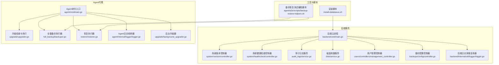
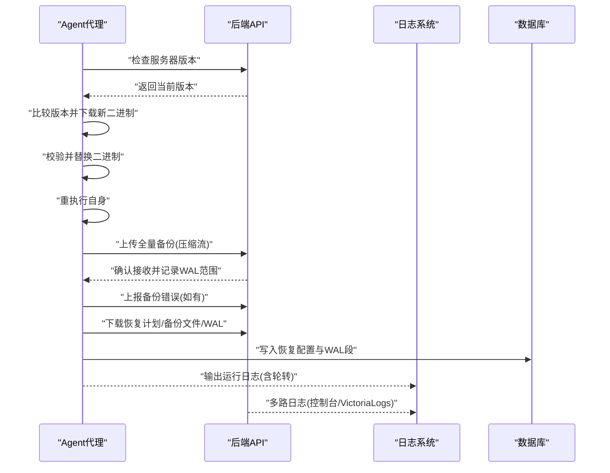
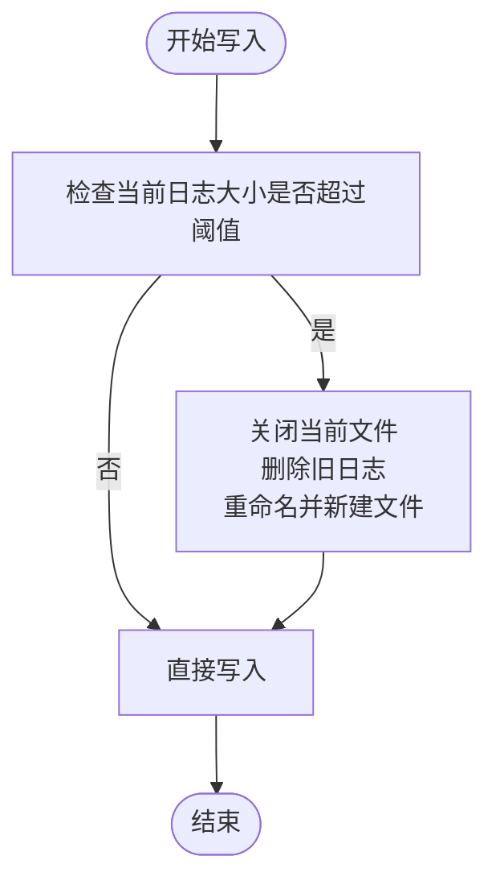
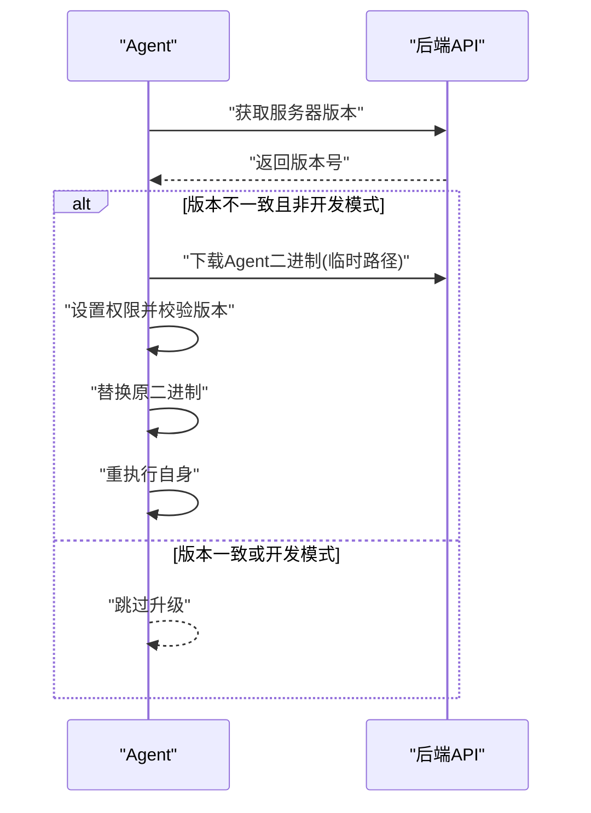
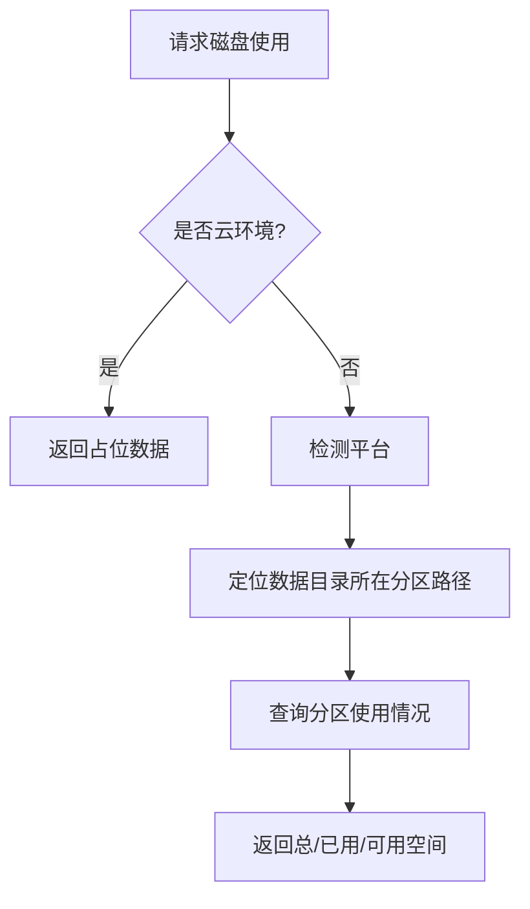
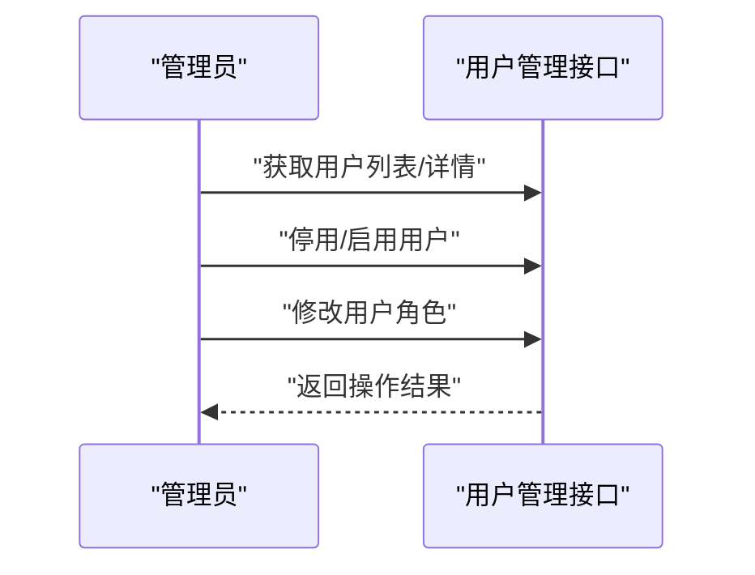
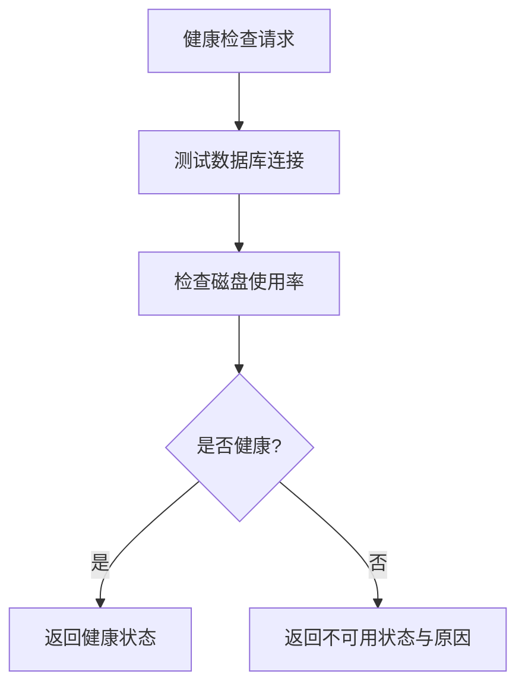
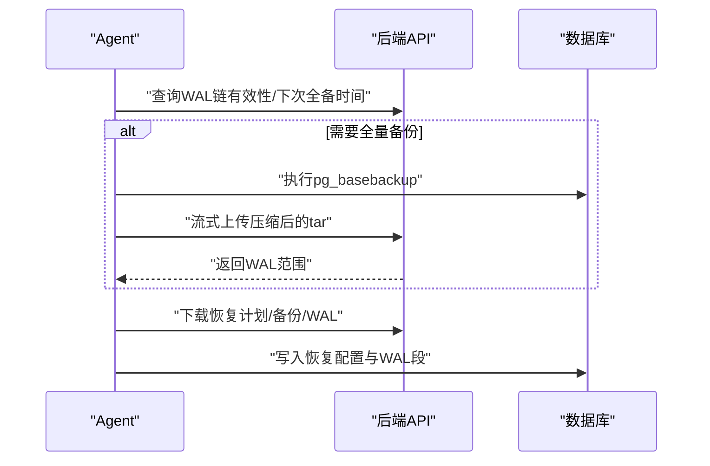
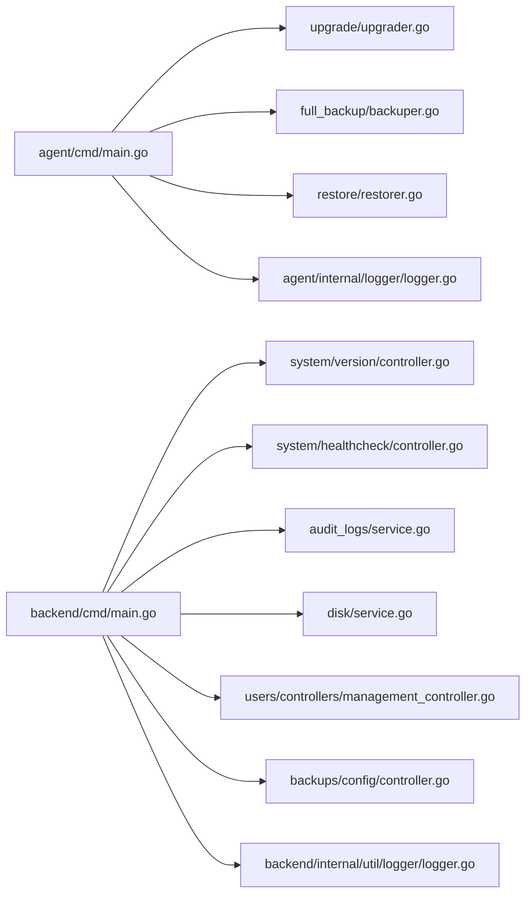

# 日常运维

<cite>
**本文引用的文件**
- [README.md](file://README.md)
- [agent/cmd/main.go](file://agent/cmd/main.go)
- [agent/internal/logger/logger.go](file://agent/internal/logger/logger.go)
- [agent/internal/features/full_backup/backuper.go](file://agent/internal/features/full_backup/backuper.go)
- [agent/internal/features/restore/restorer.go](file://agent/internal/features/restore/restorer.go)
- [agent/internal/features/upgrade/upgrader.go](file://agent/internal/features/upgrade/upgrader.go)
- [agent/internal/features/upgrade/background_upgrader.go](file://agent/internal/features/upgrade/background_upgrader.go)
- [backend/internal/util/logger/logger.go](file://backend/internal/util/logger/logger.go)
- [backend/internal/features/audit_logs/service.go](file://backend/internal/features/audit_logs/service.go)
- [backend/internal/features/users/controllers/management_controller.go](file://backend/internal/features/users/controllers/management_controller.go)
- [backend/internal/features/disk/service.go](file://backend/internal/features/disk/service.go)
- [backend/internal/features/system/version/controller.go](file://backend/internal/features/system/version/controller.go)
- [backend/internal/features/system/healthcheck/controller.go](file://backend/internal/features/system/healthcheck/controller.go)
- [backend/internal/features/telemetry/background_service.go](file://backend/internal/features/telemetry/background_service.go)
- [backend/internal/features/backups/config/controller.go](file://backend/internal/features/backups/config/controller.go)
- [install-databasus.sh](file://install-databasus.sh)
- [agent/e2e/scripts/backup-restore-helpers.sh](file://agent/e2e/scripts/backup-restore-helpers.sh)
</cite>

## 目录
1. [简介](#简介)
2. [项目结构](#项目结构)
3. [核心组件](#核心组件)
4. [架构总览](#架构总览)
5. [详细组件分析](#详细组件分析)
6. [依赖关系分析](#依赖关系分析)
7. [性能考量](#性能考量)
8. [故障排查指南](#故障排查指南)
9. [结论](#结论)
10. [附录](#附录)

## 简介
本指南面向Databasus日常运维场景，围绕以下目标展开：日志管理（轮转、分析、错误追踪）、更新升级流程（版本检查、升级准备、回滚策略）、容量规划（存储使用监控、备份空间管理、扩容决策）、用户管理（添加、权限变更、账户停用）、系统维护（数据库维护、清理过期数据、优化配置）、运维自动化与批量操作、运维检查清单与应急响应流程。文档基于仓库中实际代码与脚本进行梳理，确保可执行性与可追溯性。

## 项目结构
Databasus由后端服务、前端UI、Agent代理、部署与工具组成。运维相关的关键模块集中在：
- 后端服务：提供系统健康检查、版本查询、审计日志、磁盘使用、备份配置、用户管理等能力
- Agent代理：负责数据库备份、恢复、升级检查与自动重执行
- 工具与脚本：安装脚本、日志轮转、备份恢复辅助脚本

图表来源
- [agent/cmd/main.go:1-246](file://agent/cmd/main.go#L1-L246)
- [agent/internal/features/upgrade/upgrader.go:1-90](file://agent/internal/features/upgrade/upgrader.go#L1-L90)
- [agent/internal/features/full_backup/backuper.go:1-317](file://agent/internal/features/full_backup/backuper.go#L1-L317)
- [agent/internal/features/restore/restorer.go:1-445](file://agent/internal/features/restore/restorer.go#L1-L445)
- [agent/internal/logger/logger.go:1-116](file://agent/internal/logger/logger.go#L1-L116)
- [agent/internal/features/upgrade/background_upgrader.go:1-89](file://agent/internal/features/upgrade/background_upgrader.go#L1-L89)
- [backend/internal/util/logger/logger.go:1-131](file://backend/internal/util/logger/logger.go#L1-L131)
- [backend/internal/features/system/version/controller.go:1-39](file://backend/internal/features/system/version/controller.go#L1-L39)
- [backend/internal/features/system/healthcheck/controller.go:1-52](file://backend/internal/features/system/healthcheck/controller.go#L1-L52)
- [backend/internal/features/audit_logs/service.go:1-153](file://backend/internal/features/audit_logs/service.go#L1-L153)
- [backend/internal/features/disk/service.go:1-58](file://backend/internal/features/disk/service.go#L1-L58)
- [backend/internal/features/users/controllers/management_controller.go:1-261](file://backend/internal/features/users/controllers/management_controller.go#L1-L261)
- [backend/internal/features/backups/config/controller.go:1-210](file://backend/internal/features/backups/config/controller.go#L1-L210)
- [install-databasus.sh:1-141](file://install-databasus.sh#L1-L141)
- [agent/e2e/scripts/backup-restore-helpers.sh:1-358](file://agent/e2e/scripts/backup-restore-helpers.sh#L1-L358)

章节来源
- [README.md:1-310](file://README.md#L1-L310)
- [agent/cmd/main.go:1-246](file://agent/cmd/main.go#L1-L246)
- [backend/internal/features/system/version/controller.go:1-39](file://backend/internal/features/system/version/controller.go#L1-L39)
- [backend/internal/features/system/healthcheck/controller.go:1-52](file://backend/internal/features/system/healthcheck/controller.go#L1-L52)
- [backend/internal/features/audit_logs/service.go:1-153](file://backend/internal/features/audit_logs/service.go#L1-L153)
- [backend/internal/features/disk/service.go:1-58](file://backend/internal/features/disk/service.go#L1-L58)
- [backend/internal/features/users/controllers/management_controller.go:1-261](file://backend/internal/features/users/controllers/management_controller.go#L1-L261)
- [backend/internal/features/backups/config/controller.go:1-210](file://backend/internal/features/backups/config/controller.go#L1-L210)
- [agent/internal/logger/logger.go:1-116](file://agent/internal/logger/logger.go#L1-L116)
- [backend/internal/util/logger/logger.go:1-131](file://backend/internal/util/logger/logger.go#L1-L131)
- [agent/internal/features/upgrade/upgrader.go:1-90](file://agent/internal/features/upgrade/upgrader.go#L1-L90)
- [agent/internal/features/upgrade/background_upgrader.go:1-89](file://agent/internal/features/upgrade/background_upgrader.go#L1-L89)
- [agent/internal/features/full_backup/backuper.go:1-317](file://agent/internal/features/full_backup/backuper.go#L1-L317)
- [agent/internal/features/restore/restorer.go:1-445](file://agent/internal/features/restore/restorer.go#L1-L445)
- [install-databasus.sh:1-141](file://install-databasus.sh#L1-L141)
- [agent/e2e/scripts/backup-restore-helpers.sh:1-358](file://agent/e2e/scripts/backup-restore-helpers.sh#L1-L358)

## 核心组件
- 日志管理
  - Agent侧：内置日志轮转器，按固定大小滚动，保留旧日志文件，同时输出到标准输出
  - 后端侧：多路日志处理器，支持标准输出与VictoriaLogs写入，支持从环境变量加载配置
- 更新升级
  - Agent启动时检查服务器版本；支持后台定时检查；升级后自动重执行
- 容量规划
  - 提供磁盘使用查询接口，区分容器与主机平台路径
- 用户管理
  - 提供用户列表、详情、启用/停用、角色变更等管理接口
- 系统维护
  - 健康检查接口、版本查询接口、审计日志清理（一年前）
- 备份与恢复
  - 全量备份执行器与恢复执行器，支持压缩流式上传/下载、WAL段恢复、PITR目标时间恢复
- 运维自动化
  - 安装脚本一键部署；E2E辅助脚本用于本地初始化、备份触发、恢复验证

章节来源
- [agent/internal/logger/logger.go:1-116](file://agent/internal/logger/logger.go#L1-L116)
- [backend/internal/util/logger/logger.go:1-131](file://backend/internal/util/logger/logger.go#L1-L131)
- [agent/internal/features/upgrade/upgrader.go:1-90](file://agent/internal/features/upgrade/upgrader.go#L1-L90)
- [agent/internal/features/upgrade/background_upgrader.go:1-89](file://agent/internal/features/upgrade/background_upgrader.go#L1-L89)
- [backend/internal/features/disk/service.go:1-58](file://backend/internal/features/disk/service.go#L1-L58)
- [backend/internal/features/users/controllers/management_controller.go:1-261](file://backend/internal/features/users/controllers/management_controller.go#L1-L261)
- [backend/internal/features/system/healthcheck/controller.go:1-52](file://backend/internal/features/system/healthcheck/controller.go#L1-L52)
- [backend/internal/features/system/version/controller.go:1-39](file://backend/internal/features/system/version/controller.go#L1-L39)
- [backend/internal/features/audit_logs/service.go:1-153](file://backend/internal/features/audit_logs/service.go#L1-L153)
- [agent/internal/features/full_backup/backuper.go:1-317](file://agent/internal/features/full_backup/backuper.go#L1-L317)
- [agent/internal/features/restore/restorer.go:1-445](file://agent/internal/features/restore/restorer.go#L1-L445)
- [install-databasus.sh:1-141](file://install-databasus.sh#L1-L141)
- [agent/e2e/scripts/backup-restore-helpers.sh:1-358](file://agent/e2e/scripts/backup-restore-helpers.sh#L1-L358)

## 架构总览
下图展示运维相关的关键交互：Agent通过API与后端通信，完成升级检查、备份上传、恢复下载；后端提供健康检查、版本查询、审计日志、磁盘监控等能力；日志通过多路复用器输出至控制台或外部日志系统。

图表来源
- [agent/cmd/main.go:173-193](file://agent/cmd/main.go#L173-L193)
- [agent/internal/features/upgrade/upgrader.go:18-73](file://agent/internal/features/upgrade/upgrader.go#L18-L73)
- [agent/internal/features/full_backup/backuper.go:164-244](file://agent/internal/features/full_backup/backuper.go#L164-L244)
- [agent/internal/features/restore/restorer.go:58-102](file://agent/internal/features/restore/restorer.go#L58-L102)
- [backend/internal/util/logger/logger.go:19-49](file://backend/internal/util/logger/logger.go#L19-L49)

## 详细组件分析

### 日志管理与轮转
- Agent日志轮转
  - 固定阈值滚动：达到阈值关闭当前日志文件，重命名为旧日志，重新打开新文件
  - 并行安全：内部互斥锁保护写入与滚动
  - 输出合并：同时输出到标准输出与轮转文件
- 后端日志多路复用
  - 标准输出处理器与可选VictoriaLogs处理器组合
  - 支持从工作目录或后端根目录加载.env，读取VictoriaLogs连接参数
  - 提供优雅关闭逻辑，避免日志丢失

图表来源
- [agent/internal/logger/logger.go:27-65](file://agent/internal/logger/logger.go#L27-L65)

章节来源
- [agent/internal/logger/logger.go:1-116](file://agent/internal/logger/logger.go#L1-L116)
- [backend/internal/util/logger/logger.go:1-131](file://backend/internal/util/logger/logger.go#L1-L131)

### 更新升级流程
- 版本检查
  - 启动时调用服务器版本接口，若不同则下载新二进制
  - 开发模式跳过检查
- 升级准备
  - 下载到临时路径，设置可执行权限，执行二进制“version”校验
- 升级执行与回滚
  - 成功校验后替换原二进制
  - 升级后自动重执行；失败保持原版本不变
- 后台升级
  - 定时轮询检查，发现新版本后立即执行并通知退出

图表来源
- [agent/internal/features/upgrade/upgrader.go:18-73](file://agent/internal/features/upgrade/upgrader.go#L18-L73)
- [agent/internal/features/upgrade/background_upgrader.go:42-88](file://agent/internal/features/upgrade/background_upgrader.go#L42-L88)
- [agent/cmd/main.go:173-193](file://agent/cmd/main.go#L173-L193)

章节来源
- [agent/internal/features/upgrade/upgrader.go:1-90](file://agent/internal/features/upgrade/upgrader.go#L1-L90)
- [agent/internal/features/upgrade/background_upgrader.go:1-89](file://agent/internal/features/upgrade/background_upgrader.go#L1-L89)
- [agent/cmd/main.go:1-246](file://agent/cmd/main.go#L1-L246)

### 容量规划与存储监控
- 磁盘使用查询
  - 云环境返回占位数据
  - 主机环境根据平台选择根路径或数据目录所在分区
  - 返回总空间、已用空间、可用空间
- 备份空间管理
  - 备份配置控制器提供存储使用情况查询与计数接口，便于评估容量占用
- 扩容决策
  - 结合磁盘使用率与备份增长趋势，制定扩容窗口与迁移策略

图表来源
- [backend/internal/features/disk/service.go:15-48](file://backend/internal/features/disk/service.go#L15-L48)
- [backend/internal/features/backups/config/controller.go:95-159](file://backend/internal/features/backups/config/controller.go#L95-L159)

章节来源
- [backend/internal/features/disk/service.go:1-58](file://backend/internal/features/disk/service.go#L1-L58)
- [backend/internal/features/backups/config/controller.go:1-210](file://backend/internal/features/backups/config/controller.go#L1-L210)

### 用户管理操作
- 用户列表与详情
  - 管理员可查看所有用户；普通用户仅能查看自身
- 账户启停
  - 管理员可对任意用户执行启用/停用
- 权限变更
  - 管理员可修改用户角色
- 审计与合规
  - 审计日志服务支持全局、用户、工作区维度查询，并定期清理一年前日志

图表来源
- [backend/internal/features/users/controllers/management_controller.go:20-38](file://backend/internal/features/users/controllers/management_controller.go#L20-L38)
- [backend/internal/features/users/controllers/management_controller.go:165-218](file://backend/internal/features/users/controllers/management_controller.go#L165-L218)
- [backend/internal/features/users/controllers/management_controller.go:234-260](file://backend/internal/features/users/controllers/management_controller.go#L234-L260)
- [backend/internal/features/audit_logs/service.go:41-72](file://backend/internal/features/audit_logs/service.go#L41-L72)

章节来源
- [backend/internal/features/users/controllers/management_controller.go:1-261](file://backend/internal/features/users/controllers/management_controller.go#L1-L261)
- [backend/internal/features/audit_logs/service.go:1-153](file://backend/internal/features/audit_logs/service.go#L1-L153)

### 系统维护与健康检查
- 健康检查
  - 测试数据库连接与磁盘使用率，返回健康状态或服务不可用
- 版本查询
  - 读取环境变量APP_VERSION，未设置时返回默认版本
- 审计日志清理
  - 自动删除一年前的审计日志，降低存储压力

图表来源
- [backend/internal/features/system/healthcheck/controller.go:25-51](file://backend/internal/features/system/healthcheck/controller.go#L25-L51)
- [backend/internal/features/system/version/controller.go:29-38](file://backend/internal/features/system/version/controller.go#L29-L38)
- [backend/internal/features/audit_logs/service.go:138-152](file://backend/internal/features/audit_logs/service.go#L138-L152)

章节来源
- [backend/internal/features/system/healthcheck/controller.go:1-52](file://backend/internal/features/system/healthcheck/controller.go#L1-L52)
- [backend/internal/features/system/version/controller.go:1-39](file://backend/internal/features/system/version/controller.go#L1-L39)
- [backend/internal/features/audit_logs/service.go:1-153](file://backend/internal/features/audit_logs/service.go#L1-L153)

### 备份与恢复执行
- 全量备份
  - 定时检查WAL链有效性与下次全备时间，必要时执行pg_basebackup并通过管道zstd压缩后直传
  - 超时与空闲超时控制，失败上报并重试
- 恢复
  - 下载basebackup与WAL段，解压写入PGDATA，生成recovery配置，支持PITR目标时间
  - 提供Docker与主机两种恢复后的启动指引

图表来源
- [agent/internal/features/full_backup/backuper.go:85-162](file://agent/internal/features/full_backup/backuper.go#L85-L162)
- [agent/internal/features/full_backup/backuper.go:164-244](file://agent/internal/features/full_backup/backuper.go#L164-L244)
- [agent/internal/features/restore/restorer.go:58-102](file://agent/internal/features/restore/restorer.go#L58-L102)
- [agent/internal/features/restore/restorer.go:245-327](file://agent/internal/features/restore/restorer.go#L245-L327)

章节来源
- [agent/internal/features/full_backup/backuper.go:1-317](file://agent/internal/features/full_backup/backuper.go#L1-L317)
- [agent/internal/features/restore/restorer.go:1-445](file://agent/internal/features/restore/restorer.go#L1-L445)

### 运维自动化与批量操作
- 安装脚本
  - 自动检测并安装Docker与Compose，生成docker-compose.yml并启动服务
- E2E辅助脚本
  - 初始化PostgreSQL、生成WAL、启动Agent、等待备份完成、停止Agent与数据库、执行恢复与验证
  - 提供查找PostgreSQL二进制目录、清理Agent残留等通用函数

章节来源
- [install-databasus.sh:1-141](file://install-databasus.sh#L1-L141)
- [agent/e2e/scripts/backup-restore-helpers.sh:1-358](file://agent/e2e/scripts/backup-restore-helpers.sh#L1-L358)

## 依赖关系分析
- 组件耦合
  - Agent通过API客户端与后端交互，升级与备份均依赖API；日志模块独立但可被多组件复用
  - 后端控制器依赖服务层，服务层再依赖仓储与模型
- 外部依赖
  - Docker/Compose用于部署
  - PostgreSQL客户端工具用于备份与恢复
  - VictoriaLogs用于后端日志远传

图表来源
- [agent/cmd/main.go:1-246](file://agent/cmd/main.go#L1-L246)
- [agent/internal/features/upgrade/upgrader.go:1-90](file://agent/internal/features/upgrade/upgrader.go#L1-L90)
- [agent/internal/features/full_backup/backuper.go:1-317](file://agent/internal/features/full_backup/backuper.go#L1-L317)
- [agent/internal/features/restore/restorer.go:1-445](file://agent/internal/features/restore/restorer.go#L1-L445)
- [agent/internal/logger/logger.go:1-116](file://agent/internal/logger/logger.go#L1-L116)
- [backend/internal/features/system/version/controller.go:1-39](file://backend/internal/features/system/version/controller.go#L1-L39)
- [backend/internal/features/system/healthcheck/controller.go:1-52](file://backend/internal/features/system/healthcheck/controller.go#L1-L52)
- [backend/internal/features/audit_logs/service.go:1-153](file://backend/internal/features/audit_logs/service.go#L1-L153)
- [backend/internal/features/disk/service.go:1-58](file://backend/internal/features/disk/service.go#L1-L58)
- [backend/internal/features/users/controllers/management_controller.go:1-261](file://backend/internal/features/users/controllers/management_controller.go#L1-L261)
- [backend/internal/features/backups/config/controller.go:1-210](file://backend/internal/features/backups/config/controller.go#L1-L210)
- [backend/internal/util/logger/logger.go:1-131](file://backend/internal/util/logger/logger.go#L1-L131)

## 性能考量
- 备份压缩与流式传输
  - 使用zstd压缩，减少网络与存储开销；管道直传避免中间文件
- 超时与重试
  - 上传超时、空闲超时与指数退避重试，提升稳定性
- 日志轮转
  - 控制单文件大小，避免日志膨胀影响IO
- 健康检查
  - 限制磁盘使用阈值，避免在高负载下误报

## 故障排查指南
- 升级失败
  - 检查服务器可达性与版本接口；确认下载的二进制可执行且版本匹配；查看Agent日志中的错误信息
- 备份失败
  - 查看Agent日志中pg_basebackup stderr解析与上传错误；确认数据库连接参数与WAL归档配置
- 恢复异常
  - 检查恢复计划与WAL段下载进度；确认PGDATA为空且权限正确；核对recovery配置
- 日志问题
  - 检查Agent日志轮转文件是否存在与权限；确认后端日志多路复用器是否成功加载.env与VictoriaLogs配置
- 健康检查失败
  - 检查数据库连接与磁盘使用率；确认健康检查接口CORS配置允许跨域访问

章节来源
- [agent/internal/features/upgrade/upgrader.go:18-73](file://agent/internal/features/upgrade/upgrader.go#L18-L73)
- [agent/internal/features/full_backup/backuper.go:164-244](file://agent/internal/features/full_backup/backuper.go#L164-L244)
- [agent/internal/features/restore/restorer.go:58-102](file://agent/internal/features/restore/restorer.go#L58-L102)
- [agent/internal/logger/logger.go:1-116](file://agent/internal/logger/logger.go#L1-L116)
- [backend/internal/util/logger/logger.go:1-131](file://backend/internal/util/logger/logger.go#L1-L131)
- [backend/internal/features/system/healthcheck/controller.go:25-51](file://backend/internal/features/system/healthcheck/controller.go#L25-L51)

## 结论
本指南基于仓库中的实际实现，总结了Databasus在日志管理、更新升级、容量规划、用户管理、系统维护、自动化与批量操作等方面的运维要点。建议在生产环境中结合健康检查、审计日志与容量监控，建立定期巡检与演练机制，确保备份恢复与系统稳定。

## 附录
- 运维检查清单
  - 系统健康检查：数据库连接、磁盘使用率、日志轮转状态
  - 版本与升级：Agent与后端版本一致性、升级检查与回滚策略
  - 备份与恢复：全量备份完成度、WAL链有效性、恢复验证
  - 用户与权限：用户启停与角色变更审计、最小权限原则
  - 存储与容量：备份空间统计、保留策略执行、扩容计划
- 应急响应流程
  - 发现异常：快速定位日志与健康检查结果
  - 快速处置：回滚升级、修复配置、扩容存储
  - 复盘总结：审计日志分析、流程优化与演练