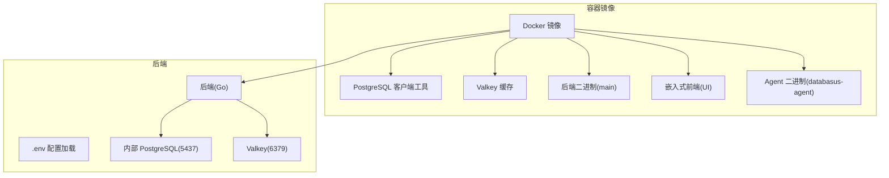
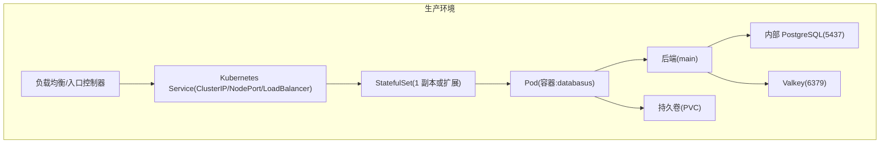
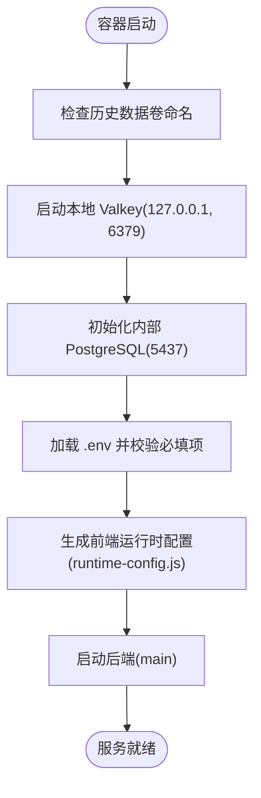
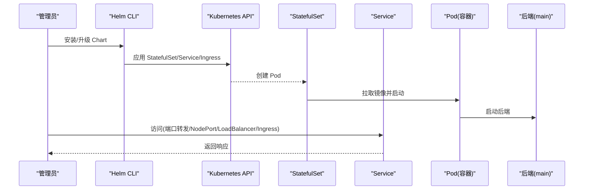
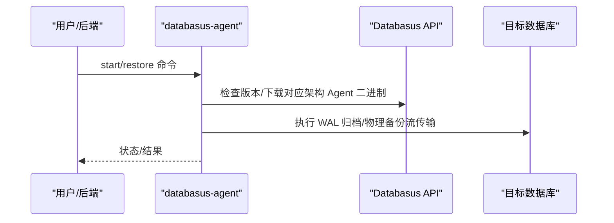
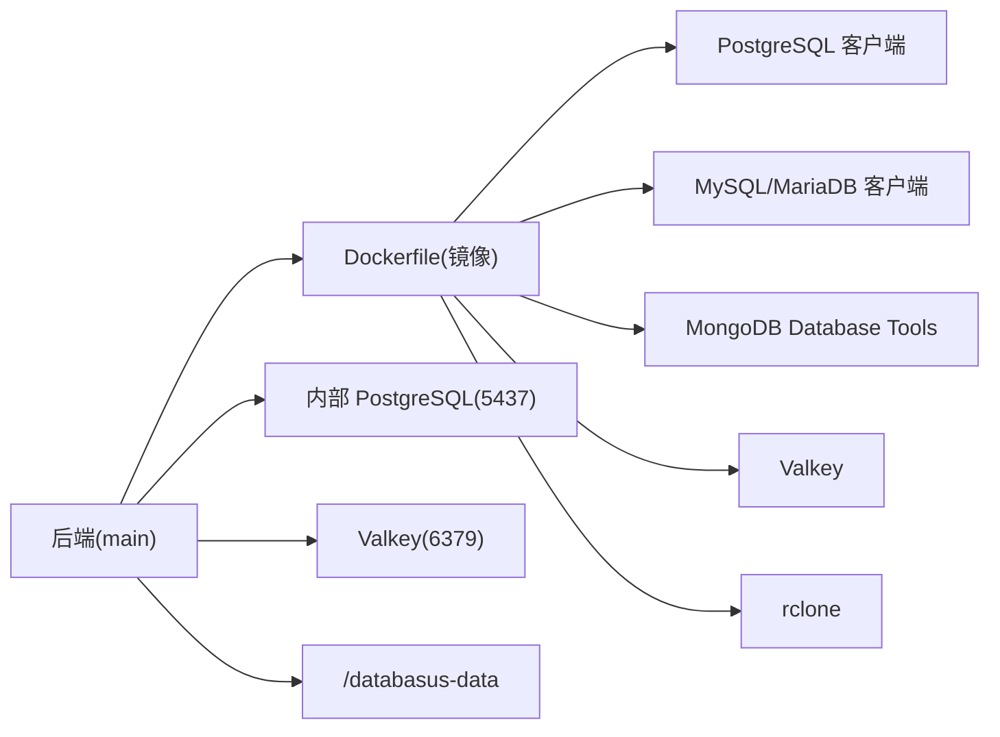

# 生产环境部署

<cite>
**本文引用的文件**
- [README.md](file://README.md)
- [Dockerfile](file://Dockerfile)
- [docker-compose.yml.example](file://docker-compose.yml.example)
- [install-databasus.sh](file://install-databasus.sh)
- [backend/internal/config/config.go](file://backend/internal/config/config.go)
- [backend/.env.production.example](file://backend/.env.production.example)
- [deploy/helm/Chart.yaml](file://deploy/helm/Chart.yaml)
- [deploy/helm/values.yaml](file://deploy/helm/values.yaml)
- [deploy/helm/templates/statefulset.yaml](file://deploy/helm/templates/statefulset.yaml)
- [deploy/helm/templates/service.yaml](file://deploy/helm/templates/service.yaml)
- [deploy/helm/templates/ingress.yaml](file://deploy/helm/templates/ingress.yaml)
- [deploy/helm/README.md](file://deploy/helm/README.md)
- [agent/cmd/main.go](file://agent/cmd/main.go)
- [backend/internal/features/system/version/controller.go](file://backend/internal/features/system/version/controller.go)
</cite>

## 目录
1. [简介](#简介)
2. [项目结构](#项目结构)
3. [核心组件](#核心组件)
4. [架构总览](#架构总览)
5. [详细组件分析](#详细组件分析)
6. [依赖关系分析](#依赖关系分析)
7. [性能与资源规划](#性能与资源规划)
8. [网络与安全配置](#网络与安全配置)
9. [部署步骤](#部署步骤)
10. [配置文件详解与参数调优](#配置文件详解与参数调优)
11. [高可用与负载均衡](#高可用与负载均衡)
12. [部署验证与故障排除](#部署验证与故障排除)
13. [结论](#结论)

## 简介
本指南面向生产环境，提供 Databasus 的硬件要求、Docker 单机部署与 Kubernetes 集群部署方案、网络与安全配置、完整部署步骤、配置文件详解与参数调优建议，以及高可用与负载均衡策略、部署验证与故障排除方法。Databasus 是一款自托管数据库备份与管理工具，支持 PostgreSQL、MySQL、MariaDB、MongoDB，并提供多种存储与通知能力。

## 项目结构
Databasus 采用多模块结构：后端（Go）、前端（React/Vite）、代理（Go Agent）、部署脚本与 Helm Chart。容器镜像内嵌前端构建产物，并预装 PostgreSQL 客户端工具与 Valkey 缓存，便于直接运行。

图表来源
- [Dockerfile:107-275](file://Dockerfile#L107-L275)
- [backend/internal/config/config.go:25-41](file://backend/internal/config/config.go#L25-L41)

章节来源
- [Dockerfile:107-275](file://Dockerfile#L107-L275)
- [backend/internal/config/config.go:25-41](file://backend/internal/config/config.go#L25-L41)

## 核心组件
- 后端服务：提供 Web API、任务调度、备份/恢复、通知、审计日志等能力；通过 .env 加载运行时配置。
- 内部数据库：使用 PostgreSQL 作为应用元数据存储，默认监听 5437 端口，数据目录位于 /databasus-data/pgdata。
- 内部缓存：Valkey 提供本地缓存与会话存储，仅绑定 127.0.0.1 并限制内存。
- 前端：构建产物嵌入至镜像，运行时注入前端运行时配置。
- 代理 Agent：用于 WAL 归档与物理备份流传输，支持主机与容器两种模式。

章节来源
- [Dockerfile:386-533](file://Dockerfile#L386-L533)
- [backend/internal/config/config.go:25-41](file://backend/internal/config/config.go#L25-L41)
- [agent/cmd/main.go:30-48](file://agent/cmd/main.go#L30-L48)

## 架构总览
Databasus 在容器内同时运行后端、内部 PostgreSQL 与 Valkey，对外暴露 4005 端口。生产部署可选择 Docker 单机或 Kubernetes（Helm）集群部署，结合 Ingress/LoadBalancer/NodePort 实现外部访问。

图表来源
- [deploy/helm/templates/service.yaml:12-21](file://deploy/helm/templates/service.yaml#L12-L21)
- [deploy/helm/templates/statefulset.yaml:8-25](file://deploy/helm/templates/statefulset.yaml#L8-L25)
- [deploy/helm/values.yaml:18-26](file://deploy/helm/values.yaml#L18-L26)

## 详细组件分析

### 组件A：后端配置加载与运行时变量
后端通过 .env 文件加载运行时配置，支持数据库连接、Valkey 连接、SMTP、OAuth、Turnstile、计费等参数。镜像启动脚本会生成前端运行时配置并初始化内部数据库与缓存。

图表来源
- [Dockerfile:277-533](file://Dockerfile#L277-L533)
- [backend/internal/config/config.go:157-204](file://backend/internal/config/config.go#L157-L204)

章节来源
- [backend/internal/config/config.go:157-204](file://backend/internal/config/config.go#L157-L204)
- [Dockerfile:277-533](file://Dockerfile#L277-L533)

### 组件B：Kubernetes 部署（Helm）
Helm Chart 默认创建 StatefulSet 与 Service，支持 ClusterIP/NodePort/LoadBalancer/Ingress/HTTPRoute 多种接入方式；默认副本数为 1，可通过 values.yaml 调整资源、存储与探针。

图表来源
- [deploy/helm/templates/statefulset.yaml:8-25](file://deploy/helm/templates/statefulset.yaml#L8-L25)
- [deploy/helm/templates/service.yaml:12-21](file://deploy/helm/templates/service.yaml#L12-L21)
- [deploy/helm/README.md:7-24](file://deploy/helm/README.md#L7-L24)

章节来源
- [deploy/helm/values.yaml:11-107](file://deploy/helm/values.yaml#L11-L107)
- [deploy/helm/templates/statefulset.yaml:8-25](file://deploy/helm/templates/statefulset.yaml#L8-L25)
- [deploy/helm/templates/service.yaml:12-21](file://deploy/helm/templates/service.yaml#L12-L21)
- [deploy/helm/README.md:7-24](file://deploy/helm/README.md#L7-L24)

### 组件C：Agent 工作流程
Agent 支持 start、stop、status、restore、version 等命令；在 start 模式下执行 WAL 归档与基础备份流传输；restore 模式支持基于全量备份或 PITR 时间点恢复。

图表来源
- [agent/cmd/main.go:30-48](file://agent/cmd/main.go#L30-L48)
- [agent/cmd/main.go:117-160](file://agent/cmd/main.go#L117-L160)

章节来源
- [agent/cmd/main.go:30-48](file://agent/cmd/main.go#L30-L48)
- [agent/cmd/main.go:117-160](file://agent/cmd/main.go#L117-L160)

## 依赖关系分析
- 容器镜像依赖：PostgreSQL 客户端工具、MySQL/MariaDB 客户端工具、MongoDB Database Tools、Valkey、rclone。
- 后端依赖：内部 PostgreSQL(5437)、Valkey(6379)、/databasus-data 持久化目录。
- Kubernetes 依赖：StorageClass、Ingress/Gateway API 控制器、证书管理（如 cert-manager）。

图表来源
- [Dockerfile:125-240](file://Dockerfile#L125-L240)
- [backend/internal/config/config.go:33-41](file://backend/internal/config/config.go#L33-L41)

章节来源
- [Dockerfile:125-240](file://Dockerfile#L125-L240)
- [backend/internal/config/config.go:33-41](file://backend/internal/config/config.go#L33-L41)

## 性能与资源规划
- CPU 与内存：默认资源请求/限制均为 500m CPU、1Gi 内存，适合中小规模生产；可根据并发任务与数据库体量适当提升。
- 存储：默认 10Gi PVC，建议根据备份保留策略与存储类型（SSD/HDD）评估容量；备份与临时目录位于 /databasus-data 下。
- 数据库与缓存：内部 PostgreSQL 使用共享缓冲区与连接数配置；Valkey 限制为 256MB 内存，满足应用缓存需求。
- 网络吞吐：节点网络吞吐默认按 1Gbps 计算，可按实际网络调整以优化大文件传输性能。

章节来源
- [deploy/helm/values.yaml:27-34](file://deploy/helm/values.yaml#L27-L34)
- [Dockerfile:410-422](file://Dockerfile#L410-L422)
- [Dockerfile:388-395](file://Dockerfile#L388-L395)

## 网络与安全配置
- 端口开放
  - 容器对外暴露 4005/TCP；Kubernetes Service 默认 ClusterIP，可通过 NodePort/LoadBalancer/Ingress 暴露。
  - 内部 PostgreSQL 监听 5437/TCP，仅本地访问；Valkey 监听 6379/TCP，仅本地访问。
- 防火墙设置
  - 生产服务器需放行 4005（或 NodePort/LoadBalancer 对应端口），以及必要的 DNS/HTTPS 出站。
- 域名解析与 TLS
  - 使用 Ingress 时，配置 host 与 TLS secret；推荐配合 cert-manager 自动签发证书。
- 安全配置
  - SMTP 可选配置，用于邮件通知；Databasus URL 用于生成带链接的邮件内容。
  - 云模式（IS_CLOUD）可注入 Turnstile、Paddle 等参数；生产中务必妥善保管密钥。
  - 自定义根 CA：通过 Secret 挂载并设置 SSL_CERT_FILE，信任内部私有 CA。

章节来源
- [deploy/helm/templates/ingress.yaml:13-26](file://deploy/helm/templates/ingress.yaml#L13-L26)
- [deploy/helm/README.md:146-195](file://deploy/helm/README.md#L146-L195)
- [backend/internal/config/config.go:137-146](file://backend/internal/config/config.go#L137-L146)
- [Dockerfile:46-53](file://Dockerfile#L46-L53)

## 部署步骤

### 方案一：Docker 单机部署
- 系统要求
  - Linux（推荐 Ubuntu/Debian），安装 Docker 与 Docker Compose 插件。
- 快速安装脚本（推荐）
  - 以 root 权限运行安装脚本，自动安装 Docker、写入 docker-compose.yml 并启动。
- 手动 Docker 运行
  - 映射 4005 端口，挂载 /databasus-data 持久化目录，设置重启策略。
- 初始访问
  - 浏览器访问 http://localhost:4005，完成初始化与配置。

章节来源
- [install-databasus.sh:44-141](file://install-databasus.sh#L44-L141)
- [README.md:128-161](file://README.md#L128-L161)
- [README.md:142-161](file://README.md#L142-L161)

### 方案二：Kubernetes 集群部署（Helm）
- 安装与访问
  - 直接从 OCI 仓库安装 Chart，默认 ClusterIP，使用 kubectl port-forward 访问。
- 外部访问选项
  - NodePort：设置 service.type=NodePort，指定 port 与 nodePort。
  - LoadBalancer：适用于云厂商负载均衡器，获取外部 IP 后访问。
  - Ingress：配置 host 与 TLS secret，结合 cert-manager 自动签发。
  - HTTPRoute（Gateway API）：适用于 Istio/Envoy Gateway/Cilium 等网关实现。
- 存储与资源
  - 调整 persistence.size、storageClassName 与 resources.requests/limits。
- 升级与卸载
  - 使用 helm upgrade 升级，helm uninstall 卸载。

章节来源
- [deploy/helm/README.md:3-24](file://deploy/helm/README.md#L3-L24)
- [deploy/helm/README.md:87-195](file://deploy/helm/README.md#L87-L195)
- [deploy/helm/values.yaml:35-44](file://deploy/helm/values.yaml#L35-L44)
- [deploy/helm/values.yaml:27-34](file://deploy/helm/values.yaml#L27-L34)

## 配置文件详解与参数调优

### .env 生产示例与关键参数
- 数据库连接
  - DATABASE_DSN/DATABASE_URL：内部 PostgreSQL 连接串（默认 5437 端口）。
- 缓存
  - VALKEY_HOST/PORT/USERNAME/PASSWORD/IS_SSL：Valkey 连接信息。
- 应用模式
  - ENV_MODE=production：生产模式。
- 迁移与驱动
  - GOOSE_DRIVER/GOOSE_DBSTRING/GOOSE_MIGRATION_DIR：迁移相关。
- 其他
  - SMTP_*：邮件通知；DATABASUS_URL：用于生成邮件链接。

章节来源
- [backend/.env.production.example:1-19](file://backend/.env.production.example#L1-L19)
- [backend/internal/config/config.go:137-146](file://backend/internal/config/config.go#L137-L146)

### Kubernetes Helm Values 关键项
- image：镜像仓库与标签、拉取策略。
- replicaCount：副本数量（生产建议至少 1，配合滚动更新）。
- service：Service 类型与端口映射。
- persistence：存储类、大小、访问模式与挂载路径。
- ingress/route：Ingress/HTTPRoute 开启与 TLS 配置。
- resources：CPU/内存请求与限制。
- livenessProbe/readinessProbe：健康检查路径与阈值。

章节来源
- [deploy/helm/values.yaml:3-107](file://deploy/helm/values.yaml#L3-L107)
- [deploy/helm/templates/statefulset.yaml:64-83](file://deploy/helm/templates/statefulset.yaml#L64-L83)

### 参数调优建议
- 资源：根据数据库体量与并发任务增加 requests/limits；避免过度分配导致调度困难。
- 存储：备份增长快时提高 PVC 大小与选择 SSD；开启压缩与分层保留策略减少占用。
- 网络：若跨区域备份/恢复，适当提高 NodeNetworkThroughputMBs 以匹配带宽。
- 缓存：Valkey 默认 256MB 已足够；如启用大量后台任务，可考虑外部独立缓存实例。

章节来源
- [backend/internal/config/config.go:282-284](file://backend/internal/config/config.go#L282-L284)
- [deploy/helm/values.yaml:27-34](file://deploy/helm/values.yaml#L27-L34)

## 高可用与负载均衡
- 副本与更新策略
  - StatefulSet 副本数可设为 1 或更高；滚动更新策略可按分区进行灰度发布。
- 负载均衡
  - NodePort/LoadBalancer/Ingress/HTTPRoute 任选其一；生产建议使用 Ingress + TLS。
- 存储高可用
  - 使用具备高可靠性的 StorageClass；对 /databasus-data 建议使用多副本或快照策略。
- 数据库与缓存
  - 内部 PostgreSQL/Valkey 为单实例；生产建议将数据库与缓存迁移到外部高可用实例，并通过环境变量覆盖。

章节来源
- [deploy/helm/templates/statefulset.yaml:94-106](file://deploy/helm/templates/statefulset.yaml#L94-L106)
- [deploy/helm/README.md:87-195](file://deploy/helm/README.md#L87-L195)
- [Dockerfile:507-531](file://Dockerfile#L507-L531)

## 部署验证与故障排除

### 健康检查
- 应用提供 /api/v1/system/health 探针，Helm Chart 默认启用存活与就绪探针。
- 版本查询：/api/v1/system/version 返回当前应用版本。

章节来源
- [deploy/helm/values.yaml:71-92](file://deploy/helm/values.yaml#L71-L92)
- [backend/internal/features/system/version/controller.go:14-39](file://backend/internal/features/system/version/controller.go#L14-L39)

### 常见问题排查
- PostgreSQL 初始化失败
  - 启动脚本包含 WAL 重置恢复逻辑；若仍失败，检查 /databasus-data 权限与磁盘空间。
- 端口冲突
  - 确认 4005（或 NodePort/LoadBalancer 对应端口）未被占用。
- Ingress/TLS 异常
  - 检查证书 Secret 名称与 hosts 是否匹配；确认 Ingress class 正确。
- 外部数据库/Valkey
  - 如使用 DANGEROUS_EXTERNAL_DATABASE_DSN 或 DANGEROUS_VALKEY_*，确保连通性与凭据正确。

章节来源
- [Dockerfile:446-490](file://Dockerfile#L446-L490)
- [Dockerfile:507-531](file://Dockerfile#L507-L531)
- [deploy/helm/templates/ingress.yaml:13-26](file://deploy/helm/templates/ingress.yaml#L13-L26)

## 结论
Databasus 提供开箱即用的生产部署路径：Docker 单机适合小型环境，Kubernetes（Helm）适合中大型企业环境。通过合理的资源与存储规划、完善的网络与安全配置、以及健康检查与故障排查机制，可在生产环境中稳定运行数据库备份与管理工作。