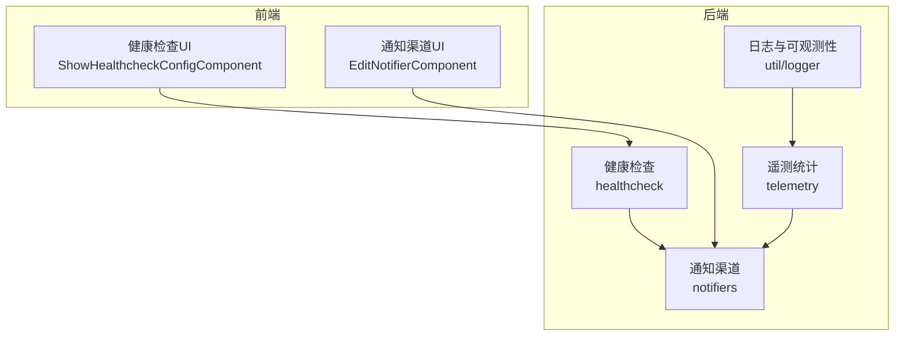
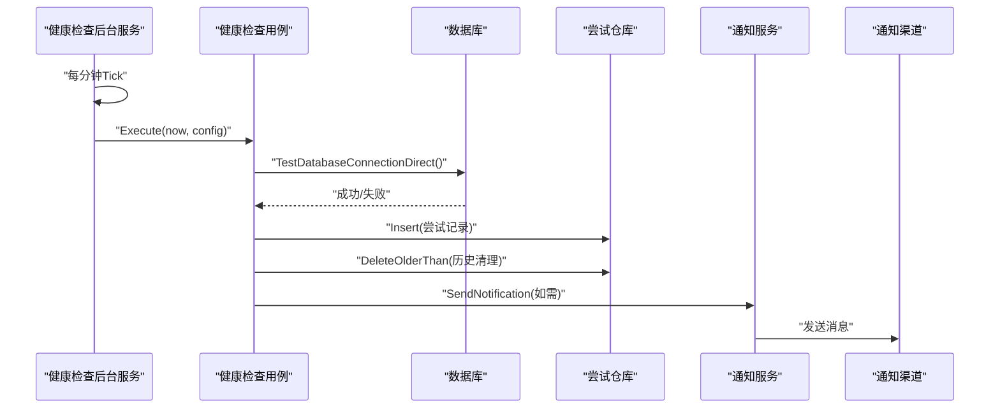
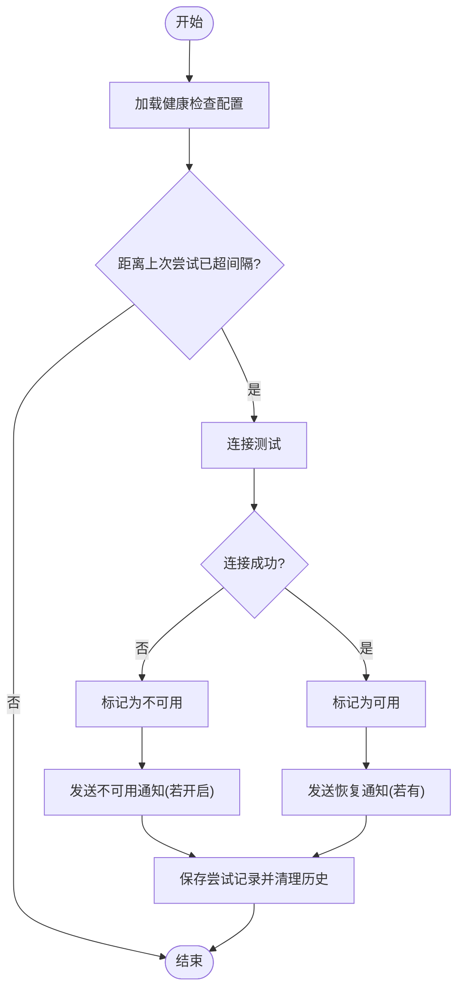
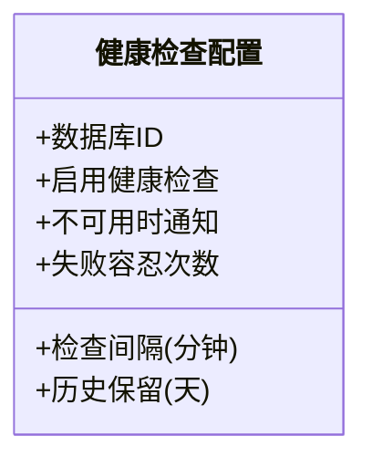
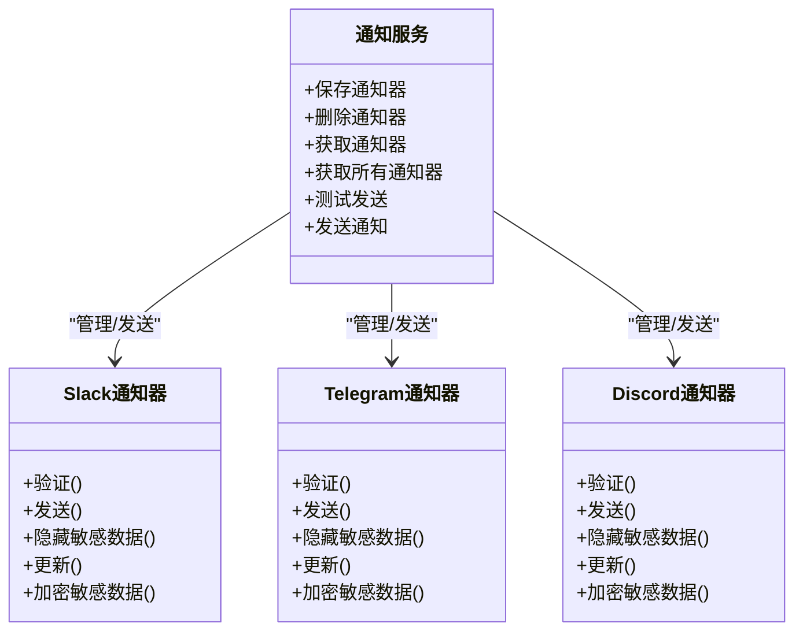
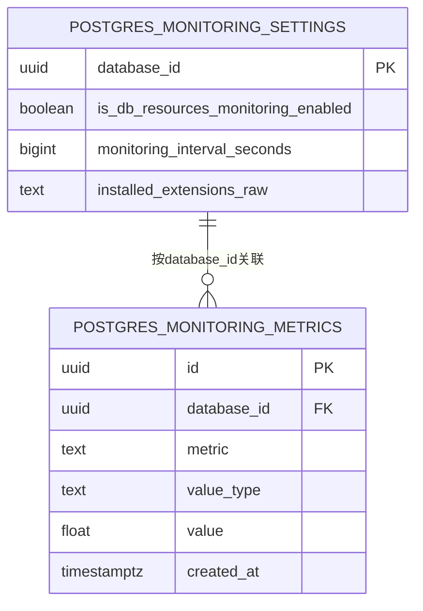
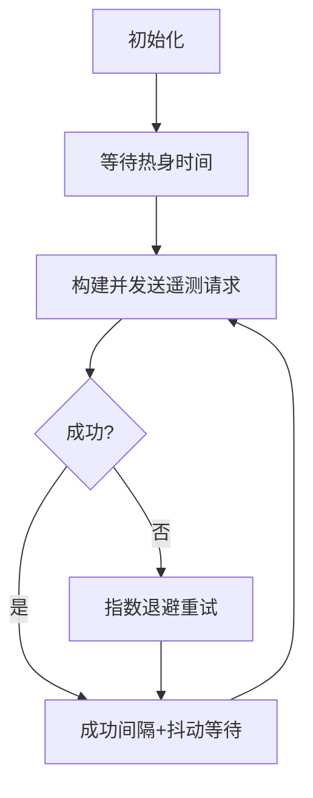
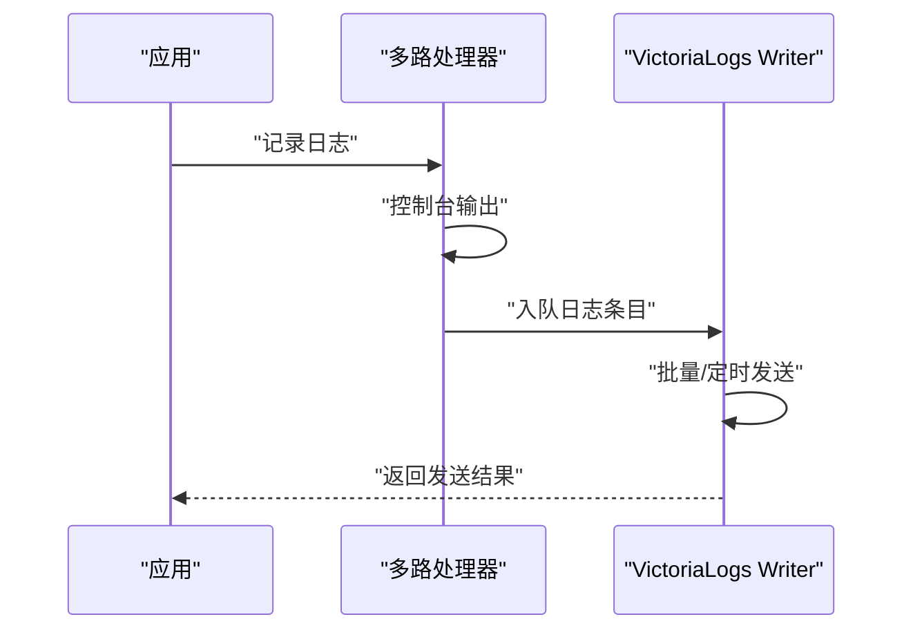
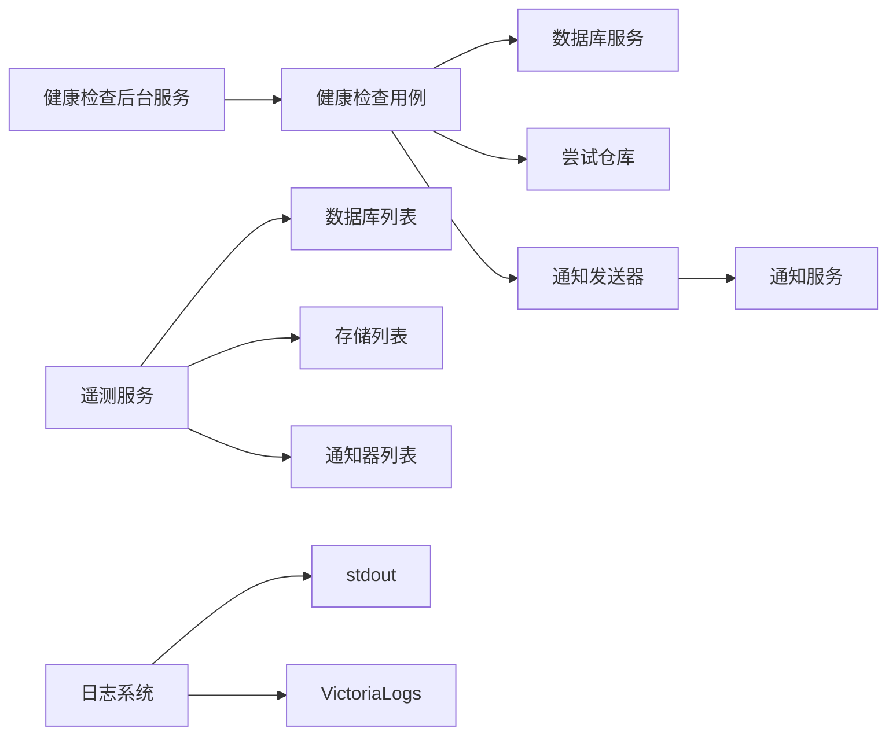

# 监控和告警

<cite>
**本文引用的文件**
- [backend/internal/features/healthcheck/attempt/check_database_health_uc.go](file://backend/internal/features/healthcheck/attempt/check_database_health_uc.go)
- [backend/internal/features/healthcheck/attempt/background_service.go](file://backend/internal/features/healthcheck/attempt/background_service.go)
- [backend/internal/features/healthcheck/config/model.go](file://backend/internal/features/healthcheck/config/model.go)
- [backend/internal/features/telemetry/service.go](file://backend/internal/features/telemetry/service.go)
- [backend/internal/features/telemetry/background_service.go](file://backend/internal/features/telemetry/background_service.go)
- [backend/migrations/20250704095930_add_healthckeck.sql](file://backend/migrations/20250704095930_add_healthckeck.sql)
- [backend/migrations/20250912092352_add_monitoring_metrics.sql](file://backend/migrations/20250912092352_add_monitoring_metrics.sql)
- [backend/internal/features/notifiers/service.go](file://backend/internal/features/notifiers/service.go)
- [backend/internal/features/notifiers/enums.go](file://backend/internal/features/notifiers/enums.go)
- [backend/internal/features/notifiers/models/slack/model.go](file://backend/internal/features/notifiers/models/slack/model.go)
- [backend/internal/features/notifiers/models/telegram/model.go](file://backend/internal/features/notifiers/models/telegram/model.go)
- [backend/internal/features/notifiers/models/discord/model.go](file://backend/internal/features/notifiers/models/discord/model.go)
- [backend/internal/util/logger/logger.go](file://backend/internal/util/logger/logger.go)
- [backend/internal/util/logger/multi_handler.go](file://backend/internal/util/logger/multi_handler.go)
- [backend/internal/util/logger/victorialogs_writer.go](file://backend/internal/util/logger/victorialogs_writer.go)
- [frontend/src/features/healthcheck/ui/ShowHealthcheckConfigComponent.tsx](file://frontend/src/features/healthcheck/ui/ShowHealthcheckConfigComponent.tsx)
- [frontend/src/entity/healthcheck/model/HealthcheckConfig.ts](file://frontend/src/entity/healthcheck/model/HealthcheckConfig.ts)
- [frontend/src/features/notifiers/ui/edit/EditNotifierComponent.tsx](file://frontend/src/features/notifiers/ui/edit/EditNotifierComponent.tsx)
- [frontend/src/entity/notifiers/models/NotifierType.ts](file://frontend/src/entity/notifiers/models/NotifierType.ts)
</cite>

## 目录
1. [简介](#简介)
2. [项目结构](#项目结构)
3. [核心组件](#核心组件)
4. [架构总览](#架构总览)
5. [组件详解](#组件详解)
6. [依赖关系分析](#依赖关系分析)
7. [性能考量](#性能考量)
8. [故障排查指南](#故障排查指南)
9. [结论](#结论)
10. [附录](#附录)

## 简介
本指南面向Databasus监控与告警系统，覆盖以下方面：
- 健康检查机制：数据库连接检查、服务可用性检查、代理状态监控
- 性能指标采集：CPU使用率、内存占用、磁盘I/O、网络流量（以PostgreSQL扩展与指标表为核心）
- 告警规则配置：阈值设置、告警级别、通知渠道
- Prometheus集成与Grafana仪表板：指标导出与可视化建议
- 日志聚合与分析：结构化日志、错误追踪、性能分析
- 最佳实践与常见问题排查

## 项目结构
后端采用分层与特性模块化组织，监控与告警相关代码主要集中在以下位置：
- 健康检查：backend/internal/features/healthcheck
- 遥测与统计：backend/internal/features/telemetry
- 通知渠道：backend/internal/features/notifiers
- 日志与可观测性：backend/internal/util/logger
- 前端配置与展示：frontend/src/features/healthcheck、frontend/src/features/notifiers

**图表来源**
- [backend/internal/features/healthcheck/attempt/check_database_health_uc.go:1-256](file://backend/internal/features/healthcheck/attempt/check_database_health_uc.go#L1-L256)
- [backend/internal/features/telemetry/service.go:1-253](file://backend/internal/features/telemetry/service.go#L1-L253)
- [backend/internal/features/notifiers/service.go:1-396](file://backend/internal/features/notifiers/service.go#L1-L396)
- [backend/internal/util/logger/logger.go:1-131](file://backend/internal/util/logger/logger.go#L1-L131)
- [frontend/src/features/healthcheck/ui/ShowHealthcheckConfigComponent.tsx:45-74](file://frontend/src/features/healthcheck/ui/ShowHealthcheckConfigComponent.tsx#L45-L74)
- [frontend/src/features/notifiers/ui/edit/EditNotifierComponent.tsx:80-134](file://frontend/src/features/notifiers/ui/edit/EditNotifierComponent.tsx#L80-L134)

**章节来源**
- [backend/internal/features/healthcheck/attempt/check_database_health_uc.go:1-256](file://backend/internal/features/healthcheck/attempt/check_database_health_uc.go#L1-L256)
- [backend/internal/features/telemetry/service.go:1-253](file://backend/internal/features/telemetry/service.go#L1-L253)
- [backend/internal/features/notifiers/service.go:1-396](file://backend/internal/features/notifiers/service.go#L1-L396)
- [backend/internal/util/logger/logger.go:1-131](file://backend/internal/util/logger/logger.go#L1-L131)
- [frontend/src/features/healthcheck/ui/ShowHealthcheckConfigComponent.tsx:45-74](file://frontend/src/features/healthcheck/ui/ShowHealthcheckConfigComponent.tsx#L45-L74)
- [frontend/src/features/notifiers/ui/edit/EditNotifierComponent.tsx:80-134](file://frontend/src/features/notifiers/ui/edit/EditNotifierComponent.tsx#L80-L134)

## 核心组件
- 健康检查用例：执行数据库连接测试、记录尝试、更新健康状态、触发通知
- 健康检查后台服务：周期性扫描启用健康检查的数据库并调度检查
- 健康检查配置模型：包含开关、通知策略、检查间隔、失败容忍次数、历史保留天数
- 遥测服务：汇总实例、数据库、存储与通知类型信息并上报
- 通知服务：统一管理多种通知渠道（邮件、Slack、Telegram、Discord、Webhook），支持加密与测试
- 日志与可观测性：多路输出（控制台+VictoriaLogs），支持批量异步发送与指数退避

**章节来源**
- [backend/internal/features/healthcheck/attempt/check_database_health_uc.go:17-79](file://backend/internal/features/healthcheck/attempt/check_database_health_uc.go#L17-L79)
- [backend/internal/features/healthcheck/attempt/background_service.go:13-60](file://backend/internal/features/healthcheck/attempt/background_service.go#L13-L60)
- [backend/internal/features/healthcheck/config/model.go:10-47](file://backend/internal/features/healthcheck/config/model.go#L10-L47)
- [backend/internal/features/telemetry/service.go:42-108](file://backend/internal/features/telemetry/service.go#L42-L108)
- [backend/internal/features/notifiers/service.go:15-30](file://backend/internal/features/notifiers/service.go#L15-L30)
- [backend/internal/util/logger/logger.go:14-79](file://backend/internal/util/logger/logger.go#L14-L79)

## 架构总览
Databasus监控与告警由“健康检查”“遥测统计”“通知渠道”“日志与可观测性”四大部分协同构成。健康检查后台服务按分钟轮询启用健康检查的数据库；健康检查用例负责实际检测、持久化尝试、更新数据库健康状态，并在状态变化时通过通知服务向各渠道发送消息。遥测服务定期汇总实例与生态信息并上报。日志系统同时输出到控制台与VictoriaLogs，便于集中检索与分析。

**图表来源**
- [backend/internal/features/healthcheck/attempt/background_service.go:21-59](file://backend/internal/features/healthcheck/attempt/background_service.go#L21-L59)
- [backend/internal/features/healthcheck/attempt/check_database_health_uc.go:23-79](file://backend/internal/features/healthcheck/attempt/check_database_health_uc.go#L23-L79)
- [backend/internal/features/notifiers/service.go:276-308](file://backend/internal/features/notifiers/service.go#L276-L308)

## 组件详解

### 健康检查机制
- 数据库连接检查：用例对目标数据库执行直接连通性测试，失败则标记为不可用
- 服务可用性检查：基于上次尝试时间与配置间隔判断是否需要发起新检查
- 失败容忍与降级：当最近若干次尝试全部失败且超过容忍阈值时，才判定为不可用
- 状态变更通知：从可用变为不可用或从不可用恢复时，按配置发送通知

**图表来源**
- [backend/internal/features/healthcheck/attempt/check_database_health_uc.go:23-149](file://backend/internal/features/healthcheck/attempt/check_database_health_uc.go#L23-L149)
- [backend/internal/features/healthcheck/attempt/check_database_health_uc.go:151-177](file://backend/internal/features/healthcheck/attempt/check_database_health_uc.go#L151-L177)
- [backend/internal/features/healthcheck/attempt/check_database_health_uc.go:228-255](file://backend/internal/features/healthcheck/attempt/check_database_health_uc.go#L228-L255)

**章节来源**
- [backend/internal/features/healthcheck/attempt/check_database_health_uc.go:23-149](file://backend/internal/features/healthcheck/attempt/check_database_health_uc.go#L23-L149)
- [backend/internal/features/healthcheck/attempt/check_database_health_uc.go:151-177](file://backend/internal/features/healthcheck/attempt/check_database_health_uc.go#L151-L177)
- [backend/internal/features/healthcheck/attempt/check_database_health_uc.go:228-255](file://backend/internal/features/healthcheck/attempt/check_database_health_uc.go#L228-L255)
- [backend/internal/features/healthcheck/attempt/background_service.go:21-59](file://backend/internal/features/healthcheck/attempt/background_service.go#L21-L59)
- [backend/internal/features/healthcheck/config/model.go:10-47](file://backend/internal/features/healthcheck/config/model.go#L10-L47)

### 告警规则配置
- 开关与通知策略：是否启用健康检查、不可用时是否发送通知
- 检查频率：以分钟为单位的检查间隔
- 失败容忍：连续失败达到该次数才视为不可用
- 历史保留：尝试记录保留天数
- 前端展示：配置项包括“通知不可用”“检查间隔（分钟）”“失败容忍次数”“历史保留（天）”

**图表来源**
- [backend/internal/features/healthcheck/config/model.go:10-19](file://backend/internal/features/healthcheck/config/model.go#L10-L19)
- [frontend/src/features/healthcheck/ui/ShowHealthcheckConfigComponent.tsx:47-71](file://frontend/src/features/healthcheck/ui/ShowHealthcheckConfigComponent.tsx#L47-L71)
- [frontend/src/entity/healthcheck/model/HealthcheckConfig.ts:1-10](file://frontend/src/entity/healthcheck/model/HealthcheckConfig.ts#L1-L10)

**章节来源**
- [backend/internal/features/healthcheck/config/model.go:10-47](file://backend/internal/features/healthcheck/config/model.go#L10-L47)
- [frontend/src/features/healthcheck/ui/ShowHealthcheckConfigComponent.tsx:47-71](file://frontend/src/features/healthcheck/ui/ShowHealthcheckConfigComponent.tsx#L47-L71)
- [frontend/src/entity/healthcheck/model/HealthcheckConfig.ts:1-10](file://frontend/src/entity/healthcheck/model/HealthcheckConfig.ts#L1-L10)

### 通知渠道与告警发送
- 支持渠道：邮件、Slack、Telegram、Discord、Webhook
- 加密与校验：敏感字段加密存储，发送前解密；对Slack通道ID等进行格式校验
- 测试发送：支持对通知器进行测试发送
- 错误处理：记录最后一次发送错误，便于排障

**图表来源**
- [backend/internal/features/notifiers/service.go:15-30](file://backend/internal/features/notifiers/service.go#L15-L30)
- [backend/internal/features/notifiers/models/slack/model.go:21-47](file://backend/internal/features/notifiers/models/slack/model.go#L21-L47)
- [backend/internal/features/notifiers/models/telegram/model.go:19-40](file://backend/internal/features/notifiers/models/telegram/model.go#L19-L40)
- [backend/internal/features/notifiers/models/discord/model.go:18-33](file://backend/internal/features/notifiers/models/discord/model.go#L18-L33)

**章节来源**
- [backend/internal/features/notifiers/service.go:30-113](file://backend/internal/features/notifiers/service.go#L30-L113)
- [backend/internal/features/notifiers/service.go:276-308](file://backend/internal/features/notifiers/service.go#L276-L308)
- [backend/internal/features/notifiers/enums.go:1-12](file://backend/internal/features/notifiers/enums.go#L1-L12)
- [backend/internal/features/notifiers/models/slack/model.go:49-152](file://backend/internal/features/notifiers/models/slack/model.go#L49-L152)
- [backend/internal/features/notifiers/models/telegram/model.go:42-95](file://backend/internal/features/notifiers/models/telegram/model.go#L42-L95)
- [backend/internal/features/notifiers/models/discord/model.go:35-86](file://backend/internal/features/notifiers/models/discord/model.go#L35-L86)
- [frontend/src/features/notifiers/ui/edit/EditNotifierComponent.tsx:80-134](file://frontend/src/features/notifiers/ui/edit/EditNotifierComponent.tsx#L80-L134)
- [frontend/src/entity/notifiers/models/NotifierType.ts:1-8](file://frontend/src/entity/notifiers/models/NotifierType.ts#L1-L8)

### 性能指标采集（PostgreSQL）
- 指标表：postgres_monitoring_metrics，包含指标名、值类型、数值、时间戳
- 设置表：postgres_monitoring_settings，包含数据库ID、是否启用资源监控、采样间隔、扩展信息
- 建议：通过PostgreSQL扩展或外部采集器定期写入指标，结合数据库ID与时间索引进行查询优化

**图表来源**
- [backend/migrations/20250912092352_add_monitoring_metrics.sql:4-44](file://backend/migrations/20250912092352_add_monitoring_metrics.sql#L4-L44)

**章节来源**
- [backend/migrations/20250912092352_add_monitoring_metrics.sql:1-61](file://backend/migrations/20250912092352_add_monitoring_metrics.sql#L1-L61)

### 遥测统计与匿名上报
- 上报内容：实例ID、应用版本、操作系统、架构、安装时间、活跃数据库列表、存储类型、通知类型
- 活跃判定：健康状态为可用，或健康检查关闭但近7天内有成功备份
- 上报策略：启动后延迟运行，成功后按固定间隔+抖动上报，失败时指数退避

**图表来源**
- [backend/internal/features/telemetry/background_service.go:50-83](file://backend/internal/features/telemetry/background_service.go#L50-L83)
- [backend/internal/features/telemetry/service.go:75-108](file://backend/internal/features/telemetry/service.go#L75-L108)

**章节来源**
- [backend/internal/features/telemetry/service.go:42-108](file://backend/internal/features/telemetry/service.go#L42-L108)
- [backend/internal/features/telemetry/background_service.go:22-83](file://backend/internal/features/telemetry/background_service.go#L22-L83)

### 日志聚合与分析（VictoriaLogs）
- 多路输出：控制台文本日志 + VictoriaLogs
- 批量异步：内部通道缓冲、定时批量发送、最多4次重试与指数退避
- 结构化：统一时间、消息、级别与属性，便于查询与分析

**图表来源**
- [backend/internal/util/logger/multi_handler.go:31-51](file://backend/internal/util/logger/multi_handler.go#L31-L51)
- [backend/internal/util/logger/victorialogs_writer.go:101-151](file://backend/internal/util/logger/victorialogs_writer.go#L101-L151)

**章节来源**
- [backend/internal/util/logger/logger.go:14-79](file://backend/internal/util/logger/logger.go#L14-L79)
- [backend/internal/util/logger/multi_handler.go:1-65](file://backend/internal/util/logger/multi_handler.go#L1-L65)
- [backend/internal/util/logger/victorialogs_writer.go:1-202](file://backend/internal/util/logger/victorialogs_writer.go#L1-L202)

## 依赖关系分析
- 健康检查用例依赖数据库服务、尝试仓库与通知发送器
- 健康检查后台服务依赖配置服务与用例
- 通知服务统一管理多种通知器并负责发送与测试
- 遥测服务依赖数据库、存储、通知器列表与备份检查器
- 日志系统通过多路处理器桥接stdout与VictoriaLogs

**图表来源**
- [backend/internal/features/healthcheck/attempt/background_service.go:13-19](file://backend/internal/features/healthcheck/attempt/background_service.go#L13-L19)
- [backend/internal/features/healthcheck/attempt/check_database_health_uc.go:17-21](file://backend/internal/features/healthcheck/attempt/check_database_health_uc.go#L17-L21)
- [backend/internal/features/telemetry/service.go:26-49](file://backend/internal/features/telemetry/service.go#L26-L49)
- [backend/internal/util/logger/logger.go:34-41](file://backend/internal/util/logger/logger.go#L34-L41)

**章节来源**
- [backend/internal/features/healthcheck/attempt/background_service.go:13-19](file://backend/internal/features/healthcheck/attempt/background_service.go#L13-L19)
- [backend/internal/features/healthcheck/attempt/check_database_health_uc.go:17-21](file://backend/internal/features/healthcheck/attempt/check_database_health_uc.go#L17-L21)
- [backend/internal/features/telemetry/service.go:26-49](file://backend/internal/features/telemetry/service.go#L26-L49)
- [backend/internal/util/logger/logger.go:34-41](file://backend/internal/util/logger/logger.go#L34-L41)

## 性能考量
- 健康检查并发：后台服务对每个启用健康检查的数据库独立goroutine执行，避免阻塞
- 指标写入：PostgreSQL指标表建立复合索引，按database_id、metric、created_at优化查询
- 遥测退避：失败时指数退避，成功后抖动间隔，降低峰值压力
- 日志吞吐：VictoriaLogs Writer内部通道缓冲与批量发送，避免高频HTTP请求

[本节为通用指导，无需特定文件引用]

## 故障排查指南
- 健康检查未触发
  - 检查健康检查配置中的“启用健康检查”“检查间隔”“失败容忍次数”
  - 确认后台服务是否正常运行（单次Run保护）
- 连接测试失败
  - 核对数据库凭据与可达性
  - 查看日志中关于连接失败的错误上下文
- 通知未送达
  - 使用通知器的“测试发送”功能验证配置
  - 检查通知器的最后发送错误字段
  - 对Slack/Discord/Telegram等渠道确认权限与ID格式
- 遥测不上报
  - 检查环境变量是否禁用匿名遥测
  - 观察退避与抖动日志，确认网络与远端服务状态
- 日志缺失或丢失
  - 检查VictoriaLogs URL/凭证
  - 关注通道缓冲满导致丢弃的日志警告

**章节来源**
- [backend/internal/features/healthcheck/attempt/background_service.go:21-40](file://backend/internal/features/healthcheck/attempt/background_service.go#L21-L40)
- [backend/internal/features/healthcheck/config/model.go:33-47](file://backend/internal/features/healthcheck/config/model.go#L33-L47)
- [backend/internal/features/notifiers/service.go:209-237](file://backend/internal/features/notifiers/service.go#L209-L237)
- [backend/internal/features/notifiers/models/slack/model.go:114-131](file://backend/internal/features/notifiers/models/slack/model.go#L114-L131)
- [backend/internal/features/telemetry/background_service.go:66-82](file://backend/internal/features/telemetry/background_service.go#L66-L82)
- [backend/internal/util/logger/logger.go:64-79](file://backend/internal/util/logger/logger.go#L64-L79)
- [backend/internal/util/logger/victorialogs_writer.go:88-95](file://backend/internal/util/logger/victorialogs_writer.go#L88-L95)

## 结论
Databasus提供了完整的监控与告警闭环：健康检查用例与后台服务确保数据库可用性持续观测，通知服务覆盖主流渠道保障告警触达，遥测服务与日志系统支撑全局可观测性。结合PostgreSQL指标表可实现细粒度性能观测。建议在生产环境中合理设置健康检查间隔与失败容忍，完善通知渠道配置，并通过日志与遥测持续优化系统稳定性与性能。

[本节为总结，无需特定文件引用]

## 附录

### Prometheus集成与Grafana仪表板建议
- 指标导出
  - 将PostgreSQL指标表作为数据源，暴露指标查询接口
  - 导出常用指标：数据库连接数、事务提交/回滚、缓存命中率、慢查询计数、表大小、WAL写入速率
- 仪表板面板
  - 实时状态：数据库可用性趋势、最近一次尝试状态
  - 资源视图：CPU使用率、内存占用、磁盘I/O、网络流量（通过系统指标采集）
  - 告警事件：通知渠道发送成功率、失败率、延迟
- 报警规则示例
  - 数据库不可用持续超过阈值
  - 连接数异常升高
  - 慢查询数量激增
  - 通知发送失败率上升

[本节为概念性建议，无需特定文件引用]