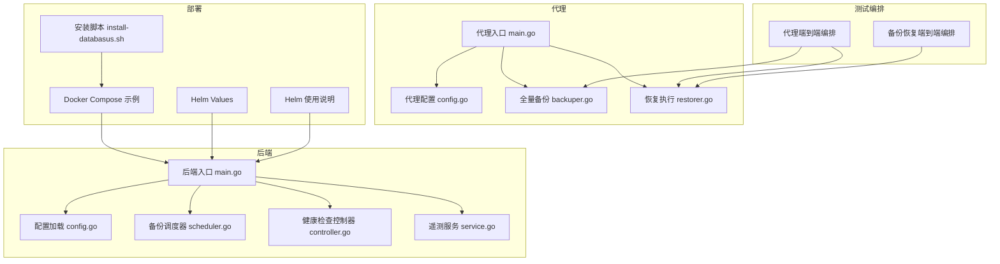
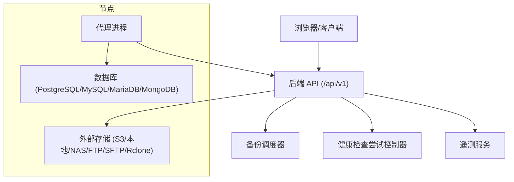
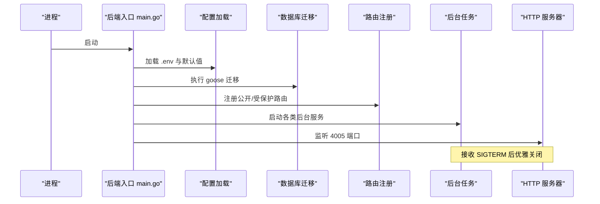
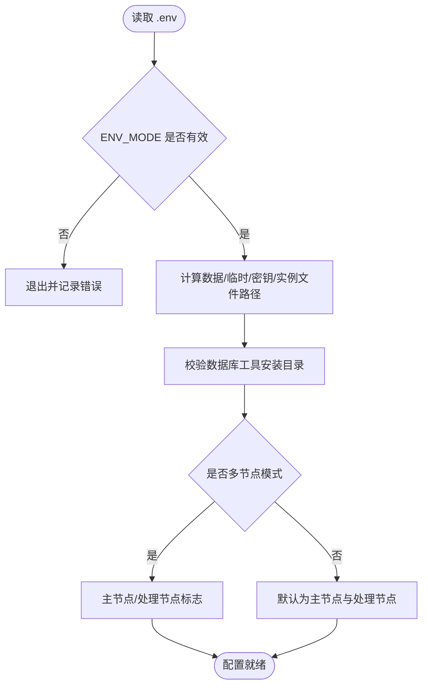
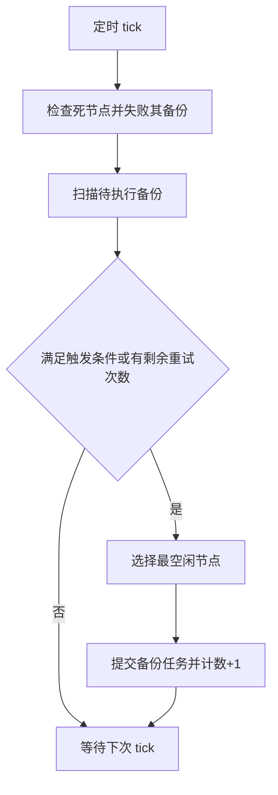
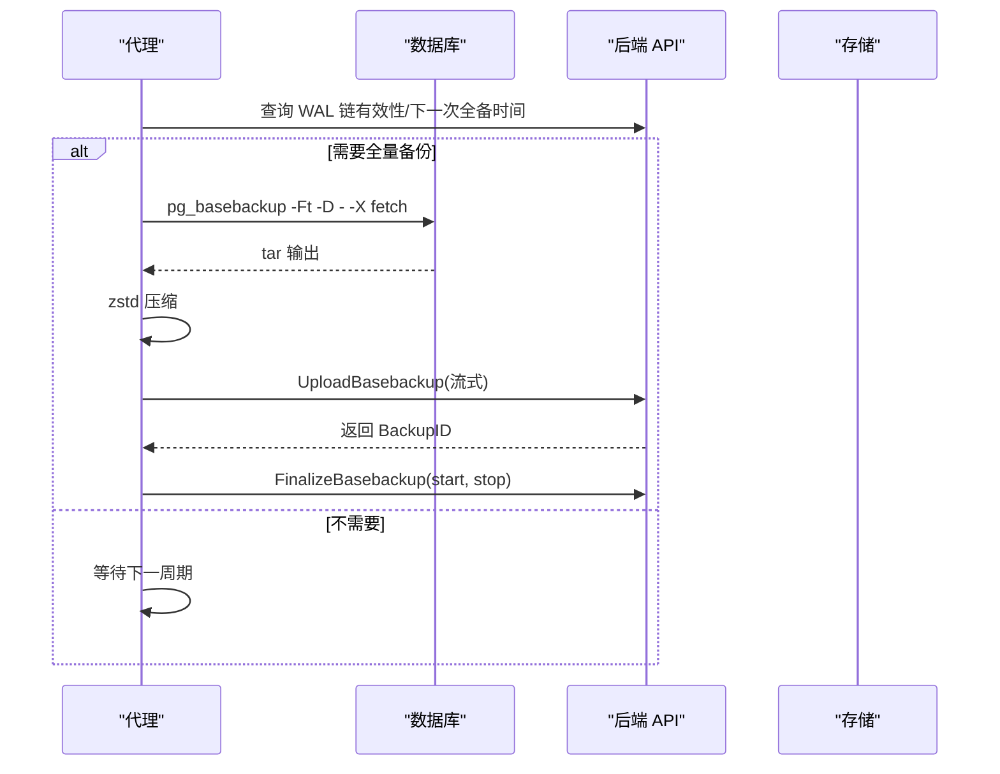
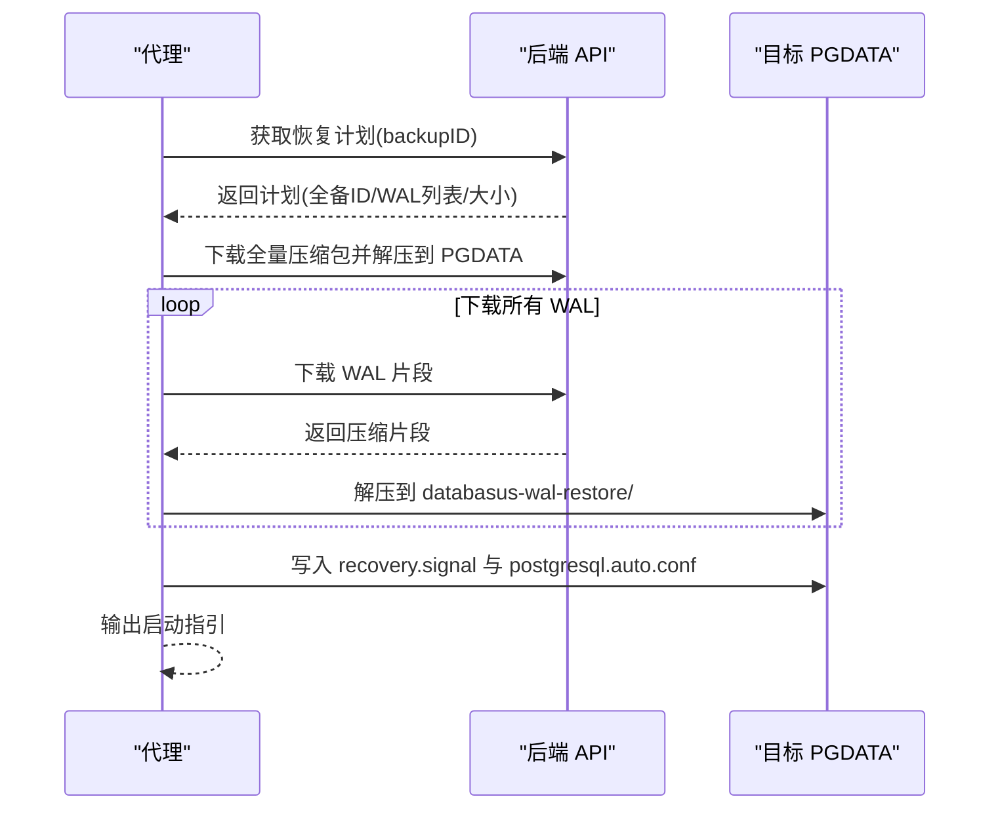
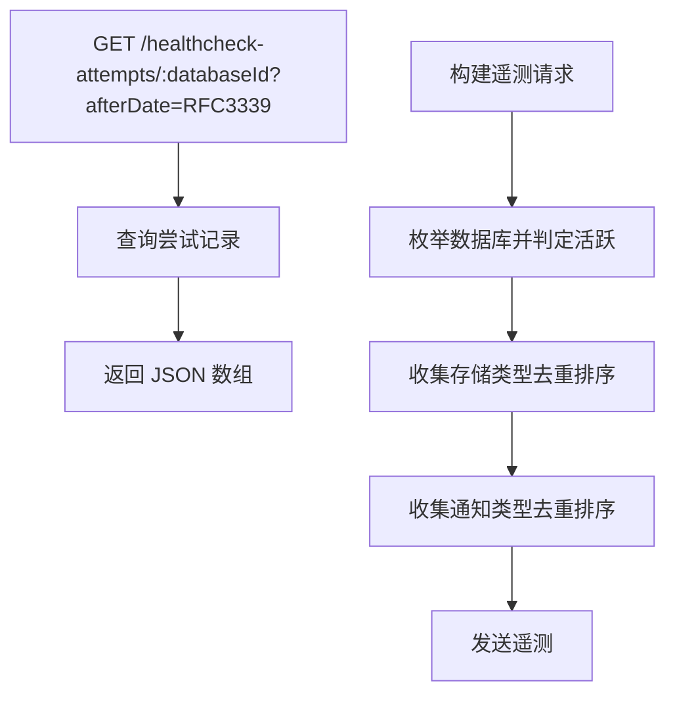
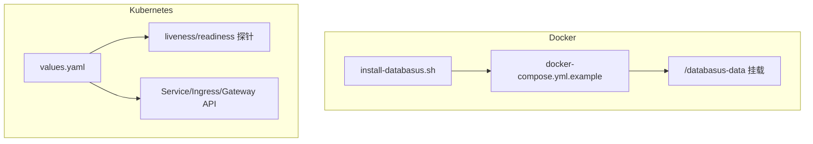
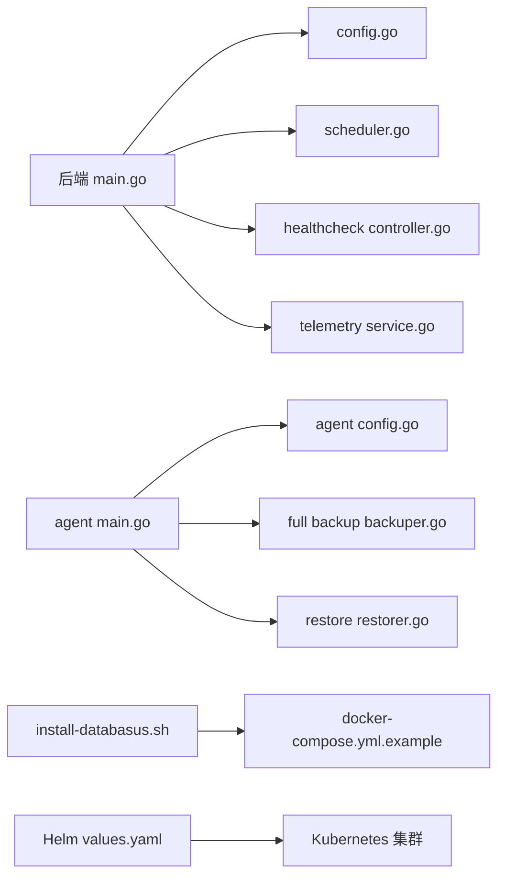

# 部署和运维

<cite>
**本文引用的文件**
- [README.md](file://README.md)
- [install-databasus.sh](file://install-databasus.sh)
- [docker-compose.yml.example](file://docker-compose.yml.example)
- [backend/cmd/main.go](file://backend/cmd/main.go)
- [backend/internal/config/config.go](file://backend/internal/config/config.go)
- [backend/internal/features/healthcheck/attempt/controller.go](file://backend/internal/features/healthcheck/attempt/controller.go)
- [backend/internal/features/telemetry/service.go](file://backend/internal/features/telemetry/service.go)
- [backend/internal/features/backups/backups/backuping/scheduler.go](file://backend/internal/features/backups/backups/backuping/scheduler.go)
- [deploy/helm/values.yaml](file://deploy/helm/values.yaml)
- [deploy/helm/README.md](file://deploy/helm/README.md)
- [deploy/helm/Chart.yaml](file://deploy/helm/Chart.yaml)
- [agent/cmd/main.go](file://agent/cmd/main.go)
- [agent/internal/config/config.go](file://agent/internal/config/config.go)
- [agent/internal/features/full_backup/backuper.go](file://agent/internal/features/full_backup/backuper.go)
- [agent/internal/features/restore/restorer.go](file://agent/internal/features/restore/restorer.go)
- [agent/e2e/docker-compose.yml](file://agent/e2e/docker-compose.yml)
- [agent/e2e/docker-compose.backup-restore.yml](file://agent/e2e/docker-compose.backup-restore.yml)
</cite>

## 目录
1. [简介](#简介)
2. [项目结构](#项目结构)
3. [核心组件](#核心组件)
4. [架构总览](#架构总览)
5. [详细组件分析](#详细组件分析)
6. [依赖关系分析](#依赖关系分析)
7. [性能考虑](#性能考虑)
8. [故障排除指南](#故障排除指南)
9. [结论](#结论)
10. [附录](#附录)

## 简介
本指南面向生产环境的 Databasus 部署与运维，覆盖硬件与网络要求、安全配置、监控与告警、备份与恢复策略、性能优化、容器化部署（Docker、Compose、Kubernetes/Helm）、日常运维任务（日志、升级、容量规划）以及故障排除与应急响应流程。内容基于仓库中的后端、代理、Helm 部署与测试编排等源码文件进行提炼与整合。

## 项目结构
Databasus 由以下主要部分组成：
- 后端服务：提供 Web API、调度、健康检查、遥测、备份与恢复编排、通知与存储等能力。
- 代理 Agent：在数据库侧运行，负责 WAL 归档、物理全量备份、恢复执行。
- 前端 UI：打包到后端并由后端提供静态资源。
- 部署工具：安装脚本、Docker Compose 示例、Helm Chart。
- 测试与端到端编排：用于验证代理与后端交互、备份恢复流程。

图表来源
- [backend/cmd/main.go:1-491](file://backend/cmd/main.go#L1-L491)
- [backend/internal/config/config.go:1-422](file://backend/internal/config/config.go#L1-L422)
- [backend/internal/features/backups/backups/backuping/scheduler.go:1-634](file://backend/internal/features/backups/backups/backuping/scheduler.go#L1-L634)
- [backend/internal/features/healthcheck/attempt/controller.go:1-71](file://backend/internal/features/healthcheck/attempt/controller.go#L1-L71)
- [backend/internal/features/telemetry/service.go:1-253](file://backend/internal/features/telemetry/service.go#L1-L253)
- [agent/cmd/main.go:1-246](file://agent/cmd/main.go#L1-L246)
- [agent/internal/config/config.go:1-272](file://agent/internal/config/config.go#L1-L272)
- [agent/internal/features/full_backup/backuper.go:1-317](file://agent/internal/features/full_backup/backuper.go#L1-L317)
- [agent/internal/features/restore/restorer.go:1-445](file://agent/internal/features/restore/restorer.go#L1-L445)
- [install-databasus.sh:1-141](file://install-databasus.sh#L1-L141)
- [docker-compose.yml.example:1-19](file://docker-compose.yml.example#L1-L19)
- [deploy/helm/values.yaml:1-107](file://deploy/helm/values.yaml#L1-L107)
- [deploy/helm/README.md:1-247](file://deploy/helm/README.md#L1-L247)
- [agent/e2e/docker-compose.yml:1-85](file://agent/e2e/docker-compose.yml#L1-L85)
- [agent/e2e/docker-compose.backup-restore.yml:1-34](file://agent/e2e/docker-compose.backup-restore.yml#L1-L34)

章节来源
- [README.md:124-222](file://README.md#L124-L222)
- [install-databasus.sh:113-134](file://install-databasus.sh#L113-L134)
- [docker-compose.yml.example:1-19](file://docker-compose.yml.example#L1-L19)
- [deploy/helm/README.md:1-247](file://deploy/helm/README.md#L1-L247)

## 核心组件
- 后端主程序：初始化配置、迁移、路由注册、后台任务启动、前端静态资源挂载、优雅关闭。
- 配置系统：从 .env 加载环境变量，支持开发/生产模式、Valkey 连接、数据库安装目录校验、节点模式与网络吞吐配置。
- 备份调度器：周期性扫描启用的备份配置，按节点负载均衡分配备份任务，处理重试与节点可用性。
- 代理：提供 start/stop/status/restore 命令，负责 WAL 队列与物理全量备份上传、恢复时的 WAL 下载与恢复配置生成。
- 遥测与健康检查：收集实例与数据库、存储、通知类型统计；提供健康检查尝试查询接口。
- 部署与运维：安装脚本自动拉起 Docker Compose；Helm Chart 提供多种访问方式与探针配置。

章节来源
- [backend/cmd/main.go:65-137](file://backend/cmd/main.go#L65-L137)
- [backend/internal/config/config.go:152-422](file://backend/internal/config/config.go#L152-L422)
- [backend/internal/features/backups/backups/backuping/scheduler.go:42-94](file://backend/internal/features/backups/backups/backuping/scheduler.go#L42-L94)
- [agent/cmd/main.go:24-75](file://agent/cmd/main.go#L24-L75)
- [agent/internal/config/config.go:16-115](file://agent/internal/config/config.go#L16-L115)
- [backend/internal/features/telemetry/service.go:75-108](file://backend/internal/features/telemetry/service.go#L75-L108)
- [backend/internal/features/healthcheck/attempt/controller.go:17-71](file://backend/internal/features/healthcheck/attempt/controller.go#L17-L71)

## 架构总览
Databasus 的生产部署通常采用“后端 + 代理”的组合：
- 后端负责 API、调度、存储与通知、健康检查与遥测。
- 代理在数据库主机或容器内运行，直接与数据库交互，完成 WAL 归档与物理备份流式上传，并在需要时执行恢复流程。
- 生产环境推荐使用 Docker Compose 或 Helm 在 Kubernetes 中部署，结合持久化卷与探针保障可用性。

图表来源
- [backend/cmd/main.go:213-257](file://backend/cmd/main.go#L213-L257)
- [backend/internal/features/backups/backups/backuping/scheduler.go:19-40](file://backend/internal/features/backups/backups/backuping/scheduler.go#L19-L40)
- [agent/cmd/main.go:30-75](file://agent/cmd/main.go#L30-L75)

## 详细组件分析

### 后端主程序与启动流程
- 初始化日志、缓存、迁移、目录准备、密钥迁移、初始管理员创建、密码重置命令行参数处理。
- 注册路由（公开与受保护），设置 CORS/GZIP，挂载前端静态资源。
- 启动后台任务（备份/清理/恢复/健康检查/审计/下载令牌/节点注册/遥测等）。
- 优雅关闭：捕获信号，停止 VictoriaLogs 写入，10 秒超时优雅退出。

图表来源
- [backend/cmd/main.go:65-137](file://backend/cmd/main.go#L65-L137)
- [backend/cmd/main.go:213-257](file://backend/cmd/main.go#L213-L257)
- [backend/cmd/main.go:293-374](file://backend/cmd/main.go#L293-L374)

章节来源
- [backend/cmd/main.go:65-137](file://backend/cmd/main.go#L65-L137)
- [backend/cmd/main.go:213-257](file://backend/cmd/main.go#L213-L257)
- [backend/cmd/main.go:293-374](file://backend/cmd/main.go#L293-L374)

### 配置系统与环境变量
- 支持 ENV_MODE（development/production）、Valkey 连接、数据库安装目录校验、节点模式（单节点/多节点/处理节点）、网络吞吐限制。
- 数据目录、临时目录、密钥文件路径、实例文件路径均在配置中集中定义。
- 可通过外部数据库/Valkey 覆盖变量，便于测试与集成。

图表来源
- [backend/internal/config/config.go:157-334](file://backend/internal/config/config.go#L157-L334)

章节来源
- [backend/internal/config/config.go:152-422](file://backend/internal/config/config.go#L152-L422)

### 备份调度与节点管理
- 定时器每分钟扫描一次，失败进行中的备份标记失败，订阅节点完成事件并更新状态。
- 计算最空闲节点（考虑吞吐与活动备份数），避免热点节点。
- 支持订阅到期控制与重试次数上限，防止资源滥用。

图表来源
- [backend/internal/features/backups/backups/backuping/scheduler.go:42-94](file://backend/internal/features/backups/backups/backuping/scheduler.go#L42-L94)
- [backend/internal/features/backups/backups/backuping/scheduler.go:320-397](file://backend/internal/features/backups/backups/backuping/scheduler.go#L320-L397)
- [backend/internal/features/backups/backups/backuping/scheduler.go:442-488](file://backend/internal/features/backups/backups/backuping/scheduler.go#L442-L488)

章节来源
- [backend/internal/features/backups/backups/backuping/scheduler.go:19-94](file://backend/internal/features/backups/backups/backuping/scheduler.go#L19-L94)
- [backend/internal/features/backups/backups/backuping/scheduler.go:320-397](file://backend/internal/features/backups/backups/backuping/scheduler.go#L320-L397)

### 代理：全量备份与恢复
- 全量备份：周期检查 WAL 链有效性与计划时间，必要时执行 pg_basebackup，标准输出经 zstd 压缩后直传至后端，解析 stderr 获取 LSN 段范围并最终确认。
- 恢复：根据恢复计划下载 basebackup 与 WAL，生成 recovery.signal 与 postgresql.auto.conf，支持 PITR 时间点恢复。

图表来源
- [agent/internal/features/full_backup/backuper.go:66-124](file://agent/internal/features/full_backup/backuper.go#L66-L124)
- [agent/internal/features/full_backup/backuper.go:164-245](file://agent/internal/features/full_backup/backuper.go#L164-L245)

图表来源
- [agent/internal/features/restore/restorer.go:58-102](file://agent/internal/features/restore/restorer.go#L58-L102)
- [agent/internal/features/restore/restorer.go:130-146](file://agent/internal/features/restore/restorer.go#L130-L146)
- [agent/internal/features/restore/restorer.go:245-258](file://agent/internal/features/restore/restorer.go#L245-L258)
- [agent/internal/features/restore/restorer.go:329-363](file://agent/internal/features/restore/restorer.go#L329-L363)

章节来源
- [agent/internal/features/full_backup/backuper.go:1-317](file://agent/internal/features/full_backup/backuper.go#L1-L317)
- [agent/internal/features/restore/restorer.go:1-445](file://agent/internal/features/restore/restorer.go#L1-L445)

### 健康检查与遥测
- 健康检查尝试接口：按数据库 ID 查询最近 7 天的尝试记录，支持 RFC3339 时间过滤。
- 遥测服务：收集活跃数据库（健康可用或近期内成功备份）、存储类型、通知类型，限制数组长度，发送匿名遥测。

图表来源
- [backend/internal/features/healthcheck/attempt/controller.go:21-71](file://backend/internal/features/healthcheck/attempt/controller.go#L21-L71)
- [backend/internal/features/telemetry/service.go:75-108](file://backend/internal/features/telemetry/service.go#L75-L108)
- [backend/internal/features/telemetry/service.go:110-138](file://backend/internal/features/telemetry/service.go#L110-L138)
- [backend/internal/features/telemetry/service.go:184-236](file://backend/internal/features/telemetry/service.go#L184-L236)

章节来源
- [backend/internal/features/healthcheck/attempt/controller.go:17-71](file://backend/internal/features/healthcheck/attempt/controller.go#L17-L71)
- [backend/internal/features/telemetry/service.go:1-253](file://backend/internal/features/telemetry/service.go#L1-L253)

### 容器化部署与 Kubernetes
- Docker：安装脚本写入 docker-compose.yml 并启动；示例 Compose 文件映射 4005 端口与持久化目录。
- Kubernetes：Helm Chart 提供 ClusterIP/NodePort/LoadBalancer/Ingress/HTTPRoute 多种暴露方式，内置 liveness/readiness 探针，支持自定义根 CA 证书注入。

图表来源
- [install-databasus.sh:113-134](file://install-databasus.sh#L113-L134)
- [docker-compose.yml.example:1-19](file://docker-compose.yml.example#L1-19)
- [deploy/helm/values.yaml:71-91](file://deploy/helm/values.yaml#L71-L91)
- [deploy/helm/README.md:87-247](file://deploy/helm/README.md#L87-L247)

章节来源
- [README.md:124-222](file://README.md#L124-L222)
- [install-databasus.sh:1-141](file://install-databasus.sh#L1-L141)
- [docker-compose.yml.example:1-19](file://docker-compose.yml.example#L1-L19)
- [deploy/helm/README.md:1-247](file://deploy/helm/README.md#L1-L247)
- [deploy/helm/values.yaml:1-107](file://deploy/helm/values.yaml#L1-L107)

## 依赖关系分析
- 后端依赖配置模块、数据库迁移、路由与中间件、后台任务服务、前端静态资源。
- 代理依赖配置、API 客户端、数据库工具（pg_basebackup）、zstd 压缩。
- 部署层依赖 Docker/Compose/Kubernetes 与 Helm。

图表来源
- [backend/cmd/main.go:259-276](file://backend/cmd/main.go#L259-L276)
- [agent/cmd/main.go:24-75](file://agent/cmd/main.go#L24-L75)
- [install-databasus.sh:113-134](file://install-databasus.sh#L113-L134)
- [deploy/helm/values.yaml:1-107](file://deploy/helm/values.yaml#L1-107)

章节来源
- [backend/cmd/main.go:259-276](file://backend/cmd/main.go#L259-L276)
- [agent/cmd/main.go:24-75](file://agent/cmd/main.go#L24-L75)

## 性能考虑
- 网络与吞吐：通过节点网络吞吐配置限制备份带宽，避免抢占数据库网络。
- 压缩与传输：代理对 pg_basebackup 输出进行 zstd 压缩并流式上传，减少中间文件与磁盘 IO。
- 调度均衡：按节点吞吐与活动备份数计算最空闲节点，提升整体吞吐。
- 前端与日志：GZIP 压缩响应，静态资源回退至 index.html，日志写入支持 VictoriaLogs。

章节来源
- [backend/internal/config/config.go:282-284](file://backend/internal/config/config.go#L282-L284)
- [agent/internal/features/full_backup/backuper.go:247-269](file://agent/internal/features/full_backup/backuper.go#L247-L269)
- [backend/internal/features/backups/backups/backuping/scheduler.go:470-475](file://backend/internal/features/backups/backups/backuping/scheduler.go#L470-L475)
- [backend/cmd/main.go:117-124](file://backend/cmd/main.go#L117-L124)

## 故障排除指南
- 启动与迁移失败：检查 .env 是否正确加载、DATABASE_DSN/ENV_MODE 是否有效；查看迁移输出与错误日志。
- 密码重置：通过命令行参数重置指定用户密码，需提供邮箱。
- 代理无法连接后端：确认 databasusHost/token/dbId/pg-* 配置；检查网络连通与证书；查看代理日志。
- 备份失败：检查 WAL 链有效性、计划时间、重试次数；查看后端日志与代理上报的错误信息。
- 恢复失败：确认目标 PGDATA 目录为空且可写；检查恢复计划与 WAL 下载；核对 postgresql.auto.conf 的路径。
- 升级与自检：代理支持自动检查更新并在升级后重新执行；开发模式可通过 .env 控制。

章节来源
- [backend/cmd/main.go:139-173](file://backend/cmd/main.go#L139-L173)
- [agent/cmd/main.go:173-193](file://agent/cmd/main.go#L173-L193)
- [agent/internal/config/config.go:35-64](file://agent/internal/config/config.go#L35-L64)
- [agent/internal/features/full_backup/backuper.go:126-162](file://agent/internal/features/full_backup/backuper.go#L126-L162)
- [agent/internal/features/restore/restorer.go:104-128](file://agent/internal/features/restore/restorer.go#L104-L128)

## 结论
Databasus 提供了从单机到多节点、从 Docker 到 Kubernetes 的完整部署方案。通过明确的配置体系、可靠的备份调度与代理直连机制、完善的健康检查与遥测，可在生产环境中实现高可用与可观测性。建议结合本文的部署与运维实践，配合监控与告警体系，确保数据库备份与恢复的稳定性与安全性。

## 附录

### 生产环境部署清单
- 硬件与网络
  - 至少 1 核 CPU、2 GiB 内存起步，根据数据库规模与并发备份数扩容。
  - 留足备份存储空间（含压缩与保留策略），建议使用 SSD 存储。
  - 网络：开放 4005 端口（或通过 Ingress/LoadBalancer 暴露），允许代理访问数据库端口。
- 安全设置
  - 使用 HTTPS（Ingress/TLS），配置强密码与最小权限用户。
  - 代理与后端通信使用 Token 校验；敏感配置置于只读文件系统。
- 监控与告警
  - 开启 liveness/readiness 探针；结合日志与指标（CPU/内存/磁盘/网络）建立告警。
  - 使用健康检查尝试接口与遥测服务辅助定位问题。
- 备份与恢复
  - 启用 WAL 归档与物理全量备份；配置合理的保留策略与通知。
  - 定期演练恢复流程，验证恢复时间目标（RTO）与恢复点目标（RPO）。
- 容器化部署
  - Docker：使用安装脚本或示例 Compose 文件；持久化 /databasus-data。
  - Kubernetes：使用 Helm Chart，按需选择 Service 类型与 Ingress；配置探针与资源限制。

章节来源
- [deploy/helm/values.yaml:71-91](file://deploy/helm/values.yaml#L71-L91)
- [deploy/helm/README.md:87-247](file://deploy/helm/README.md#L87-L247)
- [README.md:124-222](file://README.md#L124-L222)