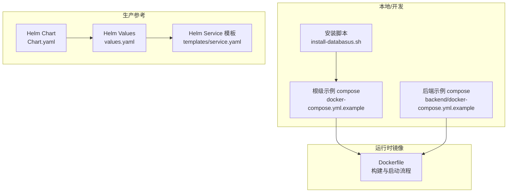
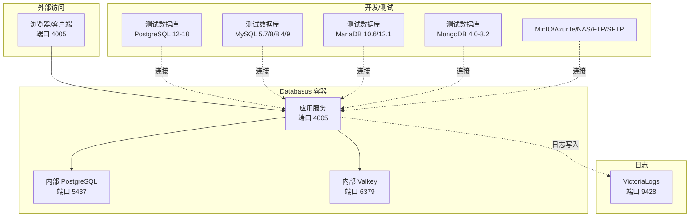
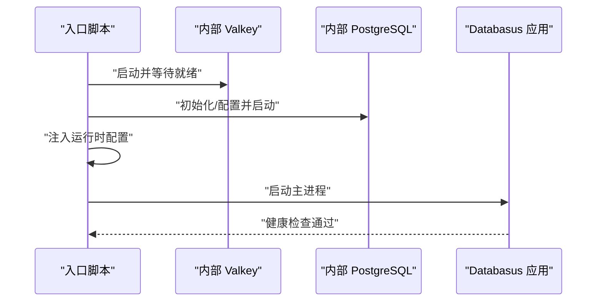
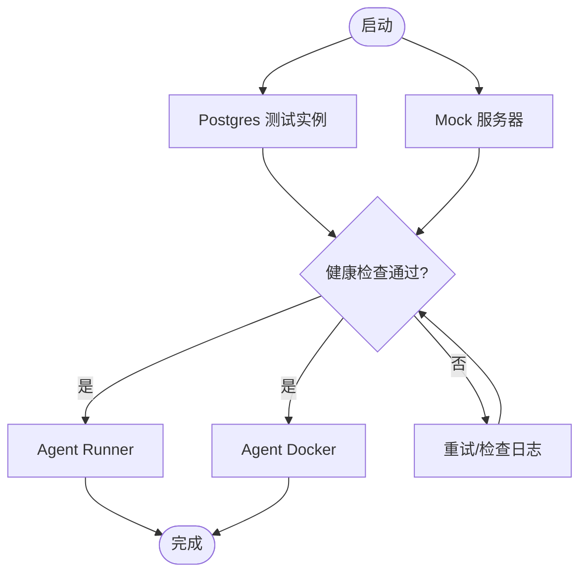
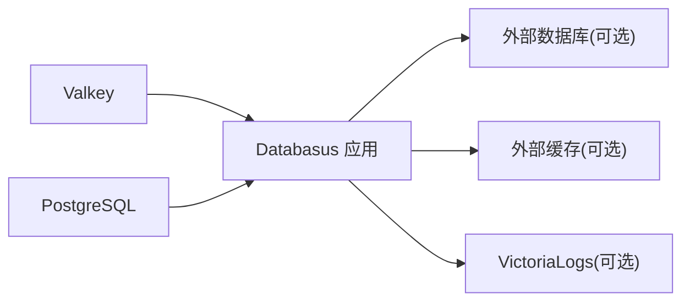

# Docker Compose配置

<cite>
**本文引用的文件**
- [docker-compose.yml.example](file://docker-compose.yml.example)
- [backend/docker-compose.yml.example](file://backend/docker-compose.yml.example)
- [Dockerfile](file://Dockerfile)
- [install-databasus.sh](file://install-databasus.sh)
- [README.md](file://README.md)
- [agent/e2e/docker-compose.yml](file://agent/e2e/docker-compose.yml)
- [agent/e2e/docker-compose.backup-restore.yml](file://agent/e2e/docker-compose.backup-restore.yml)
- [backend/.env.production.example](file://backend/.env.production.example)
- [deploy/helm/values.yaml](file://deploy/helm/values.yaml)
- [deploy/helm/Chart.yaml](file://deploy/helm/Chart.yaml)
- [deploy/helm/templates/service.yaml](file://deploy/helm/templates/service.yaml)
</cite>

## 目录
1. [简介](#简介)
2. [项目结构](#项目结构)
3. [核心组件](#核心组件)
4. [架构总览](#架构总览)
5. [详细组件分析](#详细组件分析)
6. [依赖关系分析](#依赖关系分析)
7. [性能与可扩展性](#性能与可扩展性)
8. [故障排查指南](#故障排查指南)
9. [结论](#结论)
10. [附录](#附录)

## 简介
本文件面向具备容器化部署经验的用户，系统化讲解 Databasus 的 Docker Compose 多容器部署方案。内容涵盖 compose 文件结构、服务角色、依赖与启动顺序、网络与端口、存储与持久化、环境变量与安全配置、监控与日志、以及扩展与定制建议。文中所有技术细节均基于仓库中的实际配置文件进行分析与归纳。

## 项目结构
Databasus 提供多种部署方式：单容器运行、自动化安装脚本、Docker Compose、以及 Kubernetes Helm 部署。与 Docker Compose 相关的关键文件包括：
- 根级示例 compose 文件：用于本地开发或演示
- 后端目录下的 compose 示例：包含开发用数据库、缓存、日志与多版本测试数据库
- 安装脚本：一键生成并启动基础 compose 配置
- Dockerfile：镜像构建与内部服务（PostgreSQL、Valkey）启动流程
- Helm 值与模板：作为对比参考，说明生产环境的资源与持久化策略

**图表来源**
- [docker-compose.yml.example:1-19](file://docker-compose.yml.example#L1-L19)
- [backend/docker-compose.yml.example:1-586](file://backend/docker-compose.yml.example#L1-L586)
- [install-databasus.sh:113-124](file://install-databasus.sh#L113-L124)
- [Dockerfile:107-546](file://Dockerfile#L107-L546)
- [deploy/helm/Chart.yaml:1-23](file://deploy/helm/Chart.yaml#L1-L23)
- [deploy/helm/values.yaml:1-107](file://deploy/helm/values.yaml#L1-L107)
- [deploy/helm/templates/service.yaml:1-41](file://deploy/helm/templates/service.yaml#L1-L41)

**章节来源**
- [docker-compose.yml.example:1-19](file://docker-compose.yml.example#L1-L19)
- [backend/docker-compose.yml.example:1-586](file://backend/docker-compose.yml.example#L1-L586)
- [install-databasus.sh:113-124](file://install-databasus.sh#L113-L124)
- [Dockerfile:107-546](file://Dockerfile#L107-L546)
- [deploy/helm/Chart.yaml:1-23](file://deploy/helm/Chart.yaml#L1-L23)
- [deploy/helm/values.yaml:1-107](file://deploy/helm/values.yaml#L1-L107)
- [deploy/helm/templates/service.yaml:1-41](file://deploy/helm/templates/service.yaml#L1-L41)

## 核心组件
- 应用服务（Databasus）
  - 镜像：官方镜像或本地构建镜像
  - 端口：对外暴露 4005
  - 存储：挂载 /databasus-data 实现持久化
  - 启动：入口脚本负责初始化内部数据库与缓存、迁移数据库、启动应用进程
- 开发数据库（PostgreSQL）
  - 版本：17（开发默认），亦提供多版本测试容器
  - 端口：5437（开发映射）
  - 数据：持久化到 pgdata
- 缓存（Valkey）
  - 内部缓存，健康检查通过 valkey-cli ping
  - 默认端口：6379（可通过环境变量覆盖）
- 日志（VictoriaLogs）
  - 外部日志收集，端口 9428，带认证
- 测试与兼容性
  - 多版本 PostgreSQL、MySQL、MariaDB、MongoDB 容器
  - MinIO、Azurite、NAS、FTP、SFTP 等存储与协议测试容器

**章节来源**
- [docker-compose.yml.example:10-19](file://docker-compose.yml.example#L10-L19)
- [backend/docker-compose.yml.example:6-20](file://backend/docker-compose.yml.example#L6-L20)
- [backend/docker-compose.yml.example:22-36](file://backend/docker-compose.yml.example#L22-L36)
- [backend/docker-compose.yml.example:37-49](file://backend/docker-compose.yml.example#L37-L49)
- [backend/docker-compose.yml.example:63-139](file://backend/docker-compose.yml.example#L63-L139)
- [backend/docker-compose.yml.example:187-263](file://backend/docker-compose.yml.example#L187-L263)
- [backend/docker-compose.yml.example:264-473](file://backend/docker-compose.yml.example#L264-L473)
- [backend/docker-compose.yml.example:474-586](file://backend/docker-compose.yml.example#L474-L586)

## 架构总览
下图展示 Databasus 在 Docker Compose 下的典型拓扑：应用容器对外提供 Web 服务；内部运行 PostgreSQL 与 Valkey；日志由 VictoriaLogs 收集；开发场景中可附加多版本数据库与各类存储测试容器。

**图表来源**
- [backend/docker-compose.yml.example:6-20](file://backend/docker-compose.yml.example#L6-L20)
- [backend/docker-compose.yml.example:22-36](file://backend/docker-compose.yml.example#L22-L36)
- [backend/docker-compose.yml.example:37-49](file://backend/docker-compose.yml.example#L37-L49)
- [backend/docker-compose.yml.example:63-139](file://backend/docker-compose.yml.example#L63-L139)
- [backend/docker-compose.yml.example:187-263](file://backend/docker-compose.yml.example#L187-L263)
- [backend/docker-compose.yml.example:264-473](file://backend/docker-compose.yml.example#L264-L473)
- [backend/docker-compose.yml.example:474-586](file://backend/docker-compose.yml.example#L474-L586)

## 详细组件分析

### 应用服务（Databasus）
- 镜像与入口
  - 可直接使用官方镜像，或通过 Dockerfile 构建包含前端、后端、代理工具链的完整镜像
  - 入口脚本负责：调整 postgres 用户权限、注入运行时配置、启动 Valkey、初始化并启动内部 PostgreSQL、执行数据库迁移、最后启动主应用
- 端口与存储
  - 对外端口 4005
  - 挂载 /databasus-data，包含 pgdata、临时目录、备份目录
- 环境变量
  - 支持通过环境变量控制数据库连接、Valkey 连接、云功能开关、加密脚本注入等
- 健康检查
  - 应用提供 /api/v1/system/health 探针（Helm 场景）

**图表来源**
- [Dockerfile:277-533](file://Dockerfile#L277-L533)

**章节来源**
- [docker-compose.yml.example:10-19](file://docker-compose.yml.example#L10-L19)
- [Dockerfile:107-546](file://Dockerfile#L107-L546)
- [deploy/helm/values.yaml:71-91](file://deploy/helm/values.yaml#L71-L91)

### 开发数据库（PostgreSQL）
- 服务名：dev-db
- 端口映射：5437:5437
- 环境变量：从 .env 注入数据库名、用户名、密码
- 数据卷：pgdata
- 健康检查：通过命令行工具检测
- 共享内存：开发场景设置较大共享内存

**章节来源**
- [backend/docker-compose.yml.example:6-20](file://backend/docker-compose.yml.example#L6-L20)

### 缓存（Valkey）
- 服务名：dev-valkey
- 端口：默认 6379（可通过环境变量覆盖）
- 健康检查：valkey-cli ping
- 数据卷：/data

**章节来源**
- [backend/docker-compose.yml.example:22-36](file://backend/docker-compose.yml.example#L22-L36)

### 日志（VictoriaLogs）
- 服务名：victoria-logs
- 端口：9428
- 命令参数：指定数据路径、保留期、HTTP 认证
- 数据卷：/victoria-logs-data

**章节来源**
- [backend/docker-compose.yml.example:37-49](file://backend/docker-compose.yml.example#L37-L49)

### 多版本数据库测试容器
- PostgreSQL：12-18
- MySQL：5.7、8.0、8.4、9.0
- MariaDB：10.6、12.1 以及多个历史版本
- MongoDB：4.0-8.2
- 每个容器均提供健康检查与端口映射，便于验证兼容性

**章节来源**
- [backend/docker-compose.yml.example:63-139](file://backend/docker-compose.yml.example#L63-L139)
- [backend/docker-compose.yml.example:187-263](file://backend/docker-compose.yml.example#L187-L263)
- [backend/docker-compose.yml.example:264-473](file://backend/docker-compose.yml.example#L264-L473)
- [backend/docker-compose.yml.example:474-586](file://backend/docker-compose.yml.example#L474-L586)

### 存储与协议测试容器
- MinIO：对象存储测试
- Azurite：Azure Blob 测试
- NAS（Samba）：共享存储测试
- FTP/SFTP：文件传输测试
- 健康检查与端口映射按需配置

**章节来源**
- [backend/docker-compose.yml.example:51-186](file://backend/docker-compose.yml.example#L51-L186)

### 端到端测试（Agent）
- 包含构建、PostgreSQL、Mock 服务器、Runner、Docker Agent 等服务
- 使用 depends_on 与健康检查保证启动顺序
- 使用命名卷 wal-queue、backup-storage

**图表来源**
- [agent/e2e/docker-compose.yml:10-81](file://agent/e2e/docker-compose.yml#L10-L81)

**章节来源**
- [agent/e2e/docker-compose.yml:1-85](file://agent/e2e/docker-compose.yml#L1-L85)
- [agent/e2e/docker-compose.backup-restore.yml:1-34](file://agent/e2e/docker-compose.backup-restore.yml#L1-L34)

## 依赖关系分析
- 启动顺序
  - 应用容器依赖内部 Valkey 与 PostgreSQL 就绪
  - 开发数据库与缓存可独立启动，但应用容器在启动前会等待其可用
  - 端到端测试通过 depends_on 与健康检查实现强约束
- 服务发现
  - 应用容器通过 localhost 或容器网络访问内部数据库与缓存
  - 外部数据库与缓存可通过环境变量覆盖（危险模式警告）
- 网络通信
  - 应用容器仅暴露 4005
  - 开发数据库映射 5437，其他测试容器按需映射
- 数据同步
  - 应用容器启动时执行数据库迁移，确保 schema 一致
  - 备份/恢复测试通过命名卷共享数据

**图表来源**
- [Dockerfile:507-532](file://Dockerfile#L507-L532)
- [backend/docker-compose.yml.example:37-49](file://backend/docker-compose.yml.example#L37-L49)

**章节来源**
- [Dockerfile:507-532](file://Dockerfile#L507-L532)
- [backend/docker-compose.yml.example:37-49](file://backend/docker-compose.yml.example#L37-L49)

## 性能与可扩展性
- 资源规划（Helm 参考）
  - 默认请求/限制：CPU 500m、内存 1Gi
  - 生产建议：根据并发与数据库规模调整 CPU/内存配额
- 存储
  - 建议使用持久卷（ReadWriteOnce），容量按备份量与保留策略评估
  - 备份存储可使用对象存储（S3、Google Drive 等），减少本地磁盘压力
- 并发与连接
  - 数据库连接池与 Valkey 连接数应与应用规模匹配
  - 多版本数据库测试容器仅用于兼容性验证，不建议在生产使用

**章节来源**
- [deploy/helm/values.yaml:27-44](file://deploy/helm/values.yaml#L27-L44)

## 故障排查指南
- 启动失败
  - 检查 Valkey 是否就绪（健康检查）
  - 检查 PostgreSQL 初始化与 WAL 恢复逻辑（入口脚本包含 WAL 重置恢复流程）
- 数据库连接
  - 如使用外部数据库/Valkey，入口脚本会发出危险模式警告
  - 确认 DSN、主机、端口、凭据正确
- 端口冲突
  - 修改映射端口，避免 4005、5437、9428 等被占用
- 权限问题
  - 容器内 postgres 用户 UID/GID 可通过环境变量调整
- 备份/恢复测试
  - 确保 wal-queue、backup-storage 等命名卷存在且权限正确

**章节来源**
- [Dockerfile:298-314](file://Dockerfile#L298-L314)
- [Dockerfile:446-490](file://Dockerfile#L446-L490)
- [agent/e2e/docker-compose.yml:82-85](file://agent/e2e/docker-compose.yml#L82-L85)

## 结论
Databasus 的 Docker Compose 方案以“应用容器 + 内部数据库与缓存 + 可选日志与测试容器”为核心，既满足本地开发与演示，又为生产部署提供了清晰的参考路径（结合 Helm）。通过合理的环境变量、持久化策略与健康检查，可在不同规模与场景下稳定运行。

## 附录

### 环境变量与敏感信息管理
- 开发数据库凭据
  - 通过 .env 注入数据库名、用户名、密码
- 应用侧连接
  - DATABASE_DSN/DATABASE_URL、Valkey 主机与端口
- 云与加密
  - 支持注入分析脚本、Paddle 脚本、云价格等运行时配置
  - 加密脚本注入仅在未存在时进行，避免重复注入
- 外部数据库/Valkey 覆盖
  - 设置危险模式变量时会打印警告，应用仍会尝试连接

**章节来源**
- [backend/.env.production.example:1-19](file://backend/.env.production.example#L1-L19)
- [Dockerfile:318-376](file://Dockerfile#L318-L376)
- [Dockerfile:507-532](file://Dockerfile#L507-L532)

### 存储卷配置与持久化策略
- 应用数据卷
  - /databasus-data：包含 pgdata、临时目录、备份目录
- 开发数据库
  - pgdata：持久化 PostgreSQL 数据
- 测试与备份
  - wal-queue、backup-storage：端到端测试共享卷
- 生产建议
  - 使用外部持久卷，容量按备份量与保留策略预留

**章节来源**
- [Dockerfile:541-542](file://Dockerfile#L541-L542)
- [agent/e2e/docker-compose.yml:82-85](file://agent/e2e/docker-compose.yml#L82-L85)
- [agent/e2e/docker-compose.backup-restore.yml:32-34](file://agent/e2e/docker-compose.backup-restore.yml#L32-L34)

### 网络配置与端口映射
- 应用：4005（对外）
- 开发数据库：5437（映射至容器内 5437）
- VictoriaLogs：9428
- 测试容器：按需映射（如 MinIO 控制台、FTP/SFTP 等）
- 自定义网络
  - 可在 compose 中定义自定义网络，将服务加入同一网络以简化服务发现

**章节来源**
- [docker-compose.yml.example:14-15](file://docker-compose.yml.example#L14-L15)
- [backend/docker-compose.yml.example:10-11](file://backend/docker-compose.yml.example#L10-L11)
- [backend/docker-compose.yml.example:52-61](file://backend/docker-compose.yml.example#L52-L61)
- [backend/docker-compose.yml.example:166-185](file://backend/docker-compose.yml.example#L166-L185)

### 监控与日志
- 应用健康检查
  - /api/v1/system/health（Helm 场景）
- 容器日志
  - 应用容器标准输出即日志
  - VictoriaLogs 可集中收集日志
- 健康检查示例
  - Valkey：valkey-cli ping
  - PostgreSQL：pg_isready
  - MySQL/MariaDB/MongoDB：对应健康检查命令

**章节来源**
- [deploy/helm/values.yaml:71-91](file://deploy/helm/values.yaml#L71-L91)
- [backend/docker-compose.yml.example:30-35](file://backend/docker-compose.yml.example#L30-L35)
- [backend/docker-compose.yml.example:201-205](file://backend/docker-compose.yml.example#L201-L205)
- [backend/docker-compose.yml.example:298-301](file://backend/docker-compose.yml.example#L298-L301)
- [backend/docker-compose.yml.example:534-537](file://backend/docker-compose.yml.example#L534-L537)

### 扩展与定制指南
- 添加新服务
  - 在 compose 中新增服务，并通过 depends_on 与健康检查控制启动顺序
  - 如需持久化，声明命名卷并在服务中挂载
- 修改资源配置
  - 调整 CPU/内存请求与限制，或在生产环境使用 Helm
- 性能调优
  - 根据数据库规模与并发调整数据库连接数、Valkey 内存策略
  - 使用外部对象存储承载备份，降低本地磁盘压力
- 安全加固
  - 不在生产使用示例 compose 文件
  - 使用强密码、最小权限原则、TLS 与网络隔离

**章节来源**
- [README.md:161-182](file://README.md#L161-L182)
- [deploy/helm/values.yaml:27-44](file://deploy/helm/values.yaml#L27-L44)