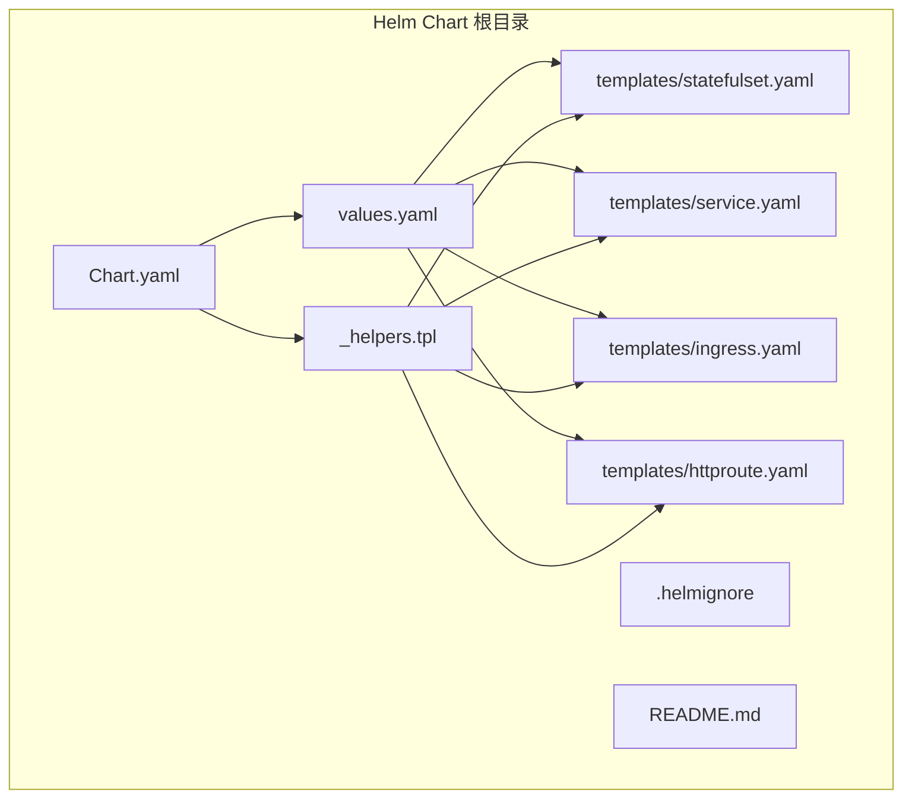
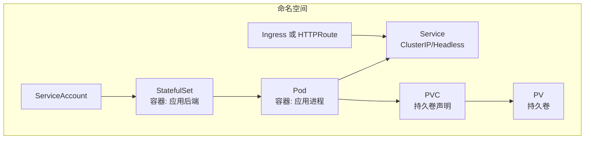
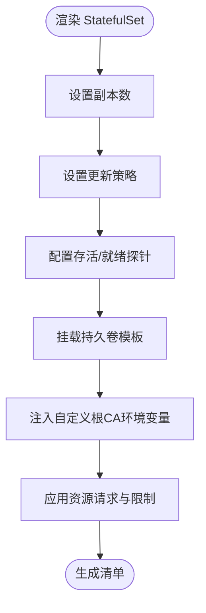
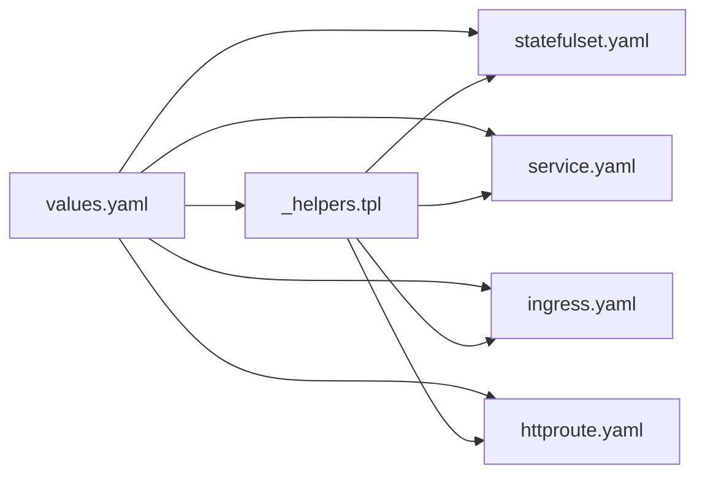

# Kubernetes Helm部署

<cite>
**本文引用的文件**
- [Chart.yaml](file://deploy/helm/Chart.yaml)
- [values.yaml](file://deploy/helm/values.yaml)
- [_helpers.tpl](file://deploy/helm/templates/_helpers.tpl)
- [statefulset.yaml](file://deploy/helm/templates/statefulset.yaml)
- [service.yaml](file://deploy/helm/templates/service.yaml)
- [ingress.yaml](file://deploy/helm/templates/ingress.yaml)
- [httproute.yaml](file://deploy/helm/templates/httproute.yaml)
- [README.md](file://deploy/helm/README.md)
- [.helmignore](file://deploy/helm/.helmignore)
- [main.go](file://backend/cmd/main.go)
- [config.go](file://backend/internal/config/config.go)
- [enums.go](file://backend/internal/util/env/enums.go)
</cite>

## 目录
1. [简介](#简介)
2. [项目结构](#项目结构)
3. [核心组件](#核心组件)
4. [架构总览](#架构总览)
5. [详细组件分析](#详细组件分析)
6. [依赖分析](#依赖分析)
7. [性能考虑](#性能考虑)
8. [故障排查指南](#故障排查指南)
9. [结论](#结论)
10. [附录](#附录)

## 简介
本文件面向Kubernetes平台管理员与DevOps工程师，系统化阐述如何使用Databasus提供的Helm Chart在Kubernetes集群中完成部署与运维。内容涵盖Helm Chart结构与各模板职责、values.yaml配置项解析、Kubernetes资源定义（Deployment/StatefulSet、Service、Ingress/HTTPRoute、ConfigMap/Secret、PVC）、集群基础设施准备（RBAC、存储类、网络策略、Ingress控制器）、应用配置管理（环境变量、配置映射、密钥管理、热更新）、高可用与扩展（副本数、资源限制、滚动更新、节点亲和性）、监控与可观测性（Pod健康、日志、指标导出、告警）、以及升级回滚策略（版本管理、滚动更新、数据迁移与兼容性检查）。

## 项目结构
Databasus的Helm Chart位于仓库根目录下的deploy/helm路径，包含Chart元数据、默认values、模板集合与使用说明。该Chart采用“单实例StatefulSet + Headless Service + 可选Ingress/HTTPRoute”的轻量级架构，适合开发与生产场景按需扩展。

图表来源
- [Chart.yaml:1-23](file://deploy/helm/Chart.yaml#L1-L23)
- [values.yaml:1-107](file://deploy/helm/values.yaml#L1-L107)
- [_helpers.tpl:1-69](file://deploy/helm/templates/_helpers.tpl#L1-L69)
- [statefulset.yaml:1-106](file://deploy/helm/templates/statefulset.yaml#L1-L106)
- [service.yaml:1-41](file://deploy/helm/templates/service.yaml#L1-L41)
- [ingress.yaml:1-43](file://deploy/helm/templates/ingress.yaml#L1-L43)
- [httproute.yaml:1-35](file://deploy/helm/templates/httproute.yaml#L1-L35)

章节来源
- [Chart.yaml:1-23](file://deploy/helm/Chart.yaml#L1-L23)
- [values.yaml:1-107](file://deploy/helm/values.yaml#L1-L107)
- [README.md:1-247](file://deploy/helm/README.md#L1-L247)

## 核心组件
- Chart元数据：定义Chart名称、类型、版本、应用版本、关键字、源码地址与维护者信息，便于包管理器识别与分发。
- 默认values：集中定义镜像、副本数、服务、资源、持久化、Ingress/HTTPRoute、健康探针、更新策略、节点选择与亲和性等。
- 模板集合：通过模板函数与values渲染生成最终的Kubernetes清单，包括StatefulSet、Service、Ingress/HTTPRoute等。
- 使用说明：提供安装、访问方式、外部接入选项（PortForward/NodePort/LoadBalancer/Ingress/Gateway API）、健康检查、存储扩容与升级卸载等操作指引。

章节来源
- [Chart.yaml:1-23](file://deploy/helm/Chart.yaml#L1-L23)
- [values.yaml:1-107](file://deploy/helm/values.yaml#L1-L107)
- [README.md:1-247](file://deploy/helm/README.md#L1-L247)

## 架构总览
下图展示Databasus在Kubernetes中的典型部署形态：StatefulSet运行后端应用，Headless Service用于稳定网络标识，可选Ingress或Gateway API暴露服务，持久化卷提供备份与临时数据存储。

图表来源
- [statefulset.yaml:1-106](file://deploy/helm/templates/statefulset.yaml#L1-L106)
- [service.yaml:1-41](file://deploy/helm/templates/service.yaml#L1-L41)
- [ingress.yaml:1-43](file://deploy/helm/templates/ingress.yaml#L1-L43)
- [httproute.yaml:1-35](file://deploy/helm/templates/httproute.yaml#L1-L35)

## 详细组件分析

### Chart元数据与使用说明
- Chart.yaml：定义Chart类型为application，应用版本与包版本，关键字包含数据库与备份相关标签，图标与源码地址便于用户检索。
- README.md：提供从OCI仓库直接安装、端口转发访问、多种外部接入方式（NodePort/LoadBalancer/Ingress/Gateway API）、健康检查、存储扩容与升级卸载等完整操作步骤。

章节来源
- [Chart.yaml:1-23](file://deploy/helm/Chart.yaml#L1-L23)
- [README.md:1-247](file://deploy/helm/README.md#L1-L247)

### 模板与命名规范（_helpers.tpl）
- 名称与全名：通过模板函数生成稳定的release级名称与chart标签，避免重复与冲突。
- 选择器标签：统一selectorLabels，确保Service与控制器匹配一致。
- 通用标签：生成chart版本、应用版本、管理方等标签，便于运维追踪。
- 命名空间：使用当前release所在命名空间，避免跨域误配。
- ServiceAccount名称：根据是否启用创建决定使用自定义或default。

章节来源
- [_helpers.tpl:1-69](file://deploy/helm/templates/_helpers.tpl#L1-L69)

### StatefulSet（应用工作负载）
- 副本数：由replicaCount控制；默认1，适合单实例或开发测试。
- 更新策略：支持RollingUpdate与分区策略，便于灰度与回滚。
- 资源请求与限制：内存/CPU请求与限制均设置为1Gi/500m，满足基础运行。
- 探针：启用liveness与readiness探针，探针路径为应用健康端点，延迟与周期可调。
- 存储：通过volumeClaimTemplates动态创建PVC，挂载至指定路径；支持自定义Root CA证书注入。
- 环境变量：当配置customRootCA时，自动注入SSL_CERT_FILE环境变量并挂载证书文件。

图表来源
- [statefulset.yaml:1-106](file://deploy/helm/templates/statefulset.yaml#L1-L106)
- [values.yaml:1-107](file://deploy/helm/values.yaml#L1-L107)

章节来源
- [statefulset.yaml:1-106](file://deploy/helm/templates/statefulset.yaml#L1-L106)
- [values.yaml:1-107](file://deploy/helm/values.yaml#L1-L107)

### Service（网络入口）
- ClusterIP服务：将流量路由到StatefulSet的Pod，端口映射由service.port与service.targetPort控制。
- Headless服务：当开启headless.enabled时，创建clusterIP=None的Service，供StatefulSet稳定网络标识使用。

章节来源
- [service.yaml:1-41](file://deploy/helm/templates/service.yaml#L1-L41)
- [values.yaml:1-107](file://deploy/helm/values.yaml#L1-L107)

### Ingress（域名与TLS）
- 条件渲染：仅当ingress.enabled为true时生成Ingress资源。
- 类名与注解：支持指定ingressClassName与常用注解（如ssl-redirect、证书颁发机构）。
- 主机与路径：支持多主机与路径前缀，TLS可指向现有Secret。
- 后端关联：指向同命名空间内的Service。

章节来源
- [ingress.yaml:1-43](file://deploy/helm/templates/ingress.yaml#L1-L43)
- [values.yaml:1-107](file://deploy/helm/values.yaml#L1-L107)

### HTTPRoute（Gateway API）
- 条件渲染：仅当route.enabled为true时生成HTTPRoute。
- 父引用与主机名：可配置parentRefs与hostnames，适配Istio、Envoy Gateway、Cilium等网关实现。
- 过滤器、匹配与超时：支持filters/matches/timeouts扩展。

章节来源
- [httproute.yaml:1-35](file://deploy/helm/templates/httproute.yaml#L1-L35)
- [values.yaml:1-107](file://deploy/helm/values.yaml#L1-L107)

### 健康检查与探针
- 探针路径：/api/v1/system/health，符合后端实际健康端点。
- 配置项：initialDelaySeconds、periodSeconds、timeoutSeconds、failureThreshold均可在values中调整。
- 启用开关：可通过livenessProbe.enabled与readinessProbe.enabled控制。

章节来源
- [values.yaml:1-107](file://deploy/helm/values.yaml#L1-L107)
- [statefulset.yaml:1-106](file://deploy/helm/templates/statefulset.yaml#L1-L106)

### 自定义根CA证书
- 配置项：customRootCA为Secret名称；当非空时，自动注入SSL_CERT_FILE并挂载证书文件。
- 使用场景：内部自签名证书、私有CA信任链。

章节来源
- [values.yaml:1-107](file://deploy/helm/values.yaml#L1-L107)
- [statefulset.yaml:1-106](file://deploy/helm/templates/statefulset.yaml#L1-L106)

### 持久化存储
- 开关与参数：enabled、storageClassName、accessMode、size、mountPath。
- 动态供应：通过volumeClaimTemplates按副本数动态创建PVC。
- 数据目录：后端期望的数据与临时目录位于挂载路径下，用于备份与临时文件。

章节来源
- [values.yaml:1-107](file://deploy/helm/values.yaml#L1-L107)
- [statefulset.yaml:1-106](file://deploy/helm/templates/statefulset.yaml#L1-L106)

### 应用配置与环境变量
- 后端监听端口：固定为4005，由values.service.targetPort与探针端口共同决定。
- 环境变量加载：后端通过dotenv与cleanenv加载.env与环境变量，校验关键字段（如DATABASE_DSN、ENV_MODE、VALKEY_*），并设置默认值与路径。
- 多节点模式：支持IS_MANY_NODES_MODE、IS_PRIMARY_NODE、IS_PROCESSING_NODE等标志位，影响初始化流程与主节点职责。

章节来源
- [main.go:175-200](file://backend/cmd/main.go#L175-L200)
- [config.go:1-422](file://backend/internal/config/config.go#L1-L422)
- [enums.go:1-9](file://backend/internal/util/env/enums.go#L1-L9)

## 依赖分析
- 模板依赖：所有资源模板均依赖_helpers.tpl提供的命名与标签函数，确保一致性。
- 配置依赖：values.yaml是唯一配置源，Ingress/HTTPRoute/Service/StatefulSet均基于其渲染。
- 运行时依赖：后端依赖数据库DSN、Valkey连接信息、环境模式、数据与临时目录路径等。

图表来源
- [values.yaml:1-107](file://deploy/helm/values.yaml#L1-L107)
- [_helpers.tpl:1-69](file://deploy/helm/templates/_helpers.tpl#L1-L69)
- [statefulset.yaml:1-106](file://deploy/helm/templates/statefulset.yaml#L1-L106)
- [service.yaml:1-41](file://deploy/helm/templates/service.yaml#L1-L41)
- [ingress.yaml:1-43](file://deploy/helm/templates/ingress.yaml#L1-L43)
- [httproute.yaml:1-35](file://deploy/helm/templates/httproute.yaml#L1-L35)

章节来源
- [values.yaml:1-107](file://deploy/helm/values.yaml#L1-L107)
- [_helpers.tpl:1-69](file://deploy/helm/templates/_helpers.tpl#L1-L69)

## 性能考虑
- 资源配额：默认requests/limits均为1Gi内存与500m CPU，建议结合实际负载与数据库工具链占用进行调整。
- 存储I/O：持久化大小与存储类直接影响备份/恢复吞吐；建议在生产环境选择具备高IOPS的存储类。
- 探针频率：探针周期与超时应平衡探测灵敏度与集群压力，避免频繁探针导致额外开销。
- 副本与亲和性：单实例适合开发；生产建议至少2副本并配合节点亲和/反亲和，避免单点风险。

## 故障排查指南
- 无法访问服务
  - 若使用ClusterIP：通过port-forward验证连通性。
  - 若使用Ingress/HTTPRoute：检查className、host、tls与父引用配置是否正确。
- 健康检查失败
  - 检查探针路径与端口是否与service.targetPort一致；适当延长initialDelaySeconds。
- 持久化问题
  - 确认storageClassName存在且具备相应能力；检查PVC绑定状态与容量。
- 自定义根CA
  - 确保Secret已创建且名称与customRootCA一致；检查容器内证书挂载路径。
- 升级后异常
  - 查看StatefulSet更新策略与分区设置；必要时回滚至上一版本。

章节来源
- [README.md:1-247](file://deploy/helm/README.md#L1-L247)
- [values.yaml:1-107](file://deploy/helm/values.yaml#L1-L107)
- [statefulset.yaml:1-106](file://deploy/helm/templates/statefulset.yaml#L1-L106)

## 结论
Databasus的Helm Chart以简洁清晰的模板与默认配置，为Kubernetes部署提供了即开即用的基础方案。通过values.yaml集中管理配置，结合StatefulSet与Headless Service实现稳定的服务发现与持久化，辅以外部接入（Ingress/HTTPRoute）与健康探针，满足从开发到生产的多样化需求。建议在生产环境中结合业务负载优化资源、存储与网络策略，并建立完善的监控与告警体系。

## 附录

### 安装与访问
- 直接从OCI仓库安装并创建命名空间。
- 默认通过ClusterIP + port-forward访问；也可切换为NodePort/LoadBalancer/Ingress/HTTPRoute。

章节来源
- [README.md:1-247](file://deploy/helm/README.md#L1-L247)

### 升级与回滚
- 升级：使用helm upgrade从OCI仓库拉取最新版本。
- 回滚：利用Helm历史版本进行回滚，结合StatefulSet的更新策略与分区控制，确保平滑过渡。

章节来源
- [README.md:236-246](file://deploy/helm/README.md#L236-L246)

### 集群基础设施准备建议
- RBAC：为Release命名空间创建专用ServiceAccount并授予最小权限。
- 存储类：确保集群存在合适的storageClassName，满足备份/恢复IOPS需求。
- 网络策略：在需要时启用NetworkPolicy限制入站流量。
- Ingress控制器：安装并配置IngressClass；若使用Gateway API，确保对应实现（如Istio/Envoy Gateway/Cilium）已部署。

章节来源
- [ingress.yaml:1-43](file://deploy/helm/templates/ingress.yaml#L1-L43)
- [httproute.yaml:1-35](file://deploy/helm/templates/httproute.yaml#L1-L35)

### 配置管理最佳实践
- 环境变量：通过Secret管理敏感信息（如DATABASE_DSN、Valkey凭据、SMTP凭据），ConfigMap管理非敏感配置。
- 热更新：优先使用ConfigMap/Secret的滚动更新机制；避免频繁重启。
- 配置验证：在values中预设合理默认值，结合探针与日志快速定位配置错误。

章节来源
- [config.go:1-422](file://backend/internal/config/config.go#L1-L422)
- [values.yaml:1-107](file://deploy/helm/values.yaml#L1-L107)