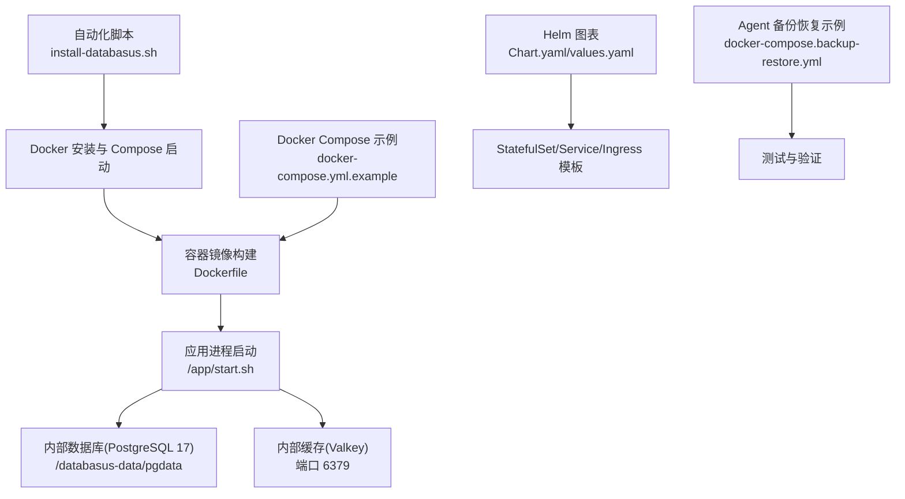
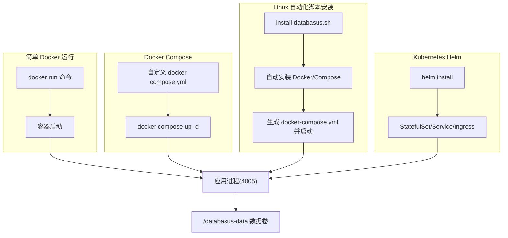
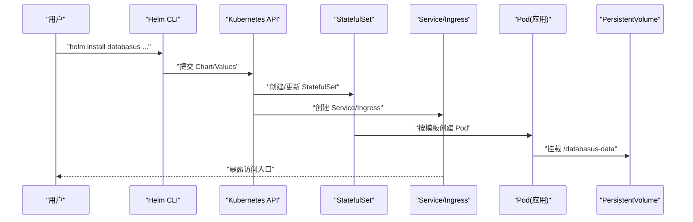
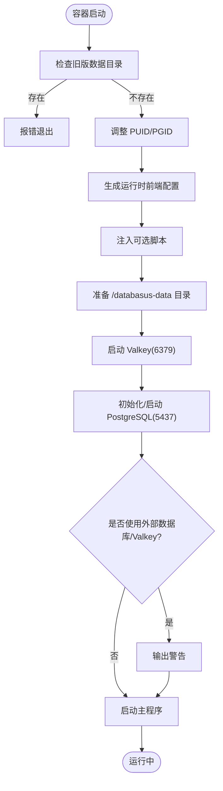

# 安装部署选项

<cite>
**本文引用的文件**
- [install-databasus.sh](file://install-databasus.sh)
- [Dockerfile](file://Dockerfile)
- [docker-compose.yml.example](file://docker-compose.yml.example)
- [README.md](file://README.md)
- [deploy/helm/Chart.yaml](file://deploy/helm/Chart.yaml)
- [deploy/helm/values.yaml](file://deploy/helm/values.yaml)
- [deploy/helm/templates/statefulset.yaml](file://deploy/helm/templates/statefulset.yaml)
- [deploy/helm/templates/service.yaml](file://deploy/helm/templates/service.yaml)
- [deploy/helm/templates/ingress.yaml](file://deploy/helm/templates/ingress.yaml)
- [agent/e2e/docker-compose.backup-restore.yml](file://agent/e2e/docker-compose.backup-restore.yml)
- [backend/tools/readme.md](file://backend/tools/readme.md)
- [backend/tools/download_linux.sh](file://backend/tools/download_linux.sh)
- [backend/tools/download_windows.bat](file://backend/tools/download_windows.bat)
</cite>

## 目录
1. [简介](#简介)
2. [项目结构](#项目结构)
3. [核心组件](#核心组件)
4. [架构总览](#架构总览)
5. [详细组件分析](#详细组件分析)
6. [依赖关系分析](#依赖关系分析)
7. [性能考量](#性能考量)
8. [故障排除指南](#故障排除指南)
9. [结论](#结论)
10. [附录](#附录)

## 简介
本章节面向不同技术背景的用户，系统性介绍 Databasus 的四种安装与部署方式：自动化脚本安装（推荐，Linux 专用）、简单 Docker 运行、Docker Compose 配置、Kubernetes Helm 部署。内容涵盖适用场景、前置条件、安装步骤、配置选项、命令示例、配置模板、优缺点对比、性能表现、维护成本、生产最佳实践、升级与迁移策略、故障排除与常见问题。

## 项目结构
Databasus 提供了从单容器到云原生的完整部署路径，核心文件与目录如下：
- 自动化安装脚本：install-databasus.sh
- 容器镜像与启动流程：Dockerfile
- 本地开发 Compose 示例：docker-compose.yml.example
- Helm 图表与默认值：deploy/helm/*
- Agent 测试与备份恢复示例：agent/e2e/*
- 多平台数据库客户端工具下载与使用说明：backend/tools/*

**图表来源**
- [install-databasus.sh:1-141](file://install-databasus.sh#L1-L141)
- [Dockerfile:107-546](file://Dockerfile#L107-L546)
- [docker-compose.yml.example:1-19](file://docker-compose.yml.example#L1-L19)
- [deploy/helm/Chart.yaml:1-23](file://deploy/helm/Chart.yaml#L1-L23)
- [deploy/helm/values.yaml:1-107](file://deploy/helm/values.yaml#L1-L107)
- [agent/e2e/docker-compose.backup-restore.yml:1-34](file://agent/e2e/docker-compose.backup-restore.yml#L1-L34)

**章节来源**
- [README.md:124-222](file://README.md#L124-L222)
- [install-databasus.sh:1-141](file://install-databasus.sh#L1-L141)
- [Dockerfile:107-546](file://Dockerfile#L107-L546)
- [docker-compose.yml.example:1-19](file://docker-compose.yml.example#L1-L19)
- [deploy/helm/Chart.yaml:1-23](file://deploy/helm/Chart.yaml#L1-L23)
- [deploy/helm/values.yaml:1-107](file://deploy/helm/values.yaml#L1-L107)
- [agent/e2e/docker-compose.backup-restore.yml:1-34](file://agent/e2e/docker-compose.backup-restore.yml#L1-L34)

## 核心组件
- 应用容器镜像与启动脚本
  - 镜像基于 Debian Slim，内置 PostgreSQL 17 服务器、Valkey 缓存、多版本数据库客户端工具（PostgreSQL 12-18、MySQL 5.7/8.0/8.4/9、MariaDB 10.6/12.1、MongoDB Database Tools），并包含前端构建产物与后端二进制。
  - 启动脚本负责：检查与调整 postgres 用户权限、生成运行时前端配置、注入可选脚本、初始化/启动内部数据库与缓存、执行主程序。
- 数据卷与持久化
  - 默认挂载 /databasus-data，包含 pgdata、temp、backups 子目录，权限由 postgres 用户拥有。
- 健康检查与探针
  - 容器暴露 4005 端口；Helm 图表提供 HTTP 探针指向 /api/v1/system/health。
- Helm 图表
  - 提供 StatefulSet、Service、Ingress/HTTPRoute、资源限制、存储声明、就绪/存活探针、滚动更新策略等。

**章节来源**
- [Dockerfile:107-546](file://Dockerfile#L107-L546)
- [deploy/helm/values.yaml:27-91](file://deploy/helm/values.yaml#L27-L91)
- [deploy/helm/templates/statefulset.yaml:1-106](file://deploy/helm/templates/statefulset.yaml#L1-L106)
- [deploy/helm/templates/service.yaml:1-41](file://deploy/helm/templates/service.yaml#L1-L41)

## 架构总览
下图展示四种安装方式在实际运行中的关键交互与差异点：

**图表来源**
- [install-databasus.sh:111-134](file://install-databasus.sh#L111-L134)
- [README.md:142-181](file://README.md#L142-L181)
- [docker-compose.yml.example:7-19](file://docker-compose.yml.example#L7-L19)
- [deploy/helm/values.yaml:17-70](file://deploy/helm/values.yaml#L17-L70)

## 详细组件分析

### 方式一：自动化脚本安装（推荐，Linux 专用）
- 适用场景
  - 快速在 Linux 主机上完成 Docker/Compose 安装与 Databasus 启动，适合个人或小规模团队快速试用与上线。
- 前置条件
  - Linux 发行版（支持 Ubuntu/Debian）且具备 root 权限。
  - 可联网访问 Docker 官方仓库。
- 安装步骤
  - 以 root 身份执行脚本，脚本会检测 OS 并自动添加 Docker 官方仓库、安装 docker-ce、docker-compose 插件。
  - 生成 /opt/databasus/docker-compose.yml 并启动容器。
- 关键行为
  - 写入 docker-compose.yml 并以 -d 后台启动。
  - 记录日志至 /var/log/databasus-install.log。
- 配置选项
  - 通过环境变量与卷挂载控制应用行为（如外部数据库/Valkey、证书注入、PUID/PGID 等，详见“启动脚本”与“Dockerfile”）。
- 优点
  - 一键安装，减少手工配置错误。
  - 自动处理 Docker/Compose 安装与启动。
- 缺点
  - 仅支持 Linux；不支持 macOS/Windows。
  - 不提供 Ingress/Service 类型等高级编排能力。
- 性能与维护
  - 单实例运行，无高可用；建议配合外部负载均衡或反向代理。
  - 维护成本低，适合入门与小型环境。

**章节来源**
- [install-databasus.sh:1-141](file://install-databasus.sh#L1-L141)
- [README.md:128-141](file://README.md#L128-L141)

### 方式二：简单 Docker 运行
- 适用场景
  - 快速体验或临时测试，无需编写 Compose 文件。
- 前置条件
  - 已安装 Docker。
- 安装步骤
  - 执行 docker run 命令，映射 4005 端口并挂载数据卷。
- 配置选项
  - 支持通过环境变量覆盖默认行为（如 SMTP、IS_CLOUD、分析脚本注入等）。
- 优点
  - 最简命令，零配置即可运行。
- 缺点
  - 不便于管理多服务、健康检查与持久化策略。
- 性能与维护
  - 单容器运行，重启策略为 unless-stopped；适合短期使用。

**章节来源**
- [README.md:142-160](file://README.md#L142-L160)

### 方式三：Docker Compose 配置
- 适用场景
  - 需要自定义镜像、端口、卷、重启策略等，适合本地开发与演示。
- 前置条件
  - 已安装 Docker Compose。
- 安装步骤
  - 创建 docker-compose.yml（参考示例），执行 docker compose up -d。
- 配置模板
  - 参考示例文件，包含服务名、镜像、端口映射、卷挂载与重启策略。
- 优点
  - 易于扩展与定制，适合本地开发。
- 缺点
  - 不具备云原生弹性与高可用特性。
- 性能与维护
  - 与简单 Docker 运行类似，适合非生产环境。

**章节来源**
- [docker-compose.yml.example:1-19](file://docker-compose.yml.example#L1-L19)
- [README.md:161-182](file://README.md#L161-L182)

### 方式四：Kubernetes Helm 部署
- 适用场景
  - 生产级部署，需要高可用、弹性伸缩、滚动更新、Ingress/TLS、存储类与节点亲和等。
- 前置条件
  - 已有 Kubernetes 集群与 helm 命令。
- 安装步骤
  - 使用 OCI 仓库直接安装，或根据需求设置 service 类型（ClusterIP/LoadBalancer/NodePort）、Ingress、HTTPRoute、TLS 等。
- 配置选项（values.yaml 关键项）
  - image：镜像仓库、标签、拉取策略
  - replicaCount：副本数（生产建议 ≥2）
  - persistence：存储类、容量、访问模式、挂载路径
  - service：类型、端口、Headless 服务
  - ingress/route：域名、注解、TLS
  - probes：存活/就绪探针参数
  - resources：CPU/内存请求与限制
  - updateStrategy：滚动更新策略
  - nodeSelector/affinity/tolerations：调度约束
- 优点
  - 企业级特性完备，适合大规模与多集群管理。
- 缺点
  - 配置复杂度较高，学习曲线陡峭。
- 性能与维护
  - StatefulSet 保证稳定存储与有序滚动更新；结合探针与资源限制提升稳定性。

**图表来源**
- [deploy/helm/values.yaml:1-107](file://deploy/helm/values.yaml#L1-L107)
- [deploy/helm/templates/statefulset.yaml:1-106](file://deploy/helm/templates/statefulset.yaml#L1-L106)
- [deploy/helm/templates/service.yaml:1-41](file://deploy/helm/templates/service.yaml#L1-L41)
- [deploy/helm/templates/ingress.yaml:1-43](file://deploy/helm/templates/ingress.yaml#L1-L43)

**章节来源**
- [README.md:183-222](file://README.md#L183-L222)
- [deploy/helm/Chart.yaml:1-23](file://deploy/helm/Chart.yaml#L1-L23)
- [deploy/helm/values.yaml:1-107](file://deploy/helm/values.yaml#L1-L107)

## 依赖关系分析
- 容器镜像层叠
  - 前端构建层 → 后端构建层 → Agent 构建层 → 运行时层（debian:bookworm-slim）
  - 运行时层预装 PostgreSQL 17 服务器、Valkey、rclone、多版本数据库客户端工具，并拷贝启动脚本与 UI 构建产物。
- 启动流程
  - /app/start.sh 初始化/启动 Valkey 与 PostgreSQL，生成运行时前端配置，然后启动主程序。
- 存储与权限
  - /databasus-data 下的 pgdata、temp、backups 目录由 postgres 用户拥有，权限严格控制。
- 外部集成
  - 支持外部数据库/Valkey（通过环境变量启用），但内部实例仍会运行。

**图表来源**
- [Dockerfile:277-533](file://Dockerfile#L277-L533)

**章节来源**
- [Dockerfile:107-546](file://Dockerfile#L107-L546)

## 性能考量
- 容器资源
  - 默认资源请求/限制均为 1Gi 内存与 500m CPU；可根据业务量调增。
- 数据库与缓存
  - 内部 PostgreSQL 17 与 Valkey 作为应用内嵌组件，适合中小规模；大规模建议使用外部托管数据库与缓存。
- 网络与存储
  - Docker Compose/Helm 均支持持久化存储；Helm 支持指定 StorageClass 与访问模式，满足企业存储策略。
- 升级与回滚
  - Helm 支持滚动更新与回滚；建议在低峰期进行，结合探针与灰度发布降低风险。

**章节来源**
- [deploy/helm/values.yaml:27-91](file://deploy/helm/values.yaml#L27-L91)

## 故障排除指南
- 容器无法启动或健康检查失败
  - 检查 /databasus-data 权限与磁盘空间；查看容器日志与 /var/log/databasus-install.log。
  - 如 PostgreSQL 初始化失败，启动脚本会尝试 WAL 重置恢复，若仍失败，需删除卷重新初始化或手动排查。
- 端口冲突
  - 确认 4005 端口未被占用；修改映射或停止冲突进程。
- 外部数据库/Valkey
  - 若设置了外部连接，应用会同时运行内部实例；确认网络连通性与凭据正确。
- 多平台数据库客户端工具
  - 开发与 CI 场景可使用 backend/tools 下的脚本安装各版本客户端工具，确保备份/恢复兼容性。
- Agent 备份恢复测试
  - 可参考 agent/e2e 中的 Compose 文件与脚本，验证备份/恢复流程。

**章节来源**
- [Dockerfile:277-533](file://Dockerfile#L277-L533)
- [backend/tools/readme.md:1-263](file://backend/tools/readme.md#L1-L263)
- [agent/e2e/docker-compose.backup-restore.yml:1-34](file://agent/e2e/docker-compose.backup-restore.yml#L1-L34)

## 结论
- 自动化脚本安装适合快速上线与 Linux 环境；简单 Docker 运行适合临时体验；Docker Compose 适合本地开发；Helm 适合生产级部署。
- 生产部署建议采用 Helm，结合高可用副本、持久化存储、Ingress/TLS、探针与资源限制。
- 升级与迁移应制定停机窗口最小化方案，提前备份数据与密钥，验证恢复流程。

## 附录

### 四种安装方式对比与选择建议
- 自动化脚本安装（Linux 专属）
  - 优点：一键安装、快速上线
  - 缺点：不支持 macOS/Windows；功能受限
  - 适用：个人、小团队快速试用
- 简单 Docker 运行
  - 优点：最简命令
  - 缺点：不易扩展
  - 适用：临时测试
- Docker Compose
  - 优点：易定制
  - 缺点：非云原生
  - 适用：本地开发
- Kubernetes Helm
  - 优点：企业级特性完备
  - 缺点：配置复杂
  - 适用：生产环境

**章节来源**
- [README.md:128-222](file://README.md#L128-L222)

### 命令行示例与配置模板索引
- 自动化脚本安装
  - 参考：[README.md:136-141](file://README.md#L136-L141)
- 简单 Docker 运行
  - 参考：[README.md:142-160](file://README.md#L142-L160)
- Docker Compose
  - 参考：[README.md:161-182](file://README.md#L161-L182)，模板：[docker-compose.yml.example:7-19](file://docker-compose.yml.example#L7-L19)
- Kubernetes Helm
  - 参考：[README.md:183-222](file://README.md#L183-L222)，图表：[deploy/helm/Chart.yaml:1-23](file://deploy/helm/Chart.yaml#L1-L23)，默认值：[deploy/helm/values.yaml:1-107](file://deploy/helm/values.yaml#L1-L107)

### 生产环境最佳实践
- 硬件与资源
  - CPU/内存：根据数据库规模与并发任务调整；建议至少 2 核心/4Gi 内存起步。
- 网络
  - 使用 Ingress/TLS 或 LoadBalancer 暴露服务；限制源 IP 或使用网关认证。
- 存储
  - 使用高性能/高可靠存储类；开启快照与备份；合理设置保留策略。
- 安全
  - 启用加密传输与访问控制；定期轮换密钥；最小权限原则。
- 监控与告警
  - 配置探针、日志采集与指标监控；建立变更与异常告警。

**章节来源**
- [deploy/helm/values.yaml:17-91](file://deploy/helm/values.yaml#L17-L91)

### 升级与迁移策略
- 升级
  - Helm：更新镜像标签或 Chart 版本，执行滚动更新；结合探针与回滚策略。
  - Docker：拉取新镜像后重启容器；注意数据卷兼容性。
- 迁移
  - 备份应用数据与密钥；在目标环境重建存储与网络；验证恢复流程。
- 停机时间最小化
  - 使用滚动更新、蓝绿发布或金丝雀发布；在低峰期执行。

**章节来源**
- [deploy/helm/values.yaml:93-107](file://deploy/helm/values.yaml#L93-L107)